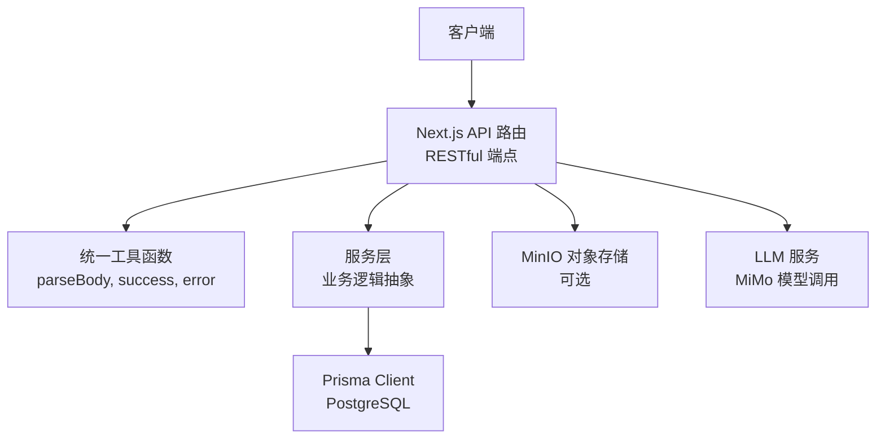
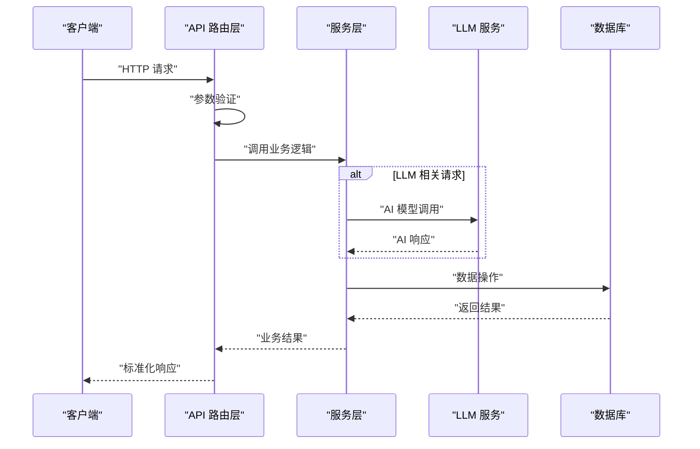
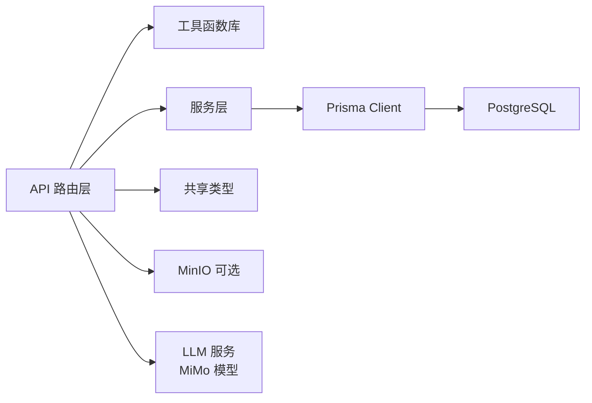
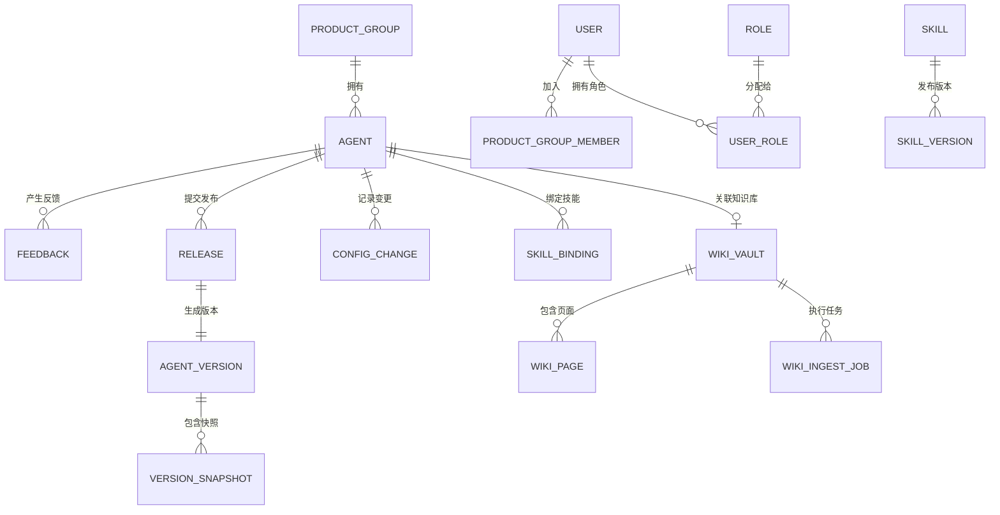

# API 接口文档

<cite>
**本文引用的文件**
- [apps/web/app/api/agents/route.ts](file://apps/web/app/api/agents/route.ts)
- [apps/web/app/api/agents/[id]/route.ts](file://apps/web/app/api/agents/[id]/route.ts)
- [apps/web/app/api/agents/[id]/chat/route.ts](file://apps/web/app/api/agents/[id]/chat/route.ts)
- [apps/web/app/api/agents/[id]/config/[partition]/route.ts](file://apps/web/app/api/agents/[id]/config/[partition]/route.ts)
- [apps/web/app/api/agents/[id]/config/[partition]/rollback/route.ts](file://apps/web/app/api/agents/[id]/config/[partition]/rollback/route.ts)
- [apps/web/app/api/agents/[id]/release/route.ts](file://apps/web/app/api/agents/[id]/release/route.ts)
- [apps/web/app/api/agents/[id]/skills/route.ts](file://apps/web/app/api/agents/[id]/skills/route.ts)
- [apps/web/app/api/agents/[id]/versions/route.ts](file://apps/web/app/api/agents/[id]/versions/route.ts)
- [apps/web/app/api/agents/[id]/versions/[versionId]/route.ts](file://apps/web/app/api/agents/[id]/versions/[versionId]/route.ts)
- [apps/web/app/api/agents/[id]/rollback/[versionId]/route.ts](file://apps/web/app/api/agents/[id]/rollback/[versionId]/route.ts)
- [apps/web/app/api/feedback/route.ts](file://apps/web/app/api/feedback/route.ts)
- [apps/web/app/api/feedback/[id]/insight/route.ts](file://apps/web/app/api/feedback/[id]/insight/route.ts)
- [apps/web/app/api/maas/probe/route.ts](file://apps/web/app/api/maas/probe/route.ts)
- [apps/web/app/api/releases/route.ts](file://apps/web/app/api/releases/route.ts)
- [apps/web/app/api/releases/[id]/review/route.ts](file://apps/web/app/api/releases/[id]/review/route.ts)
- [apps/web/app/api/releases/[id]/summary/route.ts](file://apps/web/app/api/releases/[id]/summary/route.ts)
- [apps/web/app/api/skills/route.ts](file://apps/web/app/api/skills/route.ts)
- [apps/web/app/api/skills/[id]/route.ts](file://apps/web/app/api/skills/[id]/route.ts)
- [apps/web/app/api/wiki/vaults/route.ts](file://apps/web/app/api/wiki/vaults/route.ts)
- [apps/web/app/api/wiki/vaults/[id]/route.ts](file://apps/web/app/api/wiki/vaults/[id]/route.ts)
- [apps/web/app/api/wiki/pages/[id]/route.ts](file://apps/web/app/api/wiki/pages/[id]/route.ts)
- [apps/web/app/api/settings/roles/route.ts](file://apps/web/app/api/settings/roles/route.ts)
- [apps/web/app/api/dashboard/route.ts](file://apps/web/app/api/dashboard/route.ts)
- [apps/web/lib/schemas.ts](file://apps/web/lib/schemas.ts)
- [apps/web/lib/services/llm-service.ts](file://apps/web/lib/services/llm-service.ts)
- [apps/web/lib/services/feedback-service.ts](file://apps/web/lib/services/feedback-service.ts)
</cite>

## 更新摘要
**变更内容**
- 新增了完整的API参考文档，记录了30个路由端点的详细响应格式和错误代码
- 增强了LLM集成相关API的文档说明，包括Agent试聊、反馈洞察分析、MaaS连通性检测和发布变更摘要
- 完善了数据验证规则和错误处理策略的详细描述
- 更新了客户端集成指南，包含新增功能的实现示例
- 补充了调试工具和监控方法的详细说明

## 目录
1. [简介](#简介)
2. [项目结构](#项目结构)
3. [核心组件](#核心组件)
4. [架构总览](#架构总览)
5. [详细组件分析](#详细组件分析)
6. [认证与授权](#认证与授权)
7. [数据验证与错误处理](#数据验证与错误处理)
8. [性能与安全考虑](#性能与安全考虑)
9. [客户端集成指南](#客户端集成指南)
10. [调试与监控](#调试与监控)
11. [版本兼容性](#版本兼容性)
12. [依赖分析](#依赖分析)
13. [故障排查指南](#故障排查指南)
14. [结论](#结论)
15. [附录](#附录)

## 简介
本文件为 Agent 改进平台的完整 RESTful API 接口文档。系统采用 Next.js App Router 架构，提供了全面的 Agent 生命周期管理、配置分区控制、版本发布审批、技能绑定管理、知识库操作以及系统设置等功能。**最新版本显著增强了 LLM 集成能力**，新增了 Agent 试聊、反馈洞察分析、MaaS 连通性检测和发布变更摘要等智能功能。所有接口遵循统一的响应格式和错误处理规范，支持分页查询、参数验证和权限控制。

## 项目结构
- Web 应用基于 Next.js App Router，API 路由位于 apps/web/app/api 下
- 使用 Prisma ORM 进行数据库操作，支持 PostgreSQL
- 统一的工具函数库提供请求解析、响应封装和分页处理
- 服务层抽象了业务逻辑，便于测试和维护
- 支持对象存储（MinIO）用于知识库快照和附件管理
- **新增**：LLM 服务集成，支持小米 MiMo 模型调用



**图表来源**
- [apps/web/app/api/agents/route.ts:1-43](file://apps/web/app/api/agents/route.ts#L1-L43)
- [apps/web/app/api/dashboard/route.ts:1-41](file://apps/web/app/api/dashboard/route.ts#L1-L41)
- [apps/web/lib/services/llm-service.ts:1-135](file://apps/web/lib/services/llm-service.ts#L1-L135)

## 核心组件
- **统一响应格式**：所有接口返回标准化的成功/错误响应结构
- **请求验证**：基于 Zod schema 的参数验证和类型检查
- **分页支持**：统一的分页参数处理和元数据返回
- **错误处理**：统一的错误码和消息格式
- **服务层抽象**：业务逻辑与路由层分离，便于维护和测试
- **版本管理**：完整的版本历史追踪和回滚机制
- **LLM 集成**：支持 Agent 试聊、反馈分析和发布摘要等智能功能

**章节来源**
- [apps/web/app/api/agents/route.ts:1-43](file://apps/web/app/api/agents/route.ts#L1-L43)
- [apps/web/app/api/feedback/route.ts:1-74](file://apps/web/app/api/feedback/route.ts#L1-L74)
- [apps/web/app/api/skills/route.ts:1-31](file://apps/web/app/api/skills/route.ts#L1-L31)
- [apps/web/lib/schemas.ts:241-252](file://apps/web/lib/schemas.ts#L241-L252)

## 架构总览
系统采用分层架构设计，API 路由层负责 HTTP 请求处理，服务层实现业务逻辑，数据访问层通过 Prisma 操作数据库。**新增的 LLM 集成层**通过统一的服务接口与外部 AI 模型交互，提供智能化的 Agent 测试和分析能力。所有接口遵循 RESTful 设计规范，支持标准的 CRUD 操作和资源关联。



**图表来源**
- [apps/web/app/api/agents/route.ts:1-43](file://apps/web/app/api/agents/route.ts#L1-L43)
- [apps/web/app/api/agents/[id]/route.ts:1-50](file://apps/web/app/api/agents/[id]/route.ts#L1-L50)
- [apps/web/lib/services/llm-service.ts:67-135](file://apps/web/lib/services/llm-service.ts#L67-L135)

## 详细组件分析

### Agent 管理接口

#### 获取 Agent 列表
- **方法**: GET
- **URL**: `/api/agents`
- **认证**: 需要
- **查询参数**:
  - `page`: 页码（默认 1）
  - `pageSize`: 每页数量（默认 20）
  - `status`: 状态过滤（ACTIVE/DRAFT/ARCHIVED）
  - `productGroupId`: 产品组 ID 过滤
  - `search`: 搜索关键词
- **响应**: 
  ```json
  {
    "success": true,
    "data": {
      "items": [...],
      "pagination": {
        "page": 1,
        "pageSize": 20,
        "total": 100
      }
    }
  }
  ```

#### 创建 Agent
- **方法**: POST
- **URL**: `/api/agents`
- **认证**: 需要
- **请求体**:
  ```json
  {
    "name": "string (必填)",
    "description": "string",
    "productGroupId": "string (必填)"
  }
  ```
- **响应**: 201 Created，返回新创建的 Agent 对象

#### 获取 Agent 详情
- **方法**: GET
- **URL**: `/api/agents/:id`
- **认证**: 需要
- **路径参数**: `id` (Agent 标识)
- **响应**: 返回 Agent 详细信息

#### 更新 Agent
- **方法**: PUT
- **URL**: `/api/agents/:id`
- **认证**: 需要
- **路径参数**: `id` (Agent 标识)
- **请求体**: 可更新的字段（name, description, status 等）
- **响应**: 返回更新后的 Agent 对象

#### 归档 Agent
- **方法**: DELETE
- **URL**: `/api/agents/:id`
- **认证**: 需要
- **路径参数**: `id` (Agent 标识)
- **响应**: 返回归档成功消息

**章节来源**
- [apps/web/app/api/agents/route.ts:1-43](file://apps/web/app/api/agents/route.ts#L1-L43)
- [apps/web/app/api/agents/[id]/route.ts:1-50](file://apps/web/app/api/agents/[id]/route.ts#L1-L50)

### Agent 试聊接口（新增）

#### Agent 实时对话
- **方法**: POST
- **URL**: `/api/agents/:id/chat`
- **认证**: 需要
- **路径参数**: `id` (Agent 标识)
- **请求体**:
  ```json
  {
    "message": "string (必填，最大4000字符)",
    "history": [
      {
        "role": "user|assistant (必填)",
        "content": "string (必填，最大8000字符)"
      }
    ]
  }
  ```
- **描述**: 加载 Agent 当前的 Prompt 分区配置作为 system prompt，携带前端会话历史调用 MiMo 模型进行真实对话。会话只存前端内存，不落库。
- **响应**:
  ```json
  {
    "success": true,
    "data": {
      "reply": "AI 回复内容",
      "model": "使用的模型名称",
      "usage": {
        "promptTokens": 100,
        "completionTokens": 50,
        "totalTokens": 150
      },
      "latencyMs": 1234
    }
  }
  ```

**章节来源**
- [apps/web/app/api/agents/[id]/chat/route.ts:1-61](file://apps/web/app/api/agents/[id]/chat/route.ts#L1-L61)
- [apps/web/lib/schemas.ts:241-252](file://apps/web/lib/schemas.ts#L241-L252)

### 配置分区管理接口

#### 获取分区配置
- **方法**: GET
- **URL**: `/api/agents/:id/config/:partition`
- **认证**: 需要
- **路径参数**:
  - `id`: Agent 标识
  - `partition`: 分区类型（prompt/knowledge/tools/routing）
- **响应**: 返回对应分区的配置 JSON

#### 更新分区配置
- **方法**: PUT
- **URL**: `/api/agents/:id/config/:partition`
- **认证**: 需要
- **路径参数**: 同上
- **请求体**: 对应分区的配置对象
- **特性**: 自动记录配置变更历史
- **响应**: 返回更新后的配置

**章节来源**
- [apps/web/app/api/agents/[id]/config/[partition]/route.ts:1-86](file://apps/web/app/api/agents/[id]/config/[partition]/route.ts#L1-L86)

### 版本管理接口

#### 获取 Agent 版本历史
- **方法**: GET
- **URL**: `/api/agents/:id/versions`
- **认证**: 需要
- **路径参数**: `id` (Agent 标识)
- **描述**: 返回该 Agent 的所有已发布版本，按发布时间倒序排列
- **响应**: 
  ```json
  {
    "success": true,
    "data": {
      "items": [
        {
          "id": "ver-002",
          "agentId": "ecs-assistant",
          "version": "0.2.0",
          "publishedAt": "2024-01-01T00:00:00Z",
          "promptSnapshot": {...},
          "knowledgeSnapshot": {...},
          "toolsSnapshot": {...},
          "routingSnapshot": {...}
        }
      ],
      "total": 2
    }
  }
  ```

#### 获取版本详情
- **方法**: GET
- **URL**: `/api/agents/:id/versions/:versionId`
- **认证**: 需要
- **路径参数**:
  - `id`: Agent 标识
  - `versionId`: 版本标识
- **描述**: 返回指定版本的详细信息，包含四个分区的完整快照
- **响应**: 返回版本对象的完整信息

#### 单分区回滚
- **方法**: POST
- **URL**: `/api/agents/:id/config/:partition/rollback`
- **认证**: 需要
- **路径参数**:
  - `id`: Agent 标识
  - `partition`: 分区类型（prompt/knowledge/tools/routing）
- **请求体**:
  ```json
  {
    "versionId": "string (必填)"
  }
  ```
- **描述**: 从指定版本的快照中恢复单个分区的配置
- **响应**: 
  ```json
  {
    "success": true,
    "data": {
      "partition": "prompt",
      "restoredFromVersion": "0.1.0",
      "config": {...}
    }
  }
  ```

#### 整版本回滚
- **方法**: POST
- **URL**: `/api/agents/:id/rollback/:versionId`
- **认证**: 需要
- **路径参数**:
  - `id`: Agent 标识
  - `versionId`: 目标版本标识
- **描述**: 将 Agent 的所有四个分区一次性回滚到指定版本
- **行为**:
  1. 覆盖 Agent 的四个 active config 为目标版本的 snapshot
  2. 写入一个 status=APPROVED 的 release（含 configSnapshot）做追溯
  3. 派生新 Version（版本号自增），确保历史快照不可变
  4. 写入 audit，action = "agent.rollback"
- **响应**: 
  ```json
  {
    "success": true,
    "data": {
      "release": {...},
      "version": {...},
      "restoredFrom": {
        "id": "ver-001",
        "version": "0.1.0"
      }
    }
  }
  ```

**章节来源**
- [apps/web/app/api/agents/[id]/versions/route.ts:1-44](file://apps/web/app/api/agents/[id]/versions/route.ts#L1-L44)
- [apps/web/app/api/agents/[id]/versions/[versionId]/route.ts:1-36](file://apps/web/app/api/agents/[id]/versions/[versionId]/route.ts#L1-L36)
- [apps/web/app/api/agents/[id]/config/[partition]/rollback/route.ts:1-118](file://apps/web/app/api/agents/[id]/config/[partition]/rollback/route.ts#L1-L118)
- [apps/web/app/api/agents/[id]/rollback/[versionId]/route.ts:1-37](file://apps/web/app/api/agents/[id]/rollback/[versionId]/route.ts#L1-L37)

### 发布管理接口

#### 提交发布
- **方法**: POST
- **URL**: `/api/agents/:id/release`
- **认证**: 需要（具备发布权限）
- **路径参数**: `id` (Agent 标识)
- **请求体**:
  ```json
  {
    "changeNote": "string (必填)"
  }
  ```
- **响应**: 201 Created，返回 Release 对象

#### 审批发布
- **方法**: PUT
- **URL**: `/api/agents/:id/release`
- **认证**: 需要（具备审批权限）
- **路径参数**: `id` (Agent 标识)
- **请求体**:
  ```json
  {
    "releaseId": "string (必填)",
    "action": "APPROVED|REJECTED|CHANGES_REQUESTED",
    "reviewComment": "string"
  }
  ```
- **响应**: 返回审批后的 Release 对象

#### 全局发布列表
- **方法**: GET
- **URL**: `/api/releases`
- **认证**: 需要
- **查询参数**:
  - `page`, `pageSize`: 分页参数
  - `status`: 状态过滤
  - `agentId`: Agent ID 过滤
- **响应**: 返回发布列表及分页信息

#### 发布变更摘要（新增）
- **方法**: POST
- **URL**: `/api/releases/:id/summary`
- **认证**: 需要
- **路径参数**: `id` (Release 标识)
- **描述**: 读取 Release 的 configSnapshot 与上一版本 baseline，让 MiMo 总结本次变更的影响面与风险点，辅助审批决策
- **响应**:
  ```json
  {
    "success": true,
    "data": {
      "releaseId": "rel-001",
      "summary": "本次变更主要修改了提示词配置...",
      "model": "mimo-v2.5-pro",
      "latencyMs": 2345
    }
  }
  ```

**章节来源**
- [apps/web/app/api/agents/[id]/release/route.ts:1-59](file://apps/web/app/api/agents/[id]/release/route.ts#L1-L59)
- [apps/web/app/api/releases/route.ts:1-32](file://apps/web/app/api/releases/route.ts#L1-L32)
- [apps/web/app/api/releases/[id]/review/route.ts:1-28](file://apps/web/app/api/releases/[id]/review/route.ts#L1-L28)
- [apps/web/app/api/releases/[id]/summary/route.ts:1-91](file://apps/web/app/api/releases/[id]/summary/route.ts#L1-L91)

### 反馈管理接口

#### 获取反馈列表
- **方法**: GET
- **URL**: `/api/feedback`
- **认证**: 需要
- **查询参数**:
  - `page`, `pageSize`: 分页参数
  - `agentId`: Agent ID 过滤
  - `status`: 状态过滤
  - `severity`: 严重程度过滤
  - `rating`: 评分过滤
  - `tag`: 标签过滤
- **响应**: 返回反馈列表及分页信息

#### 创建反馈
- **方法**: POST
- **URL**: `/api/feedback`
- **认证**: 需要
- **请求体**: 符合 FeedbackSchema 的反馈对象
- **响应**: 201 Created，返回创建的反馈对象

#### 更新反馈
- **方法**: PUT
- **URL**: `/api/feedback`
- **认证**: 需要
- **请求体**:
  ```json
  {
    "id": "string (必填)",
    "...其他可更新字段": "..."
  }
  ```
- **响应**: 返回更新后的反馈对象

#### 反馈洞察分析（新增）
- **方法**: POST
- **URL**: `/api/feedback/:id/insight`
- **认证**: 需要
- **路径参数**: `id` (Feedback 标识)
- **描述**: 读取反馈详情，调用 MiMo 生成「归因分析 + 改进建议」，服务 L2 环的「反馈 → 归因 → 改配置」叙事
- **响应**:
  ```json
  {
    "success": true,
    "data": {
      "feedbackId": "fb-001",
      "insight": "## 归因分析\n问题最可能出在 Prompt 分区...\n\n## 改进建议\n1. 优化系统提示词...",
      "model": "mimo-v2.5-pro",
      "latencyMs": 3456
    }
  }
  ```

**章节来源**
- [apps/web/app/api/feedback/route.ts:1-74](file://apps/web/app/api/feedback/route.ts#L1-L74)
- [apps/web/app/api/feedback/[id]/insight/route.ts:1-59](file://apps/web/app/api/feedback/[id]/insight/route.ts#L1-L59)
- [apps/web/lib/services/feedback-service.ts:1-163](file://apps/web/lib/services/feedback-service.ts#L1-L163)

### 技能管理接口

#### 获取技能列表
- **方法**: GET
- **URL**: `/api/skills`
- **认证**: 需要
- **查询参数**:
  - `page`, `pageSize`: 分页参数
  - `category`: 分类过滤
  - `status`: 状态过滤
  - `search`: 搜索关键词
- **响应**: 返回技能列表及分页信息

#### 创建技能
- **方法**: POST
- **URL**: `/api/skills`
- **认证**: 需要
- **请求体**: 符合技能创建 Schema 的对象
- **响应**: 201 Created，返回创建的技能对象

#### 获取技能详情
- **方法**: GET
- **URL**: `/api/skills/:id`
- **认证**: 需要
- **路径参数**: `id` (技能标识)
- **响应**: 返回技能详细信息

#### 更新技能
- **方法**: PUT
- **URL**: `/api/skills/:id`
- **认证**: 需要
- **路径参数**: `id` (技能标识)
- **请求体**: 可更新的技能字段
- **响应**: 返回更新后的技能对象

#### 归档技能
- **方法**: DELETE
- **URL**: `/api/skills/:id`
- **认证**: 需要
- **路径参数**: `id` (技能标识)
- **响应**: 返回归档成功消息

#### 管理 Agent 技能绑定
- **GET** `/api/agents/:id/skills` - 获取绑定的技能
- **POST** `/api/agents/:id/skills` - 绑定技能
- **DELETE** `/api/agents/:id/skills?agentId=...&skillId=...` - 解绑技能

**章节来源**
- [apps/web/app/api/skills/route.ts:1-31](file://apps/web/app/api/skills/route.ts#L1-L31)
- [apps/web/app/api/skills/[id]/route.ts:1-42](file://apps/web/app/api/skills/[id]/route.ts#L1-L42)
- [apps/web/app/api/agents/[id]/skills/route.ts:1-46](file://apps/web/app/api/agents/[id]/skills/route.ts#L1-L46)

### 知识库管理接口

#### 获取知识库列表
- **方法**: GET
- **URL**: `/api/wiki/vaults`
- **认证**: 需要
- **查询参数**:
  - `page`, `pageSize`: 分页参数
  - `agentId`: Agent ID 过滤
  - `shared`: 是否共享（true/false）
- **响应**: 返回知识库列表及分页信息

#### 创建知识库
- **方法**: POST
- **URL**: `/api/wiki/vaults`
- **认证**: 需要
- **请求体**:
  ```json
  {
    "name": "string (必填)",
    "description": "string",
    "agentId": "string",
    "gitRepoUrl": "string",
    "gitBranch": "string"
  }
  ```
- **响应**: 201 Created，返回创建的知识库对象

#### 知识库详情操作
- **GET** `/api/wiki/vaults/:id` - 获取知识库详情
- **PUT** `/api/wiki/vaults/:id` - 更新知识库
- **DELETE** `/api/wiki/vaults/:id` - 删除知识库

#### 页面管理
- **GET** `/api/wiki/pages/:id` - 获取页面详情
- **PUT** `/api/wiki/pages/:id` - 更新页面
- **DELETE** `/api/wiki/pages/:id` - 删除页面

**章节来源**
- [apps/web/app/api/wiki/vaults/route.ts:1-30](file://apps/web/app/api/wiki/vaults/route.ts#L1-L30)
- [apps/web/app/api/wiki/vaults/[id]/route.ts:1-33](file://apps/web/app/api/wiki/vaults/[id]/route.ts#L1-L33)
- [apps/web/app/api/wiki/pages/[id]/route.ts:1-33](file://apps/web/app/api/wiki/pages/[id]/route.ts#L1-L33)

### MaaS 连通性检测接口（新增）

#### 获取 LLM 配置状态
- **方法**: GET
- **URL**: `/api/maas/probe`
- **认证**: 不需要
- **描述**: 返回 LLM 配置状态（不发真实请求）
- **响应**:
  ```json
  {
    "success": true,
    "data": {
      "configured": true,
      "model": "mimo-v2.5-pro",
      "baseUrl": "https://token-plan-cn.xiaomimimo.com/v1"
    }
  }
  ```

#### 测试 LLM 连通性
- **方法**: POST
- **URL**: `/api/maas/probe`
- **认证**: 不需要
- **描述**: 真实调用 MiMo 验证连通性，返回模型/时延/tokens
- **响应**:
  ```json
  {
    "success": true,
    "data": {
      "connected": true,
      "model": "mimo-v2.5-pro",
      "reply": "连接正常，我是 mimo-v2.5-pro 模型",
      "usage": {
        "promptTokens": 50,
        "completionTokens": 20,
        "totalTokens": 70
      },
      "latencyMs": 1234
    }
  }
  ```

**章节来源**
- [apps/web/app/api/maas/probe/route.ts:1-46](file://apps/web/app/api/maas/probe/route.ts#L1-L46)
- [apps/web/lib/services/llm-service.ts:55-65](file://apps/web/lib/services/llm-service.ts#L55-L65)

### 系统设置接口

#### 角色管理
- **GET** `/api/settings/roles` - 获取所有角色
- **POST** `/api/settings/roles` - 创建新角色
- **GET** `/api/settings/roles/:id` - 获取角色详情
- **PUT** `/api/settings/roles/:id` - 更新角色
- **DELETE** `/api/settings/roles/:id` - 删除角色

#### 权限管理
- **GET** `/api/settings/permissions` - 获取所有权限
- **POST** `/api/settings/permissions` - 创建权限
- **PUT** `/api/settings/permissions/:id` - 更新权限

#### 产品组管理
- **GET** `/api/settings/product-groups` - 获取产品组列表
- **POST** `/api/settings/product-groups` - 创建产品组
- **PUT** `/api/settings/product-groups/:id` - 更新产品组

#### 审计日志
- **GET** `/api/settings/audit-logs` - 获取审计日志
- **查询参数**: 支持按时间范围、用户、操作类型过滤

**章节来源**
- [apps/web/app/api/settings/roles/route.ts:1-39](file://apps/web/app/api/settings/roles/route.ts#L1-L39)

### 工作台统计接口

#### 获取统计数据
- **方法**: GET
- **URL**: `/api/dashboard`
- **认证**: 需要
- **响应**:
  ```json
  {
    "success": true,
    "data": {
      "agents": {
        "total": 100,
        "active": 85
      },
      "feedback": {
        "total": 500,
        "pending": 25
      },
      "releases": {
        "pending": 10
      },
      "recentFeedback": [...],
      "recentReleases": [...]
    }
  }
  ```

**章节来源**
- [apps/web/app/api/dashboard/route.ts:1-41](file://apps/web/app/api/dashboard/route.ts#L1-L41)

## 认证与授权

### 认证机制
- **方式**: Bearer Token（JWT）或会话 Cookie
- **头信息**: `Authorization: Bearer <token>`
- **适用范围**: 所有写操作和部分读操作

### 授权模型
- **基于角色的访问控制（RBAC）**
- **角色类型**:
  - `PLATFORM_ADMIN`: 平台管理员
  - `PRODUCT_LEAD`: 产品负责人
  - `PRODUCT_MEMBER`: 产品成员
  - `SKILL_DEVELOPER`: 技能开发者
  - `KNOWLEDGE_EDITOR`: 知识编辑者
  - `AUDITOR`: 审计员
  - `CRE_VIEWER`: 只读查看者

### 权限动作
- `read`: 读取权限
- `write`: 写入权限
- `publish`: 发布权限
- `approve`: 审批权限
- `rollback`: 回滚权限
- `delete`: 删除权限
- `admin`: 管理权限

### 作用域控制
- `own_group`: 仅自己所在组
- `cross_group`: 跨组访问
- `global`: 全局访问

**章节来源**
- [apps/web/app/api/settings/roles/route.ts:1-39](file://apps/web/app/api/settings/roles/route.ts#L1-L39)

## 数据验证与错误处理

### 统一响应格式
```json
{
  "success": true,
  "data": {...},
  "message": "操作成功",
  "timestamp": "2024-01-01T00:00:00Z"
}
```

### 错误响应格式
```json
{
  "success": false,
  "error": {
    "code": "VALIDATION_ERROR",
    "message": "参数校验失败",
    "details": ["字段A不能为空", "字段B格式不正确"]
  },
  "timestamp": "2024-01-01T00:00:00Z"
}
```

### 标准状态码
- `200`: 成功
- `201`: 创建成功
- `400`: 请求参数错误
- `401`: 未认证
- `403`: 无权限
- `404`: 资源不存在
- `409`: 资源冲突
- `500`: 服务器内部错误

### 输入验证规则
- **必填字段**: 使用 Zod schema 定义
- **类型检查**: 严格的 TypeScript 类型约束
- **格式验证**: 邮箱、URL、日期等格式验证
- **业务规则**: 自定义验证逻辑

**章节来源**
- [apps/web/app/api/agents/route.ts:1-43](file://apps/web/app/api/agents/route.ts#L1-L43)
- [apps/web/app/api/feedback/route.ts:1-74](file://apps/web/app/api/feedback/route.ts#L1-L74)
- [apps/web/lib/schemas.ts:1-276](file://apps/web/lib/schemas.ts#L1-L276)

## 性能与安全考虑

### 性能优化
- **数据库索引**: 针对高频查询字段建立索引
- **分页查询**: 所有列表接口支持分页
- **缓存策略**: 对只读配置使用短期缓存
- **并发控制**: 外部依赖调用设置超时和重试上限
- **LLM 优化**: 合理的 maxCompletionTokens 设置避免空响应

### 安全措施
- **HTTPS 强制**: 生产环境强制 HTTPS
- **最小权限原则**: 仅授予必要权限
- **输入输出验证**: 严格的参数验证和转义
- **敏感信息脱敏**: 审计日志中的敏感信息脱敏
- **防重放攻击**: 必要时引入时间戳和签名
- **LLM 安全**: 环境变量管理 API Key，防止硬编码

### 速率限制
- **默认限制**: 100 次/分钟（可配置）
- **维度**: 按 IP 或用户维度限流
- **实施位置**: 网关或中间件层

## 客户端集成指南

### 基础配置
```javascript
const API_BASE_URL = 'http://localhost:3000';
const AUTH_TOKEN = 'your-jwt-token';

const headers = {
  'Content-Type': 'application/json',
  'Authorization': `Bearer ${AUTH_TOKEN}`
};
```

### 常用操作示例
```javascript
// 获取 Agent 列表
async function getAgents(page = 1, pageSize = 20) {
  const response = await fetch(
    `${API_BASE_URL}/api/agents?page=${page}&pageSize=${pageSize}`,
    { headers }
  );
  return response.json();
}

// 创建 Agent
async function createAgent(agentData) {
  const response = await fetch(`${API_BASE_URL}/api/agents`, {
    method: 'POST',
    headers,
    body: JSON.stringify(agentData)
  });
  return response.json();
}

// 更新配置分区
async function updateConfigPartition(agentId, partition, config) {
  const response = await fetch(
    `${API_BASE_URL}/api/agents/${agentId}/config/${partition}`,
    {
      method: 'PUT',
      headers,
      body: JSON.stringify(config)
    }
  );
  return response.json();
}

// 获取版本历史
async function getVersions(agentId) {
  const response = await fetch(
    `${API_BASE_URL}/api/agents/${agentId}/versions`,
    { headers }
  );
  return response.json();
}

// 单分区回滚
async function rollbackPartition(agentId, partition, versionId) {
  const response = await fetch(
    `${API_BASE_URL}/api/agents/${agentId}/config/${partition}/rollback`,
    {
      method: 'POST',
      headers,
      body: JSON.stringify({ versionId })
    }
  );
  return response.json();
}

// 整版本回滚
async function rollbackAgent(agentId, versionId) {
  const response = await fetch(
    `${API_BASE_URL}/api/agents/${agentId}/rollback/${versionId}`,
    {
      method: 'POST',
      headers
    }
  );
  return response.json();
}

// Agent 试聊（新增）
async function chatWithAgent(agentId, message, history = []) {
  const response = await fetch(
    `${API_BASE_URL}/api/agents/${agentId}/chat`,
    {
      method: 'POST',
      headers,
      body: JSON.stringify({ message, history })
    }
  );
  return response.json();
}

// 反馈洞察分析（新增）
async function getFeedbackInsight(feedbackId) {
  const response = await fetch(
    `${API_BASE_URL}/api/feedback/${feedbackId}/insight`,
    {
      method: 'POST',
      headers
    }
  );
  return response.json();
}

// MaaS 连通性检测（新增）
async function probeMaaS() {
  const response = await fetch(
    `${API_BASE_URL}/api/maas/probe`,
    { method: 'POST' }
  );
  return response.json();
}

// 发布变更摘要（新增）
async function getReleaseSummary(releaseId) {
  const response = await fetch(
    `${API_BASE_URL}/api/releases/${releaseId}/summary`,
    {
      method: 'POST',
      headers
    }
  );
  return response.json();
}
```

### 错误处理
```javascript
async function handleApiError(response) {
  if (!response.ok) {
    const errorData = await response.json();
    throw new Error(errorData.error.message);
  }
  return response.json();
}
```

## 调试与监控

### 本地开发
```bash
# 启动数据库和服务
docker compose up

# 生成 Prisma 客户端
pnpm db:generate

# 运行开发服务器
pnpm dev
```

### 日志监控
- **Prisma 日志**: 开发环境启用 query/error/warn
- **审计日志**: 通过 AuditLog 表记录关键操作
- **健康检查**: PostgreSQL 和 MinIO 均提供 healthcheck
- **LLM 日志**: 监控模型调用状态和性能指标

### 调试工具
- **浏览器网络面板**: 查看请求和响应详情
- **curl 命令**: 快速测试 API 端点
- **Postman**: 构建测试集合和自动化测试

## 版本兼容性

### API 版本管理
- **当前版本**: 0.1.0
- **版本标识**: 通过 URL 前缀或 Header 声明
- **向后兼容**: 新增字段应为可选，删除字段需废弃流程

### 迁移策略
- **渐进式升级**: 支持多版本并行
- **废弃通知**: 通过响应头提供 Deprecation 信息
- **迁移工具**: 提供版本迁移脚本

## 依赖分析

### 外部依赖
- **PostgreSQL**: 关系型数据库
- **MinIO**: S3 兼容对象存储（可选）
- **Prisma**: ORM 和数据迁移工具
- **小米 MiMo**: LLM 推理模型服务

### 内部依赖
- **Next.js**: React 全栈框架
- **Zod**: 运行时类型验证
- **共享类型**: @agent-up/shared 包



**图表来源**
- [apps/web/app/api/agents/route.ts:1-43](file://apps/web/app/api/agents/route.ts#L1-L43)
- [apps/web/app/api/dashboard/route.ts:1-41](file://apps/web/app/api/dashboard/route.ts#L1-L41)
- [apps/web/lib/services/llm-service.ts:1-135](file://apps/web/lib/services/llm-service.ts#L1-L135)

## 故障排查指南

### 常见问题
- **数据库连接失败**: 检查 DATABASE_URL 和容器健康状态
- **对象存储不可用**: 确认 MinIO 端口和凭据
- **权限不足**: 核对用户角色和作用域
- **验证失败**: 检查请求体结构和数据类型
- **LLM 连接失败**: 检查 MIMO_API_KEY 环境变量和网络连通性

### 定位手段
- **查看 Prisma 日志**: 开发模式启用详细日志
- **检索审计日志**: 通过 AuditLog 表追踪关键操作
- **网络面板调试**: 使用浏览器开发者工具复现问题
- **API 测试工具**: 使用 Postman 或 curl 独立测试端点
- **LLM 诊断**: 使用 /api/maas/probe 端点检测连通性

## 结论
本 API 文档基于 Next.js App Router 架构，提供了完整的 RESTful 接口规范。系统已实现 Agent 生命周期管理、配置分区控制、版本发布审批、技能绑定管理、知识库操作和系统设置等核心功能。**最新版本显著增强了 LLM 集成能力**，新增了 Agent 试聊、反馈洞察分析、MaaS 连通性检测和发布变更摘要等智能功能，为 Agent 配置管理和优化提供了强大的 AI 驱动工具链。这些新功能使得平台能够更好地支持 Agent 的开发、测试、监控和优化全流程。

## 附录

### 数据模型关系图


### API 端点总览
| 模块 | 方法 | 端点 | 描述 |
|------|------|------|------|
| Agent | GET | /api/agents | 获取 Agent 列表 |
| Agent | POST | /api/agents | 创建 Agent |
| Agent | GET | /api/agents/:id | 获取 Agent 详情 |
| Agent | PUT | /api/agents/:id | 更新 Agent |
| Agent | DELETE | /api/agents/:id | 归档 Agent |
| Agent Chat | POST | /api/agents/:id/chat | Agent 试聊（新增） |
| Config | GET | /api/agents/:id/config/:partition | 获取分区配置 |
| Config | PUT | /api/agents/:id/config/:partition | 更新分区配置 |
| Config | POST | /api/agents/:id/config/:partition/rollback | 单分区回滚 |
| Version | GET | /api/agents/:id/versions | 获取版本历史 |
| Version | GET | /api/agents/:id/versions/:versionId | 获取版本详情 |
| Rollback | POST | /api/agents/:id/rollback/:versionId | 整版本回滚 |
| Release | POST | /api/agents/:id/release | 提交发布 |
| Release | PUT | /api/agents/:id/release | 审批发布 |
| Release Summary | POST | /api/releases/:id/summary | 发布变更摘要（新增） |
| Release | GET | /api/releases | 获取发布列表 |
| Feedback | GET | /api/feedback | 获取反馈列表 |
| Feedback | POST | /api/feedback | 创建反馈 |
| Feedback | PUT | /api/feedback | 更新反馈 |
| Feedback Insight | POST | /api/feedback/:id/insight | 反馈洞察分析（新增） |
| Skill | GET | /api/skills | 获取技能列表 |
| Skill | POST | /api/skills | 创建技能 |
| Skill | GET | /api/skills/:id | 获取技能详情 |
| Skill | PUT | /api/skills/:id | 更新技能 |
| Skill | DELETE | /api/skills/:id | 归档技能 |
| Wiki | GET | /api/wiki/vaults | 获取知识库列表 |
| Wiki | POST | /api/wiki/vaults | 创建知识库 |
| Wiki | GET | /api/wiki/vaults/:id | 获取知识库详情 |
| Wiki | PUT | /api/wiki/vaults/:id | 更新知识库 |
| Wiki | DELETE | /api/wiki/vaults/:id | 删除知识库 |
| Wiki | GET | /api/wiki/pages/:id | 获取页面详情 |
| Wiki | PUT | /api/wiki/pages/:id | 更新页面 |
| Wiki | DELETE | /api/wiki/pages/:id | 删除页面 |
| Settings | GET | /api/settings/roles | 获取角色列表 |
| Settings | POST | /api/settings/roles | 创建角色 |
| Dashboard | GET | /api/dashboard | 获取统计数据 |
| MaaS Probe | GET | /api/maas/probe | 获取 LLM 配置状态（新增） |
| MaaS Probe | POST | /api/maas/probe | 测试 LLM 连通性（新增） |

### LLM 集成特性说明

#### Agent 试聊功能
- **实时对话**: 基于 Agent 当前配置的 Prompt 分区进行真实对话
- **会话历史**: 支持多轮对话，历史消息仅存储在客户端内存
- **配置组装**: 自动组合 systemPrompt、角色定义、约束条件和输出格式
- **性能监控**: 返回模型使用情况和响应延迟

#### 反馈洞察分析
- **智能归因**: 基于 LLM 分析反馈问题的根本原因
- **分区定位**: 识别问题最可能出现在哪个配置分区
- **改进建议**: 生成具体的配置优化建议
- **无状态处理**: 分析过程不持久化，保护用户隐私

#### MaaS 连通性检测
- **配置检查**: 验证 LLM 服务配置是否正确
- **连通性测试**: 实际调用模型验证网络连接
- **性能指标**: 返回模型信息和响应延迟
- **错误诊断**: 提供详细的错误信息帮助排查问题

#### 发布变更摘要
- **智能对比**: 自动对比变更前后配置差异
- **影响分析**: 评估变更对 Agent 行为的潜在影响
- **风险评估**: 识别可能的风险和注意事项
- **审批辅助**: 为发布审批提供智能化决策支持

**章节来源**
- [apps/web/app/api/agents/[id]/chat/route.ts:1-61](file://apps/web/app/api/agents/[id]/chat/route.ts#L1-L61)
- [apps/web/app/api/feedback/[id]/insight/route.ts:1-59](file://apps/web/app/api/feedback/[id]/insight/route.ts#L1-L59)
- [apps/web/app/api/maas/probe/route.ts:1-46](file://apps/web/app/api/maas/probe/route.ts#L1-L46)
- [apps/web/app/api/releases/[id]/summary/route.ts:1-91](file://apps/web/app/api/releases/[id]/summary/route.ts#L1-L91)
- [apps/web/lib/services/llm-service.ts:1-135](file://apps/web/lib/services/llm-service.ts#L1-L135)