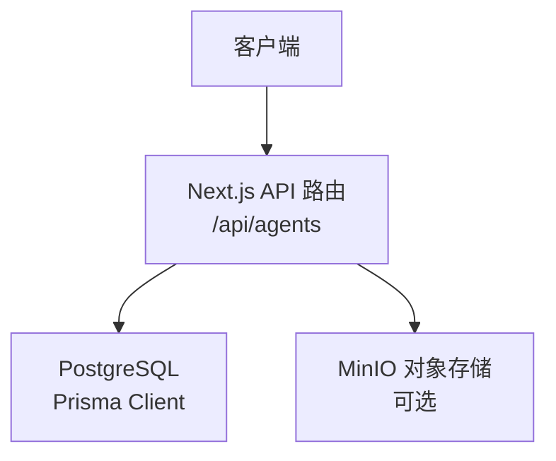
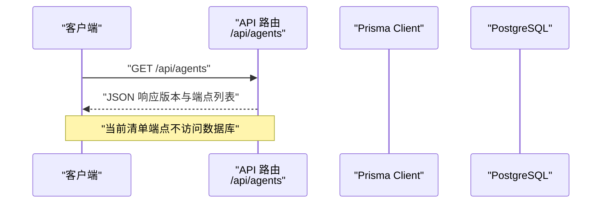
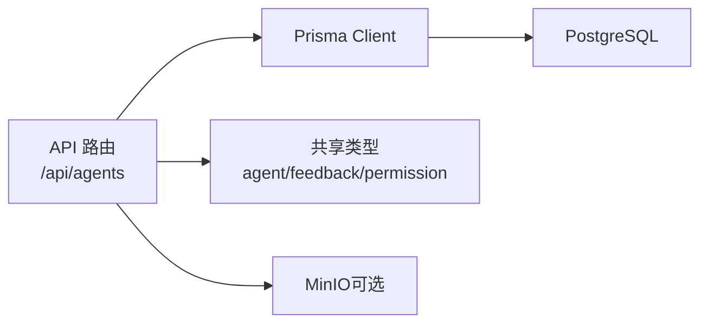
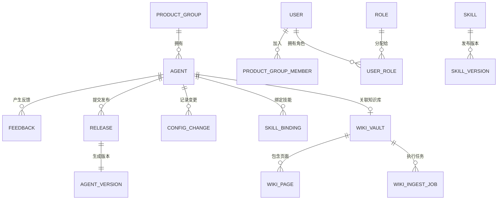

# API 接口文档

<cite>
**本文引用的文件**
- [apps/web/app/api/agents/route.ts](file://apps/web/app/api/agents/route.ts)
- [apps/web/prisma/schema.prisma](file://apps/web/prisma/schema.prisma)
- [packages/shared/src/types/agent.ts](file://packages/shared/src/types/agent.ts)
- [packages/shared/src/types/feedback.ts](file://packages/shared/src/types/feedback.ts)
- [packages/shared/src/types/permission.ts](file://packages/shared/src/types/permission.ts)
- [apps/web/lib/prisma.ts](file://apps/web/lib/prisma.ts)
- [docker-compose.yml](file://docker-compose.yml)
</cite>

## 目录
1. [简介](#简介)
2. [项目结构](#项目结构)
3. [核心组件](#核心组件)
4. [架构总览](#架构总览)
5. [详细组件分析](#详细组件分析)
6. [依赖分析](#依赖分析)
7. [性能考虑](#性能考虑)
8. [故障排查指南](#故障排查指南)
9. [结论](#结论)
10. [附录](#附录)

## 简介
本文件为 Agent 改进平台的 RESTful API 接口文档。当前仓库已暴露一个统一的 API 清单端点，用于描述可用的 Agent 相关接口路径；同时通过数据库模型与共享类型定义，明确了数据实体、配置分区、权限角色等关键概念，为后续实现具体业务接口提供契约基础。

## 项目结构
- Web 应用基于 Next.js，API 路由位于 apps/web/app/api 下。
- 数据库模型使用 Prisma，位于 apps/web/prisma/schema.prisma。
- 共享类型定义位于 packages/shared/src/types，涵盖 Agent、反馈、权限等。
- 运行时依赖包括 PostgreSQL 与 MinIO（对象存储），由 docker-compose.yml 编排。

图表来源
- [apps/web/app/api/agents/route.ts:1-18](file://apps/web/app/api/agents/route.ts#L1-L18)
- [apps/web/lib/prisma.ts:1-16](file://apps/web/lib/prisma.ts#L1-L16)
- [docker-compose.yml:1-39](file://docker-compose.yml#L1-L39)

章节来源
- [apps/web/app/api/agents/route.ts:1-18](file://apps/web/app/api/agents/route.ts#L1-L18)
- [apps/web/lib/prisma.ts:1-16](file://apps/web/lib/prisma.ts#L1-L16)
- [docker-compose.yml:1-39](file://docker-compose.yml#L1-L39)

## 核心组件
- API 清单端点：GET /api/agents，返回当前版本与可用端点列表。
- 数据模型：Agent、四分区配置（Prompt/Knowledge/Tools/Routing）、发布与版本、反馈、技能绑定、知识库、审计日志等。
- 权限与角色：平台管理员、产品负责人、成员、技能开发者、知识编辑、审计员、只读查看者等角色及动作范围。

章节来源
- [apps/web/app/api/agents/route.ts:1-18](file://apps/web/app/api/agents/route.ts#L1-L18)
- [apps/web/prisma/schema.prisma:61-91](file://apps/web/prisma/schema.prisma#L61-L91)
- [apps/web/prisma/schema.prisma:103-173](file://apps/web/prisma/schema.prisma#L103-L173)
- [apps/web/prisma/schema.prisma:192-214](file://apps/web/prisma/schema.prisma#L192-L214)
- [apps/web/prisma/schema.prisma:298-354](file://apps/web/prisma/schema.prisma#L298-L354)
- [apps/web/prisma/schema.prisma:360-440](file://apps/web/prisma/schema.prisma#L360-L440)
- [apps/web/prisma/schema.prisma:446-557](file://apps/web/prisma/schema.prisma#L446-L557)
- [apps/web/prisma/schema.prisma:563-625](file://apps/web/prisma/schema.prisma#L563-L625)
- [packages/shared/src/types/agent.ts:1-61](file://packages/shared/src/types/agent.ts#L1-L61)
- [packages/shared/src/types/feedback.ts:1-61](file://packages/shared/src/types/feedback.ts#L1-L61)
- [packages/shared/src/types/permission.ts:1-36](file://packages/shared/src/types/permission.ts#L1-L36)

## 架构总览
系统采用前后端同仓的 Next.js 应用，API 层通过 Prisma 访问 PostgreSQL，并可选择使用 MinIO 进行对象存储（如知识库快照、附件）。

图表来源
- [apps/web/app/api/agents/route.ts:1-18](file://apps/web/app/api/agents/route.ts#L1-L18)
- [apps/web/lib/prisma.ts:1-16](file://apps/web/lib/prisma.ts#L1-L16)

## 详细组件分析

### API 清单端点
- 方法：GET
- URL：/api/agents
- 认证：当前未强制
- 请求参数：无
- 响应格式：JSON
  - message：字符串
  - version：字符串（语义化版本）
  - endpoints：字符串数组，列出可用端点
- 状态码：200（成功）

示例请求
- GET http://localhost:3000/api/agents

示例响应
- {
    "message": "Agent API",
    "version": "0.1.0",
    "endpoints": [
      "GET /api/agents",
      "POST /api/agents",
      "GET /api/agents/:id",
      "PUT /api/agents/:id",
      "GET /api/agents/:id/config/:partition",
      "PUT /api/agents/:id/config/:partition",
      "POST /api/agents/:id/submit-release",
      "POST /api/agents/:id/rollback/:versionId"
    ]
  }

错误场景
- 404：当路由不存在时
- 500：服务器内部错误（例如依赖服务不可用）

章节来源
- [apps/web/app/api/agents/route.ts:1-18](file://apps/web/app/api/agents/route.ts#L1-L18)

### 待实现的 Agent 管理端点（规划）
以下端点在清单中声明，但尚未在代码中实现具体逻辑。以下为建议的契约规范，供后续开发对齐。

- 创建 Agent
  - 方法：POST
  - URL：/api/agents
  - 认证：需要（见“认证与授权”）
  - 请求体字段：
    - name：必填，字符串
    - description：可选，字符串
    - productGroupId：必填，字符串
    - createdBy：必填，字符串（来自认证上下文）
  - 响应：201 Created，返回新创建的 Agent 对象
  - 验证规则：name 非空且长度合理；productGroupId 存在；createdBy 有效用户 ID
  - 错误码：400（参数校验失败）、401（未认证）、403（无权限）、409（重复或冲突）

- 获取 Agent 详情
  - 方法：GET
  - URL：/api/agents/:id
  - 认证：需要
  - 路径参数：id（字符串）
  - 响应：200 OK，返回 Agent 对象
  - 错误码：404（未找到）、401/403（鉴权失败）

- 更新 Agent
  - 方法：PUT
  - URL：/api/agents/:id
  - 认证：需要
  - 路径参数：id（字符串）
  - 请求体字段：可更新的 Agent 字段（如 name、description、status 等）
  - 响应：200 OK，返回更新后的 Agent 对象
  - 错误码：400/404/401/403

- 读取分区配置
  - 方法：GET
  - URL：/api/agents/:id/config/:partition
  - 认证：需要
  - 路径参数：
    - id：Agent 标识
    - partition：PROMPT | KNOWLEDGE | TOOLS | ROUTING
  - 响应：200 OK，返回对应分区的配置 JSON
  - 错误码：400（无效分区）、404（未找到）

- 更新分区配置
  - 方法：PUT
  - URL：/api/agents/:id/config/:partition
  - 认证：需要
  - 路径参数：同上
  - 请求体：对应分区的配置 JSON
  - 响应：200 OK，返回更新后的配置
  - 变更追踪：写入 ConfigChange 记录（含 before/after/diff）
  - 错误码：400/404/401/403

- 提交发布
  - 方法：POST
  - URL：/api/agents/:id/submit-release
  - 认证：需要（具备 publish 或 approve 权限）
  - 请求体：
    - changeNote：必填，字符串
    - changedPartitions：必填，ConfigPartition[]
    - configSnapshot：可选，JSON（全量配置快照）
  - 响应：201 Created，返回 Release 对象
  - 错误码：400/401/403/404

- 回滚到指定版本
  - 方法：POST
  - URL：/api/agents/:id/rollback/:versionId
  - 认证：需要（具备 rollback 权限）
  - 路径参数：
    - id：Agent 标识
    - versionId：目标版本标识
  - 响应：200 OK，返回执行结果
  - 错误码：400/401/403/404

说明
- 上述端点的状态码、错误处理策略遵循通用约定：
  - 2xx：成功
  - 400：请求参数或校验失败
  - 401：未认证
  - 403：无权限
  - 404：资源不存在
  - 409：冲突（如唯一约束）
  - 500：服务器内部错误

章节来源
- [apps/web/app/api/agents/route.ts:1-18](file://apps/web/app/api/agents/route.ts#L1-L18)
- [apps/web/prisma/schema.prisma:192-214](file://apps/web/prisma/schema.prisma#L192-L214)
- [apps/web/prisma/schema.prisma:298-354](file://apps/web/prisma/schema.prisma#L298-L354)

### 数据模型与类型契约
- Agent 核心
  - 关键字段：id、name、description、productGroupId、status、createdAt、updatedAt、createdBy
  - 状态枚举：DRAFT、ACTIVE、ARCHIVED
- 四分区配置
  - PromptConfig：systemPrompt、roleDefinition、constraints、outputFormat、version、lastModifiedBy、lastModifiedAt
  - KnowledgeConfig：wikiVaultId、searchStrategy、fallbackToMcp、maxWikiResults、confidenceThreshold、lastSyncAt、syncStatus、version、lastModifiedBy、lastModifiedAt
  - ToolsConfig：mcpTools、wikiQueryTools、maxConcurrentCalls、timeoutMs、retryCount、version、lastModifiedBy、lastModifiedAt
  - RoutingConfig：rules、escalationPolicy、humanThreshold、maxConversationTurns、idleTimeoutMinutes、version、lastModifiedBy、lastModifiedAt
- 配置变更记录
  - ConfigChange：agentId、partition、before、after、diff、changedBy、changedAt、changeNote、releaseId
- 发布与版本
  - Release：agentId、changeNote、changedPartitions、status、submittedBy、submittedAt、approvedBy、approvedAt、reviewComment、configSnapshot
  - AgentVersion：agentId、version、major/minor/patch、各分区快照、releaseId、wikiCommitSha、publishedAt、publishedBy、changeNote、effectivenessReport
- 反馈
  - Feedback：agentId、source、title、content、sessionData、rating、tags、severity、status、assignedTo/By、resolvedAt/By、resolution、releaseId、ingestJobId、targetPartition、submittedBy/At、verifiedAt/By、verificationNote
- 技能与绑定
  - Skill：name、displayName、description、category、triggerPatterns、inputSchema、outputSchema、runtime、endpoint、codeRef、version、dependencies、permissions、status、publishedAt、downloadCount、authorId/Name
  - AgentSkillBinding：agentId、skillId、config、enabled、priority、allowedScopes、boundAt、boundBy
- 知识库
  - WikiVault：name、description、agentId、gitRepoUrl、gitBranch、lastCommitSha、pageCount、avgConfidence、orphanCount、isShared、sharedBy
  - WikiPage：vaultId、title、slug、content、summary、provenance、lifecycle、tier、baseConfidence、sourceRefs、wikilinks、categories、tags、filePath、lastCommitSha、inboundLinks、outboundLinks、reviewedAt/By
  - WikiIngestJob：vaultId、jobType、sourceType/sourceId/sourceContent/sourceUrl、generatedPageIds、status、result、error、startedAt/completedAt、triggeredBy
- 权限与审计
  - Role、Permission、RolePermission、UserRole、AuditLog

章节来源
- [apps/web/prisma/schema.prisma:61-91](file://apps/web/prisma/schema.prisma#L61-L91)
- [apps/web/prisma/schema.prisma:103-173](file://apps/web/prisma/schema.prisma#L103-L173)
- [apps/web/prisma/schema.prisma:192-214](file://apps/web/prisma/schema.prisma#L192-L214)
- [apps/web/prisma/schema.prisma:298-354](file://apps/web/prisma/schema.prisma#L298-L354)
- [apps/web/prisma/schema.prisma:360-440](file://apps/web/prisma/schema.prisma#L360-L440)
- [apps/web/prisma/schema.prisma:446-557](file://apps/web/prisma/schema.prisma#L446-L557)
- [apps/web/prisma/schema.prisma:563-625](file://apps/web/prisma/schema.prisma#L563-L625)
- [packages/shared/src/types/agent.ts:1-61](file://packages/shared/src/types/agent.ts#L1-L61)
- [packages/shared/src/types/feedback.ts:1-61](file://packages/shared/src/types/feedback.ts#L1-L61)

### 认证与授权机制
- 认证方式：建议使用 Bearer Token（JWT）或会话 Cookie，所有写操作需携带凭证。
- 授权模型：基于角色的访问控制（RBAC），支持组级与全局作用域。
- 角色类型：PLATFORM_ADMIN、PRODUCT_LEAD、PRODUCT_MEMBER、SKILL_DEVELOPER、KNOWLEDGE_EDITOR、AUDITOR、CRE_VIEWER
- 动作范围：read、write、publish、approve、rollback、delete、admin
- 作用域：own_group、cross_group、global
- 审计日志：记录 action、resource、resourceId、userId、userName、userRole、details、ipAddress、userAgent、createdAt

章节来源
- [packages/shared/src/types/permission.ts:1-36](file://packages/shared/src/types/permission.ts#L1-L36)
- [apps/web/prisma/schema.prisma:563-625](file://apps/web/prisma/schema.prisma#L563-L625)

### 数据验证规则与错误处理策略
- 输入验证
  - 必填字段校验（如 name、productGroupId、createdBy）
  - 枚举值校验（如 status、partition、rating、severity、source 等）
  - JSON 结构校验（配置分区、快照、工具配置等）
- 错误处理
  - 统一错误响应结构：包含 code、message、details（可选）
  - 常见状态码：400、401、403、404、409、500
  - 幂等性：对提交发布与回滚等操作建议支持幂等键（idempotency-key）

章节来源
- [apps/web/prisma/schema.prisma:103-173](file://apps/web/prisma/schema.prisma#L103-L173)
- [apps/web/prisma/schema.prisma:298-354](file://apps/web/prisma/schema.prisma#L298-L354)
- [packages/shared/src/types/feedback.ts:1-61](file://packages/shared/src/types/feedback.ts#L1-L61)

### 速率限制与安全考虑
- 速率限制：建议在网关或中间件层实施，按 IP 或用户维度限流，默认建议 100 次/分钟（可配置）。
- 安全建议
  - 强制 HTTPS
  - 最小权限原则（仅授予必要角色与动作）
  - 敏感信息脱敏（审计日志中的 details）
  - 输入输出严格校验与转义
  - 防重放攻击（必要时引入时间戳与签名）

[本节为通用指导，无需源码引用]

### 版本兼容性
- API 版本：当前清单端点返回 version 字段（如 0.1.0），建议后续在 URL 前缀或 Header 中显式声明版本（如 /v1/...）。
- 向后兼容：新增字段应为可选，删除字段需废弃流程与迁移期。

章节来源
- [apps/web/app/api/agents/route.ts:1-18](file://apps/web/app/api/agents/route.ts#L1-L18)

### 客户端集成指南与常见用例
- 初始化
  - 设置 Base URL（如 http://localhost:3000）
  - 配置认证头（Authorization: Bearer <token>）
- 常用用例
  - 获取 API 清单：GET /api/agents
  - 创建 Agent：POST /api/agents
  - 查询 Agent：GET /api/agents/:id
  - 更新分区配置：PUT /api/agents/:id/config/:partition
  - 提交发布：POST /api/agents/:id/submit-release
  - 回滚版本：POST /api/agents/:id/rollback/:versionId
- 错误处理
  - 捕获 4xx 与 5xx，展示友好提示并重试（指数退避）

[本节为通用指导，无需源码引用]

### 调试工具与监控方法
- 本地调试
  - 启动数据库与对象存储：docker compose up
  - 生成 Prisma 客户端：pnpm db:generate
  - 运行开发服务器：pnpm dev
- 日志与观测
  - Prisma 日志：开发环境启用 query/error/warn，生产仅 error
  - 审计日志：通过 AuditLog 表记录关键操作
  - 健康检查：PostgreSQL 与 MinIO 均提供 healthcheck

章节来源
- [apps/web/lib/prisma.ts:1-16](file://apps/web/lib/prisma.ts#L1-L16)
- [docker-compose.yml:1-39](file://docker-compose.yml#L1-L39)
- [apps/web/prisma/schema.prisma:607-625](file://apps/web/prisma/schema.prisma#L607-L625)

### 废弃功能迁移指南
- 若未来移除某端点或字段：
  - 保留旧版路由一段时间并返回 301/308 或 410 Gone
  - 在响应头中提供 Deprecation 与 Sunset 信息
  - 提供迁移脚本与示例

[本节为通用指导，无需源码引用]

## 依赖分析
- 外部依赖
  - PostgreSQL：关系型数据库
  - MinIO：S3 兼容对象存储（可选）
- 内部依赖
  - Next.js API 路由
  - Prisma Client
  - 共享类型（@agent-up/shared）

图表来源
- [apps/web/app/api/agents/route.ts:1-18](file://apps/web/app/api/agents/route.ts#L1-L18)
- [apps/web/lib/prisma.ts:1-16](file://apps/web/lib/prisma.ts#L1-L16)
- [docker-compose.yml:1-39](file://docker-compose.yml#L1-L39)
- [packages/shared/src/types/agent.ts:1-61](file://packages/shared/src/types/agent.ts#L1-L61)
- [packages/shared/src/types/feedback.ts:1-61](file://packages/shared/src/types/feedback.ts#L1-L61)
- [packages/shared/src/types/permission.ts:1-36](file://packages/shared/src/types/permission.ts#L1-L36)

章节来源
- [apps/web/app/api/agents/route.ts:1-18](file://apps/web/app/api/agents/route.ts#L1-L18)
- [apps/web/lib/prisma.ts:1-16](file://apps/web/lib/prisma.ts#L1-L16)
- [docker-compose.yml:1-39](file://docker-compose.yml#L1-L39)
- [packages/shared/src/types/agent.ts:1-61](file://packages/shared/src/types/agent.ts#L1-L61)
- [packages/shared/src/types/feedback.ts:1-61](file://packages/shared/src/types/feedback.ts#L1-L61)
- [packages/shared/src/types/permission.ts:1-36](file://packages/shared/src/types/permission.ts#L1-L36)

## 性能考虑
- 数据库索引：针对高频查询字段建立索引（如 agentId、status、submittedAt 等）
- 分页与过滤：列表接口应支持分页、排序与过滤
- 缓存策略：对只读配置与元数据可使用短期缓存
- 并发与超时：工具调用与外部依赖需设置合理的超时与重试上限

[本节为通用指导，无需源码引用]

## 故障排查指南
- 常见问题
  - 数据库连接失败：检查 DATABASE_URL 与容器健康状态
  - 对象存储不可用：确认 MinIO 端口与凭据
  - 权限不足：核对用户角色与作用域
- 定位手段
  - 查看 Prisma 日志（开发模式）
  - 检索审计日志（AuditLog）
  - 使用浏览器网络面板与 curl 复现问题

章节来源
- [apps/web/lib/prisma.ts:1-16](file://apps/web/lib/prisma.ts#L1-L16)
- [apps/web/prisma/schema.prisma:607-625](file://apps/web/prisma/schema.prisma#L607-L625)
- [docker-compose.yml:1-39](file://docker-compose.yml#L1-L39)

## 结论
当前仓库提供了 API 清单端点与完整的数据模型与类型契约，为后续实现 Agent 管理、配置分区、发布审批、回滚与反馈等核心能力奠定了坚实基础。建议尽快补齐鉴权、校验、错误处理与监控能力，确保接口稳定与安全。

[本节为总结性内容，无需源码引用]

## 附录

### 数据模型关系图

图表来源
- [apps/web/prisma/schema.prisma:14-55](file://apps/web/prisma/schema.prisma#L14-L55)
- [apps/web/prisma/schema.prisma:61-91](file://apps/web/prisma/schema.prisma#L61-L91)
- [apps/web/prisma/schema.prisma:220-249](file://apps/web/prisma/schema.prisma#L220-L249)
- [apps/web/prisma/schema.prisma:298-354](file://apps/web/prisma/schema.prisma#L298-L354)
- [apps/web/prisma/schema.prisma:360-440](file://apps/web/prisma/schema.prisma#L360-L440)
- [apps/web/prisma/schema.prisma:446-557](file://apps/web/prisma/schema.prisma#L446-L557)
- [apps/web/prisma/schema.prisma:563-625](file://apps/web/prisma/schema.prisma#L563-L625)