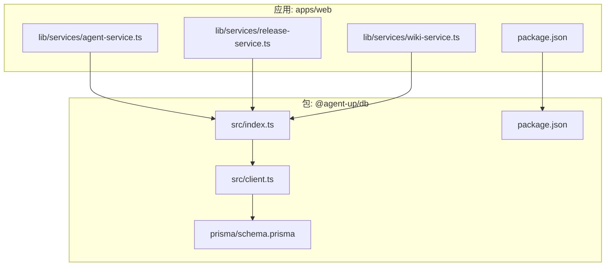
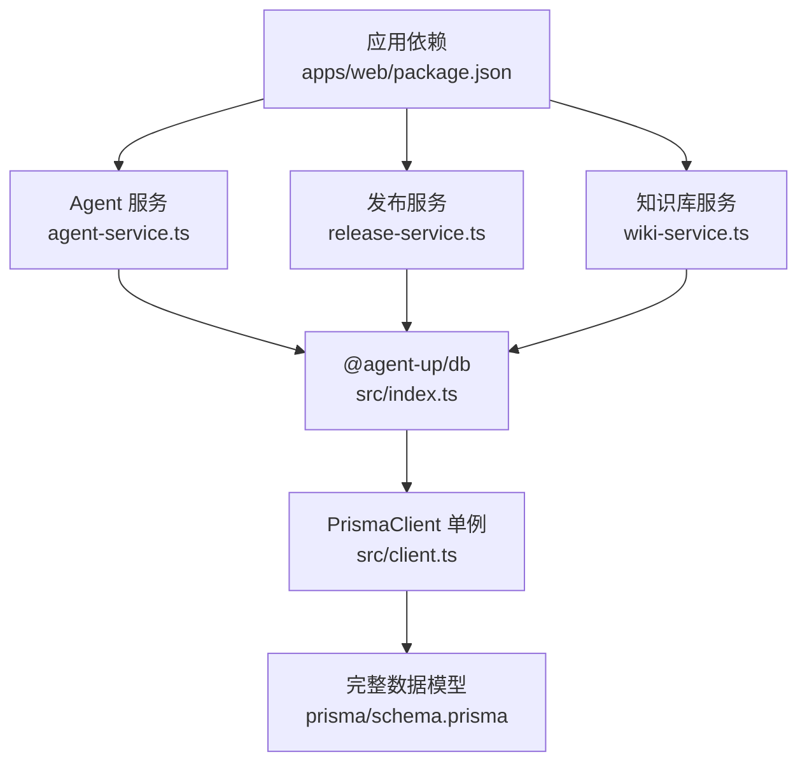
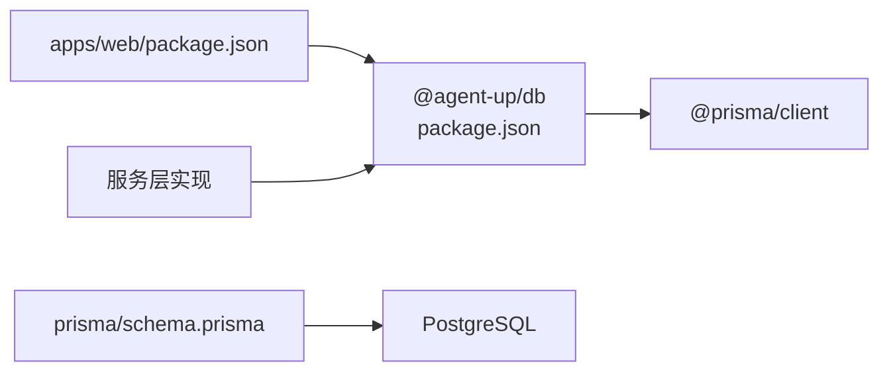

# 数据库工具包

<cite>
**本文引用的文件**   
- [packages/db/src/client.ts](file://packages/db/src/client.ts)
- [packages/db/src/index.ts](file://packages/db/src/index.ts)
- [packages/db/package.json](file://packages/db/package.json)
- [packages/db/prisma/schema.prisma](file://packages/db/prisma/schema.prisma)
- [apps/web/lib/services/agent-service.ts](file://apps/web/lib/services/agent-service.ts)
- [apps/web/lib/services/release-service.ts](file://apps/web/lib/services/release-service.ts)
- [apps/web/lib/services/wiki-service.ts](file://apps/web/lib/services/wiki-service.ts)
- [apps/web/package.json](file://apps/web/package.json)
</cite>

## 更新摘要
**变更内容**   
- 新增服务层实现，提供业务逻辑抽象和数据库操作封装
- 完善 Prisma ORM 客户端管理和 Schema 管理
- 添加完整的 Agent、Release、Wiki 等业务服务实现
- 增强数据库访问模式和 Repository 模式实践

## 目录
1. [简介](#简介)
2. [项目结构](#项目结构)
3. [核心组件](#核心组件)
4. [架构总览](#架构总览)
5. [详细组件分析](#详细组件分析)
6. [服务层设计](#服务层设计)
7. [依赖分析](#依赖分析)
8. [性能考虑](#性能考虑)
9. [故障排查指南](#故障排查指南)
10. [结论](#结论)
11. [附录](#附录)

## 简介
本文件围绕 packages/db 数据库工具包的封装与设计模式进行系统化说明，重点覆盖：
- Prisma Client 的封装策略（连接复用、日志与错误输出）
- 服务层实现与业务逻辑抽象
- 事务处理与错误处理机制
- 查询优化、缓存策略与性能监控建议
- 迁移管理、种子数据与测试环境配置
- 数据库访问模式（Repository 模式）、数据一致性保证
- 备份恢复、故障转移与高可用配置建议
- 实际开发示例与最佳实践

当前仓库中 packages/db 提供了统一的 Prisma Client 单例导出与类型重导出；应用层通过服务层实现业务逻辑抽象，采用 Repository 模式封装数据库操作。

## 项目结构
- packages/db：共享数据库客户端与类型导出
  - src/client.ts：PrismaClient 初始化与全局单例
  - src/index.ts：统一导出 prisma 与 @prisma/client 的类型
  - prisma/schema.prisma：完整的数据模型定义
  - package.json：脚本与依赖声明
- apps/web：Next.js 应用
  - lib/services/*：服务层实现，封装业务逻辑
  - package.json：依赖 @agent-up/db 包

**图表来源**   
- [packages/db/src/index.ts:1-3](file://packages/db/src/index.ts#L1-L3)
- [packages/db/src/client.ts:1-19](file://packages/db/src/client.ts#L1-L19)
- [packages/db/prisma/schema.prisma:1-626](file://packages/db/prisma/schema.prisma#L1-626)
- [apps/web/lib/services/agent-service.ts:1-302](file://apps/web/lib/services/agent-service.ts#L1-302)
- [apps/web/lib/services/release-service.ts:1-129](file://apps/web/lib/services/release-service.ts#L1-129)
- [apps/web/lib/services/wiki-service.ts:1-183](file://apps/web/lib/services/wiki-service.ts#L1-183)
- [apps/web/package.json:17-18](file://apps/web/package.json#L17-L18)

**章节来源**   
- [packages/db/src/client.ts:1-19](file://packages/db/src/client.ts#L1-19)
- [packages/db/src/index.ts:1-3](file://packages/db/src/index.ts#L1-3)
- [packages/db/prisma/schema.prisma:1-626](file://packages/db/prisma/schema.prisma#L1-626)
- [apps/web/lib/services/agent-service.ts:1-302](file://apps/web/lib/services/agent-service.ts#L1-302)
- [apps/web/package.json:17-18](file://apps/web/package.json#L17-L18)

## 核心组件
- PrismaClient 单例导出
  - 通过 globalThis 缓存实例，避免重复创建连接
  - 根据 NODE_ENV 控制日志级别（开发开启 query/error/warn，生产仅 error）
- 类型与客户端统一导出
  - index.ts 将 prisma 实例与 @prisma/client 的类型重新导出，供上层模块使用
- 完整数据模型定义
  - 包含组织用户、Agent 核心、配置分区、反馈系统、发布审批、版本快照、技能插件、知识库、权限审计等完整业务实体

**章节来源**   
- [packages/db/src/client.ts:1-19](file://packages/db/src/client.ts#L1-19)
- [packages/db/src/index.ts:1-3](file://packages/db/src/index.ts#L1-3)
- [packages/db/prisma/schema.prisma:14-626](file://packages/db/prisma/schema.prisma#L14-626)

## 架构总览
下图展示了数据库客户端在服务层中的关系，以及完整的数据模型与服务实现。

**图表来源**   
- [packages/db/src/index.ts:1-3](file://packages/db/src/index.ts#L1-L3)
- [packages/db/src/client.ts:1-19](file://packages/db/src/client.ts#L1-19)
- [packages/db/prisma/schema.prisma:1-626](file://packages/db/prisma/schema.prisma#L1-626)
- [apps/web/lib/services/agent-service.ts:1-302](file://apps/web/lib/services/agent-service.ts#L1-302)
- [apps/web/lib/services/release-service.ts:1-129](file://apps/web/lib/services/release-service.ts#L1-129)
- [apps/web/lib/services/wiki-service.ts:1-183](file://apps/web/lib/services/wiki-service.ts#L1-183)
- [apps/web/package.json:17-18](file://apps/web/package.json#L17-L18)

## 详细组件分析

### PrismaClient 封装与单例策略
- 目标
  - 避免在 Node.js 进程内重复 new PrismaClient() 造成连接泄漏
  - 提供一致的日志与错误输出策略
- 实现要点
  - 使用 globalThis 作为进程级缓存
  - 非生产环境启用 query/error/warn 日志，便于调试
  - 生产环境仅保留 error 日志，降低开销
- 适用场景
  - Serverless 函数、Next.js API Routes、长期运行的服务端进程

**图表来源**   
- [packages/db/src/client.ts:1-19](file://packages/db/src/client.ts#L1-19)

**章节来源**   
- [packages/db/src/client.ts:1-19](file://packages/db/src/client.ts#L1-19)

### 类型与导出设计
- index.ts 将 prisma 实例与 @prisma/client 的类型统一导出
- 好处
  - 上层无需关心具体路径，集中维护
  - 类型安全由 @prisma/client 保障

**章节来源**   
- [packages/db/src/index.ts:1-3](file://packages/db/src/index.ts#L1-3)

### 完整数据模型设计
- 数据提供者为 PostgreSQL，连接字符串来自环境变量 DATABASE_URL
- 模型包含完整的业务实体体系：
  - **组织与用户**：ProductGroup、User、ProductGroupMember、Role、Permission
  - **Agent 核心**：Agent 及其四分区配置（PromptConfig、KnowledgeConfig、ToolsConfig、RoutingConfig）
  - **反馈系统**：Feedback 及状态流转
  - **发布审批**：Release 及版本管理（AgentVersion）
  - **技能插件**：Skill、SkillVersion、AgentSkillBinding
  - **知识库**：WikiVault、WikiPage、WikiIngestJob
  - **权限审计**：AuditLog 记录所有关键操作

**章节来源**   
- [packages/db/prisma/schema.prisma:14-626](file://packages/db/prisma/schema.prisma#L14-626)

### 事务处理与错误处理机制
- 事务
  - 使用 Prisma 的事务 API 确保多表写操作的原子性
  - 建议在业务边界（如发布审批、版本快照）包裹事务，失败时回滚
- 错误处理
  - 捕获 Prisma 异常，记录必要上下文（用户、资源、操作）
  - 结合审计日志模型记录变更轨迹，便于追踪与回溯

**章节来源**   
- [packages/db/prisma/schema.prisma:607-625](file://packages/db/prisma/schema.prisma#L607-625)

### 查询优化与索引设计
- 查询优化
  - 利用 schema 中已定义的复合索引，按高频过滤字段组合查询
  - 使用 select/include 精确选择字段，减少网络传输与序列化开销
- 关键索引示例
  - Agent.status、Agent.productGroupId
  - Feedback.agentId+status、Feedback.severity+status
  - WikiPage.vaultId+lifecycle、vaultId+tier
  - AuditLog.resource+resourceId、userId+createdAt、action+createdAt、createdAt

**章节来源**   
- [packages/db/prisma/schema.prisma:89-91](file://packages/db/prisma/schema.prisma#L89-L91)
- [packages/db/prisma/schema.prisma:246-249](file://packages/db/prisma/schema.prisma#L246-L249)
- [packages/db/prisma/schema.prisma:495-498](file://packages/db/prisma/schema.prisma#L495-L498)
- [packages/db/prisma/schema.prisma:621-625](file://packages/db/prisma/schema.prisma#L621-625)

### 性能监控
- 日志
  - 开发环境开启 query/error/warn，生产仅 error
- 指标
  - 采集慢查询、连接池状态、错误率、事务耗时
- 链路
  - 结合分布式追踪（如 OpenTelemetry）标注数据库调用

**章节来源**   
- [packages/db/src/client.ts:10-14](file://packages/db/src/client.ts#L10-L14)

### 数据库迁移管理
- 脚本
  - packages/db 的 package.json 暴露了 prisma generate/migrate dev/db push 等命令
- 流程建议
  - 修改 schema.prisma -> pnpm run db:migrate -> 提交迁移文件 -> CI 执行迁移

**章节来源**   
- [packages/db/package.json:7-12](file://packages/db/package.json#L7-L12)
- [packages/db/prisma/schema.prisma:1-8](file://packages/db/prisma/schema.prisma#L1-8)

## 服务层设计

### 服务层架构模式
应用层采用清晰的分层架构：
- **路由层**：接收 HTTP 请求，参数校验
- **服务层**：业务逻辑编排，事务管理
- **仓储层**：Prisma 查询封装，数据访问抽象

### Agent 服务实现
- **CRUD 操作**：listAgents、getAgent、createAgent、updateAgent、deleteAgent
- **配置分区管理**：支持 Prompt、Knowledge、Tools、Routing 四个分区的独立管理
- **版本控制**：自动递增版本号，记录修改时间
- **软删除**：使用 status 字段标记归档而非物理删除

**章节来源**   
- [apps/web/lib/services/agent-service.ts:14-140](file://apps/web/lib/services/agent-service.ts#L14-140)

### 发布审批服务
- **发布流程**：submitRelease 创建发布申请，记录变更分区
- **审批工作流**：reviewRelease 支持批准、拒绝、要求修改三种状态
- **版本快照**：自动从批准的发布创建 AgentVersion 快照
- **配置快照**：保存完整的配置状态用于回滚和审计

**章节来源**   
- [apps/web/lib/services/release-service.ts:4-129](file://apps/web/lib/services/release-service.ts#L4-129)

### 知识库服务
- **Vault 管理**：完整的增删改查操作，支持关联 Agent
- **页面管理**：支持分页、搜索、标签过滤
- **生命周期管理**：DRAFT → REVIEWED → VERIFIED → ARCHIVED 状态流转
- **批量操作**：删除 Vault 时级联删除相关页面和任务

**章节来源**   
- [apps/web/lib/services/wiki-service.ts:11-183](file://apps/web/lib/services/wiki-service.ts#L11-183)

### 服务层最佳实践
- **参数验证**：所有输入参数都经过严格验证
- **错误处理**：统一的错误抛出和消息格式
- **数据完整性**：外键约束和唯一性检查
- **性能优化**：合理使用 include/select，避免 N+1 查询
- **事务安全**：复杂操作使用事务保证一致性

**章节来源**   
- [apps/web/lib/services/agent-service.ts:88-140](file://apps/web/lib/services/agent-service.ts#L88-140)
- [apps/web/lib/services/release-service.ts:48-77](file://apps/web/lib/services/release-service.ts#L48-77)
- [apps/web/lib/services/wiki-service.ts:74-79](file://apps/web/lib/services/wiki-service.ts#L74-79)

## 依赖分析
- 包依赖
  - @agent-up/db 依赖 @prisma/client，并在构建时生成类型
  - apps/web 依赖 @agent-up/db 包获取数据库客户端
- 运行时依赖
  - Postgres 数据库服务

**图表来源**   
- [packages/db/package.json:15-16](file://packages/db/package.json#L15-L16)
- [apps/web/package.json:17-18](file://apps/web/package.json#L17-L18)
- [packages/db/prisma/schema.prisma:5-8](file://packages/db/prisma/schema.prisma#L5-L8)

**章节来源**   
- [packages/db/package.json:1-24](file://packages/db/package.json#L1-24)
- [apps/web/package.json:17-18](file://apps/web/package.json#L17-L18)

## 性能考虑
- 连接池
  - 合理设置最大连接数，避免连接耗尽
  - 在 Serverless 环境下注意冷启动与连接预热
- 查询
  - 使用索引、分页、只取必要字段
  - 避免 N+1 查询，合理使用 include/select
- 日志
  - 生产关闭 verbose 日志，按需采样
- 监控
  - 收集慢查询、错误率、连接池利用率

## 故障排查指南
- 常见问题
  - 连接超时/拒绝：检查 DATABASE_URL、防火墙、Postgres 健康检查
  - 连接泄漏：确认未重复 new PrismaClient()，使用全局单例
  - 慢查询：查看慢查询日志，补充索引或优化查询
- 定位手段
  - 开发环境开启 query 日志
  - 结合审计日志与错误堆栈定位问题

**章节来源**   
- [packages/db/src/client.ts:10-14](file://packages/db/src/client.ts#L10-L14)

## 结论
packages/db 通过简洁的单例封装与类型重导出，为上层提供了稳定、类型安全的数据库访问入口。配合完整的服务层实现和 Repository 模式，实现了清晰的职责分离和良好的可测试性。完善的 Schema 设计涵盖了 Agent 平台的核心业务需求，包括配置管理、发布审批、知识库等功能。建议后续逐步引入缓存层、完善监控与告警，并制定备份恢复与高可用策略，以满足生产环境的可靠性要求。

## 附录
- 常用命令
  - 生成客户端：pnpm run db:generate
  - 推送本地变更：pnpm run db:push
  - 开发迁移：pnpm run db:migrate
  - 打开 Studio：pnpm run db:studio
- 服务层接口
  - Agent 服务：完整的 CRUD 和配置管理
  - 发布服务：审批流程和版本管理
  - 知识库服务：文档管理和版本控制

**章节来源**   
- [packages/db/package.json:7-12](file://packages/db/package.json#L7-12)