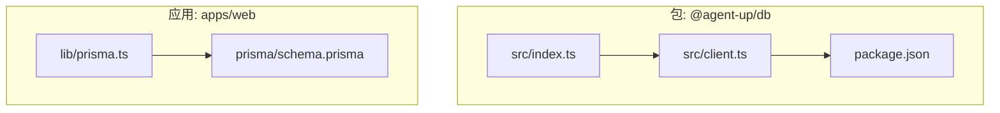
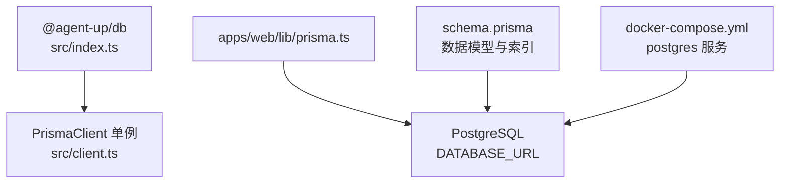
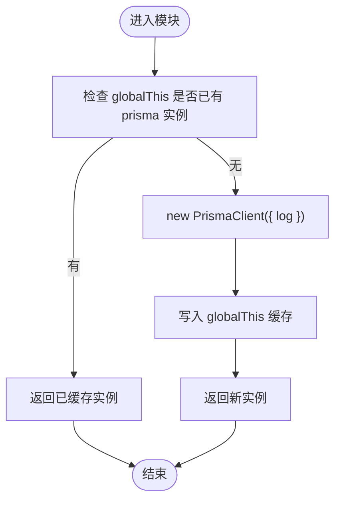
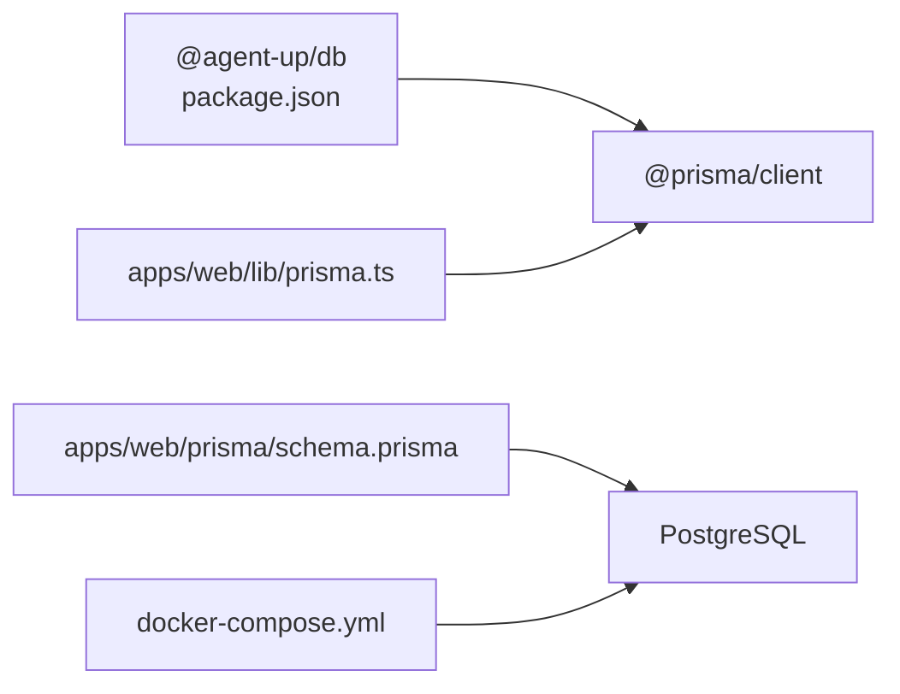

# 数据库工具包

<cite>
**本文引用的文件**   
- [packages/db/src/client.ts](file://packages/db/src/client.ts)
- [packages/db/src/index.ts](file://packages/db/src/index.ts)
- [packages/db/package.json](file://packages/db/package.json)
- [apps/web/lib/prisma.ts](file://apps/web/lib/prisma.ts)
- [apps/web/prisma/schema.prisma](file://apps/web/prisma/schema.prisma)
- [docker-compose.yml](file://docker-compose.yml)
- [package.json](file://package.json)
</cite>

## 目录
1. [简介](#简介)
2. [项目结构](#项目结构)
3. [核心组件](#核心组件)
4. [架构总览](#架构总览)
5. [详细组件分析](#详细组件分析)
6. [依赖分析](#依赖分析)
7. [性能考虑](#性能考虑)
8. [故障排查指南](#故障排查指南)
9. [结论](#结论)
10. [附录](#附录)

## 简介
本文件围绕 packages/db 数据库工具包的封装与设计模式进行系统化说明，重点覆盖：
- Prisma Client 的封装策略（连接复用、日志与错误输出）
- 事务处理与错误处理机制
- 查询优化、缓存策略与性能监控建议
- 迁移管理、种子数据与测试环境配置
- 数据库访问模式（Repository 模式）、数据一致性保证
- 备份恢复、故障转移与高可用配置建议
- 实际开发示例与最佳实践

当前仓库中 packages/db 提供了统一的 Prisma Client 单例导出与类型重导出；应用层在 apps/web 中也存在一个独立的 Prisma 客户端实例。两者均基于全局变量实现进程内单例，避免热重载或多次导入导致连接泄漏。

## 项目结构
- packages/db：共享数据库客户端与类型导出
  - src/client.ts：PrismaClient 初始化与全局单例
  - src/index.ts：统一导出 prisma 与 @prisma/client 的类型
  - package.json：脚本与依赖声明
- apps/web：Next.js 应用
  - lib/prisma.ts：应用内 PrismaClient 初始化与全局单例
  - prisma/schema.prisma：数据模型与索引定义
- docker-compose.yml：本地 Postgres 与 MinIO 服务
- 根 package.json：工作区脚本入口

图表来源
- [packages/db/src/index.ts:1-3](file://packages/db/src/index.ts#L1-L3)
- [packages/db/src/client.ts:1-19](file://packages/db/src/client.ts#L1-L19)
- [packages/db/package.json:1-22](file://packages/db/package.json#L1-L22)
- [apps/web/lib/prisma.ts:1-17](file://apps/web/lib/prisma.ts#L1-L17)
- [apps/web/prisma/schema.prisma:1-8](file://apps/web/prisma/schema.prisma#L1-L8)

章节来源
- [packages/db/src/client.ts:1-19](file://packages/db/src/client.ts#L1-L19)
- [packages/db/src/index.ts:1-3](file://packages/db/src/index.ts#L1-L3)
- [packages/db/package.json:1-22](file://packages/db/package.json#L1-L22)
- [apps/web/lib/prisma.ts:1-17](file://apps/web/lib/prisma.ts#L1-L17)
- [apps/web/prisma/schema.prisma:1-8](file://apps/web/prisma/schema.prisma#L1-L8)

## 核心组件
- PrismaClient 单例导出
  - 通过 globalThis 缓存实例，避免重复创建连接
  - 根据 NODE_ENV 控制日志级别（开发开启 query/error/warn，生产仅 error）
- 类型与客户端统一导出
  - index.ts 将 prisma 实例与 @prisma/client 的类型重新导出，供上层模块使用
- 应用内独立客户端
  - apps/web/lib/prisma.ts 采用相同策略，便于 Next.js 路由/页面直接引用

章节来源
- [packages/db/src/client.ts:1-19](file://packages/db/src/client.ts#L1-L19)
- [packages/db/src/index.ts:1-3](file://packages/db/src/index.ts#L1-L3)
- [apps/web/lib/prisma.ts:1-17](file://apps/web/lib/prisma.ts#L1-L17)

## 架构总览
下图展示了数据库客户端在包与应用中的关系，以及数据模型与运行时的依赖。

图表来源
- [packages/db/src/index.ts:1-3](file://packages/db/src/index.ts#L1-L3)
- [packages/db/src/client.ts:1-19](file://packages/db/src/client.ts#L1-L19)
- [apps/web/lib/prisma.ts:1-17](file://apps/web/lib/prisma.ts#L1-L17)
- [apps/web/prisma/schema.prisma:1-8](file://apps/web/prisma/schema.prisma#L1-L8)
- [docker-compose.yml:1-17](file://docker-compose.yml#L1-L17)

## 详细组件分析

### PrismaClient 封装与单例策略
- 目标
  - 避免在 Node.js 进程内重复 new PrismaClient() 造成连接泄漏
  - 提供一致的日志与错误输出策略
- 实现要点
  - 使用 globalThis 作为进程级缓存
  - 非生产环境启用 query/error/warn 日志，便于调试
  - 生产环境仅保留 error 日志，降低开销
- 适用场景
  - Serverless 函数、Next.js API Routes、长期运行的服务端进程

图表来源
- [packages/db/src/client.ts:1-19](file://packages/db/src/client.ts#L1-L19)
- [apps/web/lib/prisma.ts:1-17](file://apps/web/lib/prisma.ts#L1-L17)

章节来源
- [packages/db/src/client.ts:1-19](file://packages/db/src/client.ts#L1-L19)
- [apps/web/lib/prisma.ts:1-17](file://apps/web/lib/prisma.ts#L1-L17)

### 类型与导出设计
- index.ts 将 prisma 实例与 @prisma/client 的类型统一导出
- 好处
  - 上层无需关心具体路径，集中维护
  - 类型安全由 @prisma/client 保障

章节来源
- [packages/db/src/index.ts:1-3](file://packages/db/src/index.ts#L1-L3)

### 数据模型与索引设计
- 数据提供者为 PostgreSQL，连接字符串来自环境变量 DATABASE_URL
- 模型包含大量业务实体（Agent、Release、Version、Skill、WikiVault 等），并定义了必要的唯一约束与复合索引以支撑查询性能
- 关键索引示例
  - Agent.status、Agent.productGroupId
  - Feedback.agentId+status、Feedback.severity+status
  - WikiPage.vaultId+lifecycle、vaultId+tier
  - AuditLog.resource+resourceId、userId+createdAt、action+createdAt、createdAt

章节来源
- [apps/web/prisma/schema.prisma:1-8](file://apps/web/prisma/schema.prisma#L1-L8)
- [apps/web/prisma/schema.prisma:89-91](file://apps/web/prisma/schema.prisma#L89-L91)
- [apps/web/prisma/schema.prisma:246-249](file://apps/web/prisma/schema.prisma#L246-L249)
- [apps/web/prisma/schema.prisma:495-498](file://apps/web/prisma/schema.prisma#L495-L498)
- [apps/web/prisma/schema.prisma:621-625](file://apps/web/prisma/schema.prisma#L621-L625)

### 事务处理与错误处理机制
- 事务
  - 使用 Prisma 的事务 API 确保多表写操作的原子性
  - 建议在业务边界（如发布审批、版本快照）包裹事务，失败时回滚
- 错误处理
  - 捕获 Prisma 异常，记录必要上下文（用户、资源、操作）
  - 结合审计日志模型记录变更轨迹，便于追踪与回溯

章节来源
- [apps/web/prisma/schema.prisma:607-625](file://apps/web/prisma/schema.prisma#L607-L625)

### 查询优化与缓存策略
- 查询优化
  - 利用 schema 中已定义的索引，按高频过滤字段组合查询
  - 使用 select/include 精确选择字段，减少网络传输与序列化开销
- 缓存策略
  - 读多写少数据可引入内存缓存（如 LRU）或外部缓存（Redis）
  - 对热点配置（如 Agent 四分区配置）做短 TTL 缓存，配合失效策略

[本节为通用指导，不直接分析具体文件]

### 性能监控
- 日志
  - 开发环境开启 query/error/warn，生产仅 error
- 指标
  - 采集慢查询、连接池状态、错误率、事务耗时
- 链路
  - 结合分布式追踪（如 OpenTelemetry）标注数据库调用

章节来源
- [packages/db/src/client.ts:10-14](file://packages/db/src/client.ts#L10-L14)
- [apps/web/lib/prisma.ts:10-14](file://apps/web/lib/prisma.ts#L10-L14)

### 数据库迁移管理
- 脚本
  - 根 package.json 提供 db:migrate/db:push/db:generate 等脚本
  - packages/db 的 package.json 也暴露了 prisma generate/migrate dev/db push
- 流程建议
  - 修改 schema.prisma -> prisma migrate dev -> 提交迁移文件 -> CI 执行迁移

章节来源
- [package.json:8-11](file://package.json#L8-L11)
- [packages/db/package.json:7-12](file://packages/db/package.json#L7-L12)
- [apps/web/prisma/schema.prisma:1-8](file://apps/web/prisma/schema.prisma#L1-L8)

### 种子数据生成
- 建议
  - 使用 Prisma Seed 脚本或独立 CLI 初始化基础数据（角色、权限、默认组织）
  - 将种子数据纳入版本控制，确保环境一致性

[本节为通用指导，不直接分析具体文件]

### 测试环境配置
- 本地数据库
  - docker-compose.yml 提供 Postgres 与 MinIO 服务，端口与卷持久化
- 环境变量
  - 设置 DATABASE_URL 指向本地或测试库
- 隔离
  - 每个测试套件使用独立数据库或事务回滚

章节来源
- [docker-compose.yml:1-17](file://docker-compose.yml#L1-L17)

### 数据库访问模式与 Repository 模式
- 推荐分层
  - 控制器/路由层：接收请求、参数校验、编排事务
  - 服务层：业务逻辑、跨域聚合
  - 仓储层（Repository）：封装 Prisma 查询，屏蔽底层细节
- 优势
  - 单一职责、易测试、可替换存储实现

[本节为通用指导，不直接分析具体文件]

### 数据一致性保证
- 强一致
  - 使用事务保证同一请求内的多表更新一致性
- 最终一致
  - 异步任务（如知识库同步）通过状态机与重试队列推进
- 幂等
  - 对外接口具备幂等键，防止重复提交

[本节为通用指导，不直接分析具体文件]

### 备份恢复、故障转移与高可用
- 备份
  - 定期 pg_dump 全量/增量备份，对象存储归档
- 恢复
  - 演练恢复流程，验证 RPO/RTO
- 故障转移
  - 主从复制 + 自动故障转移（云托管方案）
  - 客户端侧连接重试与熔断
- 高可用
  - 多可用区部署、读写分离、连接池上限合理配置

[本节为通用指导，不直接分析具体文件]

### 实际开发示例与最佳实践
- 示例清单
  - 创建 Agent 及其四分区配置（事务）
  - 提交发布审批（Release）并生成版本快照（AgentVersion）
  - 知识库入库任务（WikiIngestJob）状态流转
- 最佳实践
  - 始终通过 packages/db 导出的 prisma 实例访问数据库
  - 严格使用 select/include 控制字段
  - 为高频查询建立复合索引
  - 记录审计日志，追踪关键变更

章节来源
- [apps/web/prisma/schema.prisma:61-91](file://apps/web/prisma/schema.prisma#L61-L91)
- [apps/web/prisma/schema.prisma:298-354](file://apps/web/prisma/schema.prisma#L298-L354)
- [apps/web/prisma/schema.prisma:521-557](file://apps/web/prisma/schema.prisma#L521-L557)
- [apps/web/prisma/schema.prisma:607-625](file://apps/web/prisma/schema.prisma#L607-L625)

## 依赖分析
- 包依赖
  - @agent-up/db 依赖 @prisma/client，并在构建时生成类型
- 应用依赖
  - apps/web 同时拥有自己的 Prisma 客户端与 schema.prisma
- 运行时依赖
  - Postgres 由 docker-compose 提供

图表来源
- [packages/db/package.json:14-16](file://packages/db/package.json#L14-L16)
- [apps/web/lib/prisma.ts:1-2](file://apps/web/lib/prisma.ts#L1-L2)
- [apps/web/prisma/schema.prisma:5-8](file://apps/web/prisma/schema.prisma#L5-L8)
- [docker-compose.yml:1-17](file://docker-compose.yml#L1-L17)

章节来源
- [packages/db/package.json:1-22](file://packages/db/package.json#L1-L22)
- [apps/web/lib/prisma.ts:1-17](file://apps/web/lib/prisma.ts#L1-L17)
- [apps/web/prisma/schema.prisma:1-8](file://apps/web/prisma/schema.prisma#L1-L8)
- [docker-compose.yml:1-17](file://docker-compose.yml#L1-L17)

## 性能考虑
- 连接池
  - 合理设置最大连接数，避免连接耗尽
  - 在 Serverless 环境下注意冷启动与连接预热
- 查询
  - 使用索引、分页、只取必要字段
  - 避免 N+1 查询，合理使用 include/select
- 日志
  - 生产关闭 verbose 日志，按需采样
- 监控
  - 收集慢查询、错误率、连接池利用率

[本节为通用指导，不直接分析具体文件]

## 故障排查指南
- 常见问题
  - 连接超时/拒绝：检查 DATABASE_URL、防火墙、Postgres 健康检查
  - 连接泄漏：确认未重复 new PrismaClient()，使用全局单例
  - 慢查询：查看慢查询日志，补充索引或优化查询
- 定位手段
  - 开发环境开启 query 日志
  - 结合审计日志与错误堆栈定位问题

章节来源
- [packages/db/src/client.ts:10-14](file://packages/db/src/client.ts#L10-L14)
- [apps/web/lib/prisma.ts:10-14](file://apps/web/lib/prisma.ts#L10-L14)
- [docker-compose.yml:12-16](file://docker-compose.yml#L12-L16)

## 结论
packages/db 通过简洁的单例封装与类型重导出，为上层提供了稳定、类型安全的数据库访问入口。配合完善的 schema 索引与事务语义，可在保证一致性的前提下获得良好性能。建议后续逐步引入 Repository 层、完善监控与告警，并制定备份恢复与高可用策略，以满足生产环境的可靠性要求。

## 附录
- 常用命令
  - 生成客户端：pnpm run db:generate
  - 推送本地变更：pnpm run db:push
  - 开发迁移：pnpm run db:migrate
- 本地服务
  - Postgres：端口 5432
  - MinIO：API 9000，控制台 9001

章节来源
- [package.json:8-11](file://package.json#L8-L11)
- [docker-compose.yml:8-16](file://docker-compose.yml#L8-L16)