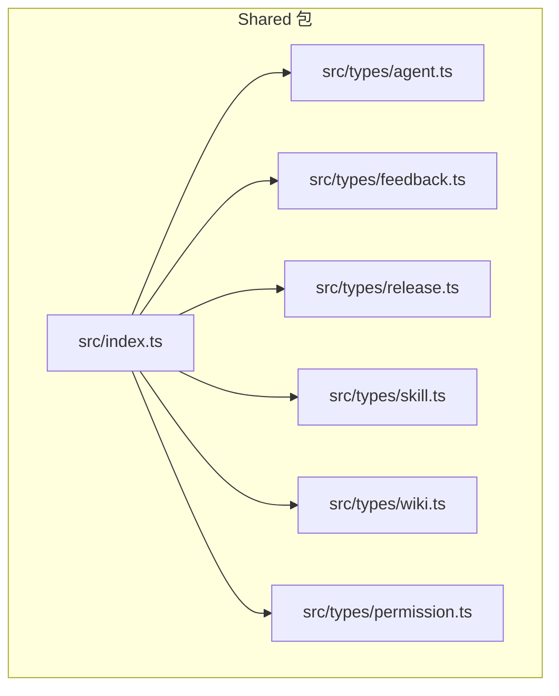
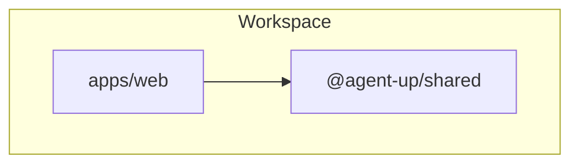
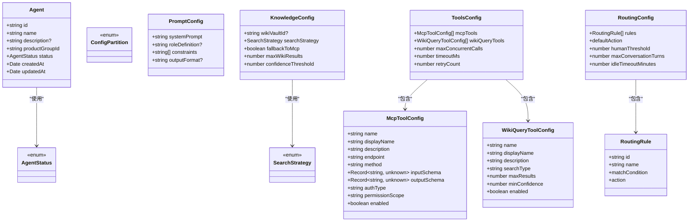
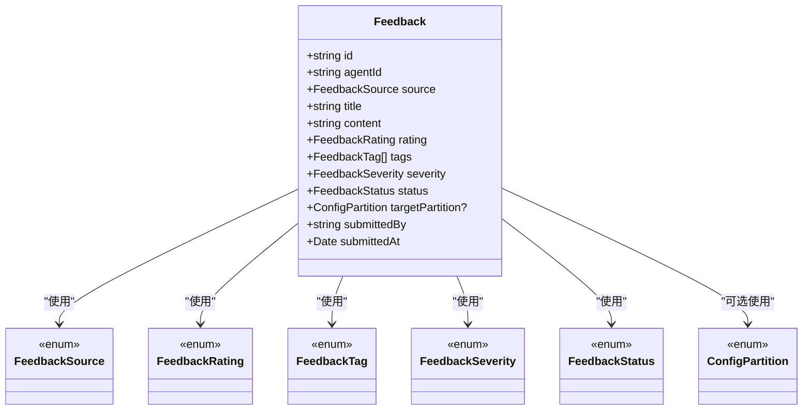
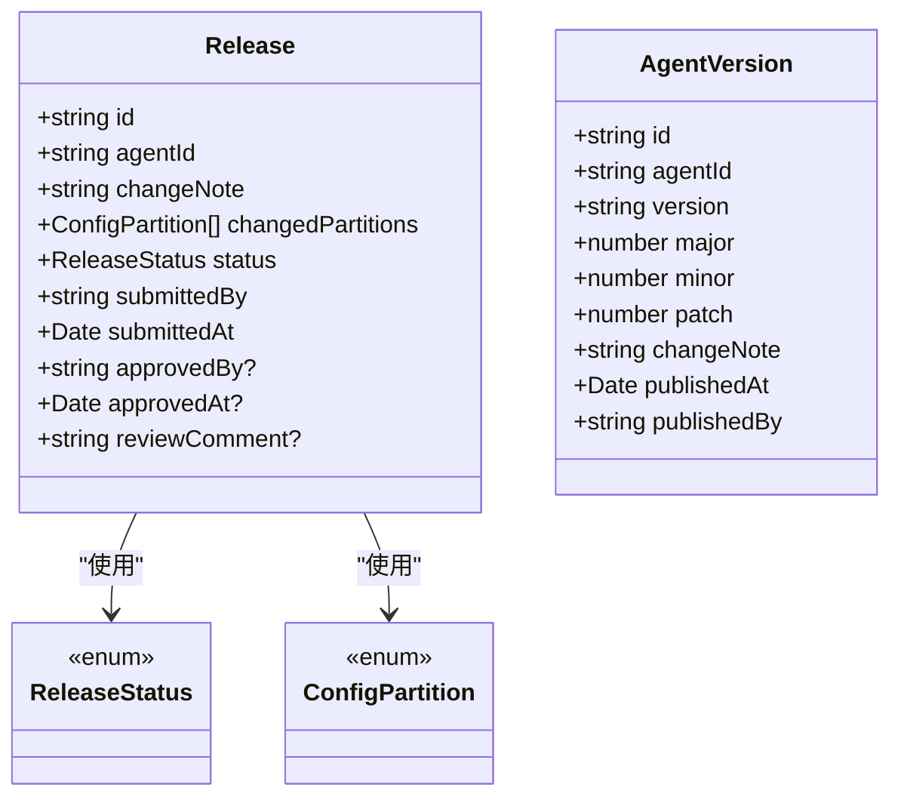
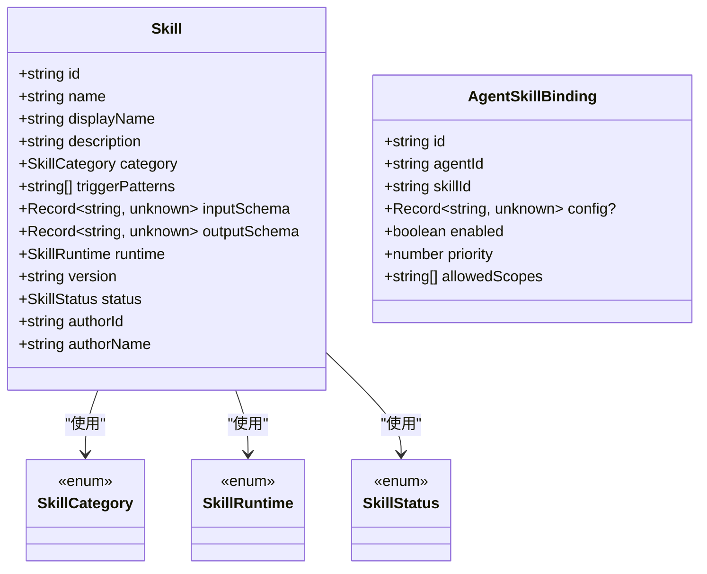
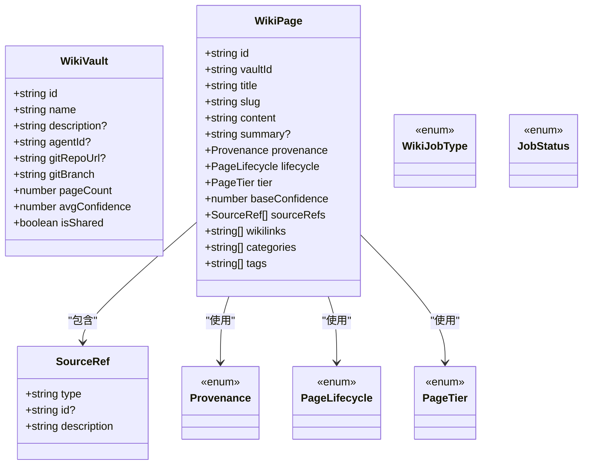
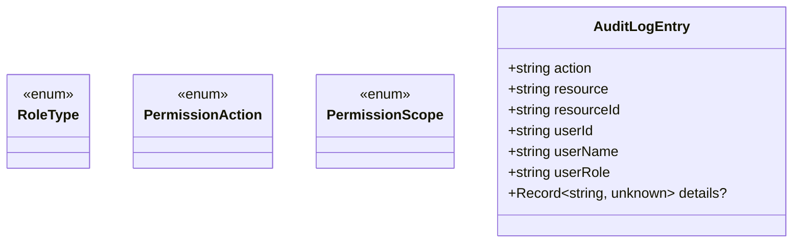
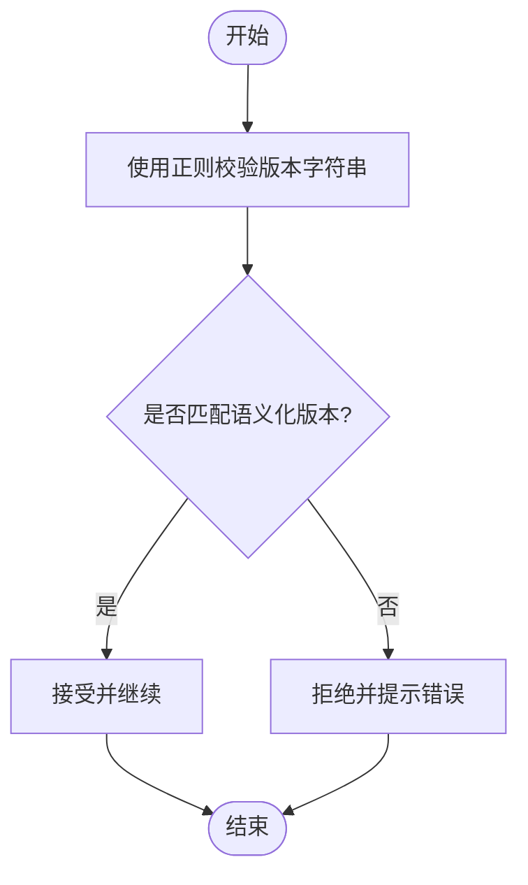
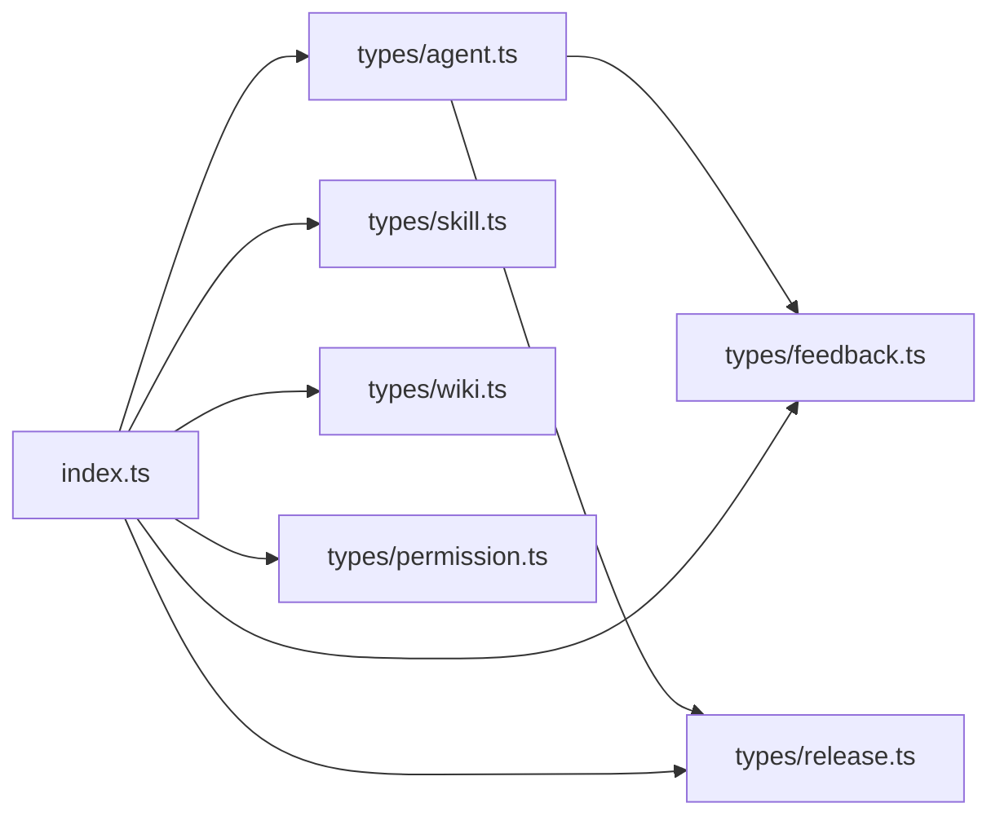

# Shared Types 包

<cite>
**本文引用的文件**   
- [packages/shared/src/index.ts](file://packages/shared/src/index.ts)
- [packages/shared/package.json](file://packages/shared/package.json)
- [packages/shared/tsconfig.json](file://packages/shared/tsconfig.json)
- [packages/shared/src/types/agent.ts](file://packages/shared/src/types/agent.ts)
- [packages/shared/src/types/feedback.ts](file://packages/shared/src/types/feedback.ts)
- [packages/shared/src/types/release.ts](file://packages/shared/src/types/release.ts)
- [packages/shared/src/types/skill.ts](file://packages/shared/src/types/skill.ts)
- [packages/shared/src/types/wiki.ts](file://packages/shared/src/types/wiki.ts)
- [packages/shared/src/types/permission.ts](file://packages/shared/src/types/permission.ts)
- [package.json](file://package.json)
- [tsconfig.json](file://tsconfig.json)
- [pnpm-workspace.yaml](file://pnpm-workspace.yaml)
</cite>

## 目录
1. [简介](#简介)
2. [项目结构](#项目结构)
3. [核心组件](#核心组件)
4. [架构总览](#架构总览)
5. [详细组件分析](#详细组件分析)
6. [依赖分析](#依赖分析)
7. [性能考虑](#性能考虑)
8. [故障排查指南](#故障排查指南)
9. [结论](#结论)
10. [附录](#附录)

## 简介
本文件系统性说明 packages/shared 类型定义包的设计与实现，聚焦 TypeScript 共享类型的组织结构、导出策略、版本管理与向后兼容策略、类型安全最佳实践，以及如何在 web 应用与其他包中正确引用这些类型。同时提供类型验证、接口设计、命名规范、测试策略与文档生成方法的指导。

## 项目结构
shared 包采用“按领域分文件 + 统一入口导出”的组织方式：
- src/types 下按业务域划分类型文件（Agent、Feedback、Release、Skill、Wiki、Permission）
- src/index.ts 作为统一入口，集中 re-export 所有类型与常量
- package.json 声明 types 字段指向入口，便于其他包直接消费类型
- tsconfig.json 继承根配置，开启严格模式与声明输出

图表来源
- [packages/shared/src/index.ts:1-15](file://packages/shared/src/index.ts#L1-L15)
- [packages/shared/src/types/agent.ts:1-108](file://packages/shared/src/types/agent.ts#L1-L108)
- [packages/shared/src/types/feedback.ts:1-62](file://packages/shared/src/types/feedback.ts#L1-L62)
- [packages/shared/src/types/release.ts:1-36](file://packages/shared/src/types/release.ts#L1-L36)
- [packages/shared/src/types/skill.ts:1-49](file://packages/shared/src/types/skill.ts#L1-L49)
- [packages/shared/src/types/wiki.ts:1-73](file://packages/shared/src/types/wiki.ts#L1-L73)
- [packages/shared/src/types/permission.ts:1-37](file://packages/shared/src/types/permission.ts#L1-L37)

章节来源
- [packages/shared/src/index.ts:1-15](file://packages/shared/src/index.ts#L1-L15)
- [packages/shared/package.json:1-15](file://packages/shared/package.json#L1-L15)
- [packages/shared/tsconfig.json:1-9](file://packages/shared/tsconfig.json#L1-L9)

## 核心组件
- Agent 域：Agent 实体、状态枚举、配置分区枚举，Prompt/Knowledge/Tools/Routing 等配置模型
- Feedback 域：反馈记录、来源、评分、标签、严重等级、处理状态
- Release 域：发布单、发布状态、Agent 版本信息
- Skill 域：技能定义、分类、运行时、状态、与 Agent 的绑定关系
- Wiki 域：知识库仓库、页面、来源引用、生命周期、分级、任务与作业状态
- Permission 域：角色、权限动作、作用域、审计日志条目
- 通用常量与规则：平台名称、分页默认值、最大页大小、语义化版本号正则

章节来源
- [packages/shared/src/types/agent.ts:1-108](file://packages/shared/src/types/agent.ts#L1-L108)
- [packages/shared/src/types/feedback.ts:1-62](file://packages/shared/src/types/feedback.ts#L1-L62)
- [packages/shared/src/types/release.ts:1-36](file://packages/shared/src/types/release.ts#L1-L36)
- [packages/shared/src/types/skill.ts:1-49](file://packages/shared/src/types/skill.ts#L1-L49)
- [packages/shared/src/types/wiki.ts:1-73](file://packages/shared/src/types/wiki.ts#L1-L73)
- [packages/shared/src/types/permission.ts:1-37](file://packages/shared/src/types/permission.ts#L1-L37)
- [packages/shared/src/index.ts:8-15](file://packages/shared/src/index.ts#L8-L15)

## 架构总览
shared 包作为跨应用与包的类型契约中心，被各业务模块通过 npm/pnpm workspace 引用。其职责是：
- 提供稳定的类型契约（接口、枚举、常量）
- 通过单一入口集中导出，降低耦合
- 以严格 TS 配置保障类型安全与一致性

图表来源
- [pnpm-workspace.yaml:1-4](file://pnpm-workspace.yaml#L1-L4)
- [packages/shared/package.json:1-15](file://packages/shared/package.json#L1-L15)

章节来源
- [pnpm-workspace.yaml:1-4](file://pnpm-workspace.yaml#L1-L4)
- [packages/shared/package.json:1-15](file://packages/shared/package.json#L1-L15)

## 详细组件分析

### Agent 域类型
- 实体与状态
  - Agent：标识、名称、描述、所属产品组、状态、时间戳
  - AgentStatus：草稿、活跃、归档
- 配置分区
  - ConfigPartition：提示词、知识、工具、路由
- 配置模型
  - PromptConfig：系统提示、角色定义、约束、输出格式
  - KnowledgeConfig：知识库仓库、检索策略、回退策略、结果上限、置信度阈值
  - ToolsConfig：MCP 工具集合、Wiki 查询工具集合、并发、超时、重试
  - McpToolConfig：工具元数据、端点、方法、输入/输出 Schema、鉴权、权限范围、启用标志
  - WikiQueryToolConfig：搜索类型、结果上限、最小置信度、启用标志
  - RoutingConfig/RoutingRule：匹配条件、动作目标、优先级、默认行为、人类接管阈值、会话轮次与时限

图表来源
- [packages/shared/src/types/agent.ts:1-108](file://packages/shared/src/types/agent.ts#L1-L108)

章节来源
- [packages/shared/src/types/agent.ts:1-108](file://packages/shared/src/types/agent.ts#L1-L108)

### Feedback 域类型
- 反馈记录：关联 Agent、来源、标题、内容、评分、标签、严重等级、状态、目标配置分区、提交人与时间
- 枚举：来源、评分、标签、严重等级、处理状态

图表来源
- [packages/shared/src/types/feedback.ts:1-62](file://packages/shared/src/types/feedback.ts#L1-L62)
- [packages/shared/src/types/agent.ts:18-23](file://packages/shared/src/types/agent.ts#L18-L23)

章节来源
- [packages/shared/src/types/feedback.ts:1-62](file://packages/shared/src/types/feedback.ts#L1-L62)

### Release 域类型
- 发布单：关联 Agent、变更说明、变更分区、状态、提交与审批信息
- 发布状态：待审、已批准、已拒绝、需修改
- Agent 版本：语义化版本解析为 major/minor/patch，含发布时间与发布者

图表来源
- [packages/shared/src/types/release.ts:1-36](file://packages/shared/src/types/release.ts#L1-L36)
- [packages/shared/src/types/agent.ts:18-23](file://packages/shared/src/types/agent.ts#L18-L23)

章节来源
- [packages/shared/src/types/release.ts:1-36](file://packages/shared/src/types/release.ts#L1-L36)

### Skill 域类型
- 技能定义：名称、显示名、描述、分类、触发模式、输入/输出 Schema、运行时、版本、状态、作者信息
- 分类/运行时/状态：限定取值空间
- Agent-Skill 绑定：允许配置、启用标志、优先级、作用域列表

图表来源
- [packages/shared/src/types/skill.ts:1-49](file://packages/shared/src/types/skill.ts#L1-L49)

章节来源
- [packages/shared/src/types/skill.ts:1-49](file://packages/shared/src/types/skill.ts#L1-L49)

### Wiki 域类型
- 知识库仓库：名称、描述、关联 Agent、Git 源、分支、统计与共享标记
- 页面：标题、路径、内容、摘要、来源可信度、生命周期、分级、来源引用、内部链接、分类与标签
- 来源引用：类型、ID、描述
- 枚举：来源可信度、页面生命周期、页面分级、Wiki 作业类型、作业状态

图表来源
- [packages/shared/src/types/wiki.ts:1-73](file://packages/shared/src/types/wiki.ts#L1-L73)

章节来源
- [packages/shared/src/types/wiki.ts:1-73](file://packages/shared/src/types/wiki.ts#L1-L73)

### Permission 域类型
- 角色：平台管理员、产品负责人、产品成员、技能开发者、知识编辑、审计员、只读查看者
- 权限动作：读、写、发布、审批、回滚、删除、管理
- 权限作用域：仅自身组、跨组、全局
- 审计日志：操作、资源、资源 ID、用户信息与详情

图表来源
- [packages/shared/src/types/permission.ts:1-37](file://packages/shared/src/types/permission.ts#L1-L37)

章节来源
- [packages/shared/src/types/permission.ts:1-37](file://packages/shared/src/types/permission.ts#L1-L37)

### 通用常量与版本规则
- 平台名称、分页默认值与最大值
- 语义化版本号正则表达式，用于前端校验与后端校验的一致性

图表来源
- [packages/shared/src/index.ts:8-15](file://packages/shared/src/index.ts#L8-L15)

章节来源
- [packages/shared/src/index.ts:8-15](file://packages/shared/src/index.ts#L8-L15)

## 依赖分析
- 包内依赖
  - feedback.ts 与 release.ts 通过 import type 引入 agent.ts 中的 ConfigPartition，避免循环依赖
  - index.ts 集中 re-export 所有类型与常量，形成稳定对外契约
- 包外依赖
  - 无第三方运行时依赖，仅依赖 TypeScript 编译器能力
  - 通过 pnpm workspace 被 apps/web 及其他包引用

图表来源
- [packages/shared/src/index.ts:1-7](file://packages/shared/src/index.ts#L1-L7)
- [packages/shared/src/types/feedback.ts:60-62](file://packages/shared/src/types/feedback.ts#L60-L62)
- [packages/shared/src/types/release.ts:34-36](file://packages/shared/src/types/release.ts#L34-L36)

章节来源
- [packages/shared/src/index.ts:1-7](file://packages/shared/src/index.ts#L1-L7)
- [packages/shared/src/types/feedback.ts:60-62](file://packages/shared/src/types/feedback.ts#L60-L62)
- [packages/shared/src/types/release.ts:34-36](file://packages/shared/src/types/release.ts#L34-L36)

## 性能考虑
- 纯类型包不产生运行时开销，编译期即可保证类型安全
- 使用 import type 减少不必要的导入负担
- 合理拆分文件与集中导出有助于 IDE 索引与增量编译效率

[本节为通用建议，无需源码引用]

## 故障排查指南
- 无法在应用中解析 @agent-up/shared
  - 确认 pnpm workspace 已包含 packages/*
  - 检查应用的 package.json 是否声明对 @agent-up/shared 的依赖
  - 确保 types 字段指向正确的入口文件
- 类型不一致或报错
  - 确认双方均使用相同版本的 shared 包
  - 检查是否误用非导出类型（仅通过 index.ts 暴露的类型可用）
  - 使用严格模式与 noEmit 配置进行本地类型检查
- 版本校验失败
  - 使用共享的正则表达式进行前后端一致校验
  - 若需要更严格的校验，可在上层封装校验函数并复用该正则

章节来源
- [pnpm-workspace.yaml:1-4](file://pnpm-workspace.yaml#L1-L4)
- [packages/shared/package.json:1-15](file://packages/shared/package.json#L1-L15)
- [packages/shared/src/index.ts:8-15](file://packages/shared/src/index.ts#L8-L15)

## 结论
shared 包以清晰的领域分层与统一的导出策略，提供了稳定、可演进的类型契约。通过严格 TS 配置、import type 的使用与常量/规则的集中管理，既保证了类型安全，也提升了跨包协作的效率。建议在后续迭代中持续遵循向后兼容原则，并通过类型测试与文档生成进一步提升质量与可维护性。

[本节为总结性内容，无需源码引用]

## 附录

### 类型版本管理与向后兼容性
- 语义化版本
  - 使用共享的语义化版本正则进行版本字符串校验
  - 在 Release 与 AgentVersion 中维护 major/minor/patch 以便追踪变更影响面
- 向后兼容策略
  - 新增字段优先使用可选字段，避免破坏现有消费者
  - 新增枚举值时保持旧值可用，并在文档中标注弃用计划
  - 移除或重命名字段前至少保留一个次要版本周期
- 变更治理
  - 通过 Release 记录变更分区与变更说明，配合审批流程控制风险

章节来源
- [packages/shared/src/index.ts:8-15](file://packages/shared/src/index.ts#L8-L15)
- [packages/shared/src/types/release.ts:1-36](file://packages/shared/src/types/release.ts#L1-L36)

### 类型安全最佳实践
- 严格模式与一致性
  - 启用 strict、noEmit、declaration、declarationMap、sourceMap
  - 使用 forceConsistentCasingInFileNames 与 isolatedModules
- 类型边界
  - 对外仅通过 index.ts 暴露必要类型
  - 使用 import type 避免运行时依赖
- 常量与规则
  - 将平台常量与校验规则集中在入口导出，确保多端一致

章节来源
- [packages/shared/tsconfig.json:1-9](file://packages/shared/tsconfig.json#L1-L9)
- [tsconfig.json:1-22](file://tsconfig.json#L1-L22)
- [packages/shared/src/index.ts:1-15](file://packages/shared/src/index.ts#L1-L15)

### 命名规范
- 类型与接口：大驼峰（如 Agent、WikiPage）
- 枚举：大驼峰且值为大写字符串（如 AgentStatus、SkillCategory）
- 配置对象：语义化命名（如 PromptConfig、KnowledgeConfig）
- 常量：全大写加下划线（如 PLATFORM_NAME、DEFAULT_PAGE_SIZE）

章节来源
- [packages/shared/src/types/agent.ts:1-108](file://packages/shared/src/types/agent.ts#L1-L108)
- [packages/shared/src/types/skill.ts:1-49](file://packages/shared/src/types/skill.ts#L1-L49)
- [packages/shared/src/index.ts:8-15](file://packages/shared/src/index.ts#L8-L15)

### 类型使用示例与集成指南
- 在 web 或其他包中引用
  - 通过包名 @agent-up/shared 引入所需类型
  - 从统一入口导入，例如 Agent、Feedback、Release、Skill、Wiki、Permission 相关类型
- 典型用法
  - 在 API 层对请求体与响应体进行类型标注
  - 在前端表单与展示层使用类型约束，结合 UI 组件进行渲染
  - 使用共享常量与正则进行客户端校验，与后端保持一致

章节来源
- [packages/shared/src/index.ts:1-15](file://packages/shared/src/index.ts#L1-L15)

### 类型验证与接口设计
- 校验策略
  - 使用共享正则进行版本字符串校验
  - 对关键数值字段设置合理范围（如分页大小、超时、重试次数）
- 接口设计
  - 明确必填与可选字段，避免过度宽松
  - 使用枚举限制取值空间，提升可读性与稳定性

章节来源
- [packages/shared/src/index.ts:8-15](file://packages/shared/src/index.ts#L8-L15)
- [packages/shared/src/types/agent.ts:1-108](file://packages/shared/src/types/agent.ts#L1-L108)

### 类型测试策略
- 静态类型测试
  - 编写 .d.ts 断言文件或小型测试文件，验证类型组合与约束是否符合预期
- 运行时辅助校验
  - 基于共享常量与正则编写轻量校验函数，在关键路径执行
- 回归用例
  - 针对破坏性变更（移除字段、改变枚举值）添加类型级回归用例

[本节为方法论指导，无需源码引用]

### 文档生成方法
- 使用 TypeScript 声明输出与映射
  - 利用 declaration 与 declarationMap 生成类型声明与映射文件
- 自动化文档
  - 结合 tsc 与文档生成工具（如 typedoc）产出 API 文档
- 持续集成
  - 在构建阶段运行类型检查与文档生成，确保文档与代码同步

章节来源
- [tsconfig.json:1-22](file://tsconfig.json#L1-L22)
- [packages/shared/tsconfig.json:1-9](file://packages/shared/tsconfig.json#L1-L9)