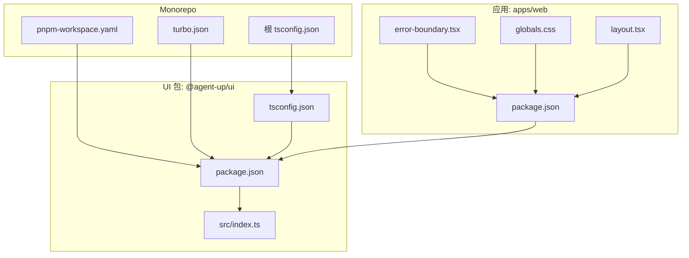
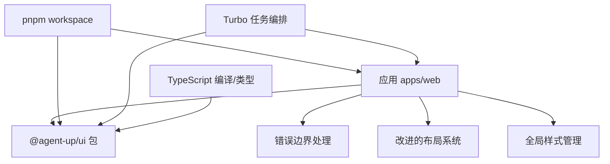
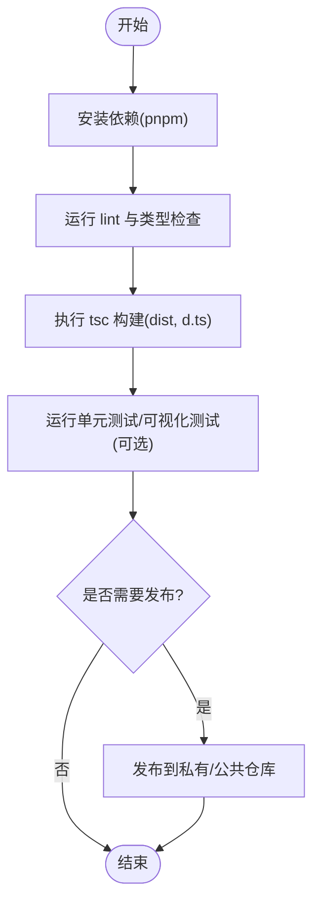
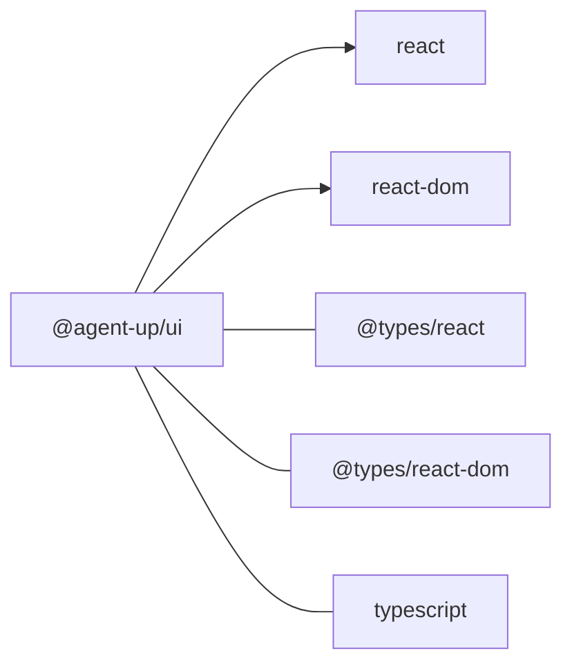

# UI 组件库包

<cite>
**本文引用的文件**   
- [package.json](file://packages/ui/package.json)
- [tsconfig.json](file://packages/ui/tsconfig.json)
- [index.ts](file://packages/ui/src/index.ts)
- [turbo.json](file://turbo.json)
- [pnpm-workspace.yaml](file://pnpm-workspace.yaml)
- [tsconfig.json](file://tsconfig.json)
- [package.json](file://apps/web/package.json)
- [error-boundary.tsx](file://apps/web/app/components/error-boundary.tsx)
- [globals.css](file://apps/web/app/globals.css)
- [layout.tsx](file://apps/web/app/(dashboard)/layout.tsx)
</cite>

## 更新摘要
**所做更改**   
- 增强了仪表板组件的布局系统
- 添加了错误边界处理机制
- 改进了全局样式管理
- 更新了组件架构以支持更好的可维护性

## 目录
1. [简介](#简介)
2. [项目结构](#项目结构)
3. [核心组件](#核心组件)
4. [架构总览](#架构总览)
5. [详细组件分析](#详细组件分析)
6. [依赖分析](#依赖分析)
7. [性能考虑](#性能考虑)
8. [故障排查指南](#故障排查指南)
9. [结论](#结论)
10. [附录](#附录)

## 简介
本文件面向 @agent-up/ui 组件库，系统性说明其构建与发布流程、React 组件设计原则与 API 约定、样式与主题管理、响应式实现策略、测试与 Storybook 集成方案、打包与 Tree Shaking 优化、依赖管理与版本控制、变更日志与发布自动化，以及开发规范、代码审查清单与质量保证流程。同时提供实际组件开发与集成指南，帮助团队在现有 Monorepo（pnpm + Turbo）环境下高效产出高质量可复用 React 组件。

当前仓库中 packages/ui 已具备基础骨架：TypeScript 编译输出、声明与源码入口、Turbo 任务编排与 pnpm workspace 配置。近期已增强仪表板组件，改进布局系统，添加错误边界处理和全局样式改进，为后续扩展 shadcn/ui 等生态能力奠定基础。

## 项目结构
packages/ui 采用最小化骨架，便于快速迭代与统一治理：
- 包元信息与脚本：定义名称、版本、主入口、类型入口、构建与清理脚本、依赖与对等依赖
- TypeScript 配置：继承根 tsconfig，指定 outDir、rootDir、jsx 模式与 include
- 源码入口：导出公共 API（当前为版本常量），预留后续组件导出位置

**图表来源**
- [pnpm-workspace.yaml:1-4](file://pnpm-workspace.yaml#L1-L4)
- [turbo.json:1-31](file://turbo.json#L1-L31)
- [tsconfig.json:1-22](file://tsconfig.json#L1-L22)
- [package.json:1-25](file://packages/ui/package.json#L1-L25)
- [tsconfig.json:1-10](file://packages/ui/tsconfig.json#L1-L10)
- [index.ts:1-5](file://packages/ui/src/index.ts#L1-L5)
- [package.json:1-38](file://apps/web/package.json#L1-38)

**章节来源**
- [pnpm-workspace.yaml:1-4](file://pnpm-workspace.yaml#L1-L4)
- [turbo.json:1-31](file://turbo.json#L1-L31)
- [tsconfig.json:1-22](file://tsconfig.json#L1-L22)
- [package.json:1-25](file://packages/ui/package.json#L1-L25)
- [tsconfig.json:1-10](file://packages/ui/tsconfig.json#L1-L10)
- [index.ts:1-5](file://packages/ui/src/index.ts#L1-L5)
- [package.json:1-38](file://apps/web/package.json#L1-38)

## 核心组件
目前 @agent-up/ui 尚未包含具体 UI 组件，仅暴露一个版本常量作为示例导出，用于验证模块结构与类型声明。后续将在此处集中导出所有组件与工具函数，形成稳定的公共 API。

- 当前导出项：版本常量
- 导出策略：按功能域组织 barrel 文件，避免深层路径耦合
- 类型策略：保持 strict 模式，开启 declaration 与 sourceMap，确保消费端获得完整类型提示与调试体验

**章节来源**
- [index.ts:1-5](file://packages/ui/src/index.ts#L1-L5)
- [tsconfig.json:1-22](file://packages/ui/tsconfig.json#L1-L22)
- [tsconfig.json:1-10](file://packages/ui/tsconfig.json#L1-L10)

## 架构总览
下图展示了 @agent-up/ui 在 Monorepo 中的角色与交互关系：应用通过 pnpm workspace 引用该包；Turbo 负责跨包任务编排；TypeScript 负责类型与构建产物生成。新增的错误边界和布局系统为组件提供了更好的稳定性和可维护性。

**图表来源**
- [pnpm-workspace.yaml:1-4](file://pnpm-workspace.yaml#L1-L4)
- [turbo.json:1-31](file://turbo.json#L1-L31)
- [package.json:1-38](file://apps/web/package.json#L1-38)
- [package.json:1-25](file://packages/ui/package.json#L1-L25)
- [error-boundary.tsx](file://apps/web/app/components/error-boundary.tsx)
- [layout.tsx](file://apps/web/app/(dashboard)/layout.tsx)
- [globals.css](file://apps/web/app/globals.css)

## 详细组件分析

### 构建与发布流程
- 本地开发
  - 使用 pnpm 安装依赖并启动开发环境（由 Turborepo 协调）
  - 运行 lint 与类型检查，确保代码质量
- 构建
  - 执行包的 build 脚本，基于 TypeScript 生成 dist 与 .d.ts 声明
  - 通过 Turbo 的 dependsOn 机制保证上游依赖先构建
- 发布
  - 当前包标记为 private，暂不直接发布到 npm
  - 若需对外发布，建议改为 public，配置 main/types 指向 dist，并接入版本与发布流水线

**图表来源**
- [package.json:1-25](file://packages/ui/package.json#L1-L25)
- [tsconfig.json:1-10](file://packages/ui/tsconfig.json#L1-L10)
- [turbo.json:1-31](file://turbo.json#L1-L31)

**章节来源**
- [package.json:1-25](file://packages/ui/package.json#L1-L25)
- [tsconfig.json:1-10](file://packages/ui/tsconfig.json#L1-L10)
- [turbo.json:1-31](file://turbo.json#L1-L31)

### React 组件设计原则与 API 设计
- 设计原则
  - 单一职责：每个组件聚焦一个明确职责
  - 受控与非受控并存：根据场景提供灵活的数据绑定方式
  - 组合优于继承：通过 props.children 与插槽模式组合行为
  - 可访问性优先：遵循 WCAG 标准，提供键盘导航与语义化标签
  - 无副作用：纯渲染为主，副作用通过回调或外部状态管理
- API 设计
  - Props 命名：小驼峰，布尔型以 is/has/show/hide 前缀
  - 事件回调：onXxx 形式，参数包含合成事件与业务数据
  - 默认值：通过 defaultProps 或解构默认值提供稳定默认行为
  - 类型安全：严格 TS 类型约束，必要时引入泛型提升复用性
  - 稳定性：对破坏性变更遵循语义化版本控制

### 样式管理、主题定制与响应式设计
- 样式管理
  - 推荐 CSS-in-JS 或原子化 CSS（如 Tailwind），结合 PostCSS 处理浏览器兼容
  - 组件内样式与作用域隔离，避免全局污染
  - **新增**：全局样式统一管理，通过 globals.css 集中定义基础样式变量
- 主题定制
  - 通过 CSS 变量或主题对象集中管理颜色、字号、间距、断点等
  - 提供主题切换能力，支持明暗模式与品牌色替换
- 响应式设计
  - 基于容器查询或媒体查询实现自适应布局
  - 组件内部提供尺寸变体（sm/md/lg/xl）与密度选项
  - **新增**：改进的布局系统支持更灵活的响应式网格

**章节来源**
- [globals.css](file://apps/web/app/globals.css)
- [layout.tsx](file://apps/web/app/(dashboard)/layout.tsx)

### 组件测试策略与 Storybook 集成
- 测试策略
  - 单元测试：使用 Jest/Vitest 对纯函数与 Hook 进行测试
  - 组件测试：使用 Testing Library 进行用户行为驱动测试
  - 快照测试：谨慎使用，配合回归用例
- Storybook 集成
  - 为每个组件编写多个故事，覆盖不同 props、主题与交互
  - 使用 Controls 与 ArgsTable 自动生成文档
  - 结合 Chromatic 进行视觉回归测试

### 打包、Tree Shaking 优化与依赖管理
- 打包
  - 使用 TypeScript 生成 ESM/CJS 双格式（按需配置）
  - 通过 package.json 的 exports 字段精确控制入口
- Tree Shaking
  - 保持纯函数与无副作用导入
  - 避免在顶层执行复杂逻辑
  - 合理使用条件导入与动态 import
- 依赖管理
  - 运行时依赖放入 dependencies，开发依赖放入 devDependencies
  - 将 react/react-dom 声明为 peerDependencies，避免重复打包

**章节来源**
- [package.json:1-25](file://packages/ui/package.json#L1-L25)
- [tsconfig.json:1-10](file://packages/ui/tsconfig.json#L1-L10)

### 版本控制、变更日志与发布自动化
- 版本控制
  - 使用语义化版本（SemVer），在包元信息中维护版本号
  - 分支策略：main 稳定，feature/* 开发，hotfix/* 修复
- 变更日志
  - 使用 conventional-changelog 或类似工具自动生成 CHANGELOG
  - 提交信息遵循 Conventional Commits 规范
- 发布自动化
  - 在 CI 中执行构建、测试、打包与发布步骤
  - 使用 npm/pnpm publish 或私有仓库 CLI 完成发布

### 组件开发规范、代码审查清单与质量保证
- 开发规范
  - 统一 ESLint/Prettier 规则，强制代码风格一致
  - 组件文件命名与目录结构规范化
  - 文档与注释要求：JSDoc 补充关键 API 说明
- 代码审查清单
  - 类型是否完备、边界条件是否处理、错误提示是否友好
  - 可访问性是否达标、性能是否合理、是否存在潜在内存泄漏
  - 测试覆盖率与 Story 完整性
- 质量保证
  - 预提交钩子（lint-staged + husky）
  - CI 流水线：构建、类型检查、测试、覆盖率报告

### 实际组件开发示例与集成指南
- 新增组件步骤
  - 在 src 下创建组件目录与 index.ts 导出
  - 编写组件逻辑、样式与类型定义
  - 添加单元测试与 Storybook 故事
  - 更新 barrel 文件，统一导出
- 在应用中集成
  - 通过 pnpm workspace 引用 @agent-up/ui
  - 在 Next.js 项目中按需导入组件并使用
  - 配置主题与样式资源（如 Tailwind 配置）
  - **新增**：集成错误边界处理，确保组件异常不影响整体应用

**章节来源**
- [package.json:1-38](file://apps/web/package.json#L1-38)
- [index.ts:1-5](file://packages/ui/src/index.ts#L1-L5)
- [error-boundary.tsx](file://apps/web/app/components/error-boundary.tsx)

### 错误边界处理与全局样式改进
- 错误边界处理
  - **新增**：实现了全局错误边界组件，捕获组件树中的 JavaScript 错误
  - 提供友好的错误界面，防止应用崩溃
  - 支持错误上报与监控集成
- 全局样式改进
  - **新增**：统一的 CSS 变量管理系统，支持主题切换
  - 响应式布局系统，适配不同屏幕尺寸
  - 标准化的间距、颜色和字体系统

**章节来源**
- [error-boundary.tsx](file://apps/web/app/components/error-boundary.tsx)
- [globals.css](file://apps/web/app/globals.css)
- [layout.tsx](file://apps/web/app/(dashboard)/layout.tsx)

## 依赖分析
@agent-up/ui 的依赖与对等依赖如下：
- 运行时依赖：react、react-dom
- 对等依赖：react、react-dom（避免重复打包）
- 开发依赖：@types/react、@types/react-dom、typescript

**图表来源**
- [package.json:1-25](file://packages/ui/package.json#L1-L25)

**章节来源**
- [package.json:1-25](file://packages/ui/package.json#L1-L25)

## 性能考虑
- 减少不必要的重渲染：使用 React.memo、useMemo、useCallback
- 懒加载与代码分割：大组件与第三方库按需加载
- 样式体积控制：避免引入未使用的样式类，启用 PurgeCSS/Tailwind 优化
- 类型与声明：保持 strict 与增量编译，缩短构建时间
- **新增**：错误边界减少级联失败影响，提高应用稳定性

## 故障排查指南
- 构建失败
  - 检查 TypeScript 配置与 JSX 模式是否正确
  - 确认 outDir 与 rootDir 设置无误
- 类型报错
  - 确保 @types/react 与 react 版本匹配
  - 检查 peerDependencies 与应用的依赖版本一致性
- 运行时警告
  - 确认 react/react-dom 未被重复打包
  - 检查组件是否在服务端/客户端正确渲染
- **新增**：错误边界问题
  - 检查错误边界是否正确包裹组件树
  - 确认错误处理逻辑是否正常工作

**章节来源**
- [tsconfig.json:1-10](file://packages/ui/tsconfig.json#L1-L10)
- [tsconfig.json:1-22](file://tsconfig.json#L1-L22)
- [package.json:1-25](file://packages/ui/package.json#L1-L25)
- [error-boundary.tsx](file://apps/web/app/components/error-boundary.tsx)

## 结论
@agent-up/ui 已具备清晰的包结构与构建基础，适合在 Monorepo 中持续演进。近期增强的仪表板组件、改进的布局系统、错误边界处理和全局样式改进为组件库奠定了更好的基础。建议在现有骨架上逐步完善组件实现、样式与主题系统、测试与文档、发布自动化与质量门禁，最终形成高可用、高性能、易维护的企业级 UI 组件库。

## 附录
- 常用命令
  - 安装依赖：pnpm install
  - 构建包：pnpm --filter @agent-up/ui build
  - 类型检查：tsc --noEmit
  - 清理产物：pnpm --filter @agent-up/ui clean
- 参考配置
  - pnpm workspace 与 Turbo 任务编排
  - TypeScript 编译与类型声明

**章节来源**
- [pnpm-workspace.yaml:1-4](file://pnpm-workspace.yaml#L1-L4)
- [turbo.json:1-31](file://turbo.json#L1-L31)
- [package.json:1-25](file://packages/ui/package.json#L1-L25)
- [tsconfig.json:1-10](file://packages/ui/tsconfig.json#L1-L10)