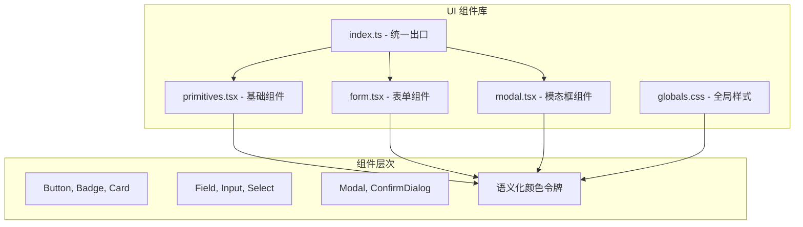
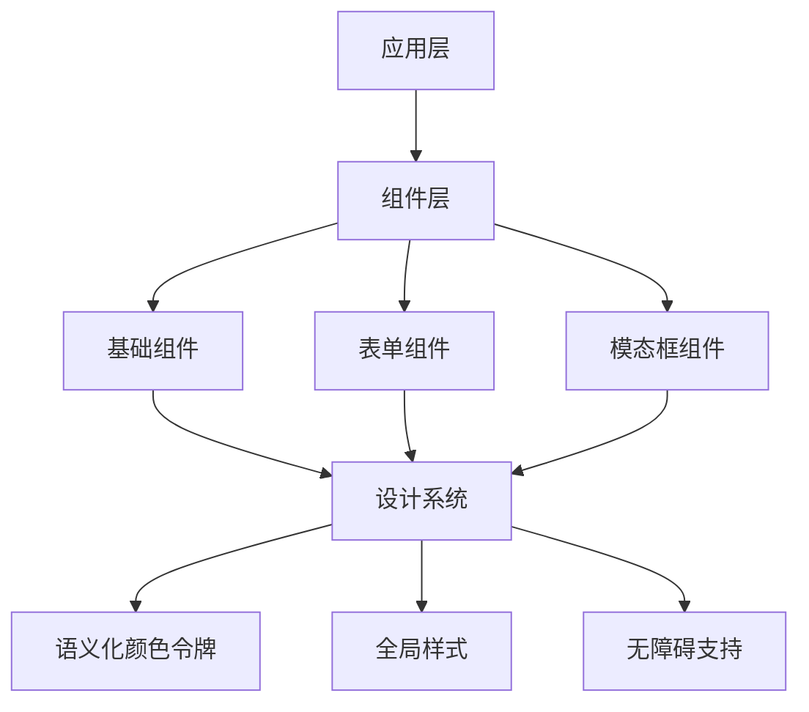
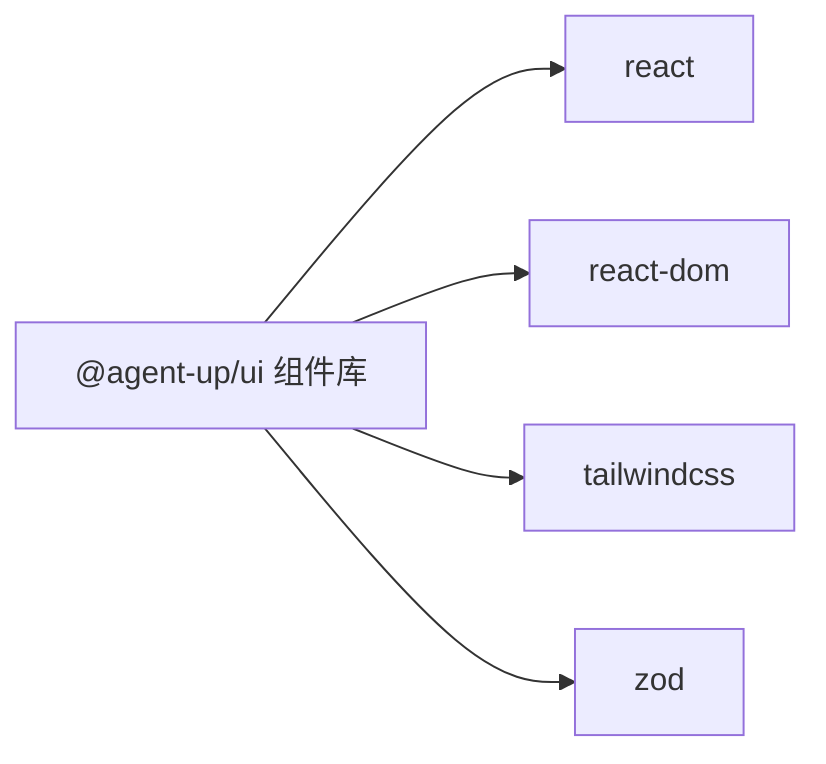

# UI 组件库包

<cite>
**本文引用的文件**
- [primitives.tsx](file://apps/web/components/ui/primitives.tsx)
- [modal.tsx](file://apps/web/components/ui/modal.tsx)
- [form.tsx](file://apps/web/components/ui/form.tsx)
- [index.ts](file://apps/web/components/ui/index.ts)
- [globals.css](file://apps/web/app/globals.css)
- [package.json](file://apps/web/package.json)
</cite>

## 更新摘要
**所做更改**
- 新增集中式 UI 组件库，包含 primitives、modal、form 等核心组件
- 建立统一的设计系统与语义化颜色令牌系统
- 实现无障碍访问支持（焦点管理、键盘导航、ARIA 属性）
- 提供表单字段、模态框、按钮、徽章等基础组件
- 统一样式管理与主题切换支持

## 目录
1. [简介](#简介)
2. [项目结构](#项目结构)
3. [核心组件](#核心组件)
4. [架构总览](#架构总览)
5. [详细组件分析](#详细组件分析)
6. [设计系统与主题](#设计系统与主题)
7. [依赖分析](#依赖分析)
8. [性能考虑](#性能考虑)
9. [故障排查指南](#故障排查指南)
10. [结论](#结论)
11. [附录](#附录)

## 简介
本文件详细说明 apps/web/components/ui 集中式 UI 组件库的构建和发布流程。该组件库提供了统一的 React 组件设计原则、API 设计和文档生成方案。组件采用语义化颜色令牌系统，支持响应式设计和无障碍访问。通过标准化的组件接口和样式管理，为应用提供高质量的可复用 UI 组件。

当前组件库已包含基础展示型组件、表单组件、模态框组件等核心功能，建立了完整的设计系统和统一的视觉规范。

## 项目结构
apps/web/components/ui 采用模块化组织方式，每个文件专注于特定功能领域：



**图表来源**
- [index.ts:1-10](file://apps/web/components/ui/index.ts#L1-L10)
- [primitives.tsx:1-487](file://apps/web/components/ui/primitives.tsx#L1-L487)
- [form.tsx:1-139](file://apps/web/components/ui/form.tsx#L1-L139)
- [modal.tsx:1-214](file://apps/web/components/ui/modal.tsx#L1-L214)
- [globals.css:1-152](file://apps/web/app/globals.css#L1-L152)

**章节来源**
- [index.ts:1-10](file://apps/web/components/ui/index.ts#L1-L10)
- [primitives.tsx:1-487](file://apps/web/components/ui/primitives.tsx#L1-L487)
- [form.tsx:1-139](file://apps/web/components/ui/form.tsx#L1-L139)
- [modal.tsx:1-214](file://apps/web/components/ui/modal.tsx#L1-L214)

## 核心组件
组件库提供以下核心组件类别：

### 基础展示组件 (primitives.tsx)
- **Button**: 支持多种变体（primary/secondary/ghost/danger）、尺寸（sm/md）和加载状态
- **IconButton**: 纯图标按钮，强制无障碍标签
- **Badge**: 状态徽章，支持语义化颜色和原始代码显示
- **Card**: 卡片容器，支持内边距和交互效果
- **Alert**: 警告提示，支持重试功能和多种语义类型
- **EmptyState**: 空状态展示，支持标题层级配置
- **Skeleton**: 骨架屏组件，用于加载占位
- **PageHeader**: 页面头部组件，支持标题、描述和操作区

### 表单组件 (form.tsx)
- **Field**: 表单字段容器，自动处理 label、错误提示和辅助文本
- **Input/Select/Textarea**: 标准化表单输入控件
- **FormActions**: 表单底部操作区域
- **InlineField**: 行内字段，适用于工具栏场景

### 模态框组件 (modal.tsx)
- **Modal**: 通用模态框，支持焦点管理、ESC 关闭和滚动锁定
- **ConfirmDialog**: 确认对话框，替代原生 confirm()

**章节来源**
- [primitives.tsx:43-487](file://apps/web/components/ui/primitives.tsx#L43-L487)
- [form.tsx:26-139](file://apps/web/components/ui/form.tsx#L26-L139)
- [modal.tsx:19-214](file://apps/web/components/ui/modal.tsx#L19-L214)

## 架构总览
组件库采用分层架构设计，确保组件间的解耦和可维护性：



**图表来源**
- [primitives.tsx:1-487](file://apps/web/components/ui/primitives.tsx#L1-L487)
- [form.tsx:1-139](file://apps/web/components/ui/form.tsx#L1-L139)
- [modal.tsx:1-214](file://apps/web/components/ui/modal.tsx#L1-L214)
- [globals.css:1-152](file://apps/web/app/globals.css#L1-L152)

## 详细组件分析

### 基础组件实现
基础组件采用 TypeScript 开发，提供完整的类型定义和 JSDoc 注释：

- **Button 组件**: 支持 loading 状态、多种变体和尺寸，内置无障碍属性
- **Badge 组件**: 支持语义化颜色、原始代码显示和悬浮解释
- **Card 组件**: 提供统一的边框、背景色和交互效果
- **Alert 组件**: 支持重试功能、多种语义类型和自定义提示

### 表单组件特性
表单组件重点关注可访问性和用户体验：

- **Field 组件**: 自动关联 label 与控件 id，支持错误提示和辅助文本
- **统一样式**: 所有输入控件使用一致的边框、背景和过渡效果
- **无障碍支持**: 正确的 ARIA 属性和键盘导航支持

### 模态框功能
模态框组件实现了完整的交互逻辑：

- **焦点管理**: 打开时聚焦到第一个可聚焦元素，关闭时恢复焦点
- **键盘支持**: ESC 键关闭、Tab 键在模态框内循环聚焦
- **滚动锁定**: 防止背景页面滚动
- **点击外部关闭**: 点击遮罩层关闭模态框

**章节来源**
- [primitives.tsx:43-487](file://apps/web/components/ui/primitives.tsx#L43-L487)
- [form.tsx:26-139](file://apps/web/components/ui/form.tsx#L26-L139)
- [modal.tsx:19-214](file://apps/web/components/ui/modal.tsx#L19-L214)

## 设计系统与主题

### 语义化颜色令牌系统
组件库建立了完整的语义化颜色系统，通过 CSS 变量实现：

```css
/* 基础色彩 */
--background: #fafafa;
--foreground: #18181b;
--surface: #ffffff;
--surface-elevated: #f4f4f5;

/* 语义状态色 */
--danger: #b91c1c;
--success: #15803d;
--warn: #b45309;
--accent: #2563eb;

/* 文字层级 */
--muted: #52525b;
--subtle: #63636c;
```

### 主题支持
- **明暗模式**: 通过 `prefers-color-scheme` 媒体查询自动切换
- **品牌定制**: 通过修改 CSS 变量即可实现品牌色替换
- **对比度保证**: 所有颜色组合都经过 WCAG AA 标准验证

### 响应式设计
- **移动端优先**: 基于移动设备的设计策略
- **断点系统**: 使用 Tailwind CSS 的响应式工具类
- **触摸友好**: 适当的触摸目标大小和间距

**章节来源**
- [globals.css:1-152](file://apps/web/app/globals.css#L1-L152)
- [primitives.tsx:22-41](file://apps/web/components/ui/primitives.tsx#L22-L41)

## 依赖分析
组件库保持最小化依赖，仅依赖 React 生态系统：



**图表来源**
- [package.json:14-21](file://apps/web/package.json#L14-L21)

**章节来源**
- [package.json:14-21](file://apps/web/package.json#L14-L21)

## 性能考虑
组件库在设计时充分考虑了性能优化：

- **按需导入**: 通过 barrel 文件实现精确的 Tree Shaking
- **轻量级实现**: 避免引入大型第三方依赖
- **CSS-in-JS 优化**: 使用 Tailwind CSS 的原子化样式
- **内存管理**: 模态框组件正确清理事件监听器和 DOM 引用
- **渲染优化**: 合理使用 React.memo 和条件渲染

## 故障排查指南

### 常见问题及解决方案
- **样式冲突**: 确保组件样式优先级正确，避免全局样式覆盖
- **焦点问题**: 检查模态框的焦点管理逻辑是否正确执行
- **类型错误**: 确保 TypeScript 配置正确，类型定义完整
- **无障碍问题**: 使用屏幕阅读器测试组件的可访问性

### 调试技巧
- **开发者工具**: 使用浏览器开发者工具检查组件结构和样式
- **控制台日志**: 在关键组件中添加调试日志输出
- **单元测试**: 编写测试用例验证组件行为
- **可视化测试**: 使用 Storybook 进行组件可视化测试

## 结论
apps/web/components/ui 组件库成功建立了统一的 UI 设计规范，提供了高质量的 React 组件集合。通过语义化颜色令牌系统、完善的无障碍支持和响应式设计，为应用开发提供了坚实的基础。组件库的模块化架构确保了良好的可维护性和扩展性。

建议后续继续完善组件文档、增加更多业务组件、建立完整的测试套件，并考虑将组件库独立为 npm 包以便跨项目复用。

## 附录

### 常用组件使用示例

#### 按钮组件
```tsx
import { Button } from "@/components/ui";

<Button variant="primary" size="md">
  主要按钮
</Button>

<Button variant="danger" loading>
  危险操作
</Button>
```

#### 表单组件
```tsx
import { Field, Input, FormActions } from "@/components/ui";

<Field label="用户名" required error={errors.username}>
  {({ id }) => <Input id={id} placeholder="请输入用户名" />}
</Field>
```

#### 模态框组件
```tsx
import { Modal, Button } from "@/components/ui";

<Modal open={isOpen} onClose={() => setIsOpen(false)} title="确认操作">
  <p>确定要执行此操作吗？</p>
</Modal>
```

### 开发规范
- **组件命名**: 使用 PascalCase 命名组件
- **文件组织**: 每个组件独立文件，便于维护和测试
- **类型定义**: 为所有组件提供完整的 TypeScript 类型定义
- **文档注释**: 使用 JSDoc 注释说明组件用途和参数

**章节来源**
- [primitives.tsx:1-487](file://apps/web/components/ui/primitives.tsx#L1-L487)
- [form.tsx:1-139](file://apps/web/components/ui/form.tsx#L1-L139)
- [modal.tsx:1-214](file://apps/web/components/ui/modal.tsx#L1-L214)
- [index.ts:1-10](file://apps/web/components/ui/index.ts#L1-L10)