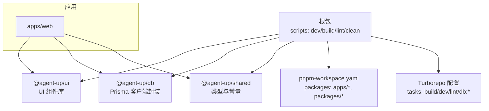
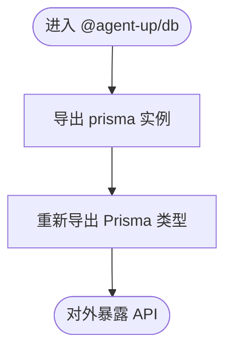
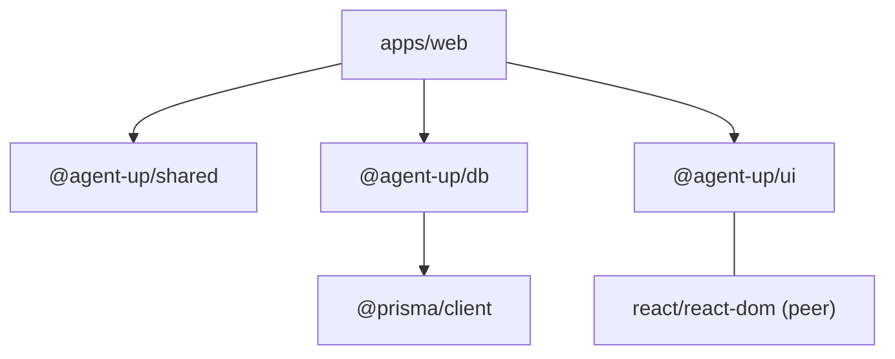

# 共享包开发

<cite>
**本文引用的文件**   
- [package.json](file://package.json)
- [pnpm-workspace.yaml](file://pnpm-workspace.yaml)
- [turbo.json](file://turbo.json)
- [packages/shared/package.json](file://packages/shared/package.json)
- [packages/shared/tsconfig.json](file://packages/shared/tsconfig.json)
- [packages/shared/src/index.ts](file://packages/shared/src/index.ts)
- [packages/db/package.json](file://packages/db/package.json)
- [packages/db/tsconfig.json](file://packages/db/tsconfig.json)
- [packages/db/src/index.ts](file://packages/db/src/index.ts)
- [packages/ui/package.json](file://packages/ui/package.json)
- [packages/ui/tsconfig.json](file://packages/ui/tsconfig.json)
- [packages/ui/src/index.ts](file://packages/ui/src/index.ts)
</cite>

## 目录
1. [简介](#简介)
2. [项目结构](#项目结构)
3. [核心组件](#核心组件)
4. [架构总览](#架构总览)
5. [详细组件分析](#详细组件分析)
6. [依赖分析](#依赖分析)
7. [性能考虑](#性能考虑)
8. [故障排查指南](#故障排查指南)
9. [结论](#结论)
10. [附录](#附录)

## 简介
本文件面向在 Monorepo 中开发与复用共享包的工程实践，围绕以下目标展开：
- 统一类型定义与常量（packages/shared）
- 数据库客户端封装与最佳实践（packages/db）
- UI 组件库的构建与发布流程（packages/ui）
- 包间依赖管理、版本同步与测试策略
- 包开发规范、文档生成与发布自动化
- 实际开发示例与集成指南，确保共享代码质量与一致性

## 项目结构
仓库采用 pnpm workspace + Turborepo 的 Monorepo 组织方式。顶层 package.json 提供跨包脚本入口；pnpm-workspace.yaml 声明 apps/* 与 packages/* 为工作区；turbo.json 定义任务缓存与依赖关系。



图表来源
- [package.json:1-22](file://package.json#L1-L22)
- [pnpm-workspace.yaml:1-4](file://pnpm-workspace.yaml#L1-L4)
- [turbo.json:1-31](file://turbo.json#L1-L31)

章节来源
- [package.json:1-22](file://package.json#L1-L22)
- [pnpm-workspace.yaml:1-4](file://pnpm-workspace.yaml#L1-L4)
- [turbo.json:1-31](file://turbo.json#L1-L31)

## 核心组件
- @agent-up/shared：集中导出领域类型与通用常量，作为跨包契约层，避免重复定义与不一致。
- @agent-up/db：封装 Prisma 客户端实例，并重新导出 Prisma 生成的类型，供应用与服务端统一使用。
- @agent-up/ui：前端共享组件库，当前为最小可用骨架，后续扩展 shadcn/ui 等组件。

章节来源
- [packages/shared/src/index.ts:1-15](file://packages/shared/src/index.ts#L1-L15)
- [packages/db/src/index.ts:1-3](file://packages/db/src/index.ts#L1-L3)
- [packages/ui/src/index.ts:1-5](file://packages/ui/src/index.ts#L1-L5)

## 架构总览
Monorepo 通过 workspace 将应用与共享包关联，Turborepo 负责并行构建与缓存。共享包之间保持低耦合：ui 不依赖 db，db 不依赖 ui，shared 无运行时依赖。

```mermaid
graph LR
subgraph "共享包"
S["@agent-up/shared<br/>类型/常量"]
D["@agent-up/db<br/>Prisma 客户端"]
U["@agent-up/ui<br/>React 组件"]
end
A["apps/web"] --> S
A --> D
A --> U
D -.->|"依赖"@prisma_client["@prisma/client"]
U -.->|"peerDependencies"@react["react/react-dom"]
```

图表来源
- [packages/shared/package.json:1-15](file://packages/shared/package.json#L1-L15)
- [packages/db/package.json:1-22](file://packages/db/package.json#L1-L22)
- [packages/ui/package.json:1-25](file://packages/ui/package.json#L1-L25)

## 详细组件分析

### 类型与常量包：@agent-up/shared
职责
- 集中导出领域类型与通用常量，保证多端一致的类型契约。
- 提供版本号规则等基础工具常量。

设计要点
- 通过 index.ts 聚合导出各子模块类型与常量，便于消费方按需引入。
- 使用 TypeScript 编译输出，配合 tsconfig 指定 outDir/rootDir。

使用建议
- 在应用与其他包中以“只读”方式使用该包，避免反向依赖。
- 新增类型时优先在此处维护，并在 index.ts 中显式导出。

章节来源
- [packages/shared/package.json:1-15](file://packages/shared/package.json#L1-L15)
- [packages/shared/tsconfig.json:1-9](file://packages/shared/tsconfig.json#L1-L9)
- [packages/shared/src/index.ts:1-15](file://packages/shared/src/index.ts#L1-L15)

#### 类型导出与版本管理
- 类型导出：index.ts 对 types 下各模块进行批量导出，形成单一入口。
- 版本管理：包内 version 字段用于标识语义化版本；在 monorepo 中可结合变更日志与 CI 实现自动递增与发布。

章节来源
- [packages/shared/src/index.ts:1-15](file://packages/shared/src/index.ts#L1-L15)
- [packages/shared/package.json:1-15](file://packages/shared/package.json#L1-L15)

### 数据库工具包：@agent-up/db
职责
- 封装 Prisma 客户端单例，对外暴露 prisma 实例与 Prisma 类型。
- 提供数据库相关脚本：generate/push/migrate。

封装与最佳实践
- 仅暴露必要接口（如 prisma），隐藏内部连接细节。
- 通过 re-export 类型，使调用方获得完整类型提示。
- 将数据库操作按领域拆分到服务层或仓储层，避免在业务逻辑中直接散落 Prisma 调用。



图表来源
- [packages/db/src/index.ts:1-3](file://packages/db/src/index.ts#L1-L3)

章节来源
- [packages/db/package.json:1-22](file://packages/db/package.json#L1-L22)
- [packages/db/tsconfig.json:1-9](file://packages/db/tsconfig.json#L1-L9)
- [packages/db/src/index.ts:1-3](file://packages/db/src/index.ts#L1-L3)

### UI 组件库：@agent-up/ui
职责
- 提供跨应用复用的 React 组件与样式约定。
- 通过 peerDependencies 约束宿主应用的 React 版本，避免重复打包。

构建与发布流程
- 构建：tsc 编译源码至 dist（tsconfig 已配置）。
- 发布：需补充打包器（如 Vite/Rollup）、ESM/CJS 产物、README 与 CHANGELOG，并通过 npm 或私有 registry 发布。
- 当前为最小可用骨架，后续可集成 shadcn/ui 并完善主题与图标体系。

章节来源
- [packages/ui/package.json:1-25](file://packages/ui/package.json#L1-L25)
- [packages/ui/tsconfig.json:1-10](file://packages/ui/tsconfig.json#L1-L10)
- [packages/ui/src/index.ts:1-5](file://packages/ui/src/index.ts#L1-L5)

## 依赖分析
- 包间依赖
  - apps/web 依赖 shared、db、ui。
  - @agent-up/db 依赖 @prisma/client。
  - @agent-up/ui 以 peerDependencies 声明 react/react-dom。
- 构建与缓存
  - Turborepo 的 build 任务依赖上游包的构建结果（^build），并缓存 .next 与 dist。
  - dev 任务禁用缓存且持久运行。



图表来源
- [packages/shared/package.json:1-15](file://packages/shared/package.json#L1-L15)
- [packages/db/package.json:1-22](file://packages/db/package.json#L1-L22)
- [packages/ui/package.json:1-25](file://packages/ui/package.json#L1-L25)
- [turbo.json:1-31](file://turbo.json#L1-L31)

章节来源
- [turbo.json:1-31](file://turbo.json#L1-L31)
- [packages/db/package.json:1-22](file://packages/db/package.json#L1-L22)
- [packages/ui/package.json:1-25](file://packages/ui/package.json#L1-L25)

## 性能考虑
- 构建缓存：利用 Turborepo 的输入/输出与依赖图，减少重复构建。
- 依赖收敛：共享包尽量保持轻量，避免引入重型运行时依赖。
- 按需导入：在应用侧按需引入 shared 类型与 ui 组件，减小包体积。
- 冷启动优化：db 包仅暴露必要接口，避免在模块加载期执行重计算。

## 故障排查指南
常见问题与定位思路
- 类型不同步
  - 现象：应用侧类型报错或提示缺失。
  - 排查：确认 shared 的导出是否更新；检查 tsconfig 的 include/outDir；清理 .turbo 与 node_modules 后重试。
- Prisma 类型未生成
  - 现象：db 包无法解析 Prisma 类型。
  - 排查：执行 db:generate；确认 schema 路径与环境变量；必要时清理 dist 与 .turbo。
- UI 组件运行时错误
  - 现象：React 版本冲突或组件渲染异常。
  - 排查：核对 peerDependencies 与宿主应用版本；确保只安装一份 react/react-dom。
- 构建缓存污染
  - 现象：增量构建失败或行为不一致。
  - 排查：运行 clean 任务；删除 .turbo 与 dist；重新执行 build。

章节来源
- [packages/shared/package.json:1-15](file://packages/shared/package.json#L1-L15)
- [packages/db/package.json:1-22](file://packages/db/package.json#L1-L22)
- [packages/ui/package.json:1-25](file://packages/ui/package.json#L1-L25)
- [turbo.json:1-31](file://turbo.json#L1-L31)

## 结论
通过 shared/db/ui 三个共享包，本项目实现了类型契约、数据访问与 UI 能力的解耦与复用。配合 pnpm workspace 与 Turborepo，可在大型工程中保持构建高效、依赖清晰与质量可控。后续建议完善 UI 组件库的打包与发布流水线，建立统一的版本管理与变更追踪机制，并引入端到端与单元测试保障稳定性。

## 附录

### 包开发规范
- 命名与入口
  - 包名遵循 @agent-up/<scope> 风格；src/index.ts 作为统一入口。
- 类型与常量
  - 所有跨包共享的类型与常量放入 shared，禁止在多个包中重复定义。
- 依赖边界
  - shared 不依赖其他包；db 仅依赖 Prisma；ui 仅声明 React peerDependencies。
- 构建配置
  - 每个包提供独立 tsconfig，继承根配置并设置 outDir/rootDir/include。
- 脚本约定
  - 提供 build/clean 脚本；db 包额外提供 db:generate/db:push/db:migrate。

章节来源
- [packages/shared/package.json:1-15](file://packages/shared/package.json#L1-L15)
- [packages/db/package.json:1-22](file://packages/db/package.json#L1-L22)
- [packages/ui/package.json:1-25](file://packages/ui/package.json#L1-L25)
- [packages/shared/tsconfig.json:1-9](file://packages/shared/tsconfig.json#L1-L9)
- [packages/db/tsconfig.json:1-9](file://packages/db/tsconfig.json#L1-L9)
- [packages/ui/tsconfig.json:1-10](file://packages/ui/tsconfig.json#L1-L10)

### 包间依赖管理与版本同步
- 本地开发
  - 通过 pnpm workspace 自动链接，修改共享包后无需手动 publish。
- 版本策略
  - 采用语义化版本；在 shared/db/ui 的 package.json 中维护 version。
  - 建议在 CI 中基于变更检测自动递增主/次/补丁版本，并生成 CHANGELOG。
- 依赖升级
  - 统一升级 Prisma、React 等关键依赖，确保 peerDependencies 与宿主应用兼容。

章节来源
- [packages/shared/package.json:1-15](file://packages/shared/package.json#L1-L15)
- [packages/db/package.json:1-22](file://packages/db/package.json#L1-L22)
- [packages/ui/package.json:1-25](file://packages/ui/package.json#L1-L25)

### 测试策略
- 单元与集成
  - shared：针对类型与常量的静态校验与简单断言。
  - db：对查询封装进行集成测试（可使用内存数据库或测试容器）。
  - ui：组件快照与交互测试（Jest + Testing Library）。
- 覆盖率与门禁
  - 在 CI 中收集覆盖率并设置阈值；失败则阻断合并。

[本节为通用指导，不直接分析具体文件]

### 文档生成与发布自动化
- 文档
  - 为每个包生成 API 文档（TypeScript 注释 + 文档站点）。
- 发布
  - 为 ui 包补充打包器（Vite/Rollup），输出 ESM/CJS，配置 README/CHANGELOG/License。
  - 在 CI 中完成构建、测试、打包、发布到 npm 或私有源。

[本节为通用指导，不直接分析具体文件]

### 实际开发示例与集成指南
- 在应用中引入 shared 类型
  - 从 @agent-up/shared 导入所需类型与常量，用于函数签名与表单校验。
- 在应用中接入 db 客户端
  - 从 @agent-up/db 导入 prisma 实例与 Prisma 类型，在服务端路由或 API 中使用。
- 在应用中复用 ui 组件
  - 从 @agent-up/ui 导入组件，并确保宿主应用安装匹配的 React 版本。

章节来源
- [packages/shared/src/index.ts:1-15](file://packages/shared/src/index.ts#L1-L15)
- [packages/db/src/index.ts:1-3](file://packages/db/src/index.ts#L1-L3)
- [packages/ui/src/index.ts:1-5](file://packages/ui/src/index.ts#L1-L5)