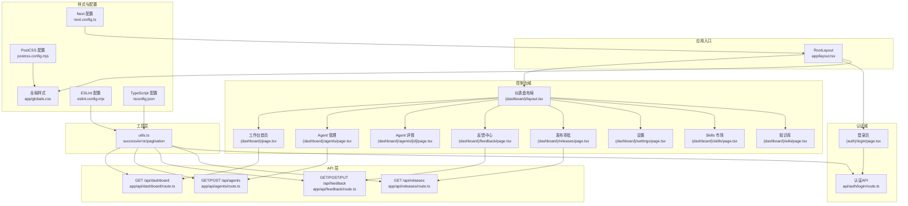
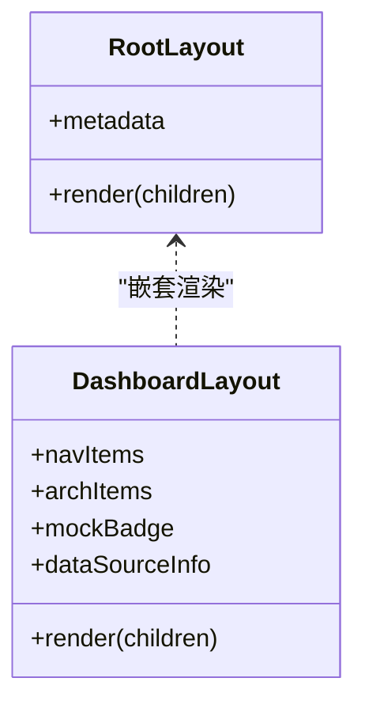
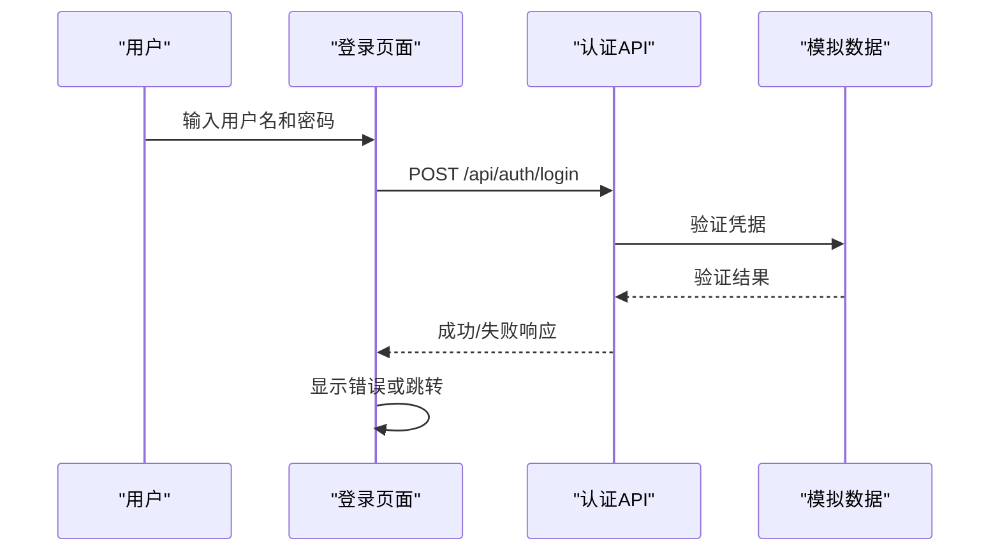
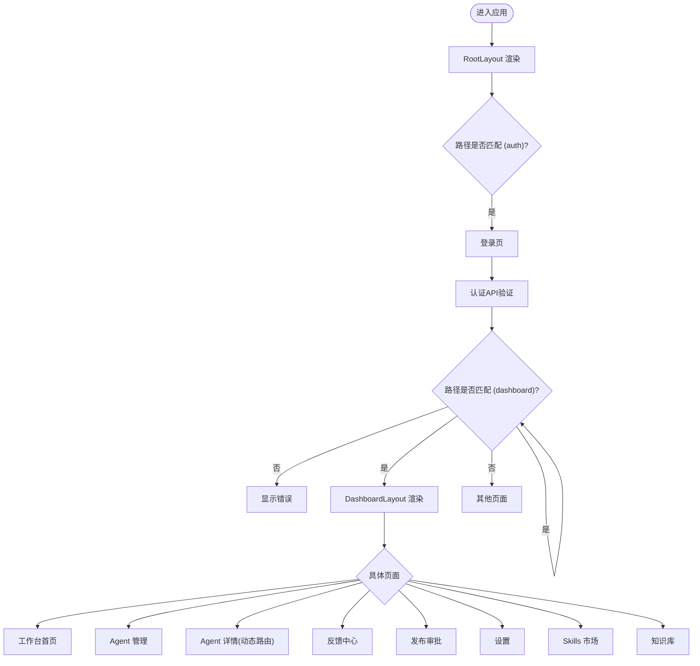
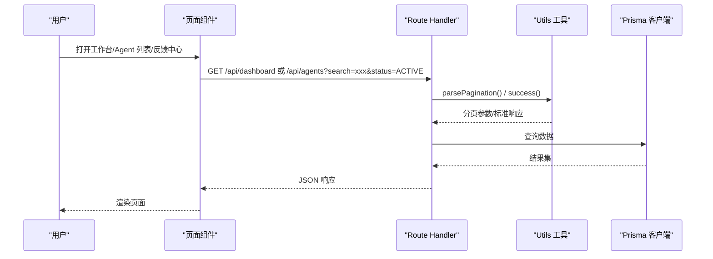
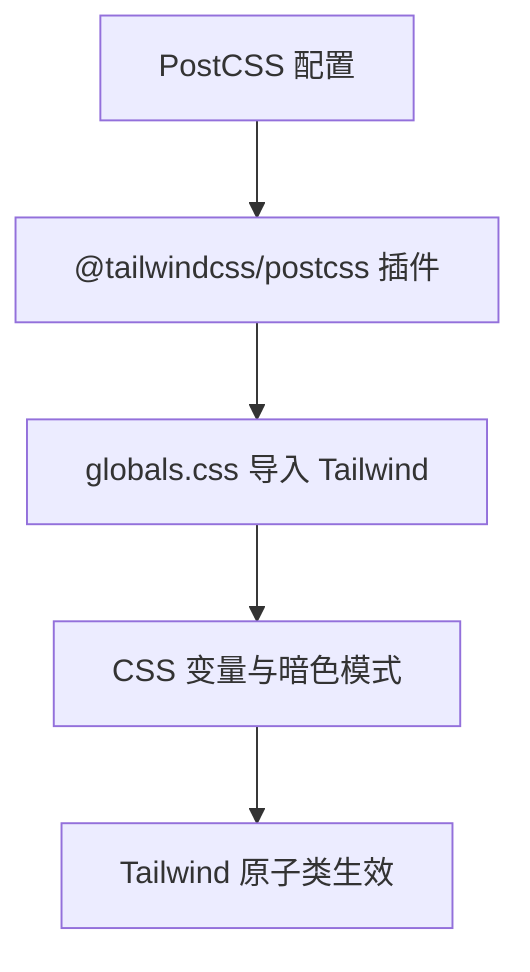
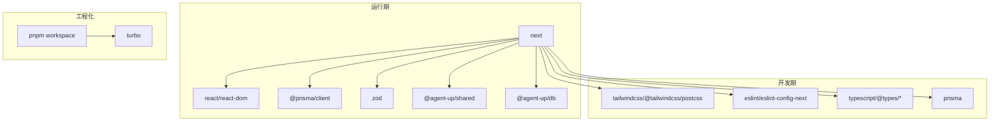

# 前端架构

<cite>
**本文引用的文件**
- [apps/web/next.config.ts](file://apps/web/next.config.ts)
- [apps/web/app/layout.tsx](file://apps/web/app/layout.tsx)
- [apps/web/app/globals.css](file://apps/web/app/globals.css)
- [apps/web/postcss.config.mjs](file://apps/web/postcss.config.mjs)
- [apps/web/package.json](file://apps/web/package.json)
- [apps/web/tsconfig.json](file://apps/web/tsconfig.json)
- [apps/web/eslint.config.mjs](file://apps/web/eslint.config.mjs)
- [apps/web/app/(dashboard)/layout.tsx](file://apps/web/app/(dashboard)/layout.tsx)
- [apps/web/app/(dashboard)/page.tsx](file://apps/web/app/(dashboard)/page.tsx)
- [apps/web/app/(auth)/login/page.tsx](file://apps/web/app/(auth)/login/page.tsx)
- [apps/web/app/api/auth/login/route.ts](file://apps/web/app/api/auth/login/route.ts)
- [apps/web/app/(dashboard)/agents/page.tsx](file://apps/web/app/(dashboard)/agents/page.tsx)
- [apps/web/app/(dashboard)/agents/[id]/page.tsx](file://apps/web/app/(dashboard)/agents/[id]/page.tsx)
- [apps/web/app/(dashboard)/feedback/page.tsx](file://apps/web/app/(dashboard)/feedback/page.tsx)
- [apps/web/app/(dashboard)/releases/page.tsx](file://apps/web/app/(dashboard)/releases/page.tsx)
- [apps/web/app/(dashboard)/settings/page.tsx](file://apps/web/app/(dashboard)/settings/page.tsx)
- [apps/web/app/(dashboard)/skills/page.tsx](file://apps/web/app/(dashboard)/skills/page.tsx)
- [apps/web/app/(dashboard)/wiki/page.tsx](file://apps/web/app/(dashboard)/wiki/page.tsx)
- [apps/web/app/api/dashboard/route.ts](file://apps/web/app/api/dashboard/route.ts)
- [apps/web/app/api/agents/route.ts](file://apps/web/app/api/agents/route.ts)
- [apps/web/app/api/feedback/route.ts](file://apps/web/app/api/feedback/route.ts)
- [apps/web/app/api/releases/route.ts](file://apps/web/app/api/releases/route.ts)
- [apps/web/lib/utils.ts](file://apps/web/lib/utils.ts)
- [package.json](file://package.json)
</cite>

## 更新摘要
**变更内容**
- 增强了认证系统，实现了完整的模拟登录功能，包含用户验证和会话管理
- 改进了仪表板布局，添加了 MOCK 徽章和数据源澄清标识
- 提升了代码质量，集成了 ESLint 配置和 TypeScript 类型安全增强
- 完善了错误处理机制和用户体验优化

## 目录
1. [简介](#简介)
2. [项目结构](#项目结构)
3. [核心组件](#核心组件)
4. [架构总览](#架构总览)
5. [详细组件分析](#详细组件分析)
6. [依赖分析](#依赖分析)
7. [性能考虑](#性能考虑)
8. [故障排查指南](#故障排查指南)
9. [结论](#结论)
10. [附录](#附录)

## 简介
本文件系统性梳理 Agent Up 的前端架构，聚焦基于 Next.js 14 App Router 的现代 React 应用设计。内容涵盖目录结构与页面组织、布局系统与路由策略、组件层次与复用、状态管理与数据获取模式、错误处理机制、UI 组件库设计与样式管理（Tailwind CSS）、主题定制与响应式实现、性能优化技巧（代码分割、懒加载、缓存）、可访问性与跨浏览器兼容性，以及组件开发规范与最佳实践。

**最新更新**：增强了认证系统实现，添加了模拟登录功能和数据源澄清标识，提升了代码质量和类型安全性。

## 项目结构
本项目采用 Turborepo + pnpm monorepo 组织，Web 应用位于 apps/web 下，使用 Next.js 14 App Router 进行路由与渲染。关键目录与职责：
- app: Next.js App Router 根目录，包含全局布局、页面、API 路由与全局样式
  - (auth): 认证相关页面组，包含完整的模拟登录流程
  - (dashboard): 控制台页面组，包含侧边栏布局与多个功能页面
    - agents: Agent 管理页面及详情页
    - feedback: 反馈中心页面
    - releases: 发布审批页面
    - settings: 系统设置页面
    - skills: Skills 市场页面
    - wiki: 知识库管理页面
  - api: Server Actions / Route Handlers 入口，包含认证 API
  - globals.css: 全局样式与 Tailwind 导入
- components/ui: 通用 UI 组件存放位置（当前为空，预留扩展）
- lib: 共享工具与客户端实例（如 Prisma 客户端封装）
- prisma: 数据库 Schema 定义
- public: 静态资源

```mermaid
graph TB
A["apps/web/app"] --> B["(auth)/login/page.tsx"]
A --> C["(dashboard)/layout.tsx"]
A --> D["(dashboard)/page.tsx"]
A --> E["(dashboard)/agents/page.tsx"]
A --> F["(dashboard)/agents/[id]/page.tsx"]
A --> G["(dashboard)/feedback/page.tsx"]
A --> H["(dashboard)/releases/page.tsx"]
A --> I["(dashboard)/settings/page.tsx"]
A --> J["(dashboard)/skills/page.tsx"]
A --> K["(dashboard)/wiki/page.tsx"]
A --> L["api/dashboard/route.ts"]
A --> M["api/agents/route.ts"]
A --> N["api/feedback/route.ts"]
A --> O["api/releases/route.ts"]
A --> P["api/auth/login/route.ts"]
A --> Q["layout.tsx"]
A --> R["globals.css"]
S["apps/web/lib/utils.ts"] --> L
S --> M
S --> N
S --> O
S --> P
T["apps/web/postcss.config.mjs"] --> R
U["apps/web/next.config.ts"] --> A
V["apps/web/eslint.config.mjs"] --> S
W["apps/web/tsconfig.json"] --> S
```

**图表来源**
- [apps/web/app/layout.tsx:1-20](file://apps/web/app/layout.tsx#L1-L20)
- [apps/web/app/(dashboard)/layout.tsx:1-103](file://apps/web/app/(dashboard)/layout.tsx#L1-L103)
- [apps/web/app/(dashboard)/page.tsx:1-186](file://apps/web/app/(dashboard)/page.tsx#L1-L186)
- [apps/web/app/(auth)/login/page.tsx:1-101](file://apps/web/app/(auth)/login/page.tsx#L1-L101)
- [apps/web/app/api/auth/login/route.ts:1-24](file://apps/web/app/api/auth/login/route.ts#L1-L24)
- [apps/web/app/api/dashboard/route.ts:1-40](file://apps/web/app/api/dashboard/route.ts#L1-L40)
- [apps/web/app/api/agents/route.ts:1-46](file://apps/web/app/api/agents/route.ts#L1-L46)
- [apps/web/app/api/feedback/route.ts:1-70](file://apps/web/app/api/feedback/route.ts#L1-L70)
- [apps/web/app/api/releases/route.ts:1-35](file://apps/web/app/api/releases/route.ts#L1-L35)
- [apps/web/lib/utils.ts:1-86](file://apps/web/lib/utils.ts#L1-L86)
- [apps/web/postcss.config.mjs:1-8](file://apps/web/postcss.config.mjs#L1-L8)
- [apps/web/next.config.ts:1-8](file://apps/web/next.config.ts#L1-L8)
- [apps/web/eslint.config.mjs:1-19](file://apps/web/eslint.config.mjs#L1-L19)
- [apps/web/tsconfig.json:1-35](file://apps/web/tsconfig.json#L1-L35)

**章节来源**
- [apps/web/next.config.ts:1-8](file://apps/web/next.config.ts#L1-L8)
- [apps/web/app/layout.tsx:1-20](file://apps/web/app/layout.tsx#L1-L20)
- [apps/web/app/globals.css:1-27](file://apps/web/app/globals.css#L1-L27)
- [apps/web/postcss.config.mjs:1-8](file://apps/web/postcss.config.mjs#L1-L8)
- [apps/web/package.json:1-38](file://apps/web/package.json#L1-L38)
- [apps/web/tsconfig.json:1-35](file://apps/web/tsconfig.json#L1-L35)
- [apps/web/eslint.config.mjs:1-19](file://apps/web/eslint.config.mjs#L1-L19)

## 核心组件
- 根布局 RootLayout
  - 负责全局元信息、语言设置与基础 body 样式注入
  - 通过引入全局样式启用 Tailwind 与主题变量
- 仪表盘布局 DashboardLayout
  - 提供侧边导航与主内容区容器
  - 使用 Next.js Link 构建导航项，统一样式与交互反馈
  - 包含工作台、Agent 管理、反馈中心、发布审批、Skills 市场、知识库、设置等导航项
  - **新增**：MOCK 徽章标识和数据源澄清说明
- 认证组件
  - **新增**：登录页 LoginPage：完整的模拟登录实现，包含表单验证和错误处理
  - **新增**：认证 API 路由：硬编码的用户名密码验证，用于本地演示
- 页面级组件
  - 工作台首页 DashboardHome：展示统计卡片、最新反馈和最新发布
  - Agent 列表页 AgentsPage：搜索、筛选与创建功能
  - Agent 详情页 AgentDetailPage：四分区配置编辑（Prompt、Knowledge、Tools、Routing）
  - 反馈中心 FeedbackPage：反馈收集、状态流转与处理
  - 发布审批 ReleasesPage：版本审核与审批流程
  - 设置 SettingsPage：产品组、角色权限与审计日志管理
  - Skills 市场 SkillsPage：技能组件管理与发现
  - 知识库 WikiPage：知识仓库与页面管理
- API 路由
  - **新增**：POST /api/auth/login：模拟用户认证接口
  - GET /api/dashboard：返回工作台统计数据
  - GET/POST /api/agents：Agent 列表与创建
  - GET/POST/PUT /api/feedback：反馈 CRUD 操作
  - GET /api/releases：发布记录查询
- 数据层
  - 统一的 utils.ts 提供 success/error 响应格式、分页参数解析、JSON 体解析等工具函数
  - **增强**：TypeScript 类型安全和 Zod 校验支持

**章节来源**
- [apps/web/app/layout.tsx:1-20](file://apps/web/app/layout.tsx#L1-L20)
- [apps/web/app/(dashboard)/layout.tsx:1-103](file://apps/web/app/(dashboard)/layout.tsx#L1-L103)
- [apps/web/app/(auth)/login/page.tsx:1-101](file://apps/web/app/(auth)/login/page.tsx#L1-L101)
- [apps/web/app/api/auth/login/route.ts:1-24](file://apps/web/app/api/auth/login/route.ts#L1-L24)
- [apps/web/app/(dashboard)/page.tsx:1-186](file://apps/web/app/(dashboard)/page.tsx#L1-L186)
- [apps/web/app/(dashboard)/agents/page.tsx:1-218](file://apps/web/app/(dashboard)/agents/page.tsx#L1-L218)
- [apps/web/app/(dashboard)/agents/[id]/page.tsx:1-283](file://apps/web/app/(dashboard)/agents/[id]/page.tsx#L1-L283)
- [apps/web/app/(dashboard)/feedback/page.tsx:1-325](file://apps/web/app/(dashboard)/feedback/page.tsx#L1-L325)
- [apps/web/app/(dashboard)/releases/page.tsx:1-145](file://apps/web/app/(dashboard)/releases/page.tsx#L1-L145)
- [apps/web/app/(dashboard)/settings/page.tsx:1-274](file://apps/web/app/(dashboard)/settings/page.tsx#L1-L274)
- [apps/web/app/(dashboard)/skills/page.tsx:1-228](file://apps/web/app/(dashboard)/skills/page.tsx#L1-L228)
- [apps/web/app/(dashboard)/wiki/page.tsx:1-243](file://apps/web/app/(dashboard)/wiki/page.tsx#L1-L243)
- [apps/web/app/api/dashboard/route.ts:1-40](file://apps/web/app/api/dashboard/route.ts#L1-L40)
- [apps/web/app/api/agents/route.ts:1-46](file://apps/web/app/api/agents/route.ts#L1-L46)
- [apps/web/app/api/feedback/route.ts:1-70](file://apps/web/app/api/feedback/route.ts#L1-L70)
- [apps/web/app/api/releases/route.ts:1-35](file://apps/web/app/api/releases/route.ts#L1-L35)
- [apps/web/lib/utils.ts:1-86](file://apps/web/lib/utils.ts#L1-L86)

## 架构总览
Next.js 14 App Router 以"文件夹即路由"的方式组织页面，结合分组路由 (auth)、(dashboard) 实现不同业务域的路由隔离与布局复用。根布局提供全局 HTML 与样式注入；仪表盘布局提供侧边栏与内容区域；各页面组件承载具体视图逻辑。API 路由作为服务端接口入口，供前端调用或内部服务消费。

**更新**：新增了认证流程和 MOCK 标识系统，增强了用户体验和数据源透明度。

**图表来源**
- [apps/web/app/layout.tsx:1-20](file://apps/web/app/layout.tsx#L1-L20)
- [apps/web/app/(dashboard)/layout.tsx:1-103](file://apps/web/app/(dashboard)/layout.tsx#L1-L103)
- [apps/web/app/(auth)/login/page.tsx:1-101](file://apps/web/app/(auth)/login/page.tsx#L1-L101)
- [apps/web/app/api/auth/login/route.ts:1-24](file://apps/web/app/api/auth/login/route.ts#L1-L24)
- [apps/web/app/(dashboard)/page.tsx:1-186](file://apps/web/app/(dashboard)/page.tsx#L1-L186)
- [apps/web/app/api/dashboard/route.ts:1-40](file://apps/web/app/api/dashboard/route.ts#L1-L40)
- [apps/web/app/api/agents/route.ts:1-46](file://apps/web/app/api/agents/route.ts#L1-L46)
- [apps/web/app/api/feedback/route.ts:1-70](file://apps/web/app/api/feedback/route.ts#L1-L70)
- [apps/web/app/api/releases/route.ts:1-35](file://apps/web/app/api/releases/route.ts#L1-L35)
- [apps/web/lib/utils.ts:1-86](file://apps/web/lib/utils.ts#L1-L86)
- [apps/web/postcss.config.mjs:1-8](file://apps/web/postcss.config.mjs#L1-L8)
- [apps/web/next.config.ts:1-8](file://apps/web/next.config.ts#L1-L8)
- [apps/web/eslint.config.mjs:1-19](file://apps/web/eslint.config.mjs#L1-L19)
- [apps/web/tsconfig.json:1-35](file://apps/web/tsconfig.json#L1-L35)

## 详细组件分析

### 布局系统
- 根布局 RootLayout
  - 设置文档语言与全局元信息
  - 引入全局样式并启用 antialiased 字体平滑
- 仪表盘布局 DashboardLayout
  - 左侧固定宽度侧边栏，右侧自适应主内容区
  - 导航项集中配置，便于后续接入权限与高亮状态
  - 使用 Flex 布局与 Tailwind 原子类实现响应式间距与边框
  - **新增**：MOCK 徽章标识，清晰显示当前为模拟环境
  - **新增**：数据源说明，明确标注使用本地 JSON 种子数据

**图表来源**
- [apps/web/app/layout.tsx:1-20](file://apps/web/app/layout.tsx#L1-L20)
- [apps/web/app/(dashboard)/layout.tsx:1-103](file://apps/web/app/(dashboard)/layout.tsx#L1-L103)

**章节来源**
- [apps/web/app/layout.tsx:1-20](file://apps/web/app/layout.tsx#L1-L20)
- [apps/web/app/(dashboard)/layout.tsx:1-103](file://apps/web/app/(dashboard)/layout.tsx#L1-L103)

### 认证系统
- **新增**：模拟登录实现
  - 前端登录页面：完整的表单验证、错误处理和用户反馈
  - 后端认证 API：硬编码的用户名密码验证（allengaller/123）
  - 会话管理：登录后重定向到 Agent 管理页面
- **新增**：MOCK 标识系统
  - 登录页面显示 MOCK 登录提示
  - 仪表板布局显示 MOCK 徽章
  - 数据源澄清说明

**图表来源**
- [apps/web/app/(auth)/login/page.tsx:1-101](file://apps/web/app/(auth)/login/page.tsx#L1-L101)
- [apps/web/app/api/auth/login/route.ts:1-24](file://apps/web/app/api/auth/login/route.ts#L1-L24)

**章节来源**
- [apps/web/app/(auth)/login/page.tsx:1-101](file://apps/web/app/(auth)/login/page.tsx#L1-L101)
- [apps/web/app/api/auth/login/route.ts:1-24](file://apps/web/app/api/auth/login/route.ts#L1-L24)

### 路由策略与页面组织
- 分组路由
  - (auth)/login：独立于控制台域的登录流程
  - (dashboard)/*：控制台子路由，共享侧边栏布局
- 动态路由
  - agents/[id]：根据 URL 参数渲染 Agent 详情
- 路由到布局的映射
  - 根布局包裹所有页面
  - 仪表盘布局仅作用于 (dashboard) 下的页面

**图表来源**
- [apps/web/app/(auth)/login/page.tsx:1-101](file://apps/web/app/(auth)/login/page.tsx#L1-L101)
- [apps/web/app/(dashboard)/layout.tsx:1-103](file://apps/web/app/(dashboard)/layout.tsx#L1-L103)
- [apps/web/app/(dashboard)/page.tsx:1-186](file://apps/web/app/(dashboard)/page.tsx#L1-L186)
- [apps/web/app/(dashboard)/agents/page.tsx:1-218](file://apps/web/app/(dashboard)/agents/page.tsx#L1-L218)
- [apps/web/app/(dashboard)/agents/[id]/page.tsx:1-283](file://apps/web/app/(dashboard)/agents/[id]/page.tsx#L1-L283)
- [apps/web/app/(dashboard)/feedback/page.tsx:1-325](file://apps/web/app/(dashboard)/feedback/page.tsx#L1-L325)
- [apps/web/app/(dashboard)/releases/page.tsx:1-145](file://apps/web/app/(dashboard)/releases/page.tsx#L1-L145)
- [apps/web/app/(dashboard)/settings/page.tsx:1-274](file://apps/web/app/(dashboard)/settings/page.tsx#L1-L274)
- [apps/web/app/(dashboard)/skills/page.tsx:1-228](file://apps/web/app/(dashboard)/skills/page.tsx#L1-L228)
- [apps/web/app/(dashboard)/wiki/page.tsx:1-243](file://apps/web/app/(dashboard)/wiki/page.tsx#L1-L243)

**章节来源**
- [apps/web/app/(auth)/login/page.tsx:1-101](file://apps/web/app/(auth)/login/page.tsx#L1-L101)
- [apps/web/app/(dashboard)/layout.tsx:1-103](file://apps/web/app/(dashboard)/layout.tsx#L1-L103)
- [apps/web/app/(dashboard)/page.tsx:1-186](file://apps/web/app/(dashboard)/page.tsx#L1-L186)
- [apps/web/app/(dashboard)/agents/page.tsx:1-218](file://apps/web/app/(dashboard)/agents/page.tsx#L1-L218)
- [apps/web/app/(dashboard)/agents/[id]/page.tsx:1-283](file://apps/web/app/(dashboard)/agents/[id]/page.tsx#L1-L283)
- [apps/web/app/(dashboard)/feedback/page.tsx:1-325](file://apps/web/app/(dashboard)/feedback/page.tsx#L1-L325)
- [apps/web/app/(dashboard)/releases/page.tsx:1-145](file://apps/web/app/(dashboard)/releases/page.tsx#L1-L145)
- [apps/web/app/(dashboard)/settings/page.tsx:1-274](file://apps/web/app/(dashboard)/settings/page.tsx#L1-L274)
- [apps/web/app/(dashboard)/skills/page.tsx:1-228](file://apps/web/app/(dashboard)/skills/page.tsx#L1-L228)
- [apps/web/app/(dashboard)/wiki/page.tsx:1-243](file://apps/web/app/(dashboard)/wiki/page.tsx#L1-L243)

### 数据获取与 API 集成
- API 路由
  - **新增**：POST /api/auth/login：模拟用户认证，返回用户信息和会话令牌
  - GET /api/dashboard：返回工作台统计数据，包括 Agent 总数、活跃数、反馈统计、待审批发布等
  - GET/POST /api/agents：支持分页、搜索、状态筛选的 Agent 列表与创建功能
  - GET/POST/PUT /api/feedback：完整的反馈 CRUD 操作，支持多条件筛选
  - GET /api/releases：发布记录查询，支持状态筛选
- 数据流
  - 页面组件通过 useEffect 和 useCallback 管理数据获取
  - 统一的 success/error 响应格式便于前端处理
  - 分页参数解析和响应元数据标准化
  - **增强**：TypeScript 类型安全和 Zod 校验支持

**图表来源**
- [apps/web/app/api/auth/login/route.ts:1-24](file://apps/web/app/api/auth/login/route.ts#L1-L24)
- [apps/web/app/api/dashboard/route.ts:1-40](file://apps/web/app/api/dashboard/route.ts#L1-L40)
- [apps/web/app/api/agents/route.ts:1-46](file://apps/web/app/api/agents/route.ts#L1-L46)
- [apps/web/app/api/feedback/route.ts:1-70](file://apps/web/app/api/feedback/route.ts#L1-L70)
- [apps/web/app/api/releases/route.ts:1-35](file://apps/web/app/api/releases/route.ts#L1-L35)
- [apps/web/lib/utils.ts:1-86](file://apps/web/lib/utils.ts#L1-L86)

**章节来源**
- [apps/web/app/api/auth/login/route.ts:1-24](file://apps/web/app/api/auth/login/route.ts#L1-L24)
- [apps/web/app/api/dashboard/route.ts:1-40](file://apps/web/app/api/dashboard/route.ts#L1-L40)
- [apps/web/app/api/agents/route.ts:1-46](file://apps/web/app/api/agents/route.ts#L1-L46)
- [apps/web/app/api/feedback/route.ts:1-70](file://apps/web/app/api/feedback/route.ts#L1-L70)
- [apps/web/app/api/releases/route.ts:1-35](file://apps/web/app/api/releases/route.ts#L1-L35)
- [apps/web/lib/utils.ts:1-86](file://apps/web/lib/utils.ts#L1-L86)

### 样式管理与主题定制
- Tailwind CSS v4 集成
  - PostCSS 插件 @tailwindcss/postcss 启用
  - 在 globals.css 中通过 @import "tailwindcss" 引入
- 主题变量
  - 使用 CSS 自定义属性定义背景与前景色
  - 支持 prefers-color-scheme 暗色模式切换
- 字体与排版
  - 通过 @theme inline 声明默认字体族
  - 根布局启用 antialiased 提升文本渲染质量

**图表来源**
- [apps/web/postcss.config.mjs:1-8](file://apps/web/postcss.config.mjs#L1-L8)
- [apps/web/app/globals.css:1-27](file://apps/web/app/globals.css#L1-L27)

**章节来源**
- [apps/web/postcss.config.mjs:1-8](file://apps/web/postcss.config.mjs#L1-L8)
- [apps/web/app/globals.css:1-27](file://apps/web/app/globals.css#L1-L27)

### 状态管理与数据获取模式
- 当前状态
  - 页面内局部状态通过 React useState 管理（如表单输入、Tab 切换、加载状态）
  - 数据获取使用 useEffect 配合 fetch API
  - 使用 useCallback 优化性能，避免不必要的重新渲染
- 推荐模式
  - 服务端渲染优先：在页面组件中直接发起数据请求，减少客户端负担
  - 客户端缓存：对频繁读写的列表数据可使用 SWR/React Query 等方案（可选）
  - 表单校验：结合 Zod 在服务端与客户端统一校验规则
- **增强**：TypeScript 类型安全
  - 严格的 TypeScript 配置，启用 strict 模式
  - 完整的路径别名支持 (@/*)
  - 类型安全的 API 响应处理

**章节来源**
- [apps/web/app/(dashboard)/page.tsx:1-186](file://apps/web/app/(dashboard)/page.tsx#L1-L186)
- [apps/web/app/(dashboard)/agents/page.tsx:1-218](file://apps/web/app/(dashboard)/agents/page.tsx#L1-L218)
- [apps/web/app/(dashboard)/feedback/page.tsx:1-325](file://apps/web/app/(dashboard)/feedback/page.tsx#L1-L325)
- [apps/web/tsconfig.json:1-35](file://apps/web/tsconfig.json#L1-L35)

### 错误处理机制
- 建议策略
  - API 层：统一错误码与消息体，区分网络错误、业务错误与校验错误
  - 页面层：捕获异常并展示友好提示，必要时回退至空态或重试按钮
  - 全局错误边界：为关键页面添加错误边界组件，避免整站崩溃
- 当前实现
  - API 路由返回结构化 JSON，便于前端解析与提示
  - 使用 success/error 工具函数统一响应格式
  - 前端组件显示加载状态和错误消息
  - **增强**：Zod 校验错误处理和类型安全的错误响应

**章节来源**
- [apps/web/app/api/auth/login/route.ts:1-24](file://apps/web/app/api/auth/login/route.ts#L1-L24)
- [apps/web/app/api/agents/route.ts:1-46](file://apps/web/app/api/agents/route.ts#L1-L46)
- [apps/web/app/api/feedback/route.ts:1-70](file://apps/web/app/api/feedback/route.ts#L1-L70)
- [apps/web/lib/utils.ts:1-86](file://apps/web/lib/utils.ts#L1-L86)

### UI 组件库设计与复用策略
- 现状
  - components/ui 目录已预留，尚未实现具体组件
- 建议
  - 将重复使用的 UI 元素（按钮、卡片、表格、对话框等）抽取为独立组件
  - 遵循单一职责与可组合性原则，通过 props 暴露行为与外观
  - 与 Tailwind 原子类配合，保持样式一致性与可维护性

**章节来源**
- [apps/web/app/(dashboard)/page.tsx:1-186](file://apps/web/app/(dashboard)/page.tsx#L1-L186)
- [apps/web/app/(dashboard)/agents/page.tsx:1-218](file://apps/web/app/(dashboard)/agents/page.tsx#L1-L218)

### 可访问性（a11y）与跨浏览器兼容
- 可访问性
  - 表单字段使用 label 关联，确保键盘与屏幕阅读器可用
  - 颜色对比度符合 WCAG 标准，避免仅用颜色表达状态
  - 为交互元素提供语义化标签与必要 aria 属性
- 跨浏览器
  - 使用现代浏览器特性时提供降级策略
  - 关注 Tailwind 与 CSS 变量在不同引擎下的表现差异

**章节来源**
- [apps/web/app/(auth)/login/page.tsx:1-101](file://apps/web/app/(auth)/login/page.tsx#L1-L101)

### 组件开发规范与最佳实践
- 命名与组织
  - 页面组件以 page.tsx 结尾，布局组件以 layout.tsx 结尾
  - 公共组件放入 components/ui，按功能域进一步拆分
- 类型与校验
  - 使用 TypeScript 严格模式，明确 props 与返回值类型
  - 表单与 API 请求使用 Zod 进行前后端统一校验
  - **增强**：ESLint 配置集成，确保代码质量
- 样式与主题
  - 优先使用 Tailwind 原子类，复杂样式提取为 CSS 模块或组件内样式
  - 通过 CSS 变量统一管理主题色与字体
- 性能
  - 合理使用 next/link 进行客户端导航
  - 大组件与第三方库按需加载，避免首屏阻塞

**章节来源**
- [apps/web/tsconfig.json:1-35](file://apps/web/tsconfig.json#L1-L35)
- [apps/web/package.json:1-38](file://apps/web/package.json#L1-L38)
- [apps/web/eslint.config.mjs:1-19](file://apps/web/eslint.config.mjs#L1-L19)

## 依赖分析
- 运行时依赖
  - next、react、react-dom：框架与 UI 运行时
  - @prisma/client：数据库客户端
  - zod：数据校验
  - @agent-up/shared、@agent-up/db：工作区内共享包
- 开发依赖
  - tailwindcss、@tailwindcss/postcss：样式与构建
  - eslint、eslint-config-next：代码质量与 Web Vitals 优化
  - typescript、@types/*：类型支持
  - prisma：数据库迁移与生成
- Monorepo 与脚本
  - 根 package.json 通过 turbo 编排 dev/build/lint/db 任务
  - apps/web 使用 pnpm workspace 引用共享包

**图表来源**
- [apps/web/package.json:1-38](file://apps/web/package.json#L1-L38)
- [package.json:1-22](file://package.json#L1-L22)

**章节来源**
- [apps/web/package.json:1-38](file://apps/web/package.json#L1-L38)
- [package.json:1-22](file://package.json#L1-L22)

## 性能考虑
- 代码分割与懒加载
  - 利用 Next.js 自动代码分割，将大型组件与第三方库按需加载
  - 对非首屏内容使用 Suspense 与动态 import
- 缓存策略
  - 对只读数据采用服务端缓存与增量静态再生成（ISR）
  - 对频繁变更的数据使用客户端缓存与失效策略
- 构建与运行
  - 使用 Turbopack 加速开发体验
  - 生产构建开启 Tree Shaking 与压缩
- 资源优化
  - 图片与字体使用现代格式与懒加载
  - 减少不必要的重排与重绘，合理拆分样式

[本节为通用指导，不直接分析具体文件]

## 故障排查指南
- 常见问题定位
  - 样式未生效：检查 PostCSS 配置与 Tailwind 导入路径
  - 路由不匹配：确认分组路由括号与页面文件命名
  - API 报错：查看 Route Handler 返回结构与前端解析逻辑
  - 数据库连接失败：核对环境变量与 Prisma 客户端初始化
  - **新增**：认证问题：检查模拟凭据配置和用户输入格式
- 调试建议
  - 开发环境开启 Prisma 查询日志
  - 使用浏览器开发者工具的网络面板与 Console 定位问题
  - 通过 ESLint 与 TypeScript 提前发现潜在错误
  - **增强**：利用 TypeScript 类型检查发现类型错误

**章节来源**
- [apps/web/postcss.config.mjs:1-8](file://apps/web/postcss.config.mjs#L1-L8)
- [apps/web/app/api/agents/route.ts:1-46](file://apps/web/app/api/agents/route.ts#L1-L46)
- [apps/web/lib/utils.ts:1-86](file://apps/web/lib/utils.ts#L1-L86)
- [apps/web/eslint.config.mjs:1-19](file://apps/web/eslint.config.mjs#L1-L19)
- [apps/web/tsconfig.json:1-35](file://apps/web/tsconfig.json#L1-L35)

## 结论
Agent Up 前端基于 Next.js 14 App Router 构建了完整的企业级控制台应用：根布局与分组布局实现页面组织与复用，七个主要功能页面（工作台、Agent 管理、反馈中心、发布审批、设置、Skills 市场、知识库）承载具体业务逻辑，API 路由提供后端能力，Tailwind CSS 与 CSS 变量支撑主题与响应式设计。**最新更新**：增强了认证系统实现，添加了完整的模拟登录功能和 MOCK 标识系统，提升了代码质量和类型安全性。当前实现了完整的 CRUD 操作、状态管理、错误处理和用户体验优化，具备良好的可维护性和扩展性。

## 附录
- 工程脚本与环境
  - 开发：turbo run dev，apps/web 使用 --turbopack
  - 构建：turbo run build
  - 数据库：db:generate、db:migrate、db:push、db:studio
- 类型与路径别名
  - tsconfig 启用 strict 与 path 别名 @/*
- **新增**：代码质量保证
  - ESLint 配置集成 Web Vitals 和 TypeScript 规则
  - 严格类型检查和路径别名支持

**章节来源**
- [apps/web/package.json:1-38](file://apps/web/package.json#L1-L38)
- [apps/web/tsconfig.json:1-35](file://apps/web/tsconfig.json#L1-L35)
- [apps/web/eslint.config.mjs:1-19](file://apps/web/eslint.config.mjs#L1-L19)
- [package.json:1-22](file://package.json#L1-L22)