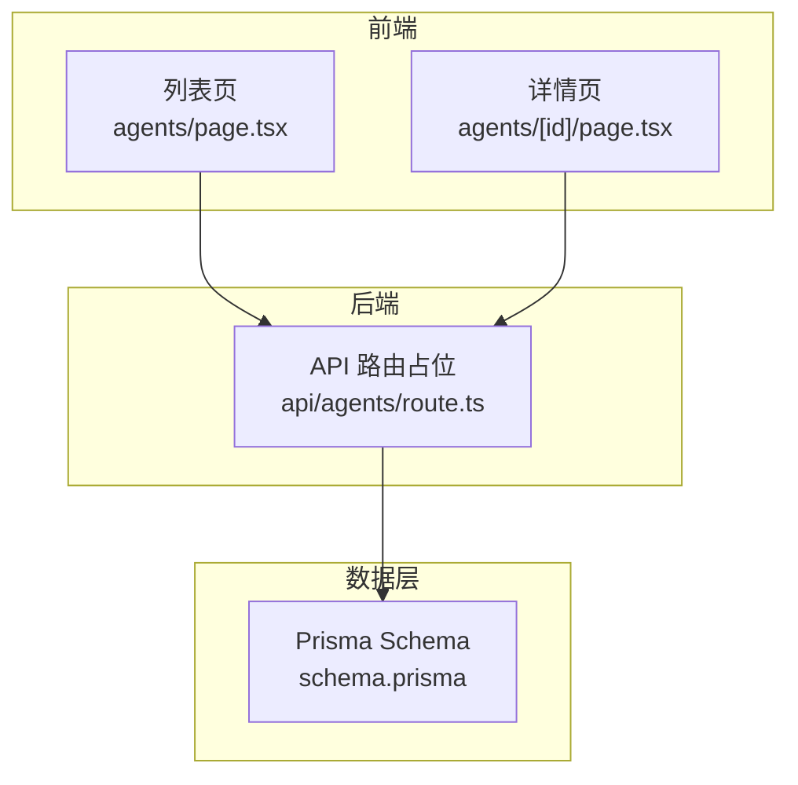
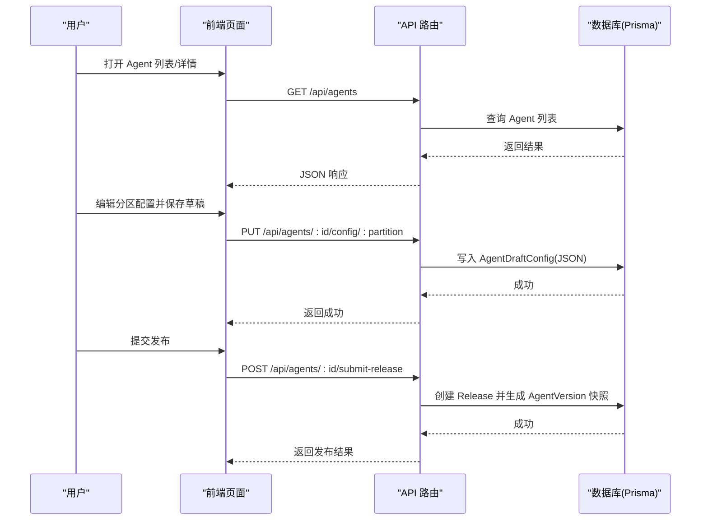
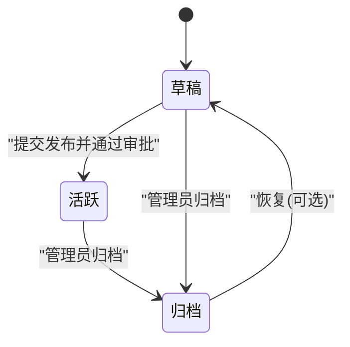
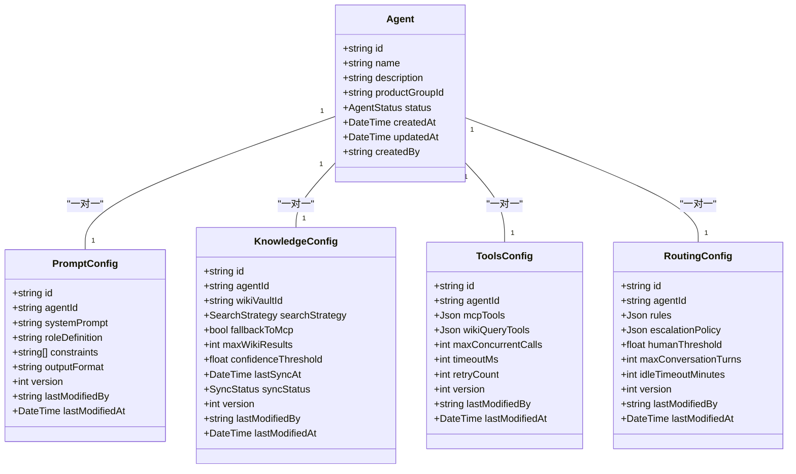
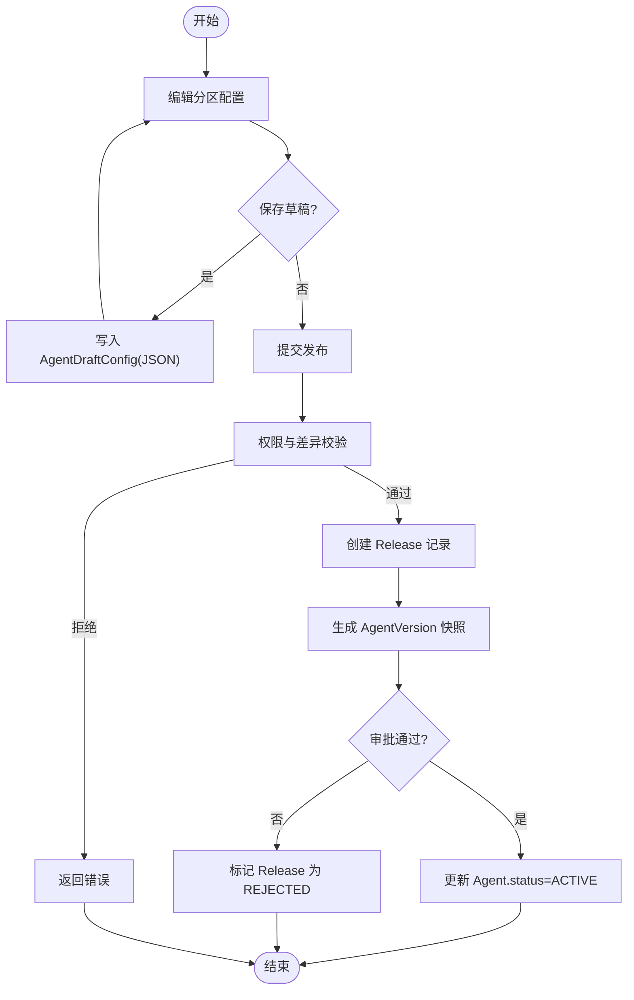
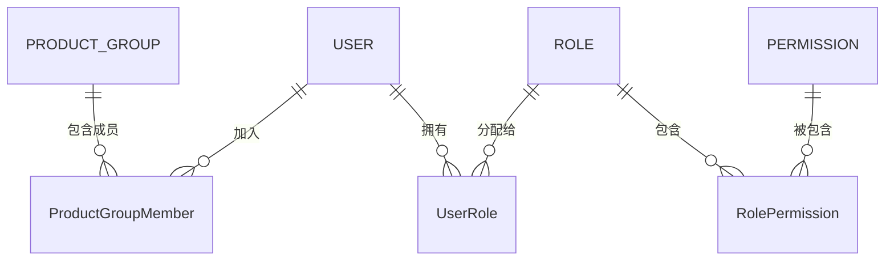
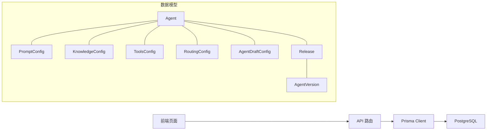

# Agent 管理

<cite>
**本文引用的文件**
- [schema.prisma](file://apps/web/prisma/schema.prisma)
- [agents 列表页](file://apps/web/app/(dashboard)/agents/page.tsx)
- [Agent 详情页](file://apps/web/app/(dashboard)/agents/[id]/page.tsx)
- [API 路由占位](file://apps/web/app/api/agents/route.ts)
</cite>

## 目录
1. [简介](#简介)
2. [项目结构](#项目结构)
3. [核心组件](#核心组件)
4. [架构总览](#架构总览)
5. [详细组件分析](#详细组件分析)
6. [依赖关系分析](#依赖关系分析)
7. [性能考虑](#性能考虑)
8. [故障排除指南](#故障排除指南)
9. [结论](#结论)
10. [附录](#附录)

## 简介
本模块提供 Agent 的完整生命周期管理与四分区配置系统（Prompt、Knowledge、Tools、Routing）。面向最终用户，提供创建、编辑、保存草稿与发布版本的操作；面向开发者，给出数据模型、权限控制、变更审计与版本快照等实现细节。

## 项目结构
- 前端页面
  - 列表页：展示 Agent 列表、搜索框与新建入口
  - 详情页：按分区 Tab 展示 Prompt、知识库、工具/MCP、路由的配置编辑区，并提供提交发布、查看版本历史、查看反馈等操作按钮
- API 层
  - 路由占位：声明了后续将实现的 RESTful 接口清单
- 数据层
  - Prisma Schema：定义 Agent、四分区配置、草稿环境、版本快照、发布审批、权限与审计等实体与关系

图表来源
- [agents 列表页](file://apps/web/app/(dashboard)/agents/page.tsx#L1-L28)
- [Agent 详情页](file://apps/web/app/(dashboard)/agents/[id]/page.tsx#L1-L43)
- [API 路由占位:1-19](file://apps/web/app/api/agents/route.ts#L1-L19)

章节来源
- [agents 列表页](file://apps/web/app/(dashboard)/agents/page.tsx#L1-L28)
- [Agent 详情页](file://apps/web/app/(dashboard)/agents/[id]/page.tsx#L1-L43)
- [API 路由占位:1-19](file://apps/web/app/api/agents/route.ts#L1-L19)
- [schema.prisma:1-626](file://apps/web/prisma/schema.prisma#L1-L626)

## 核心组件
- Agent 实体
  - 标识与归属：id、name、description、productGroupId、createdBy
  - 状态：DRAFT（草稿）、ACTIVE（活跃）、ARCHIVED（归档）
  - 四分区配置：promptConfig、knowledgeConfig、toolsConfig、routingConfig
  - 草稿环境：draftConfig（JSON 存储未发布的分区配置）
  - 关联：feedbacks、releases、versions、skillBindings、wikiVault、configChanges
- 四分区配置
  - Prompt：systemPrompt、roleDefinition、constraints、outputFormat、version、lastModifiedBy/At
  - Knowledge：wikiVaultId、searchStrategy、fallbackToMcp、maxWikiResults、confidenceThreshold、syncStatus、version、lastModifiedBy/At
  - Tools：mcpTools、wikiQueryTools、并发/超时/重试策略、version、lastModifiedBy/At
  - Routing：rules、escalationPolicy、humanThreshold、maxConversationTurns、idleTimeoutMinutes、version、lastModifiedBy/At
- 草稿环境
  - AgentDraftConfig：以 JSON 暂存四个分区的修改，标记 isDirty、记录 lastSavedBy/At
- 版本与发布
  - Release：变更说明、受影响分区、审批状态、提交/审批人、时间戳
  - AgentVersion：四分区快照、版本号、wikiCommitSha、发布人/时间、变更说明、效果报告
- 权限与审计
  - Role/Permission/UserRole/AuditLog：角色-权限-用户映射与操作审计日志
  - ProductGroup/ProductGroupMember：产品组与成员角色（LEAD/MEMBER）

章节来源
- [schema.prisma:61-97](file://apps/web/prisma/schema.prisma#L61-L97)
- [schema.prisma:103-173](file://apps/web/prisma/schema.prisma#L103-L173)
- [schema.prisma:175-186](file://apps/web/prisma/schema.prisma#L175-L186)
- [schema.prisma:298-354](file://apps/web/prisma/schema.prisma#L298-L354)
- [schema.prisma:563-625](file://apps/web/prisma/schema.prisma#L563-L625)

## 架构总览
整体采用“前端页面 + Next.js API 路由 + Prisma 数据模型”的分层架构。前端通过 API 路由访问数据库，完成 Agent 的 CRUD、分区配置读写、草稿保存、发布审批与版本回滚等流程。

图表来源
- [API 路由占位:1-19](file://apps/web/app/api/agents/route.ts#L1-L19)
- [schema.prisma:175-186](file://apps/web/prisma/schema.prisma#L175-L186)
- [schema.prisma:298-354](file://apps/web/prisma/schema.prisma#L298-L354)

## 详细组件分析

### Agent 生命周期管理
- 创建
  - 在列表页点击“新建 Agent”，调用创建接口，默认状态为 DRAFT
- 编辑
  - 进入详情页后，按分区 Tab 编辑 Prompt/Knowledge/Tools/Routing
  - 支持保存草稿到 AgentDraftConfig，不改变 Agent.status
- 删除
  - 建议软删除或归档至 ARCHIVED，保留版本与审计记录
- 状态管理
  - DRAFT：可继续编辑与保存草稿
  - ACTIVE：已发布生效
  - ARCHIVED：归档不可用，但保留历史

图表来源
- [schema.prisma:93-97](file://apps/web/prisma/schema.prisma#L93-L97)

章节来源
- [schema.prisma:61-97](file://apps/web/prisma/schema.prisma#L61-L97)

### 四分区配置系统（Prompt、Knowledge、Tools、Routing）
- 设计原则
  - 每个分区独立建模，便于单独版本化与变更追踪
  - 所有分区均包含 version、lastModifiedBy、lastModifiedAt，用于追踪变更
- 分区字段要点
  - Prompt：系统提示词、角色定义、约束、输出格式
  - Knowledge：知识检索策略、是否回退 MCP、最大结果数、置信度阈值、同步状态
  - Tools：MCP 工具与 Wiki 查询工具配置、并发/超时/重试策略
  - Routing：路由规则、升级策略、人工介入阈值、对话轮次上限、空闲超时
- 使用方式
  - 在详情页对应 Tab 中编辑各分区配置
  - 保存草稿时写入 AgentDraftConfig 的 JSON 字段
  - 提交发布时生成 AgentVersion 的四分区快照

图表来源
- [schema.prisma:61-97](file://apps/web/prisma/schema.prisma#L61-L97)
- [schema.prisma:103-173](file://apps/web/prisma/schema.prisma#L103-L173)

章节来源
- [schema.prisma:103-173](file://apps/web/prisma/schema.prisma#L103-L173)

### 草稿与发布流程
- 草稿保存
  - 前端调用分区配置更新接口，后端将当前分区配置写入 AgentDraftConfig 的 JSON 字段，并标记 isDirty
- 提交发布
  - 前端发起发布请求，后端校验权限与差异，创建 Release 记录
  - 生成 AgentVersion 快照，包含四分区配置的 JSON 快照
  - 根据审批结果更新 Release.status 与 Agent.status
- 版本回滚
  - 选择目标版本进行回滚，重新应用该版本的分区快照

图表来源
- [schema.prisma:175-186](file://apps/web/prisma/schema.prisma#L175-L186)
- [schema.prisma:298-354](file://apps/web/prisma/schema.prisma#L298-L354)

章节来源
- [schema.prisma:175-186](file://apps/web/prisma/schema.prisma#L175-L186)
- [schema.prisma:298-354](file://apps/web/prisma/schema.prisma#L298-L354)

### 搜索与过滤
- 列表页提供搜索输入框，用于快速筛选 Agent
- 建议后端支持按名称、状态、所属产品组、创建时间等维度过滤
- 分页与排序：建议默认按更新时间倒序，支持自定义排序字段

章节来源
- [agents 列表页](file://apps/web/app/(dashboard)/agents/page.tsx#L1-L28)

### 权限控制机制
- 组织与成员
  - ProductGroup 与 ProductGroupMember：成员拥有 LEAD 或 MEMBER 角色
- 全局角色与权限
  - Role/Permission/UserRole：基于 RBAC 的角色-权限-用户绑定，支持按产品组范围授权
- 审计
  - AuditLog：记录关键操作的资源、动作、用户、IP、User-Agent 等

图表来源
- [schema.prisma:563-625](file://apps/web/prisma/schema.prisma#L563-L625)
- [schema.prisma:14-41](file://apps/web/prisma/schema.prisma#L14-L41)

章节来源
- [schema.prisma:563-625](file://apps/web/prisma/schema.prisma#L563-L625)
- [schema.prisma:14-41](file://apps/web/prisma/schema.prisma#L14-L41)

### 操作指南（面向最终用户）
- 创建新 Agent
  - 在“Agent 管理”页面点击“新建 Agent”，填写基本信息，默认处于草稿状态
- 配置各个分区
  - 进入 Agent 详情页，依次配置 Prompt、知识库、工具/MCP、路由
  - 可随时点击“保存草稿”以保留当前修改
- 保存草稿与发布版本
  - 草稿仅保存在本地环境中，不影响线上版本
  - 点击“提交发布”，填写变更说明，等待审批通过后生效
- 查看版本历史与回滚
  - 在详情页点击“查看版本历史”，可选择回滚到指定版本
- 查看反馈
  - 在详情页点击“查看反馈”，了解用户反馈与问题定位

章节来源
- [agents 列表页](file://apps/web/app/(dashboard)/agents/page.tsx#L1-L28)
- [Agent 详情页](file://apps/web/app/(dashboard)/agents/[id]/page.tsx#L1-L43)

### 开发者实现要点
- API 路由
  - 参考路由占位中的端点清单，逐步实现 GET/POST/PUT 与分区配置接口
- 数据一致性
  - 分区配置更新需保证幂等性，避免重复写入
  - 发布流程需事务化，确保 Release 与 AgentVersion 的一致性
- 变更审计
  - 对分区配置变更记录 ConfigChange，便于回溯与对比
- 版本快照
  - 快照应包含四分区配置的完整 JSON，便于回滚与审计

章节来源
- [API 路由占位:1-19](file://apps/web/app/api/agents/route.ts#L1-L19)
- [schema.prisma:192-214](file://apps/web/prisma/schema.prisma#L192-L214)
- [schema.prisma:332-354](file://apps/web/prisma/schema.prisma#L332-L354)

## 依赖关系分析
- 前端依赖
  - 列表页与详情页依赖 API 路由提供的数据与操作能力
- 后端依赖
  - API 路由依赖 Prisma Client 访问 PostgreSQL
- 数据依赖
  - Agent 与四分区配置为一对一关系
  - Agent 与 Draft/Release/Version 为一对多关系
  - 权限体系通过 Role/Permission/UserRole 与 ProductGroupMember 组合实现

图表来源
- [schema.prisma:61-97](file://apps/web/prisma/schema.prisma#L61-L97)
- [schema.prisma:175-186](file://apps/web/prisma/schema.prisma#L175-L186)
- [schema.prisma:298-354](file://apps/web/prisma/schema.prisma#L298-L354)

章节来源
- [schema.prisma:61-97](file://apps/web/prisma/schema.prisma#L61-L97)
- [schema.prisma:175-186](file://apps/web/prisma/schema.prisma#L175-L186)
- [schema.prisma:298-354](file://apps/web/prisma/schema.prisma#L298-L354)

## 性能考虑
- 索引优化
  - Agent 表针对 productGroupId 与 status 建立索引，提升列表与筛选性能
  - 配置变更记录与反馈表针对常用查询字段建立索引
- 并发与超时
  - ToolsConfig 提供并发调用、超时与重试参数，合理设置以避免阻塞
- 缓存策略
  - 对只读配置（如 Prompt、Routing）可引入缓存层，减少数据库压力
- 分页与懒加载
  - 列表与版本历史建议使用分页与按需加载，降低首屏渲染开销

章节来源
- [schema.prisma:89-91](file://apps/web/prisma/schema.prisma#L89-L91)
- [schema.prisma:147-159](file://apps/web/prisma/schema.prisma#L147-L159)
- [schema.prisma:205-207](file://apps/web/prisma/schema.prisma#L205-L207)
- [schema.prisma:246-249](file://apps/web/prisma/schema.prisma#L246-L249)

## 故障排除指南
- 无法保存草稿
  - 检查分区配置 JSON 结构是否符合预期
  - 确认用户具备编辑权限
- 发布失败
  - 检查 Release 审批状态与变更说明是否完整
  - 查看 AgentVersion 快照是否生成成功
- 权限不足
  - 确认用户在 ProductGroup 中的角色与全局 Role/Permission 配置
- 审计缺失
  - 检查 AuditLog 写入逻辑是否触发
  - 核对 userId、userName、userRole 是否正确记录

章节来源
- [schema.prisma:175-186](file://apps/web/prisma/schema.prisma#L175-L186)
- [schema.prisma:298-354](file://apps/web/prisma/schema.prisma#L298-L354)
- [schema.prisma:563-625](file://apps/web/prisma/schema.prisma#L563-L625)

## 结论
本模块通过清晰的数据模型与分层架构，实现了 Agent 的完整生命周期管理与四分区配置系统。结合草稿、发布审批与版本快照，既满足最终用户的易用性需求，也为开发者提供了完善的扩展与审计能力。建议在后续迭代中完善 API 实现、权限校验与性能优化。

## 附录
- 术语
  - 分区：指 Prompt、Knowledge、Tools、Routing 四类配置
  - 草稿：未发布的临时配置，保存在 AgentDraftConfig
  - 发布：经审批后将分区配置快照固化到 AgentVersion 并激活 Agent
- 相关端点（待实现）
  - GET /api/agents
  - POST /api/agents
  - GET /api/agents/:id
  - PUT /api/agents/:id
  - GET /api/agents/:id/config/:partition
  - PUT /api/agents/:id/config/:partition
  - POST /api/agents/:id/submit-release
  - POST /api/agents/:id/rollback/:versionId

章节来源
- [API 路由占位:1-19](file://apps/web/app/api/agents/route.ts#L1-L19)