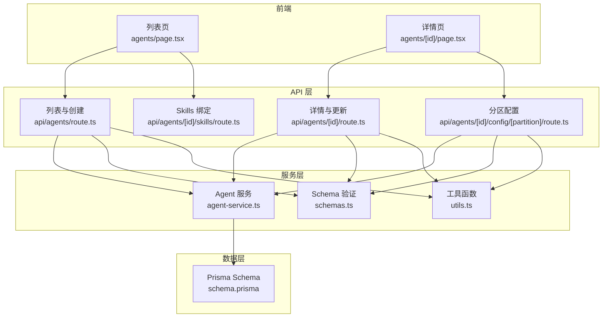
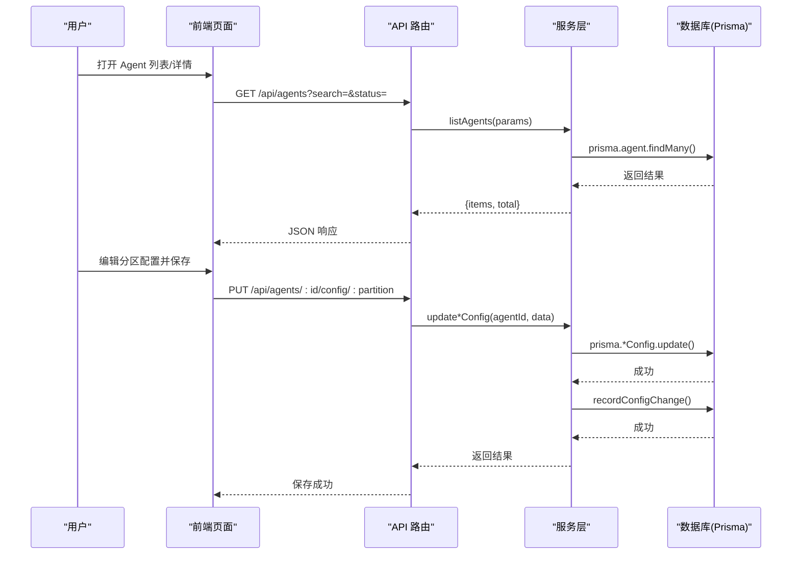
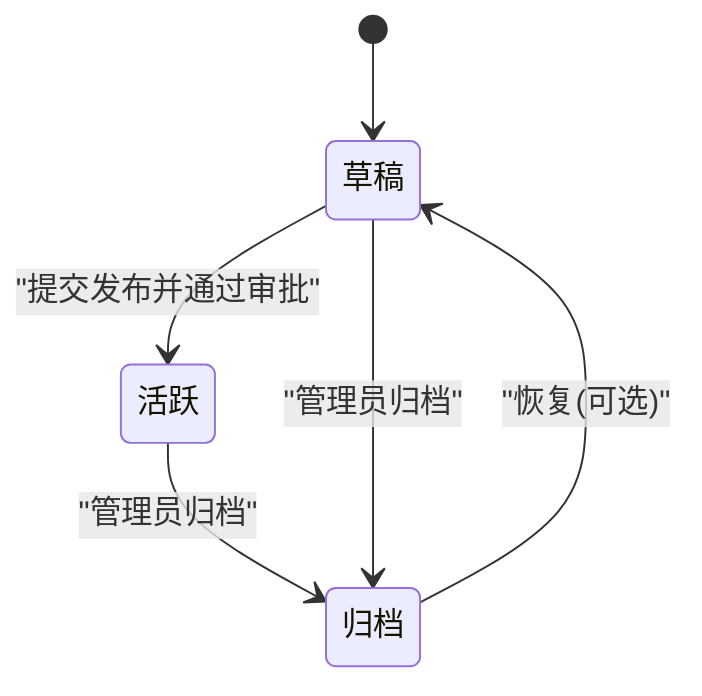
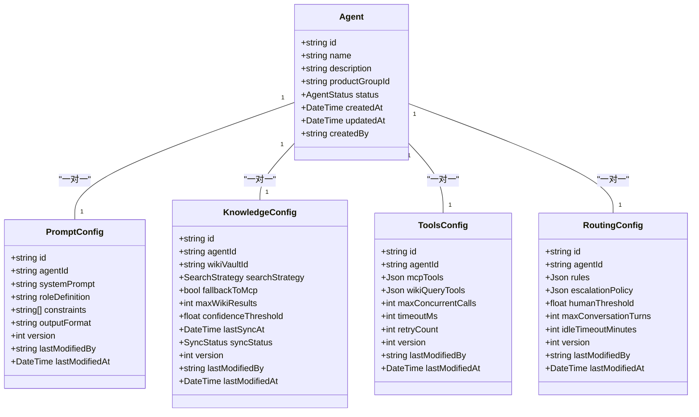
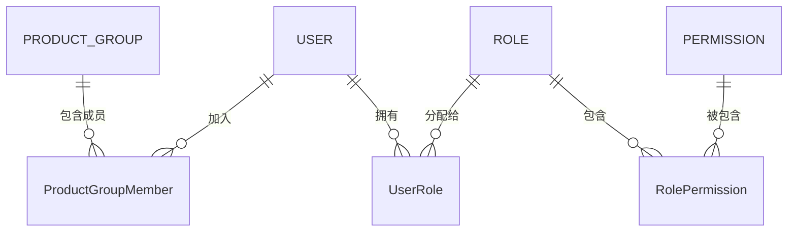
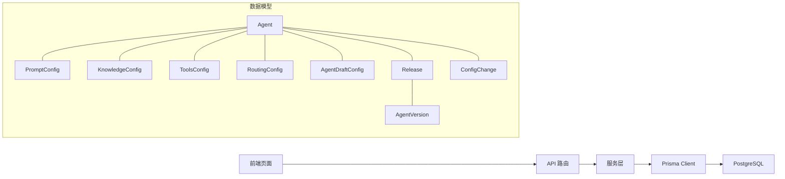

# Agent 管理

<cite>
**本文引用的文件**
- [schema.prisma](file://packages/db/prisma/schema.prisma)
- [agents 列表页](file://apps/web/app/(dashboard)/agents/page.tsx)
- [Agent 详情页](file://apps/web/app/(dashboard)/agents/[id]/page.tsx)
- [API 路由 - 列表与创建](file://apps/web/app/api/agents/route.ts)
- [API 路由 - 详情与更新](file://apps/web/app/api/agents/[id]/route.ts)
- [API 路由 - 分区配置](file://apps/web/app/api/agents/[id]/config/[partition]/route.ts)
- [API 路由 - Skills 绑定](file://apps/web/app/api/agents/[id]/skills/route.ts)
- [Agent 服务层](file://apps/web/lib/services/agent-service.ts)
- [数据校验 Schema](file://apps/web/lib/schemas.ts)
- [通用工具函数](file://apps/web/lib/utils.ts)
</cite>

## 更新摘要
**变更内容**
- 完善了完整的 CRUD 操作实现，包括创建、读取、更新和归档删除功能
- 增强了搜索和过滤能力，支持按名称、描述、状态、产品组等多维度筛选
- 实现了详细的 Agent 视图，支持四分区配置的完整编辑界面
- 添加了分区配置版本控制和变更审计机制
- 完善了权限控制和数据验证体系

## 目录
1. [简介](#简介)
2. [项目结构](#项目结构)
3. [核心组件](#核心组件)
4. [架构总览](#架构总览)
5. [详细组件分析](#详细组件分析)
6. [依赖关系分析](#依赖关系分析)
7. [性能考虑](#性能考虑)
8. [故障排除指南](#故障排除指南)
9. [结论](#结论)
10. [附录](#附录)

## 简介
本模块提供 Agent 的完整生命周期管理与四分区配置系统（Prompt、Knowledge、Tools、Routing）。面向最终用户，提供创建、编辑、保存草稿与发布版本的操作；面向开发者，给出数据模型、权限控制、变更审计与版本快照等实现细节。

## 项目结构
- 前端页面
  - 列表页：展示 Agent 列表、搜索框与新建入口，支持状态过滤和分页
  - 详情页：按分区 Tab 展示 Prompt、知识库、工具/MCP、路由的配置编辑区，并提供提交发布、查看版本历史、查看反馈等操作按钮
- API 层
  - RESTful 接口：完整的 CRUD 操作、分区配置管理、Skills 绑定等功能
- 服务层
  - 业务逻辑封装：Agent 管理、配置操作、变更审计等服务方法
- 数据层
  - Prisma Schema：定义 Agent、四分区配置、草稿环境、版本快照、发布审批、权限与审计等实体与关系

**图表来源**
- [agents 列表页:1-218](file://apps/web/app/(dashboard)/agents/page.tsx#L1-L218)
- [Agent 详情页:1-283](file://apps/web/app/(dashboard)/agents/[id]/page.tsx#L1-L283)
- [API 路由 - 列表与创建:1-46](file://apps/web/app/api/agents/route.ts#L1-L46)
- [API 路由 - 详情与更新:1-54](file://apps/web/app/api/agents/[id]/route.ts#L1-L54)
- [API 路由 - 分区配置:1-105](file://apps/web/app/api/agents/[id]/config/[partition]/route.ts#L1-L105)
- [API 路由 - Skills 绑定:1-51](file://apps/web/app/api/agents/[id]/skills/route.ts#L1-L51)
- [Agent 服务层:1-302](file://apps/web/lib/services/agent-service.ts#L1-L302)
- [数据校验 Schema:1-112](file://apps/web/lib/schemas.ts#L1-L112)
- [通用工具函数:1-42](file://apps/web/lib/utils.ts#L1-L42)

## 核心组件
- Agent 实体
  - 标识与归属：id、name、description、productGroupId、createdBy
  - 状态：DRAFT（草稿）、ACTIVE（活跃）、ARCHIVED（归档）
  - 四分区配置：promptConfig、knowledgeConfig、toolsConfig、routingConfig
  - 草稿环境：draftConfig（JSON 存储未发布的分区配置）
  - 关联：feedbacks、releases、versions、skillBindings、wikiVault、configChanges
- 四分区配置
  - Prompt：systemPrompt、roleDefinition、constraints、outputFormat、version、lastModifiedBy/At
  - Knowledge：wikiVaultId、searchStrategy、fallbackToMcp、maxWikiResults、confidenceThreshold、syncStatus、version、lastModifiedBy/At
  - Tools：mcpTools、wikiQueryTools、并发/超时/重试策略、version、lastModifiedBy/At
  - Routing：rules、escalationPolicy、humanThreshold、maxConversationTurns、idleTimeoutMinutes、version、lastModifiedBy/At
- 草稿环境
  - AgentDraftConfig：以 JSON 暂存四个分区的修改，标记 isDirty、记录 lastSavedBy/At
- 版本与发布
  - Release：变更说明、受影响分区、审批状态、提交/审批人、时间戳
  - AgentVersion：四分区快照、版本号、wikiCommitSha、发布人/时间、变更说明、效果报告
- 权限与审计
  - Role/Permission/UserRole/AuditLog：角色-权限-用户映射与操作审计日志
  - ProductGroup/ProductGroupMember：产品组与成员角色（LEAD/MEMBER）

**章节来源**
- [schema.prisma:61-97](file://packages/db/prisma/schema.prisma#L61-L97)
- [schema.prisma:103-173](file://packages/db/prisma/schema.prisma#L103-L173)
- [schema.prisma:175-186](file://packages/db/prisma/schema.prisma#L175-L186)
- [schema.prisma:298-354](file://packages/db/prisma/schema.prisma#L298-354)
- [schema.prisma:563-625](file://packages/db/prisma/schema.prisma#L563-625)

## 架构总览
整体采用"前端页面 + Next.js API 路由 + 服务层 + Prisma 数据模型"的分层架构。前端通过 API 路由访问数据库，完成 Agent 的 CRUD、分区配置读写、草稿保存、发布审批与版本回滚等流程。

**图表来源**
- [API 路由 - 列表与创建:6-26](file://apps/web/app/api/agents/route.ts#L6-L26)
- [API 路由 - 分区配置:36-53](file://apps/web/app/api/agents/[id]/config/[partition]/route.ts#L36-L53)
- [Agent 服务层:15-48](file://apps/web/lib/services/agent-service.ts#L15-L48)
- [Agent 服务层:156-163](file://apps/web/lib/services/agent-service.ts#L156-L163)
- [Agent 服务层:283-301](file://apps/web/lib/services/agent-service.ts#L283-L301)

## 详细组件分析

### Agent 生命周期管理
- 创建
  - 在列表页点击"新建 Agent"，调用 POST /api/agents 接口，默认状态为 DRAFT
  - 支持必填字段验证：名称、产品组 ID
- 编辑
  - 进入详情页后，按分区 Tab 编辑 Prompt/Knowledge/Tools/Routing
  - 支持实时更新，自动记录变更历史
- 删除
  - 使用软删除机制，将状态设置为 ARCHIVED，保留版本与审计记录
- 状态管理
  - DRAFT：可继续编辑与保存配置
  - ACTIVE：已发布生效
  - ARCHIVED：归档不可用，但保留历史

**图表来源**
- [schema.prisma:93-97](file://packages/db/prisma/schema.prisma#L93-L97)

**章节来源**
- [schema.prisma:61-97](file://packages/db/prisma/schema.prisma#L61-L97)
- [Agent 服务层:88-140](file://apps/web/lib/services/agent-service.ts#L88-L140)
- [API 路由 - 详情与更新:40-53](file://apps/web/app/api/agents/[id]/route.ts#L40-L53)

### 四分区配置系统（Prompt、Knowledge、Tools、Routing）
- 设计原则
  - 每个分区独立建模，便于单独版本化与变更追踪
  - 所有分区均包含 version、lastModifiedBy、lastModifiedAt，用于追踪变更
- 分区字段要点
  - Prompt：系统提示词、角色定义、约束、输出格式
  - Knowledge：知识检索策略、是否回退 MCP、最大结果数、置信度阈值、同步状态
  - Tools：MCP 工具与 Wiki 查询工具配置、并发/超时/重试策略
  - Routing：路由规则、升级策略、人工介入阈值、对话轮次上限、空闲超时
- 使用方式
  - 在详情页对应 Tab 中编辑各分区配置
  - 支持实时保存，自动记录变更历史
  - 提供 JSON 编辑器支持复杂配置

**图表来源**
- [schema.prisma:61-97](file://packages/db/prisma/schema.prisma#L61-L97)
- [schema.prisma:103-173](file://packages/db/prisma/schema.prisma#L103-L173)

**章节来源**
- [schema.prisma:103-173](file://packages/db/prisma/schema.prisma#L103-L173)
- [Agent 服务层:165-280](file://apps/web/lib/services/agent-service.ts#L165-L280)

### 搜索与过滤功能
- 列表页提供搜索输入框，支持按名称和描述进行模糊搜索
- 状态过滤器：全部、草稿、活跃、已归档
- 后端支持多维度过滤：status、productGroupId、search
- 分页与排序：默认按更新时间倒序，支持自定义分页参数

**章节来源**
- [agents 列表页:26-45](file://apps/web/app/(dashboard)/agents/page.tsx#L26-L45)
- [API 路由 - 列表与创建:7-26](file://apps/web/app/api/agents/route.ts#L7-L26)
- [Agent 服务层:15-48](file://apps/web/lib/services/agent-service.ts#L15-L48)

### 权限控制机制
- 组织与成员
  - ProductGroup 与 ProductGroupMember：成员拥有 LEAD 或 MEMBER 角色
- 全局角色与权限
  - Role/Permission/UserRole：基于 RBAC 的角色-权限-用户绑定，支持按产品组范围授权
- 审计
  - AuditLog：记录关键操作的资源、动作、用户、IP、User-Agent 等

**图表来源**
- [schema.prisma:563-625](file://packages/db/prisma/schema.prisma#L563-625)
- [schema.prisma:14-41](file://packages/db/prisma/schema.prisma#L14-L41)

**章节来源**
- [schema.prisma:563-625](file://packages/db/prisma/schema.prisma#L563-625)
- [schema.prisma:14-41](file://packages/db/prisma/schema.prisma#L14-L41)

### 操作指南（面向最终用户）
- 创建新 Agent
  - 在"Agent 管理"页面点击"+ 新建 Agent"，填写名称、描述和产品组 ID
  - 创建成功后默认处于草稿状态
- 配置各个分区
  - 进入 Agent 详情页，依次配置 Prompt、知识库、工具/MCP、路由
  - 支持实时保存，无需手动提交
- 搜索与过滤
  - 使用搜索框快速查找 Agent
  - 通过状态下拉菜单筛选不同状态的 Agent
- 查看详细信息
  - 在列表页查看 Agent 的基本信息、状态和相关统计
  - 点击进入详情页查看完整配置和统计数据

**章节来源**
- [agents 列表页:55-82](file://apps/web/app/(dashboard)/agents/page.tsx#L55-L82)
- [Agent 详情页:71-146](file://apps/web/app/(dashboard)/agents/[id]/page.tsx#L71-L146)

### 开发者实现要点
- API 路由
  - 完整的 RESTful 接口实现，支持标准 HTTP 方法
  - 统一的响应格式：success/error 包装
- 数据一致性
  - 分区配置更新自动记录变更历史
  - 使用事务确保数据一致性
- 变更审计
  - ConfigChange 表记录所有配置变更
  - 支持前后对比和差异分析
- 版本快照
  - 发布时生成 AgentVersion 快照
  - 支持版本回滚和比较

**章节来源**
- [API 路由 - 列表与创建:28-45](file://apps/web/app/api/agents/route.ts#L28-L45)
- [API 路由 - 分区配置:55-104](file://apps/web/app/api/agents/[id]/config/[partition]/route.ts#L55-L104)
- [Agent 服务层:283-301](file://apps/web/lib/services/agent-service.ts#L283-L301)

## 依赖关系分析
- 前端依赖
  - 列表页与详情页依赖 API 路由提供的数据与操作能力
  - 使用 React Hooks 管理状态和副作用
- 后端依赖
  - API 路由依赖服务层处理业务逻辑
  - 服务层依赖 Prisma Client 访问 PostgreSQL
- 数据依赖
  - Agent 与四分区配置为一对一关系
  - Agent 与 Draft/Release/Version 为一对多关系
  - 权限体系通过 Role/Permission/UserRole 与 ProductGroupMember 组合实现

**图表来源**
- [schema.prisma:61-97](file://packages/db/prisma/schema.prisma#L61-L97)
- [schema.prisma:175-186](file://packages/db/prisma/schema.prisma#L175-L186)
- [schema.prisma:298-354](file://packages/db/prisma/schema.prisma#L298-354)
- [schema.prisma:192-207](file://packages/db/prisma/schema.prisma#L192-L207)

**章节来源**
- [schema.prisma:61-97](file://packages/db/prisma/schema.prisma#L61-L97)
- [schema.prisma:175-186](file://packages/db/prisma/schema.prisma#L175-L186)
- [schema.prisma:298-354](file://packages/db/prisma/schema.prisma#L298-354)

## 性能考虑
- 索引优化
  - Agent 表针对 productGroupId 与 status 建立索引，提升列表与筛选性能
  - 配置变更记录与反馈表针对常用查询字段建立索引
- 并发与超时
  - ToolsConfig 提供并发调用、超时与重试参数，合理设置以避免阻塞
- 缓存策略
  - 对只读配置（如 Prompt、Routing）可引入缓存层，减少数据库压力
- 分页与懒加载
  - 列表与版本历史建议使用分页与按需加载，降低首屏渲染开销
- 查询优化
  - 使用 include 和 select 精确获取所需数据，避免 N+1 查询问题

**章节来源**
- [schema.prisma:89-91](file://packages/db/prisma/schema.prisma#L89-L91)
- [schema.prisma:147-159](file://packages/db/prisma/schema.prisma#L147-L159)
- [schema.prisma:205-207](file://packages/db/prisma/schema.prisma#L205-L207)
- [schema.prisma:246-249](file://packages/db/prisma/schema.prisma#L246-L249)
- [Agent 服务层:26-45](file://apps/web/lib/services/agent-service.ts#L26-L45)

## 故障排除指南
- 无法保存草稿
  - 检查分区配置 JSON 结构是否符合预期
  - 确认用户具备编辑权限
  - 验证请求体格式是否正确
- 发布失败
  - 检查 Release 审批状态与变更说明是否完整
  - 查看 AgentVersion 快照是否生成成功
- 权限不足
  - 确认用户在 ProductGroup 中的角色与全局 Role/Permission 配置
- 审计缺失
  - 检查 AuditLog 写入逻辑是否触发
  - 核对 userId、userName、userRole 是否正确记录
- 搜索无结果
  - 检查搜索关键词是否存在
  - 确认过滤条件是否正确设置
  - 验证数据库索引是否正常

**章节来源**
- [schema.prisma:175-186](file://packages/db/prisma/schema.prisma#L175-L186)
- [schema.prisma:298-354](file://packages/db/prisma/schema.prisma#L298-354)
- [schema.prisma:563-625](file://packages/db/prisma/schema.prisma#L563-625)
- [Agent 服务层:15-48](file://apps/web/lib/services/agent-service.ts#L15-L48)

## 结论
本模块通过清晰的数据模型与分层架构，实现了 Agent 的完整生命周期管理与四分区配置系统。结合草稿、发布审批与版本快照，既满足最终用户的易用性需求，也为开发者提供了完善的扩展与审计能力。当前实现已具备完整的 CRUD 操作、搜索过滤功能和详细的配置管理界面，建议在后续迭代中完善权限校验、性能优化和错误处理机制。

## 附录
- 术语
  - 分区：指 Prompt、Knowledge、Tools、Routing 四类配置
  - 草稿：未发布的临时配置，保存在 AgentDraftConfig
  - 发布：经审批后将分区配置快照固化到 AgentVersion 并激活 Agent
- 相关端点
  - GET /api/agents - 获取 Agent 列表（支持搜索和过滤）
  - POST /api/agents - 创建新 Agent
  - GET /api/agents/:id - 获取 Agent 详情
  - PUT /api/agents/:id - 更新 Agent 基本信息
  - DELETE /api/agents/:id - 归档 Agent
  - GET /api/agents/:id/config/:partition - 获取分区配置
  - PUT /api/agents/:id/config/:partition - 更新分区配置
  - GET /api/agents/:id/skills - 获取绑定的 Skills
  - POST /api/agents/:id/skills - 绑定 Skill
  - DELETE /api/agents/:id/skills - 解绑 Skill

**章节来源**
- [API 路由 - 列表与创建:6-45](file://apps/web/app/api/agents/route.ts#L6-L45)
- [API 路由 - 详情与更新:6-53](file://apps/web/app/api/agents/[id]/route.ts#L6-L53)
- [API 路由 - 分区配置:36-104](file://apps/web/app/api/agents/[id]/config/[partition]/route.ts#L36-L104)
- [API 路由 - Skills 绑定:6-50](file://apps/web/app/api/agents/[id]/skills/route.ts#L6-L50)