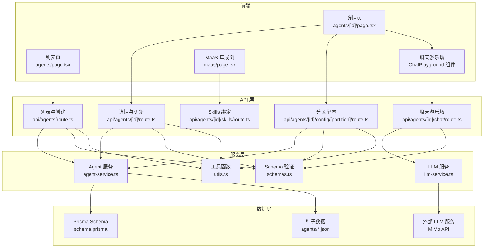
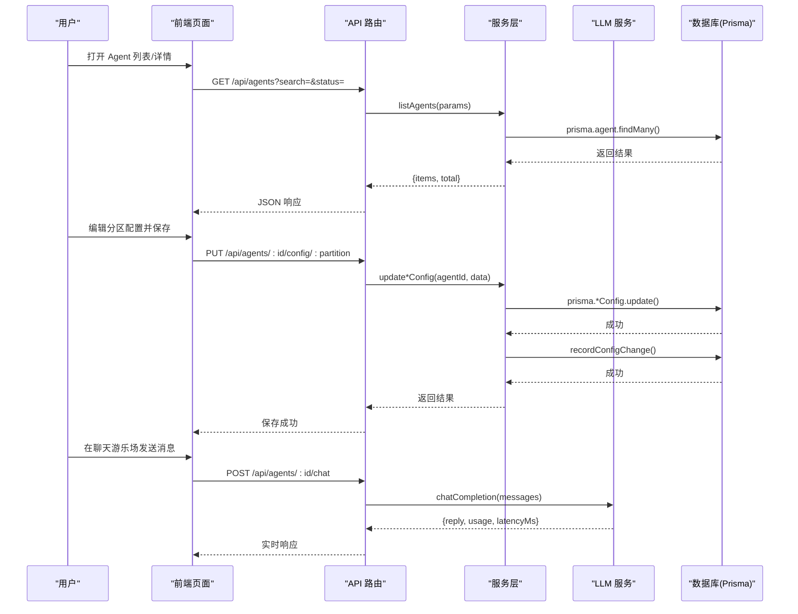
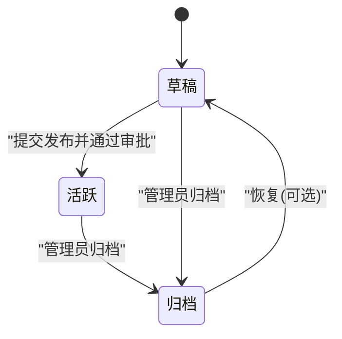
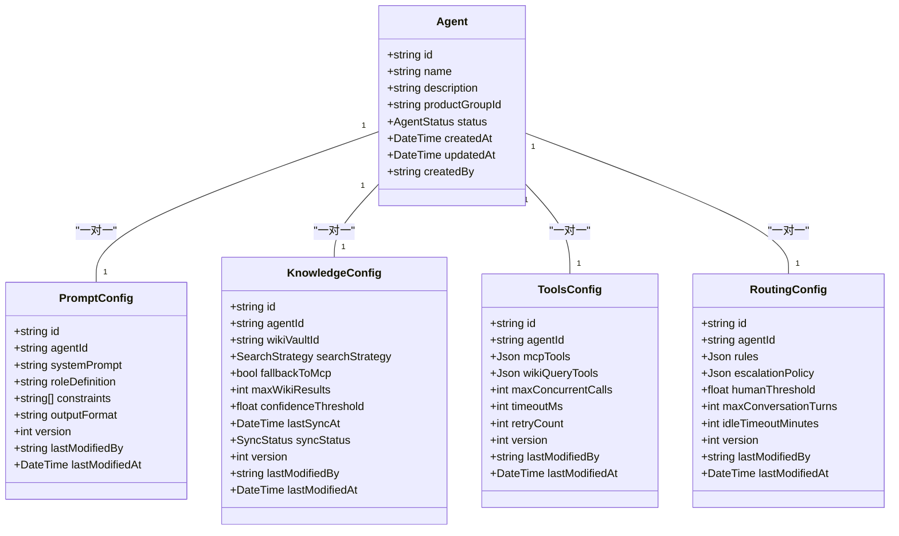
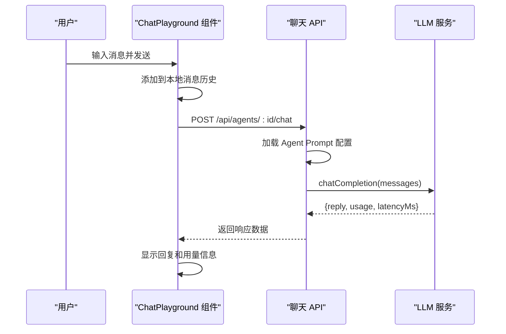
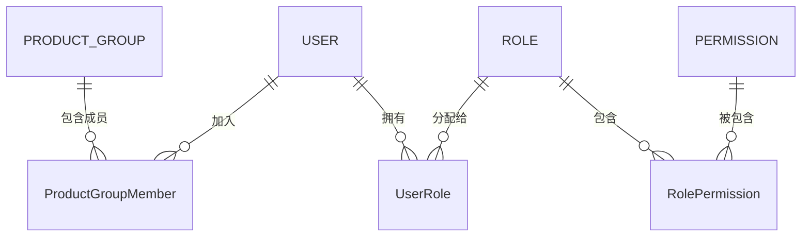
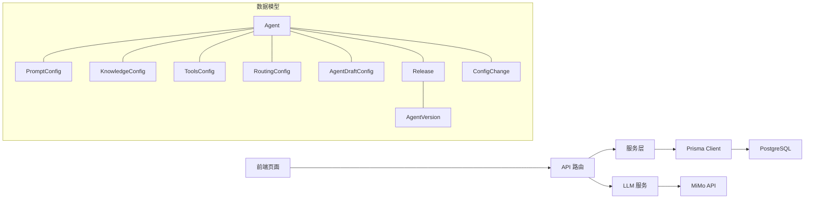

# Agent 管理

<cite>
**本文引用的文件**
- [schema.prisma](file://packages/db/prisma/schema.prisma)
- [agents 列表页](file://apps/web/app/(dashboard)/agents/page.tsx)
- [Agent 详情页](file://apps/web/app/(dashboard)/agents/[id]/page.tsx)
- [API 路由 - 列表与创建](file://apps/web/app/api/agents/route.ts)
- [API 路由 - 详情与更新](file://apps/web/app/api/agents/[id]/route.ts)
- [API 路由 - 分区配置](file://apps/web/app/api/agents/[id]/config/[partition]/route.ts)
- [API 路由 - Skills 绑定](file://apps/web/app/api/agents/[id]/skills/route.ts)
- [API 路由 - 聊天游乐场](file://apps/web/app/api/agents/[id]/chat/route.ts)
- [Agent 服务层](file://apps/web/lib/services/agent-service.ts)
- [LLM 服务](file://apps/web/lib/services/llm-service.ts)
- [数据校验 Schema](file://apps/web/lib/schemas.ts)
- [通用工具函数](file://apps/web/lib/utils.ts)
- [ECS 助手配置](file://apps/web/data/agents/ecs-assistant.json)
- [RDS 助手配置](file://apps/web/data/agents/rds-assistant.json)
- [MaaS 集成页面](file://apps/web/app/(dashboard)/maas/page.tsx)
</cite>

## 更新摘要
**变更内容**
- 完善了完整的 CRUD 操作实现，包括创建、读取、更新和归档删除功能
- 增强了搜索和过滤能力，支持按名称、描述、状态、产品组等多维度筛选
- 实现了详细的 Agent 视图，支持四分区配置的完整编辑界面
- 添加了分区配置版本控制和变更审计机制
- 完善了权限控制和数据验证体系
- **新增**：交互式聊天游乐场功能，支持实时测试 Agent 配置，包含真实 LLM 响应、对话历史支持和用量指标追踪
- **新增**：ECS 助手和 RDS 助手的运行环境（MOCK）配置，包含模型栈信息和新的工具配置

## 目录
1. [简介](#简介)
2. [项目结构](#项目结构)
3. [核心组件](#核心组件)
4. [架构总览](#架构总览)
5. [详细组件分析](#详细组件分析)
6. [依赖关系分析](#依赖关系分析)
7. [性能考虑](#性能考虑)
8. [故障排除指南](#故障排除指南)
9. [结论](#结论)
10. [附录](#附录)

## 简介
本模块提供 Agent 的完整生命周期管理与四分区配置系统（Prompt、Knowledge、Tools、Routing）。面向最终用户，提供创建、编辑、保存草稿与发布版本的操作；面向开发者，给出数据模型、权限控制、变更审计与版本快照等实现细节。

**更新** 本次更新显著增强了系统的交互测试能力，新增了交互式聊天游乐场功能，允许用户在 Agent 详情页直接进行实时测试，体验真实的 LLM 响应效果。同时增强了 ECS 助手和 RDS 助手的配置，新增了运行环境（MOCK）部分，包含模型栈信息（Qwen-Max、Qwen-Plus、Qwen-Turbo）以及新的工具配置（bailian_kb_retrieval、dashscope_text_embedding、bailian_rag_fallback），为公共云和专有云部署提供了统一的 Agent 管理能力。

## 项目结构
- 前端页面
  - 列表页：展示 Agent 列表、搜索框与新建入口，支持状态过滤和分页
  - 详情页：按分区 Tab 展示 Prompt、知识库、工具/MCP、路由的配置编辑区，并提供提交发布、查看版本历史、查看反馈等操作按钮
  - **新增**：聊天游乐场组件，支持实时测试 Agent 配置，显示对话历史和用量指标
  - MaaS 集成页：展示模型服务集成方案，包含公共云和专有云的对比
- API 层
  - RESTful 接口：完整的 CRUD 操作、分区配置管理、Skills 绑定、聊天游乐场等功能
- 服务层
  - 业务逻辑封装：Agent 管理、配置操作、变更审计等服务方法
  - **新增**：LLM 服务封装，统一接入小米 MiMo 推理模型
- 数据层
  - Prisma Schema：定义 Agent、四分区配置、草稿环境、版本快照、发布审批、权限与审计等实体与关系
  - 种子数据：预配置的 ECS 助手和 RDS 助手示例

**图表来源**
- [agents 列表页:1-218](file://apps/web/app/(dashboard)/agents/page.tsx#L1-L218)
- [Agent 详情页:1-607](file://apps/web/app/(dashboard)/agents/[id]/page.tsx#L1-L607)
- [聊天游乐场组件:516-607](file://apps/web/app/(dashboard)/agents/[id]/page.tsx#L516-L607)
- [MaaS 集成页面:1-36](file://apps/web/app/(dashboard)/maas/page.tsx#L1-L36)
- [API 路由 - 列表与创建:1-46](file://apps/web/app/api/agents/route.ts#L1-L46)
- [API 路由 - 详情与更新:1-54](file://apps/web/app/api/agents/[id]/route.ts#L1-L54)
- [API 路由 - 分区配置:1-86](file://apps/web/app/api/agents/[id]/config/[partition]/route.ts#L1-L86)
- [API 路由 - Skills 绑定:1-51](file://apps/web/app/api/agents/[id]/skills/route.ts#L1-L51)
- [API 路由 - 聊天游乐场:1-61](file://apps/web/app/api/agents/[id]/chat/route.ts#L1-L61)
- [Agent 服务层:1-209](file://apps/web/lib/services/agent-service.ts#L1-L209)
- [LLM 服务:1-135](file://apps/web/lib/services/llm-service.ts#L1-L135)
- [数据校验 Schema:1-275](file://apps/web/lib/schemas.ts#L1-L275)
- [通用工具函数:1-42](file://apps/web/lib/utils.ts#L1-L42)

## 核心组件
- Agent 实体
  - 标识与归属：id、name、description、productGroupId、createdBy
  - 状态：DRAFT（草稿）、ACTIVE（活跃）、ARCHIVED（归档）
  - 四分区配置：promptConfig、knowledgeConfig、toolsConfig、routingConfig
  - 草稿环境：draftConfig（JSON 存储未发布的分区配置）
  - 关联：feedbacks、releases、versions、skillBindings、wikiVault、configChanges
- 四分区配置
  - Prompt：systemPrompt、roleDefinition、constraints、outputFormat、version、lastModifiedBy/At
  - Knowledge：wikiVaultId、searchStrategy、fallbackToMcp、maxWikiResults、confidenceThreshold、syncStatus、version、lastModifiedBy/At
  - Tools：mcpTools、wikiQueryTools、并发/超时/重试策略、version、lastModifiedBy/At
  - Routing：rules、escalationPolicy、humanThreshold、maxConversationTurns、idleTimeoutMinutes、version、lastModifiedBy/At
- 草稿环境
  - AgentDraftConfig：以 JSON 暂存四个分区的修改，标记 isDirty、记录 lastSavedBy/At
- 版本与发布
  - Release：变更说明、受影响分区、审批状态、提交/审批人、时间戳
  - AgentVersion：四分区快照、版本号、wikiCommitSha、发布人/时间、变更说明、效果报告
- 权限与审计
  - Role/Permission/UserRole/AuditLog：角色-权限-用户映射与操作审计日志
  - ProductGroup/ProductGroupMember：产品组与成员角色（LEAD/MEMBER）
- **新增**：聊天游乐场组件
  - 实时对话：支持多轮对话历史，前端内存存储不持久化
  - 用量追踪：显示模型调用量、延迟时间和 token 使用情况
  - 配置验证：基于当前 Prompt 分区配置进行真实 LLM 调用

**章节来源**
- [schema.prisma:61-97](file://packages/db/prisma/schema.prisma#L61-L97)
- [schema.prisma:103-173](file://packages/db/prisma/schema.prisma#L103-L173)
- [schema.prisma:175-186](file://packages/db/prisma/schema.prisma#L175-L186)
- [schema.prisma:298-354](file://packages/db/prisma/schema.prisma#L298-354)
- [schema.prisma:563-625](file://packages/db/prisma/schema.prisma#L563-L625)
- [聊天游乐场组件:516-607](file://apps/web/app/(dashboard)/agents/[id]/page.tsx#L516-L607)
- [LLM 服务:11-27](file://apps/web/lib/services/llm-service.ts#L11-L27)

## 架构总览
整体采用"前端页面 + Next.js API 路由 + 服务层 + Prisma 数据模型"的分层架构。前端通过 API 路由访问数据库，完成 Agent 的 CRUD、分区配置读写、草稿保存、发布审批与版本回滚等流程。

**更新** 架构中新增了聊天游乐场功能，通过专门的 API 路由处理实时 LLM 调用，使用 LLM 服务统一接入小米 MiMo 推理模型。同时新增了 MaaS 集成展示层，用于演示公共云（百炼 Model Studio / DashScope API）和专有云（Apsara Stack 私有化推理）两种部署形态的统一管理。

**图表来源**
- [API 路由 - 列表与创建:6-26](file://apps/web/app/api/agents/route.ts#L6-L26)
- [API 路由 - 分区配置:36-53](file://apps/web/app/api/agents/[id]/config/[partition]/route.ts#L36-L53)
- [API 路由 - 聊天游乐场:14-61](file://apps/web/app/api/agents/[id]/chat/route.ts#L14-L61)
- [Agent 服务层:15-48](file://apps/web/lib/services/agent-service.ts#L15-L48)
- [Agent 服务层:156-163](file://apps/web/lib/services/agent-service.ts#L156-L163)
- [Agent 服务层:176-208](file://apps/web/lib/services/agent-service.ts#L176-L208)
- [LLM 服务:67-135](file://apps/web/lib/services/llm-service.ts#L67-L135)

## 详细组件分析

### Agent 生命周期管理
- 创建
  - 在列表页点击"新建 Agent"，调用 POST /api/agents 接口，默认状态为 DRAFT
  - 支持必填字段验证：名称、产品组 ID
- 编辑
  - 进入详情页后，按分区 Tab 编辑 Prompt/Knowledge/Tools/Routing
  - 支持实时更新，自动记录变更历史
- 删除
  - 使用软删除机制，将状态设置为 ARCHIVED，保留版本与审计记录
- 状态管理
  - DRAFT：可继续编辑与保存配置
  - ACTIVE：已发布生效
  - ARCHIVED：归档不可用，但保留历史

**图表来源**
- [schema.prisma:93-97](file://packages/db/prisma/schema.prisma#L93-L97)

**章节来源**
- [schema.prisma:61-97](file://packages/db/prisma/schema.prisma#L61-L97)
- [Agent 服务层:57-92](file://apps/web/lib/services/agent-service.ts#L57-L92)
- [Agent 服务层:94-127](file://apps/web/lib/services/agent-service.ts#L94-L127)
- [API 路由 - 详情与更新:40-53](file://apps/web/app/api/agents/[id]/route.ts#L40-L53)

### 四分区配置系统（Prompt、Knowledge、Tools、Routing）
- 设计原则
  - 每个分区独立建模，便于单独版本化与变更追踪
  - 所有分区均包含 version、lastModifiedBy、lastModifiedAt，用于追踪变更
- 分区字段要点
  - Prompt：系统提示词、角色定义、约束、输出格式
  - Knowledge：知识检索策略、是否回退 MCP、最大结果数、置信度阈值、同步状态
  - Tools：MCP 工具与 Wiki 查询工具配置、并发/超时/重试策略
  - Routing：路由规则、升级策略、人工介入阈值、对话轮次上限、空闲超时
- 使用方式
  - 在详情页对应 Tab 中编辑各分区配置
  - 支持实时保存，自动记录变更历史
  - 提供 JSON 编辑器支持复杂配置

**更新** 新增的运行环境（MOCK）配置支持公共云和专有云两种部署形态：
- 公共云：通过百炼 Model Studio / DashScope API 访问 Qwen-Max、Qwen-Plus、Qwen-Turbo 模型
- 专有云：通过 Apsara Stack 私有化推理服务访问相同模型
- 统一的路由策略：turbo 分类 → max/plus 分流 → 百炼 RAG 命中判断 → MCP 活数据兜底

**图表来源**
- [schema.prisma:61-97](file://packages/db/prisma/schema.prisma#L61-L97)
- [schema.prisma:103-173](file://packages/db/prisma/schema.prisma#L103-L173)

**章节来源**
- [schema.prisma:103-173](file://packages/db/prisma/schema.prisma#L103-L173)
- [Agent 服务层:129-169](file://apps/web/lib/services/agent-service.ts#L129-L169)

### 交互式聊天游乐场功能
**新增** 本次更新新增了交互式聊天游乐场功能，允许用户在 Agent 详情页直接测试配置效果。

- 核心特性
  - 实时对话：支持多轮对话历史，前端内存存储不持久化
  - 真实 LLM 调用：基于当前 Prompt 分区配置进行真实模型调用
  - 用量追踪：显示模型名称、延迟时间和 token 使用情况
  - 错误处理：完善的网络错误和 API 错误处理机制
- 技术实现
  - 前端 ChatPlayground 组件：管理对话状态和用户输入
  - 后端聊天 API：组装 system prompt 并调用 LLM 服务
  - LLM 服务：统一接入小米 MiMo 推理模型，提供标准化接口
- 用户体验
  - 直观的聊天界面，支持 Enter 键快速发送
  - 实时显示模型思考状态和响应延迟
  - 清晰的错误提示和重试机制

**图表来源**
- [聊天游乐场组件:516-607](file://apps/web/app/(dashboard)/agents/[id]/page.tsx#L516-L607)
- [API 路由 - 聊天游乐场:14-61](file://apps/web/app/api/agents/[id]/chat/route.ts#L14-L61)
- [LLM 服务:67-135](file://apps/web/lib/services/llm-service.ts#L67-L135)

**章节来源**
- [聊天游乐场组件:516-607](file://apps/web/app/(dashboard)/agents/[id]/page.tsx#L516-L607)
- [API 路由 - 聊天游乐场:1-61](file://apps/web/app/api/agents/[id]/chat/route.ts#L1-L61)
- [LLM 服务:1-135](file://apps/web/lib/services/llm-service.ts#L1-L135)

### 运行环境（MOCK）配置
**新增** 本次更新为 ECS 助手和 RDS 助手添加了完整的运行环境配置，支持公共云和专有云两种部署形态。

- 模型栈配置
  - ECS 助手：主模型 Qwen-Max，降级模型 Qwen-Plus，分类模型 Qwen-Turbo
  - RDS 助手：主模型 Qwen-Plus，降级模型 Qwen-Turbo，复杂查询升级 Qwen-Max
- 工具配置
  - bailian_kb_retrieval：百炼知识库检索（MOCK），支持公共云百炼 RAG 和专有云私有向量检索
  - dashscope_text_embedding：DashScope 文本向量化（MOCK），用于生成查询向量
  - bailian_rag_fallback：百炼 RAG 兜底检索（MOCK），当 Wiki 蒸馏知识未命中时启用
- 路由策略
  - 统一的路由流程：意图分类 → 模型选择 → 知识检索 → 兜底处理
  - 支持置信度阈值和人工介入机制

**章节来源**
- [ECS 助手配置:10-15](file://apps/web/data/agents/ecs-assistant.json#L10-L15)
- [ECS 助手配置:23-85](file://apps/web/data/agents/ecs-assistant.json#L23-L85)
- [RDS 助手配置:10-15](file://apps/web/data/agents/rds-assistant.json#L10-L15)
- [RDS 助手配置:23-54](file://apps/web/data/agents/rds-assistant.json#L23-L54)
- [MaaS 集成页面:18-27](file://apps/web/app/(dashboard)/maas/page.tsx#L18-L27)

### 搜索与过滤功能
- 列表页提供搜索输入框，支持按名称和描述进行模糊搜索
- 状态过滤器：全部、草稿、活跃、已归档
- 后端支持多维度过滤：status、productGroupId、search
- 分页与排序：默认按更新时间倒序，支持自定义分页参数

**章节来源**
- [agents 列表页:26-45](file://apps/web/app/(dashboard)/agents/page.tsx#L26-L45)
- [API 路由 - 列表与创建:7-26](file://apps/web/app/api/agents/route.ts#L7-L26)
- [Agent 服务层:17-39](file://apps/web/lib/services/agent-service.ts#L17-L39)

### 权限控制机制
- 组织与成员
  - ProductGroup 与 ProductGroupMember：成员拥有 LEAD 或 MEMBER 角色
- 全局角色与权限
  - Role/Permission/UserRole：基于 RBAC 的角色-权限-用户绑定，支持按产品组范围授权
- 审计
  - AuditLog：记录关键操作的资源、动作、用户、IP、User-Agent 等

**图表来源**
- [schema.prisma:563-625](file://packages/db/prisma/schema.prisma#L563-L625)
- [schema.prisma:14-41](file://packages/db/prisma/schema.prisma#L14-L41)

**章节来源**
- [schema.prisma:563-625](file://packages/db/prisma/schema.prisma#L563-L625)
- [schema.prisma:14-41](file://packages/db/prisma/schema.prisma#L14-L41)

### 操作指南（面向最终用户）
- 创建新 Agent
  - 在"Agent 管理"页面点击"+ 新建 Agent"，填写名称、描述和产品组 ID
  - 创建成功后默认处于草稿状态
- 配置各个分区
  - 进入 Agent 详情页，依次配置 Prompt、知识库、工具/MCP、路由
  - 支持实时保存，无需手动提交
  - 可在 Prompt 配置中添加运行环境（MOCK）说明，明确模型栈和工具配置
- **新增**：使用聊天游乐场测试配置
  - 在 Agent 详情页底部找到"试聊 Playground"区域
  - 输入测试消息，体验当前配置的实际效果
  - 查看模型响应、延迟时间和 token 使用情况
  - 根据测试结果调整 Prompt 配置
- 搜索与过滤
  - 使用搜索框快速查找 Agent
  - 通过状态下拉菜单筛选不同状态的 Agent
- 查看详细信息
  - 在列表页查看 Agent 的基本信息、状态和相关统计
  - 点击进入详情页查看完整配置和统计数据
- 版本管理
  - 查看版本历史，支持分区级回滚和整版本回滚
  - 查看版本效果评估，包括反馈统计和问题密度

**章节来源**
- [agents 列表页:55-82](file://apps/web/app/(dashboard)/agents/page.tsx#L55-L82)
- [Agent 详情页:71-175](file://apps/web/app/(dashboard)/agents/[id]/page.tsx#L71-L175)
- [Agent 详情页:214-366](file://apps/web/app/(dashboard)/agents/[id]/page.tsx#L214-L366)
- [聊天游乐场组件:516-607](file://apps/web/app/(dashboard)/agents/[id]/page.tsx#L516-L607)

### 开发者实现要点
- API 路由
  - 完整的 RESTful 接口实现，支持标准 HTTP 方法
  - 统一的响应格式：success/error 包装
  - **新增**：聊天 API 路由，支持实时 LLM 调用和用量追踪
- 数据一致性
  - 分区配置更新自动记录变更历史
  - 使用事务确保数据一致性
- 变更审计
  - ConfigChange 表记录所有配置变更
  - 支持前后对比和差异分析
- 版本快照
  - 发布时生成 AgentVersion 快照
  - 支持版本回滚和比较
- 运行环境支持
  - 支持公共云和专有云两种部署形态的统一配置
  - 提供 Mock 接口用于开发和测试
- **新增**：LLM 服务集成
  - 统一接入小米 MiMo 推理模型
  - 提供标准化的聊天完成接口
  - 支持超时控制和错误处理

**章节来源**
- [API 路由 - 列表与创建:28-45](file://apps/web/app/api/agents/route.ts#L28-L45)
- [API 路由 - 分区配置:56-85](file://apps/web/app/api/agents/[id]/config/[partition]/route.ts#L56-L85)
- [API 路由 - 聊天游乐场:14-61](file://apps/web/app/api/agents/[id]/chat/route.ts#L14-L61)
- [Agent 服务层:176-208](file://apps/web/lib/services/agent-service.ts#L176-L208)
- [LLM 服务:67-135](file://apps/web/lib/services/llm-service.ts#L67-L135)

## 依赖关系分析
- 前端依赖
  - 列表页与详情页依赖 API 路由提供的数据与操作能力
  - 使用 React Hooks 管理状态和副作用
  - **新增**：聊天游乐场组件依赖 LLM 服务和聊天 API
- 后端依赖
  - API 路由依赖服务层处理业务逻辑
  - 服务层依赖 Prisma Client 访问 PostgreSQL
  - **新增**：聊天 API 依赖 LLM 服务进行模型调用
- 数据依赖
  - Agent 与四分区配置为一对一关系
  - Agent 与 Draft/Release/Version 为一对多关系
  - 权限体系通过 Role/Permission/UserRole 与 ProductGroupMember 组合实现

**图表来源**
- [schema.prisma:61-97](file://packages/db/prisma/schema.prisma#L61-L97)
- [schema.prisma:175-186](file://packages/db/prisma/schema.prisma#L175-L186)
- [schema.prisma:298-354](file://packages/db/prisma/schema.prisma#L298-354)
- [schema.prisma:192-207](file://packages/db/prisma/schema.prisma#L192-L207)
- [LLM 服务:50-61](file://apps/web/lib/services/llm-service.ts#L50-L61)

**章节来源**
- [schema.prisma:61-97](file://packages/db/prisma/schema.prisma#L61-L97)
- [schema.prisma:175-186](file://packages/db/prisma/schema.prisma#L175-L186)
- [schema.prisma:298-354](file://packages/db/prisma/schema.prisma#L298-354)

## 性能考虑
- 索引优化
  - Agent 表针对 productGroupId 与 status 建立索引，提升列表与筛选性能
  - 配置变更记录与反馈表针对常用查询字段建立索引
- 并发与超时
  - ToolsConfig 提供并发调用、超时与重试参数，合理设置以避免阻塞
  - 建议根据实际负载调整 maxConcurrentCalls、timeoutMs、retryCount 参数
  - **新增**：LLM 调用超时控制，默认 120 秒超时，避免长时间等待
- 缓存策略
  - 对只读配置（如 Prompt、Routing）可引入缓存层，减少数据库压力
- 分页与懒加载
  - 列表与版本历史建议使用分页与按需加载，降低首屏渲染开销
- 查询优化
  - 使用 include 和 select 精确获取所需数据，避免 N+1 查询问题
- 模型调用优化
  - 合理使用 Qwen-Turbo 进行分类和简单问答，Qwen-Plus/Qwen-Max 用于复杂任务
  - 利用百炼 RAG 的知识蒸馏能力，减少重复计算
  - **新增**：聊天游乐场使用前端内存存储对话历史，避免不必要的数据库写入

**章节来源**
- [schema.prisma:89-91](file://packages/db/prisma/schema.prisma#L89-L91)
- [schema.prisma:147-159](file://packages/db/prisma/schema.prisma#L147-L159)
- [schema.prisma:205-207](file://packages/db/prisma/schema.prisma#L205-L207)
- [schema.prisma:246-249](file://packages/db/prisma/schema.prisma#L246-L249)
- [Agent 服务层:26-45](file://apps/web/lib/services/agent-service.ts#L26-L45)
- [LLM 服务:50-53](file://apps/web/lib/services/llm-service.ts#L50-L53)

## 故障排除指南
- 无法保存草稿
  - 检查分区配置 JSON 结构是否符合预期
  - 确认用户具备编辑权限
  - 验证请求体格式是否正确
- 发布失败
  - 检查 Release 审批状态与变更说明是否完整
  - 查看 AgentVersion 快照是否生成成功
- 权限不足
  - 确认用户在 ProductGroup 中的角色与全局 Role/Permission 配置
- 审计缺失
  - 检查 AuditLog 写入逻辑是否触发
  - 核对 userId、userName、userRole 是否正确记录
- 搜索无结果
  - 检查搜索关键词是否存在
  - 确认过滤条件是否正确设置
  - 验证数据库索引是否正常
- 模型调用失败
  - 检查运行环境（MOCK）配置是否正确
  - 验证 Bailian 和 DashScope 接口可用性
  - 确认模型栈配置与实际部署环境匹配
- **新增**：聊天游乐场问题排查
  - 检查 LLM 服务配置（MIMO_API_KEY、MIMO_BASE_URL、MIMO_MODEL）
  - 验证网络连接和 API 密钥有效性
  - 查看浏览器控制台的网络请求和错误信息
  - 确认 Agent 的 Prompt 配置格式正确
  - 检查模型调用是否超时或返回空内容

**章节来源**
- [schema.prisma:175-186](file://packages/db/prisma/schema.prisma#L175-L186)
- [schema.prisma:298-354](file://packages/db/prisma/schema.prisma#L298-354)
- [schema.prisma:563-625](file://packages/db/prisma/schema.prisma#L563-L625)
- [Agent 服务层:17-39](file://apps/web/lib/services/agent-service.ts#L17-L39)
- [LLM 服务:29-48](file://apps/web/lib/services/llm-service.ts#L29-L48)

## 结论
本模块通过清晰的数据模型与分层架构，实现了 Agent 的完整生命周期管理与四分区配置系统。结合草稿、发布审批与版本快照，既满足最终用户的易用性需求，也为开发者提供了完善的扩展与审计能力。

**更新** 本次更新显著增强了系统的交互测试能力，通过新增的交互式聊天游乐场功能，用户可以在 Agent 详情页直接进行实时测试，体验真实的 LLM 响应效果。同时增强了系统的运行环境支持能力，通过统一的配置接口同时支持公共云和专有云两种部署形态。ECS 助手和 RDS 助手的配置增强展示了如何利用 Qwen 系列模型和百炼 RAG 能力构建智能工单处理系统。建议在后续迭代中进一步完善权限校验、性能优化和错误处理机制，并持续优化模型路由策略和工具配置。

## 附录
- 术语
  - 分区：指 Prompt、Knowledge、Tools、Routing 四类配置
  - 草稿：未发布的临时配置，保存在 AgentDraftConfig
  - 发布：经审批后将分区配置快照固化到 AgentVersion 并激活 Agent
  - 运行环境（MOCK）：支持公共云和专有云两种部署形态的配置模式
  - 模型栈：包含主模型、降级模型和分类模型的组合配置
  - **新增**：聊天游乐场：用于实时测试 Agent 配置的交互式界面
  - **新增**：用量指标：显示模型调用的 token 使用量和延迟时间
- 相关端点
  - GET /api/agents - 获取 Agent 列表（支持搜索和过滤）
  - POST /api/agents - 创建新 Agent
  - GET /api/agents/:id - 获取 Agent 详情
  - PUT /api/agents/:id - 更新 Agent 基本信息
  - DELETE /api/agents/:id - 归档 Agent
  - GET /api/agents/:id/config/:partition - 获取分区配置
  - PUT /api/agents/:id/config/:partition - 更新分区配置
  - GET /api/agents/:id/skills - 获取绑定的 Skills
  - POST /api/agents/:id/skills - 绑定 Skill
  - DELETE /api/agents/:id/skills - 解绑 Skill
  - **新增**：POST /api/agents/:id/chat - 聊天游乐场接口
- 模型路由策略
  - 意图分类：使用 Qwen-Turbo 进行快速分类
  - 模型选择：根据问题复杂度选择 Qwen-Plus 或 Qwen-Max
  - 知识检索：优先使用百炼 RAG 蒸馏知识，未命中时回退到原始检索
  - 兜底处理：通过 MCP 工具获取实时数据进行兜底回答
- **新增**：聊天游乐场接口规范
  - 请求体：{ message: string, history: Array<{role: string, content: string}> }
  - 响应体：{ reply: string, model: string, usage: {promptTokens, completionTokens, totalTokens}, latencyMs: number }
  - 错误处理：网络错误、API 错误、LLM 服务异常等

**章节来源**
- [API 路由 - 列表与创建:6-45](file://apps/web/app/api/agents/route.ts#L6-L45)
- [API 路由 - 详情与更新:6-53](file://apps/web/app/api/agents/[id]/route.ts#L6-L53)
- [API 路由 - 分区配置:28-85](file://apps/web/app/api/agents/[id]/config/[partition]/route.ts#L28-L85)
- [API 路由 - Skills 绑定:6-50](file://apps/web/app/api/agents/[id]/skills/route.ts#L6-L50)
- [API 路由 - 聊天游乐场:14-61](file://apps/web/app/api/agents/[id]/chat/route.ts#L14-L61)
- [MaaS 集成页面:18-27](file://apps/web/app/(dashboard)/maas/page.tsx#L18-L27)
- [LLM 服务:16-27](file://apps/web/lib/services/llm-service.ts#L16-L27)