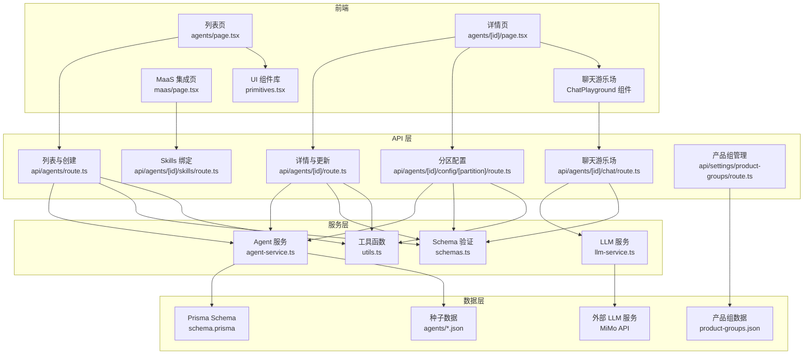
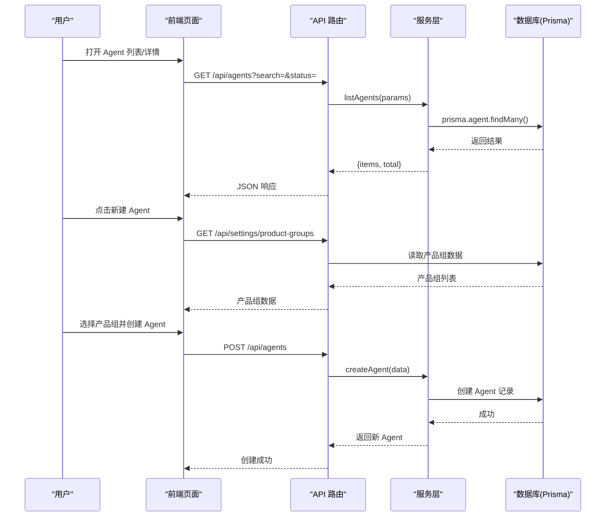
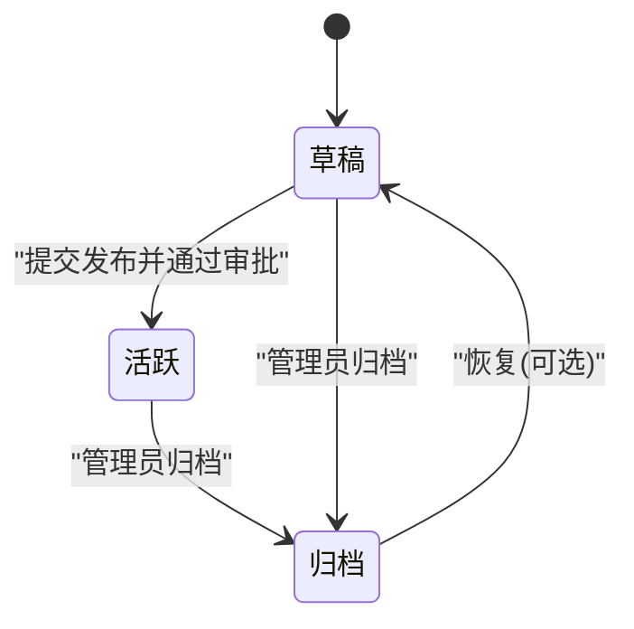
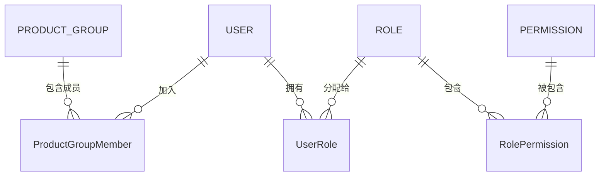
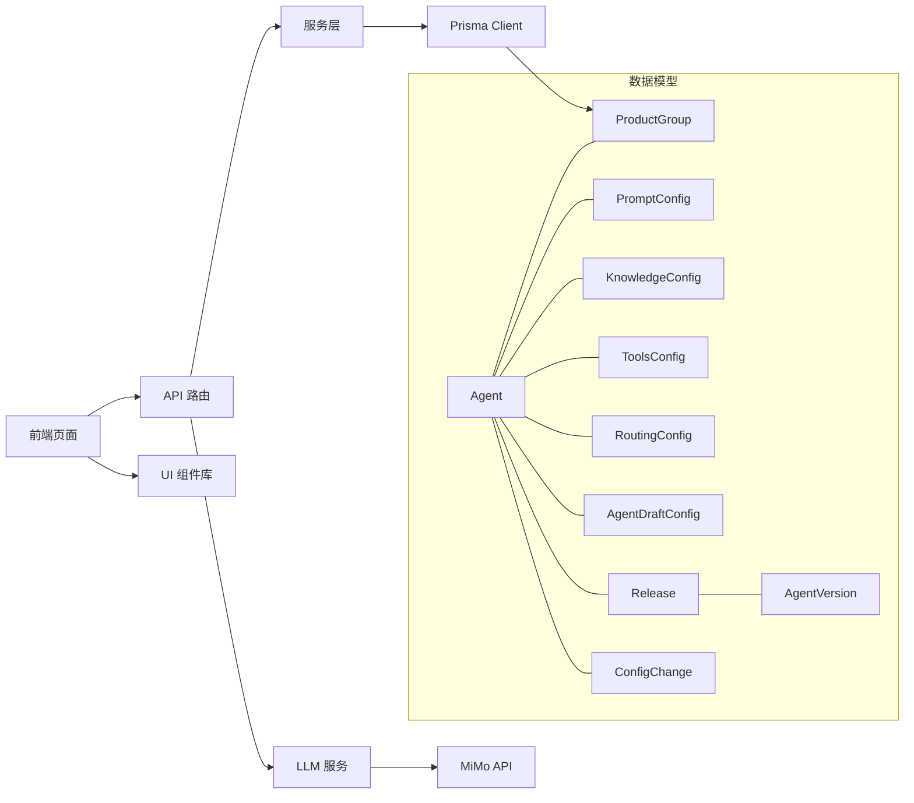

# Agent 管理

<cite>
**本文引用的文件**
- [schema.prisma](file://packages/db/prisma/schema.prisma)
- [agents 列表页](file://apps/web/app/(dashboard)/agents/page.tsx)
- [Agent 详情页](file://apps/web/app/(dashboard)/agents/[id]/page.tsx)
- [API 路由 - 列表与创建](file://apps/web/app/api/agents/route.ts)
- [API 路由 - 详情与更新](file://apps/web/app/api/agents/[id]/route.ts)
- [API 路由 - 分区配置](file://apps/web/app/api/agents/[id]/config/[partition]/route.ts)
- [API 路由 - Skills 绑定](file://apps/web/app/api/agents/[id]/skills/route.ts)
- [API 路由 - 聊天游乐场](file://apps/web/app/api/agents/[id]/chat/route.ts)
- [产品组设置 API](file://apps/web/app/api/settings/product-groups/route.ts)
- [Agent 服务层](file://apps/web/lib/services/agent-service.ts)
- [LLM 服务](file://apps/web/lib/services/llm-service.ts)
- [数据校验 Schema](file://apps/web/lib/schemas.ts)
- [通用工具函数](file://apps/web/lib/utils.ts)
- [UI 组件库](file://apps/web/components/ui/primitives.tsx)
- [ECS 助手配置](file://apps/web/data/agents/ecs-assistant.json)
- [RDS 助手配置](file://apps/web/data/agents/rds-assistant.json)
- [MaaS 集成页面](file://apps/web/app/(dashboard)/maas/page.tsx)
</cite>

## 更新摘要
**变更内容**
- 完成了 Agent 管理界面的全面现代化改造，包括增强的搜索过滤功能、状态跟踪、改进的错误处理和动态产品组加载
- 优化了用户界面组件，统一了样式和交互体验
- 增强了错误处理机制，提供更友好的错误提示和重试功能
- 实现了动态产品组加载，支持从 API 获取产品组列表
- 改进了搜索和过滤功能，支持多维度筛选和实时搜索
- 完善了状态跟踪系统，提供更好的状态可视化

## 目录
1. [简介](#简介)
2. [项目结构](#项目结构)
3. [核心组件](#核心组件)
4. [架构总览](#架构总览)
5. [详细组件分析](#详细组件分析)
6. [依赖关系分析](#依赖关系分析)
7. [性能考虑](#性能考虑)
8. [故障排除指南](#故障排除指南)
9. [结论](#结论)
10. [附录](#附录)

## 简介
本模块提供 Agent 的完整生命周期管理与四分区配置系统（Prompt、Knowledge、Tools、Routing）。面向最终用户，提供创建、编辑、保存草稿与发布版本的操作；面向开发者，给出数据模型、权限控制、变更审计与版本快照等实现细节。

**更新** 本次更新对 Agent 管理界面进行了全面现代化改造，显著提升了用户体验和操作效率。主要改进包括：增强的搜索过滤功能，支持按名称、描述、状态等多维度筛选；改进的状态跟踪系统，提供更直观的状态展示；完善的错误处理机制，提供友好的错误提示和重试功能；动态产品组加载，支持从 API 获取产品组列表，避免手动输入 ID 的繁琐操作。

## 项目结构
- 前端页面
  - 列表页：展示 Agent 列表、搜索框与新建入口，支持状态过滤和分页，具备现代化的 UI 组件
  - 详情页：按分区 Tab 展示 Prompt、知识库、工具/MCP、路由的配置编辑区，并提供提交发布、查看版本历史、查看反馈等操作按钮
  - 聊天游乐场组件：支持实时测试 Agent 配置，显示对话历史和用量指标
  - MaaS 集成页：展示模型服务集成方案，包含公共云和专有云的对比
- API 层
  - RESTful 接口：完整的 CRUD 操作、分区配置管理、Skills 绑定、聊天游乐场等功能
  - 产品组管理 API：支持动态获取和管理产品组信息
- 服务层
  - 业务逻辑封装：Agent 管理、配置操作、变更审计等服务方法
  - LLM 服务封装：统一接入小米 MiMo 推理模型
- 数据层
  - Prisma Schema：定义 Agent、四分区配置、草稿环境、版本快照、发布审批、权限与审计等实体与关系
  - 种子数据：预配置的 ECS 助手和 RDS 助手示例

**图表来源**
- [agents 列表页:1-408](file://apps/web/app/(dashboard)/agents/page.tsx#L1-L408)
- [Agent 详情页:1-1203](file://apps/web/app/(dashboard)/agents/[id]/page.tsx#L1-L1203)
- [UI 组件库:1-487](file://apps/web/components/ui/primitives.tsx#L1-L487)
- [API 路由 - 列表与创建:1-43](file://apps/web/app/api/agents/route.ts#L1-L43)
- [API 路由 - 详情与更新:1-50](file://apps/web/app/api/agents/[id]/route.ts#L1-L50)
- [产品组设置 API:1-42](file://apps/web/app/api/settings/product-groups/route.ts#L1-L42)

## 核心组件
- Agent 实体
  - 标识与归属：id、name、description、productGroupId、createdBy
  - 状态：DRAFT（草稿）、ACTIVE（活跃）、ARCHIVED（归档）
  - 四分区配置：promptConfig、knowledgeConfig、toolsConfig、routingConfig
  - 草稿环境：draftConfig（JSON 存储未发布的分区配置）
  - 关联：feedbacks、releases、versions、skillBindings、wikiVault、configChanges
- 四分区配置
  - Prompt：systemPrompt、roleDefinition、constraints、outputFormat、version、lastModifiedBy/At
  - Knowledge：wikiVaultId、searchStrategy、fallbackToMcp、maxWikiResults、confidenceThreshold、syncStatus、version、lastModifiedBy/At
  - Tools：mcpTools、wikiQueryTools、并发/超时/重试策略、version、lastModifiedBy/At
  - Routing：rules、escalationPolicy、humanThreshold、maxConversationTurns、idleTimeoutMinutes、version、lastModifiedBy/At
- 草稿环境
  - AgentDraftConfig：以 JSON 暂存四个分区的修改，标记 isDirty、记录 lastSavedBy/At
- 版本与发布
  - Release：变更说明、受影响分区、审批状态、提交/审批人、时间戳
  - AgentVersion：四分区快照、版本号、wikiCommitSha、发布人/时间、变更说明、效果报告
- 权限与审计
  - Role/Permission/UserRole/AuditLog：角色-权限-用户映射与操作审计日志
  - ProductGroup/ProductGroupMember：产品组与成员角色（LEAD/MEMBER）
- **新增**：现代化 UI 组件库
  - 统一的按钮、卡片、徽章、状态展示等基础组件
  - 标准化的颜色系统和主题支持
  - 增强的可访问性和响应式设计

**章节来源**
- [schema.prisma:61-97](file://packages/db/prisma/schema.prisma#L61-L97)
- [schema.prisma:103-173](file://packages/db/prisma/schema.prisma#L103-L173)
- [schema.prisma:175-186](file://packages/db/prisma/schema.prisma#L175-L186)
- [schema.prisma:298-354](file://packages/db/prisma/schema.prisma#L298-354)
- [schema.prisma:563-625](file://packages/db/prisma/schema.prisma#L563-L625)
- [UI 组件库:43-97](file://apps/web/components/ui/primitives.tsx#L43-L97)
- [UI 组件库:138-190](file://apps/web/components/ui/primitives.tsx#L138-L190)

## 架构总览
整体采用"前端页面 + Next.js API 路由 + 服务层 + Prisma 数据模型"的分层架构。前端通过 API 路由访问数据库，完成 Agent 的 CRUD、分区配置读写、草稿保存、发布审批与版本回滚等流程。

**更新** 架构中新增了现代化 UI 组件库和产品组动态加载功能。UI 组件库提供了统一的视觉语言和交互模式，产品组动态加载通过专门的 API 路由支持从后端获取产品组列表，提升了用户体验和数据一致性。

**图表来源**
- [agents 列表页:42-64](file://apps/web/app/(dashboard)/agents/page.tsx#L42-L64)
- [API 路由 - 列表与创建:7-26](file://apps/web/app/api/agents/route.ts#L7-L26)
- [产品组设置 API:8-11](file://apps/web/app/api/settings/product-groups/route.ts#L8-L11)
- [Agent 服务层:37-60](file://apps/web/lib/services/agent-service.ts#L37-L60)

## 详细组件分析

### Agent 生命周期管理
- 创建
  - 在列表页点击"新建 Agent"，调用 POST /api/agents 接口，默认状态为 DRAFT
  - 支持必填字段验证：名称、产品组 ID
  - **更新**：产品组现在支持动态加载，用户可以从下拉列表中选择，而非手动输入 ID
- 编辑
  - 进入详情页后，按分区 Tab 编辑 Prompt/Knowledge/Tools/Routing
  - 支持实时更新，自动记录变更历史
- 删除
  - 使用软删除机制，将状态设置为 ARCHIVED，保留版本与审计记录
- 状态管理
  - DRAFT：可继续编辑与保存配置
  - ACTIVE：已发布生效
  - ARCHIVED：归档不可用，但保留历史

**图表来源**
- [schema.prisma:93-97](file://packages/db/prisma/schema.prisma#L93-L97)

**章节来源**
- [schema.prisma:61-97](file://packages/db/prisma/schema.prisma#L61-L97)
- [Agent 服务层:78-113](file://apps/web/lib/services/agent-service.ts#L78-L113)
- [Agent 服务层:115-138](file://apps/web/lib/services/agent-service.ts#L115-L138)
- [API 路由 - 详情与更新:18-35](file://apps/web/app/api/agents/[id]/route.ts#L18-L35)

### 现代化搜索与过滤功能
**更新** 本次更新大幅增强了搜索和过滤功能，提供了更强大的数据筛选能力。

- 搜索功能
  - 支持按名称和描述进行模糊搜索
  - 实时搜索，输入后立即过滤结果
  - 搜索词高亮显示，便于快速定位
- 过滤功能
  - 状态过滤器：全部、草稿、活跃、已归档
  - 产品组过滤器：按所属产品组筛选
  - 组合过滤：支持多个条件同时使用
- 用户体验
  - 现代化的搜索框设计，支持清除按钮
  - 清晰的过滤状态指示
  - 搜索结果计数和统计信息

**章节来源**
- [agents 列表页:91-124](file://apps/web/app/(dashboard)/agents/page.tsx#L91-L124)
- [API 路由 - 列表与创建:7-26](file://apps/web/app/api/agents/route.ts#L7-L26)
- [Agent 服务层:37-60](file://apps/web/lib/services/agent-service.ts#L37-L60)

### 改进的错误处理机制
**更新** 本次更新完善了错误处理机制，提供了更友好的错误提示和重试功能。

- 网络错误处理
  - 统一的错误捕获和处理
  - 友好的错误提示信息
  - 一键重试功能
- 数据验证错误
  - 前端表单验证
  - 后端数据校验
  - 详细的错误原因说明
- 用户体验改进
  - 加载状态指示器
  - 空状态提示
  - 操作反馈确认

**章节来源**
- [agents 列表页:126-140](file://apps/web/app/(dashboard)/agents/page.tsx#L126-L140)
- [Agent 详情页:175-201](file://apps/web/app/(dashboard)/agents/[id]/page.tsx#L175-L201)
- [UI 组件库:299-350](file://apps/web/components/ui/primitives.tsx#L299-L350)

### 动态产品组加载
**更新** 本次更新实现了动态产品组加载功能，替代了之前需要手动输入产品组 ID 的方式。

- 功能特性
  - 从 API 动态获取产品组列表
  - 支持下拉选择产品组
  - 当 API 失败时回退到手动输入模式
  - 显示产品组的显示名称和 ID
- 技术实现
  - 使用 `/api/settings/product-groups` 接口获取产品组数据
  - 前端组件根据 API 响应动态渲染选择器
  - 错误处理和降级方案确保功能可用性

**章节来源**
- [agents 列表页:273-284](file://apps/web/app/(dashboard)/agents/page.tsx#L273-L284)
- [agents 列表页:361-399](file://apps/web/app/(dashboard)/agents/page.tsx#L361-L399)
- [产品组设置 API:8-11](file://apps/web/app/api/settings/product-groups/route.ts#L8-L11)

### 四分区配置系统（Prompt、Knowledge、Tools、Routing）
- 设计原则
  - 每个分区独立建模，便于单独版本化与变更追踪
  - 所有分区均包含 version、lastModifiedBy、lastModifiedAt，用于追踪变更
- 分区字段要点
  - Prompt：系统提示词、角色定义、约束、输出格式
  - Knowledge：知识检索策略、是否回退 MCP、最大结果数、置信度阈值、同步状态
  - Tools：MCP 工具与 Wiki 查询工具配置、并发/超时/重试策略
  - Routing：路由规则、升级策略、人工介入阈值、对话轮次上限、空闲超时
- 使用方式
  - 在详情页对应 Tab 中编辑各分区配置
  - 支持实时保存，自动记录变更历史
  - 提供 JSON 编辑器支持复杂配置

**章节来源**
- [schema.prisma:103-173](file://packages/db/prisma/schema.prisma#L103-L173)
- [Agent 服务层:150-190](file://apps/web/lib/services/agent-service.ts#L150-L190)

### 交互式聊天游乐场功能
- 核心特性
  - 实时对话：支持多轮对话历史，前端内存存储不持久化
  - 真实 LLM 调用：基于当前 Prompt 分区配置进行真实模型调用
  - 用量追踪：显示模型名称、延迟时间和 token 使用情况
  - 错误处理：完善的网络错误和 API 错误处理机制
- 技术实现
  - 前端 ChatPlayground 组件：管理对话状态和用户输入
  - 后端聊天 API：组装 system prompt 并调用 LLM 服务
  - LLM 服务：统一接入小米 MiMo 推理模型，提供标准化接口
- 用户体验
  - 直观的聊天界面，支持 Enter 键快速发送
  - 实时显示模型思考状态和响应延迟
  - 清晰的错误提示和重试机制

**章节来源**
- [Agent 详情页:1064-1202](file://apps/web/app/(dashboard)/agents/[id]/page.tsx#L1064-L1202)
- [API 路由 - 聊天游乐场:14-61](file://apps/web/app/api/agents/[id]/chat/route.ts#L14-L61)
- [LLM 服务:67-135](file://apps/web/lib/services/llm-service.ts#L67-L135)

### 运行环境（MOCK）配置
- 模型栈配置
  - ECS 助手：主模型 Qwen-Max，降级模型 Qwen-Plus，分类模型 Qwen-Turbo
  - RDS 助手：主模型 Qwen-Plus，降级模型 Qwen-Turbo，复杂查询升级 Qwen-Max
- 工具配置
  - bailian_kb_retrieval：百炼知识库检索（MOCK），支持公共云百炼 RAG 和专有云私有向量检索
  - dashscope_text_embedding：DashScope 文本向量化（MOCK），用于生成查询向量
  - bailian_rag_fallback：百炼 RAG 兜底检索（MOCK），当 Wiki 蒸馏知识未命中时启用
- 路由策略
  - 统一的路由流程：意图分类 → 模型选择 → 知识检索 → 兜底处理
  - 支持置信度阈值和人工介入机制

**章节来源**
- [ECS 助手配置:10-15](file://apps/web/data/agents/ecs-assistant.json#L10-L15)
- [ECS 助手配置:23-85](file://apps/web/data/agents/ecs-assistant.json#L23-L85)
- [RDS 助手配置:10-15](file://apps/web/data/agents/rds-assistant.json#L10-L15)
- [RDS 助手配置:23-54](file://apps/web/data/agents/rds-assistant.json#L23-L54)

### 权限控制机制
- 组织与成员
  - ProductGroup 与 ProductGroupMember：成员拥有 LEAD 或 MEMBER 角色
- 全局角色与权限
  - Role/Permission/UserRole：基于 RBAC 的角色-权限-用户绑定，支持按产品组范围授权
- 审计
  - AuditLog：记录关键操作的资源、动作、用户、IP、User-Agent 等

**图表来源**
- [schema.prisma:563-625](file://packages/db/prisma/schema.prisma#L563-L625)
- [schema.prisma:14-41](file://packages/db/prisma/schema.prisma#L14-L41)

**章节来源**
- [schema.prisma:563-625](file://packages/db/prisma/schema.prisma#L563-L625)
- [schema.prisma:14-41](file://packages/db/prisma/schema.prisma#L14-L41)

### 操作指南（面向最终用户）
- 创建新 Agent
  - 在"Agent 管理"页面点击"+ 新建 Agent"，填写名称、描述和产品组
  - **更新**：产品组现在支持从下拉列表中选择，无需手动输入 ID
  - 创建成功后默认处于草稿状态
- 配置各个分区
  - 进入 Agent 详情页，依次配置 Prompt、知识库、工具/MCP、路由
  - 支持实时保存，无需手动提交
- **新增**：使用聊天游乐场测试配置
  - 在 Agent 详情页底部找到"试聊 Playground"区域
  - 输入测试消息，体验当前配置的实际效果
  - 查看模型响应、延迟时间和 token 使用情况
  - 根据测试结果调整 Prompt 配置
- **更新**：搜索与过滤
  - 使用增强的搜索框快速查找 Agent
  - 通过状态下拉菜单筛选不同状态的 Agent
  - 支持组合搜索和过滤条件
- 查看详细信息
  - 在列表页查看 Agent 的基本信息、状态和相关统计
  - 点击进入详情页查看完整配置和统计数据
- 版本管理
  - 查看版本历史，支持分区级回滚和整版本回滚
  - 查看版本效果评估，包括反馈统计和问题密度

**章节来源**
- [agents 列表页:84-88](file://apps/web/app/(dashboard)/agents/page.tsx#L84-L88)
- [agents 列表页:273-399](file://apps/web/app/(dashboard)/agents/page.tsx#L273-L399)
- [Agent 详情页:230-445](file://apps/web/app/(dashboard)/agents/[id]/page.tsx#L230-L445)
- [Agent 详情页:1064-1202](file://apps/web/app/(dashboard)/agents/[id]/page.tsx#L1064-L1202)

### 开发者实现要点
- API 路由
  - 完整的 RESTful 接口实现，支持标准 HTTP 方法
  - 统一的响应格式：success/error 包装
  - 聊天 API 路由，支持实时 LLM 调用和用量追踪
- 数据一致性
  - 分区配置更新自动记录变更历史
  - 使用事务确保数据一致性
- 变更审计
  - ConfigChange 表记录所有配置变更
  - 支持前后对比和差异分析
- 版本快照
  - 发布时生成 AgentVersion 快照
  - 支持版本回滚和比较
- 运行环境支持
  - 支持公共云和专有云两种部署形态的统一配置
  - 提供 Mock 接口用于开发和测试
- **更新**：现代化 UI 组件
  - 统一的组件库，提供一致的视觉语言
  - 增强的可访问性和响应式设计
  - 标准化的错误处理和用户反馈
- **更新**：产品组动态加载
  - 通过专用 API 路由提供产品组数据
  - 前端组件支持动态渲染和错误降级

**章节来源**
- [API 路由 - 列表与创建:28-42](file://apps/web/app/api/agents/route.ts#L28-L42)
- [API 路由 - 详情与更新:18-49](file://apps/web/app/api/agents/[id]/route.ts#L18-L49)
- [产品组设置 API:8-41](file://apps/web/app/api/settings/product-groups/route.ts#L8-L41)
- [UI 组件库:43-97](file://apps/web/components/ui/primitives.tsx#L43-L97)
- [UI 组件库:299-350](file://apps/web/components/ui/primitives.tsx#L299-L350)

## 依赖关系分析
- 前端依赖
  - 列表页与详情页依赖 API 路由提供的数据与操作能力
  - 使用 React Hooks 管理状态和副作用
  - 聊天游乐场组件依赖 LLM 服务和聊天 API
  - **更新**：所有页面都依赖统一的 UI 组件库
- 后端依赖
  - API 路由依赖服务层处理业务逻辑
  - 服务层依赖 Prisma Client 访问 PostgreSQL
  - 聊天 API 依赖 LLM 服务进行模型调用
  - **更新**：产品组管理依赖专用的 API 路由
- 数据依赖
  - Agent 与四分区配置为一对一关系
  - Agent 与 Draft/Release/Version 为一对多关系
  - 权限体系通过 Role/Permission/UserRole 与 ProductGroupMember 组合实现

**图表来源**
- [schema.prisma:61-97](file://packages/db/prisma/schema.prisma#L61-L97)
- [schema.prisma:175-186](file://packages/db/prisma/schema.prisma#L175-L186)
- [schema.prisma:298-354](file://packages/db/prisma/schema.prisma#L298-354)
- [schema.prisma:192-207](file://packages/db/prisma/schema.prisma#L192-L207)
- [UI 组件库:1-487](file://apps/web/components/ui/primitives.tsx#L1-L487)

**章节来源**
- [schema.prisma:61-97](file://packages/db/prisma/schema.prisma#L61-L97)
- [schema.prisma:175-186](file://packages/db/prisma/schema.prisma#L175-L186)
- [schema.prisma:298-354](file://packages/db/prisma/schema.prisma#L298-354)

## 性能考虑
- 索引优化
  - Agent 表针对 productGroupId 与 status 建立索引，提升列表与筛选性能
  - 配置变更记录与反馈表针对常用查询字段建立索引
- 并发与超时
  - ToolsConfig 提供并发调用、超时与重试参数，合理设置以避免阻塞
  - 建议根据实际负载调整 maxConcurrentCalls、timeoutMs、retryCount 参数
  - LLM 调用超时控制，默认 120 秒超时，避免长时间等待
- 缓存策略
  - 对只读配置（如 Prompt、Routing）可引入缓存层，减少数据库压力
  - **更新**：产品组数据可考虑前端缓存，减少重复请求
- 分页与懒加载
  - 列表与版本历史建议使用分页与按需加载，降低首屏渲染开销
- 查询优化
  - 使用 include 和 select 精确获取所需数据，避免 N+1 查询问题
- 模型调用优化
  - 合理使用 Qwen-Turbo 进行分类和简单问答，Qwen-Plus/Qwen-Max 用于复杂任务
  - 利用百炼 RAG 的知识蒸馏能力，减少重复计算
  - 聊天游乐场使用前端内存存储对话历史，避免不必要的数据库写入
- **更新**：UI 性能优化
  - 使用虚拟滚动处理大量数据列表
  - 组件懒加载和代码分割
  - 优化的状态管理和重渲染控制

**章节来源**
- [schema.prisma:89-91](file://packages/db/prisma/schema.prisma#L89-L91)
- [schema.prisma:147-159](file://packages/db/prisma/schema.prisma#L147-L159)
- [schema.prisma:205-207](file://packages/db/prisma/schema.prisma#L205-L207)
- [schema.prisma:246-249](file://packages/db/prisma/schema.prisma#L246-249)
- [Agent 服务层:37-60](file://apps/web/lib/services/agent-service.ts#L37-L60)

## 故障排除指南
- 无法保存草稿
  - 检查分区配置 JSON 结构是否符合预期
  - 确认用户具备编辑权限
  - 验证请求体格式是否正确
- 发布失败
  - 检查 Release 审批状态与变更说明是否完整
  - 查看 AgentVersion 快照是否生成成功
- 权限不足
  - 确认用户在 ProductGroup 中的角色与全局 Role/Permission 配置
- 审计缺失
  - 检查 AuditLog 写入逻辑是否触发
  - 核对 userId、userName、userRole 是否正确记录
- 搜索无结果
  - 检查搜索关键词是否存在
  - 确认过滤条件是否正确设置
  - 验证数据库索引是否正常
- 模型调用失败
  - 检查运行环境（MOCK）配置是否正确
  - 验证 Bailian 和 DashScope 接口可用性
  - 确认模型栈配置与实际部署环境匹配
- **更新**：产品组加载失败
  - 检查 `/api/settings/product-groups` 接口是否可用
  - 验证产品组数据文件格式和内容
  - 确认网络连接和 API 响应状态
- **更新**：UI 组件相关问题
  - 检查 UI 组件库是否正确导入
  - 验证 CSS 变量和主题配置
  - 确认浏览器兼容性和样式渲染
- **更新**：错误处理问题
  - 检查错误边界组件是否正确配置
  - 验证错误消息的用户友好性
  - 确认重试功能的可用性

**章节来源**
- [schema.prisma:175-186](file://packages/db/prisma/schema.prisma#L175-L186)
- [schema.prisma:298-354](file://packages/db/prisma/schema.prisma#L298-354)
- [schema.prisma:563-625](file://packages/db/prisma/schema.prisma#L563-L625)
- [Agent 服务层:37-60](file://apps/web/lib/services/agent-service.ts#L37-L60)
- [产品组设置 API:8-11](file://apps/web/app/api/settings/product-groups/route.ts#L8-L11)
- [UI 组件库:299-350](file://apps/web/components/ui/primitives.tsx#L299-L350)

## 结论
本模块通过清晰的数据模型与分层架构，实现了 Agent 的完整生命周期管理与四分区配置系统。结合草稿、发布审批与版本快照，既满足最终用户的易用性需求，也为开发者提供了完善的扩展与审计能力。

**更新** 本次更新对 Agent 管理界面进行了全面的现代化改造，显著提升了用户体验和功能完整性。主要改进包括：增强的搜索过滤功能，支持多维度筛选和实时搜索；改进的状态跟踪系统，提供更直观的状态展示；完善的错误处理机制，提供友好的错误提示和重试功能；动态产品组加载，支持从 API 获取产品组列表，避免了手动输入 ID 的繁琐操作。这些改进不仅提升了用户操作的便捷性，也增强了系统的稳定性和可维护性。建议在后续迭代中继续优化性能，完善移动端适配，并考虑添加更多的数据分析功能。

## 附录
- 术语
  - 分区：指 Prompt、Knowledge、Tools、Routing 四类配置
  - 草稿：未发布的临时配置，保存在 AgentDraftConfig
  - 发布：经审批后将分区配置快照固化到 AgentVersion 并激活 Agent
  - 运行环境（MOCK）：支持公共云和专有云两种部署形态的配置模式
  - 模型栈：包含主模型、降级模型和分类模型的组合配置
  - 聊天游乐场：用于实时测试 Agent 配置的交互式界面
  - 用量指标：显示模型调用的 token 使用量和延迟时间
  - **新增**：现代化 UI：统一的组件库和视觉语言
  - **新增**：动态产品组：从 API 获取的产品组列表数据
- 相关端点
  - GET /api/agents - 获取 Agent 列表（支持搜索和过滤）
  - POST /api/agents - 创建新 Agent
  - GET /api/agents/:id - 获取 Agent 详情
  - PUT /api/agents/:id - 更新 Agent 基本信息
  - DELETE /api/agents/:id - 归档 Agent
  - GET /api/agents/:id/config/:partition - 获取分区配置
  - PUT /api/agents/:id/config/:partition - 更新分区配置
  - GET /api/agents/:id/skills - 获取绑定的 Skills
  - POST /api/agents/:id/skills - 绑定 Skill
  - DELETE /api/agents/:id/skills - 解绑 Skill
  - POST /api/agents/:id/chat - 聊天游乐场接口
  - **新增**：GET /api/settings/product-groups - 获取产品组列表
- 模型路由策略
  - 意图分类：使用 Qwen-Turbo 进行快速分类
  - 模型选择：根据问题复杂度选择 Qwen-Plus 或 Qwen-Max
  - 知识检索：优先使用百炼 RAG 蒸馏知识，未命中时回退到原始检索
  - 兜底处理：通过 MCP 工具获取实时数据进行兜底回答
- **新增**：聊天游乐场接口规范
  - 请求体：{ message: string, history: Array<{role: string, content: string}> }
  - 响应体：{ reply: string, model: string, usage: {promptTokens, completionTokens, totalTokens}, latencyMs: number }
  - 错误处理：网络错误、API 错误、LLM 服务异常等
- **新增**：产品组管理接口规范
  - GET /api/settings/product-groups - 获取所有产品组
  - POST /api/settings/product-groups - 创建新产品组
  - 响应格式：{ success: boolean, data: Array<ProductGroup>, error?: string }

**章节来源**
- [API 路由 - 列表与创建:7-42](file://apps/web/app/api/agents/route.ts#L7-L42)
- [API 路由 - 详情与更新:7-49](file://apps/web/app/api/agents/[id]/route.ts#L7-L49)
- [API 路由 - 分区配置:28-85](file://apps/web/app/api/agents/[id]/config/[partition]/route.ts#L28-L85)
- [API 路由 - Skills 绑定:6-50](file://apps/web/app/api/agents/[id]/skills/route.ts#L6-L50)
- [API 路由 - 聊天游乐场:14-61](file://apps/web/app/api/agents/[id]/chat/route.ts#L14-L61)
- [产品组设置 API:8-41](file://apps/web/app/api/settings/product-groups/route.ts#L8-L41)