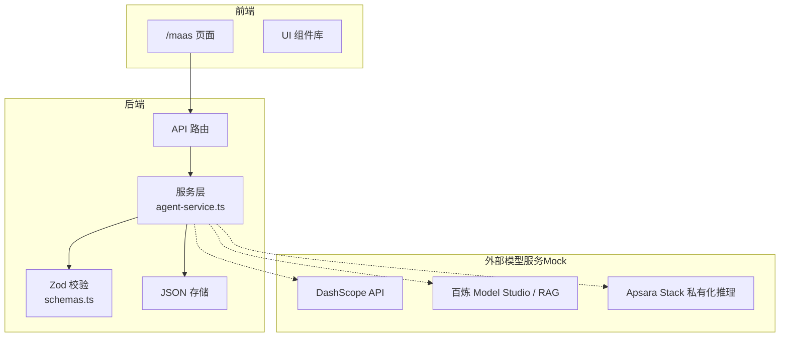
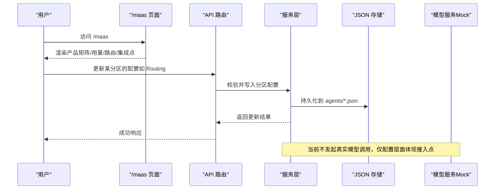
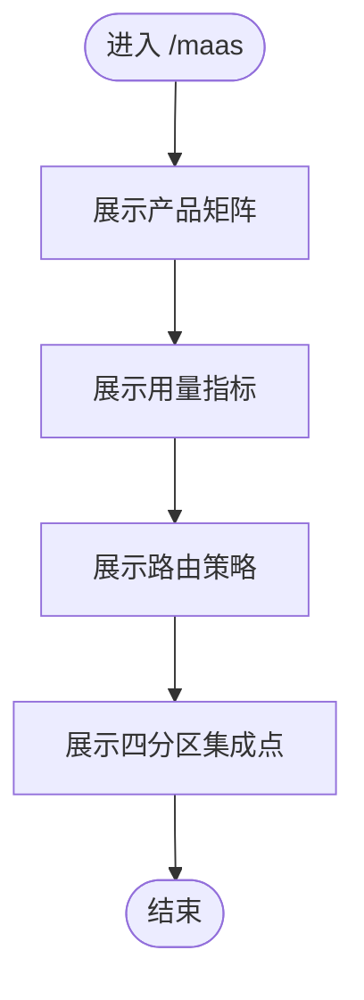
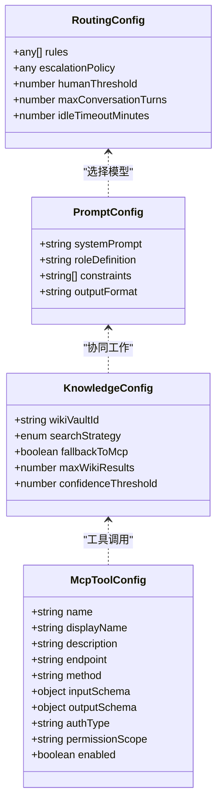
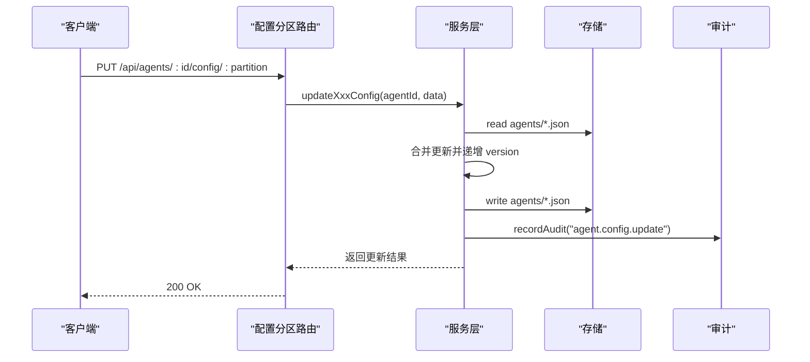
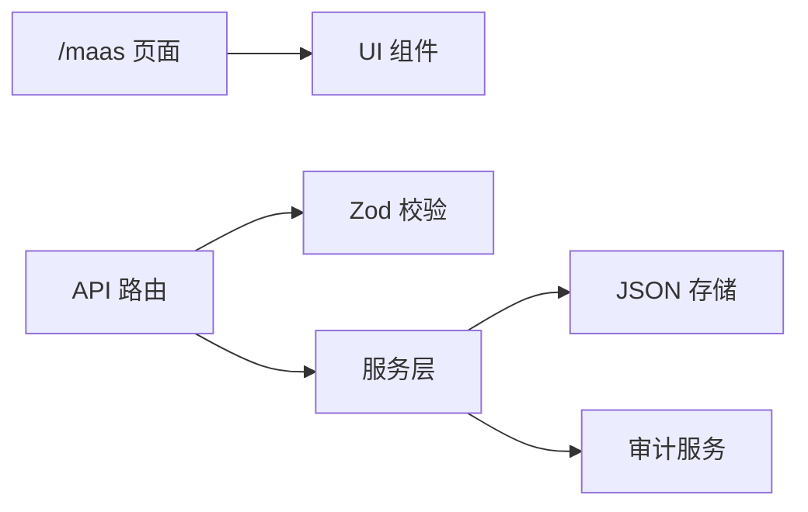

# MaaS 模型服务集成

<cite>
**本文引用的文件**
- [README.md](file://README.md)
- [MaaS 页面](file://apps/web/app/(dashboard)/maas/page.tsx)
- [MaaS Mock 设计文档](file://docs/superpowers/specs/2026-08-21-maas-integration-mock-design.md)
- [ECS 助手种子数据](file://apps/web/data/agents/ecs-assistant.json)
- [RDS 助手种子数据](file://apps/web/data/agents/rds-assistant.json)
- [Agent 类型定义](file://packages/shared/src/types/agent.ts)
- [API 校验 Schema](file://apps/web/lib/schemas.ts)
- [Agent 服务层](file://apps/web/lib/services/agent-service.ts)
- [配置分区路由](file://apps/web/app/api/agents/[id]/config/[partition]/route.ts)
</cite>

## 目录
1. [简介](#简介)
2. [项目结构](#项目结构)
3. [核心组件](#核心组件)
4. [架构总览](#架构总览)
5. [详细组件分析](#详细组件分析)
6. [依赖关系分析](#依赖关系分析)
7. [性能与可观测性](#性能与可观测性)
8. [故障排查指南](#故障排查指南)
9. [结论](#结论)
10. [附录](#附录)

## 简介
本仓库为“Agent 改进平台”，当前以演示形态运行，使用本地 JSON 作为数据源。MaaS（Model-as-a-Service）集成在 `/maas` 页面中以 mock 方式展示公共云（百炼 Model Studio、DashScope API、Qwen 系列、text-embedding-v3 + 百炼 RAG）与专有云（Apsara Stack 私有化推理、PAI-EAS、私有向量检索）双形态的对接思路与策略。真实 DashScope / 百炼接入为下一里程碑。

## 项目结构
- 前端：Next.js App Router，包含工作台页面、API 路由、共享 UI 组件。
- 业务逻辑：lib/services 下的服务层封装 Agent、Release、Feedback、Skill、Wiki 等能力；lib/schemas 提供 Zod 校验；lib/diff 提供 JSON diff。
- 数据：当前使用 apps/web/data 下的 JSON 文件作为种子数据，后续将迁移至 Prisma + PostgreSQL。
- MaaS 集成点：通过四分区配置（Prompt/Knowledge/Tools/Routing）与模型服务对接，当前以 mock 形式呈现。

图表来源
- [MaaS 页面:1-106](file://apps/web/app/(dashboard)/maas/page.tsx#L1-L106)
- [Agent 服务层:1-209](file://apps/web/lib/services/agent-service.ts#L1-L209)
- [API 校验 Schema:1-64](file://apps/web/lib/schemas.ts#L1-L64)

章节来源
- [README.md:20-66](file://README.md#L20-L66)

## 核心组件
- MaaS 展示页：集中展示产品矩阵、用量指标、路由策略与四分区集成点，全部为 mock。
- 四分区配置：Prompt、Knowledge、Tools、Routing，分别对应模型人设约束、知识库检索、工具调用与模型路由策略。
- 服务层：统一读写 Agent 及其分区配置，记录变更与审计日志。
- 校验层：所有 API 入参通过 Zod schema 校验，保证数据结构安全。

章节来源
- [MaaS 页面:1-106](file://apps/web/app/(dashboard)/maas/page.tsx#L1-L106)
- [Agent 类型定义:1-61](file://packages/shared/src/types/agent.ts#L1-L61)
- [API 校验 Schema:1-64](file://apps/web/lib/schemas.ts#L1-L64)
- [Agent 服务层:1-209](file://apps/web/lib/services/agent-service.ts#L1-L209)

## 架构总览
MaaS 集成的核心思想是“模型引擎由 MaaS 提供，agent-up 负责 Agent 的配置、评估、发布与回滚生命周期”。当前阶段通过 mock 展示公共云与专有云两种部署形态，并在四分区中明确接入点。

图表来源
- [MaaS 页面:1-106](file://apps/web/app/(dashboard)/maas/page.tsx#L1-L106)
- [Agent 服务层:137-169](file://apps/web/lib/services/agent-service.ts#L137-L169)
- [配置分区路由:1-200](file://apps/web/app/api/agents/[id]/config/[partition]/route.ts#L1-L200)

## 详细组件分析

### MaaS 页面（/maas）
- 内容块一：产品矩阵（公共云 vs 专有云），映射到 agent-up 四分区。
- 内容块二：每 Agent 模型用量（mock），用于对齐成本、时延、解决率。
- 内容块三：模型路由策略（Mermaid 图），强调“路由是配置不是代码”。
- 内容块四：四分区 ↔ MaaS 集成点与演进路线。

图表来源
- [MaaS 页面:18-27](file://apps/web/app/(dashboard)/maas/page.tsx#L18-L27)
- [MaaS 页面:38-102](file://apps/web/app/(dashboard)/maas/page.tsx#L38-L102)

章节来源
- [MaaS 页面:1-106](file://apps/web/app/(dashboard)/maas/page.tsx#L1-L106)
- [MaaS Mock 设计文档:1-43](file://docs/superpowers/specs/2026-08-21-maas-integration-mock-design.md#L1-L43)

### 四分区配置与校验
- Prompt：systemPrompt、roleDefinition、constraints、outputFormat。
- Knowledge：wikiVaultId、searchStrategy、fallbackToMcp、maxWikiResults、confidenceThreshold。
- Tools：mcpTools、wikiQueryTools、并发/超时/重试参数。
- Routing：rules、escalationPolicy、humanThreshold、会话轮次与时限。

图表来源
- [Agent 类型定义:18-61](file://packages/shared/src/types/agent.ts#L18-L61)
- [API 校验 Schema:23-52](file://apps/web/lib/schemas.ts#L23-L52)

章节来源
- [Agent 类型定义:1-61](file://packages/shared/src/types/agent.ts#L1-L61)
- [API 校验 Schema:23-64](file://apps/web/lib/schemas.ts#L23-L64)

### 服务层与配置更新流程
- 读取 Agent 与分区配置。
- 校验输入（Zod）。
- 合并更新并递增版本。
- 记录变更与审计日志。

图表来源
- [Agent 服务层:129-169](file://apps/web/lib/services/agent-service.ts#L129-L169)
- [Agent 服务层:176-208](file://apps/web/lib/services/agent-service.ts#L176-L208)
- [配置分区路由:1-200](file://apps/web/app/api/agents/[id]/config/[partition]/route.ts#L1-L200)

章节来源
- [Agent 服务层:1-209](file://apps/web/lib/services/agent-service.ts#L1-L209)
- [配置分区路由:1-200](file://apps/web/app/api/agents/[id]/config/[partition]/route.ts#L1-L200)

### 种子数据中的 MaaS 集成点
- ECS 助手：
  - Prompt：systemPrompt 追加“运行环境（MOCK）”段，说明主/降级/分类模型与端点口径。
  - Tools：登记 `bailian_kb_retrieval`、`dashscope_text_embedding`、`bailian_rag_fallback`。
  - Knowledge：searchStrategy 为 HYBRID，支持混合检索。
- RDS 助手：
  - Prompt：systemPrompt 同样包含“运行环境（MOCK）”段。
  - Tools：登记 `bailian_kb_retrieval`、`dashscope_text_embedding`。
  - Knowledge：searchStrategy 为 WIKI_FIRST。

章节来源
- [ECS 助手种子数据:10-15](file://apps/web/data/agents/ecs-assistant.json#L10-L15)
- [ECS 助手种子数据:23-85](file://apps/web/data/agents/ecs-assistant.json#L23-L85)
- [RDS 助手种子数据:10-15](file://apps/web/data/agents/rds-assistant.json#L10-L15)
- [RDS 助手种子数据:23-54](file://apps/web/data/agents/rds-assistant.json#L23-L54)

## 依赖关系分析
- 页面依赖 UI 组件与 Mermaid 渲染器。
- API 路由依赖服务层与校验 schema。
- 服务层依赖存储与审计服务。
- 种子数据为演示用途，不包含真实模型调用。

图表来源
- [MaaS 页面:9-16](file://apps/web/app/(dashboard)/maas/page.tsx#L9-L16)
- [API 校验 Schema:1-64](file://apps/web/lib/schemas.ts#L1-L64)
- [Agent 服务层:1-209](file://apps/web/lib/services/agent-service.ts#L1-L209)

章节来源
- [README.md:169-189](file://README.md#L169-L189)

## 性能与可观测性
- 配置更新路径短且幂等，适合高频迭代；建议在生产接入后增加缓存与限流。
- 审计日志覆盖写操作，便于追踪配置变更与回滚依据。
- 未来接入真实模型服务时，需关注：
  - 并发与超时控制（toolsConfig 已暴露相关字段）。
  - 错误处理与重试策略（retryCount、timeoutMs）。
  - 可观测性：trace 链路（检索命中、工具调用、模型回答）回流为反馈证据。

[本节为通用指导，不直接分析具体文件]

## 故障排查指南
- 配置更新失败：检查 Zod 校验是否通过（schemas.ts），确认分区字段是否符合预期。
- 找不到 Agent：确认 ID 是否存在于 agents/*.json，或是否被归档。
- 审计日志缺失：确认 recordAudit 是否被调用，以及 actor 上下文是否正确解析。
- 模型调用问题（未来接入后）：检查 toolsConfig 的 endpoint、authType、权限范围；核对网络连通性与鉴权。

章节来源
- [Agent 服务层:94-117](file://apps/web/lib/services/agent-service.ts#L94-L117)
- [Agent 服务层:129-169](file://apps/web/lib/services/agent-service.ts#L129-L169)
- [Agent 服务层:176-208](file://apps/web/lib/services/agent-service.ts#L176-L208)

## 结论
当前 MaaS 集成以 mock 形式完整展示了公共云与专有云双形态的对接思路，并通过四分区配置将模型选型、知识库检索、工具调用与路由策略纳入统一的改进闭环。下一阶段将接入真实 DashScope / 百炼 API，并将 L1 trace 回流为反馈证据，真正闭合“复盘有据 → 归因有理 → 加强有验”的闭环。

[本节为总结，不直接分析具体文件]

## 附录
- 快速开始与常用命令参考 README。
- 环境变量按需配置（数据库、认证、对象存储、Wiki 仓库路径）。
- 测试覆盖率高，建议在新增功能时补充单元测试与 API 集成测试。

章节来源
- [README.md:68-102](file://README.md#L68-L102)
- [README.md:225-240](file://README.md#L225-L240)