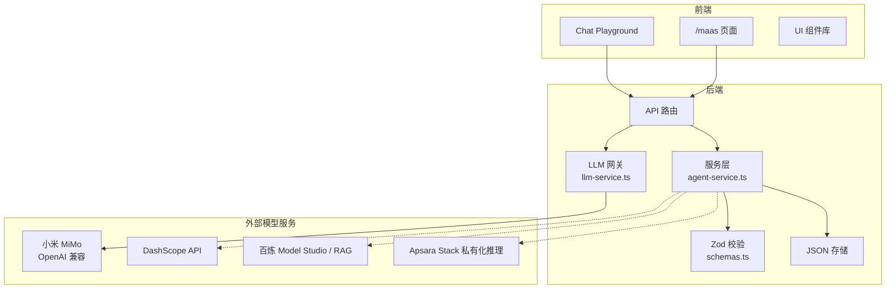
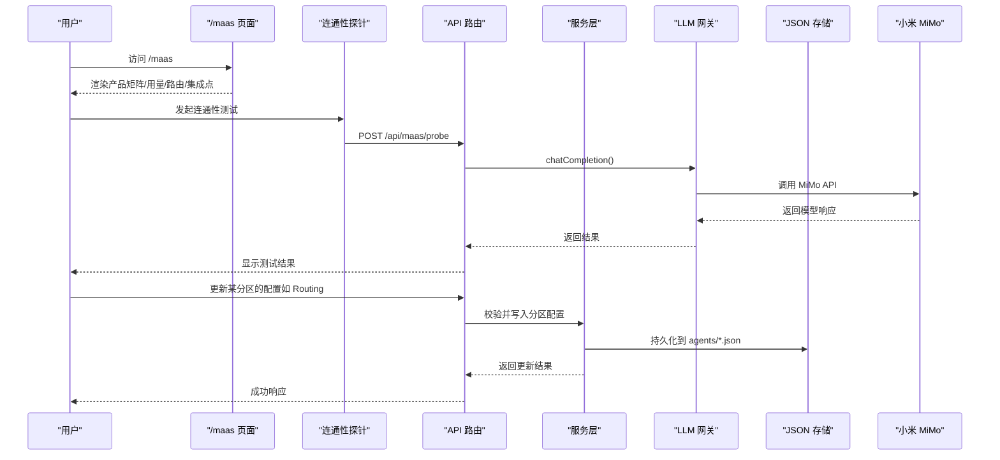
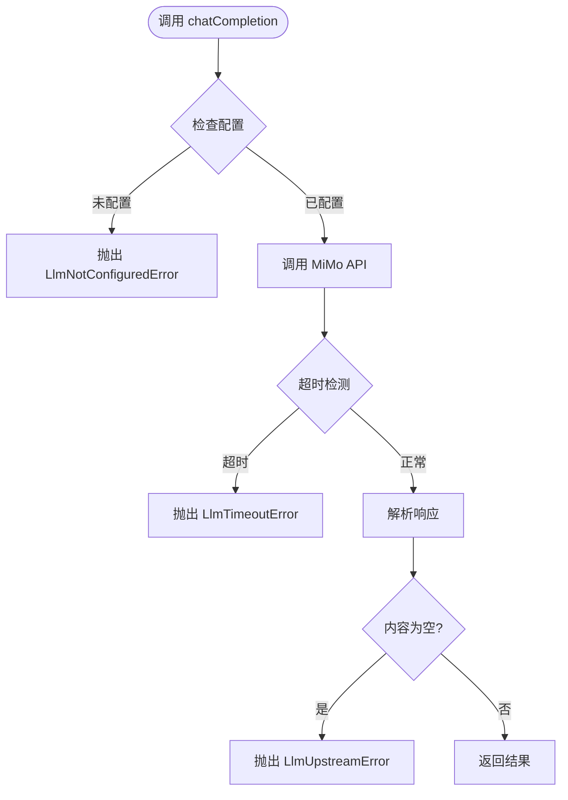
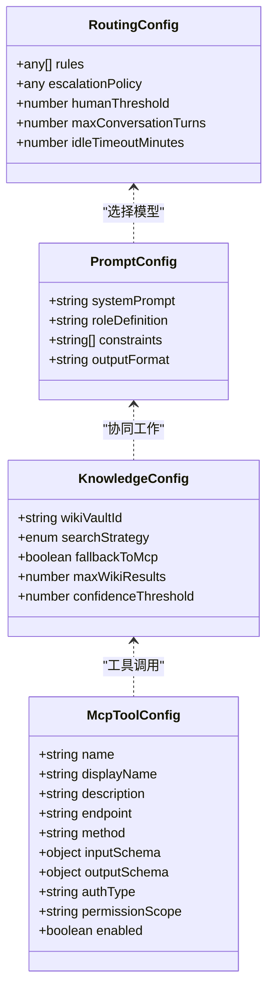
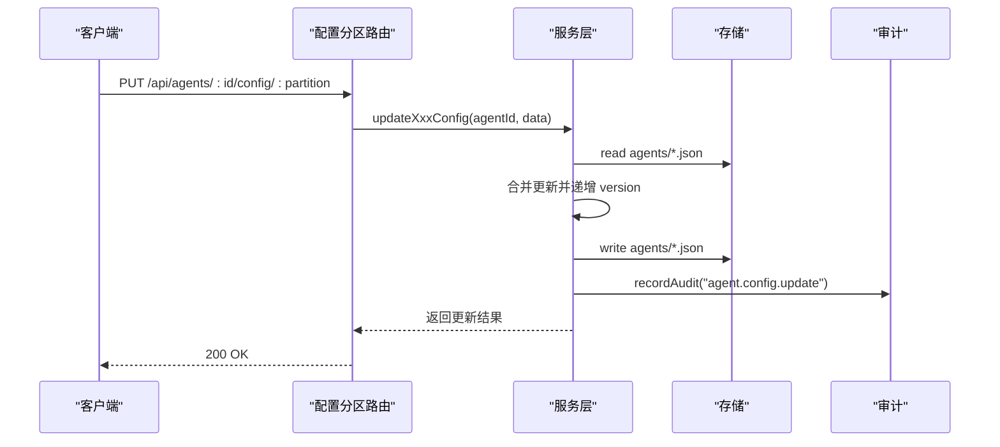
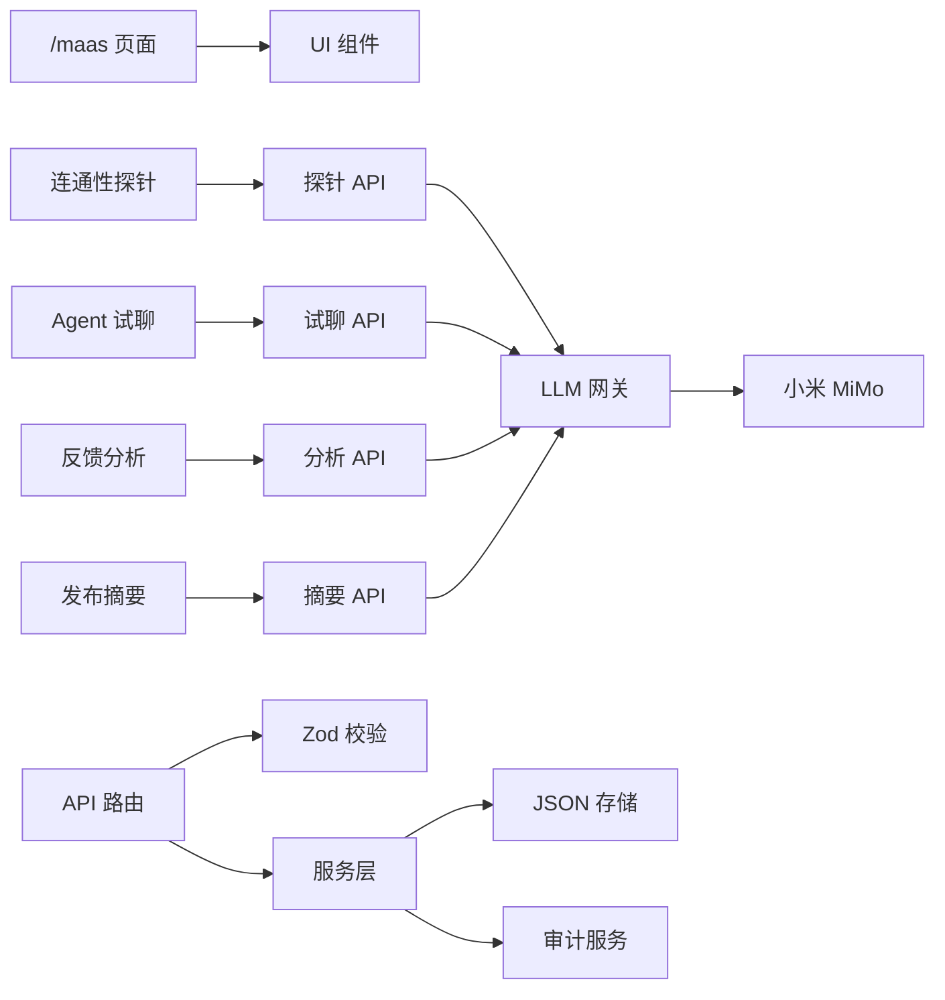

# MaaS 模型服务集成

<cite>
**本文引用的文件**
- [README.md](file://README.md)
- [MaaS 页面](file://apps/web/app/(dashboard)/maas/page.tsx)
- [连通性探针组件](file://apps/web/app/(dashboard)/maas/connectivity-probe.tsx)
- [LLM 网关服务](file://apps/web/lib/services/llm-service.ts)
- [MaaS 探针 API](file://apps/web/app/api/maas/probe/route.ts)
- [Agent 试聊 API](file://apps/web/app/api/agents/[id]/chat/route.ts)
- [反馈归因分析 API](file://apps/web/app/api/feedback/[id]/insight/route.ts)
- [发布摘要 API](file://apps/web/app/api/releases/[id]/summary/route.ts)
- [Agent 页面（含 Playground）](file://apps/web/app/(dashboard)/agents/[id]/page.tsx)
- [ECS 助手种子数据](file://apps/web/data/agents/ecs-assistant.json)
- [RDS 助手种子数据](file://apps/web/data/agents/rds-assistant.json)
- [Agent 类型定义](file://packages/shared/src/types/agent.ts)
- [API 校验 Schema](file://apps/web/lib/schemas.ts)
- [Agent 服务层](file://apps/web/lib/services/agent-service.ts)
- [配置分区路由](file://apps/web/app/api/agents/[id]/config/[partition]/route.ts)
</cite>

## 更新摘要
**变更内容**
- 新增小米 MiMo LLM 网关服务，提供生产级 AI 能力
- 实现真实连通性测试功能，替代原有 mock 实现
- 新增 Agent 试聊 Playground，支持实时模型调用
- 扩展反馈归因分析和发布摘要的 LLM 集成
- 完善错误处理和超时控制机制

## 目录
1. [简介](#简介)
2. [项目结构](#项目结构)
3. [核心组件](#核心组件)
4. [架构总览](#架构总览)
5. [详细组件分析](#详细组件分析)
6. [依赖关系分析](#依赖关系分析)
7. [性能与可观测性](#性能与可观测性)
8. [故障排查指南](#故障排查指南)
9. [结论](#结论)
10. [附录](#附录)

## 简介
本仓库为"Agent 改进平台"，现已完成从 mock 到生产级的重大升级。通过集成小米 MiMo 服务，平台现在具备真实的 LLM 能力，包括聊天游乐场、连通性测试和实际模型调用。MaaS（Model-as-a-Service）集成在 `/maas` 页面中展示公共云（百炼 Model Studio、DashScope API、Qwen 系列、text-embedding-v3 + 百炼 RAG）与专有云（Apsara Stack 私有化推理、PAI-EAS、私有向量检索）双形态的对接思路与策略。

## 项目结构
- 前端：Next.js App Router，包含工作台页面、API 路由、共享 UI 组件。
- 业务逻辑：lib/services 下的服务层封装 Agent、Release、Feedback、Skill、Wiki 等能力；lib/schemas 提供 Zod 校验；lib/diff 提供 JSON diff。
- 数据：当前使用 apps/web/data 下的 JSON 文件作为种子数据，后续将迁移至 Prisma + PostgreSQL。
- **新增** LLM 网关：通过小米 MiMo 服务提供真实的 AI 能力，支持 OpenAI 兼容协议。
- MaaS 集成点：通过四分区配置（Prompt/Knowledge/Tools/Routing）与模型服务对接，现已支持真实调用。

**图表来源**
- [MaaS 页面:1-111](file://apps/web/app/(dashboard)/maas/page.tsx#L1-L111)
- [LLM 网关服务:1-135](file://apps/web/lib/services/llm-service.ts#L1-L135)
- [Agent 服务层:1-209](file://apps/web/lib/services/agent-service.ts#L1-L209)
- [API 校验 Schema:1-275](file://apps/web/lib/schemas.ts#L1-L275)

**章节来源**
- [README.md:20-66](file://README.md#L20-L66)

## 核心组件
- **新增** LLM 网关服务：统一接入小米 MiMo 服务，提供 OpenAI 兼容的聊天完成接口。
- **新增** 连通性探针：实时测试 MiMo 服务连通性，返回模型信息、时延和 token 使用情况。
- **新增** Agent 试聊 Playground：基于 Agent 的 Prompt 配置进行真实对话测试。
- MaaS 展示页：集中展示产品矩阵、用量指标、路由策略与四分区集成点。
- 四分区配置：Prompt、Knowledge、Tools、Routing，分别对应模型人设约束、知识库检索、工具调用与模型路由策略。
- 服务层：统一读写 Agent 及其分区配置，记录变更与审计日志。
- 校验层：所有 API 入参通过 Zod schema 校验，保证数据结构安全。

**章节来源**
- [LLM 网关服务:1-135](file://apps/web/lib/services/llm-service.ts#L1-L135)
- [连通性探针组件:1-106](file://apps/web/app/(dashboard)/maas/connectivity-probe.tsx#L1-L106)
- [Agent 页面:509-607](file://apps/web/app/(dashboard)/agents/[id]/page.tsx#L509-L607)
- [MaaS 页面:1-111](file://apps/web/app/(dashboard)/maas/page.tsx#L1-L111)
- [Agent 类型定义:1-61](file://packages/shared/src/types/agent.ts#L1-L61)
- [API 校验 Schema:1-275](file://apps/web/lib/schemas.ts#L1-L275)
- [Agent 服务层:1-209](file://apps/web/lib/services/agent-service.ts#L1-L209)

## 架构总览
MaaS 集成的核心思想是"模型引擎由 MaaS 提供，agent-up 负责 Agent 的配置、评估、发布与回滚生命周期"。现已从 mock 阶段升级到生产级，通过小米 MiMo 服务提供真实的 LLM 能力，并在四分区中明确接入点。

**图表来源**
- [MaaS 页面:1-111](file://apps/web/app/(dashboard)/maas/page.tsx#L1-L111)
- [连通性探针组件:1-106](file://apps/web/app/(dashboard)/maas/connectivity-probe.tsx#L1-L106)
- [MaaS 探针 API:1-46](file://apps/web/app/api/maas/probe/route.ts#L1-L46)
- [LLM 网关服务:67-135](file://apps/web/lib/services/llm-service.ts#L67-L135)
- [Agent 服务层:137-169](file://apps/web/lib/services/agent-service.ts#L137-L169)
- [配置分区路由:1-200](file://apps/web/app/api/agents/[id]/config/[partition]/route.ts#L1-L200)

## 详细组件分析

### LLM 网关服务（新增）
**新增** 小米 MiMo 集成，提供生产级 LLM 能力：
- 环境变量配置：MIMO_API_KEY、MIMO_BASE_URL、MIMO_MODEL
- 默认端点：https://token-plan-cn.xiaomimimo.com/v1
- 默认模型：mimo-v2.5-pro
- 超时控制：120秒（推理模型响应偏慢）
- Token 限制：max_completion_tokens 默认 2048

**图表来源**
- [LLM 网关服务:67-135](file://apps/web/lib/services/llm-service.ts#L67-L135)

**章节来源**
- [LLM 网关服务:1-135](file://apps/web/lib/services/llm-service.ts#L1-L135)

### 连通性探针（新增）
**新增** 真实连通性测试功能：
- GET /api/maas/probe：返回配置状态（不发送真实请求）
- POST /api/maas/probe：真实调用 MiMo 验证连通性
- 前端组件显示 LIVE 标识和实时状态
- 支持错误处理和降级提示

**章节来源**
- [连通性探针组件:1-106](file://apps/web/app/(dashboard)/maas/connectivity-probe.tsx#L1-L106)
- [MaaS 探针 API:1-46](file://apps/web/app/api/maas/probe/route.ts#L1-L46)

### Agent 试聊 Playground（新增）
**新增** 基于 Agent 配置的实时对话测试：
- 加载 Agent 的 Prompt 分区配置作为 system prompt
- 携带前端会话历史调用 MiMo
- 会话仅存前端内存，不落库
- 显示模型信息、时延和 token 使用情况

**章节来源**
- [Agent 页面:509-607](file://apps/web/app/(dashboard)/agents/[id]/page.tsx#L509-L607)
- [Agent 试聊 API:1-61](file://apps/web/app/api/agents/[id]/chat/route.ts#L1-L61)

### 反馈归因分析（新增）
**新增** LLM 驱动的反馈分析：
- 读取反馈详情并调用 MiMo 生成归因分析
- 输出改进建议，指向具体的配置分区
- 支持四分区语境（Prompt/Knowledge/Tools/Routing）
- 无状态调用，不落库

**章节来源**
- [反馈归因分析 API:1-59](file://apps/web/app/api/feedback/[id]/insight/route.ts#L1-L59)

### 发布摘要（新增）
**新增** LLM 驱动的变更摘要：
- 读取 Release 的 configSnapshot 与 baseline 对比
- 让 MiMo 总结变更影响面与风险点
- 辅助审批决策
- 支持四分区变更详情展示

**章节来源**
- [发布摘要 API:1-91](file://apps/web/app/api/releases/[id]/summary/route.ts#L1-L91)

### MaaS 页面更新
**更新** 页面标题和描述，反映新的生产级能力：
- 移除纯 mock 标识，增加 LIVE 标识
- 强调顶部连通性测试为真实调用（MiMo）
- 保持产品矩阵和路由策略的演示性质

**章节来源**
- [MaaS 页面:1-111](file://apps/web/app/(dashboard)/maas/page.tsx#L1-L111)

### 四分区配置与校验
- Prompt：systemPrompt、roleDefinition、constraints、outputFormat。
- Knowledge：wikiVaultId、searchStrategy、fallbackToMcp、maxWikiResults、confidenceThreshold。
- Tools：mcpTools、wikiQueryTools、并发/超时/重试参数。
- Routing：rules、escalationPolicy、humanThreshold、会话轮次与时限。

**图表来源**
- [Agent 类型定义:18-61](file://packages/shared/src/types/agent.ts#L18-L61)
- [API 校验 Schema:23-52](file://apps/web/lib/schemas.ts#L23-L52)

**章节来源**
- [Agent 类型定义:1-61](file://packages/shared/src/types/agent.ts#L1-L61)
- [API 校验 Schema:23-275](file://apps/web/lib/schemas.ts#L23-L275)

### 服务层与配置更新流程
- 读取 Agent 与分区配置。
- 校验输入（Zod）。
- 合并更新并递增版本。
- 记录变更与审计日志。

**图表来源**
- [Agent 服务层:129-169](file://apps/web/lib/services/agent-service.ts#L129-L169)
- [Agent 服务层:176-208](file://apps/web/lib/services/agent-service.ts#L176-L208)
- [配置分区路由:1-200](file://apps/web/app/api/agents/[id]/config/[partition]/route.ts#L1-L200)

**章节来源**
- [Agent 服务层:1-209](file://apps/web/lib/services/agent-service.ts#L1-L209)
- [配置分区路由:1-200](file://apps/web/app/api/agents/[id]/config/[partition]/route.ts#L1-L200)

### 种子数据中的 MaaS 集成点
- ECS 助手：
  - Prompt：systemPrompt 追加"运行环境（MOCK）"段，说明主/降级/分类模型与端点口径。
  - Tools：登记 `bailian_kb_retrieval`、`dashscope_text_embedding`、`bailian_rag_fallback`。
  - Knowledge：searchStrategy 为 HYBRID，支持混合检索。
- RDS 助手：
  - Prompt：systemPrompt 同样包含"运行环境（MOCK）"段。
  - Tools：登记 `bailian_kb_retrieval`、`dashscope_text_embedding`。
  - Knowledge：searchStrategy 为 WIKI_FIRST。

**章节来源**
- [ECS 助手种子数据:10-15](file://apps/web/data/agents/ecs-assistant.json#L10-L15)
- [ECS 助手种子数据:23-85](file://apps/web/data/agents/ecs-assistant.json#L23-L85)
- [RDS 助手种子数据:10-15](file://apps/web/data/agents/rds-assistant.json#L10-L15)
- [RDS 助手种子数据:23-54](file://apps/web/data/agents/rds-assistant.json#L23-L54)

## 依赖关系分析
- 页面依赖 UI 组件与 Mermaid 渲染器。
- API 路由依赖服务层与校验 schema。
- 服务层依赖存储与审计服务。
- **新增** LLM 网关依赖小米 MiMo 服务。
- 种子数据为演示用途，不包含真实模型调用。

**图表来源**
- [MaaS 页面:9-16](file://apps/web/app/(dashboard)/maas/page.tsx#L9-L16)
- [连通性探针组件:1-106](file://apps/web/app/(dashboard)/maas/connectivity-probe.tsx#L1-L106)
- [Agent 页面:509-607](file://apps/web/app/(dashboard)/agents/[id]/page.tsx#L509-L607)
- [LLM 网关服务:1-135](file://apps/web/lib/services/llm-service.ts#L1-L135)
- [API 校验 Schema:1-275](file://apps/web/lib/schemas.ts#L1-L275)
- [Agent 服务层:1-209](file://apps/web/lib/services/agent-service.ts#L1-L209)

**章节来源**
- [README.md:169-189](file://README.md#L169-L189)

## 性能与可观测性
- 配置更新路径短且幂等，适合高频迭代；建议在生产接入后增加缓存与限流。
- 审计日志覆盖写操作，便于追踪配置变更与回滚依据。
- **新增** LLM 调用可观测性：
  - 超时控制：默认 120 秒，避免长时间阻塞
  - Token 使用统计：promptTokens、completionTokens、totalTokens
  - 延迟测量：latencyMs 字段跟踪响应时间
  - 错误分类：区分配置错误、上游错误、超时错误
- 未来接入真实模型服务时，需关注：
  - 并发与超时控制（toolsConfig 已暴露相关字段）。
  - 错误处理与重试策略（retryCount、timeoutMs）。
  - 可观测性：trace 链路（检索命中、工具调用、模型回答）回流为反馈证据。

## 故障排查指南
- 配置更新失败：检查 Zod 校验是否通过（schemas.ts），确认分区字段是否符合预期。
- 找不到 Agent：确认 ID 是否存在于 agents/*.json，或是否被归档。
- 审计日志缺失：确认 recordAudit 是否被调用，以及 actor 上下文是否正确解析。
- **新增** LLM 调用问题：
  - 配置错误：检查 MIMO_API_KEY 环境变量是否正确设置
  - 连接失败：验证网络连通性和 MiMo 服务状态
  - 超时错误：调整 timeoutMs 参数或检查网络状况
  - 空响应：增加 max_completion_tokens 值，避免推理 tokens 耗尽
  - 鉴权失败：确认 api-key 格式和权限范围
- **新增** 连通性测试失败：检查 .env 文件配置和网络代理设置

**章节来源**
- [Agent 服务层:94-117](file://apps/web/lib/services/agent-service.ts#L94-L117)
- [Agent 服务层:129-169](file://apps/web/lib/services/agent-service.ts#L129-L169)
- [Agent 服务层:176-208](file://apps/web/lib/services/agent-service.ts#L176-L208)
- [LLM 网关服务:29-48](file://apps/web/lib/services/llm-service.ts#L29-L48)

## 结论
已完成从 mock 到生产级的重大升级，通过集成小米 MiMo 服务，平台现在具备完整的 LLM 能力。连通性探针、Agent 试聊 Playground、反馈归因分析和发布摘要等功能都已实现真实调用。下一阶段将继续完善其他模型服务的集成，并将 L1 trace 回流为反馈证据，真正闭合"复盘有据 → 归因有理 → 加强有验"的闭环。

## 附录
- 快速开始与常用命令参考 README。
- **新增** LLM 环境变量配置：
  - MIMO_API_KEY：小米 MiMo API 密钥
  - MIMO_BASE_URL：自定义端点地址（可选）
  - MIMO_MODEL：指定模型名称（可选）
- 环境变量按需配置（数据库、认证、对象存储、Wiki 仓库路径）。
- 测试覆盖率高，建议在新增功能时补充单元测试与 API 集成测试。

**章节来源**
- [README.md:68-102](file://README.md#L68-L102)
- [README.md:225-240](file://README.md#L225-L240)
- [LLM 网关服务:50-65](file://apps/web/lib/services/llm-service.ts#L50-L65)