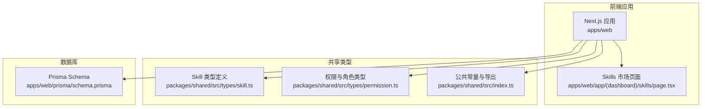
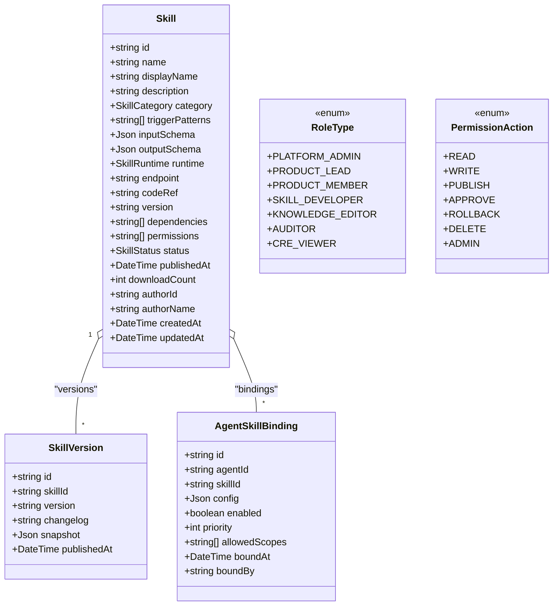
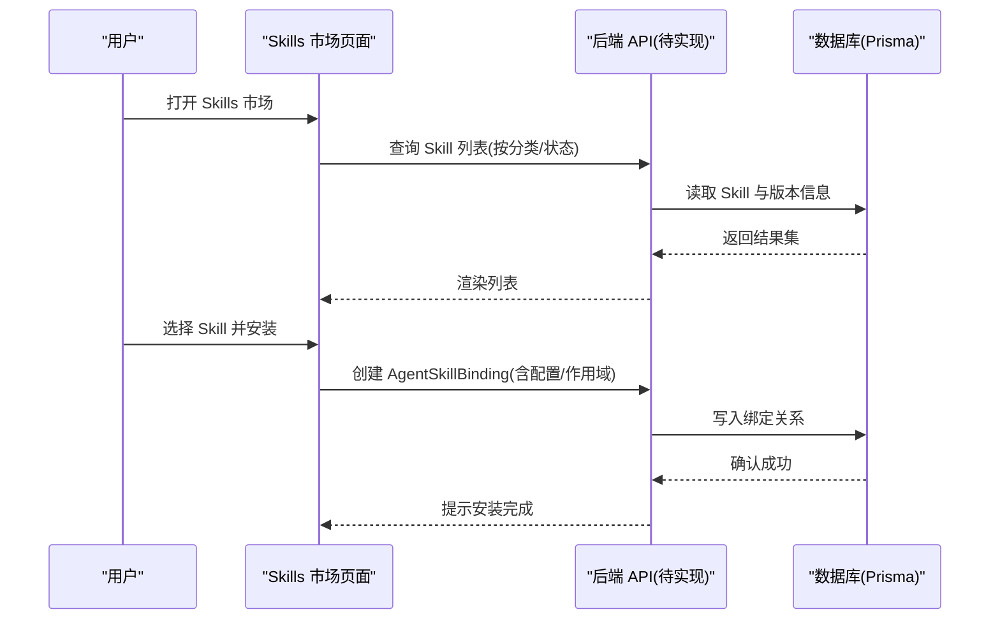
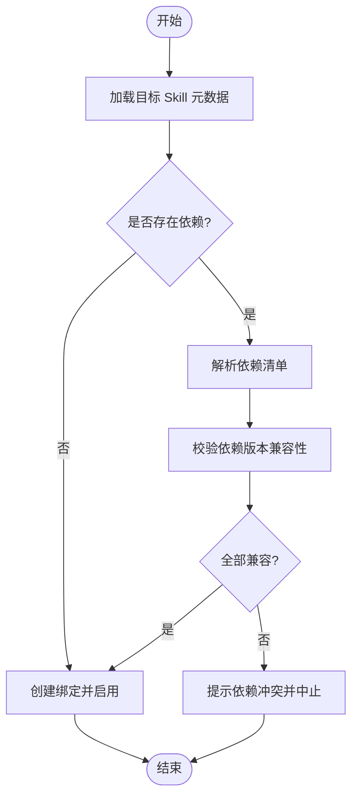
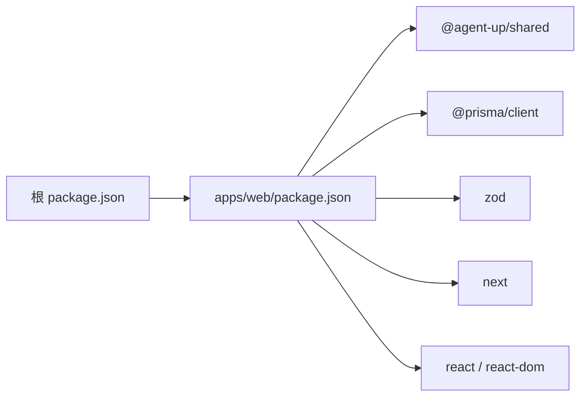

# Skills 市场

<cite>
**本文引用的文件**   
- [README.md](file://README.md)
- [apps/web/app/(dashboard)/skills/page.tsx](file://apps/web/app/(dashboard)/skills/page.tsx)
- [apps/web/prisma/schema.prisma](file://apps/web/prisma/schema.prisma)
- [packages/shared/src/types/skill.ts](file://packages/shared/src/types/skill.ts)
- [packages/shared/src/index.ts](file://packages/shared/src/index.ts)
- [packages/shared/src/types/permission.ts](file://packages/shared/src/types/permission.ts)
- [package.json](file://package.json)
- [apps/web/package.json](file://apps/web/package.json)
</cite>

## 目录
1. [简介](#简介)
2. [项目结构](#项目结构)
3. [核心组件](#核心组件)
4. [架构总览](#架构总览)
5. [详细组件分析](#详细组件分析)
6. [依赖关系分析](#依赖关系分析)
7. [性能与可观测性](#性能与可观测性)
8. [故障排查指南](#故障排查指南)
9. [结论](#结论)
10. [附录](#附录)

## 简介
本仓库为 Agent 改进平台的前端应用与共享类型定义，包含“Skills 市场”的页面骨架、数据库模型与运行时类型。当前 Skills 市场页面处于占位状态，但数据模型已完整定义了 Skill 插件化技能系统的核心实体、版本管理、绑定关系与权限控制等能力，为后续实现完整的发现、安装、管理与运行提供基础。

## 项目结构
- 前端应用位于 apps/web，使用 Next.js 构建，包含仪表盘路由与 Skills 市场页面。
- 共享类型位于 packages/shared，统一导出 Skill 相关类型、权限角色与常量。
- 数据库模型位于 apps/web/prisma/schema.prisma，定义 Skill、SkillVersion、AgentSkillBinding 等核心表结构。
- 根 package.json 与 apps/web/package.json 提供脚本与依赖声明。

图表来源
- [apps/web/app/(dashboard)/skills/page.tsx:1-29](file://apps/web/app/(dashboard)/skills/page.tsx#L1-L29)
- [packages/shared/src/types/skill.ts:1-48](file://packages/shared/src/types/skill.ts#L1-L48)
- [packages/shared/src/types/permission.ts:1-36](file://packages/shared/src/types/permission.ts#L1-L36)
- [packages/shared/src/index.ts:1-14](file://packages/shared/src/index.ts#L1-L14)
- [apps/web/prisma/schema.prisma:360-440](file://apps/web/prisma/schema.prisma#L360-L440)

章节来源
- [README.md:1-3](file://README.md#L1-L3)
- [apps/web/app/(dashboard)/skills/page.tsx:1-29](file://apps/web/app/(dashboard)/skills/page.tsx#L1-L29)
- [apps/web/prisma/schema.prisma:360-440](file://apps/web/prisma/schema.prisma#L360-L440)
- [packages/shared/src/types/skill.ts:1-48](file://packages/shared/src/types/skill.ts#L1-L48)
- [packages/shared/src/index.ts:1-14](file://packages/shared/src/index.ts#L1-L14)
- [packages/shared/src/types/permission.ts:1-36](file://packages/shared/src/types/permission.ts#L1-L36)
- [package.json:1-22](file://package.json#L1-L22)
- [apps/web/package.json:1-38](file://apps/web/package.json#L1-L38)

## 核心组件
- 技能元数据与运行时类型：通过共享类型与 Prisma 模型共同定义，包括名称、展示名、描述、分类、触发模式、输入输出 Schema、运行时类型、端点或代码引用、版本、依赖、权限、状态、作者信息、下载计数等。
- 版本管理：每个 Skill 拥有多个版本快照，记录变更日志与发布快照。
- 绑定关系：Agent 与 Skill 的多对多绑定，支持配置、启用开关、优先级与作用域限制。
- 权限与角色：平台内置多种角色与动作，用于控制 Skill 的读写、发布、审批、回滚、删除与管理操作。

章节来源
- [packages/shared/src/types/skill.ts:1-48](file://packages/shared/src/types/skill.ts#L1-L48)
- [apps/web/prisma/schema.prisma:360-440](file://apps/web/prisma/schema.prisma#L360-L440)
- [packages/shared/src/types/permission.ts:1-36](file://packages/shared/src/types/permission.ts#L1-L36)

## 架构总览
从现有代码可见，系统采用“前端 + 共享类型 + 数据库模型”的分层组织方式。Skills 市场页面作为用户入口，未来将对接后端 API（未在当前仓库中实现），通过共享类型进行前后端契约校验，并使用 Prisma 模型持久化 Skill 及其版本、绑定与权限信息。

图表来源
- [apps/web/prisma/schema.prisma:360-440](file://apps/web/prisma/schema.prisma#L360-L440)
- [packages/shared/src/types/skill.ts:1-48](file://packages/shared/src/types/skill.ts#L1-L48)
- [packages/shared/src/types/permission.ts:1-36](file://packages/shared/src/types/permission.ts#L1-L36)

## 详细组件分析

### 四种 Skill 运行时类型
- HTTP：适用于通过 HTTP 接口暴露能力的技能，通常由 endpoint 字段指向外部服务地址。适合调用第三方 API 或内部微服务。
- FUNCTION：适用于直接执行本地函数逻辑的技能，codeRef 可能指向函数包或源码位置。适合轻量计算、数据处理与工具封装。
- MCP：适用于遵循 Model Context Protocol 的技能，便于在 AI 生态中进行上下文交互与工具编排。
- WORKFLOW：适用于组合多个步骤的工作流型技能，适合复杂业务流程编排与条件分支。

上述运行时类型在共享类型与数据库模型中均有明确枚举定义，确保前后端一致性与可扩展性。

章节来源
- [packages/shared/src/types/skill.ts:26-31](file://packages/shared/src/types/skill.ts#L26-L31)
- [apps/web/prisma/schema.prisma:397-402](file://apps/web/prisma/schema.prisma#L397-L402)

### Skill 发现、安装与管理流程
- 发现：Skills 市场页面提供分类筛选与列表展示入口，未来可结合后端 API 按分类、状态、作者等信息检索。
- 安装：通过 AgentSkillBinding 将 Skill 绑定到具体 Agent，并设置配置、优先级与作用域。
- 管理：维护 Skill 的状态（草稿、已发布、弃用、归档）、版本快照与下载计数；支持启用/禁用与权限控制。

图表来源
- [apps/web/app/(dashboard)/skills/page.tsx:1-29](file://apps/web/app/(dashboard)/skills/page.tsx#L1-L29)
- [apps/web/prisma/schema.prisma:424-440](file://apps/web/prisma/schema.prisma#L424-L440)

### 版本管理与依赖关系处理
- 版本管理：每个 Skill 对应多个 SkillVersion，记录版本号、变更日志与快照，保证可回溯与可回滚。
- 依赖关系：Skill 的 dependencies 字段声明其依赖的其他 Skill 名称集合，安装时需解析依赖树并进行一致性校验。
- 版本规则：共享常量提供语义化版本正则表达式，可用于校验与比较版本。

图表来源
- [apps/web/prisma/schema.prisma:360-422](file://apps/web/prisma/schema.prisma#L360-L422)
- [packages/shared/src/index.ts:13-14](file://packages/shared/src/index.ts#L13-L14)

### 配置选项与安全权限控制
- 配置：AgentSkillBinding.config 允许为每个绑定提供个性化配置项，适配不同环境或参数。
- 权限：RoleType 与 PermissionAction 定义平台角色与动作，配合 Skill.permissions 与 AgentSkillBinding.allowedScopes 实现细粒度访问控制。
- 审计：AuditLogEntry 与数据库 AuditLog 模型支持记录关键操作，便于追踪与合规。

章节来源
- [packages/shared/src/types/permission.ts:1-36](file://packages/shared/src/types/permission.ts#L1-L36)
- [apps/web/prisma/schema.prisma:424-440](file://apps/web/prisma/schema.prisma#L424-L440)
- [apps/web/prisma/schema.prisma:607-625](file://apps/web/prisma/schema.prisma#L607-L625)

### Skill 开发指南（基于现有模型的指导）
- 元数据设计：明确 name、displayName、description、category、triggerPatterns、inputSchema、outputSchema、runtime、endpoint/codeRef、dependencies、permissions 等字段。
- 版本发布：每次发布需创建新的 SkillVersion，记录 changelog 与 snapshot，保持向后兼容。
- 绑定与配置：在 Agent 上创建 AgentSkillBinding，设置 config、enabled、priority、allowedScopes。
- 权限与范围：根据业务需求配置 Skill.permissions 与 allowedScopes，避免越权访问。

章节来源
- [apps/web/prisma/schema.prisma:360-440](file://apps/web/prisma/schema.prisma#L360-L440)
- [packages/shared/src/types/skill.ts:1-48](file://packages/shared/src/types/skill.ts#L1-L48)

### 测试与调试工具使用方法
- 数据库可视化：使用 prisma studio 查看与编辑数据库内容，辅助验证 Skill、版本与绑定数据。
- 本地开发：通过 Next.js 启动前端，结合共享类型进行前后端契约校验。
- 建议实践：为每种运行时类型编写最小可用示例，覆盖正常路径与异常路径，确保输入输出 Schema 校验通过。

章节来源
- [apps/web/package.json:10-13](file://apps/web/package.json#L10-L13)

### 性能监控与错误处理机制
- 并发与超时：ToolsConfig 中的 maxConcurrentCalls、timeoutMs、retryCount 可作为 Skill 调用的通用性能策略参考。
- 错误记录：反馈模型与审计日志可用于收集与追踪错误，便于定位问题与优化。
- 建议实践：在 Skill 调用链路中加入指标采集与错误上报，结合数据库审计进行闭环治理。

章节来源
- [apps/web/prisma/schema.prisma:147-159](file://apps/web/prisma/schema.prisma#L147-L159)
- [apps/web/prisma/schema.prisma:220-292](file://apps/web/prisma/schema.prisma#L220-L292)
- [apps/web/prisma/schema.prisma:607-625](file://apps/web/prisma/schema.prisma#L607-L625)

### 社区贡献与审核流程说明
- 角色与动作：SKILL_DEVELOPER 负责开发与提交，PRODUCT_LEAD/AUDITOR 参与审批与发布，平台管理员具备全局管理能力。
- 发布流程：建议采用“草稿 -> 提交 -> 审批 -> 发布 -> 归档/弃用”的生命周期，结合 Release 与 AgentVersion 的发布机制进行管控。
- 审计与追溯：所有关键操作应记录审计日志，确保可追溯与合规。

章节来源
- [packages/shared/src/types/permission.ts:1-36](file://packages/shared/src/types/permission.ts#L1-L36)
- [apps/web/prisma/schema.prisma:298-326](file://apps/web/prisma/schema.prisma#L298-L326)
- [apps/web/prisma/schema.prisma:332-354](file://apps/web/prisma/schema.prisma#L332-L354)
- [apps/web/prisma/schema.prisma:607-625](file://apps/web/prisma/schema.prisma#L607-L625)

## 依赖关系分析
- 前端依赖 Next.js、React、Prisma Client、Zod 等库，用于构建界面、类型校验与数据库客户端。
- 共享包 @agent-up/shared 提供统一的类型与常量，确保前后端契约一致。
- 根工作区脚本通过 Turbo 协调多包任务，简化开发体验。

图表来源
- [package.json:1-22](file://package.json#L1-L22)
- [apps/web/package.json:1-38](file://apps/web/package.json#L1-L38)

章节来源
- [package.json:1-22](file://package.json#L1-L22)
- [apps/web/package.json:1-38](file://apps/web/package.json#L1-L38)

## 性能与可观测性
- 并发与超时：通过 ToolsConfig 的并发数、超时与重试策略，合理控制 Skill 调用资源消耗。
- 指标采集：建议在 Skill 调用链路上埋点，统计成功率、延迟分布与错误率。
- 错误归因：结合反馈与审计日志，建立问题定位与修复闭环。

[本节为通用指导，不直接分析具体文件]

## 故障排查指南
- 数据不一致：检查 Skill 与版本快照是否匹配，确认绑定关系是否正确创建。
- 权限不足：核对用户角色与动作授权，确认 allowedScopes 与 Skill.permissions 是否满足。
- 依赖冲突：解析依赖树并校验版本兼容性，必要时降级或升级依赖版本。
- 调用失败：查看 ToolsConfig 的超时与重试配置，结合审计日志定位问题。

章节来源
- [apps/web/prisma/schema.prisma:360-440](file://apps/web/prisma/schema.prisma#L360-L440)
- [apps/web/prisma/schema.prisma:147-159](file://apps/web/prisma/schema.prisma#L147-L159)
- [apps/web/prisma/schema.prisma:607-625](file://apps/web/prisma/schema.prisma#L607-L625)

## 结论
当前仓库为 Skills 市场提供了清晰的数据模型与类型契约，奠定了插件化技能系统的基础。下一步应完善后端 API、实现市场页面的实际功能，并围绕运行时类型、版本管理、依赖解析、权限控制与可观测性进行系统化建设，以支撑更丰富的技能生态与稳定的生产运行。

[本节为总结，不直接分析具体文件]

## 附录
- 术语
  - Skill：插件化技能，封装特定能力供 Agent 调用。
  - 运行时：Skill 的执行环境，包括 HTTP、FUNCTION、MCP、WORKFLOW。
  - 绑定：Agent 与 Skill 的关联关系，支持配置与权限控制。
  - 版本：Skill 的发布快照，支持变更日志与回滚。
- 常用脚本
  - 生成 Prisma 客户端：pnpm db:generate
  - 推送数据库变更：pnpm db:push
  - 本地迁移：pnpm db:migrate
  - 启动前端：pnpm dev

章节来源
- [apps/web/package.json:10-13](file://apps/web/package.json#L10-L13)
- [package.json:4-11](file://package.json#L4-L11)