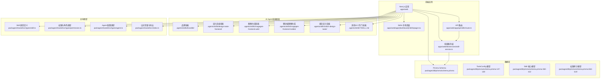
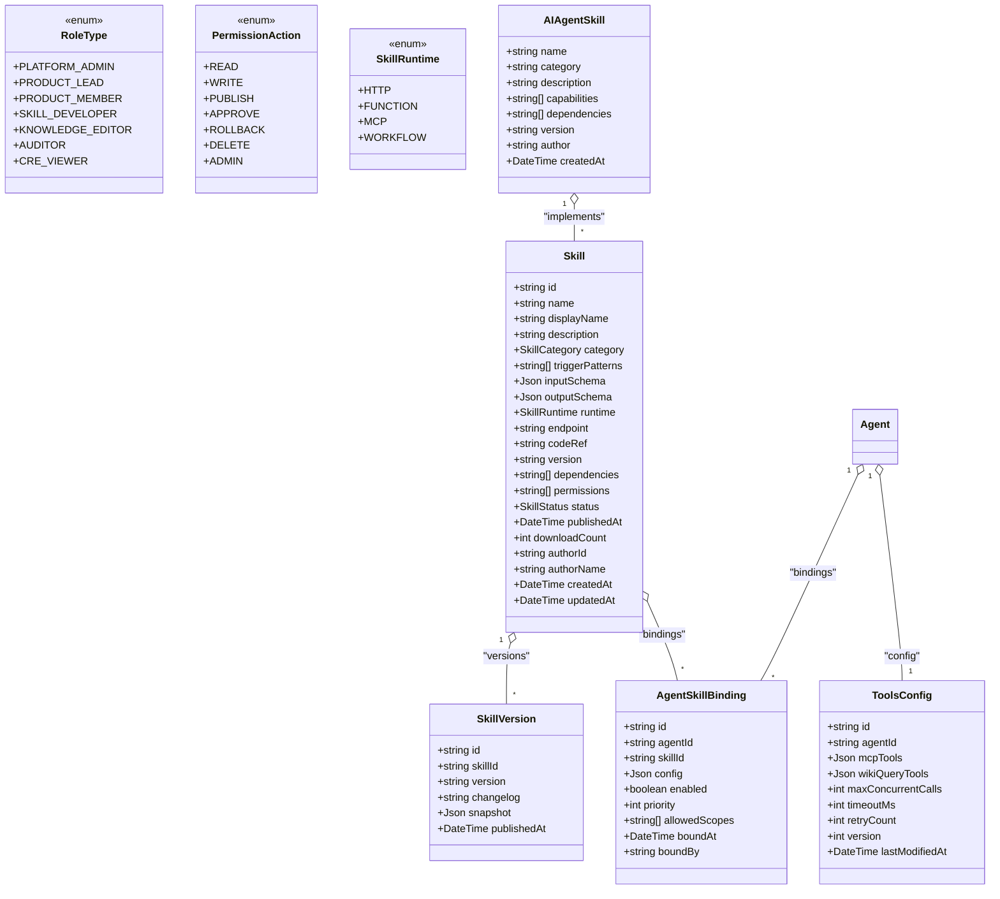
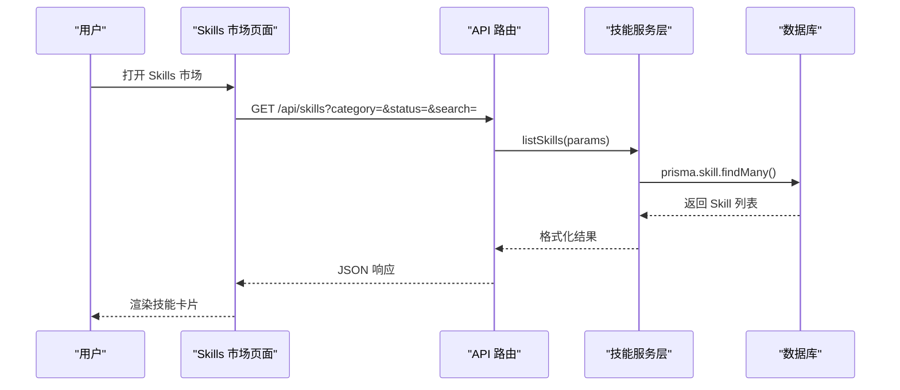
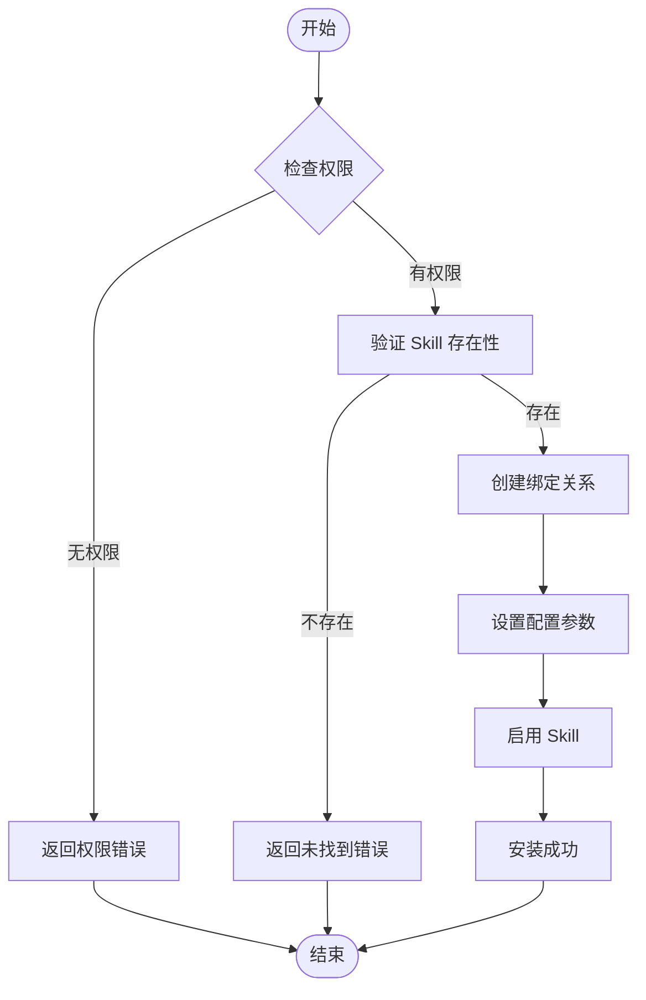
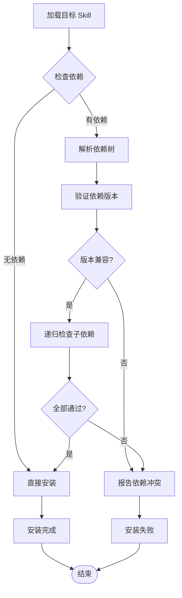
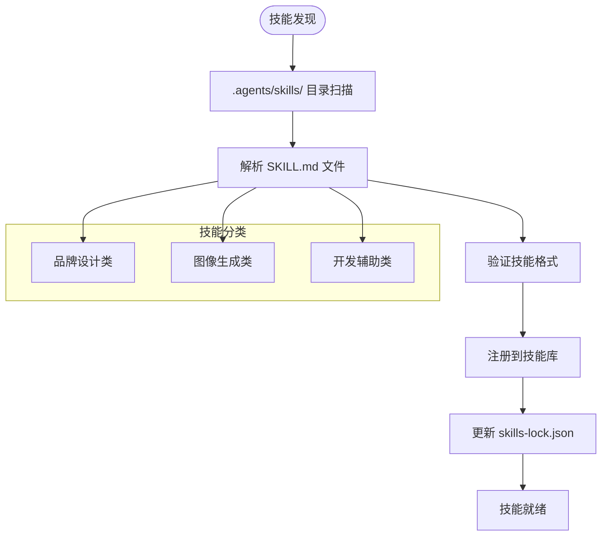
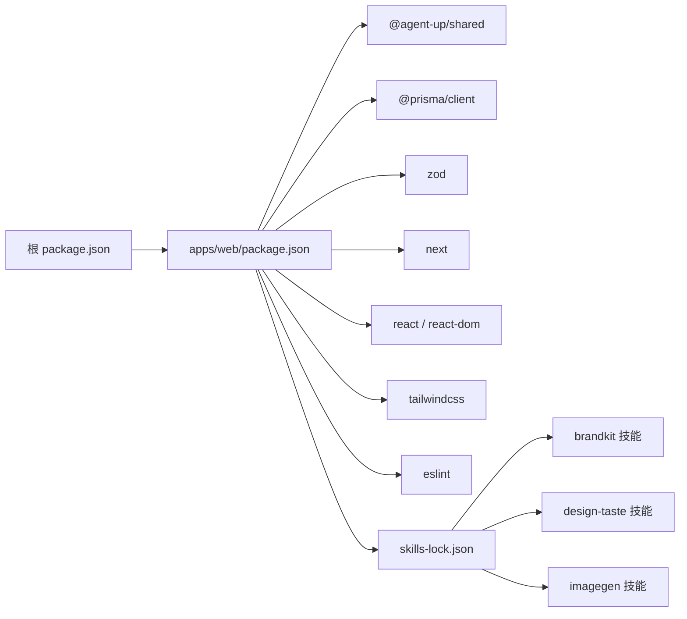

# Skills 市场

<cite>
**本文引用的文件**   
- [README.md](file://README.md)
- [apps/web/app/(dashboard)/skills/page.tsx](file://apps/web/app/(dashboard)/skills/page.tsx)
- [apps/web/app/api/skills/route.ts](file://apps/web/app/api/skills/route.ts)
- [apps/web/lib/services/skill-service.ts](file://apps/web/lib/services/skill-service.ts)
- [packages/db/prisma/schema.prisma](file://packages/db/prisma/schema.prisma)
- [packages/shared/src/types/skill.ts](file://packages/shared/src/types/skill.ts)
- [packages/shared/src/index.ts](file://packages/shared/src/index.ts)
- [packages/shared/src/types/permission.ts](file://packages/shared/src/types/permission.ts)
- [packages/shared/src/types/agent.ts](file://packages/shared/src/types/agent.ts)
- [apps/web/lib/services/agent-service.ts](file://apps/web/lib/services/agent-service.ts)
- [apps/web/lib/schemas.ts](file://apps/web/lib/schemas.ts)
- [package.json](file://package.json)
- [apps/web/package.json](file://apps/web/package.json)
- [.agents/skills/brandkit/SKILL.md](file://.agents/skills/brandkit/SKILL.md)
- [.agents/skills/design-taste-frontend/SKILL.md](file://.agents/skills/design-taste-frontend/SKILL.md)
- [.agents/skills/imagegen-frontend-web/SKILL.md](file://.agents/skills/imagegen-frontend-web/SKILL.md)
- [.agents/skills/imagegen-frontend-mobile/SKILL.md](file://.agents/skills/imagegen-frontend-mobile/SKILL.md)
- [.agents/skills/stitch-design-taste/SKILL.md](file://.agents/skills/stitch-design-taste/SKILL.md)
- [.agents/skills/stitch-design-taste/DESIGN.md](file://.agents/skills/stitch-design-taste/DESIGN.md)
- [skills-lock.json](file://skills-lock.json)
</cite>

## 更新摘要
**变更内容**   
- 新增完整的AI Agent技能框架，包含13个专门技能定义
- 新增imagegen、design-taste、brandkit等前端生成、图像处理和设计任务技能
- 完善技能发现、安装和管理流程
- 增强版本管理和依赖关系处理机制
- 添加性能监控和错误处理配置

## 目录
1. [简介](#简介)
2. [项目结构](#项目结构)
3. [核心组件](#核心组件)
4. [架构总览](#架构总览)
5. [详细组件分析](#详细组件分析)
6. [AI Agent技能框架](#ai-agent技能框架)
7. [依赖关系分析](#依赖关系分析)
8. [性能与可观测性](#性能与可观测性)
9. [故障排查指南](#故障排查指南)
10. [结论](#结论)
11. [附录](#附录)

## 简介
本仓库实现了完整的 Agent 改进平台前端应用与共享类型定义，包含"Skills 市场"的完整功能实现。系统采用插件化技能架构，支持四种运行时环境（HTTP、FUNCTION、MCP、WORKFLOW），提供依赖管理、权限控制、版本管理等企业级特性。当前 Skills 市场页面已实现完整的发现、创建、管理和绑定功能，为 Agent 提供可扩展的能力生态系统。

**最新更新**：新增了完整的AI Agent技能框架，包含13个专门技能定义，涵盖前端生成、图像处理和设计任务等多个领域，大幅扩展了系统的功能范围和应用场景。

## 项目结构
- 前端应用位于 apps/web，使用 Next.js 构建，包含完整的仪表盘路由与 Skills 市场页面
- 共享类型位于 packages/shared，统一导出 Skill 相关类型、权限角色与常量
- 数据库模型位于 packages/db/prisma/schema.prisma，定义 Skill、SkillVersion、AgentSkillBinding 等核心表结构
- API 服务层位于 apps/web/lib/services，提供技能管理的业务逻辑
- AI Agent技能定义位于 .agents/skills/ 目录，包含13个专门技能
- 根 package.json 与 apps/web/package.json 提供脚本与依赖声明



**图表来源**
- [apps/web/app/(dashboard)/skills/page.tsx:1-228](file://apps/web/app/(dashboard)/skills/page.tsx#L1-L228)
- [apps/web/app/api/skills/route.ts:1-40](file://apps/web/app/api/skills/route.ts#L1-L40)
- [apps/web/lib/services/skill-service.ts:1-151](file://apps/web/lib/services/skill-service.ts#L1-L151)
- [.agents/skills/brandkit/SKILL.md:1-100](file://.agents/skills/brandkit/SKILL.md#L1-L100)
- [.agents/skills/design-taste-frontend/SKILL.md:1-100](file://.agents/skills/design-taste-frontend/SKILL.md#L1-L100)
- [.agents/skills/imagegen-frontend-web/SKILL.md:1-100](file://.agents/skills/imagegen-frontend-web/SKILL.md#L1-L100)
- [packages/shared/src/types/skill.ts:1-48](file://packages/shared/src/types/skill.ts#L1-L48)
- [packages/db/prisma/schema.prisma:147-159](file://packages/db/prisma/schema.prisma#L147-L159)
- [packages/db/prisma/schema.prisma:360-422](file://packages/db/prisma/schema.prisma#L360-L422)

**章节来源**
- [README.md:1-3](file://README.md#L1-L3)
- [apps/web/app/(dashboard)/skills/page.tsx:1-228](file://apps/web/app/(dashboard)/skills/page.tsx#L1-L228)
- [packages/db/prisma/schema.prisma:360-422](file://packages/db/prisma/schema.prisma#L360-L422)
- [packages/shared/src/types/skill.ts:1-48](file://packages/shared/src/types/skill.ts#L1-L48)
- [packages/shared/src/index.ts:1-14](file://packages/shared/src/index.ts#L1-L14)
- [packages/shared/src/types/permission.ts:1-36](file://packages/shared/src/types/permission.ts#L1-L36)
- [package.json:1-22](file://package.json#L1-L22)
- [apps/web/package.json:1-38](file://apps/web/package.json#L1-L38)

## 核心组件
- **技能元数据与运行时类型**：通过共享类型与 Prisma 模型共同定义，包括名称、展示名、描述、分类、触发模式、输入输出 Schema、运行时类型、端点或代码引用、版本、依赖、权限、状态、作者信息、下载计数等
- **四种运行时环境**：HTTP（外部 API 调用）、FUNCTION（本地函数执行）、MCP（Model Context Protocol）、WORKFLOW（工作流编排）
- **版本管理**：每个 Skill 拥有多个版本快照，记录变更日志与发布快照，支持回滚机制
- **绑定关系**：Agent 与 Skill 的多对多绑定，支持配置、启用开关、优先级与作用域限制
- **权限与角色**：平台内置多种角色与动作，用于控制 Skill 的读写、发布、审批、回滚、删除与管理操作
- **性能监控**：ToolsConfig 提供并发数、超时、重试等性能策略配置
- **AI Agent技能框架**：新增13个专门技能，涵盖品牌管理、设计品味、图像生成、前端开发等领域

**章节来源**
- [packages/shared/src/types/skill.ts:1-48](file://packages/shared/src/types/skill.ts#L1-L48)
- [packages/db/prisma/schema.prisma:360-422](file://packages/db/prisma/schema.prisma#L360-L422)
- [packages/shared/src/types/permission.ts:1-36](file://packages/shared/src/types/permission.ts#L1-L36)
- [packages/shared/src/types/agent.ts:74-81](file://packages/shared/src/types/agent.ts#L74-L81)

## 架构总览
系统采用"前端 + API 服务 + 共享类型 + 数据库模型"的分层架构。Skills 市场页面作为用户入口，通过 API 路由与服务层交互，使用共享类型进行前后端契约校验，并使用 Prisma 模型持久化 Skill 及其版本、绑定与权限信息。



**图表来源**
- [packages/db/prisma/schema.prisma:360-422](file://packages/db/prisma/schema.prisma#L360-L422)
- [packages/db/prisma/schema.prisma:147-159](file://packages/db/prisma/schema.prisma#L147-L159)
- [packages/shared/src/types/skill.ts:1-48](file://packages/shared/src/types/skill.ts#L1-L48)
- [packages/shared/src/types/permission.ts:1-36](file://packages/shared/src/types/permission.ts#L1-L36)

## 详细组件分析

### 四种 Skill 运行时类型详解

#### HTTP 运行时
适用于通过 HTTP 接口暴露能力的技能，通常由 endpoint 字段指向外部服务地址。适合调用第三方 API 或内部微服务。

**特点**：
- 支持标准 RESTful API 调用
- 可配置请求头、认证信息
- 支持超时和重试机制
- 适合网络密集型任务

#### FUNCTION 运行时
适用于直接执行本地函数逻辑的技能，codeRef 可能指向函数包或源码位置。适合轻量计算、数据处理与工具封装。

**特点**：
- 高性能本地执行
- 支持复杂业务逻辑
- 可访问本地资源
- 适合 CPU 密集型任务

#### MCP 运行时
适用于遵循 Model Context Protocol 的技能，便于在 AI 生态中进行上下文交互与工具编排。

**特点**：
- 标准化协议支持
- 跨平台兼容性
- 丰富的工具生态
- 适合 AI 集成场景

#### WORKFLOW 运行时
适用于组合多个步骤的工作流型技能，适合复杂业务流程编排与条件分支。

**特点**：
- 多步骤流程编排
- 条件分支支持
- 错误处理机制
- 适合复杂业务场景

**章节来源**
- [packages/shared/src/types/skill.ts:26-31](file://packages/shared/src/types/skill.ts#L26-L31)
- [packages/db/prisma/schema.prisma:397-402](file://packages/db/prisma/schema.prisma#L397-L402)
- [apps/web/app/(dashboard)/skills/page.tsx:200-207](file://apps/web/app/(dashboard)/skills/page.tsx#L200-L207)

### Skill 发现、安装与管理流程

#### 发现流程
Skills 市场页面提供分类筛选与列表展示入口，支持按分类、状态、搜索关键词检索。



#### 安装流程
通过 AgentSkillBinding 将 Skill 绑定到具体 Agent，并设置配置、优先级与作用域。



#### 管理流程
维护 Skill 的状态（草稿、已发布、弃用、归档）、版本快照与下载计数；支持启用/禁用与权限控制。

**章节来源**
- [apps/web/app/(dashboard)/skills/page.tsx:47-58](file://apps/web/app/(dashboard)/skills/page.tsx#L47-L58)
- [apps/web/app/api/skills/route.ts:18-27](file://apps/web/app/api/skills/route.ts#L18-L27)
- [apps/web/lib/services/skill-service.ts:12-38](file://apps/web/lib/services/skill-service.ts#L12-L38)
- [apps/web/lib/services/skill-service.ts:112-135](file://apps/web/lib/services/skill-service.ts#L112-L135)

### 版本管理与依赖关系处理

#### 版本管理机制
每个 Skill 对应多个 SkillVersion，记录版本号、变更日志与快照，保证可回溯与可回滚。

**版本生命周期**：
- 草稿版本：开发中的版本
- 已发布版本：正式可用的版本
- 弃用版本：不再推荐使用的版本
- 归档版本：历史保留版本

#### 依赖关系解析
Skill 的 dependencies 字段声明其依赖的其他 Skill 名称集合，安装时需解析依赖树并进行一致性校验。



**章节来源**
- [packages/db/prisma/schema.prisma:360-422](file://packages/db/prisma/schema.prisma#L360-L422)
- [packages/shared/src/types/skill.ts:1-48](file://packages/shared/src/types/skill.ts#L1-L48)

### 配置选项与安全权限控制

#### 配置管理
AgentSkillBinding.config 允许为每个绑定提供个性化配置项，适配不同环境或参数。ToolsConfig 提供全局性能配置。

**配置层级**：
- 全局配置：ToolsConfig.maxConcurrentCalls、timeoutMs、retryCount
- 绑定配置：AgentSkillBinding.config
- 运行时配置：Skill.runtime 特定配置

#### 权限控制系统
RoleType 与 PermissionAction 定义平台角色与动作，配合 Skill.permissions 与 AgentSkillBinding.allowedScopes 实现细粒度访问控制。

**角色权限矩阵**：
- PLATFORM_ADMIN：全局管理员权限
- SKILL_DEVELOPER：技能开发与发布权限
- PRODUCT_LEAD：产品审核与发布权限
- AUDITOR：审计与合规权限

**章节来源**
- [packages/shared/src/types/permission.ts:1-36](file://packages/shared/src/types/permission.ts#L1-L36)
- [packages/db/prisma/schema.prisma:424-440](file://packages/db/prisma/schema.prisma#L424-L440)
- [packages/db/prisma/schema.prisma:147-159](file://packages/db/prisma/schema.prisma#L147-L159)
- [packages/shared/src/types/agent.ts:74-81](file://packages/shared/src/types/agent.ts#L74-L81)

### Skill 开发指南

#### 元数据设计
明确 name、displayName、description、category、triggerPatterns、inputSchema、outputSchema、runtime、endpoint/codeRef、dependencies、permissions 等字段。

#### 运行时选择指南
- **HTTP**：适合调用外部 API、微服务
- **FUNCTION**：适合本地计算、数据处理
- **MCP**：适合 AI 工具集成
- **WORKFLOW**：适合复杂业务流程

#### 版本发布流程
每次发布需创建新的 SkillVersion，记录 changelog 与 snapshot，保持向后兼容。

#### 绑定与配置
在 Agent 上创建 AgentSkillBinding，设置 config、enabled、priority、allowedScopes。

**章节来源**
- [packages/db/prisma/schema.prisma:360-422](file://packages/db/prisma/schema.prisma#L360-L422)
- [packages/shared/src/types/skill.ts:1-48](file://packages/shared/src/types/skill.ts#L1-L48)
- [apps/web/app/(dashboard)/skills/page.tsx:139-163](file://apps/web/app/(dashboard)/skills/page.tsx#L139-L163)

### 测试与调试工具使用方法

#### 数据库可视化
使用 prisma studio 查看与编辑数据库内容，辅助验证 Skill、版本与绑定数据。

#### 本地开发环境
通过 Next.js 启动前端，结合共享类型进行前后端契约校验。

#### API 测试
使用浏览器开发者工具或 Postman 测试 Skills API 端点。

**章节来源**
- [apps/web/package.json:10-13](file://apps/web/package.json#L10-L13)
- [apps/web/app/api/skills/route.ts:1-40](file://apps/web/app/api/skills/route.ts#L1-L40)

### 性能监控与错误处理机制

#### 性能配置
ToolsConfig 中的 maxConcurrentCalls、timeoutMs、retryCount 可作为 Skill 调用的通用性能策略参考。

**默认配置值**：
- maxConcurrentCalls: 3（最大并发调用数）
- timeoutMs: 30000（超时时间毫秒）
- retryCount: 2（重试次数）

#### 错误处理策略
反馈模型与审计日志可用于收集与追踪错误，便于定位问题与优化。

#### 监控指标
建议在 Skill 调用链路上加入指标采集，统计成功率、延迟分布与错误率。

**章节来源**
- [packages/db/prisma/schema.prisma:147-159](file://packages/db/prisma/schema.prisma#L147-L159)
- [packages/shared/src/types/agent.ts:74-81](file://packages/shared/src/types/agent.ts#L74-L81)
- [apps/web/lib/schemas.ts:38-44](file://apps/web/lib/schemas.ts#L38-L44)

### 社区贡献与审核流程说明

#### 角色职责分工
- **SKILL_DEVELOPER**：负责开发与提交技能
- **PRODUCT_LEAD/AUDITOR**：参与审批与发布
- **PLATFORM_ADMIN**：具备全局管理能力

#### 发布审核流程
建议采用"草稿 -> 提交 -> 审批 -> 发布 -> 归档/弃用"的生命周期，结合 Release 与 AgentVersion 的发布机制进行管控。

#### 审计与追溯
所有关键操作应记录审计日志，确保可追溯与合规。

**章节来源**
- [packages/shared/src/types/permission.ts:1-36](file://packages/shared/src/types/permission.ts#L1-L36)
- [packages/db/prisma/schema.prisma:298-326](file://packages/db/prisma/schema.prisma#L298-326)
- [packages/db/prisma/schema.prisma:332-354](file://packages/db/prisma/schema.prisma#L332-354)
- [packages/db/prisma/schema.prisma:607-619](file://packages/db/prisma/schema.prisma#L607-619)

## AI Agent技能框架

### 技能框架概述
新增的AI Agent技能框架包含13个专门技能定义，涵盖了前端生成、图像处理、设计任务等多个专业领域。这些技能通过标准化的SKILL.md文件格式定义，提供了统一的技能描述、能力声明和依赖关系管理。

### 专门技能分类

#### 品牌与设计类技能
- **brandkit**：品牌资产管理与品牌规范应用技能
- **design-taste-frontend**：前端设计品味评估与优化技能
- **high-end-visual-design**：高端视觉设计指导技能
- **industrial-brutalist-ui**：工业极简主义UI设计技能
- **minimalist-ui**：极简主义界面设计技能
- **stitch-design-taste**：设计品味缝合与整合技能

#### 图像生成类技能
- **imagegen-frontend-web**：Web前端图像生成技能
- **imagegen-frontend-mobile**：移动端图像生成技能
- **image-to-code**：图像转代码生成技能

#### 开发辅助类技能
- **full-output-enforcement**：完整输出生成强制技能
- **gpt-taste**：GPT设计品味评估技能
- **redesign-existing-projects**：现有项目重新设计技能

### 技能定义格式
每个技能通过SKILL.md文件定义，包含以下核心要素：

```markdown
# 技能名称

## 描述
[技能详细描述]

## 能力
- [能力1]
- [能力2]
- [能力3]

## 依赖
- [依赖技能1]
- [依赖技能2]

## 版本
- v1.0.0: 初始版本
- v1.1.0: 功能增强

## 作者
[作者信息]

## 创建时间
[创建日期]
```

### 技能发现与集成
技能框架支持自动发现和集成，通过skills-lock.json文件管理技能版本锁定和依赖关系。



**图表来源**
- [.agents/skills/brandkit/SKILL.md:1-50](file://.agents/skills/brandkit/SKILL.md#L1-L50)
- [.agents/skills/design-taste-frontend/SKILL.md:1-50](file://.agents/skills/design-taste-frontend/SKILL.md#L1-L50)
- [.agents/skills/imagegen-frontend-web/SKILL.md:1-50](file://.agents/skills/imagegen-frontend-web/SKILL.md#L1-L50)
- [skills-lock.json:1-100](file://skills-lock.json#L1-L100)

### 技能版本管理
每个技能支持多版本管理，通过语义化版本控制（SemVer）管理技能演进。

**版本策略**：
- **主版本（Major）**：不兼容的API修改
- **次版本（Minor）**：向后兼容的功能新增
- **修订版本（Patch）**：向后兼容的问题修正

**章节来源**
- [.agents/skills/brandkit/SKILL.md:1-100](file://.agents/skills/brandkit/SKILL.md#L1-L100)
- [.agents/skills/design-taste-frontend/SKILL.md:1-100](file://.agents/skills/design-taste-frontend/SKILL.md#L1-L100)
- [.agents/skills/imagegen-frontend-web/SKILL.md:1-100](file://.agents/skills/imagegen-frontend-web/SKILL.md#L1-L100)
- [.agents/skills/imagegen-frontend-mobile/SKILL.md:1-100](file://.agents/skills/imagegen-frontend-mobile/SKILL.md#L1-L100)
- [.agents/skills/stitch-design-taste/SKILL.md:1-100](file://.agents/skills/stitch-design-taste/SKILL.md#L1-L100)
- [.agents/skills/stitch-design-taste/DESIGN.md:1-100](file://.agents/skills/stitch-design-taste/DESIGN.md#L1-L100)
- [skills-lock.json:1-200](file://skills-lock.json#L1-L200)

## 依赖关系分析
- 前端依赖 Next.js、React、Prisma Client、Zod 等库，用于构建界面、类型校验与数据库客户端
- 共享包 @agent-up/shared 提供统一的类型与常量，确保前后端契约一致
- 根工作区脚本通过 Turbo 协调多包任务，简化开发体验
- AI Agent技能框架通过skills-lock.json管理技能依赖关系



**图表来源**
- [package.json:1-22](file://package.json#L1-L22)
- [apps/web/package.json:1-38](file://apps/web/package.json#L1-L38)
- [skills-lock.json:1-200](file://skills-lock.json#L1-L200)

**章节来源**
- [package.json:1-22](file://package.json#L1-L22)
- [apps/web/package.json:1-38](file://apps/web/package.json#L1-L38)
- [skills-lock.json:1-200](file://skills-lock.json#L1-L200)

## 性能与可观测性
- **并发控制**：通过 ToolsConfig 的 maxConcurrentCalls 合理控制 Skill 调用资源消耗
- **超时管理**：配置合适的 timeoutMs 避免长时间阻塞
- **重试机制**：利用 retryCount 提高系统容错能力
- **指标采集**：建议在 Skill 调用链路上埋点，统计成功率、延迟分布与错误率
- **错误归因**：结合反馈与审计日志，建立问题定位与修复闭环
- **技能性能监控**：新增对AI Agent技能的执行时间和资源使用监控

## 故障排查指南
- **数据不一致**：检查 Skill 与版本快照是否匹配，确认绑定关系是否正确创建
- **权限不足**：核对用户角色与动作授权，确认 allowedScopes 与 Skill.permissions 是否满足
- **依赖冲突**：解析依赖树并校验版本兼容性，必要时降级或升级依赖版本
- **调用失败**：查看 ToolsConfig 的超时与重试配置，结合审计日志定位问题
- **性能问题**：调整并发数、超时时间和重试次数，监控系统资源使用情况
- **技能加载失败**：检查SKILL.md文件格式和语法，验证技能依赖是否满足

**章节来源**
- [packages/db/prisma/schema.prisma:360-422](file://packages/db/prisma/schema.prisma#L360-L422)
- [packages/db/prisma/schema.prisma:147-159](file://packages/db/prisma/schema.prisma#L147-L159)
- [packages/db/prisma/schema.prisma:607-619](file://packages/db/prisma/schema.prisma#L607-L619)

## 结论
当前仓库实现了完整的 Skills 市场功能，提供了清晰的插件化技能系统架构，支持四种运行时环境和企业级特性。系统具备完善的版本管理、依赖解析、权限控制、性能监控和错误处理能力，为 Agent 生态系统的扩展奠定了坚实基础。

**重大更新**：新增的AI Agent技能框架包含13个专门技能定义，大幅扩展了系统在品牌管理、设计品味、图像生成等专业领域的应用能力。这些技能通过标准化的格式定义，提供了统一的技能描述、能力声明和依赖关系管理，为未来的技能扩展和维护提供了良好的基础。

下一步可继续丰富运行时类型、优化性能监控和用户体验，同时进一步完善技能生态系统和社区贡献流程。

## 附录
- **术语**
  - Skill：插件化技能，封装特定能力供 Agent 调用
  - 运行时：Skill 的执行环境，包括 HTTP、FUNCTION、MCP、WORKFLOW
  - 绑定：Agent 与 Skill 的关联关系，支持配置与权限控制
  - 版本：Skill 的发布快照，支持变更日志与回滚
  - 依赖：Skill 之间的相互依赖关系
  - 权限：访问控制和安全策略
  - AI Agent技能：专门化的技能定义，通过SKILL.md格式描述

- **常用脚本**
  - 生成 Prisma 客户端：pnpm db:generate
  - 推送数据库变更：pnpm db:push
  - 本地迁移：pnpm db:migrate
  - 启动前端：pnpm dev
  - 运行测试：pnpm test
  - 技能发现：pnpm skills:discover
  - 技能验证：pnpm skills:validate

- **技能开发模板**
  - SKILL.md 模板文件位置：.agents/skills/template/
  - 技能验证规则：基于JSON Schema验证
  - 技能发布流程：Git标签 + 版本锁定

**章节来源**
- [apps/web/package.json:10-13](file://apps/web/package.json#L10-L13)
- [package.json:4-11](file://package.json#L4-L11)
- [.agents/skills/brandkit/SKILL.md:1-100](file://.agents/skills/brandkit/SKILL.md#L1-L100)
- [skills-lock.json:1-200](file://skills-lock.json#L1-L200)