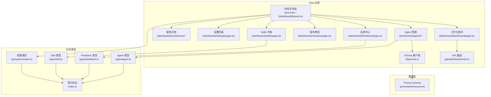
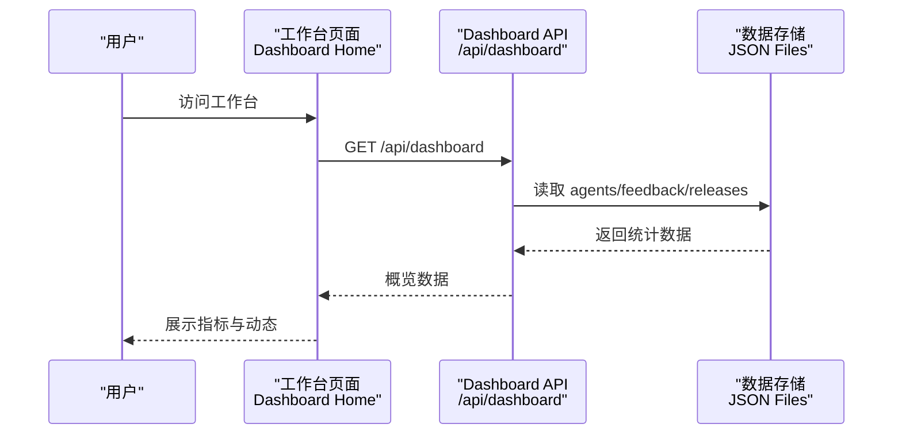
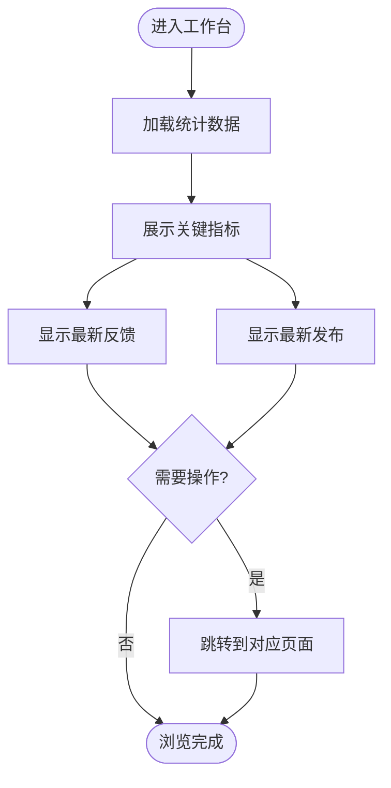
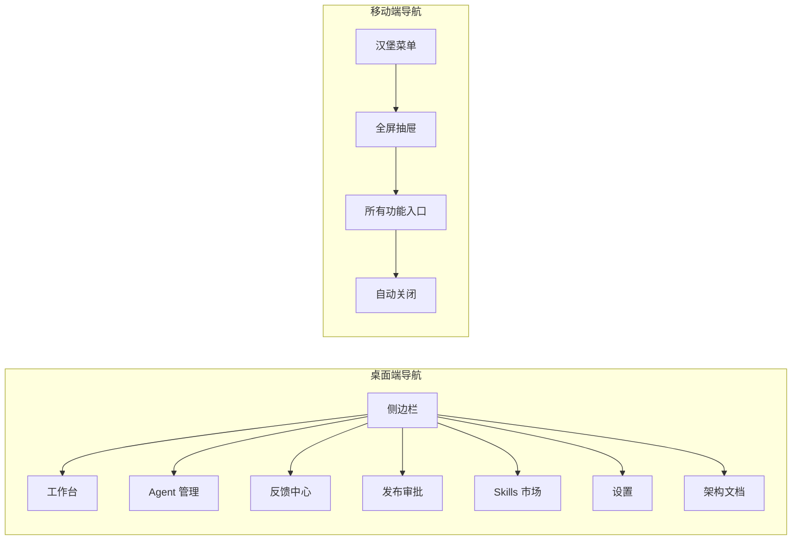
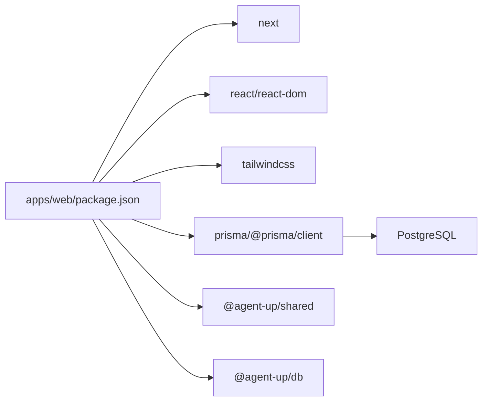

# 功能模块

<cite>
**本文引用的文件**   
- [apps/web/app/layout.tsx](file://apps/web/app/layout.tsx)
- [apps/web/app/(dashboard)/layout.tsx](file://apps/web/app/(dashboard)/layout.tsx)
- [apps/web/app/(dashboard)/page.tsx](file://apps/web/app/(dashboard)/page.tsx)
- [apps/web/app/(dashboard)/dashboard/page.tsx](file://apps/web/app/(dashboard)/dashboard/page.tsx)
- [apps/web/app/(dashboard)/agents/page.tsx](file://apps/web/app/(dashboard)/agents/page.tsx)
- [apps/web/app/(dashboard)/agents/[id]/page.tsx](file://apps/web/app/(dashboard)/agents/[id]/page.tsx)
- [apps/web/app/(dashboard)/feedback/page.tsx](file://apps/web/app/(dashboard)/feedback/page.tsx)
- [apps/web/app/(dashboard)/releases/page.tsx](file://apps/web/app/(dashboard)/releases/page.tsx)
- [apps/web/app/(dashboard)/skills/page.tsx](file://apps/web/app/(dashboard)/skills/page.tsx)
- [apps/web/app/(dashboard)/architecture/page.tsx](file://apps/web/app/(dashboard)/architecture/page.tsx)
- [apps/web/app/(dashboard)/settings/page.tsx](file://apps/web/app/(dashboard)/settings/page.tsx)
- [apps/web/app/(dashboard)/loading.tsx](file://apps/web/app/(dashboard)/loading.tsx)
- [apps/web/app/(dashboard)/error.tsx](file://apps/web/app/(dashboard)/error.tsx)
- [apps/web/app/api/dashboard/route.ts](file://apps/web/app/api/dashboard/route.ts)
- [apps/web/app/api/agents/route.ts](file://apps/web/app/api/agents/route.ts)
- [apps/web/lib/prisma.ts](file://apps/web/lib/prisma.ts)
- [apps/web/prisma/schema.prisma](file://apps/web/prisma/schema.prisma)
- [packages/shared/src/types/agent.ts](file://packages/shared/src/types/agent.ts)
- [packages/shared/src/types/feedback.ts](file://packages/shared/src/types/feedback.ts)
- [packages/shared/src/types/skill.ts](file://packages/shared/src/types/skill.ts)
- [packages/shared/src/types/permission.ts](file://packages/shared/src/types/permission.ts)
- [packages/shared/src/index.ts](file://packages/shared/src/index.ts)
</cite>

## 更新摘要
**变更内容**   
- 新增工作台 Dashboard 页面，提供全局概览与关键指标展示
- 改进导航结构，增加描述性说明和架构参考章节
- 增强用户体验：加载状态、错误边界、移动端响应式导航
- 完善各功能模块的界面交互和数据展示

## 目录
1. [简介](#简介)
2. [项目结构](#项目结构)
3. [核心组件](#核心组件)
4. [架构总览](#架构总览)
5. [详细组件分析](#详细组件分析)
6. [依赖分析](#依赖分析)
7. [性能考虑](#性能考虑)
8. [故障排除指南](#故障排除指南)
9. [结论](#结论)
10. [附录](#附录)

## 简介
Agent Up 是一个面向 Agent 持续改进的管理平台，围绕"三层 Loop"理念构建：通过 Prompt、知识库、工具/MCP、路由四大配置分区驱动 Agent 行为；以反馈中心收集问题与优化建议；通过发布审批与版本快照实现可追溯的变更管理；借助 Skills 市场提供可插拔能力扩展。平台同时提供组织与权限控制、审计日志等基础能力，确保团队协作安全可控。

**更新** 新增了工作台 Dashboard 页面，作为平台的统一入口，提供全局概览、关键指标监控和常用操作入口，显著改善了用户的第一次体验。

## 项目结构
本项目采用 Next.js App Router 前端工程化方案，使用 Prisma 进行数据建模与客户端生成，共享类型定义位于 packages/shared。主要目录职责如下：
- apps/web：Next.js 应用，包含页面、API 路由、Prisma 客户端初始化与数据库模型
- packages/shared：跨包共享的类型与常量（Agent、Feedback、Skill、权限等）

图表来源
- [apps/web/app/layout.tsx:1-20](file://apps/web/app/layout.tsx#L1-L20)
- [apps/web/app/(dashboard)/layout.tsx:1-249](file://apps/web/app/(dashboard)/layout.tsx#L1-L249)
- [apps/web/app/(dashboard)/dashboard/page.tsx:1-331](file://apps/web/app/(dashboard)/dashboard/page.tsx#L1-L331)
- [apps/web/app/(dashboard)/agents/page.tsx:1-408](file://apps/web/app/(dashboard)/agents/page.tsx#L1-L408)
- [apps/web/app/(dashboard)/feedback/page.tsx:1-674](file://apps/web/app/(dashboard)/feedback/page.tsx#L1-L674)
- [apps/web/app/(dashboard)/architecture/page.tsx:1-429](file://apps/web/app/(dashboard)/architecture/page.tsx#L1-L429)
- [apps/web/app/(dashboard)/settings/page.tsx:1-918](file://apps/web/app/(dashboard)/settings/page.tsx#L1-L918)
- [apps/web/app/api/dashboard/route.ts:1-41](file://apps/web/app/api/dashboard/route.ts#L1-L41)

章节来源
- [apps/web/app/layout.tsx:1-20](file://apps/web/app/layout.tsx#L1-L20)
- [apps/web/app/(dashboard)/layout.tsx:1-249](file://apps/web/app/(dashboard)/layout.tsx#L1-L249)
- [apps/web/app/(dashboard)/dashboard/page.tsx:1-331](file://apps/web/app/(dashboard)/dashboard/page.tsx#L1-L331)

## 核心组件
- **工作台 Dashboard** - 新的全局概览页面，展示关键指标、最近动态和常用入口
- **组织与用户**
  - 产品组与成员：用于团队隔离与协作范围控制
  - 用户与角色：支持平台级与产品组级角色分配
- **Agent 核心**
  - 四分区配置：Prompt、Knowledge、Tools、Routing
  - 草稿环境：保存未发布的临时配置
  - 配置变更记录：记录分区维度的变更差异
- **反馈中心**
  - 多来源录入、标签与严重等级、状态流转、指派与验证
- **发布审批与版本控制**
  - 提交发布、审批流、版本快照、回滚入口
- **Skills 市场**
  - Skill 元数据、运行时、版本、绑定到 Agent、权限与作用域
- **知识库 Wiki**
  - Vault、Page、Ingest Job、同步策略与置信度
- **权限与审计**
  - 角色-权限矩阵、用户-角色-产品组映射、审计日志
- **架构文档**
  - 三层 Loop 设计理念、四分区配置模型、项目评估与路线图

章节来源
- [apps/web/app/(dashboard)/dashboard/page.tsx:1-331](file://apps/web/app/(dashboard)/dashboard/page.tsx#L1-L331)
- [apps/web/app/(dashboard)/architecture/page.tsx:1-429](file://apps/web/app/(dashboard)/architecture/page.tsx#L1-L429)
- [apps/web/prisma/schema.prisma:14-91](file://apps/web/prisma/schema.prisma#L14-L91)
- [apps/web/prisma/schema.prisma:103-186](file://apps/web/prisma/schema.prisma#L103-L186)
- [apps/web/prisma/schema.prisma:192-214](file://apps/web/prisma/schema.prisma#L192-L214)
- [apps/web/prisma/schema.prisma:220-292](file://apps/web/prisma/schema.prisma#L220-L292)
- [apps/web/prisma/schema.prisma:298-354](file://apps/web/prisma/schema.prisma#L298-L354)
- [apps/web/prisma/schema.prisma:360-440](file://apps/web/prisma/schema.prisma#L360-L440)
- [apps/web/prisma/schema.prisma:446-557](file://apps/web/prisma/schema.prisma#L446-L557)
- [apps/web/prisma/schema.prisma:563-625](file://apps/web/prisma/schema.prisma#L563-L625)

## 架构总览
系统由前端页面、API 路由、共享类型与数据库四层构成。前端通过 API 路由访问后端能力，API 路由使用 Prisma 客户端读写数据库。共享类型在前后端保持一致，降低契约漂移风险。

**更新** 新增了工作台 Dashboard 作为统一的入口点，通过 `/api/dashboard` 聚合统计数据，为用户提供全局视角。

图表来源
- [apps/web/app/(dashboard)/dashboard/page.tsx:48-66](file://apps/web/app/(dashboard)/dashboard/page.tsx#L48-L66)
- [apps/web/app/api/dashboard/route.ts:4-41](file://apps/web/app/api/dashboard/route.ts#L4-L41)

## 详细组件分析

### 工作台 Dashboard
- **业务目标**
  - 提供平台的全局概览，让用户一眼了解 Agent 运行状态、反馈处理情况和发布审批进度
  - 作为新用户的引导入口，提供常用操作的快速访问
- **用户界面设计**
  - 四个关键指标卡片：Agent 总数、待处理反馈、待审批发布、活跃 Agent
  - 最新反馈列表：按时间倒序展示最近的反馈记录
  - 最新发布列表：展示最近的配置变更提交
  - 常用入口按钮：按改进环顺序排列的操作入口
- **工作流程**
  - 页面加载时调用 `/api/dashboard` 获取统计数据
  - 展示关键指标的实时状态，带下划线高亮需要关注的数字
  - 提供跳转到具体功能页面的快捷入口
- **技术实现**
  - 使用 `fetch('/api/dashboard')` 获取聚合数据
  - 实现加载状态、错误处理和空状态展示
  - 响应式设计适配不同屏幕尺寸
- **使用示例与操作指南**
  - 登录平台后默认进入工作台页面
  - 查看关键指标了解平台整体状况
  - 点击"查看全部"链接跳转到对应功能页面
  - 使用常用入口快速执行日常操作
- **权限与协作**
  - 所有注册用户都可以查看工作台概览
  - 指标数据基于当前用户的产品组权限过滤
- **扩展点与自定义**
  - 可添加更多统计指标和可视化图表
  - 支持自定义常用入口和操作模板

图表来源
- [apps/web/app/(dashboard)/dashboard/page.tsx:48-66](file://apps/web/app/(dashboard)/dashboard/page.tsx#L48-L66)
- [apps/web/app/(dashboard)/dashboard/page.tsx:130-157](file://apps/web/app/(dashboard)/dashboard/page.tsx#L130-L157)
- [apps/web/app/api/dashboard/route.ts:4-41](file://apps/web/app/api/dashboard/route.ts#L4-L41)

章节来源
- [apps/web/app/(dashboard)/dashboard/page.tsx:1-331](file://apps/web/app/(dashboard)/dashboard/page.tsx#L1-L331)
- [apps/web/app/api/dashboard/route.ts:1-41](file://apps/web/app/api/dashboard/route.ts#L1-L41)

### 改进的导航结构
- **业务目标**
  - 提供清晰的功能导航，帮助用户快速找到所需功能
  - 通过描述性文字提升新用户的使用体验
  - 支持桌面端侧边栏和移动端抽屉两种导航模式
- **用户界面设计**
  - 桌面端：固定左侧边栏，显示所有功能入口
  - 移动端：汉堡菜单 + 全屏抽屉导航
  - 每个导航项都有描述性文字，解释功能用途
  - 活跃状态通过颜色变化和左侧标记双重提示
- **工作流程**
  - 点击导航项切换到对应页面
  - 移动端点击导航项自动关闭抽屉
  - 支持键盘导航和屏幕阅读器
- **技术实现**
  - 使用 Next.js 路由系统进行页面切换
  - 响应式设计适配不同设备
  - 实现导航状态管理和活动路径检测
- **使用示例与操作指南**
  - 桌面端：直接点击左侧导航项
  - 移动端：点击汉堡菜单打开导航，选择功能后自动关闭
  - 使用键盘 Tab 键在导航项间切换
- **权限与协作**
  - 所有导航项对所有用户可见
  - 功能权限在具体页面中控制
- **扩展点与自定义**
  - 可通过修改 `navItems` 数组添加新功能入口
  - 支持为导航项添加图标和快捷键

图表来源
- [apps/web/app/(dashboard)/layout.tsx:14-30](file://apps/web/app/(dashboard)/layout.tsx#L14-L30)
- [apps/web/app/(dashboard)/layout.tsx:192-214](file://apps/web/app/(dashboard)/layout.tsx#L192-L214)
- [apps/web/app/(dashboard)/layout.tsx:218-238](file://apps/web/app/(dashboard)/layout.tsx#L218-L238)

章节来源
- [apps/web/app/(dashboard)/layout.tsx:1-249](file://apps/web/app/(dashboard)/layout.tsx#L1-L249)

### Agent 管理
- **业务目标**
  - 提供 Agent 的创建、搜索、详情与配置编辑入口，支撑后续发布与版本管理。
- **用户界面设计**
  - 列表页：标题、新建按钮、搜索框、状态筛选、空态提示
  - 详情页：四分区 Tab（Prompt、知识库、工具/MCP、路由），底部操作（提交发布、查看版本历史、查看反馈）
- **工作流程**
  - 进入详情页后，按分区编辑配置；保存至草稿区；提交发布触发审批流程；通过后生成版本快照。
- **技术实现**
  - 页面路由：(dashboard)/agents 与 (dashboard)/agents/[id]
  - 配置分区：PromptConfig、KnowledgeConfig、ToolsConfig、RoutingConfig
  - 草稿环境：AgentDraftConfig
  - 变更记录：ConfigChange（分区维度 before/after/diff）
  - API 文档：/api/agents 列出可用端点（GET/POST/PUT/DELETE 及配置与发布相关）
- **使用示例与操作指南**
  - 新建 Agent：在"我的 Agent"点击"新建 Agent"，填写基本信息并进入配置中心
  - 编辑配置：选择对应分区 Tab，修改内容后保存
  - 提交发布：点击"提交发布"，进入发布审批流程
  - 查看版本历史：跳转版本列表，支持回滚
- **权限与协作**
  - 基于产品组与角色的访问控制，成员可在组内协作编辑与提交发布
- **扩展点与自定义**
  - 新增分区或字段需同步更新 schema 与共享类型
  - 可通过 ConfigChange 审计追踪任意分区变更

章节来源
- [apps/web/app/(dashboard)/agents/page.tsx:1-408](file://apps/web/app/(dashboard)/agents/page.tsx#L1-L408)
- [apps/web/app/(dashboard)/agents/[id]/page.tsx:1-43](file://apps/web/app/(dashboard)/agents/[id]/page.tsx#L1-L43)
- [apps/web/app/api/agents/route.ts:1-19](file://apps/web/app/api/agents/route.ts#L1-L19)
- [apps/web/prisma/schema.prisma:61-91](file://apps/web/prisma/schema.prisma#L61-L91)
- [apps/web/prisma/schema.prisma:103-186](file://apps/web/prisma/schema.prisma#L103-L186)
- [apps/web/prisma/schema.prisma:192-214](file://apps/web/prisma/schema.prisma#L192-L214)
- [packages/shared/src/types/agent.ts:1-61](file://packages/shared/src/types/agent.ts#L1-L61)

### 反馈中心
- **业务目标**
  - 集中收集来自人工、API、会话导入与系统的反馈，形成闭环处理流程，驱动 Prompt、知识、工具与路由的持续优化。
- **用户界面设计**
  - 顶部标题与录入按钮；状态筛选（全部、待处理、处理中、已解决）；反馈列表区域
  - 新增 AI 归因功能，为负面评价的反馈提供智能分析
- **工作流程**
  - 录入反馈 → 打标与定级 → 分派与处理 → 验证与关闭；必要时关联 Release 与分区
- **技术实现**
  - 数据模型：Feedback、FeedbackSource、FeedbackRating、FeedbackTag、FeedbackSeverity、FeedbackStatus
  - 关联：Agent、Release、ConfigPartition、提交人、处理人与验证人
  - AI 归因：通过 `/api/feedback/:id/insight` 接口获取智能分析
- **使用示例与操作指南**
  - 录入反馈：点击"录入反馈"，填写标题、内容、评分、标签与严重等级
  - 筛选与处理：按状态筛选，指派负责人，推进状态直至关闭
  - 关联发布：将反馈与特定发布关联，便于回溯影响面
  - AI 归因：对负面评价的反馈点击"AI 归因"获取智能分析
- **权限与协作**
  - 支持按产品组与角色限制可见性与操作权限
- **扩展点与自定义**
  - 新增标签或严重等级需在 schema 与共享类型中同步扩展

章节来源
- [apps/web/app/(dashboard)/feedback/page.tsx:1-674](file://apps/web/app/(dashboard)/feedback/page.tsx#L1-L674)
- [apps/web/prisma/schema.prisma:220-292](file://apps/web/prisma/schema.prisma#L220-L292)
- [packages/shared/src/types/feedback.ts:1-61](file://packages/shared/src/types/feedback.ts#L1-L61)

### 版本控制与发布审批
- **业务目标**
  - 对 Agent 的四分区配置变更进行受控发布，保留完整版本快照，支持回滚与审计。
- **用户界面设计**
  - 发布审批列表：按状态筛选（待审批、已通过、已驳回）；详情页展示变更说明与受影响分区
- **工作流程**
  - 提交发布 → 审批（通过/驳回/要求修改）→ 通过后生成版本快照 → 可选择回滚
- **技术实现**
  - 数据模型：Release、AgentVersion、ConfigChange
  - 版本快照：prompt/knowledge/tools/routing 四个分区快照
  - 回滚：API 暴露回滚端点
- **使用示例与操作指南**
  - 提交发布：在 Agent 详情页点击"提交发布"，填写变更说明
  - 审批：管理员在"发布审批"页面审核并通过
  - 查看版本历史：在 Agent 详情页查看版本列表与差异
  - 回滚：选择目标版本执行回滚
- **权限与协作**
  - 仅具备发布与审批权限的用户可操作；所有变更记录审计日志
- **扩展点与自定义**
  - 可扩展有效性报告字段（effectivenessReport）以接入评估指标

章节来源
- [apps/web/app/(dashboard)/releases/page.tsx:1-25](file://apps/web/app/(dashboard)/releases/page.tsx#L1-L25)
- [apps/web/app/(dashboard)/agents/[id]/page.tsx:29-39](file://apps/web/app/(dashboard)/agents/[id]/page.tsx#L29-L39)
- [apps/web/app/api/agents/route.ts:14-15](file://apps/web/app/api/agents/route.ts#L14-L15)
- [apps/web/prisma/schema.prisma:298-354](file://apps/web/prisma/schema.prisma#L298-L354)
- [apps/web/prisma/schema.prisma:192-214](file://apps/web/prisma/schema.prisma#L192-L214)

### Skills 市场
- **业务目标**
  - 提供可插拔技能的市场化分发与管理，支持多种运行时（HTTP、FUNCTION、MCP、WORKFLOW），并可绑定到 Agent 并限定作用域。
- **用户界面设计**
  - 顶部标题与发布按钮；分类筛选（知识检索、数据查询、动作执行、通用）；市场列表占位
- **工作流程**
  - 发布 Skill → 版本管理 → 在 Agent 中绑定与启用 → 运行调用
- **技术实现**
  - 数据模型：Skill、SkillVersion、AgentSkillBinding
  - 运行时与权限：runtime、permissions、allowedScopes
- **使用示例与操作指南**
  - 发布 Skill：填写名称、描述、分类、输入输出 Schema、运行时与权限
  - 绑定到 Agent：在 Agent 配置中选择并启用 Skill，设置优先级与作用域
  - 版本管理：维护不同版本的变更日志与快照
- **权限与协作**
  - 作者与下载统计；按权限控制发布与绑定操作
- **扩展点与自定义**
  - 新增运行时类型与触发模式，扩展 input/output Schema 校验

章节来源
- [apps/web/app/(dashboard)/skills/page.tsx:1-30](file://apps/web/app/(dashboard)/skills/page.tsx#L1-L30)
- [apps/web/prisma/schema.prisma:360-440](file://apps/web/prisma/schema.prisma#L360-L440)
- [packages/shared/src/types/skill.ts:1-48](file://packages/shared/src/types/skill.ts#L1-L48)

### 知识库 Wiki（与反馈联动）
- **业务目标**
  - 为 Agent 的知识检索提供结构化内容源，支持 Git 同步、页面生命周期管理与置信度评估。
- **用户界面设计**
  - 与 KnowledgeConfig 联动，支持选择 Vault、配置检索策略与阈值
- **工作流程**
  - 配置 KnowledgeConfig → 触发 IngestJob → 生成/更新 WikiPage → 同步状态与置信度
- **技术实现**
  - 数据模型：WikiVault、WikiPage、WikiIngestJob、KnowledgeConfig
  - 同步策略：SearchStrategy、SyncStatus
- **使用示例与操作指南**
  - 配置检索策略：选择 WIKI_FIRST/WIKI_ONLY/MCP_FIRST/HYBRID
  - 同步与监控：查看 lastSyncAt、syncStatus、avgConfidence
- **权限与协作**
  - 支持共享 Vault 与审阅流程（reviewedAt/reviewedBy）
- **扩展点与自定义**
  - 扩展页面层级（tier）、来源（provenance）与任务类型（jobType）

章节来源
- [apps/web/prisma/schema.prisma:116-145](file://apps/web/prisma/schema.prisma#L116-L145)
- [apps/web/prisma/schema.prisma:446-557](file://apps/web/prisma/schema.prisma#L446-L557)

### 权限与协作
- **业务目标**
  - 提供细粒度权限控制与审计能力，保障团队协作安全合规。
- **用户界面设计**
  - 侧边栏显示当前用户角色；各页面根据权限显示操作按钮
  - 设置页面提供产品组、角色权限和审计日志管理
- **工作流程**
  - 用户登录 → 加载角色与权限 → 页面渲染时按权限控制可见性
- **技术实现**
  - 数据模型：Role、Permission、RolePermission、UserRole、AuditLog
  - 共享类型：RoleType、PermissionAction、PermissionScope、AuditLogEntry
- **使用示例与操作指南**
  - 管理员分配角色与权限；普通成员按范围访问
  - 审计日志记录关键操作（action/resource/resourceId/user）
- **扩展点与自定义**
  - 新增资源与动作，扩展权限矩阵

章节来源
- [apps/web/app/(dashboard)/settings/page.tsx:1-918](file://apps/web/app/(dashboard)/settings/page.tsx#L1-L918)
- [apps/web/prisma/schema.prisma:563-625](file://apps/web/prisma/schema.prisma#L563-L625)
- [packages/shared/src/types/permission.ts:1-36](file://packages/shared/src/types/permission.ts#L1-L36)

### 架构文档
- **业务目标**
  - 提供平台的设计理念说明、功能评估和改进路线图
  - 帮助新用户理解平台的架构思想和使用方法
- **用户界面设计**
  - 架构总览页面展示三层 Loop 设计和四分区配置模型
  - 功能完整性评估和改进路线图
  - 交互式图表和表格展示复杂概念
- **工作流程**
  - 从架构总览开始，逐步深入了解各个设计决策
  - 通过评估报告了解平台现状和改进方向
- **技术实现**
  - 使用 Mermaid 图表展示架构图和数据流
  - 表格形式展示功能评分和改进计划
  - 响应式设计适配不同屏幕尺寸
- **使用示例与操作指南**
  - 新用户推荐阅读架构总览了解平台设计
  - 开发者关注改进路线图了解开发计划
  - 管理者查看功能评估了解平台成熟度
- **权限与协作**
  - 架构文档对所有用户开放阅读
  - 支持团队协作讨论和改进建议
- **扩展点与自定义**
  - 可添加更多架构说明和最佳实践
  - 支持社区贡献改进建议

章节来源
- [apps/web/app/(dashboard)/architecture/page.tsx:1-429](file://apps/web/app/(dashboard)/architecture/page.tsx#L1-L429)

## 依赖分析
- 前端依赖
  - Next.js、React、TailwindCSS、ESLint、Prisma CLI
- 共享依赖
  - @agent-up/shared、@agent-up/db（工作区引用）
- 数据库
  - PostgreSQL（通过 Prisma Client 连接）

图表来源
- [apps/web/package.json:1-38](file://apps/web/package.json#L1-L38)
- [apps/web/lib/prisma.ts:1-17](file://apps/web/lib/prisma.ts#L1-L17)
- [apps/web/prisma/schema.prisma:5-8](file://apps/web/prisma/schema.prisma#L5-L8)

章节来源
- [apps/web/package.json:1-38](file://apps/web/package.json#L1-L38)
- [apps/web/lib/prisma.ts:1-17](file://apps/web/lib/prisma.ts#L1-L17)
- [apps/web/prisma/schema.prisma:5-8](file://apps/web/prisma/schema.prisma#L5-L8)

## 性能考虑
- 数据库索引
  - 针对高频查询字段建立索引（如 Agent.productGroupId、Agent.status、Feedback.agentId+status、Feedback.severity+status、AgentVersion.agentId+publishedAt、WikiPage.vaultId+lifecycle/tier、WikiIngestJob.vaultId+status、AuditLog.resource+resourceId、AuditLog.userId+createdAt、AuditLog.action+createdAt、AuditLog.createdAt）
- 分页与限流
  - 共享类型提供默认与最大分页大小，建议在 API 层实现分页与上限保护
- 并发与超时
  - ToolsConfig 提供 maxConcurrentCalls、timeoutMs、retryCount，合理调优以避免外部服务拥塞
- 缓存与一致性
  - 草稿环境与版本快照分离，减少生产环境写放大；发布前进行差异计算与校验
- **更新** 工作台 Dashboard 通过聚合 API 减少多次请求，提升加载性能

## 故障排除指南
- 无法连接数据库
  - 检查 DATABASE_URL 环境变量与 Prisma 客户端初始化
  - 参考路径：[apps/web/lib/prisma.ts:1-17](file://apps/web/lib/prisma.ts#L1-L17)、[apps/web/prisma/schema.prisma:5-8](file://apps/web/prisma/schema.prisma#L5-L8)
- 页面空白或样式异常
  - 确认全局 CSS 与 Tailwind 配置生效
  - 参考路径：[apps/web/app/layout.tsx:1-20](file://apps/web/app/layout.tsx#L1-L20)
- API 不可用
  - 检查路由文件是否存在且导出正确方法
  - 参考路径：[apps/web/app/api/agents/route.ts:1-19](file://apps/web/app/api/agents/route.ts#L1-L19)
- 权限不足导致按钮隐藏
  - 核对用户角色与权限矩阵，确认 RolePermission 与 UserRole 配置
  - 参考路径：[apps/web/prisma/schema.prisma:563-625](file://apps/web/prisma/schema.prisma#L563-L625)、[packages/shared/src/types/permission.ts:1-36](file://packages/shared/src/types/permission.ts#L1-L36)
- 反馈无法关联分区
  - 确认 ConfigPartition 枚举一致，前后端类型同步
  - 参考路径：[apps/web/prisma/schema.prisma:209-214](file://apps/web/prisma/schema.prisma#L209-L214)、[packages/shared/src/types/agent.ts:18-23](file://packages/shared/src/types/agent.ts#L18-L23)
- **更新** 工作台数据加载失败
  - 检查 `/api/dashboard` 接口是否正常工作
  - 确认数据文件格式正确且可读
  - 参考路径：[apps/web/app/api/dashboard/route.ts:1-41](file://apps/web/app/api/dashboard/route.ts#L1-L41)

章节来源
- [apps/web/lib/prisma.ts:1-17](file://apps/web/lib/prisma.ts#L1-L17)
- [apps/web/app/layout.tsx:1-20](file://apps/web/app/layout.tsx#L1-L20)
- [apps/web/app/api/agents/route.ts:1-19](file://apps/web/app/api/agents/route.ts#L1-L19)
- [apps/web/prisma/schema.prisma:209-214](file://apps/web/prisma/schema.prisma#L209-L214)
- [packages/shared/src/types/permission.ts:1-36](file://packages/shared/src/types/permission.ts#L1-L36)
- [apps/web/app/api/dashboard/route.ts:1-41](file://apps/web/app/api/dashboard/route.ts#L1-L41)

## 结论
Agent Up 通过清晰的模块化设计与严谨的数据模型，实现了 Agent 全生命周期的持续改进：从配置编辑、反馈收集、发布审批到版本回滚与技能扩展。平台在权限与审计方面提供了企业级安全保障，并为未来扩展预留了充足的接口与类型体系。

**更新** 新增的工作台 Dashboard 显著改善了用户体验，为用户提供了直观的平台概览和便捷的操作入口。改进的导航结构增强了易用性，增强的用户体验功能包括加载状态、错误边界和移动端响应式支持。建议在生产环境中完善 API 实现、引入分页与限流、强化错误处理与监控告警，以提升稳定性与可观测性。

## 附录
- 常用命令
  - 开发：pnpm dev（Next Turbopack）
  - 构建：pnpm build
  - 启动：pnpm start
  - 数据库：db:generate、db:push、db:migrate、db:studio
  - 清理：clean
- 共享常量与规则
  - 平台名称、默认分页大小、最大分页大小、语义化版本号正则
- 页面导航
  - 工作台、我的 Agent、反馈中心、发布审批、Skills 市场、设置、架构文档

章节来源
- [apps/web/package.json:5-14](file://apps/web/package.json#L5-L14)
- [packages/shared/src/index.ts:8-14](file://packages/shared/src/index.ts#L8-L14)
- [apps/web/app/(dashboard)/layout.tsx:14-30](file://apps/web/app/(dashboard)/layout.tsx#L14-L30)