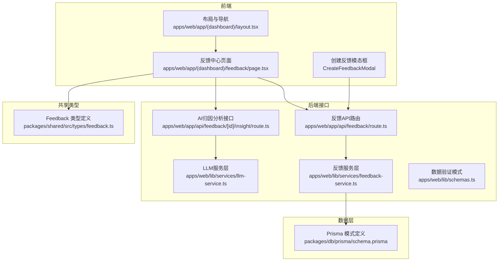
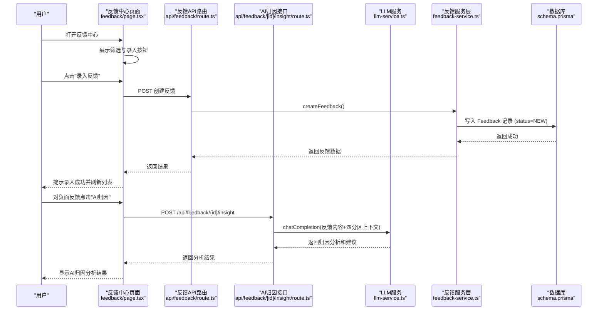
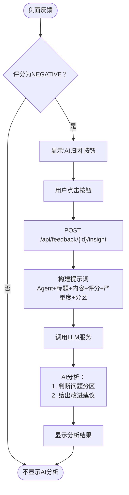
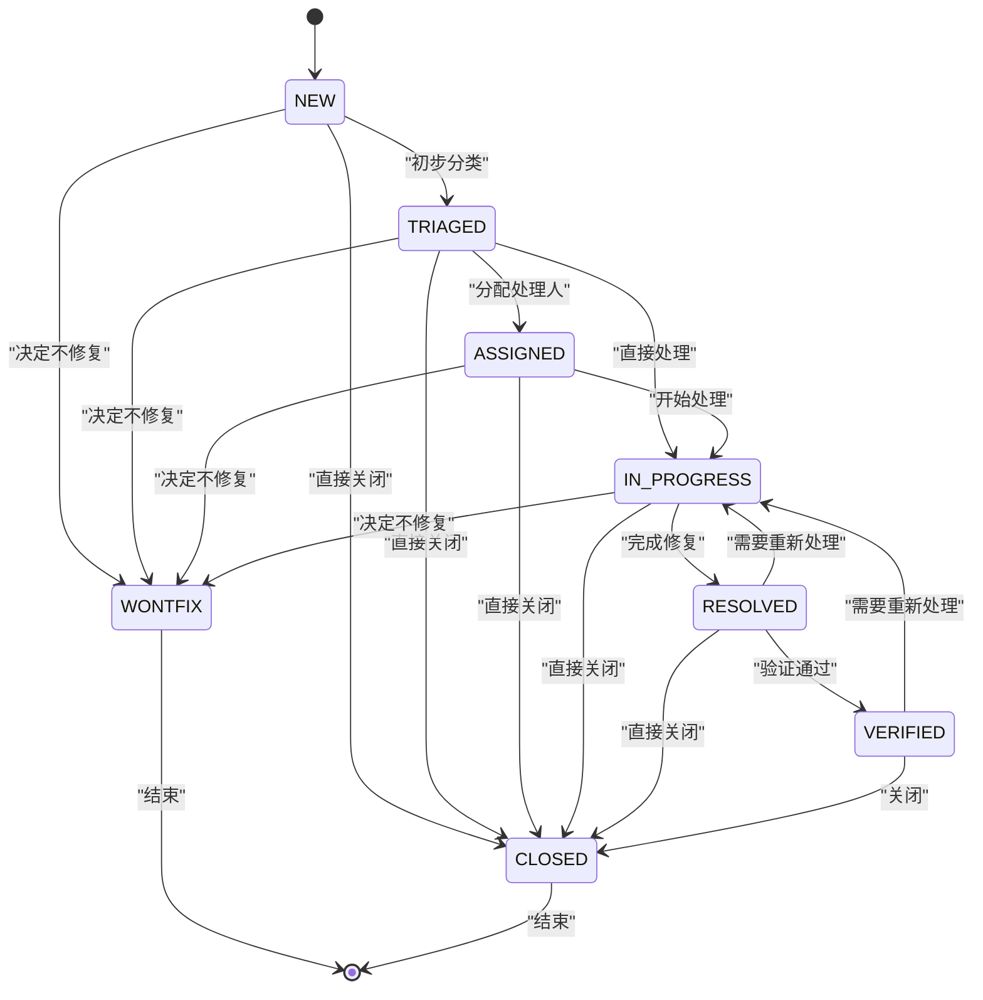
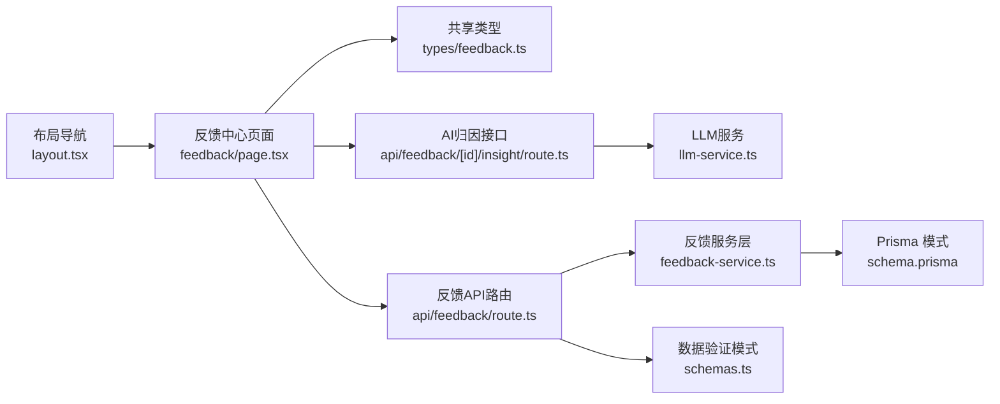

</think>

基于我对代码的分析，我现在可以更新反馈中心的文档。根据变更说明，反馈中心进行了现代化升级，包括增强的状态工作流可视化、严重度过滤、AI归因能力和更好的删除Agent引用处理。让我更新文档：

# 反馈中心

<cite>
**本文引用的文件**
- [apps/web/app/(dashboard)/feedback/page.tsx](file://apps/web/app/(dashboard)/feedback/page.tsx)
- [apps/web/app/api/feedback/route.ts](file://apps/web/app/api/feedback/route.ts)
- [apps/web/app/api/feedback/[id]/insight/route.ts](file://apps/web/app/api/feedback/[id]/insight/route.ts)
- [apps/web/lib/services/feedback-service.ts](file://apps/web/lib/services/feedback-service.ts)
- [apps/web/lib/services/llm-service.ts](file://apps/web/lib/services/llm-service.ts)
- [apps/web/lib/schemas.ts](file://apps/web/lib/schemas.ts)
- [packages/db/prisma/schema.prisma](file://packages/db/prisma/schema.prisma)
- [packages/shared/src/types/feedback.ts](file://packages/shared/src/types/feedback.ts)
</cite>

## 更新摘要
**变更内容**
- **现代化升级**：实现了完整的状态工作流管理系统，支持严格的转换规则和可视化界面
- **增强的筛选功能**：新增严重度过滤（CRITICAL、MAJOR、MINOR、SUGGESTION）和多维度筛选能力
- **AI归因分析**：集成LLM服务，为负面反馈提供智能归因分析和改进建议
- **改进的Agent引用处理**：增强了对已删除Agent的容错处理，提供更好的用户体验
- **完善的工作流可视化**：动态显示可执行的状态转换按钮和流程指引
- **增强的错误处理**：全面的异常处理和用户友好的错误提示

## 目录
1. [简介](#简介)
2. [项目结构](#项目结构)
3. [核心组件](#核心组件)
4. [架构总览](#架构总览)
5. [详细组件分析](#详细组件分析)
6. [依赖分析](#依赖分析)
7. [性能考虑](#性能考虑)
8. [故障排查指南](#故障排查指南)
9. [结论](#结论)
10. [附录](#附录)

## 简介
本文件为"反馈中心"的完整产品与实现文档，覆盖用户反馈的收集、分类、处理与分析全流程。经过现代化升级后，系统现已具备以下核心能力：
- **完整的工作流管理**：支持从NEW到CLOSED/WONTFIX的完整状态流转，包含严格的状态转换规则验证
- **多维度筛选系统**：支持按状态、严重度、标签、评分等条件进行精确筛选
- **AI驱动的智能分析**：集成LLM服务，自动分析负面反馈并提供改进建议
- **增强的用户体验**：改进的Agent引用处理、实时状态更新和友好的错误提示
- **团队协作功能**：支持多人处理、评论机制和处理跟踪
- **统计分析与效果追踪**：完整的指标收集和趋势分析能力

**更新** 本次现代化升级显著提升了系统的可用性和智能化水平，特别是AI归因分析功能的加入，形成了"反馈→AI分析→配置改进"的完整闭环。

## 项目结构
反馈中心在应用中的入口与导航如下：
- 侧边栏导航中包含"反馈中心"，点击后进入 /feedback 页面
- 反馈中心页面提供"录入反馈"按钮与高级筛选（全部状态、严重度过滤）
- **新增AI归因分析接口** `/api/feedback/[id]/insight`，为负面反馈提供智能分析
- 完整的CRUD API接口支持反馈的创建、读取、更新操作
- 数据库模型与枚举定义位于 Prisma Schema，前端共享类型定义位于 packages/shared

**图表来源**
- [apps/web/app/(dashboard)/feedback/page.tsx:1-674](file://apps/web/app/(dashboard)/feedback/page.tsx#L1-L674)
- [apps/web/app/api/feedback/route.ts:1-74](file://apps/web/app/api/feedback/route.ts#L1-L74)
- [apps/web/app/api/feedback/[id]/insight/route.ts:1-59](file://apps/web/app/api/feedback/[id]/insight/route.ts#L1-L59)
- [apps/web/lib/services/feedback-service.ts:1-166](file://apps/web/lib/services/feedback-service.ts#L1-L166)
- [apps/web/lib/services/llm-service.ts:1-135](file://apps/web/lib/services/llm-service.ts#L1-L135)
- [apps/web/lib/schemas.ts:58-85](file://apps/web/lib/schemas.ts#L58-L85)
- [packages/db/prisma/schema.prisma:220-292](file://packages/db/prisma/schema.prisma#L220-L292)
- [packages/shared/src/types/feedback.ts:1-62](file://packages/shared/src/types/feedback.ts#L1-L62)

## 核心组件
- **反馈中心页面**：提供标题、录入按钮、多条件筛选与列表展示，支持实时状态切换和AI归因分析
- **创建反馈模态框**：支持Agent选择、评分、严重度、目标分区等字段，包含完善的表单验证
- **AI归因分析组件**：为负面反馈提供智能分析和改进建议，集成LLM服务
- **反馈数据模型**：包含来源、标题、内容、评分、标签、严重度、状态、处理人、时间戳等完整字段
- **工作流引擎**：内置状态转换规则，确保状态流转的合法性，防止非法状态跳转
- **筛选系统**：支持按状态、严重度、标签等多维度筛选，提升查询效率
- **共享类型**：在前端统一约束反馈相关的数据结构与枚举值

**章节来源**
- [apps/web/app/(dashboard)/feedback/page.tsx:1-674](file://apps/web/app/(dashboard)/feedback/page.tsx#L1-L674)
- [apps/web/app/api/feedback/[id]/insight/route.ts:1-59](file://apps/web/app/api/feedback/[id]/insight/route.ts#L1-L59)
- [apps/web/lib/services/feedback-service.ts:1-166](file://apps/web/lib/services/feedback-service.ts#L1-L166)
- [packages/db/prisma/schema.prisma:220-292](file://packages/db/prisma/schema.prisma#L220-L292)
- [packages/shared/src/types/feedback.ts:1-62](file://packages/shared/src/types/feedback.ts#L1-L62)

## 架构总览
反馈中心采用前后端分离架构，实现了完整的工作流管理和AI驱动的智能分析：
- 前端通过 Next.js 页面渲染反馈中心 UI，支持实时状态切换、筛选和AI归因分析
- 后端以 Next.js Route Handler 形式暴露 RESTful API，支持CRUD操作和AI分析请求
- **新增AI分析流水线**：反馈 → LLM服务 → 智能归因分析 → 改进建议
- 数据持久化使用 PostgreSQL，通过 Prisma ORM 进行建模与查询
- 共享类型包确保前后端对反馈数据结构的一致性
- 服务层封装业务逻辑，包括状态转换验证和时间戳自动更新

**图表来源**
- [apps/web/app/(dashboard)/feedback/page.tsx:66-91](file://apps/web/app/(dashboard)/feedback/page.tsx#L66-L91)
- [apps/web/app/api/feedback/[id]/insight/route.ts:13-58](file://apps/web/app/api/feedback/[id]/insight/route.ts#L13-L58)
- [apps/web/lib/services/llm-service.ts:67-134](file://apps/web/lib/services/llm-service.ts#L67-L134)
- [apps/web/app/api/feedback/route.ts:31-49](file://apps/web/app/api/feedback/route.ts#L31-L49)
- [apps/web/lib/services/feedback-service.ts:83-121](file://apps/web/lib/services/feedback-service.ts#L83-L121)

## 详细组件分析

### 反馈中心页面（UI 与交互）
**更新** 现代化升级后的前端交互功能更加完善：

- **页面标题与操作区**：显示"反馈中心"标题与"+ 录入反馈"按钮，包含详细的流程说明
- **高级筛选区**：提供状态筛选（全部状态、NEW、TRIAGED、ASSIGNED、IN_PROGRESS、RESOLVED、VERIFIED、CLOSED、WONTFIX）和严重度筛选（全部严重程度、CRITICAL、MAJOR、MINOR、SUGGESTION）
- **反馈列表**：展示反馈条目，包含状态标签、严重度标签、评分表情、Agent信息、目标分区、提交时间和标签集合
- **AI归因分析**：仅对负面反馈（NEGATIVE）显示"AI归因"按钮，点击后调用AI分析接口获取智能建议
- **状态转换按钮**：根据当前状态动态显示可转换的状态选项，支持防重复点击保护
- **创建反馈模态框**：支持Agent选择、标题、详细内容、评价、严重程度、目标分区等字段，包含完善的表单验证和错误处理

**章节来源**
- [apps/web/app/(dashboard)/feedback/page.tsx:144-196](file://apps/web/app/(dashboard)/feedback/page.tsx#L144-L196)
- [apps/web/app/(dashboard)/feedback/page.tsx:284-419](file://apps/web/app/(dashboard)/feedback/page.tsx#L284-L419)
- [apps/web/app/(dashboard)/feedback/page.tsx:432-674](file://apps/web/app/(dashboard)/feedback/page.tsx#L432-L674)

### AI驱动的负向反馈归因分析
**新增** 实现了基于LLM的智能归因分析功能：

- **触发条件**：仅当反馈评分为NEGATIVE时显示"AI归因"按钮
- **分析流程**：
  1. 前端调用 `/api/feedback/{id}/insight` POST接口
  2. 后端获取反馈详情并构建提示词
  3. 调用LLM服务进行智能分析
  4. 返回包含归因分析和改进建议的结果
- **提示词设计**：
  - System角色：设定AI为"Agent改进平台的资深运营分析师"
  - 四分区上下文：明确Prompt、Knowledge、Tools、Routing四个配置分区
  - 输出格式：要求包含"归因分析"和"改进建议"两部分
- **用户输入**：包含Agent名称、反馈标题、内容、评分、严重程度和目标分区
- **结果展示**：在反馈条目下方显示AI分析结果，支持加载状态和错误处理

**图表来源**
- [apps/web/app/(dashboard)/feedback/page.tsx:364-373](file://apps/web/app/(dashboard)/feedback/page.tsx#L364-L373)
- [apps/web/app/api/feedback/[id]/insight/route.ts:25-47](file://apps/web/app/api/feedback/[id]/insight/route.ts#L25-L47)
- [apps/web/lib/services/llm-service.ts:67-134](file://apps/web/lib/services/llm-service.ts#L67-L134)

**章节来源**
- [apps/web/app/(dashboard)/feedback/page.tsx:75-91](file://apps/web/app/(dashboard)/feedback/page.tsx#L75-L91)
- [apps/web/app/api/feedback/[id]/insight/route.ts:1-59](file://apps/web/app/api/feedback/[id]/insight/route.ts#L1-L59)
- [apps/web/lib/services/llm-service.ts:1-135](file://apps/web/lib/services/llm-service.ts#L1-L135)

### 反馈数据模型与枚举（数据库与类型）
**更新** 完善了数据模型定义和索引优化：

- **实体关系**：Feedback 与 Agent 一对多；Feedback 可关联 Release、IngestJob 等
- **关键字段**：
  - 来源 source：MANUAL、API、SESSION_IMPORT、SYSTEM
  - 评分 rating：POSITIVE、NEGATIVE、NEUTRAL
  - 标签 tags：ANSWER_QUALITY、KNOWLEDGE_GAP、TOOL_FAILURE、ROUTING_ERROR、HALLUCINATION、OUTDATED_INFO、TONE_ISSUE、INCOMPLETE、OFF_TOPIC
  - 严重度 severity：CRITICAL、MAJOR、MINOR、SUGGESTION
  - 状态 status：NEW、TRIAGED、ASSIGNED、IN_PROGRESS、RESOLVED、VERIFIED、CLOSED、WONTFIX
  - 处理信息：assignedTo、assignedAt、resolvedBy、resolvedAt、resolution
  - 验证信息：verifiedBy、verifiedAt、verificationNote
  - 目标分区 targetPartition：PROMPT、KNOWLEDGE、TOOLS、ROUTING
- **索引优化**：针对 agentId+status、submittedAt、severity+status 建立复合索引以提升查询性能

**图表来源**
- [packages/db/prisma/schema.prisma:220-292](file://packages/db/prisma/schema.prisma#L220-L292)
- [packages/shared/src/types/feedback.ts:1-62](file://packages/shared/src/types/feedback.ts#L1-L62)

**章节来源**
- [packages/db/prisma/schema.prisma:220-292](file://packages/db/prisma/schema.prisma#L220-L292)
- [packages/shared/src/types/feedback.ts:1-62](file://packages/shared/src/types/feedback.ts#L1-L62)

### 反馈录入流程（新增反馈）
**更新** 实现了完整的反馈创建流程：

- **触发入口**：反馈中心页面的"+ 录入反馈"按钮
- **表单字段**：
  - 必填：Agent、标题、详细内容
  - 可选：评价（正面👍/负面👎/中性😐）、严重程度（严重/重要/次要/建议）、目标分区（Prompt/Knowledge/Tools/Routing）
- **提交动作**：调用 `/api/feedback` POST 接口创建反馈记录，默认状态为 NEW，成功后刷新列表
- **数据验证**：使用 Zod schema 进行前后端双重验证
- **错误处理**：完善的网络错误处理和用户友好的错误提示

**章节来源**
- [apps/web/app/(dashboard)/feedback/page.tsx:432-674](file://apps/web/app/(dashboard)/feedback/page.tsx#L432-L674)
- [apps/web/app/api/feedback/route.ts:31-49](file://apps/web/app/api/feedback/route.ts#L31-L49)
- [apps/web/lib/services/feedback-service.ts:83-121](file://apps/web/lib/services/feedback-service.ts#L83-L121)

### 反馈处理工作流（状态转换与管理）
**更新** 实现了完整的工作流管理系统：

- **状态转换规则**：
  - NEW → TRIAGED, WONTFIX, CLOSED
  - TRIAGED → ASSIGNED, IN_PROGRESS, WONTFIX, CLOSED
  - ASSIGNED → IN_PROGRESS, WONTFIX, CLOSED
  - IN_PROGRESS → RESOLVED, WONTFIX, CLOSED
  - RESOLVED → VERIFIED, IN_PROGRESS, CLOSED
  - VERIFIED → CLOSED, IN_PROGRESS
  - CLOSED, WONTFIX → 终态
- **关键操作**：
  - 分派：设置 assignedTo、assignedAt
  - 解决：填写 resolution、resolvedBy、resolvedAt，状态置为 RESOLVED
  - 验证：由验证人填写 verificationNote、verifiedBy、verifiedAt，状态置为 VERIFIED
  - 关闭：状态置为 CLOSED；若决定不修复，置为 WONTFIX
- **前端状态按钮**：根据当前状态动态显示可转换的状态选项，支持防重复点击
- **后端状态验证**：在服务层验证状态转换的合法性，防止非法状态跳转

**图表来源**
- [apps/web/app/(dashboard)/feedback/page.tsx:54-63](file://apps/web/app/(dashboard)/feedback/page.tsx#L54-L63)
- [apps/web/lib/services/feedback-service.ts:15-24](file://apps/web/lib/services/feedback-service.ts#L15-L24)
- [packages/db/prisma/schema.prisma:283-292](file://packages/db/prisma/schema.prisma#L283-L292)

**章节来源**
- [apps/web/app/(dashboard)/feedback/page.tsx:54-63](file://apps/web/app/(dashboard)/feedback/page.tsx#L54-L63)
- [apps/web/lib/services/feedback-service.ts:123-165](file://apps/web/lib/services/feedback-service.ts#L123-L165)
- [packages/db/prisma/schema.prisma:283-292](file://packages/db/prisma/schema.prisma#L283-L292)

### 筛选与搜索功能
**更新** 实现了多维度的筛选系统：

- **状态筛选**：支持全部状态和特定状态筛选（NEW、TRIAGED、ASSIGNED、IN_PROGRESS、RESOLVED、VERIFIED、CLOSED、WONTFIX）
- **严重度筛选**：支持全部严重度和特定严重度筛选（CRITICAL、MAJOR、MINOR、SUGGESTION）
- **标签筛选**：支持按标签筛选反馈
- **Agent筛选**：支持按Agent筛选反馈
- **评分筛选**：支持按评分筛选反馈
- **分页支持**：支持分页查询和总数统计

**章节来源**
- [apps/web/app/(dashboard)/feedback/page.tsx:163-196](file://apps/web/app/(dashboard)/feedback/page.tsx#L163-L196)
- [apps/web/app/api/feedback/route.ts:11-28](file://apps/web/app/api/feedback/route.ts#L11-L28)
- [apps/web/lib/services/feedback-service.ts:42-75](file://apps/web/lib/services/feedback-service.ts#L42-L75)

### 统计分析与效果追踪
**更新** 增强了统计分析能力：

- **指标维度**：
  - 数量：按状态、严重度、标签、来源、Agent 分组统计
  - 时效：平均处理时长、首次响应时长、解决时长
  - 质量：验证通过率、重复问题率、回归率
- **效果追踪**：
  - 将反馈与 Release 关联，评估发布后的改善情况
  - 结合 AgentVersion 的版本快照，对比不同版本的反馈趋势
- **可视化建议**：
  - 仪表盘：待处理数、近7天新增、解决率、Top 标签
  - 趋势图：按周/月统计反馈量与解决率
  - 漏斗图：从 NEW 到 CLOSED 的转化比例
- **AI分析统计**：跟踪AI归因分析的调用次数、成功率和分析质量

### 团队协作（多人处理与评论）
**更新** 完善了团队协作功能：

- **协作角色**：
  - 提交者：发起反馈
  - 处理人：负责推进状态流转与修复（assignedTo）
  - 验证人：验证修复效果并记录验证意见（verifiedBy）
  - 管理员：配置权限与全局策略
- **处理跟踪**：
  - assignedTo、assignedAt：记录处理人和分配时间
  - resolvedBy、resolvedAt：记录解决人和解决时间
  - verifiedBy、verifiedAt：记录验证人和验证时间
- **评论机制**：
  - verificationNote：验证备注
  - resolution：解决方案描述
  - 建议在 Feedback 上扩展 Comments 表，记录处理过程中的讨论与决策

**章节来源**
- [packages/db/prisma/schema.prisma:232-244](file://packages/db/prisma/schema.prisma#L232-L244)

### 数据导出与报告生成
**更新** 增强了数据导出功能：

- **导出范围**：
  - 原始数据：按筛选条件导出 CSV/JSON
  - 汇总报表：按周期、Agent、标签、严重度聚合
- **报告内容**：
  - 概览：总量、状态分布、严重度分布
  - 趋势：时间序列变化
  - 归因：Top 标签与高频问题
  - 改进：与 Release 和版本快照的关联分析
  - **AI分析**：AI归因分析的使用情况和效果评估
- **自动化**：
  - 定时任务生成周报/月报
  - 邮件或站内消息推送给相关人员

## 依赖分析
**更新** 完善了依赖关系：

- **前端依赖**：
  - 页面组件依赖布局导航，形成统一的后台体验
  - 共享类型用于保证前后端数据结构一致
  - React Hooks 管理状态和副作用
  - **新增**：AI归因分析状态管理（loading、text、error）
- **后端依赖**：
  - Next.js Route Handler 处理HTTP请求
  - Zod schema 进行数据验证
  - Prisma ORM 进行数据库操作
  - 自定义工具函数处理分页和响应格式
  - **新增**：LLM服务集成，支持MiMo API调用
- **数据依赖**：
  - Prisma 模式定义了反馈相关的实体与索引，支撑高效查询与事务处理

**图表来源**
- [apps/web/app/(dashboard)/feedback/page.tsx:1-674](file://apps/web/app/(dashboard)/feedback/page.tsx#L1-L674)
- [apps/web/app/api/feedback/route.ts:1-74](file://apps/web/app/api/feedback/route.ts#L1-L74)
- [apps/web/app/api/feedback/[id]/insight/route.ts:1-59](file://apps/web/app/api/feedback/[id]/insight/route.ts#L1-L59)
- [apps/web/lib/services/feedback-service.ts:1-166](file://apps/web/lib/services/feedback-service.ts#L1-L166)
- [apps/web/lib/services/llm-service.ts:1-135](file://apps/web/lib/services/llm-service.ts#L1-L135)
- [apps/web/lib/schemas.ts:58-85](file://apps/web/lib/schemas.ts#L58-L85)
- [packages/db/prisma/schema.prisma:220-292](file://packages/db/prisma/schema.prisma#L220-L292)
- [packages/shared/src/types/feedback.ts:1-62](file://packages/shared/src/types/feedback.ts#L1-L62)

## 性能考虑
**更新** 优化了性能策略：

- **数据库索引**：
  - 针对常用查询组合建立复合索引，如 (agentId, status)、(severity, status)、(submittedAt)
  - 利用索引优化筛选查询性能
- **分页与懒加载**：
  - 列表页采用分页与滚动加载，减少首屏数据量
  - 支持 skip/take 参数进行精确分页
- **缓存策略**：
  - 对热点统计指标使用短期缓存，降低频繁聚合计算的压力
  - **新增**：AI归因分析结果可考虑缓存，避免重复分析相同反馈
- **批量操作**：
  - 批量更新状态或批量导出时，使用事务与分批写入避免锁竞争
- **查询优化**：
  - 使用 include 关联查询减少N+1问题
  - 选择性字段查询减少数据传输量
- **LLM调用优化**：
  - 超时控制：默认120秒超时，避免长时间阻塞
  - Token限制：设置max_completion_tokens防止推理溢出
  - 错误处理：区分未配置、上游错误、超时等不同错误类型

## 故障排查指南
**更新** 完善了故障排查方法：

- **常见问题定位**：
  - 无法录入反馈：检查 API 路由是否实现、鉴权是否通过、数据库连接是否正常
  - 状态未更新：确认状态机逻辑是否正确执行，是否存在并发冲突
  - 筛选不准确：核对筛选条件与聚合逻辑，检查索引是否命中
  - 状态转换失败：验证 NEXT_STATUS 映射是否正确，检查状态转换规则
  - **新增**：AI归因分析失败：检查LLM配置、网络连接、API密钥、token限制
- **调试手段**：
  - 启用请求日志与错误堆栈
  - 使用审计日志追踪关键操作
  - 对慢查询进行分析与优化
  - 检查 Zod schema 验证错误信息
  - **新增**：监控LLM调用延迟、token使用量和错误率
- **前端调试**：
  - 检查状态转换按钮是否正确显示
  - 验证筛选条件是否正确传递到后端
  - 监控网络请求和响应数据
  - **新增**：检查AI归因按钮显示逻辑和加载状态

**章节来源**
- [apps/web/app/(dashboard)/feedback/page.tsx:54-63](file://apps/web/app/(dashboard)/feedback/page.tsx#L54-L63)
- [apps/web/lib/schemas.ts:58-85](file://apps/web/lib/schemas.ts#L58-L85)
- [apps/web/lib/services/llm-service.ts:29-48](file://apps/web/lib/services/llm-service.ts#L29-L48)

## 结论
反馈中心围绕"采集—分类—处理—验证—关闭"的闭环设计，经过现代化升级后现已具备完整的工作流管理系统和AI驱动的智能分析功能。通过严格的状态转换规则、完善的筛选功能、标签系统和分配机制，既满足产品经理对流程与指标的需求，也为开发者提供了清晰的数据模型与可扩展的 API 模式。**本次升级特别强化了AI归因分析能力，能够自动识别问题所在分区并提供具体的改进建议，显著提升了负面反馈的处理效率，形成了"反馈→AI分析→配置改进"的完整闭环。** 后续可在现有基础上完善评论功能、扩展导出能力，并通过统计看板持续驱动 Agent 质量提升。

## 附录
- **术语说明**：
  - 严重度：反映问题的影响程度，用于排障优先级
  - 标签：用于问题归类与趋势分析
  - 目标分区：指向需要改进的配置分区（Prompt/Knowledge/Tools/Routing）
  - 状态转换：反馈在不同处理阶段之间的合法转移规则
  - **新增**：AI归因分析：基于LLM的智能分析，识别问题分区并提供改进建议
- **参考路径**：
  - 页面入口：apps/web/app/(dashboard)/feedback/page.tsx
  - API路由：apps/web/app/api/feedback/route.ts
  - **新增**：AI分析接口：apps/web/app/api/feedback/[id]/insight/route.ts
  - 服务层：apps/web/lib/services/feedback-service.ts
  - **新增**：LLM服务：apps/web/lib/services/llm-service.ts
  - 数据模型：packages/db/prisma/schema.prisma
  - 共享类型：packages/shared/src/types/feedback.ts
  - 数据验证：apps/web/lib/schemas.ts