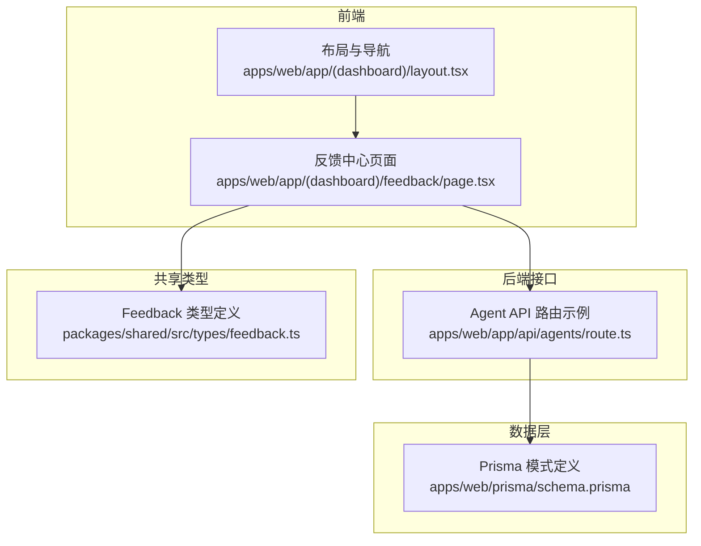
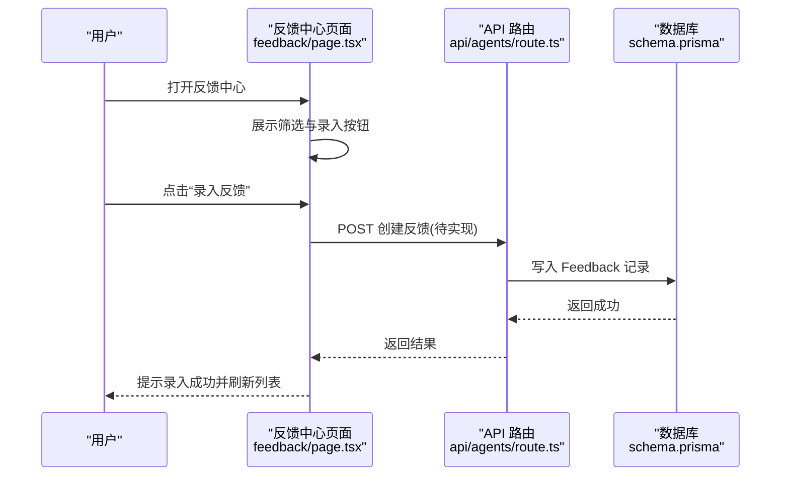
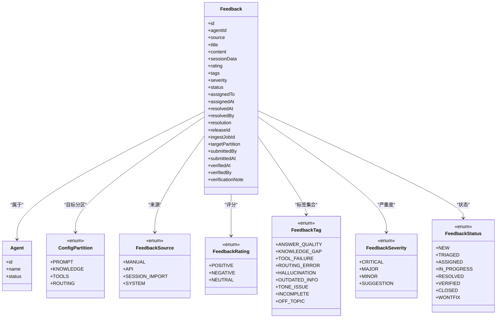
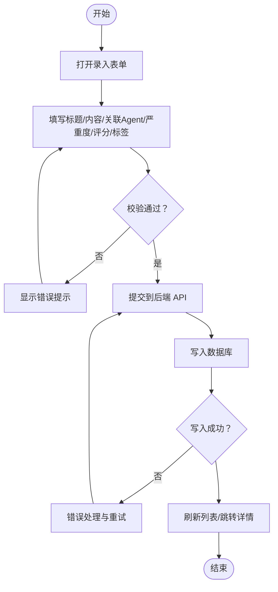
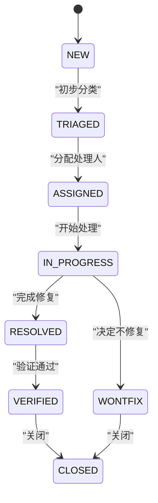
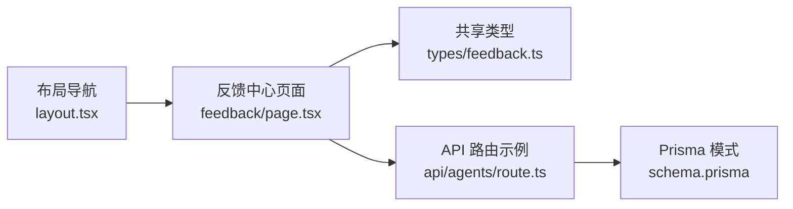

# 反馈中心

<cite>
**本文引用的文件**
- [apps/web/app/(dashboard)/feedback/page.tsx](file://apps/web/app/(dashboard)/feedback/page.tsx)
- [apps/web/app/(dashboard)/layout.tsx](file://apps/web/app/(dashboard)/layout.tsx)
- [apps/web/prisma/schema.prisma](file://apps/web/prisma/schema.prisma)
- [packages/shared/src/types/feedback.ts](file://packages/shared/src/types/feedback.ts)
- [apps/web/app/api/agents/route.ts](file://apps/web/app/api/agents/route.ts)
</cite>

## 目录
1. [简介](#简介)
2. [项目结构](#项目结构)
3. [核心组件](#核心组件)
4. [架构总览](#架构总览)
5. [详细组件分析](#详细组件分析)
6. [依赖分析](#依赖分析)
7. [性能考虑](#性能考虑)
8. [故障排查指南](#故障排查指南)
9. [结论](#结论)
10. [附录](#附录)

## 简介
本文件为“反馈中心”的完整产品与实现文档，覆盖用户反馈的收集、分类、处理与分析全流程。内容包含：
- 反馈类型定义、优先级（严重度）设置与状态管理
- 反馈录入界面使用说明（如何添加新反馈、分类标签、关联 Agent）
- 反馈处理工作流（分配、解决、关闭）
- 统计分析与效果追踪能力说明
- 团队协作功能（多人处理与评论机制）
- 数据导出与报告生成说明
- 面向产品经理的业务流程说明，以及面向开发者的数据处理与集成技术细节

## 项目结构
反馈中心在应用中的入口与导航如下：
- 侧边栏导航中包含“反馈中心”，点击后进入 /feedback 页面
- 反馈中心页面提供“录入反馈”按钮与基础筛选（全部、待处理、处理中、已解决）
- 数据库模型与枚举定义位于 Prisma Schema，前端共享类型定义位于 packages/shared

图表来源
- [apps/web/app/(dashboard)/layout.tsx:1-48](file://apps/web/app/(dashboard)/layout.tsx#L1-L48)
- [apps/web/app/(dashboard)/feedback/page.tsx:1-30](file://apps/web/app/(dashboard)/feedback/page.tsx#L1-L30)
- [apps/web/app/api/agents/route.ts:1-18](file://apps/web/app/api/agents/route.ts#L1-L18)
- [apps/web/prisma/schema.prisma:220-292](file://apps/web/prisma/schema.prisma#L220-L292)
- [packages/shared/src/types/feedback.ts:1-62](file://packages/shared/src/types/feedback.ts#L1-L62)

章节来源
- [apps/web/app/(dashboard)/layout.tsx:1-48](file://apps/web/app/(dashboard)/layout.tsx#L1-L48)
- [apps/web/app/(dashboard)/feedback/page.tsx:1-30](file://apps/web/app/(dashboard)/feedback/page.tsx#L1-L30)

## 核心组件
- 反馈中心页面：提供标题、录入按钮、筛选按钮与列表占位区域
- 反馈数据模型：包含来源、标题、内容、评分、标签、严重度、状态、处理人、时间戳、验证信息等字段
- 共享类型：在前端统一约束反馈相关的数据结构与枚举值
- 导航布局：将“反馈中心”纳入工作台侧边栏，便于快速访问

章节来源
- [apps/web/app/(dashboard)/feedback/page.tsx:1-30](file://apps/web/app/(dashboard)/feedback/page.tsx#L1-L30)
- [apps/web/prisma/schema.prisma:220-292](file://apps/web/prisma/schema.prisma#L220-L292)
- [packages/shared/src/types/feedback.ts:1-62](file://packages/shared/src/types/feedback.ts#L1-L62)
- [apps/web/app/(dashboard)/layout.tsx:1-48](file://apps/web/app/(dashboard)/layout.tsx#L1-L48)

## 架构总览
反馈中心采用前后端分离架构：
- 前端通过 Next.js 页面渲染反馈中心 UI，并预留与后端交互的扩展点
- 后端以 Next.js Route Handler 形式暴露 API（当前示例为 Agent API，可复用相同模式扩展反馈 API）
- 数据持久化使用 PostgreSQL，通过 Prisma ORM 进行建模与查询
- 共享类型包确保前后端对反馈数据结构的一致性

图表来源
- [apps/web/app/(dashboard)/feedback/page.tsx:1-30](file://apps/web/app/(dashboard)/feedback/page.tsx#L1-L30)
- [apps/web/app/api/agents/route.ts:1-18](file://apps/web/app/api/agents/route.ts#L1-L18)
- [apps/web/prisma/schema.prisma:220-292](file://apps/web/prisma/schema.prisma#L220-L292)

## 详细组件分析

### 反馈中心页面（UI 与交互）
- 页面标题与操作区：显示“反馈中心”标题与“录入反馈”按钮
- 筛选区：提供“全部、待处理、处理中、已解决”等快捷筛选
- 列表区：当前为占位内容，后续接入数据源后可展示反馈条目
- 建议扩展：
  - 增加分页、排序、搜索
  - 支持按严重度、标签、提交时间筛选
  - 点击条目进入详情与处理面板

章节来源
- [apps/web/app/(dashboard)/feedback/page.tsx:1-30](file://apps/web/app/(dashboard)/feedback/page.tsx#L1-L30)

### 反馈数据模型与枚举（数据库与类型）
- 实体关系：Feedback 与 Agent 一对多；Feedback 可关联 Release、IngestJob 等
- 关键字段：
  - 来源 source：MANUAL、API、SESSION_IMPORT、SYSTEM
  - 评分 rating：POSITIVE、NEGATIVE、NEUTRAL
  - 标签 tags：ANSWER_QUALITY、KNOWLEDGE_GAP、TOOL_FAILURE、ROUTING_ERROR、HALLUCINATION、OUTDATED_INFO、TONE_ISSUE、INCOMPLETE、OFF_TOPIC
  - 严重度 severity：CRITICAL、MAJOR、MINOR、SUGGESTION
  - 状态 status：NEW、TRIAGED、ASSIGNED、IN_PROGRESS、RESOLVED、VERIFIED、CLOSED、WONTFIX
  - 处理信息：assignedTo、assignedAt、resolvedBy、resolvedAt、resolution
  - 验证信息：verifiedBy、verifiedAt、verificationNote
  - 目标分区 targetPartition：PROMPT、KNOWLEDGE、TOOLS、ROUTING
- 索引优化：针对 agentId+status、submittedAt、severity+status 建立索引以提升查询性能

图表来源
- [apps/web/prisma/schema.prisma:220-292](file://apps/web/prisma/schema.prisma#L220-L292)
- [packages/shared/src/types/feedback.ts:1-62](file://packages/shared/src/types/feedback.ts#L1-L62)

章节来源
- [apps/web/prisma/schema.prisma:220-292](file://apps/web/prisma/schema.prisma#L220-L292)
- [packages/shared/src/types/feedback.ts:1-62](file://packages/shared/src/types/feedback.ts#L1-L62)

### 反馈录入流程（新增反馈）
- 触发入口：反馈中心页面的“录入反馈”按钮
- 表单字段建议：
  - 必填：标题、内容、关联 Agent、严重度、评分、标签
  - 可选：来源、会话数据、目标分区、备注
- 提交动作：调用后端 API 创建反馈记录，成功后刷新列表或跳转详情页

[本节为概念流程图，不直接映射具体代码文件]

### 反馈处理工作流（分配、解决、关闭）
- 状态流转：NEW → TRIAGED → ASSIGNED → IN_PROGRESS → RESOLVED → VERIFIED → CLOSED
- 分支处理：WONTFIX 表示不修复，可直接关闭
- 关键操作：
  - 分派：设置 assignedTo、assignedAt
  - 解决：填写 resolution、resolvedBy、resolvedAt，状态置为 RESOLVED
  - 验证：由验证人填写 verificationNote、verifiedBy、verifiedAt，状态置为 VERIFIED
  - 关闭：状态置为 CLOSED；若决定不修复，置为 WONTFIX

图表来源
- [apps/web/prisma/schema.prisma:283-292](file://apps/web/prisma/schema.prisma#L283-L292)

章节来源
- [apps/web/prisma/schema.prisma:220-292](file://apps/web/prisma/schema.prisma#L220-L292)

### 统计分析与效果追踪
- 指标维度：
  - 数量：按状态、严重度、标签、来源、Agent 分组统计
  - 时效：平均处理时长、首次响应时长、解决时长
  - 质量：验证通过率、重复问题率、回归率
- 效果追踪：
  - 将反馈与 Release 关联，评估发布后的改善情况
  - 结合 AgentVersion 的版本快照，对比不同版本的反馈趋势
- 可视化建议：
  - 仪表盘：待处理数、近7天新增、解决率、Top 标签
  - 趋势图：按周/月统计反馈量与解决率
  - 漏斗图：从 NEW 到 CLOSED 的转化比例

[本节为概念性说明，不直接映射具体代码文件]

### 团队协作（多人处理与评论）
- 协作角色：
  - 提交者：发起反馈
  - 处理人：负责推进状态流转与修复
  - 验证人：验证修复效果并记录验证意见
  - 管理员：配置权限与全局策略
- 评论机制：
  - 建议在 Feedback 上扩展 Comments 表，记录处理过程中的讨论与决策
  - 审计日志 AuditLog 可用于追踪关键操作与变更

章节来源
- [apps/web/prisma/schema.prisma:607-625](file://apps/web/prisma/schema.prisma#L607-L625)

### 数据导出与报告生成
- 导出范围：
  - 原始数据：按筛选条件导出 CSV/JSON
  - 汇总报表：按周期、Agent、标签、严重度聚合
- 报告内容：
  - 概览：总量、状态分布、严重度分布
  - 趋势：时间序列变化
  - 归因：Top 标签与高频问题
  - 改进：与 Release 和版本快照的关联分析
- 自动化：
  - 定时任务生成周报/月报
  - 邮件或站内消息推送给相关人员

[本节为概念性说明，不直接映射具体代码文件]

## 依赖分析
- 前端依赖：
  - 页面组件依赖布局导航，形成统一的后台体验
  - 共享类型用于保证前后端数据结构一致
- 后端依赖：
  - 当前示例 API 路由展示了 Next.js Route Handler 的使用方式，可作为反馈 API 的实现模板
- 数据依赖：
  - Prisma 模式定义了反馈相关的实体与索引，支撑高效查询与事务处理

图表来源
- [apps/web/app/(dashboard)/feedback/page.tsx:1-30](file://apps/web/app/(dashboard)/feedback/page.tsx#L1-L30)
- [packages/shared/src/types/feedback.ts:1-62](file://packages/shared/src/types/feedback.ts#L1-L62)
- [apps/web/app/api/agents/route.ts:1-18](file://apps/web/app/api/agents/route.ts#L1-L18)
- [apps/web/prisma/schema.prisma:220-292](file://apps/web/prisma/schema.prisma#L220-L292)
- [apps/web/app/(dashboard)/layout.tsx:1-48](file://apps/web/app/(dashboard)/layout.tsx#L1-L48)

章节来源
- [apps/web/app/(dashboard)/layout.tsx:1-48](file://apps/web/app/(dashboard)/layout.tsx#L1-L48)
- [apps/web/app/(dashboard)/feedback/page.tsx:1-30](file://apps/web/app/(dashboard)/feedback/page.tsx#L1-L30)
- [apps/web/app/api/agents/route.ts:1-18](file://apps/web/app/api/agents/route.ts#L1-L18)
- [apps/web/prisma/schema.prisma:220-292](file://apps/web/prisma/schema.prisma#L220-L292)
- [packages/shared/src/types/feedback.ts:1-62](file://packages/shared/src/types/feedback.ts#L1-L62)

## 性能考虑
- 数据库索引：
  - 针对常用查询组合建立复合索引，如 (agentId, status)、(severity, status)、(submittedAt)
- 分页与懒加载：
  - 列表页采用分页与滚动加载，减少首屏数据量
- 缓存策略：
  - 对热点统计指标使用短期缓存，降低频繁聚合计算的压力
- 批量操作：
  - 批量更新状态或批量导出时，使用事务与分批写入避免锁竞争

[本节为通用性能建议，不直接映射具体代码文件]

## 故障排查指南
- 常见问题定位：
  - 无法录入反馈：检查 API 路由是否实现、鉴权是否通过、数据库连接是否正常
  - 状态未更新：确认状态机逻辑是否正确执行，是否存在并发冲突
  - 统计不准确：核对筛选条件与聚合逻辑，检查索引是否命中
- 调试手段：
  - 启用请求日志与错误堆栈
  - 使用审计日志追踪关键操作
  - 对慢查询进行分析与优化

章节来源
- [apps/web/prisma/schema.prisma:607-625](file://apps/web/prisma/schema.prisma#L607-L625)

## 结论
反馈中心围绕“采集—分类—处理—验证—关闭”的闭环设计，结合严格的枚举与状态机、完善的索引与审计能力，既满足产品经理对流程与指标的需求，也为开发者提供了清晰的数据模型与可扩展的 API 模式。后续可在现有基础上完善前端交互、扩展评论与导出能力，并通过统计看板持续驱动 Agent 质量提升。

## 附录
- 术语说明：
  - 严重度：反映问题的影响程度，用于排障优先级
  - 标签：用于问题归类与趋势分析
  - 目标分区：指向需要改进的配置分区（Prompt/Knowledge/Tools/Routing）
- 参考路径：
  - 页面入口：apps/web/app/(dashboard)/feedback/page.tsx
  - 导航配置：apps/web/app/(dashboard)/layout.tsx
  - 数据模型：apps/web/prisma/schema.prisma
  - 共享类型：packages/shared/src/types/feedback.ts
  - API 示例：apps/web/app/api/agents/route.ts