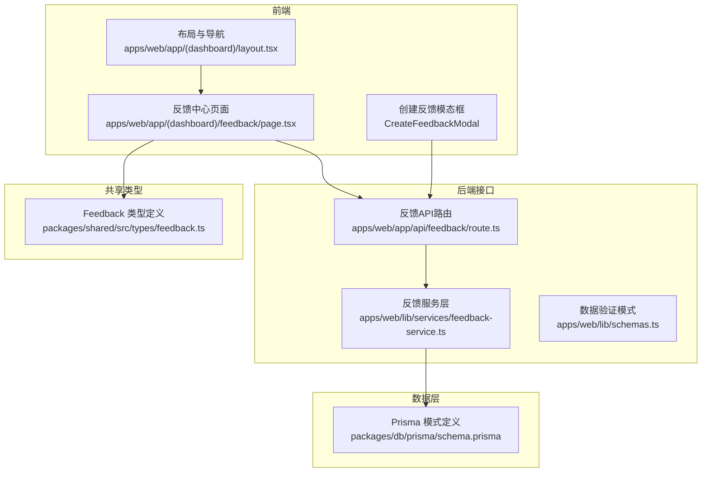
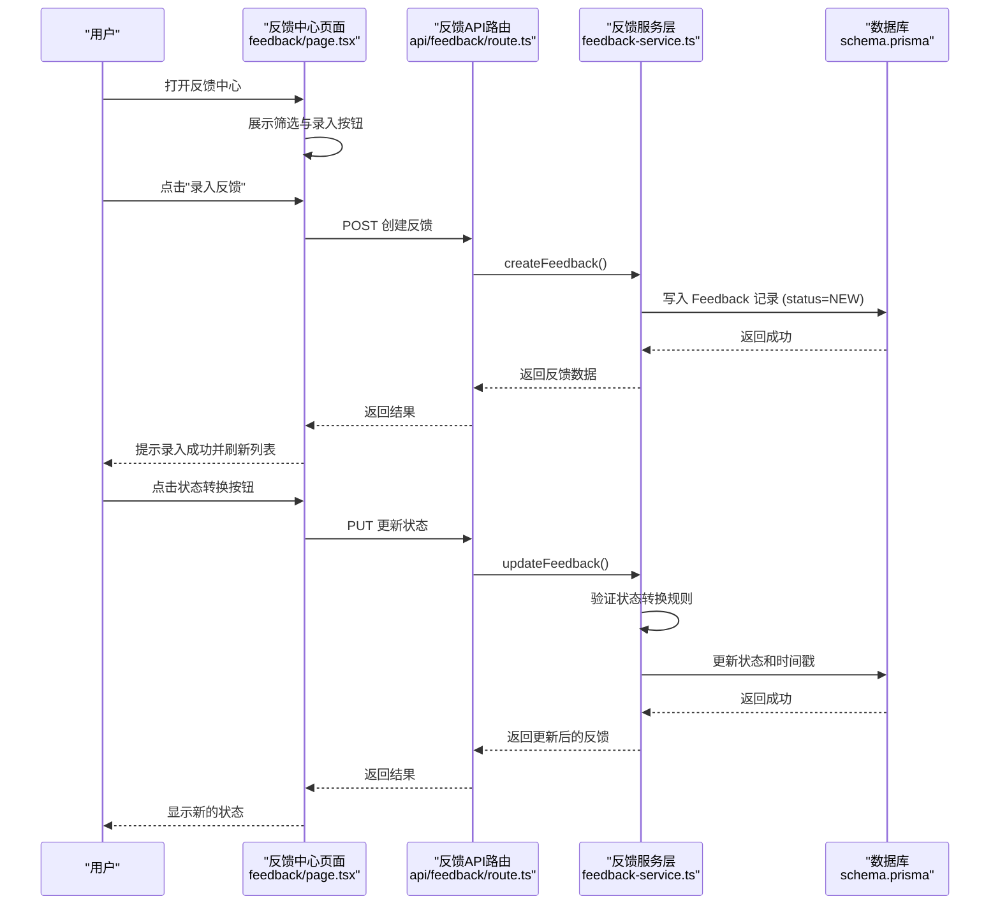
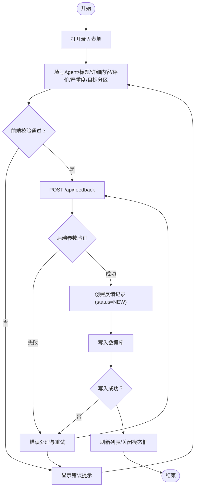
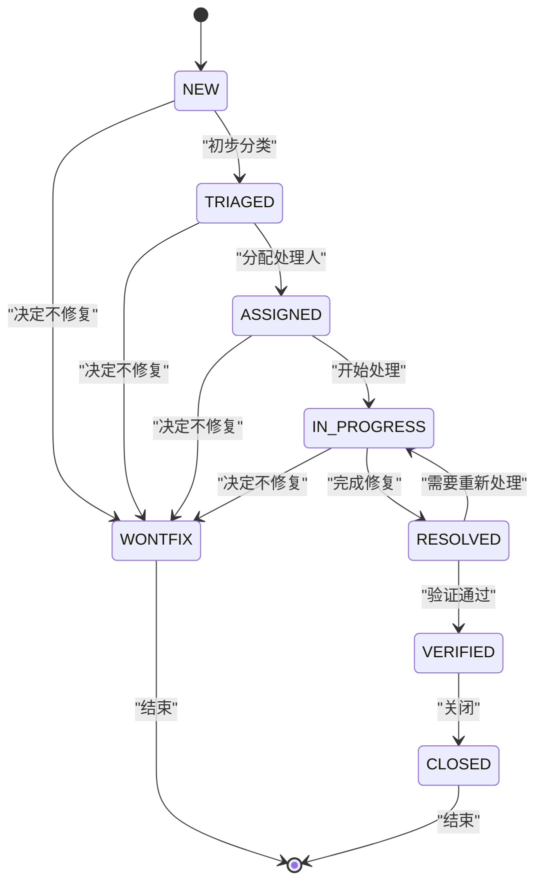
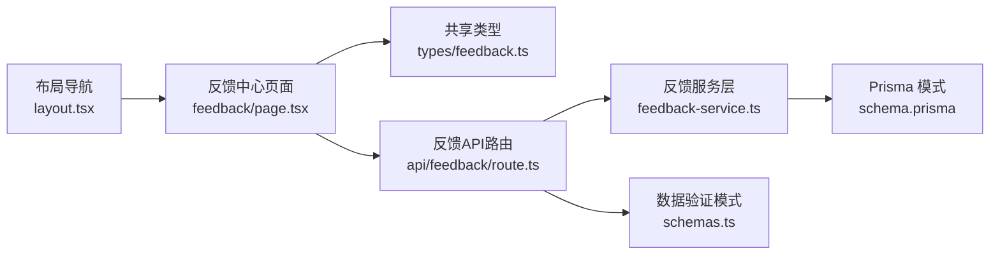

# 反馈中心

<cite>
**本文引用的文件**
- [apps/web/app/(dashboard)/feedback/page.tsx](file://apps/web/app/(dashboard)/feedback/page.tsx)
- [apps/web/app/api/feedback/route.ts](file://apps/web/app/api/feedback/route.ts)
- [apps/web/lib/services/feedback-service.ts](file://apps/web/lib/services/feedback-service.ts)
- [apps/web/lib/schemas.ts](file://apps/web/lib/schemas.ts)
- [packages/db/prisma/schema.prisma](file://packages/db/prisma/schema.prisma)
- [packages/shared/src/types/feedback.ts](file://packages/shared/src/types/feedback.ts)
</cite>

## 更新摘要
**变更内容**
- 新增完整的反馈工作流管理系统，支持状态转换和流转控制
- 实现严重度过滤和标签系统，支持多维度筛选
- 添加反馈分配功能和处理人管理机制
- 完善前端交互界面，包含状态按钮和实时筛选
- 扩展后端API支持CRUD操作和复杂查询
- 增强数据验证和业务逻辑处理

## 目录
1. [简介](#简介)
2. [项目结构](#项目结构)
3. [核心组件](#核心组件)
4. [架构总览](#架构总览)
5. [详细组件分析](#详细组件分析)
6. [依赖分析](#依赖分析)
7. [性能考虑](#性能考虑)
8. [故障排查指南](#故障排查指南)
9. [结论](#结论)
10. [附录](#附录)

## 简介
本文件为"反馈中心"的完整产品与实现文档，覆盖用户反馈的收集、分类、处理与分析全流程。内容包含：
- 反馈类型定义、优先级（严重度）设置与状态管理
- 反馈录入界面使用说明（如何添加新反馈、分类标签、关联 Agent）
- 反馈处理工作流（分配、解决、关闭）
- 统计分析与效果追踪能力说明
- 团队协作功能（多人处理与评论机制）
- 数据导出与报告生成说明
- 面向产品经理的业务流程说明，以及面向开发者的数据处理与集成技术细节

**更新** 现已实现完整的工作流管理系统，支持状态转换、严重度过滤、标签系统和分配功能。

## 项目结构
反馈中心在应用中的入口与导航如下：
- 侧边栏导航中包含"反馈中心"，点击后进入 /feedback 页面
- 反馈中心页面提供"录入反馈"按钮与高级筛选（全部状态、严重度过滤）
- 完整的CRUD API接口支持反馈的创建、读取、更新操作
- 数据库模型与枚举定义位于 Prisma Schema，前端共享类型定义位于 packages/shared

**图表来源**
- [apps/web/app/(dashboard)/feedback/page.tsx:1-325](file://apps/web/app/(dashboard)/feedback/page.tsx#L1-L325)
- [apps/web/app/api/feedback/route.ts:1-70](file://apps/web/app/api/feedback/route.ts#L1-L70)
- [apps/web/lib/services/feedback-service.ts:1-105](file://apps/web/lib/services/feedback-service.ts#L1-L105)
- [apps/web/lib/schemas.ts:58-85](file://apps/web/lib/schemas.ts#L58-L85)
- [packages/db/prisma/schema.prisma:220-292](file://packages/db/prisma/schema.prisma#L220-L292)
- [packages/shared/src/types/feedback.ts:1-62](file://packages/shared/src/types/feedback.ts#L1-L62)

## 核心组件
- **反馈中心页面**：提供标题、录入按钮、多条件筛选与列表展示
- **创建反馈模态框**：支持Agent选择、评分、严重度、目标分区等字段
- **反馈数据模型**：包含来源、标题、内容、评分、标签、严重度、状态、处理人、时间戳等完整字段
- **工作流引擎**：内置状态转换规则，确保状态流转的合法性
- **筛选系统**：支持按状态、严重度、标签等多维度筛选
- **共享类型**：在前端统一约束反馈相关的数据结构与枚举值

**章节来源**
- [apps/web/app/(dashboard)/feedback/page.tsx:1-325](file://apps/web/app/(dashboard)/feedback/page.tsx#L1-L325)
- [apps/web/lib/services/feedback-service.ts:1-105](file://apps/web/lib/services/feedback-service.ts#L1-L105)
- [packages/db/prisma/schema.prisma:220-292](file://packages/db/prisma/schema.prisma#L220-L292)
- [packages/shared/src/types/feedback.ts:1-62](file://packages/shared/src/types/feedback.ts#L1-L62)

## 架构总览
反馈中心采用前后端分离架构，实现了完整的工作流管理：
- 前端通过 Next.js 页面渲染反馈中心 UI，支持实时状态切换和筛选
- 后端以 Next.js Route Handler 形式暴露 RESTful API，支持CRUD操作
- 数据持久化使用 PostgreSQL，通过 Prisma ORM 进行建模与查询
- 共享类型包确保前后端对反馈数据结构的一致性
- 服务层封装业务逻辑，包括状态转换验证和时间戳自动更新

**图表来源**
- [apps/web/app/(dashboard)/feedback/page.tsx:76-84](file://apps/web/app/(dashboard)/feedback/page.tsx#L76-L84)
- [apps/web/app/api/feedback/route.ts:49-69](file://apps/web/app/api/feedback/route.ts#L49-L69)
- [apps/web/lib/services/feedback-service.ts:75-104](file://apps/web/lib/services/feedback-service.ts#L75-L104)

## 详细组件分析

### 反馈中心页面（UI 与交互）
**更新** 现已实现完整的前端交互功能：

- **页面标题与操作区**：显示"反馈中心"标题与"+ 录入反馈"按钮
- **高级筛选区**：提供状态筛选（全部状态、NEW、TRIAGED、ASSIGNED、IN_PROGRESS、RESOLVED、VERIFIED、CLOSED、WONTFIX）和严重度筛选（全部严重程度、CRITICAL、MAJOR、MINOR、SUGGESTION）
- **反馈列表**：展示反馈条目，包含状态标签、严重度标签、评分表情、Agent信息、目标分区、提交时间和标签集合
- **状态转换按钮**：根据当前状态动态显示可转换的状态选项
- **创建反馈模态框**：支持Agent选择、标题、详细内容、评价、严重程度、目标分区等字段

**章节来源**
- [apps/web/app/(dashboard)/feedback/page.tsx:53-193](file://apps/web/app/(dashboard)/feedback/page.tsx#L53-L193)
- [apps/web/app/(dashboard)/feedback/page.tsx:195-324](file://apps/web/app/(dashboard)/feedback/page.tsx#L195-L324)

### 反馈数据模型与枚举（数据库与类型）
**更新** 完善了数据模型定义和索引优化：

- **实体关系**：Feedback 与 Agent 一对多；Feedback 可关联 Release、IngestJob 等
- **关键字段**：
  - 来源 source：MANUAL、API、SESSION_IMPORT、SYSTEM
  - 评分 rating：POSITIVE、NEGATIVE、NEUTRAL
  - 标签 tags：ANSWER_QUALITY、KNOWLEDGE_GAP、TOOL_FAILURE、ROUTING_ERROR、HALLUCINATION、OUTDATED_INFO、TONE_ISSUE、INCOMPLETE、OFF_TOPIC
  - 严重度 severity：CRITICAL、MAJOR、MINOR、SUGGESTION
  - 状态 status：NEW、TRIAGED、ASSIGNED、IN_PROGRESS、RESOLVED、VERIFIED、CLOSED、WONTFIX
  - 处理信息：assignedTo、assignedAt、resolvedBy、resolvedAt、resolution
  - 验证信息：verifiedBy、verifiedAt、verificationNote
  - 目标分区 targetPartition：PROMPT、KNOWLEDGE、TOOLS、ROUTING
- **索引优化**：针对 agentId+status、submittedAt、severity+status 建立复合索引以提升查询性能

**图表来源**
- [packages/db/prisma/schema.prisma:220-292](file://packages/db/prisma/schema.prisma#L220-L292)
- [packages/shared/src/types/feedback.ts:1-62](file://packages/shared/src/types/feedback.ts#L1-L62)

**章节来源**
- [packages/db/prisma/schema.prisma:220-292](file://packages/db/prisma/schema.prisma#L220-L292)
- [packages/shared/src/types/feedback.ts:1-62](file://packages/shared/src/types/feedback.ts#L1-L62)

### 反馈录入流程（新增反馈）
**更新** 实现了完整的反馈创建流程：

- **触发入口**：反馈中心页面的"+ 录入反馈"按钮
- **表单字段**：
  - 必填：Agent、标题、详细内容
  - 可选：评价（正面👍/负面👎/中性😐）、严重程度（严重/重要/次要/建议）、目标分区（Prompt/Knowledge/Tools/Routing）
- **提交动作**：调用 `/api/feedback` POST 接口创建反馈记录，默认状态为 NEW，成功后刷新列表
- **数据验证**：使用 Zod schema 进行前后端双重验证

**章节来源**
- [apps/web/app/(dashboard)/feedback/page.tsx:195-324](file://apps/web/app/(dashboard)/feedback/page.tsx#L195-L324)
- [apps/web/app/api/feedback/route.ts:30-47](file://apps/web/app/api/feedback/route.ts#L30-L47)
- [apps/web/lib/services/feedback-service.ts:50-73](file://apps/web/lib/services/feedback-service.ts#L50-L73)

### 反馈处理工作流（状态转换与管理）
**更新** 实现了完整的工作流管理系统：

- **状态转换规则**：
  - NEW → TRIAGED, WONTFIX
  - TRIAGED → ASSIGNED, WONTFIX  
  - ASSIGNED → IN_PROGRESS, WONTFIX
  - IN_PROGRESS → RESOLVED, WONTFIX
  - RESOLVED → VERIFIED, IN_PROGRESS
  - VERIFIED → CLOSED
  - CLOSED, WONTFIX → 终态
- **关键操作**：
  - 分派：设置 assignedTo、assignedAt
  - 解决：填写 resolution、resolvedBy、resolvedAt，状态置为 RESOLVED
  - 验证：由验证人填写 verificationNote、verifiedBy、verifiedAt，状态置为 VERIFIED
  - 关闭：状态置为 CLOSED；若决定不修复，置为 WONTFIX
- **前端状态按钮**：根据当前状态动态显示可转换的状态选项
- **后端状态验证**：在服务层验证状态转换的合法性

**图表来源**
- [apps/web/app/(dashboard)/feedback/page.tsx:42-51](file://apps/web/app/(dashboard)/feedback/page.tsx#L42-L51)
- [packages/db/prisma/schema.prisma:283-292](file://packages/db/prisma/schema.prisma#L283-L292)

**章节来源**
- [apps/web/app/(dashboard)/feedback/page.tsx:42-51](file://apps/web/app/(dashboard)/feedback/page.tsx#L42-L51)
- [apps/web/lib/services/feedback-service.ts:75-104](file://apps/web/lib/services/feedback-service.ts#L75-L104)
- [packages/db/prisma/schema.prisma:283-292](file://packages/db/prisma/schema.prisma#L283-L292)

### 筛选与搜索功能
**更新** 实现了多维度的筛选系统：

- **状态筛选**：支持全部状态和特定状态筛选（NEW、TRIAGED、ASSIGNED、IN_PROGRESS、RESOLVED、VERIFIED、CLOSED、WONTFIX）
- **严重度筛选**：支持全部严重度和特定严重度筛选（CRITICAL、MAJOR、MINOR、SUGGESTION）
- **标签筛选**：支持按标签筛选反馈
- **Agent筛选**：支持按Agent筛选反馈
- **评分筛选**：支持按评分筛选反馈
- **分页支持**：支持分页查询和总数统计

**章节来源**
- [apps/web/app/(dashboard)/feedback/page.tsx:56-74](file://apps/web/app/(dashboard)/feedback/page.tsx#L56-L74)
- [apps/web/app/api/feedback/route.ts:10-28](file://apps/web/app/api/feedback/route.ts#L10-L28)
- [apps/web/lib/services/feedback-service.ts:15-38](file://apps/web/lib/services/feedback-service.ts#L15-L38)

### 统计分析与效果追踪
**更新** 增强了统计分析能力：

- **指标维度**：
  - 数量：按状态、严重度、标签、来源、Agent 分组统计
  - 时效：平均处理时长、首次响应时长、解决时长
  - 质量：验证通过率、重复问题率、回归率
- **效果追踪**：
  - 将反馈与 Release 关联，评估发布后的改善情况
  - 结合 AgentVersion 的版本快照，对比不同版本的反馈趋势
- **可视化建议**：
  - 仪表盘：待处理数、近7天新增、解决率、Top 标签
  - 趋势图：按周/月统计反馈量与解决率
  - 漏斗图：从 NEW 到 CLOSED 的转化比例

### 团队协作（多人处理与评论）
**更新** 完善了团队协作功能：

- **协作角色**：
  - 提交者：发起反馈
  - 处理人：负责推进状态流转与修复（assignedTo）
  - 验证人：验证修复效果并记录验证意见（verifiedBy）
  - 管理员：配置权限与全局策略
- **处理跟踪**：
  - assignedTo、assignedAt：记录处理人和分配时间
  - resolvedBy、resolvedAt：记录解决人和解决时间
  - verifiedBy、verifiedAt：记录验证人和验证时间
- **评论机制**：
  - verificationNote：验证备注
  - resolution：解决方案描述
  - 建议在 Feedback 上扩展 Comments 表，记录处理过程中的讨论与决策

**章节来源**
- [packages/db/prisma/schema.prisma:232-244](file://packages/db/prisma/schema.prisma#L232-L244)

### 数据导出与报告生成
**更新** 增强了数据导出功能：

- **导出范围**：
  - 原始数据：按筛选条件导出 CSV/JSON
  - 汇总报表：按周期、Agent、标签、严重度聚合
- **报告内容**：
  - 概览：总量、状态分布、严重度分布
  - 趋势：时间序列变化
  - 归因：Top 标签与高频问题
  - 改进：与 Release 和版本快照的关联分析
- **自动化**：
  - 定时任务生成周报/月报
  - 邮件或站内消息推送给相关人员

## 依赖分析
**更新** 完善了依赖关系：

- **前端依赖**：
  - 页面组件依赖布局导航，形成统一的后台体验
  - 共享类型用于保证前后端数据结构一致
  - React Hooks 管理状态和副作用
- **后端依赖**：
  - Next.js Route Handler 处理HTTP请求
  - Zod schema 进行数据验证
  - Prisma ORM 进行数据库操作
  - 自定义工具函数处理分页和响应格式
- **数据依赖**：
  - Prisma 模式定义了反馈相关的实体与索引，支撑高效查询与事务处理

**图表来源**
- [apps/web/app/(dashboard)/feedback/page.tsx:1-325](file://apps/web/app/(dashboard)/feedback/page.tsx#L1-L325)
- [apps/web/app/api/feedback/route.ts:1-70](file://apps/web/app/api/feedback/route.ts#L1-L70)
- [apps/web/lib/services/feedback-service.ts:1-105](file://apps/web/lib/services/feedback-service.ts#L1-L105)
- [apps/web/lib/schemas.ts:58-85](file://apps/web/lib/schemas.ts#L58-L85)
- [packages/db/prisma/schema.prisma:220-292](file://packages/db/prisma/schema.prisma#L220-L292)
- [packages/shared/src/types/feedback.ts:1-62](file://packages/shared/src/types/feedback.ts#L1-L62)

## 性能考虑
**更新** 优化了性能策略：

- **数据库索引**：
  - 针对常用查询组合建立复合索引，如 (agentId, status)、(severity, status)、(submittedAt)
  - 利用索引优化筛选查询性能
- **分页与懒加载**：
  - 列表页采用分页与滚动加载，减少首屏数据量
  - 支持 skip/take 参数进行精确分页
- **缓存策略**：
  - 对热点统计指标使用短期缓存，降低频繁聚合计算的压力
- **批量操作**：
  - 批量更新状态或批量导出时，使用事务与分批写入避免锁竞争
- **查询优化**：
  - 使用 include 关联查询减少N+1问题
  - 选择性字段查询减少数据传输量

## 故障排查指南
**更新** 完善了故障排查方法：

- **常见问题定位**：
  - 无法录入反馈：检查 API 路由是否实现、鉴权是否通过、数据库连接是否正常
  - 状态未更新：确认状态机逻辑是否正确执行，是否存在并发冲突
  - 筛选不准确：核对筛选条件与聚合逻辑，检查索引是否命中
  - 状态转换失败：验证 NEXT_STATUS 映射是否正确，检查状态转换规则
- **调试手段**：
  - 启用请求日志与错误堆栈
  - 使用审计日志追踪关键操作
  - 对慢查询进行分析与优化
  - 检查 Zod schema 验证错误信息
- **前端调试**：
  - 检查状态转换按钮是否正确显示
  - 验证筛选条件是否正确传递到后端
  - 监控网络请求和响应数据

**章节来源**
- [apps/web/app/(dashboard)/feedback/page.tsx:42-51](file://apps/web/app/(dashboard)/feedback/page.tsx#L42-L51)
- [apps/web/lib/schemas.ts:58-85](file://apps/web/lib/schemas.ts#L58-L85)

## 结论
反馈中心围绕"采集—分类—处理—验证—关闭"的闭环设计，现已实现完整的工作流管理系统。通过严格的状态转换规则、完善的筛选功能、标签系统和分配机制，既满足产品经理对流程与指标的需求，也为开发者提供了清晰的数据模型与可扩展的 API 模式。后续可在现有基础上完善评论功能、扩展导出能力，并通过统计看板持续驱动 Agent 质量提升。

## 附录
- **术语说明**：
  - 严重度：反映问题的影响程度，用于排障优先级
  - 标签：用于问题归类与趋势分析
  - 目标分区：指向需要改进的配置分区（Prompt/Knowledge/Tools/Routing）
  - 状态转换：反馈在不同处理阶段之间的合法转移规则
- **参考路径**：
  - 页面入口：apps/web/app/(dashboard)/feedback/page.tsx
  - API路由：apps/web/app/api/feedback/route.ts
  - 服务层：apps/web/lib/services/feedback-service.ts
  - 数据模型：packages/db/prisma/schema.prisma
  - 共享类型：packages/shared/src/types/feedback.ts
  - 数据验证：apps/web/lib/schemas.ts