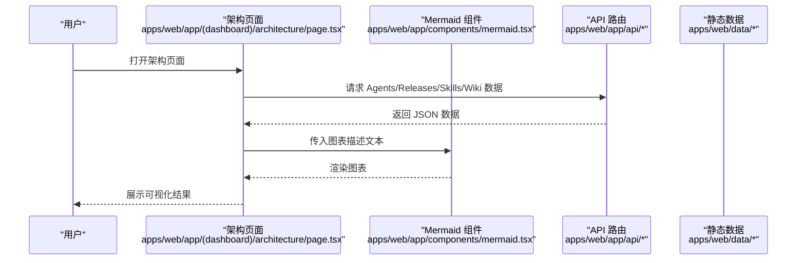
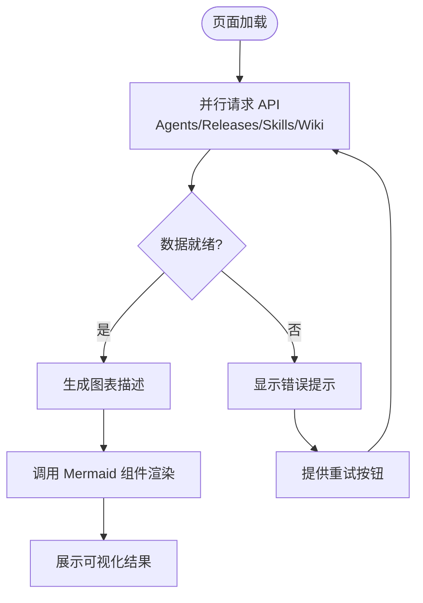
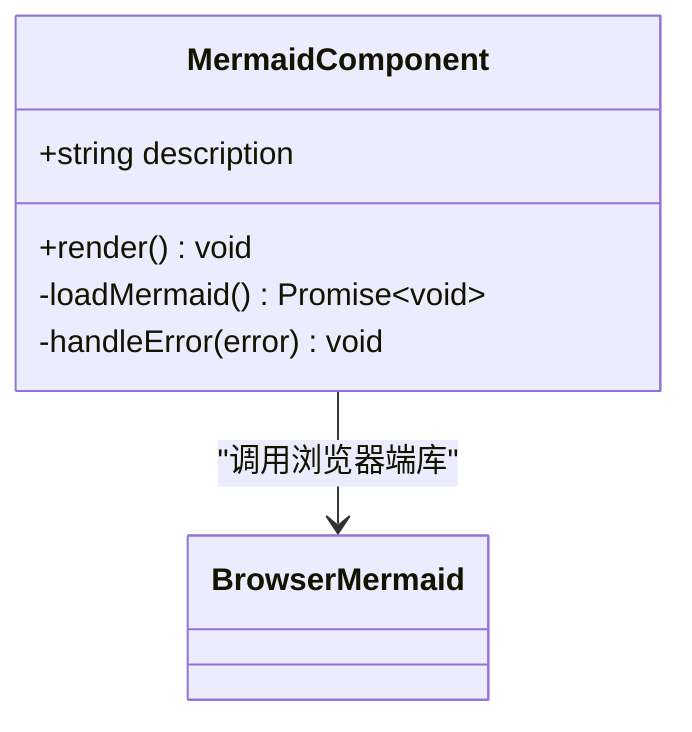
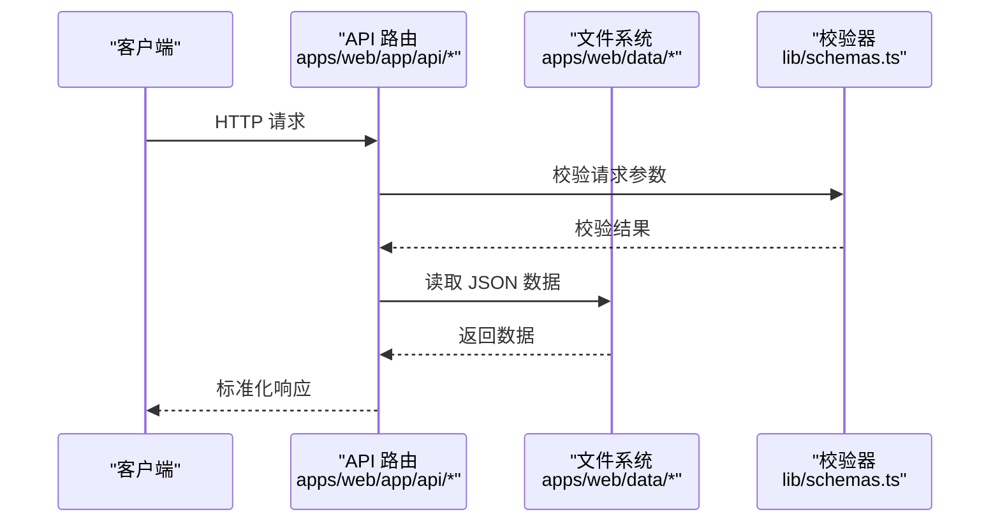
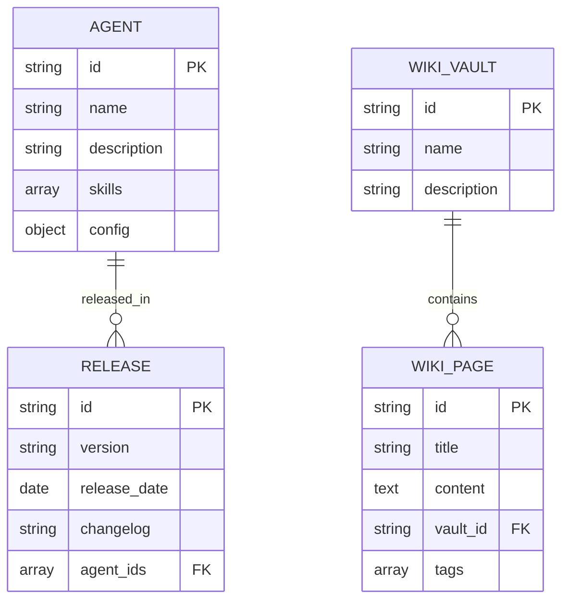
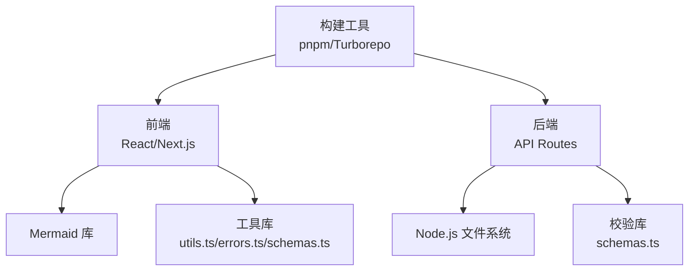

# 架构可视化系统

<cite>
**本文引用的文件**   
- [apps/web/app/(dashboard)/architecture/page.tsx](file://apps/web/app/(dashboard)/architecture/page.tsx)
- [apps/web/app/(dashboard)/architecture/_components/ui.tsx](file://apps/web/app/(dashboard)/architecture/_components/ui.tsx)
- [apps/web/app/(dashboard)/architecture/harness/page.tsx](file://apps/web/app/(dashboard)/architecture/harness/page.tsx)
- [apps/web/app/(dashboard)/architecture/loop/page.tsx](file://apps/web/app/(dashboard)/architecture/loop/page.tsx)
- [apps/web/app/(dashboard)/architecture/roadmap/page.tsx](file://apps/web/app/(dashboard)/architecture/roadmap/page.tsx)
- [apps/web/app/components/mermaid.tsx](file://apps/web/app/components/mermaid.tsx)
- [apps/web/lib/utils.ts](file://apps/web/lib/utils.ts)
- [apps/web/lib/errors.ts](file://apps/web/lib/errors.ts)
- [apps/web/lib/schemas.ts](file://apps/web/lib/schemas.ts)
- [apps/web/lib/versioning.ts](file://apps/web/lib/versioning.ts)
- [apps/web/data/agents/ecs-assistant.json](file://apps/web/data/agents/ecs-assistant.json)
- [apps/web/data/agents/rds-assistant.json](file://apps/web/data/agents/rds-assistant.json)
- [apps/web/data/releases/rel-001.json](file://apps/web/data/releases/rel-001.json)
- [apps/web/data/releases/rel-002.json](file://apps/web/data/releases/rel-002.json)
- [apps/web/data/wiki-vaults/ecs-wiki.json](file://apps/web/data/wiki-vaults/ecs-wiki.json)
- [apps/web/data/wiki-vaults/rds-wiki.json](file://apps/web/data/wiki-vaults/rds-wiki.json)
- [apps/web/data/wiki-vaults/ecs-wiki/pages/page-ecs-disk.json](file://apps/web/data/wiki-vaults/ecs-wiki/pages/page-ecs-disk.json)
- [apps/web/data/wiki-vaults/ecs-wiki/pages/page-ecs-sg.json](file://apps/web/data/wiki-vaults/ecs-wiki/pages/page-ecs-sg.json)
- [apps/web/data/wiki-vaults/ecs-wiki/pages/page-ecs-ssh.json](file://apps/web/data/wiki-vaults/ecs-wiki/pages/page-ecs-ssh.json)
- [apps/web/data/wiki-vaults/rds-wiki/pages/page-rds-conn.json](file://apps/web/data/wiki-vaults/rds-wiki/pages/page-rds-conn.json)
- [apps/web/app/api/dashboard/route.ts](file://apps/web/app/api/dashboard/route.ts)
- [apps/web/app/api/agents/route.ts](file://apps/web/app/api/agents/route.ts)
- [apps/web/app/api/releases/route.ts](file://apps/web/app/api/releases/route.ts)
- [apps/web/app/api/skills/route.ts](file://apps/web/app/api/skills/route.ts)
- [apps/web/app/api/wiki/vaults/route.ts](file://apps/web/app/api/wiki/vaults/route.ts)
- [apps/web/app/api/wiki/pages/[id]/route.ts](file://apps/web/app/api/wiki/pages/[id]/route.ts)
- [apps/web/app/api/settings/roles/route.ts](file://apps/web/app/api/settings/roles/route.ts)
- [apps/web/app/api/settings/product-groups/route.ts](file://apps/web/app/api/settings/product-groups/route.ts)
- [apps/web/app/api/settings/permissions/route.ts](file://apps/web/app/api/settings/permissions/route.ts)
- [apps/web/app/api/settings/audit-logs/route.ts](file://apps/web/app/api/settings/audit-logs/route.ts)
- [apps/web/app/api/auth/login/route.ts](file://apps/web/app/api/auth/login/route.ts)
- [apps/web/app/api/feedback/route.ts](file://apps/web/app/api/feedback/route.ts)
- [apps/web/app/(dashboard)/layout.tsx](file://apps/web/app/(dashboard)/layout.tsx)
- [apps/web/app/layout.tsx](file://apps/web/app/layout.tsx)
- [apps/web/app/page.tsx](file://apps/web/app/page.tsx)
- [apps/web/next.config.ts](file://apps/web/next.config.ts)
- [package.json](file://package.json)
- [turbo.json](file://turbo.json)
- [docs/reports/2026-07-31-project-evaluation-and-industry-gap-analysis.md](file://docs/reports/2026-07-31-project-evaluation-and-industry-gap-analysis.md)
</cite>

## 更新摘要
**所做更改**
- 增强了架构总览页面，集成了完整的四分区配置模型展示
- 添加了详细的成熟度评估表和八维评分体系
- 整合了行业最佳实践差距分析内容
- 新增了 Agent 配置卡分区的详细视觉流程图
- 更新了关键发现关于手动智力劳动要求的分析

## 目录
1. [简介](#简介)
2. [项目结构](#项目结构)
3. [核心组件](#核心组件)
4. [架构总览](#架构总览)
5. [详细组件分析](#详细组件分析)
6. [依赖分析](#依赖分析)
7. [性能考虑](#性能考虑)
8. [故障排查指南](#故障排查指南)
9. [结论](#结论)
10. [附录](#附录)

## 简介
本仓库是一个基于 Next.js 的架构可视化与协作平台，聚焦于"架构"模块的可视化呈现、版本发布管理、技能（Skills）编排、知识库（Wiki）管理与设置权限等能力。前端采用 App Router 组织页面与路由，后端通过 API Routes 提供数据接口，静态数据以 JSON 形式存放于 data 目录，并通过 Mermaid 进行图表渲染。整体采用 Monorepo 结构，使用 pnpm 工作区与 Turborepo 进行构建与任务编排。

**更新** 现已集成完整的四分区配置模型、成熟度评估体系和行业差距分析，为 AgentUp 平台提供了全面的架构可视化能力。

## 项目结构
- 应用入口与布局
  - 根布局与页面：[apps/web/app/layout.tsx](file://apps/web/app/layout.tsx)、[apps/web/app/page.tsx](file://apps/web/app/page.tsx)
  - 仪表板布局：[apps/web/app/(dashboard)/layout.tsx](file://apps/web/app/(dashboard)/layout.tsx)
- 架构可视化页面
  - 主入口：[apps/web/app/(dashboard)/architecture/page.tsx](file://apps/web/app/(dashboard)/architecture/page.tsx)
  - 子页面：harness、loop、roadmap 等
  - UI 组件：[apps/web/app/(dashboard)/architecture/_components/ui.tsx](file://apps/web/app/(dashboard)/architecture/_components/ui.tsx)
- 图表渲染
  - Mermaid 组件封装：[apps/web/app/components/mermaid.tsx](file://apps/web/app/components/mermaid.tsx)
- 数据层
  - 静态数据：data/agents、data/releases、data/wiki-vaults 等
- 服务端接口
  - API Routes：api/dashboard、api/agents、api/releases、api/skills、api/wiki、api/settings、api/auth、api/feedback 等
- 配置与工具
  - Next 配置：[apps/web/next.config.ts](file://apps/web/next.config.ts)
  - 工具库：lib/utils.ts、lib/errors.ts、lib/schemas.ts、lib/versioning.ts
  - 工作区与构建：pnpm-workspace.yaml、turbo.json、package.json

```mermaid
graph TB
subgraph "Next.js 应用"
RootLayout["根布局<br/>apps/web/app/layout.tsx"]
DashboardLayout["仪表板布局<br/>apps/web/app/(dashboard)/layout.tsx"]
ArchitecturePage["架构页<br/>apps/web/app/(dashboard)/architecture/page.tsx"]
MermaidComp["Mermaid 组件<br/>apps/web/app/components/mermaid.tsx"]
end
subgraph "API 路由"
API_Dashboard["Dashboard API<br/>apps/web/app/api/dashboard/route.ts"]
API_Agents["Agents API<br/>apps/web/app/api/agents/route.ts"]
API_Releases["Releases API<br/>apps/web/app/api/releases/route.ts"]
API_Skills["Skills API<br/>apps/web/app/api/skills/route.ts"]
API_WikiVaults["Wiki Vaults API<br/>apps/web/app/api/wiki/vaults/route.ts"]
API_WikiPages["Wiki Pages API<br/>apps/web/app/api/wiki/pages/[id]/route.ts"]
API_SettingsRoles["Settings Roles API<br/>apps/web/app/api/settings/roles/route.ts"]
API_SettingsProductGroups["Settings Product Groups API<br/>apps/web/app/api/settings/product-groups/route.ts"]
API_SettingsPermissions["Settings Permissions API<br/>apps/web/app/api/settings/permissions/route.ts"]
API_SettingsAuditLogs["Settings Audit Logs API<br/>apps/web/app/api/settings/audit-logs/route.ts"]
API_AuthLogin["Auth Login API<br/>apps/web/app/api/auth/login/route.ts"]
API_Feedback["Feedback API<br/>apps/web/app/api/feedback/route.ts"]
end
subgraph "静态数据"
Data_Agents["Agents JSON<br/>apps/web/data/agents/*.json"]
Data_Releases["Releases JSON<br/>apps/web/data/releases/*.json"]
Data_WikiVaults["Wiki Vaults JSON<br/>apps/web/data/wiki-vaults/*.json"]
Data_WikiPages["Wiki Pages JSON<br/>apps/web/data/wiki-vaults/*/pages/*.json"]
end
ArchitecturePage --> MermaidComp
ArchitecturePage --> API_Dashboard
ArchitecturePage --> API_Agents
ArchitecturePage --> API_Releases
ArchitecturePage --> API_Skills
ArchitecturePage --> API_WikiVaults
ArchitecturePage --> API_WikiPages
ArchitecturePage --> Data_Agents
ArchitecturePage --> Data_Releases
ArchitecturePage --> Data_WikiVaults
ArchitecturePage --> Data_WikiPages
```

**图示来源** 
- [apps/web/app/(dashboard)/architecture/page.tsx](file://apps/web/app/(dashboard)/architecture/page.tsx)
- [apps/web/app/components/mermaid.tsx](file://apps/web/app/components/mermaid.tsx)
- [apps/web/app/api/dashboard/route.ts](file://apps/web/app/api/dashboard/route.ts)
- [apps/web/app/api/agents/route.ts](file://apps/web/app/api/agents/route.ts)
- [apps/web/app/api/releases/route.ts](file://apps/web/app/api/releases/route.ts)
- [apps/web/app/api/skills/route.ts](file://apps/web/app/api/skills/route.ts)
- [apps/web/app/api/wiki/vaults/route.ts](file://apps/web/app/api/wiki/vaults/route.ts)
- [apps/web/app/api/wiki/pages/[id]/route.ts](file://apps/web/app/api/wiki/pages/[id]/route.ts)
- [apps/web/data/agents/ecs-assistant.json](file://apps/web/data/agents/ecs-assistant.json)
- [apps/web/data/releases/rel-001.json](file://apps/web/data/releases/rel-001.json)
- [apps/web/data/wiki-vaults/ecs-wiki.json](file://apps/web/data/wiki-vaults/ecs-wiki.json)
- [apps/web/data/wiki-vaults/ecs-wiki/pages/page-ecs-disk.json](file://apps/web/data/wiki-vaults/ecs-wiki/pages/page-ecs-disk.json)

**章节来源**
- [apps/web/app/layout.tsx](file://apps/web/app/layout.tsx)
- [apps/web/app/(dashboard)/layout.tsx](file://apps/web/app/(dashboard)/layout.tsx)
- [apps/web/app/(dashboard)/architecture/page.tsx](file://apps/web/app/(dashboard)/architecture/page.tsx)
- [apps/web/app/components/mermaid.tsx](file://apps/web/app/components/mermaid.tsx)

## 核心组件
- 架构可视化页面
  - 负责聚合各子视图（harness、loop、roadmap），并协调数据加载与状态展示。
  - 通过 API 路由获取 Agents、Releases、Skills、Wiki 等数据，驱动界面更新。
  - **新增** 集成了四分区配置模型的完整展示和成熟度评估体系。
- Mermaid 组件
  - 封装 Mermaid 渲染逻辑，支持在浏览器端将文本描述转换为图表。
  - 提供错误边界与降级处理，确保渲染失败时不影响整体体验。
- 工具与校验
  - utils.ts：通用工具函数（如格式化、ID 生成、URL 处理等）。
  - errors.ts：统一错误类型与处理策略。
  - schemas.ts：数据结构校验（Zod 或类似库），保障前后端数据一致性。
  - versioning.ts：版本管理逻辑，用于 Releases 与变更追踪。

**章节来源**
- [apps/web/app/(dashboard)/architecture/page.tsx](file://apps/web/app/(dashboard)/architecture/page.tsx)
- [apps/web/app/components/mermaid.tsx](file://apps/web/app/components/mermaid.tsx)
- [apps/web/lib/utils.ts](file://apps/web/lib/utils.ts)
- [apps/web/lib/errors.ts](file://apps/web/lib/errors.ts)
- [apps/web/lib/schemas.ts](file://apps/web/lib/schemas.ts)
- [apps/web/lib/versioning.ts](file://apps/web/lib/versioning.ts)

## 架构总览
系统采用前后端分离的 Next.js 应用模式：
- 前端：App Router 组织页面与组件，Mermaid 负责图表渲染。
- 后端：API Routes 暴露 RESTful 接口，读取静态 JSON 数据并提供查询与操作能力。
- 数据：JSON 文件作为轻量级数据源，便于演示与快速迭代。
- 构建：Turborepo 统一管理多包任务，pnpm 工作区提升安装与构建效率。

**更新** 架构总览现已包含完整的三层 Loop 设计、四分区配置模型、功能完整性评分和行业差距分析，形成了全面的架构可视化体系。

**图示来源** 
- [apps/web/app/(dashboard)/architecture/page.tsx](file://apps/web/app/(dashboard)/architecture/page.tsx)
- [apps/web/app/components/mermaid.tsx](file://apps/web/app/components/mermaid.tsx)
- [apps/web/app/api/agents/route.ts](file://apps/web/app/api/agents/route.ts)
- [apps/web/app/api/releases/route.ts](file://apps/web/app/api/releases/route.ts)
- [apps/web/app/api/skills/route.ts](file://apps/web/app/api/skills/route.ts)
- [apps/web/app/api/wiki/vaults/route.ts](file://apps/web/app/api/wiki/vaults/route.ts)
- [apps/web/data/agents/ecs-assistant.json](file://apps/web/data/agents/ecs-assistant.json)
- [apps/web/data/releases/rel-001.json](file://apps/web/data/releases/rel-001.json)
- [apps/web/data/wiki-vaults/ecs-wiki.json](file://apps/web/data/wiki-vaults/ecs-wiki.json)

## 详细组件分析

### 架构页面（Architecture Page）
- 职责
  - 聚合子视图（harness、loop、roadmap）并提供导航。
  - 调用 API 获取 Agents、Releases、Skills、Wiki 数据。
  - 将数据传递给 Mermaid 组件进行渲染。
  - **新增** 展示四分区配置模型、成熟度评估和行业差距分析。
- 关键流程
  - 页面初始化时并行请求多个 API。
  - 根据返回数据动态生成图表描述。
  - 错误时显示友好提示并允许重试。

**更新** 架构页面现在包含了完整的四分区配置模型可视化，展示了 Prompt、Knowledge、Tools、Routing 四个分区的详细内容和关系。

**图示来源** 
- [apps/web/app/(dashboard)/architecture/page.tsx](file://apps/web/app/(dashboard)/architecture/page.tsx)
- [apps/web/app/components/mermaid.tsx](file://apps/web/app/components/mermaid.tsx)

**章节来源**
- [apps/web/app/(dashboard)/architecture/page.tsx](file://apps/web/app/(dashboard)/architecture/page.tsx)
- [apps/web/app/(dashboard)/architecture/_components/ui.tsx](file://apps/web/app/(dashboard)/architecture/_components/ui.tsx)

### Mermaid 组件（Mermaid Component）
- 职责
  - 接收图表描述文本，调用 Mermaid 库进行渲染。
  - 处理渲染异常，提供降级方案（如显示原始文本）。
- 关键点
  - 异步加载 Mermaid 资源，避免阻塞首屏。
  - 支持主题切换与尺寸自适应。

**图示来源** 
- [apps/web/app/components/mermaid.tsx](file://apps/web/app/components/mermaid.tsx)

**章节来源**
- [apps/web/app/components/mermaid.tsx](file://apps/web/app/components/mermaid.tsx)

### API 路由（API Routes）
- 设计原则
  - 按功能域划分路由（agents、releases、skills、wiki、settings、auth、feedback）。
  - 统一错误处理与响应格式。
  - 读取静态 JSON 数据，提供查询与简单 CRUD。
- 典型流程
  - 接收请求参数，校验输入。
  - 读取对应 JSON 文件，过滤/转换数据。
  - 返回标准化 JSON 响应。

**图示来源** 
- [apps/web/app/api/agents/route.ts](file://apps/web/app/api/agents/route.ts)
- [apps/web/app/api/releases/route.ts](file://apps/web/app/api/releases/route.ts)
- [apps/web/app/api/skills/route.ts](file://apps/web/app/api/skills/route.ts)
- [apps/web/app/api/wiki/vaults/route.ts](file://apps/web/app/api/wiki/vaults/route.ts)
- [apps/web/lib/schemas.ts](file://apps/web/lib/schemas.ts)

**章节来源**
- [apps/web/app/api/agents/route.ts](file://apps/web/app/api/agents/route.ts)
- [apps/web/app/api/releases/route.ts](file://apps/web/app/api/releases/route.ts)
- [apps/web/app/api/skills/route.ts](file://apps/web/app/api/skills/route.ts)
- [apps/web/app/api/wiki/vaults/route.ts](file://apps/web/app/api/wiki/vaults/route.ts)
- [apps/web/app/api/wiki/pages/[id]/route.ts](file://apps/web/app/api/wiki/pages/[id]/route.ts)
- [apps/web/app/api/settings/roles/route.ts](file://apps/web/app/api/settings/roles/route.ts)
- [apps/web/app/api/settings/product-groups/route.ts](file://apps/web/app/api/settings/product-groups/route.ts)
- [apps/web/app/api/settings/permissions/route.ts](file://apps/web/app/api/settings/permissions/route.ts)
- [apps/web/app/api/settings/audit-logs/route.ts](file://apps/web/app/api/settings/audit-logs/route.ts)
- [apps/web/app/api/auth/login/route.ts](file://apps/web/app/api/auth/login/route.ts)
- [apps/web/app/api/feedback/route.ts](file://apps/web/app/api/feedback/route.ts)

### 静态数据模型（Static Data Models）
- Agents
  - 示例：ecs-assistant.json、rds-assistant.json
  - 字段：名称、描述、技能列表、配置等
- Releases
  - 示例：rel-001.json、rel-002.json
  - 字段：版本号、发布日期、变更说明、关联 Agent 等
- Wiki Vaults & Pages
  - 示例：ecs-wiki.json、rds-wiki.json
  - 页面：page-ecs-disk.json、page-ecs-sg.json、page-ecs-ssh.json、page-rds-conn.json
  - 字段：标题、内容、标签、关联 Vault 等

**图示来源** 
- [apps/web/data/agents/ecs-assistant.json](file://apps/web/data/agents/ecs-assistant.json)
- [apps/web/data/agents/rds-assistant.json](file://apps/web/data/agents/rds-assistant.json)
- [apps/web/data/releases/rel-001.json](file://apps/web/data/releases/rel-001.json)
- [apps/web/data/releases/rel-002.json](file://apps/web/data/releases/rel-002.json)
- [apps/web/data/wiki-vaults/ecs-wiki.json](file://apps/web/data/wiki-vaults/ecs-wiki.json)
- [apps/web/data/wiki-vaults/rds-wiki.json](file://apps/web/data/wiki-vaults/rds-wiki.json)
- [apps/web/data/wiki-vaults/ecs-wiki/pages/page-ecs-disk.json](file://apps/web/data/wiki-vaults/ecs-wiki/pages/page-ecs-disk.json)
- [apps/web/data/wiki-vaults/ecs-wiki/pages/page-ecs-sg.json](file://apps/web/data/wiki-vaults/ecs-wiki/pages/page-ecs-sg.json)
- [apps/web/data/wiki-vaults/ecs-wiki/pages/page-ecs-ssh.json](file://apps/web/data/wiki-vaults/ecs-wiki/pages/page-ecs-ssh.json)
- [apps/web/data/wiki-vaults/rds-wiki/pages/page-rds-conn.json](file://apps/web/data/wiki-vaults/rds-wiki/pages/page-rds-conn.json)

**章节来源**
- [apps/web/data/agents/ecs-assistant.json](file://apps/web/data/agents/ecs-assistant.json)
- [apps/web/data/agents/rds-assistant.json](file://apps/web/data/agents/rds-assistant.json)
- [apps/web/data/releases/rel-001.json](file://apps/web/data/releases/rel-001.json)
- [apps/web/data/releases/rel-002.json](file://apps/web/data/releases/rel-002.json)
- [apps/web/data/wiki-vaults/ecs-wiki.json](file://apps/web/data/wiki-vaults/ecs-wiki.json)
- [apps/web/data/wiki-vaults/rds-wiki.json](file://apps/web/data/wiki-vaults/rds-wiki.json)
- [apps/web/data/wiki-vaults/ecs-wiki/pages/page-ecs-disk.json](file://apps/web/data/wiki-vaults/ecs-wiki/pages/page-ecs-disk.json)
- [apps/web/data/wiki-vaults/ecs-wiki/pages/page-ecs-sg.json](file://apps/web/data/wiki-vaults/ecs-wiki/pages/page-ecs-sg.json)
- [apps/web/data/wiki-vaults/ecs-wiki/pages/page-ecs-ssh.json](file://apps/web/data/wiki-vaults/ecs-wiki/pages/page-ecs-ssh.json)
- [apps/web/data/wiki-vaults/rds-wiki/pages/page-rds-conn.json](file://apps/web/data/wiki-vaults/rds-wiki/pages/page-rds-conn.json)

## 依赖分析
- 前端依赖
  - Next.js App Router：页面与路由组织
  - Mermaid：图表渲染
  - React Hooks：状态管理与副作用处理
- 后端依赖
  - Node.js 文件系统：读取 JSON 数据
  - 校验库（如 Zod）：请求参数与响应数据校验
- 构建与工具
  - pnpm 工作区：包管理与依赖共享
  - Turborepo：任务编排与缓存加速

**图示来源** 
- [apps/web/app/(dashboard)/architecture/page.tsx](file://apps/web/app/(dashboard)/architecture/page.tsx)
- [apps/web/app/components/mermaid.tsx](file://apps/web/app/components/mermaid.tsx)
- [apps/web/lib/utils.ts](file://apps/web/lib/utils.ts)
- [apps/web/lib/errors.ts](file://apps/web/lib/errors.ts)
- [apps/web/lib/schemas.ts](file://apps/web/lib/schemas.ts)
- [apps/web/app/api/agents/route.ts](file://apps/web/app/api/agents/route.ts)
- [package.json](file://package.json)
- [turbo.json](file://turbo.json)

**章节来源**
- [package.json](file://package.json)
- [turbo.json](file://turbo.json)
- [apps/web/next.config.ts](file://apps/web/next.config.ts)

## 性能考虑
- 首屏优化
  - 懒加载 Mermaid 资源，避免阻塞初始渲染。
  - 按需加载 API 数据，减少不必要的请求。
- 缓存策略
  - 对静态 JSON 数据使用浏览器缓存（HTTP 头控制）。
  - 对频繁访问的 API 响应添加短期缓存。
- 渲染优化
  - 使用 React.memo 与 useMemo 优化重渲染。
  - 分页与虚拟滚动处理大数据集。
- 构建优化
  - 利用 Turborepo 缓存增量构建。
  - 代码分割与 Tree Shaking 减少包体积。

## 故障排查指南
- 常见问题
  - Mermaid 渲染失败：检查图表描述语法是否正确，查看控制台错误。
  - API 请求失败：确认网络连通性与 CORS 配置，检查请求参数是否通过校验。
  - 数据加载异常：验证 JSON 文件格式与字段完整性。
- 调试技巧
  - 使用浏览器开发者工具查看 Network 与 Console。
  - 在 API 路由中添加日志输出，定位问题环节。
  - 使用 lib/errors.ts 中的统一错误类型，便于追踪与处理。

**章节来源**
- [apps/web/lib/errors.ts](file://apps/web/lib/errors.ts)
- [apps/web/app/components/mermaid.tsx](file://apps/web/app/components/mermaid.tsx)
- [apps/web/app/api/agents/route.ts](file://apps/web/app/api/agents/route.ts)

## 结论
本架构可视化系统以 Next.js 为核心，结合 Mermaid 实现灵活的图表渲染，通过 API Routes 与静态 JSON 数据提供轻量级后端能力。Monorepo 结构与 Turborepo 提升了开发效率与构建性能。

**更新** 现已集成了完整的四分区配置模型、成熟度评估体系和行业差距分析，为 AgentUp 平台提供了全面的架构可视化能力。未来可考虑引入真实数据库与更复杂的业务逻辑，同时增强权限控制与安全机制。

## 附录
- 相关配置文件
  - Next.js 配置：[apps/web/next.config.ts](file://apps/web/next.config.ts)
  - 工作区与构建：[pnpm-workspace.yaml](file://pnpm-workspace.yaml)、[turbo.json](file://turbo.json)
- 页面与路由
  - 根页面：[apps/web/app/page.tsx](file://apps/web/app/page.tsx)
  - 仪表板布局：[apps/web/app/(dashboard)/layout.tsx](file://apps/web/app/(dashboard)/layout.tsx)
- 评估报告
  - 项目评估与行业差距分析：[docs/reports/2026-07-31-project-evaluation-and-industry-gap-analysis.md](file://docs/reports/2026-07-31-project-evaluation-and-industry-gap-analysis.md)