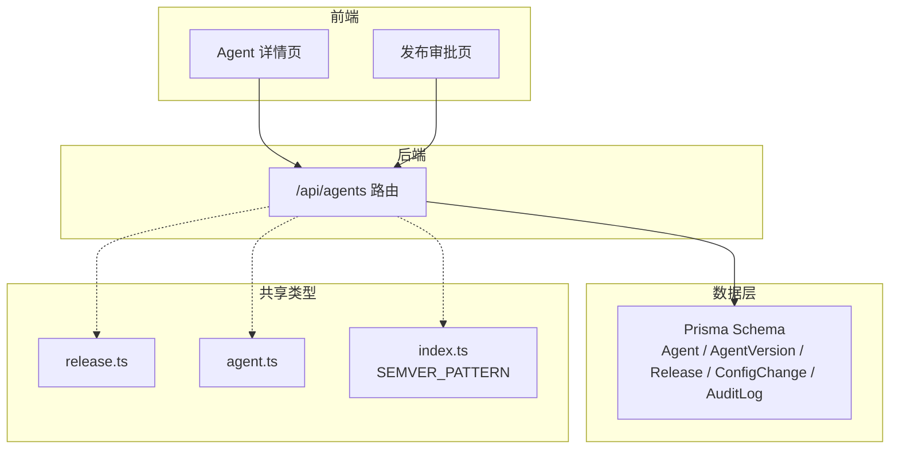
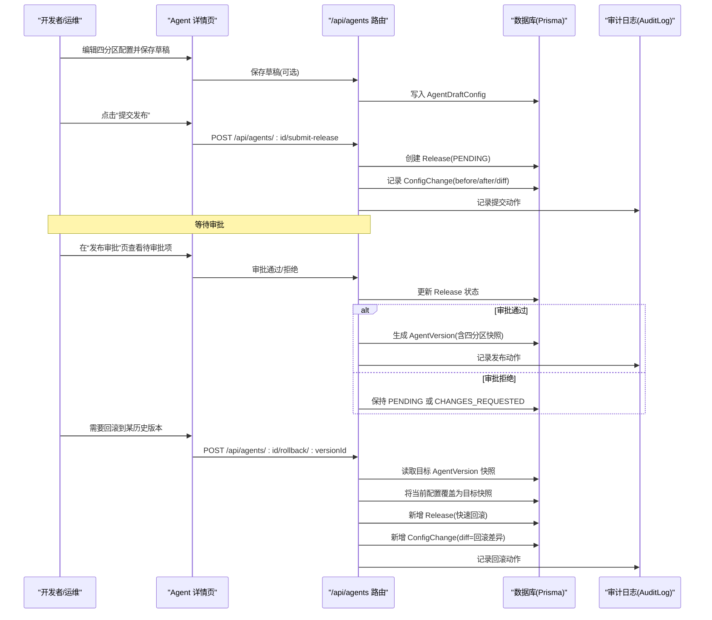
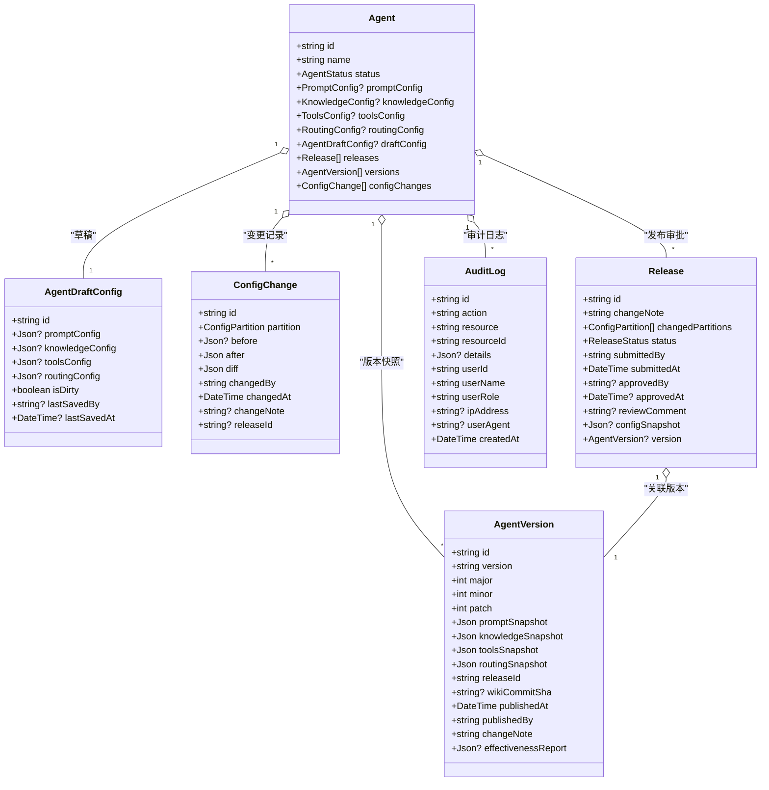
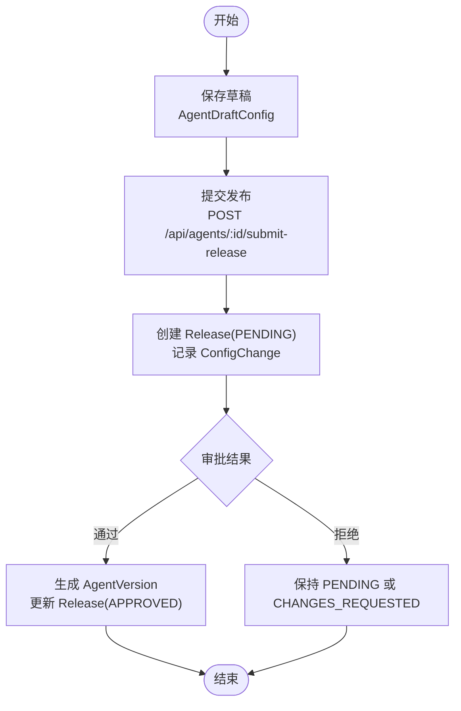
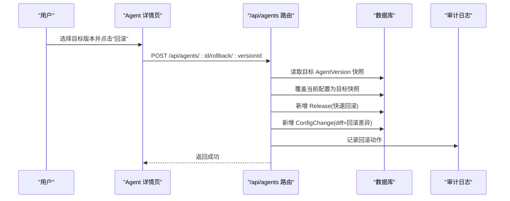
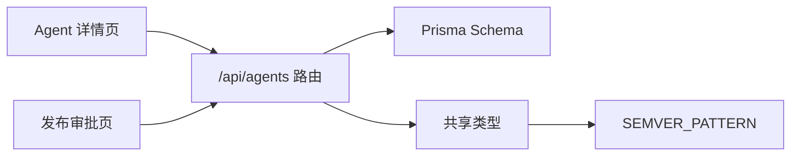

# 版本控制

<cite>
**本文引用的文件**
- [apps/web/prisma/schema.prisma](file://apps/web/prisma/schema.prisma)
- [apps/web/app/api/agents/route.ts](file://apps/web/app/api/agents/route.ts)
- [apps/web/app/(dashboard)/releases/page.tsx](file://apps/web/app/(dashboard)/releases/page.tsx)
- [apps/web/app/(dashboard)/agents/[id]/page.tsx](file://apps/web/app/(dashboard)/agents/[id]/page.tsx)
- [packages/shared/src/types/release.ts](file://packages/shared/src/types/release.ts)
- [packages/shared/src/types/agent.ts](file://packages/shared/src/types/agent.ts)
- [packages/shared/src/index.ts](file://packages/shared/src/index.ts)
</cite>

## 目录
1. [简介](#简介)
2. [项目结构](#项目结构)
3. [核心组件](#核心组件)
4. [架构总览](#架构总览)
5. [详细组件分析](#详细组件分析)
6. [依赖分析](#依赖分析)
7. [性能考虑](#性能考虑)
8. [故障排查指南](#故障排查指南)
9. [结论](#结论)
10. [附录](#附录)

## 简介
本文件面向运维与开发者，系统化阐述 Agent 配置的版本化管理机制。内容涵盖：
- 版本快照、发布审批与回滚操作
- 语义化版本策略与命名规范
- 版本创建与发布的完整工作流（草稿保存、提交审核、批准发布）
- 版本对比功能（不同版本间的配置差异）
- 回滚机制（选择目标版本与执行回滚）
- 版本审计日志（变更历史记录）
- 版本分支管理与合并策略说明

## 项目结构
本项目采用 Next.js 前端 + Prisma 数据模型 + 共享类型包的组合。与版本控制相关的关键位置包括：
- 数据库模型定义：Prisma Schema 中定义了 Agent、AgentVersion、Release、ConfigChange、AuditLog 等实体
- API 路由声明：Next.js Route Handler 暴露了提交发布与回滚接口
- 前端页面：发布审批页与 Agent 详情页提供交互入口
- 共享类型：前后端共享的 Release、AgentVersion、权限与常量定义

图表来源
- [apps/web/app/api/agents/route.ts:1-19](file://apps/web/app/api/agents/route.ts#L1-L19)
- [apps/web/app/(dashboard)/agents/[id]/page.tsx:1-43](file://apps/web/app/(dashboard)/agents/[id]/page.tsx#L1-L43)
- [apps/web/app/(dashboard)/releases/page.tsx:1-25](file://apps/web/app/(dashboard)/releases/page.tsx#L1-L25)
- [apps/web/prisma/schema.prisma:298-354](file://apps/web/prisma/schema.prisma#L298-L354)
- [packages/shared/src/types/release.ts:1-35](file://packages/shared/src/types/release.ts#L1-L35)
- [packages/shared/src/types/agent.ts:1-108](file://packages/shared/src/types/agent.ts#L1-L108)
- [packages/shared/src/index.ts:1-15](file://packages/shared/src/index.ts#L1-L15)

章节来源
- [apps/web/app/api/agents/route.ts:1-19](file://apps/web/app/api/agents/route.ts#L1-L19)
- [apps/web/app/(dashboard)/agents/[id]/page.tsx:1-43](file://apps/web/app/(dashboard)/agents/[id]/page.tsx#L1-L43)
- [apps/web/app/(dashboard)/releases/page.tsx:1-25](file://apps/web/app/(dashboard)/releases/page.tsx#L1-L25)
- [apps/web/prisma/schema.prisma:298-354](file://apps/web/prisma/schema.prisma#L298-L354)
- [packages/shared/src/types/release.ts:1-35](file://packages/shared/src/types/release.ts#L1-L35)
- [packages/shared/src/types/agent.ts:1-108](file://packages/shared/src/types/agent.ts#L1-L108)
- [packages/shared/src/index.ts:1-15](file://packages/shared/src/index.ts#L1-L15)

## 核心组件
- 版本快照（AgentVersion）：记录一次已发布版本的四分区配置快照及元信息（版本号、发布时间、发布者、变更说明等）
- 发布审批（Release）：记录一次发布申请的状态流转（待审批、已通过、已驳回、需修改），并关联最终生成的版本快照
- 配置变更记录（ConfigChange）：记录每个分区的变更前后内容与差异，支持按分区与时间查询
- 审计日志（AuditLog）：记录平台关键操作的审计轨迹（用户、角色、资源、动作、详情等）
- 草稿配置（AgentDraftConfig）：保存未提交的编辑状态，支持脏标记与最后保存人/时间

章节来源
- [apps/web/prisma/schema.prisma:175-186](file://apps/web/prisma/schema.prisma#L175-L186)
- [apps/web/prisma/schema.prisma:192-214](file://apps/web/prisma/schema.prisma#L192-L214)
- [apps/web/prisma/schema.prisma:298-326](file://apps/web/prisma/schema.prisma#L298-L326)
- [apps/web/prisma/schema.prisma:332-354](file://apps/web/prisma/schema.prisma#L332-L354)
- [apps/web/prisma/schema.prisma:607-625](file://apps/web/prisma/schema.prisma#L607-L625)

## 架构总览
版本控制的核心流程围绕“草稿 → 提交发布 → 审批 → 生成版本快照 → 可回滚”展开。API 层暴露提交发布与回滚接口；数据层通过 Prisma 持久化版本快照、发布审批与变更日志；前端提供发布审批与 Agent 配置管理界面。

图表来源
- [apps/web/app/api/agents/route.ts:1-19](file://apps/web/app/api/agents/route.ts#L1-L19)
- [apps/web/app/(dashboard)/agents/[id]/page.tsx:1-43](file://apps/web/app/(dashboard)/agents/[id]/page.tsx#L1-L43)
- [apps/web/app/(dashboard)/releases/page.tsx:1-25](file://apps/web/app/(dashboard)/releases/page.tsx#L1-L25)
- [apps/web/prisma/schema.prisma:175-186](file://apps/web/prisma/schema.prisma#L175-L186)
- [apps/web/prisma/schema.prisma:192-214](file://apps/web/prisma/schema.prisma#L192-L214)
- [apps/web/prisma/schema.prisma:298-326](file://apps/web/prisma/schema.prisma#L298-L326)
- [apps/web/prisma/schema.prisma:332-354](file://apps/web/prisma/schema.prisma#L332-L354)
- [apps/web/prisma/schema.prisma:607-625](file://apps/web/prisma/schema.prisma#L607-L625)

## 详细组件分析

### 数据模型与关系
- Agent：主体实体，包含四分区配置引用与状态（DRAFT/ACTIVE/ARCHIVED）
- AgentDraftConfig：草稿区，保存未提交的 JSON 配置，支持 isDirty 标记
- ConfigChange：记录每次分区变更的前后内容与 diff，支持按 agentId+partition 与 changedAt 索引
- Release：发布审批单，包含变更说明、受影响分区、状态、提交/审批人与时间、可选 configSnapshot
- AgentVersion：版本快照，包含语义化版本字符串与 major/minor/patch 解析值，以及四分区快照、wikiCommitSha、publishedAt/publishedBy、changeNote、effectivenessReport
- AuditLog：审计日志，记录 action/resource/resourceId/details/user/userName/userRole/ipAddress/userAgent/createdAt

图表来源
- [apps/web/prisma/schema.prisma:61-91](file://apps/web/prisma/schema.prisma#L61-L91)
- [apps/web/prisma/schema.prisma:175-186](file://apps/web/prisma/schema.prisma#L175-L186)
- [apps/web/prisma/schema.prisma:192-214](file://apps/web/prisma/schema.prisma#L192-L214)
- [apps/web/prisma/schema.prisma:298-326](file://apps/web/prisma/schema.prisma#L298-L326)
- [apps/web/prisma/schema.prisma:332-354](file://apps/web/prisma/schema.prisma#L332-L354)
- [apps/web/prisma/schema.prisma:607-625](file://apps/web/prisma/schema.prisma#L607-L625)

章节来源
- [apps/web/prisma/schema.prisma:61-91](file://apps/web/prisma/schema.prisma#L61-L91)
- [apps/web/prisma/schema.prisma:175-186](file://apps/web/prisma/schema.prisma#L175-L186)
- [apps/web/prisma/schema.prisma:192-214](file://apps/web/prisma/schema.prisma#L192-L214)
- [apps/web/prisma/schema.prisma:298-326](file://apps/web/prisma/schema.prisma#L298-L326)
- [apps/web/prisma/schema.prisma:332-354](file://apps/web/prisma/schema.prisma#L332-L354)
- [apps/web/prisma/schema.prisma:607-625](file://apps/web/prisma/schema.prisma#L607-L625)

### 语义化版本策略与命名规范
- 版本格式遵循语义化版本（主版本.次版本.修订号），由正则表达式约束
- AgentVersion 同时存储 version 字符串与 major/minor/patch 数值字段，便于排序与比较
- 建议在提交发布时根据变更影响范围自动计算下一版本号：
  - 破坏性变更：主版本递增
  - 新功能/非破坏性增强：次版本递增
  - 缺陷修复/小调整：修订号递增

章节来源
- [packages/shared/src/index.ts:14-15](file://packages/shared/src/index.ts#L14-L15)
- [apps/web/prisma/schema.prisma:332-354](file://apps/web/prisma/schema.prisma#L332-L354)
- [packages/shared/src/types/release.ts:22-32](file://packages/shared/src/types/release.ts#L22-L32)

### 版本创建与发布工作流
- 草稿保存：在 AgentDraftConfig 中保存四分区 JSON 配置，支持 isDirty 标记与最后保存人/时间
- 提交发布：调用 POST /api/agents/:id/submit-release，系统创建 Release(PENDING)，记录 ConfigChange(before/after/diff)
- 审批：在“发布审批”页面查看待审批项，管理员进行通过/拒绝/要求修改
- 批准发布：系统生成 AgentVersion（包含四分区快照），记录 publishedAt/publishedBy/changeNote，并更新 Release 状态为 APPROVED
- 拒绝或需修改：Release 状态保持 PENDING 或 CHANGES_REQUESTED，提示提交者调整

图表来源
- [apps/web/app/api/agents/route.ts:1-19](file://apps/web/app/api/agents/route.ts#L1-L19)
- [apps/web/app/(dashboard)/releases/page.tsx:1-25](file://apps/web/app/(dashboard)/releases/page.tsx#L1-L25)
- [apps/web/prisma/schema.prisma:175-186](file://apps/web/prisma/schema.prisma#L175-L186)
- [apps/web/prisma/schema.prisma:192-214](file://apps/web/prisma/schema.prisma#L192-L214)
- [apps/web/prisma/schema.prisma:298-326](file://apps/web/prisma/schema.prisma#L298-L326)
- [apps/web/prisma/schema.prisma:332-354](file://apps/web/prisma/schema.prisma#L332-L354)

章节来源
- [apps/web/app/api/agents/route.ts:1-19](file://apps/web/app/api/agents/route.ts#L1-L19)
- [apps/web/app/(dashboard)/releases/page.tsx:1-25](file://apps/web/app/(dashboard)/releases/page.tsx#L1-L25)
- [apps/web/prisma/schema.prisma:175-186](file://apps/web/prisma/schema.prisma#L175-L186)
- [apps/web/prisma/schema.prisma:192-214](file://apps/web/prisma/schema.prisma#L192-L214)
- [apps/web/prisma/schema.prisma:298-326](file://apps/web/prisma/schema.prisma#L298-L326)
- [apps/web/prisma/schema.prisma:332-354](file://apps/web/prisma/schema.prisma#L332-L354)

### 版本对比功能
- 基于 ConfigChange.diff 字段展示不同版本间配置差异
- 可按分区（PROMPT/KNOWLEDGE/TOOLS/ROUTING）筛选查看
- 建议在前端实现“双版本对比视图”，以结构化方式呈现新增、删除、修改项

章节来源
- [apps/web/prisma/schema.prisma:192-214](file://apps/web/prisma/schema.prisma#L192-L214)
- [packages/shared/src/types/agent.ts:18-23](file://packages/shared/src/types/agent.ts#L18-L23)

### 回滚机制
- 触发点：POST /api/agents/:id/rollback/:versionId
- 步骤：
  - 读取目标 AgentVersion 的四分区快照
  - 将当前配置覆盖为目标快照
  - 新增一次 Release（用于审计与追踪）
  - 新增 ConfigChange(diff=回滚差异)
  - 记录审计日志（action=ROLLBACK）

图表来源
- [apps/web/app/api/agents/route.ts:1-19](file://apps/web/app/api/agents/route.ts#L1-L19)
- [apps/web/prisma/schema.prisma:332-354](file://apps/web/prisma/schema.prisma#L332-L354)
- [apps/web/prisma/schema.prisma:192-214](file://apps/web/prisma/schema.prisma#L192-L214)
- [apps/web/prisma/schema.prisma:607-625](file://apps/web/prisma/schema.prisma#L607-L625)

章节来源
- [apps/web/app/api/agents/route.ts:1-19](file://apps/web/app/api/agents/route.ts#L1-L19)
- [apps/web/prisma/schema.prisma:332-354](file://apps/web/prisma/schema.prisma#L332-L354)
- [apps/web/prisma/schema.prisma:192-214](file://apps/web/prisma/schema.prisma#L192-L214)
- [apps/web/prisma/schema.prisma:607-625](file://apps/web/prisma/schema.prisma#L607-L625)

### 版本审计日志
- AuditLog 记录所有关键动作（如提交发布、审批、回滚）
- 关键字段包括 action/resource/resourceId/details/user/userName/userRole/ipAddress/userAgent/createdAt
- 建议结合 RBAC 权限模型限制敏感操作（publish/approve/rollback/admin）

章节来源
- [apps/web/prisma/schema.prisma:607-625](file://apps/web/prisma/schema.prisma#L607-L625)
- [packages/shared/src/types/permission.ts:1-36](file://packages/shared/src/types/permission.ts#L1-L36)

### 版本分支管理与合并策略
- 概念说明：版本控制聚焦于“配置快照与发布审批”，不直接对应代码仓库的 Git 分支
- 建议实践：
  - 使用“环境基线”概念替代分支：例如 main 基线对应生产稳定版，feature 分支对应实验性配置
  - 合并策略：仅当 Release 被批准后，才将 AgentVersion 作为新的基线
  - 变更评审：通过 ConfigChange.diff 与 Release.reviewComment 进行人工审查
  - 回退路径：通过回滚到指定 AgentVersion 实现快速恢复

[本节为概念性说明，无需源码引用]

## 依赖分析
- 前端依赖：
  - Agent 详情页提供“提交发布”和“查看版本历史”入口
  - 发布审批页提供“待审批/已通过/已驳回”过滤
- 后端依赖：
  - /api/agents 路由声明了提交发布与回滚接口
- 数据层依赖：
  - Prisma Schema 定义了版本快照、发布审批、变更记录与审计日志
- 共享类型依赖：
  - release.ts 定义 Release 与 AgentVersion 类型
  - agent.ts 定义 ConfigPartition 枚举
  - index.ts 定义 SEMVER_PATTERN 常量

图表来源
- [apps/web/app/(dashboard)/agents/[id]/page.tsx:1-43](file://apps/web/app/(dashboard)/agents/[id]/page.tsx#L1-L43)
- [apps/web/app/(dashboard)/releases/page.tsx:1-25](file://apps/web/app/(dashboard)/releases/page.tsx#L1-L25)
- [apps/web/app/api/agents/route.ts:1-19](file://apps/web/app/api/agents/route.ts#L1-L19)
- [apps/web/prisma/schema.prisma:298-354](file://apps/web/prisma/schema.prisma#L298-L354)
- [packages/shared/src/types/release.ts:1-35](file://packages/shared/src/types/release.ts#L1-L35)
- [packages/shared/src/types/agent.ts:18-23](file://packages/shared/src/types/agent.ts#L18-L23)
- [packages/shared/src/index.ts:14-15](file://packages/shared/src/index.ts#L14-L15)

章节来源
- [apps/web/app/(dashboard)/agents/[id]/page.tsx:1-43](file://apps/web/app/(dashboard)/agents/[id]/page.tsx#L1-L43)
- [apps/web/app/(dashboard)/releases/page.tsx:1-25](file://apps/web/app/(dashboard)/releases/page.tsx#L1-L25)
- [apps/web/app/api/agents/route.ts:1-19](file://apps/web/app/api/agents/route.ts#L1-L19)
- [apps/web/prisma/schema.prisma:298-354](file://apps/web/prisma/schema.prisma#L298-L354)
- [packages/shared/src/types/release.ts:1-35](file://packages/shared/src/types/release.ts#L1-L35)
- [packages/shared/src/types/agent.ts:18-23](file://packages/shared/src/types/agent.ts#L18-L23)
- [packages/shared/src/index.ts:14-15](file://packages/shared/src/index.ts#L14-L15)

## 性能考虑
- 大对象快照：AgentVersion 的四分区快照为 JSON，注意存储大小与查询性能
- 索引优化：对 AgentVersion(agentId, publishedAt)、ConfigChange(agentId, partition)、Release(agentId, status) 建立索引以提升列表与筛选性能
- 差异计算：ConfigChange.diff 应在服务端高效计算，避免前端重复计算造成延迟
- 并发控制：提交发布与回滚应加锁或幂等处理，防止竞态条件导致不一致

[本节为通用指导，无需源码引用]

## 故障排查指南
- 发布失败：检查 Release.status 是否为 PENDING/CHANGES_REQUESTED，确认是否缺少必填字段（changeNote、changedPartitions）
- 版本不可见：确认 AgentVersion 是否存在且与 Release 正确关联
- 回滚无效：核对目标 AgentVersion 的快照完整性，确认回滚后是否新增了 ConfigChange 与 Release
- 审计缺失：检查 AuditLog 是否记录了相应 action，确认权限模型允许该操作

章节来源
- [apps/web/prisma/schema.prisma:298-326](file://apps/web/prisma/schema.prisma#L298-L326)
- [apps/web/prisma/schema.prisma:332-354](file://apps/web/prisma/schema.prisma#L332-L354)
- [apps/web/prisma/schema.prisma:192-214](file://apps/web/prisma/schema.prisma#L192-L214)
- [apps/web/prisma/schema.prisma:607-625](file://apps/web/prisma/schema.prisma#L607-L625)

## 结论
本版本控制系统以“草稿—提交—审批—快照—回滚—审计”为主线，结合语义化版本与分区化配置，提供了完整的 Agent 配置生命周期管理能力。通过清晰的 API 接口、严谨的数据模型与完善的审计日志，既满足运维人员的稳定性需求，也为开发者提供了最佳实践与技术细节参考。

[本节为总结性内容，无需源码引用]

## 附录
- 术语表
  - 分区（Partition）：PROMPT/KNOWLEDGE/TOOLS/ROUTING
  - 发布审批（Release）：发布申请的审批单
  - 版本快照（AgentVersion）：一次已发布版本的完整配置快照
  - 变更记录（ConfigChange）：分区级变更的前后内容与差异
  - 审计日志（AuditLog）：关键操作的审计轨迹

[本节为补充说明，无需源码引用]