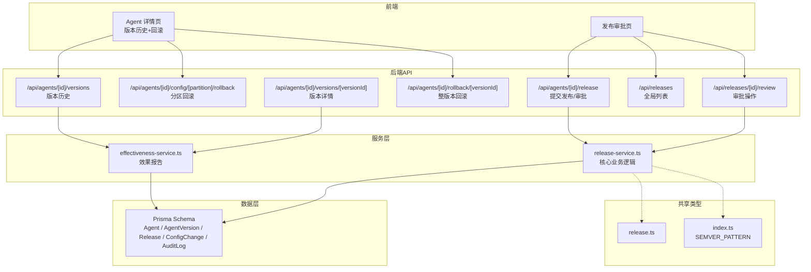
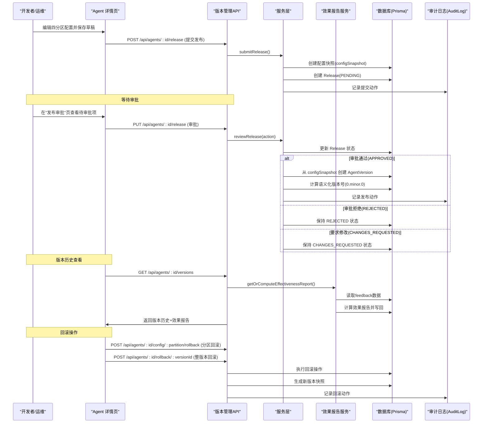
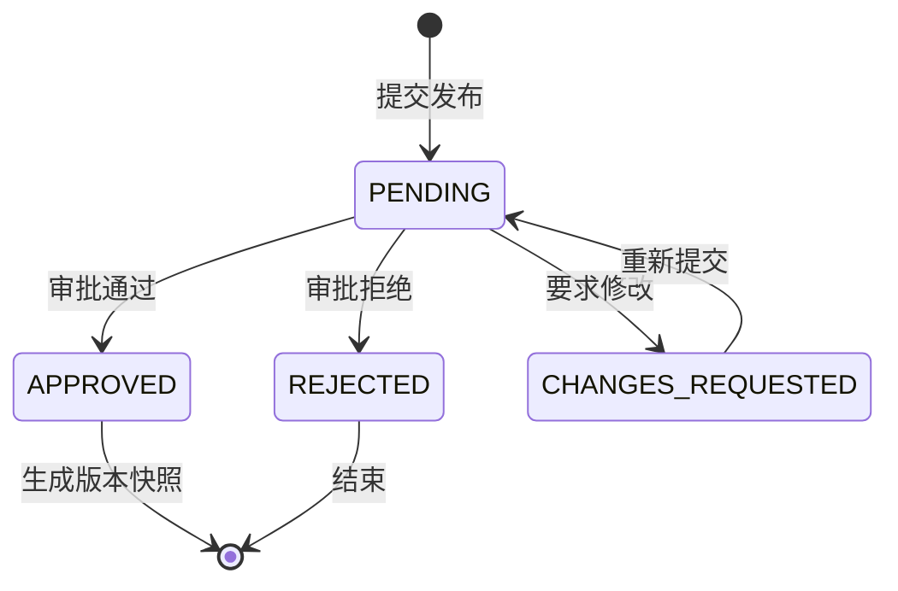
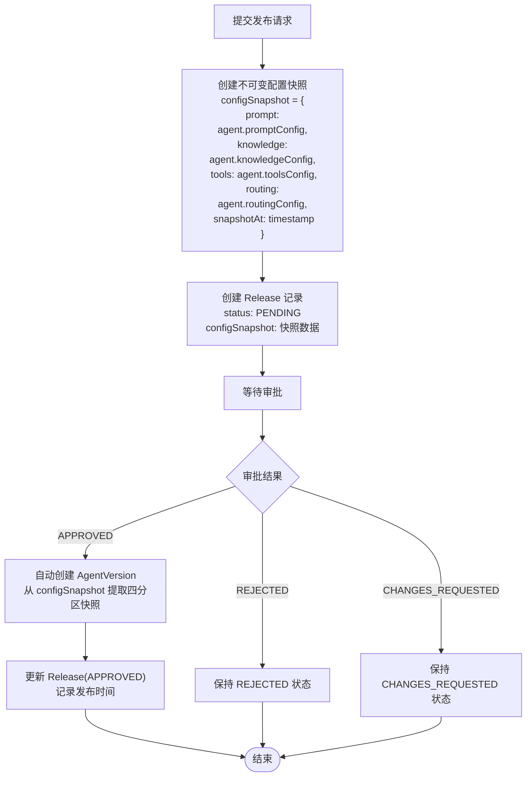
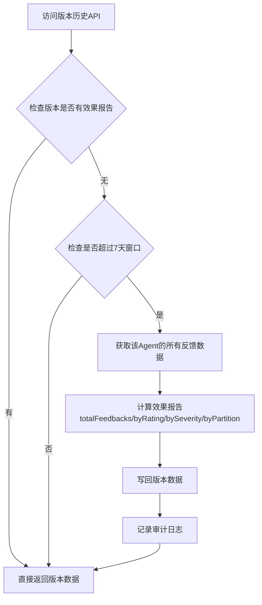
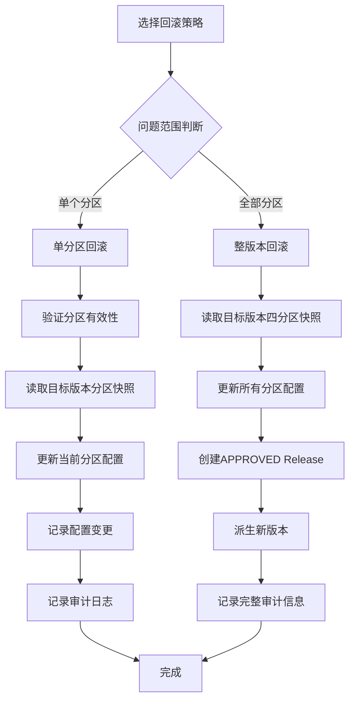
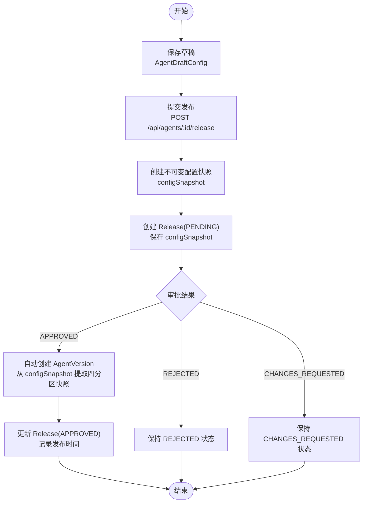
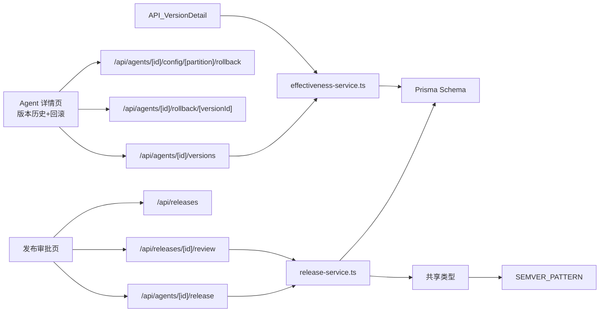

# 版本控制

<cite>
**本文引用的文件**
- [packages/db/prisma/schema.prisma](file://packages/db/prisma/schema.prisma)
- [apps/web/app/api/agents/[id]/release/route.ts](file://apps/web/app/api/agents/[id]/release/route.ts)
- [apps/web/app/(dashboard)/releases/page.tsx](file://apps/web/app/(dashboard)/releases/page.tsx)
- [apps/web/lib/services/release-service.ts](file://apps/web/lib/services/release-service.ts)
- [apps/web/app/api/releases/route.ts](file://apps/web/app/api/releases/route.ts)
- [apps/web/app/api/releases/[id]/review/route.ts](file://apps/web/app/api/releases/[id]/review/route.ts)
- [apps/web/lib/schemas.ts](file://apps/web/lib/schemas.ts)
- [packages/shared/src/types/release.ts](file://packages/shared/src/types/release.ts)
- [packages/shared/src/index.ts](file://packages/shared/src/index.ts)
- [apps/web/app/api/agents/[id]/versions/route.ts](file://apps/web/app/api/agents/[id]/versions/route.ts)
- [apps/web/app/api/agents/[id]/versions/[versionId]/route.ts](file://apps/web/app/api/agents/[id]/versions/[versionId]/route.ts)
- [apps/web/app/api/agents/[id]/config/[partition]/rollback/route.ts](file://apps/web/app/api/agents/[id]/config/[partition]/rollback/route.ts)
- [apps/web/app/api/agents/[id]/rollback/[versionId]/route.ts](file://apps/web/app/api/agents/[id]/rollback/[versionId]/route.ts)
- [apps/web/lib/services/effectiveness-service.ts](file://apps/web/lib/services/effectiveness-service.ts)
- [apps/web/app/(dashboard)/agents/[id]/page.tsx](file://apps/web/app/(dashboard)/agents/[id]/page.tsx)
</cite>

## 更新摘要
**变更内容**
- 新增不可变快照机制，确保版本历史数据的完整性和一致性
- 实现两种回滚机制：单分区回滚和整Agent回滚，满足不同恢复场景
- 引入效果报告服务，自动计算版本上线后的反馈统计和效果评估
- 新增版本管理API端点：/api/agents/[id]/versions 和 /api/agents/[id]/versions/[versionId]
- 全面改进版本历史查看UI，支持一键回滚和效果标签展示
- 增强版本对比功能，支持分区级差异展示和结构化变更分析

## 目录
1. [简介](#简介)
2. [项目结构](#项目结构)
3. [核心组件](#核心组件)
4. [架构总览](#架构总览)
5. [详细组件分析](#详细组件分析)
6. [依赖分析](#依赖分析)
7. [性能考虑](#性能考虑)
8. [故障排查指南](#故障排查指南)
9. [结论](#结论)
10. [附录](#附录)

## 简介
本文件面向运维与开发者，系统化阐述 Agent 配置的版本化管理机制。内容涵盖：
- 增强的发布审批工作流（PENDING、APPROVED、REJECTED、CHANGES_REQUESTED）
- 不可变配置快照机制与语义化版本策略
- 版本创建与发布的完整工作流（草稿保存、提交审核、批准发布）
- 版本对比功能（不同版本间的配置差异）
- 双轨回滚机制（单分区回滚和整Agent回滚）
- 版本效果报告服务（自动统计上线后反馈）
- 版本审计日志（变更历史记录）
- 版本分支管理与合并策略说明

## 项目结构
本项目采用 Next.js 前端 + Prisma 数据模型 + 共享类型包的组合。与版本控制相关的关键位置包括：
- 数据库模型定义：Prisma Schema 中定义了 Agent、AgentVersion、Release、ConfigChange、AuditLog 等实体
- API 路由声明：Next.js Route Handler 暴露了提交发布、版本查询和回滚接口
- 前端页面：发布审批页、Agent详情页提供交互入口
- 服务层：release-service.ts 实现了核心的发布审批逻辑，effectiveness-service.ts 处理效果报告
- 共享类型：前后端共享的 Release、AgentVersion、权限与常量定义

**图表来源**
- [apps/web/app/api/agents/[id]/release/route.ts:1-59](file://apps/web/app/api/agents/[id]/release/route.ts#L1-L59)
- [apps/web/app/(dashboard)/releases/page.tsx:1-130](file://apps/web/app/(dashboard)/releases/page.tsx#L1-L130)
- [apps/web/lib/services/release-service.ts:1-129](file://apps/web/lib/services/release-service.ts#L1-L129)
- [apps/web/app/api/agents/[id]/versions/route.ts:1-44](file://apps/web/app/api/agents/[id]/versions/route.ts#L1-L44)
- [apps/web/app/api/agents/[id]/versions/[versionId]/route.ts:1-36](file://apps/web/app/api/agents/[id]/versions/[versionId]/route.ts#L1-L36)
- [apps/web/lib/services/effectiveness-service.ts:1-176](file://apps/web/lib/services/effectiveness-service.ts#L1-L176)

## 核心组件
- **增强的发布审批（Release）**：记录一次发布申请的状态流转（待审批、已通过、已驳回、需修改），包含配置快照和最终生成的版本快照
- **不可变配置快照（configSnapshot）**：在提交发布时保存完整的四分区配置快照，确保版本历史数据的不可变性
- **版本快照（AgentVersion）**：记录一次已发布版本的四分区配置快照及元信息（版本号、发布时间、发布者、变更说明等）
- **效果报告服务（EffectivenessReport）**：自动统计版本上线后的反馈数据，生成效果评估报告
- **双轨回滚机制**：支持单分区回滚和整Agent回滚，满足不同恢复需求
- **语义化版本支持**：支持主版本、次版本、修订号的解析和管理
- **配置变更记录（ConfigChange）**：记录每个分区的变更前后内容与差异，支持按分区与时间查询
- **审计日志（AuditLog）**：记录平台关键操作的审计轨迹（用户、角色、资源、动作、详情等）

**章节来源**
- [packages/db/prisma/schema.prisma:298-354](file://packages/db/prisma/schema.prisma#L298-L354)
- [apps/web/lib/services/release-service.ts:24-45](file://apps/web/lib/services/release-service.ts#L24-L45)
- [apps/web/lib/services/effectiveness-service.ts:31-39](file://apps/web/lib/services/effectiveness-service.ts#L31-L39)

## 架构总览
版本控制的核心流程围绕"草稿 → 提交发布 → 审批 → 生成版本快照 → 可回滚"展开。增强的发布审批工作流支持四种状态，不可变配置快照确保版本一致性，效果报告服务提供版本上线后的质量评估，双轨回滚机制保障快速恢复能力。

**图表来源**
- [apps/web/app/api/agents/[id]/release/route.ts:1-59](file://apps/web/app/api/agents/[id]/release/route.ts#L1-L59)
- [apps/web/lib/services/release-service.ts:1-129](file://apps/web/lib/services/release-service.ts#L1-L129)
- [apps/web/app/api/agents/[id]/versions/route.ts:1-44](file://apps/web/app/api/agents/[id]/versions/route.ts#L1-L44)
- [apps/web/lib/services/effectiveness-service.ts:130-176](file://apps/web/lib/services/effectiveness-service.ts#L130-L176)

## 详细组件分析

### 增强的发布审批工作流
系统现在支持四种发布审批状态：
- **PENDING**：待审批状态，新提交的发布申请默认处于此状态
- **APPROVED**：审批通过，系统将自动生成版本快照并发布
- **REJECTED**：审批拒绝，发布申请被驳回
- **CHANGES_REQUESTED**：要求修改，提示提交者进行调整

**图表来源**
- [packages/db/prisma/schema.prisma:321-326](file://packages/db/prisma/schema.prisma#L321-L326)
- [apps/web/lib/services/release-service.ts:48-77](file://apps/web/lib/services/release-service.ts#L48-L77)

**章节来源**
- [packages/db/prisma/schema.prisma:321-326](file://packages/db/prisma/schema.prisma#L321-L326)
- [apps/web/lib/services/release-service.ts:48-77](file://apps/web/lib/services/release-service.ts#L48-L77)
- [apps/web/app/(dashboard)/releases/page.tsx:23-29](file://apps/web/app/(dashboard)/releases/page.tsx#L23-L29)

### 不可变配置快照机制
系统在提交发布时自动创建不可变的配置快照，确保版本的一致性：

1. **快照创建时机**：调用 `submitRelease()` 时
2. **快照内容**：包含四个分区的完整配置（prompt、knowledge、tools、routing）
3. **快照存储**：存储在 Release 的 `configSnapshot` 字段中
4. **快照用途**：用于后续版本创建和回滚操作
5. **不可变性**：版本快照一旦创建不可修改，保证历史数据的完整性

**图表来源**
- [apps/web/lib/services/release-service.ts:24-45](file://apps/web/lib/services/release-service.ts#L24-L45)

**章节来源**
- [apps/web/lib/services/release-service.ts:24-45](file://apps/web/lib/services/release-service.ts#L24-L45)
- [packages/db/prisma/schema.prisma:311-312](file://packages/db/prisma/schema.prisma#L311-L312)

### 版本效果报告服务
新增的效果报告服务为版本管理提供了数据驱动的决策支持：

- **懒加载计算**：在访问版本历史时，若版本距今 ≥ 7 天且缺少效果报告，则自动计算
- **反馈统计**：统计版本上线期间的反馈总数、评价分布、严重度分布
- **分区分析**：按目标分区（PROMPT/KNOWLEDGE/TOOLS/ROUTING）聚合反馈数据
- **自动写回**：计算完成后将效果报告写回到版本数据中，避免重复计算
- **审计记录**：效果报告计算过程会记录到审计日志中

**图表来源**
- [apps/web/lib/services/effectiveness-service.ts:130-176](file://apps/web/lib/services/effectiveness-service.ts#L130-L176)

**章节来源**
- [apps/web/lib/services/effectiveness-service.ts:1-176](file://apps/web/lib/services/effectiveness-service.ts#L1-176)
- [apps/web/app/api/agents/[id]/versions/route.ts:33-37](file://apps/web/app/api/agents/[id]/versions/route.ts#L33-L37)

### 双轨回滚机制
系统实现了两种回滚机制，满足不同恢复场景：

#### 单分区回滚
- **触发点**：POST `/api/agents/[id]/config/[partition]/rollback`
- **适用场景**：仅某个分区配置有问题，其他分区正常
- **操作流程**：
  - 验证分区有效性（prompt/knowledge/tools/routing）
  - 读取目标版本的对应分区快照
  - 使用现有配置更新函数覆盖当前配置
  - 记录配置变更（before=回滚前，after=回滚后）
  - 写入审计日志

#### 整版本回滚
- **触发点**：POST `/api/agents/[id]/rollback/[versionId]`
- **适用场景**：整个版本出现问题，需要全量回退
- **操作流程**：
  - 读取目标版本的四分区快照
  - 一次性覆盖所有四个分区的active配置
  - 创建APPROVED状态的Release（跳过审批流程）
  - 立即派生新版本（版本号自增）
  - 记录完整的回滚审计信息

**图表来源**
- [apps/web/app/api/agents/[id]/config/[partition]/rollback/route.ts:34-118](file://apps/web/app/api/agents/[id]/config/[partition]/rollback/route.ts#L34-L118)
- [apps/web/app/api/agents/[id]/rollback/[versionId]/route.ts:1-36](file://apps/web/app/api/agents/[id]/rollback/[versionId]/route.ts#L1-L36)
- [apps/web/lib/services/release-service.ts:241-341](file://apps/web/lib/services/release-service.ts#L241-L341)

**章节来源**
- [apps/web/app/api/agents/[id]/config/[partition]/rollback/route.ts:34-118](file://apps/web/app/api/agents/[id]/config/[partition]/rollback/route.ts#L34-L118)
- [apps/web/app/api/agents/[id]/rollback/[versionId]/route.ts:1-36](file://apps/web/app/api/agents/[id]/rollback/[versionId]/route.ts#L1-L36)
- [apps/web/lib/services/release-service.ts:241-341](file://apps/web/lib/services/release-service.ts#L241-L341)

### 版本管理API端点
新增的版本管理API提供了完整的版本历史查询和详情获取功能：

#### 版本历史查询
- **端点**：GET `/api/agents/[id]/versions`
- **功能**：返回某Agent的所有已发布版本，按发布时间倒序排列
- **特性**：
  - 每个版本包含四个分区的完整快照
  - 自动懒加载效果报告（≥7天的版本）
  - 支持空版本列表处理

#### 版本详情查询
- **端点**：GET `/api/agents/[id]/versions/[versionId]`
- **功能**：返回指定版本的详细信息
- **特性**：
  - 包含changeNote、publishedBy等元数据
  - 自动懒加载效果报告
  - 权限验证（版本必须属于指定Agent）

**章节来源**
- [apps/web/app/api/agents/[id]/versions/route.ts:1-44](file://apps/web/app/api/agents/[id]/versions/route.ts#L1-L44)
- [apps/web/app/api/agents/[id]/versions/[versionId]/route.ts:1-36](file://apps/web/app/api/agents/[id]/versions/[versionId]/route.ts#L1-L36)

### 语义化版本策略与命名规范
系统实现了完整的语义化版本支持：

- **版本格式**：遵循 `major.minor.patch` 格式，由正则表达式 `^(\d+)\.(\d+)\.(\d+)$` 约束
- **版本解析**：AgentVersion 同时存储 version 字符串与 major/minor/patch 数值字段
- **版本计算**：当前实现为 `0.minor.0` 格式，minor 版本递增
- **版本验证**：使用 SEMVER_PATTERN 常量进行版本格式验证

**章节来源**
- [packages/shared/src/index.ts:14](file://packages/shared/src/index.ts#L14)
- [packages/db/prisma/schema.prisma:336-339](file://packages/db/prisma/schema.prisma#L336-L339)
- [apps/web/lib/services/release-service.ts:86-93](file://apps/web/lib/services/release-service.ts#L86-93)

### 版本创建与发布工作流
增强的版本创建工作流：

1. **草稿保存**：在 AgentDraftConfig 中保存四分区 JSON 配置
2. **提交发布**：调用 POST `/api/agents/:id/release`，系统创建 Release(PENDING) 并保存配置快照
3. **审批处理**：管理员在"发布审批"页面进行通过/拒绝/要求修改
4. **自动版本创建**：审批通过后，系统从 configSnapshot 自动生成 AgentVersion
5. **版本发布**：记录 publishedAt/publishedBy/changeNote，更新 Release 状态为 APPROVED

**图表来源**
- [apps/web/app/api/agents/[id]/release/route.ts:6-27](file://apps/web/app/api/agents/[id]/release/route.ts#L6-L27)
- [apps/web/lib/services/release-service.ts:79-113](file://apps/web/lib/services/release-service.ts#L79-L113)
- [packages/db/prisma/schema.prisma:332-354](file://packages/db/prisma/schema.prisma#L332-L354)

**章节来源**
- [apps/web/app/api/agents/[id]/release/route.ts:6-27](file://apps/web/app/api/agents/[id]/release/route.ts#L6-L27)
- [apps/web/lib/services/release-service.ts:79-113](file://apps/web/lib/services/release-service.ts#L79-L113)
- [packages/db/prisma/schema.prisma:332-354](file://packages/db/prisma/schema.prisma#L332-L354)

### 版本对比功能
- 基于 ConfigChange.diff 字段展示不同版本间配置差异
- 可按分区（PROMPT/KNOWLEDGE/TOOLS/ROUTING）筛选查看
- 建议在前端实现"双版本对比视图"，以结构化方式呈现新增、删除、修改项
- 支持原始JSON和摘要视图切换

**章节来源**
- [packages/db/prisma/schema.prisma:192-214](file://packages/db/prisma/schema.prisma#L192-L214)

### 版本审计日志
- AuditLog 记录所有关键动作（如提交发布、审批、回滚、效果报告计算）
- 关键字段包括 action/resource/resourceId/details/user/userName/userRole/ipAddress/userAgent/createdAt
- 建议结合 RBAC 权限模型限制敏感操作（publish/approve/rollback/admin）

**章节来源**
- [packages/db/prisma/schema.prisma:607-625](file://packages/db/prisma/schema.prisma#L607-L625)

### 版本分支管理与合并策略
- 概念说明：版本控制聚焦于"配置快照与发布审批"，不直接对应代码仓库的 Git 分支
- 建议实践：
  - 使用"环境基线"概念替代分支：例如 main 基线对应生产稳定版，feature 分支对应实验性配置
  - 合并策略：仅当 Release 被批准后，才将 AgentVersion 作为新的基线
  - 变更评审：通过 ConfigChange.diff 与 Release.reviewComment 进行人工审查
  - 回退路径：通过回滚到指定 AgentVersion 实现快速恢复

## 依赖分析
- **前端依赖**：
  - Agent 详情页提供"提交发布"、"版本历史查看"和"回滚操作"入口
  - 发布审批页提供"待审批/已通过/已驳回/需修改"过滤
  - 版本历史组件支持效果标签展示和一键回滚
- **后端依赖**：
  - `/api/agents/[id]/release` 路由声明了提交发布与审批接口
  - `/api/agents/[id]/versions` 路由提供版本历史查询
  - `/api/agents/[id]/versions/[versionId]` 路由提供版本详情查询
  - `/api/agents/[id]/config/[partition]/rollback` 路由处理分区回滚
  - `/api/agents/[id]/rollback/[versionId]` 路由处理整版本回滚
  - `/api/releases` 路由提供全局 Release 列表
  - `/api/releases/[id]/review` 路由处理具体的审批操作
- **服务层依赖**：
  - release-service.ts 实现了核心的提交发布和审批逻辑
  - effectiveness-service.ts 实现了效果报告的懒加载计算
  - 包含配置快照创建和版本自动生成功能
- **数据层依赖**：
  - Prisma Schema 定义了版本快照、发布审批、变更记录与审计日志
- **共享类型依赖**：
  - release.ts 定义 Release 与 AgentVersion 类型
  - index.ts 定义 SEMVER_PATTERN 常量

**图表来源**
- [apps/web/app/(dashboard)/agents/[id]/page.tsx:214-366](file://apps/web/app/(dashboard)/agents/[id]/page.tsx#L214-L366)
- [apps/web/app/api/agents/[id]/versions/route.ts:1-44](file://apps/web/app/api/agents/[id]/versions/route.ts#L1-L44)
- [apps/web/app/api/agents/[id]/config/[partition]/rollback/route.ts:1-118](file://apps/web/app/api/agents/[id]/config/[partition]/rollback/route.ts#L1-L118)
- [apps/web/lib/services/effectiveness-service.ts:1-176](file://apps/web/lib/services/effectiveness-service.ts#L1-L176)

**章节来源**
- [apps/web/app/(dashboard)/agents/[id]/page.tsx:214-366](file://apps/web/app/(dashboard)/agents/[id]/page.tsx#L214-L366)
- [apps/web/app/api/agents/[id]/versions/route.ts:1-44](file://apps/web/app/api/agents/[id]/versions/route.ts#L1-L44)
- [apps/web/app/api/agents/[id]/config/[partition]/rollback/route.ts:1-118](file://apps/web/app/api/agents/[id]/config/[partition]/rollback/route.ts#L1-L118)
- [apps/web/lib/services/effectiveness-service.ts:1-176](file://apps/web/lib/services/effectiveness-service.ts#L1-L176)

## 性能考虑
- **大对象快照**：AgentVersion 的四分区快照为 JSON，注意存储大小与查询性能
- **索引优化**：对 AgentVersion(agentId, publishedAt)、ConfigChange(agentId, partition)、Release(agentId, status) 建立索引以提升列表与筛选性能
- **差异计算**：ConfigChange.diff 应在服务端高效计算，避免前端重复计算造成延迟
- **并发控制**：提交发布与回滚应加锁或幂等处理，防止竞态条件导致不一致
- **快照大小**：配置快照可能较大，建议实施适当的存储策略和清理机制
- **懒加载优化**：效果报告采用懒加载策略，避免不必要的计算开销
- **缓存策略**：效果报告计算后写回版本数据，避免重复计算

## 故障排查指南
- **发布失败**：检查 Release.status 是否为 PENDING/CHANGES_REQUESTED，确认是否缺少必填字段（changeNote、changedPartitions）
- **版本不可见**：确认 AgentVersion 是否存在且与 Release 正确关联
- **回滚无效**：核对目标 AgentVersion 的快照完整性，确认回滚后是否新增了 ConfigChange 与 Release
- **审计缺失**：检查 AuditLog 是否记录了相应 action，确认权限模型允许该操作
- **审批状态异常**：检查 ReleaseStatus 枚举值是否正确，确认状态转换逻辑符合预期
- **配置快照问题**：验证 configSnapshot 字段是否正确保存，确认四分区配置完整性
- **效果报告未生成**：检查版本发布时间是否超过7天窗口，确认feedback数据存在
- **API响应错误**：检查版本ID有效性、Agent权限验证、分区参数合法性

**章节来源**
- [packages/db/prisma/schema.prisma:298-354](file://packages/db/prisma/schema.prisma#L298-L354)
- [apps/web/lib/services/release-service.ts:48-77](file://apps/web/lib/services/release-service.ts#L48-L77)
- [apps/web/lib/services/effectiveness-service.ts:130-176](file://apps/web/lib/services/effectiveness-service.ts#L130-L176)

## 结论
本版本控制系统以"草稿—提交—审批—快照—回滚—审计"为主线，结合增强的发布审批工作流、不可变配置快照机制、效果报告服务和双轨回滚机制，提供了完整的 Agent 配置生命周期管理能力。通过清晰的 API 接口、严谨的数据模型与完善的审计日志，既满足运维人员的稳定性需求，也为开发者提供了最佳实践与技术细节参考。新增的效果报告服务为版本质量评估提供了数据支撑，双轨回滚机制确保了灵活的故障恢复能力。

## 附录
- **术语表**
  - 分区（Partition）：PROMPT/KNOWLEDGE/TOOLS/ROUTING
  - 发布审批（Release）：发布申请的审批单，支持四种状态
  - 不可变配置快照（configSnapshot）：提交发布时的完整配置快照，确保历史数据不可修改
  - 版本快照（AgentVersion）：一次已发布版本的完整配置快照
  - 效果报告（EffectivenessReport）：版本上线后的反馈统计和质量评估
  - 变更记录（ConfigChange）：分区级变更的前后内容与差异
  - 审计日志（AuditLog）：关键操作的审计轨迹
  - 语义化版本：遵循 major.minor.patch 格式的版本管理
  - 单分区回滚：仅回滚特定分区的配置
  - 整版本回滚：回滚所有分区的配置到指定版本