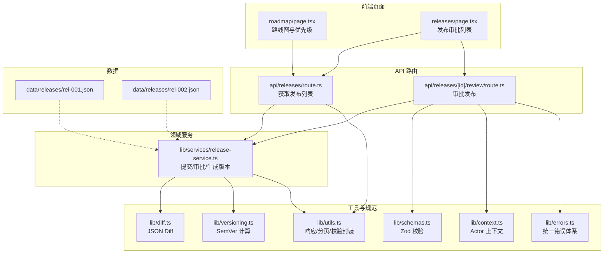
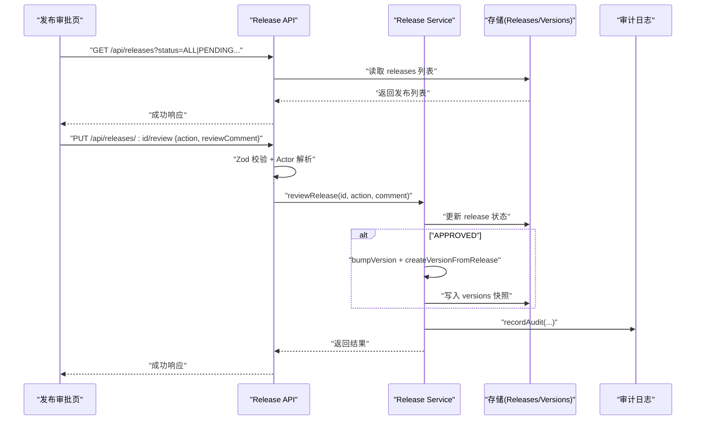
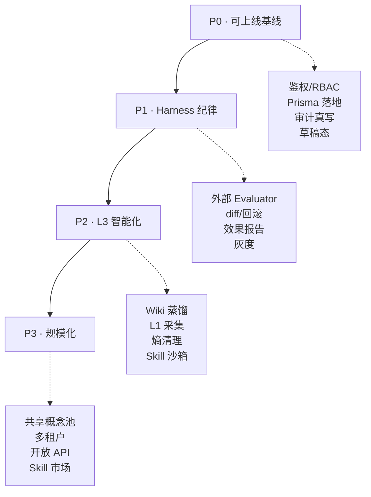
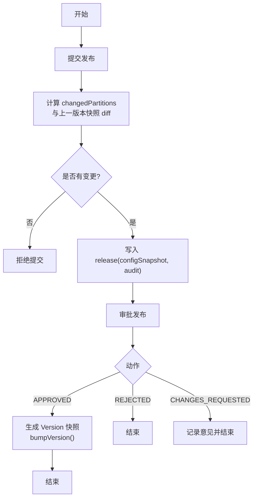
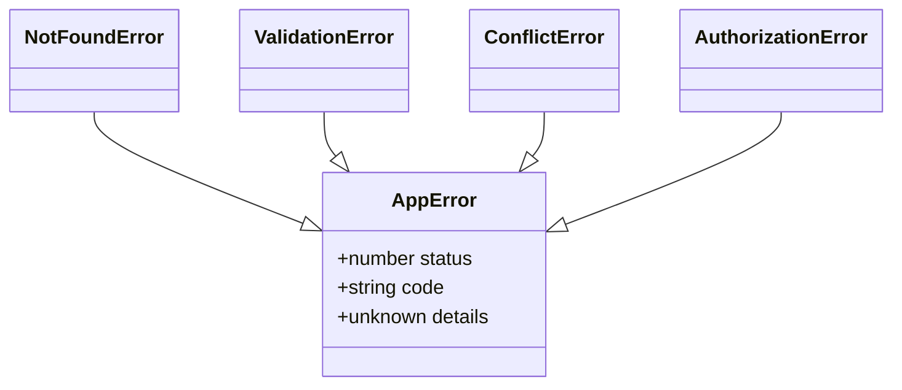
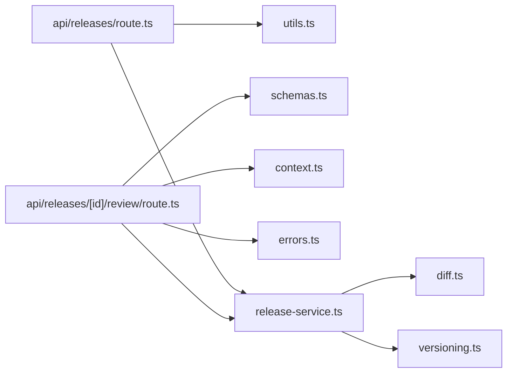

# 项目路线图与优先级管理

<cite>
**本文引用的文件**   
- [apps/web/app/(dashboard)/architecture/roadmap/page.tsx](file://apps/web/app/(dashboard)/architecture/roadmap/page.tsx)
- [apps/web/app/api/releases/route.ts](file://apps/web/app/api/releases/route.ts)
- [apps/web/app/api/releases/[id]/review/route.ts](file://apps/web/app/api/releases/[id]/review/route.ts)
- [apps/web/lib/services/release-service.ts](file://apps/web/lib/services/release-service.ts)
- [apps/web/lib/versioning.ts](file://apps/web/lib/versioning.ts)
- [apps/web/lib/diff.ts](file://apps/web/lib/diff.ts)
- [apps/web/lib/schemas.ts](file://apps/web/lib/schemas.ts)
- [apps/web/lib/context.ts](file://apps/web/lib/context.ts)
- [apps/web/lib/errors.ts](file://apps/web/lib/errors.ts)
- [apps/web/lib/utils.ts](file://apps/web/lib/utils.ts)
- [apps/web/data/releases/rel-001.json](file://apps/web/data/releases/rel-001.json)
- [apps/web/data/releases/rel-002.json](file://apps/web/data/releases/rel-002.json)
</cite>

## 目录
1. [引言](#引言)
2. [项目结构](#项目结构)
3. [核心组件](#核心组件)
4. [架构总览](#架构总览)
5. [详细组件分析](#详细组件分析)
6. [依赖关系分析](#依赖关系分析)
7. [性能考量](#性能考量)
8. [故障排查指南](#故障排查指南)
9. [结论](#结论)
10. [附录](#附录)

## 引言
本文件聚焦“项目路线图与优先级管理”，围绕 AgentUp 的改进路线图、分阶段规划（P0/P1/P2/P3）、以及发布审批与版本化流程，系统化梳理当前实现与演进方向。内容既包含产品层面的优先级矩阵与阶段目标，也覆盖代码层的 Release 提交、审批、版本计算与审计等关键能力，帮助读者从“业务价值”到“工程落地”形成完整认知。

## 项目结构
本项目采用 Next.js App Router + TypeScript 的前后端一体化结构，路线图页面位于 dashboard 下的 architecture/roadmap 路由；发布相关 API 集中在 apps/web/app/api/releases 下；领域服务与工具库在 lib 目录中；示例数据位于 data 目录。

图表来源 
- [apps/web/app/(dashboard)/architecture/roadmap/page.tsx:1-87](file://apps/web/app/(dashboard)/architecture/roadmap/page.tsx#L1-L87)
- [apps/web/app/api/releases/route.ts:1-32](file://apps/web/app/api/releases/route.ts#L1-L32)
- [apps/web/app/api/releases/[id]/review/route.ts:1-29](file://apps/web/app/api/releases/[id]/review/route.ts#L1-L29)
- [apps/web/lib/services/release-service.ts:1-253](file://apps/web/lib/services/release-service.ts#L1-L253)
- [apps/web/lib/diff.ts:1-35](file://apps/web/lib/diff.ts#L1-L35)
- [apps/web/lib/versioning.ts:1-70](file://apps/web/lib/versioning.ts#L1-L70)
- [apps/web/lib/schemas.ts:99-107](file://apps/web/lib/schemas.ts#L99-L107)
- [apps/web/lib/context.ts:1-61](file://apps/web/lib/context.ts#L1-L61)
- [apps/web/lib/errors.ts:1-95](file://apps/web/lib/errors.ts#L1-L95)
- [apps/web/lib/utils.ts:1-86](file://apps/web/lib/utils.ts#L1-L86)
- [apps/web/data/releases/rel-001.json:1-15](file://apps/web/data/releases/rel-001.json#L1-L15)
- [apps/web/data/releases/rel-002.json:1-15](file://apps/web/data/releases/rel-002.json#L1-L15)

章节来源
- [apps/web/app/(dashboard)/architecture/roadmap/page.tsx:1-87](file://apps/web/app/(dashboard)/architecture/roadmap/page.tsx#L1-L87)

## 核心组件
- 路线图与优先级矩阵：以“影响力 × 实现成本”四象限划分改进项，明确 P0/P1/P2/P3 阶段目标与交付物。
- 发布审批流：支持提交发布、状态过滤、审批通过/拒绝/要求修改，并生成不可变 Version 快照。
- 版本管理与差异对比：基于分区变更集计算 SemVer，结合 JSON Diff 展示真实变更。
- Actor 上下文与审计：请求级 actor 解析与审计记录，为合规与溯源提供基础。
- 统一校验与错误处理：Zod schema 校验 + 结构化错误映射，确保接口健壮性。

章节来源
- [apps/web/app/(dashboard)/architecture/roadmap/page.tsx:61-338](file://apps/web/app/(dashboard)/architecture/roadmap/page.tsx#L61-L338)
- [apps/web/lib/services/release-service.ts:78-185](file://apps/web/lib/services/release-service.ts#L78-L185)
- [apps/web/lib/versioning.ts:46-69](file://apps/web/lib/versioning.ts#L46-L69)
- [apps/web/lib/diff.ts:9-34](file://apps/web/lib/diff.ts#L9-L34)
- [apps/web/lib/context.ts:28-55](file://apps/web/lib/context.ts#L28-L55)
- [apps/web/lib/schemas.ts:99-107](file://apps/web/lib/schemas.ts#L99-L107)
- [apps/web/lib/errors.ts:15-95](file://apps/web/lib/errors.ts#L15-L95)

## 架构总览
下图展示了“路线图 → 发布审批 → 版本化 → 审计”的端到端链路，体现从产品规划到工程落地的闭环。

图表来源 
- [apps/web/app/api/releases/route.ts:5-31](file://apps/web/app/api/releases/route.ts#L5-L31)
- [apps/web/app/api/releases/[id]/review/route.ts:11-28](file://apps/web/app/api/releases/[id]/review/route.ts#L11-L28)
- [apps/web/lib/services/release-service.ts:138-185](file://apps/web/lib/services/release-service.ts#L138-L185)
- [apps/web/lib/versioning.ts:46-69](file://apps/web/lib/versioning.ts#L46-L69)

## 详细组件分析

### 路线图与优先级矩阵
- 四象限优先级：将鉴权/RBAC、Prisma 落地、审计真写、草稿态、外部 Evaluator、Wiki 蒸馏、L1 采集、灰度发布等纳入矩阵，指导短期与长期投入。
- 分阶段路线：P0 可上线基线 → P1 Harness 纪律 → P2 L3 智能化 → P3 规模化，每阶段具备前置依赖关系。
- 场景复评：面向工单复盘与语料加强，优先补齐“复盘有据 → 归因有理 → 加强有验”的智能核，工程债（鉴权/Prisma）按规模升回高优。

图表来源 
- [apps/web/app/(dashboard)/architecture/roadmap/page.tsx:29-41](file://apps/web/app/(dashboard)/architecture/roadmap/page.tsx#L29-L41)

章节来源
- [apps/web/app/(dashboard)/architecture/roadmap/page.tsx:61-338](file://apps/web/app/(dashboard)/architecture/roadmap/page.tsx#L61-L338)

### 发布审批与版本化流程
- 提交发布：基于上一已发布版本的四个分区 snapshot 做真实 diff，若无变更则拒绝提交；写入 configSnapshot 与审计。
- 审批发布：仅允许对 PENDING 状态的 release 进行审批；CHANGES_REQUESTED 必须带意见；APPROVED 才生成 Version 快照，版本号由 bumpVersion 计算。
- 版本计算：根据变更分区集合与当前最高版本计算 SemVer，避免无意义发布与版本号膨胀。

图表来源 
- [apps/web/lib/services/release-service.ts:78-127](file://apps/web/lib/services/release-service.ts#L78-L127)
- [apps/web/lib/services/release-service.ts:138-185](file://apps/web/lib/services/release-service.ts#L138-L185)
- [apps/web/lib/versioning.ts:46-69](file://apps/web/lib/versioning.ts#L46-L69)

章节来源
- [apps/web/lib/services/release-service.ts:78-253](file://apps/web/lib/services/release-service.ts#L78-L253)
- [apps/web/lib/versioning.ts:1-70](file://apps/web/lib/versioning.ts#L1-L70)
- [apps/web/lib/diff.ts:1-35](file://apps/web/lib/diff.ts#L1-L35)

### API 层与校验/错误处理
- 列表查询：支持 status、agentId 过滤与分页元数据返回。
- 审批接口：路径参数 id 作为权威 releaseId；body 中的 releaseId 仅作兼容；使用 Zod 校验 reviewReleaseSchema；通过 withActor 注入 actor 上下文；统一错误处理。
- 统一错误：AppError 子类映射精确 HTTP 状态码；未知错误脱敏返回 INTERNAL。

图表来源 
- [apps/web/lib/errors.ts:15-63](file://apps/web/lib/errors.ts#L15-L63)

章节来源
- [apps/web/app/api/releases/route.ts:5-31](file://apps/web/app/api/releases/route.ts#L5-L31)
- [apps/web/app/api/releases/[id]/review/route.ts:11-28](file://apps/web/app/api/releases/[id]/review/route.ts#L11-L28)
- [apps/web/lib/schemas.ts:99-107](file://apps/web/lib/schemas.ts#L99-L107)
- [apps/web/lib/utils.ts:22-25](file://apps/web/lib/utils.ts#L22-L25)
- [apps/web/lib/errors.ts:68-95](file://apps/web/lib/errors.ts#L68-L95)

### Actor 上下文与审计
- Actor 解析：从请求头 x-actor-id/x-actor-name/x-actor-role 解析，缺省回退 system；为未来接入 NextAuth 预留接口。
- 审计记录：release.submit/approve/reject/changes_requested 均记录审计，便于合规与事故溯源。

章节来源
- [apps/web/lib/context.ts:28-55](file://apps/web/lib/context.ts#L28-L55)
- [apps/web/lib/services/release-service.ts:124-126](file://apps/web/lib/services/release-service.ts#L124-L126)
- [apps/web/lib/services/release-service.ts:173-182](file://apps/web/lib/services/release-service.ts#L173-L182)

### 数据模型与示例
- 发布记录字段：id、agentId、changeNote、changedPartitions、status、submittedBy/At、approvedBy/At、reviewComment、configSnapshot、version。
- 示例数据：rel-001（APPROVED，含 version），rel-002（PENDING，未发布）。

章节来源
- [apps/web/data/releases/rel-001.json:1-15](file://apps/web/data/releases/rel-001.json#L1-L15)
- [apps/web/data/releases/rel-002.json:1-15](file://apps/web/data/releases/rel-002.json#L1-L15)

## 依赖关系分析
- 模块耦合：API 路由依赖 schemas、utils、context、errors；Service 依赖 store、audit、diff、versioning。
- 外部依赖：Next.js Route Handler、Zod、文件系统存储（store）。
- 潜在循环：未发现直接循环依赖；Service 与 API 解耦清晰。

图表来源 
- [apps/web/app/api/releases/route.ts:1-32](file://apps/web/app/api/releases/route.ts#L1-L32)
- [apps/web/app/api/releases/[id]/review/route.ts:1-29](file://apps/web/app/api/releases/[id]/review/route.ts#L1-L29)
- [apps/web/lib/services/release-service.ts:1-253](file://apps/web/lib/services/release-service.ts#L1-L253)
- [apps/web/lib/utils.ts:1-86](file://apps/web/lib/utils.ts#L1-L86)
- [apps/web/lib/schemas.ts:99-107](file://apps/web/lib/schemas.ts#L99-L107)
- [apps/web/lib/context.ts:1-61](file://apps/web/lib/context.ts#L1-L61)
- [apps/web/lib/errors.ts:1-95](file://apps/web/lib/errors.ts#L1-L95)
- [apps/web/lib/diff.ts:1-35](file://apps/web/lib/diff.ts#L1-L35)
- [apps/web/lib/versioning.ts:1-70](file://apps/web/lib/versioning.ts#L1-L70)

## 性能考量
- 列表分页：parsePagination 限制 pageSize 上限，避免大结果集拖慢渲染。
- Diff 计算：computeJsonDiff 针对对象键遍历，复杂度 O(n)，适合配置体量较小的场景。
- 版本比较：compareSemVer 字符串解析后逐位比较，开销低且稳定。
- 建议：后续若数据量增长，可在 store 层引入索引或缓存热点数据（如最近版本快照）。

[本节为通用指导，不直接分析具体文件]

## 故障排查指南
- 422 参数校验失败：检查 reviewReleaseSchema 与 submitReleaseSchema 是否满足必填与枚举约束。
- 409 冲突：重复审批同一 release 会触发 ConflictError，需确认状态机流转。
- 404 资源不存在：release 或 agent 不存在时抛出 NotFoundError，检查 ID 与数据一致性。
- 内部错误：handleApiError 会将未知异常脱敏为 INTERNAL，查看服务端日志定位根因。

章节来源
- [apps/web/lib/schemas.ts:99-107](file://apps/web/lib/schemas.ts#L99-L107)
- [apps/web/lib/services/release-service.ts:143-150](file://apps/web/lib/services/release-service.ts#L143-L150)
- [apps/web/lib/errors.ts:36-63](file://apps/web/lib/errors.ts#L36-L63)
- [apps/web/lib/utils.ts:22-25](file://apps/web/lib/utils.ts#L22-L25)

## 结论
AgentUp 的路线图与优先级管理以“Harness 工程纪律”为核心，通过 P0→P1→P2→P3 的分阶段推进，逐步补齐工程债、产品化能力与自进化机制。发布审批与版本化流程已具备真实 diff、SemVer 计算与审计能力，为后续外部 Evaluator、灰度发布、Wiki 蒸馏与 L1 自动采集奠定坚实基础。建议优先落地“工单复盘与加强闭环”，快速验证平台价值，再按规模扩展工程基础设施。

[本节为总结性内容，不直接分析具体文件]

## 附录
- 路线图要点速览：
  - 立即做：鉴权/RBAC、审计真写、草稿态、diff/回滚、改进看板
  - 战略性投入：Prisma 落地、外部 Evaluator、Wiki 蒸馏、L1 自动采集
  - 暂缓：Skill 沙箱、共享概念池（L3 后期）
- 三条主线：
  - 工程债：P0 稳定层已完成大部分，剩余鉴权与 Prisma 待工程推进
  - Harness 产品化：P1 外部 Evaluator、目标完成校验、灰度发布
  - L3 兑现：P2 Wiki 蒸馏、L1 采集、熵清理，构建自进化系统

[本节为补充信息，不直接分析具体文件]