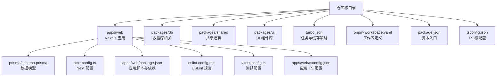
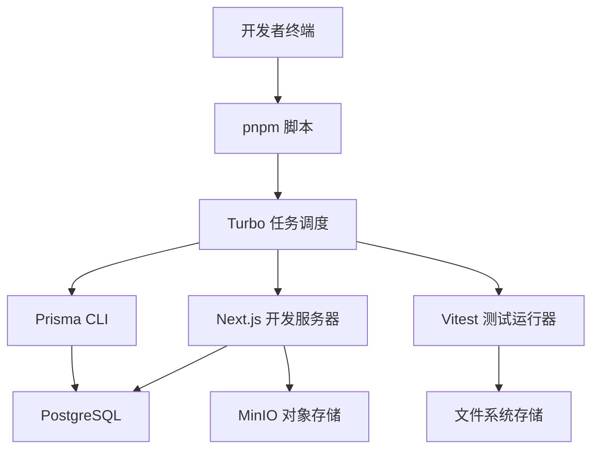
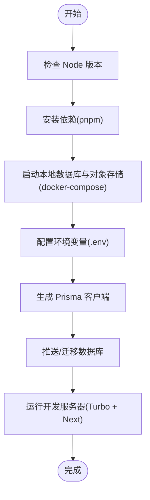
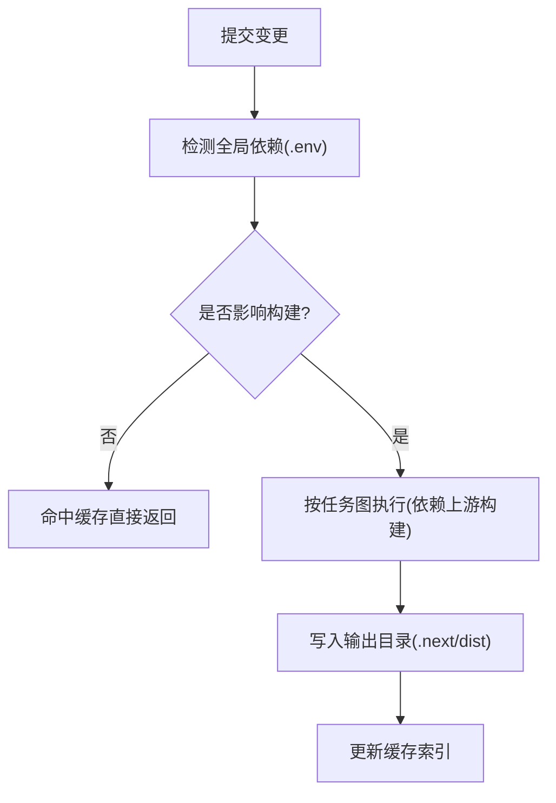
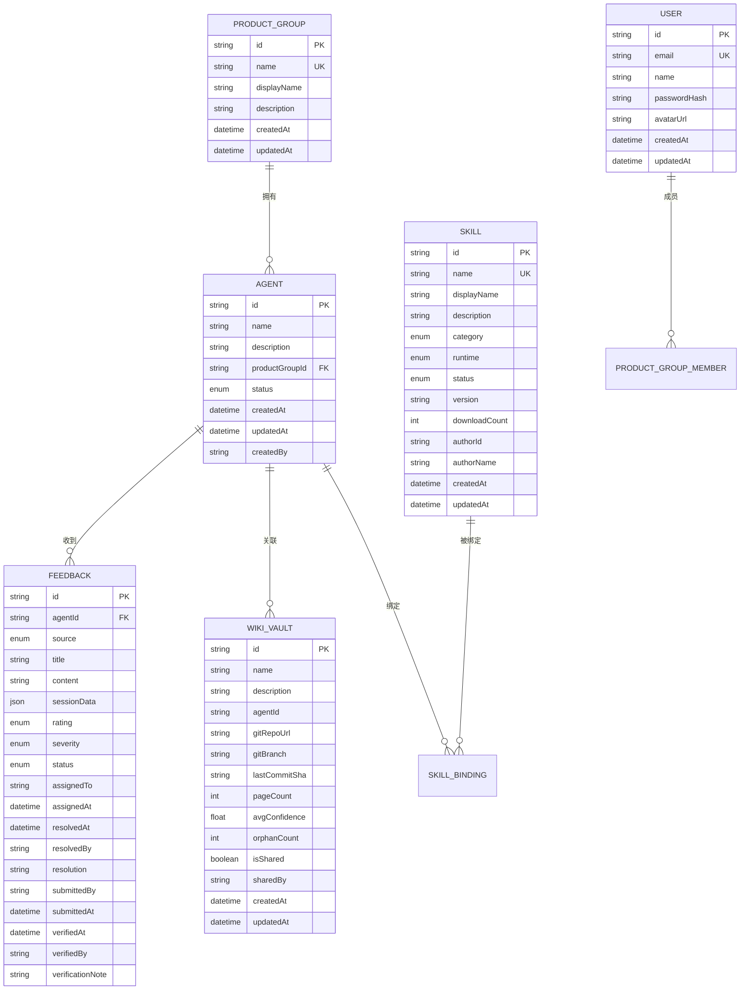
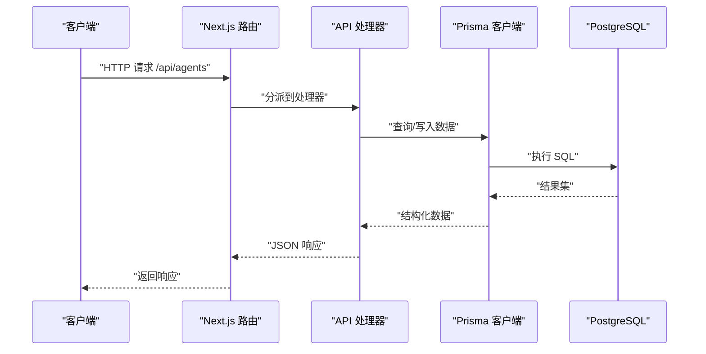
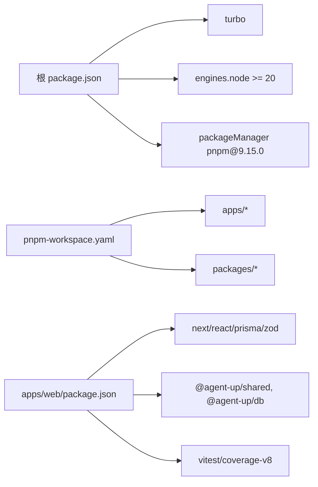

# 开发指南

<cite>
**本文引用的文件**   
- [package.json](file://package.json)
- [turbo.json](file://turbo.json)
- [pnpm-workspace.yaml](file://pnpm-workspace.yaml)
- [README.md](file://README.md)
- [apps/web/package.json](file://apps/web/package.json)
- [apps/web/eslint.config.mjs](file://apps/web/eslint.config.mjs)
- [apps/web/next.config.ts](file://apps/web/next.config.ts)
- [apps/web/tsconfig.json](file://apps/web/tsconfig.json)
- [tsconfig.json](file://tsconfig.json)
- [apps/web/prisma/schema.prisma](file://apps/web/prisma/schema.prisma)
- [docker-compose.yml](file://docker-compose.yml)
- [apps/web/vitest.config.ts](file://apps/web/vitest.config.ts)
- [apps/web/app/api/__tests__/agents.test.ts](file://apps/web/app/api/__tests__/agents.test.ts)
- [apps/web/lib/__tests__/utils.test.ts](file://apps/web/lib/__tests__/utils.test.ts)
- [apps/web/lib/data/store.ts](file://apps/web/lib/data/store.ts)
- [apps/web/lib/__tests__/helpers/mock-store.ts](file://apps/web/lib/__tests__/helpers/mock-store.ts)
- [apps/web/lib/services/agent-service.ts](file://apps/web/lib/services/agent-service.ts)
- [apps/web/app/(dashboard)/architecture/page.tsx](file://apps/web/app/(dashboard)/architecture/page.tsx)
- [apps/web/app/(dashboard)/architecture/harness/page.tsx](file://apps/web/app/(dashboard)/architecture/harness/page.tsx)
- [apps/web/app/(dashboard)/architecture/loop/page.tsx](file://apps/web/app/(dashboard)/architecture/loop/page.tsx)
- [apps/web/app/(dashboard)/architecture/roadmap/page.tsx](file://apps/web/app/(dashboard)/architecture/roadmap/page.tsx)
- [apps/web/app/(dashboard)/architecture/_components/ui.tsx](file://apps/web/app/(dashboard)/architecture/_components/ui.tsx)
</cite>

## 更新摘要
**所做更改**
- 新增完整的测试基础设施章节，涵盖 Vitest 配置、测试策略和最佳实践
- 增强数据持久化层的测试隔离机制说明
- 更新 API 路由测试模式和集成测试指导
- 补充服务层测试方法和 Mock 策略
- 强化构建系统与缓存策略的实际应用示例
- 增加性能分析和调试技巧的实践指导

## 目录
1. [简介](#简介)
2. [项目结构](#项目结构)
3. [核心组件](#核心组件)
4. [架构总览](#架构总览)
5. [详细组件分析](#详细组件分析)
6. [依赖分析](#依赖分析)
7. [性能考虑](#性能考虑)
8. [故障排除指南](#故障排除指南)
9. [结论](#结论)
10. [附录](#附录)

## 简介
本指南面向希望参与 Agent Up 项目的开发者，涵盖开发环境搭建、代码规范与质量检查、Turbo 构建系统与缓存策略、Git 工作流与提交规范、调试与测试方法、性能分析与优化建议、代码审查流程与贡献方式，以及常见问题排查。目标是帮助新成员快速上手并高效协作。

## 项目结构
本项目采用 pnpm workspace + Turborepo 的 Monorepo 组织方式：
- apps/web：Next.js 前端应用，包含页面、API 路由、Prisma 数据模型等
- packages/db、packages/shared、packages/ui：共享包（当前为空目录，后续可扩展）
- 根级配置：包管理、TypeScript、Turborepo 任务定义等



**图表来源**
- [turbo.json:1-31](file://turbo.json#L1-L31)
- [pnpm-workspace.yaml:1-4](file://pnpm-workspace.yaml#L1-L4)
- [package.json:1-22](file://package.json#L1-L22)
- [apps/web/package.json:1-38](file://apps/web/package.json#L1-L38)
- [apps/web/prisma/schema.prisma:1-626](file://apps/web/prisma/schema.prisma#L1-L626)
- [apps/web/next.config.ts:1-8](file://apps/web/next.config.ts#L1-L8)
- [apps/web/eslint.config.mjs:1-19](file://apps/web/eslint.config.mjs#L1-L19)
- [apps/web/vitest.config.ts:1-39](file://apps/web/vitest.config.ts#L1-L39)
- [apps/web/tsconfig.json:1-35](file://apps/web/tsconfig.json#L1-L35)
- [tsconfig.json:1-22](file://tsconfig.json#L1-L22)

**章节来源**
- [README.md:1-3](file://README.md#L1-L3)
- [pnpm-workspace.yaml:1-4](file://pnpm-workspace.yaml#L1-L4)
- [package.json:1-22](file://package.json#L1-L22)

## 核心组件
- 包管理与脚本
  - 根 package.json 提供统一脚本入口，通过 Turbo 编排 dev/build/lint/db:* 等任务
  - apps/web/package.json 定义 Next.js 开发、构建、Prisma 命令及清理脚本
- 构建与缓存
  - turbo.json 定义全局依赖、任务依赖关系、输入输出与缓存策略
- 代码质量
  - ESLint 基于 Next 官方配置启用 Core Web Vitals 与 TypeScript 规则
  - TypeScript 在根与应用层分别配置，确保严格模式与模块解析一致
- 数据层
  - Prisma 使用 PostgreSQL，schema 定义了 Agent、Skill、Wiki、Release、Feedback 等核心实体
  - 文件系统存储层提供数据持久化能力，支持测试隔离
- 运行环境
  - docker-compose 提供本地 Postgres 与 MinIO 服务，便于联调
- **新增** 测试基础设施
  - Vitest 测试框架配置，支持单元测试和集成测试
  - 完整的测试覆盖率要求和报告生成
  - 测试数据隔离和 Mock 策略

**章节来源**
- [package.json:1-22](file://package.json#L1-L22)
- [apps/web/package.json:1-38](file://apps/web/package.json#L1-L38)
- [turbo.json:1-31](file://turbo.json#L1-L31)
- [apps/web/eslint.config.mjs:1-19](file://apps/web/eslint.config.mjs#L1-L19)
- [apps/web/vitest.config.ts:1-39](file://apps/web/vitest.config.ts#L1-L39)
- [apps/web/tsconfig.json:1-35](file://apps/web/tsconfig.json#L1-L35)
- [tsconfig.json:1-22](file://tsconfig.json#L1-L22)
- [apps/web/prisma/schema.prisma:1-626](file://apps/web/prisma/schema.prisma#L1-L626)
- [docker-compose.yml:1-39](file://docker-compose.yml#L1-L39)

## 架构总览
下图展示了本地开发与构建时的关键组件交互：开发者通过 pnpm 调用根脚本，Turbo 分发到各子任务；Next.js 应用读取 Prisma 客户端访问 PostgreSQL；MinIO 作为对象存储用于知识库快照与附件。



**图表来源**
- [package.json:1-22](file://package.json#L1-L22)
- [turbo.json:1-31](file://turbo.json#L1-L31)
- [apps/web/package.json:1-38](file://apps/web/package.json#L1-L38)
- [apps/web/vitest.config.ts:1-39](file://apps/web/vitest.config.ts#L1-L39)
- [docker-compose.yml:1-39](file://docker-compose.yml#L1-L39)

## 详细组件分析

### 开发环境与启动
- 前置要求
  - Node.js 版本需满足 engines 要求
  - 使用 pnpm 作为包管理器
- 本地依赖服务
  - 使用 docker-compose 启动 Postgres 与 MinIO
  - 设置 DATABASE_URL 指向本地 Postgres
- 安装与初始化
  - 在工作区根执行依赖安装
  - 生成 Prisma 客户端并推送/迁移数据库
- 启动开发服务器
  - 通过根脚本启动 Turbo，再进入 Next.js 开发模式



**章节来源**
- [package.json:1-22](file://package.json#L1-L22)
- [apps/web/package.json:1-38](file://apps/web/package.json#L1-L38)
- [docker-compose.yml:1-39](file://docker-compose.yml#L1-L39)

### 构建系统与缓存策略（Turbo）
- 全局依赖
  - .env 变更会触发重新构建
- 任务定义
  - build：依赖上游包的 build 产物，输入包含默认源与环境变量，输出包含 .next 与 dist
  - dev：禁用缓存，持久运行
  - lint：依赖上游包的 build 产物
  - db:* 与 clean：禁用缓存
- 最佳实践
  - 合理划分 inputs/outputs，避免不必要的缓存失效
  - 对长耗时任务开启并行执行，利用 dependsOn 保证顺序



**图表来源**
- [turbo.json:1-31](file://turbo.json#L1-L31)

**章节来源**
- [turbo.json:1-31](file://turbo.json#L1-L31)

### 测试基础设施与策略

**新增** 项目已建立完整的测试基础设施，基于 Vitest 框架提供全面的测试覆盖

#### 测试配置概览
- 测试环境：Node.js 环境
- 测试文件位置：`lib/__tests__/**` 和 `app/api/__tests__/**`
- 覆盖率要求：行覆盖率 80%，函数覆盖率 80%，语句覆盖率 80%，分支覆盖率 70%
- 覆盖率报告：文本、文本摘要和 HTML 格式

#### 数据持久化测试隔离
项目实现了强大的测试隔离机制，确保每个测试用例都在独立的临时环境中运行：

```typescript
// 测试辅助工具
export function useTempDataDir(): void {
  tmpDir = mkdtempSync(join(tmpdir(), "agentup-test-"));
  // 把种子数据复制进临时目录的 data/ 子目录
  cpSync(seedDataDir, join(tmpDir, "data"), { recursive: true });
  _setDataDir(join(tmpDir, "data"));
}
```

#### API 路由测试模式
API 测试采用集成测试模式，模拟真实的 HTTP 请求：

```typescript
function makeRequest(
  method: string,
  body?: unknown,
  headers: Record<string, string> = {},
): NextRequest {
  return new NextRequest("http://localhost/api", {
    method,
    body: body !== undefined ? JSON.stringify(body) : undefined,
    headers: { "Content-Type": "application/json", ...headers },
  });
}
```

#### 服务层测试策略
服务层测试专注于业务逻辑验证，包括：
- 数据验证和错误处理
- 配置变更的版本控制
- 审计日志记录
- 数据一致性保证

**章节来源**
- [apps/web/vitest.config.ts:1-39](file://apps/web/vitest.config.ts#L1-L39)
- [apps/web/lib/__tests__/helpers/mock-store.ts:1-41](file://apps/web/lib/__tests__/helpers/mock-store.ts#L1-L41)
- [apps/web/app/api/__tests__/agents.test.ts:1-173](file://apps/web/app/api/__tests__/agents.test.ts#L1-L173)
- [apps/web/lib/__tests__/utils.test.ts:1-176](file://apps/web/lib/__tests__/utils.test.ts#L1-L176)
- [apps/web/lib/__tests__/agent-service.test.ts:1-118](file://apps/web/lib/__tests__/agent-service.test.ts#L1-L118)

### 代码规范与质量检查（ESLint/TS）

**更新** 新增了针对架构页面的 ESLint 规则豁免和 TypeScript 类型安全改进

#### ESLint 规则配置
- 使用 Next 官方配置，启用 Core Web Vitals 与 TypeScript 规则
- 覆盖默认忽略列表，确保构建产物不被检查
- **新增**：架构页面中的 `react/jsx-key` 规则豁免

#### 架构页面 JSX Key 豁免说明
在架构相关页面（architecture、harness、loop、roadmap）中，由于大量使用 `<Table rows={[...]}>` 的静态数据数组渲染模式，ESLint 的 `react/jsx-key` 规则会产生误报。这是因为：

1. **跨函数边界追踪限制**：ESLint 无法追踪 Table 组件内部的 map 渲染逻辑
2. **已统一赋 key**：实际的 key 赋值在 `_components/ui.tsx` 的 Table 组件内部实现
3. **静态数据场景**：这些页面使用的是预定义的静态数据，key 由组件统一管理

```typescript
// 架构页面中的豁免示例
/* eslint-disable react/jsx-key */
import { Mermaid } from "../../components/mermaid";
import {
  Card,
  Insight,
  NavGrid,
  PageHeader,
  Pill,
  ScoreDots,
  Section,
  Table,
} from "./_components/ui";
```

#### React Hook 最佳实践
- **有意的状态管理模式**：在复杂的数据表格场景中，使用受控组件配合局部状态管理
- **性能优化**：对于大型静态数据集，使用 useMemo 和 useCallback 优化重渲染
- **可访问性**：确保所有交互式元素都有适当的 ARIA 标签和键盘导航支持

#### TypeScript 类型安全改进
- **强类型约束**：为所有 API 响应和组件 props 定义明确的接口
- **类型守卫**：使用类型谓词进行运行时类型检查
- **泛型应用**：在通用组件中使用泛型提高类型安全性
- **空值处理**：使用可选链和非空断言的平衡策略

**章节来源**
- [apps/web/eslint.config.mjs:1-19](file://apps/web/eslint.config.mjs#L1-L19)
- [apps/web/tsconfig.json:1-35](file://apps/web/tsconfig.json#L1-L35)
- [tsconfig.json:1-22](file://tsconfig.json#L1-L22)
- [apps/web/app/(dashboard)/architecture/page.tsx:1-429](file://apps/web/app/(dashboard)/architecture/page.tsx#L1-L429)
- [apps/web/app/(dashboard)/architecture/_components/ui.tsx:74-116](file://apps/web/app/(dashboard)/architecture/_components/ui.tsx#L74-L116)

### 数据模型与数据库（Prisma）
- 提供者与连接
  - 使用 PostgreSQL，连接字符串来自环境变量
- 核心实体
  - 组织与用户：ProductGroup、User、Role、Permission 等
  - Agent 四分区配置：PromptConfig、KnowledgeConfig、ToolsConfig、RoutingConfig
  - 发布与版本：Release、AgentVersion、ConfigChange
  - 技能与绑定：Skill、SkillVersion、AgentSkillBinding
  - 知识库：WikiVault、WikiPage、WikiIngestJob
  - 反馈：Feedback 及其枚举
- 常用命令
  - 生成客户端、推送/迁移数据库、打开 Studio 可视化



**图表来源**
- [apps/web/prisma/schema.prisma:1-626](file://apps/web/prisma/schema.prisma#L1-L626)

**章节来源**
- [apps/web/prisma/schema.prisma:1-626](file://apps/web/prisma/schema.prisma#L1-L626)

### API 与服务端路由（Next.js App Router）
- 路由位置
  - 应用内 API 路由位于 app/api 下，例如 agents 路由
- 请求处理流程
  - 客户端发起 HTTP 请求
  - Next.js 路由匹配到对应 handler
  - 业务逻辑调用 Prisma 客户端读写数据库
  - 返回 JSON 响应



**图表来源**
- [apps/web/package.json:1-38](file://apps/web/package.json#L1-L38)
- [apps/web/prisma/schema.prisma:1-626](file://apps/web/prisma/schema.prisma#L1-L626)

**章节来源**
- [apps/web/package.json:1-38](file://apps/web/package.json#L1-L38)

### 配置与工程化（Next/TS）
- Next 配置
  - 根导出空配置对象，可按需扩展
- TypeScript 配置
  - 根与 app 层分别配置，保持严格性与一致性
  - 启用增量编译与声明映射，提升 DX

**更新** 增强了类型安全的最佳实践指导

**章节来源**
- [apps/web/next.config.ts:1-8](file://apps/web/next.config.ts#L1-L8)
- [apps/web/tsconfig.json:1-35](file://apps/web/tsconfig.json#L1-L35)
- [tsconfig.json:1-22](file://tsconfig.json#L1-L22)

## 依赖分析
- 包管理器与工作区
  - pnpm-workspace.yaml 声明 apps/* 与 packages/* 为工作区
- 根脚本与依赖
  - 根 package.json 通过 Turbo 编排任务，锁定 pnpm 与 Node 版本
- 应用依赖
  - apps/web 依赖 Next、React、Prisma、Zod 与内部 workspace 包
- **新增** 测试依赖
  - Vitest 测试框架和覆盖率工具
  - 测试辅助库和 Mock 工具



**图表来源**
- [package.json:1-22](file://package.json#L1-L22)
- [pnpm-workspace.yaml:1-4](file://pnpm-workspace.yaml#L1-L4)
- [apps/web/package.json:1-38](file://apps/web/package.json#L1-L38)

**章节来源**
- [package.json:1-22](file://package.json#L1-L22)
- [pnpm-workspace.yaml:1-4](file://pnpm-workspace.yaml#L1-L4)
- [apps/web/package.json:1-38](file://apps/web/package.json#L1-L38)

## 性能考虑
- 构建与缓存
  - 合理使用 turbo.json 的 inputs/outputs，减少无效重建
  - 对频繁变动的 .env 变更进行最小化影响范围控制
- 开发体验
  - 使用 Next Turbopack 加速开发（已在应用脚本中启用）
  - 启用 TS 增量编译与 isolatedModules
- 运行时
  - 数据库查询按需选择字段，避免 N+1
  - 大对象（如知识库内容）优先走对象存储，减少数据库压力
- **更新** 增加了 React 组件性能优化建议
  - 使用 React.memo 包裹纯展示组件
  - 合理使用 useReducer 管理复杂状态
  - 避免在渲染函数中创建新的对象引用
- **新增** 测试性能优化
  - 使用内存文件系统替代磁盘 I/O 进行测试
  - 合理设计测试数据大小，避免过大的测试套件
  - 利用测试并行执行提升测试速度

[本节为通用指导，不直接分析具体文件]

## 故障排除指南
- 无法连接数据库
  - 确认 docker-compose 已启动且端口未被占用
  - 检查 DATABASE_URL 是否正确指向本地 Postgres
- 构建失败或缓存异常
  - 清理缓存与构建产物后重试
  - 检查 turbo.json 的 outputs 是否与实际产物目录一致
- ESLint 报错
  - 确认已安装依赖并使用正确的配置文件
  - 在 IDE 中启用 ESLint 插件以实时提示
  - **新增**：对于架构页面的 jsx-key 警告，确认已正确添加豁免注释
- Prisma 客户端未生成
  - 执行生成命令后再运行应用
- 端口冲突
  - 修改 docker-compose 暴露端口或停止占用进程
- **新增** 测试相关问题
  - 测试数据污染：确保使用 `useTempDataDir()` 进行数据隔离
  - 测试速度慢：检查是否有不必要的网络请求或文件 I/O
  - 覆盖率不足：使用 `vitest run --coverage` 查看详细覆盖率报告

**更新** 增加了测试相关的故障排除指导

**章节来源**
- [docker-compose.yml:1-39](file://docker-compose.yml#L1-L39)
- [turbo.json:1-31](file://turbo.json#L1-L31)
- [apps/web/eslint.config.mjs:1-19](file://apps/web/eslint.config.mjs#L1-L19)
- [apps/web/vitest.config.ts:1-39](file://apps/web/vitest.config.ts#L1-L39)
- [apps/web/package.json:1-38](file://apps/web/package.json#L1-L38)

## 结论
通过统一的脚本入口、严格的类型与代码质量检查、合理的缓存策略与清晰的数据库模型，Agent Up 提供了良好的可维护性与可扩展性。遵循本指南可以快速搭建环境、稳定构建与高效协作。

**更新** 随着测试基础设施的完善和 ESLint 规则的优化，项目的代码质量和开发体验得到了进一步提升。完整测试覆盖确保了代码的稳定性，而现代化的构建系统则提升了开发效率。

[本节为总结，不直接分析具体文件]

## 附录

### Git 工作流与分支策略
- 分支命名
  - feature/xxx、fix/xxx、chore/xxx、docs/xxx
- 提交规范
  - 使用约定式提交（feat/fix/docs/chore 等），简要描述变更目的
- 合并流程
  - 创建 Pull Request，至少一名审阅者通过后合并至主分支

[本节为通用指导，不直接分析具体文件]

### 代码审查清单
- 功能正确性与边界条件
- 类型与接口设计清晰
- 性能与安全无回归
- 文档与注释完善
- 测试覆盖关键路径
- **新增**：ESLint 规则合规性检查
- **新增**：TypeScript 类型安全性验证
- **新增**：测试用例充分性和数据隔离验证

[本节为通用指导，不直接分析具体文件]

### 调试技巧
- 浏览器 DevTools 与 Network 面板定位 API 问题
- 服务端日志与错误堆栈收集
- 使用 Prisma Studio 查看数据状态
- **新增**：使用 React Developer Tools 分析组件性能
- **新增**：使用 Vitest UI 查看测试结果和覆盖率

[本节为通用指导，不直接分析具体文件]

### 测试策略

**新增** 项目采用多层次的测试策略，确保代码质量和稳定性

#### 单元测试
- 工具函数测试：验证 parsePagination、paginationMeta 等工具函数的行为
- 服务层测试：验证业务逻辑的正确性，如 Agent 配置管理、版本控制等
- 数据层测试：验证数据存储和检索的可靠性

#### 集成测试
- API 路由测试：模拟完整的 HTTP 请求流程，验证端到端功能
- 数据库交互测试：确保数据持久化和查询的正确性
- 外部依赖测试：Mock 外部服务，验证集成逻辑

#### 测试最佳实践
- 使用临时数据目录确保测试隔离
- 合理设计测试数据，避免过度耦合
- 关注边界条件和异常情况
- 保持测试的可读性和可维护性

**章节来源**
- [apps/web/lib/__tests__/utils.test.ts:1-176](file://apps/web/lib/__tests__/utils.test.ts#L1-L176)
- [apps/web/app/api/__tests__/agents.test.ts:1-173](file://apps/web/app/api/__tests__/agents.test.ts#L1-L173)
- [apps/web/lib/__tests__/agent-service.test.ts:1-118](file://apps/web/lib/__tests__/agent-service.test.ts#L1-L118)

### 性能分析方法
- 构建阶段：分析 Turbo 缓存命中率与任务耗时
- 运行阶段：使用浏览器 Performance 面板与 Lighthouse
- 数据库：慢查询分析与索引优化
- **新增**：React 组件性能分析：使用 Profiler 识别重渲染问题
- **新增**：测试性能分析：监控测试执行时间和资源消耗

[本节为通用指导，不直接分析具体文件]

### 架构页面开发最佳实践

**新增** 针对架构相关页面的特定开发指导

#### 静态数据表格渲染
```typescript
// 推荐模式：使用 Table 组件的 rows 属性
const tableRows = [
  ["分区", "内容", "类比", "改它的典型场景"],
  [
    <strong>Prompt</strong>,
    "系统提示词、角色设定、约束条件、输出格式",
    "Agent 的「性格与纪律」",
    "回答风格不对、越界承诺、格式混乱",
  ],
];

<Table head={tableRows[0]} rows={tableRows.slice(1)} />
```

#### ESLint 豁免的正确用法
```typescript
/* 
 * 本页大量把 JSX 写在 <Table rows={[...]}> 的静态数据数组里；
 * Table 内部 map 渲染时已统一赋 key（见 _components/ui.tsx），
 * react/jsx-key 无法跨函数边界追踪，属于误报，故在本页豁免。
 */
/* eslint-disable react/jsx-key */
```

#### 组件复用模式
- 使用 `Section` 组件封装内容区块
- 使用 `Insight` 组件突出重要信息
- 使用 `Card` 组件展示独立的信息单元
- 使用 `Pill` 组件显示状态标签

**章节来源**
- [apps/web/app/(dashboard)/architecture/page.tsx:145-173](file://apps/web/app/(dashboard)/architecture/page.tsx#L145-L173)
- [apps/web/app/(dashboard)/architecture/_components/ui.tsx:74-116](file://apps/web/app/(dashboard)/architecture/_components/ui.tsx#L74-L116)
- [apps/web/app/(dashboard)/architecture/harness/page.tsx:1-510](file://apps/web/app/(dashboard)/architecture/harness/page.tsx#L1-L510)
- [apps/web/app/(dashboard)/architecture/loop/page.tsx:1-469](file://apps/web/app/(dashboard)/architecture/loop/page.tsx#L1-L469)
- [apps/web/app/(dashboard)/architecture/roadmap/page.tsx:1-348](file://apps/web/app/(dashboard)/architecture/roadmap/page.tsx#L1-L348)

### 数据持久化层测试指南

**新增** 针对数据持久化层的测试最佳实践

#### 测试隔离机制
项目实现了强大的测试隔离机制，确保每个测试用例都在独立的临时环境中运行：

```typescript
// 在测试文件中正确使用
beforeEach(useTempDataDir);
afterEach(restoreDataDir);
```

#### 数据操作测试模式
- 读写操作测试：验证数据的持久化和检索
- 错误处理测试：验证数据损坏、权限不足等异常情况
- 并发安全测试：验证多线程环境下的数据一致性

**章节来源**
- [apps/web/lib/data/store.ts:1-158](file://apps/web/lib/data/store.ts#L1-L158)
- [apps/web/lib/__tests__/helpers/mock-store.ts:1-41](file://apps/web/lib/__tests__/helpers/mock-store.ts#L1-L41)
- [apps/web/lib/__tests__/store.test.ts:1-34](file://apps/web/lib/__tests__/store.test.ts#L1-L34)