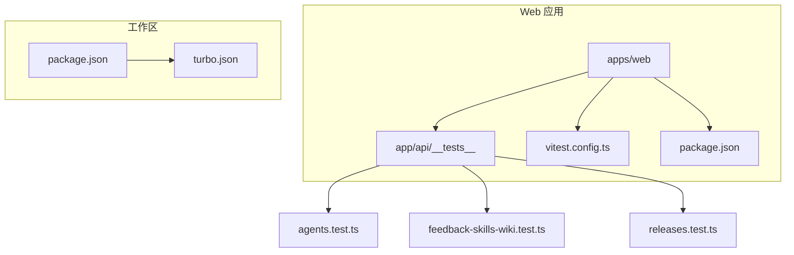
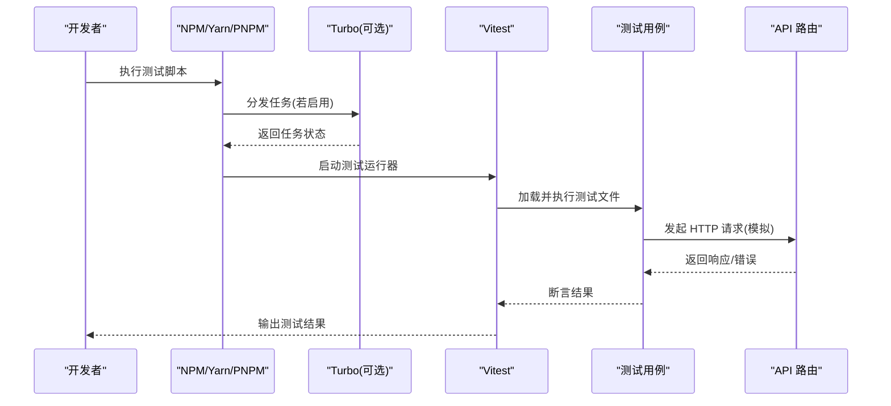
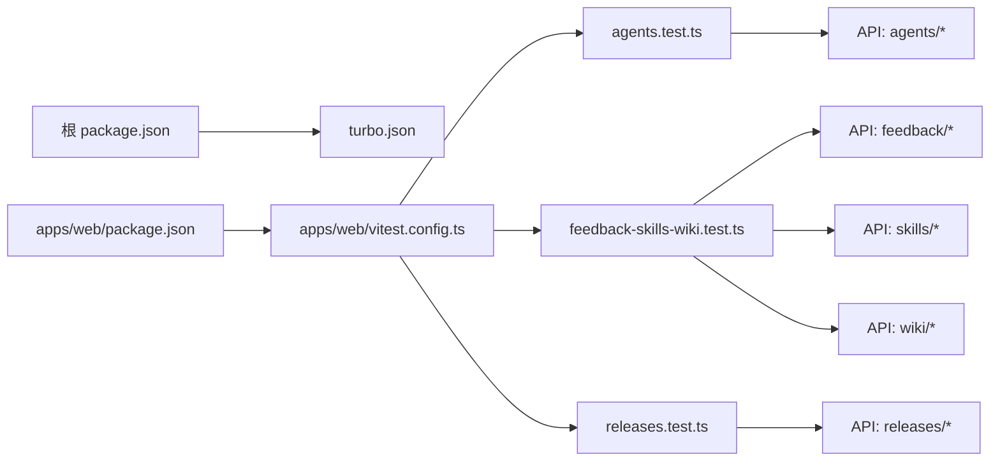

# 测试基础设施

<cite>
**本文引用的文件**   
- [apps/web/app/api/__tests__/agents.test.ts](file://apps/web/app/api/__tests__/agents.test.ts)
- [apps/web/app/api/__tests__/feedback-skills-wiki.test.ts](file://apps/web/app/api/__tests__/feedback-skills-wiki.test.ts)
- [apps/web/app/api/__tests__/releases.test.ts](file://apps/web/app/api/__tests__/releases.test.ts)
- [apps/web/vitest.config.ts](file://apps/web/vitest.config.ts)
- [apps/web/package.json](file://apps/web/package.json)
- [package.json](file://package.json)
- [turbo.json](file://turbo.json)
</cite>

## 目录
1. [简介](#简介)
2. [项目结构](#项目结构)
3. [核心组件](#核心组件)
4. [架构总览](#架构总览)
5. [详细组件分析](#详细组件分析)
6. [依赖分析](#依赖分析)
7. [性能考虑](#性能考虑)
8. [故障排查指南](#故障排查指南)
9. [结论](#结论)
10. [附录](#附录)

## 简介
本文件面向“AI Guru Global Agent Up”项目的测试基础设施，聚焦于 Next.js 应用中的 API 层单元测试与端到端测试配置。通过 Vitest 作为测试运行器，结合 Node/Next 环境适配，对 API 路由进行隔离测试，覆盖代理、反馈技能、知识库以及发布管理等关键业务域。文档将帮助读者快速理解测试组织方式、执行流程、扩展方法与常见问题定位。

## 项目结构
测试代码主要位于 apps/web 子应用中，采用按功能域划分的目录布局：
- 测试用例：apps/web/app/api/__tests__
- 测试运行器配置：apps/web/vitest.config.ts
- 脚本入口与依赖声明：apps/web/package.json
- 工作区与任务编排：根级 package.json 与 turbo.json

图表来源
- [apps/web/app/api/__tests__/agents.test.ts](file://apps/web/app/api/__tests__/agents.test.ts)
- [apps/web/app/api/__tests__/feedback-skills-wiki.test.ts](file://apps/web/app/api/__tests__/feedback-skills-wiki.test.ts)
- [apps/web/app/api/__tests__/releases.test.ts](file://apps/web/app/api/__tests__/releases.test.ts)
- [apps/web/vitest.config.ts](file://apps/web/vitest.config.ts)
- [apps/web/package.json](file://apps/web/package.json)
- [package.json](file://package.json)
- [turbo.json](file://turbo.json)

章节来源
- [apps/web/app/api/__tests__/agents.test.ts](file://apps/web/app/api/__tests__/agents.test.ts)
- [apps/web/app/api/__tests__/feedback-skills-wiki.test.ts](file://apps/web/app/api/__tests__/feedback-skills-wiki.test.ts)
- [apps/web/app/api/__tests__/releases.test.ts](file://apps/web/app/api/__tests__/releases.test.ts)
- [apps/web/vitest.config.ts](file://apps/web/vitest.config.ts)
- [apps/web/package.json](file://apps/web/package.json)
- [package.json](file://package.json)
- [turbo.json](file://turbo.json)

## 核心组件
- 测试运行器：Vitest（在 apps/web 中启用）
- 测试范围：API 路由层的请求/响应断言与错误路径覆盖
- 测试组织：按 API 模块划分测试文件，便于独立执行与维护
- 任务编排：通过工作区脚本统一触发各包的测试任务

章节来源
- [apps/web/vitest.config.ts](file://apps/web/vitest.config.ts)
- [apps/web/package.json](file://apps/web/package.json)
- [package.json](file://package.json)
- [turbo.json](file://turbo.json)

## 架构总览
下图展示了测试从命令入口到用例执行的调用链，以及被测对象（API 路由）的交互关系。

图表来源
- [apps/web/vitest.config.ts](file://apps/web/vitest.config.ts)
- [apps/web/package.json](file://apps/web/package.json)
- [package.json](file://package.json)
- [turbo.json](file://turbo.json)

## 详细组件分析

### 测试运行器与配置（Vitest）
- 作用：定义测试环境、匹配规则、全局设置等，确保测试可在 Next.js 环境中稳定运行
- 关键点：
  - 指定测试文件匹配模式（通常包含 __tests__ 目录）
  - 配置 Node/浏览器环境或自定义环境适配器
  - 可集成覆盖率、并行度、超时等参数

章节来源
- [apps/web/vitest.config.ts](file://apps/web/vitest.config.ts)

### 测试用例：代理（Agents）
- 目标：验证代理相关 API 的创建、查询、更新、删除等路径
- 关注点：
  - 请求参数校验与错误码
  - 数据一致性（如 ID、状态字段）
  - 异常分支（未授权、资源不存在等）

章节来源
- [apps/web/app/api/__tests__/agents.test.ts](file://apps/web/app/api/__tests__/agents.test.ts)

### 测试用例：反馈技能与知识库（Feedback, Skills, Wiki）
- 目标：覆盖反馈收集、技能检索与知识库页面访问等接口
- 关注点：
  - 多模块联动（如技能与 wiki 的关联）
  - 权限控制与审计日志（如涉及）
  - 数据格式与分页/过滤行为

章节来源
- [apps/web/app/api/__tests__/feedback-skills-wiki.test.ts](file://apps/web/app/api/__tests__/feedback-skills-wiki.test.ts)

### 测试用例：发布管理（Releases）
- 目标：验证发布生命周期相关接口（创建、审核、回滚等）
- 关注点：
  - 版本约束与兼容性检查
  - 审批流与状态机转换
  - 并发与幂等性保障

章节来源
- [apps/web/app/api/__tests__/releases.test.ts](file://apps/web/app/api/__tests__/releases.test.ts)

### 任务编排与工作区（Package 与 Turbo）
- 作用：在工作区内统一执行各包的测试、构建等任务，支持缓存与增量执行
- 关键点：
  - 根级 package.json 定义跨包脚本
  - turbo.json 定义任务依赖图与缓存策略

章节来源
- [package.json](file://package.json)
- [turbo.json](file://turbo.json)
- [apps/web/package.json](file://apps/web/package.json)

## 依赖分析
测试基础设施的关键依赖关系如下：
- 测试用例依赖 Vitest 运行时与环境
- 测试用例依赖被测 API 路由（通过模拟 HTTP 客户端或 Next.js 测试工具）
- 工作区脚本依赖 Turbo（可选）以加速并行执行

图表来源
- [package.json](file://package.json)
- [turbo.json](file://turbo.json)
- [apps/web/package.json](file://apps/web/package.json)
- [apps/web/vitest.config.ts](file://apps/web/vitest.config.ts)
- [apps/web/app/api/__tests__/agents.test.ts](file://apps/web/app/api/__tests__/agents.test.ts)
- [apps/web/app/api/__tests__/feedback-skills-wiki.test.ts](file://apps/web/app/api/__tests__/feedback-skills-wiki.test.ts)
- [apps/web/app/api/__tests__/releases.test.ts](file://apps/web/app/api/__tests__/releases.test.ts)

章节来源
- [package.json](file://package.json)
- [turbo.json](file://turbo.json)
- [apps/web/package.json](file://apps/web/package.json)
- [apps/web/vitest.config.ts](file://apps/web/vitest.config.ts)

## 性能考虑
- 并行执行：合理设置 Vitest 的 worker 数量，避免过多导致内存压力
- 测试数据：使用轻量级固定数据或内存数据库，减少外部依赖开销
- 缓存与增量：借助 Turbo 的任务缓存，仅重跑受影响用例
- 网络与 I/O：尽量 Mock 外部服务与数据库，缩短单用例耗时

[本节为通用指导，不直接分析具体文件]

## 故障排查指南
- 测试无法识别：确认 vitest.config.ts 的匹配规则是否包含 __tests__ 目录
- 环境变量缺失：检查测试环境所需的环境变量是否注入
- 依赖冲突：核对 apps/web/package.json 与根 package.json 的版本一致性
- 任务未执行：检查 turbo.json 的任务依赖是否正确配置
- 断言失败：优先查看被测 API 的错误响应结构与测试断言是否一致

章节来源
- [apps/web/vitest.config.ts](file://apps/web/vitest.config.ts)
- [apps/web/package.json](file://apps/web/package.json)
- [package.json](file://package.json)
- [turbo.json](file://turbo.json)

## 结论
本项目测试基础设施以 Vitest 为核心，围绕 Next.js API 路由展开模块化测试，并通过工作区与任务编排实现高效执行。建议持续完善用例覆盖、优化测试数据与 Mock 策略，并结合 CI 流水线提升质量保障能力。

[本节为总结性内容，不直接分析具体文件]

## 附录
- 常用命令（示例）：
  - 运行所有测试：在 apps/web 目录下执行测试脚本
  - 运行单个测试文件：指定文件名或路径
  - 生成覆盖率：启用覆盖率选项后执行测试
- 最佳实践：
  - 每个 API 模块对应一个测试文件
  - 用例命名清晰，覆盖正常与异常路径
  - 使用稳定的测试数据与明确的断言

[本节为补充信息，不直接分析具体文件]