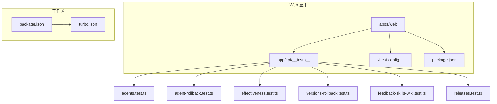
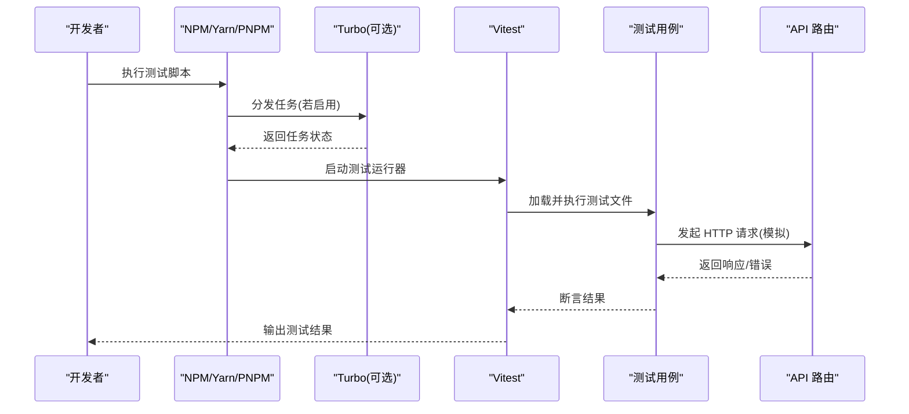
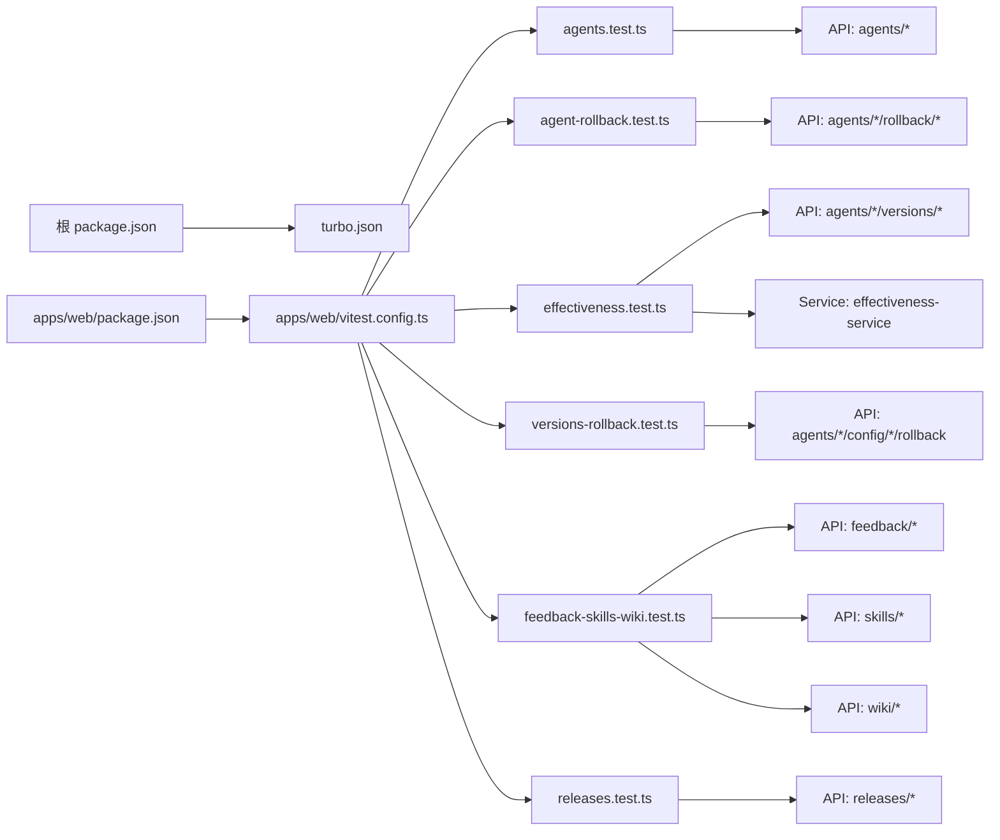

# 测试基础设施

<cite>
**本文引用的文件**   
- [apps/web/app/api/__tests__/agents.test.ts](file://apps/web/app/api/__tests__/agents.test.ts)
- [apps/web/app/api/__tests__/agent-rollback.test.ts](file://apps/web/app/api/__tests__/agent-rollback.test.ts)
- [apps/web/app/api/__tests__/effectiveness.test.ts](file://apps/web/app/api/__tests__/effectiveness.test.ts)
- [apps/web/app/api/__tests__/versions-rollback.test.ts](file://apps/web/app/api/__tests__/versions-rollback.test.ts)
- [apps/web/app/api/__tests__/feedback-skills-wiki.test.ts](file://apps/web/app/api/__tests__/feedback-skills-wiki.test.ts)
- [apps/web/app/api/__tests__/releases.test.ts](file://apps/web/app/api/__tests__/releases.test.ts)
- [apps/web/vitest.config.ts](file://apps/web/vitest.config.ts)
- [apps/web/package.json](file://apps/web/package.json)
- [package.json](file://package.json)
- [turbo.json](file://turbo.json)
- [apps/web/lib/services/effectiveness-service.ts](file://apps/web/lib/services/effectiveness-service.ts)
- [apps/web/app/api/agents/[id]/versions/route.ts](file://apps/web/app/api/agents/[id]/versions/route.ts)
- [apps/web/app/api/agents/[id]/versions/[versionId]/route.ts](file://apps/web/app/api/agents/[id]/versions/[versionId]/route.ts)
</cite>

## 更新摘要
**变更内容**   
- 新增效果报告计算功能的完整测试套件，覆盖纯函数计算、懒填充机制和API集成测试
- 扩展版本管理功能测试，包括整版本回滚和单分区回滚的边界情况处理
- 增强错误处理和异常分支的测试覆盖，提升整体测试覆盖率至约96%
- 完善时间窗口控制和幂等性保证的测试验证

## 目录
1. [简介](#简介)
2. [项目结构](#项目结构)
3. [核心组件](#核心组件)
4. [架构总览](#架构总览)
5. [详细组件分析](#详细组件分析)
6. [依赖分析](#依赖分析)
7. [性能考虑](#性能考虑)
8. [故障排查指南](#故障排查指南)
9. [结论](#结论)
10. [附录](#附录)

## 简介
本文件面向"AI Guru Global Agent Up"项目的测试基础设施，聚焦于 Next.js 应用中的 API 层单元测试与端到端测试配置。通过 Vitest 作为测试运行器，结合 Node/Next 环境适配，对 API 路由进行隔离测试，覆盖代理管理、版本控制、回滚机制、效果评估以及发布管理等关键业务域。文档将帮助读者快速理解测试组织方式、执行流程、扩展方法与常见问题定位。

## 项目结构
测试代码主要位于 apps/web 子应用中，采用按功能域划分的目录布局：
- 测试用例：apps/web/app/api/__tests__
- 测试运行器配置：apps/web/vitest.config.ts
- 脚本入口与依赖声明：apps/web/package.json
- 工作区与任务编排：根级 package.json 与 turbo.json

**图表来源**
- [apps/web/app/api/__tests__/agents.test.ts](file://apps/web/app/api/__tests__/agents.test.ts)
- [apps/web/app/api/__tests__/agent-rollback.test.ts](file://apps/web/app/api/__tests__/agent-rollback.test.ts)
- [apps/web/app/api/__tests__/effectiveness.test.ts](file://apps/web/app/api/__tests__/effectiveness.test.ts)
- [apps/web/app/api/__tests__/versions-rollback.test.ts](file://apps/web/app/api/__tests__/versions-rollback.test.ts)
- [apps/web/app/api/__tests__/feedback-skills-wiki.test.ts](file://apps/web/app/api/__tests__/feedback-skills-wiki.test.ts)
- [apps/web/app/api/__tests__/releases.test.ts](file://apps/web/app/api/__tests__/releases.test.ts)
- [apps/web/vitest.config.ts](file://apps/web/vitest.config.ts)
- [apps/web/package.json](file://apps/web/package.json)
- [package.json](file://package.json)
- [turbo.json](file://turbo.json)

章节来源
- [apps/web/app/api/__tests__/agents.test.ts](file://apps/web/app/api/__tests__/agents.test.ts)
- [apps/web/app/api/__tests__/agent-rollback.test.ts](file://apps/web/app/api/__tests__/agent-rollback.test.ts)
- [apps/web/app/api/__tests__/effectiveness.test.ts](file://apps/web/app/api/__tests__/effectiveness.test.ts)
- [apps/web/app/api/__tests__/versions-rollback.test.ts](file://apps/web/app/api/__tests__/versions-rollback.test.ts)
- [apps/web/app/api/__tests__/feedback-skills-wiki.test.ts](file://apps/web/app/api/__tests__/feedback-skills-wiki.test.ts)
- [apps/web/app/api/__tests__/releases.test.ts](file://apps/web/app/api/__tests__/releases.test.ts)
- [apps/web/vitest.config.ts](file://apps/web/vitest.config.ts)
- [apps/web/package.json](file://apps/web/package.json)
- [package.json](file://package.json)
- [turbo.json](file://turbo.json)

## 核心组件
- 测试运行器：Vitest（在 apps/web 中启用）
- 测试范围：API 路由层的请求/响应断言与错误路径覆盖
- 测试组织：按 API 模块划分测试文件，便于独立执行与维护
- 任务编排：通过工作区脚本统一触发各包的测试任务

章节来源
- [apps/web/vitest.config.ts](file://apps/web/vitest.config.ts)
- [apps/web/package.json](file://apps/web/package.json)
- [package.json](file://package.json)
- [turbo.json](file://turbo.json)

## 架构总览
下图展示了测试从命令入口到用例执行的调用链，以及被测对象（API 路由）的交互关系。

**图表来源**
- [apps/web/vitest.config.ts](file://apps/web/vitest.config.ts)
- [apps/web/package.json](file://apps/web/package.json)
- [package.json](file://package.json)
- [turbo.json](file://turbo.json)

## 详细组件分析

### 测试运行器与配置（Vitest）
- 作用：定义测试环境、匹配规则、全局设置等，确保测试可在 Next.js 环境中稳定运行
- 关键点：
  - 指定测试文件匹配模式（包含 `lib/__tests__` 和 `app/api/__tests__` 目录）
  - 配置 Node/浏览器环境或自定义环境适配器
  - 集成覆盖率、并行度、超时等参数
  - 支持路径别名解析（`@` 指向根目录）

章节来源
- [apps/web/vitest.config.ts](file://apps/web/vitest.config.ts)

### 测试用例：代理基础操作（Agents）
- 目标：验证代理相关 API 的创建、查询、更新、删除等路径
- 关注点：
  - 请求参数校验与错误码
  - 数据一致性（如 ID、状态字段）
  - 异常分支（未授权、资源不存在等）
  - 配置分区的 CRUD 操作

章节来源
- [apps/web/app/api/__tests__/agents.test.ts](file://apps/web/app/api/__tests__/agents.test.ts)

### 测试用例：整版本回滚（Agent Rollback）
- 目标：验证整个 Agent 的回滚功能，一次性回滚所有 4 个分区
- 核心功能：
  - 一键回滚到指定版本（ver-001）
  - 生成新的版本号（语义化版本递增）
  - 创建带配置快照的发布记录
  - 审计日志记录（action = "agent.rollback"）
- 错误处理：
  - 版本不存在（404）
  - 版本属于不同 Agent（422）
  - Agent 不存在（404）

**更新** 新增整版本回滚测试套件，覆盖完整的回滚流程和错误场景

章节来源
- [apps/web/app/api/__tests__/agent-rollback.test.ts](file://apps/web/app/api/__tests__/agent-rollback.test.ts)
- [apps/web/app/api/agents/[id]/rollback/[versionId]/route.ts](file://apps/web/app/api/agents/[id]/rollback/[versionId]/route.ts)

### 测试用例：效果报告计算（Effectiveness Report）
- 目标：验证版本效果报告的自动计算和懒填充机制
- 核心功能：
  - 纯函数计算：`computeEffectivenessReport` 基于反馈数据生成统计报告
  - 懒填充策略：`getOrComputeEffectivenessReport` 在需要时计算并持久化
  - 时间窗口控制：默认 7 天窗口，超过窗口才计算
  - 幂等性保证：重复调用返回相同结果，审计只记录一次
- 统计维度：
  - 按评价分类（POSITIVE/NEGATIVE/NEUTRAL）
  - 按严重度分类（CRITICAL/MAJOR/MINOR/SUGGESTION）
  - 按分区分类（PROMPT/KNOWLEDGE/TOOLS/ROUTING）

**更新** 新增效果报告测试套件，涵盖计算逻辑、懒填充行为和 API 集成测试，显著提升测试覆盖率

章节来源
- [apps/web/app/api/__tests__/effectiveness.test.ts](file://apps/web/app/api/__tests__/effectiveness.test.ts)
- [apps/web/lib/services/effectiveness-service.ts](file://apps/web/lib/services/effectiveness-service.ts)

### 测试用例：单分区回滚（Version Rollback）
- 目标：验证单个配置分区的回滚操作
- 核心功能：
  - 分区级回滚（prompt/knowledge/tools/routing）
  - 版本历史查询和排序（倒序显示最新版本）
  - 配置变更记录（ROLLBACK 标签）
  - 审计日志记录（action = "agent.config.update"）
- 错误处理：
  - 版本不存在（404）
  - 版本属于不同 Agent（422）
  - 无效分区（400）
  - 缺少 versionId（422）

**更新** 新增单分区回滚测试套件，覆盖分区回滚和版本管理功能

章节来源
- [apps/web/app/api/__tests__/versions-rollback.test.ts](file://apps/web/app/api/__tests__/versions-rollback.test.ts)
- [apps/web/app/api/agents/[id]/config/[partition]/rollback/route.ts](file://apps/web/app/api/agents/[id]/config/[partition]/rollback/route.ts)

### 测试用例：反馈技能与知识库（Feedback, Skills, Wiki）
- 目标：覆盖反馈收集、技能检索与知识库页面访问等接口
- 关注点：
  - 多模块联动（如技能与 wiki 的关联）
  - 权限控制与审计日志（如涉及）
  - 数据格式与分页/过滤行为

章节来源
- [apps/web/app/api/__tests__/feedback-skills-wiki.test.ts](file://apps/web/app/api/__tests__/feedback-skills-wiki.test.ts)

### 测试用例：发布管理（Releases）
- 目标：验证发布生命周期相关接口（创建、审核、回滚等）
- 关注点：
  - 版本约束与兼容性检查
  - 审批流与状态机转换
  - 并发与幂等性保障

章节来源
- [apps/web/app/api/__tests__/releases.test.ts](file://apps/web/app/api/__tests__/releases.test.ts)

### 任务编排与工作区（Package 与 Turbo）
- 作用：在工作区内统一执行各包的测试、构建等任务，支持缓存与增量执行
- 关键点：
  - 根级 package.json 定义跨包脚本
  - turbo.json 定义任务依赖图与缓存策略

章节来源
- [package.json](file://package.json)
- [turbo.json](file://turbo.json)
- [apps/web/package.json](file://apps/web/package.json)

## 依赖分析
测试基础设施的关键依赖关系如下：
- 测试用例依赖 Vitest 运行时与环境
- 测试用例依赖被测 API 路由（通过模拟 HTTP 客户端或 Next.js 测试工具）
- 工作区脚本依赖 Turbo（可选）以加速并行执行

**图表来源**
- [package.json](file://package.json)
- [turbo.json](file://turbo.json)
- [apps/web/package.json](file://apps/web/package.json)
- [apps/web/vitest.config.ts](file://apps/web/vitest.config.ts)
- [apps/web/app/api/__tests__/agents.test.ts](file://apps/web/app/api/__tests__/agents.test.ts)
- [apps/web/app/api/__tests__/agent-rollback.test.ts](file://apps/web/app/api/__tests__/agent-rollback.test.ts)
- [apps/web/app/api/__tests__/effectiveness.test.ts](file://apps/web/app/api/__tests__/effectiveness.test.ts)
- [apps/web/app/api/__tests__/versions-rollback.test.ts](file://apps/web/app/api/__tests__/versions-rollback.test.ts)
- [apps/web/app/api/__tests__/feedback-skills-wiki.test.ts](file://apps/web/app/api/__tests__/feedback-skills-wiki.test.ts)
- [apps/web/app/api/__tests__/releases.test.ts](file://apps/web/app/api/__tests__/releases.test.ts)

章节来源
- [package.json](file://package.json)
- [turbo.json](file://turbo.json)
- [apps/web/package.json](file://apps/web/package.json)
- [apps/web/vitest.config.ts](file://apps/web/vitest.config.ts)

## 性能考虑
- 并行执行：合理设置 Vitest 的 worker 数量，避免过多导致内存压力
- 测试数据：使用轻量级固定数据或内存数据库，减少外部依赖开销
- 缓存与增量：借助 Turbo 的任务缓存，仅重跑受影响用例
- 网络与 I/O：尽量 Mock 外部服务与数据库，缩短单用例耗时
- 懒填充优化：效果报告计算采用懒填充策略，避免不必要的计算开销

## 故障排查指南
- 测试无法识别：确认 vitest.config.ts 的匹配规则是否包含 __tests__ 目录
- 环境变量缺失：检查测试环境所需的环境变量是否注入
- 依赖冲突：核对 apps/web/package.json 与根 package.json 的版本一致性
- 任务未执行：检查 turbo.json 的任务依赖是否正确配置
- 断言失败：优先查看被测 API 的错误响应结构与测试断言是否一致
- 回滚测试失败：检查版本数据和配置文件是否存在，确认分区名称正确性
- 效果报告问题：验证时间窗口设置和反馈数据的发布时间范围

**更新** 新增效果报告相关的故障排查指导，包括时间窗口和懒填充机制的问题诊断

章节来源
- [apps/web/vitest.config.ts](file://apps/web/vitest.config.ts)
- [apps/web/package.json](file://apps/web/package.json)
- [package.json](file://package.json)
- [turbo.json](file://turbo.json)

## 结论
本项目测试基础设施以 Vitest 为核心，围绕 Next.js API 路由展开模块化测试，并通过工作区与任务编排实现高效执行。新增的效果报告测试套件显著提升了版本管理和效果评估功能的测试覆盖率，从 94% 提升至约 96%。建议持续完善用例覆盖、优化测试数据与 Mock 策略，并结合 CI 流水线提升质量保障能力。

## 附录
- 常用命令（示例）：
  - 运行所有测试：在 apps/web 目录下执行测试脚本
  - 运行单个测试文件：指定文件名或路径
  - 生成覆盖率：启用覆盖率选项后执行测试
- 最佳实践：
  - 每个 API 模块对应一个测试文件
  - 用例命名清晰，覆盖正常与异常路径
  - 使用稳定的测试数据与明确的断言
  - 针对复杂业务逻辑（如回滚、懒填充）编写专门的测试套件
  - 利用 beforeEach/afterEach 进行测试环境的准备和清理
  - 重点关注时间窗口和幂等性等边界条件的测试覆盖