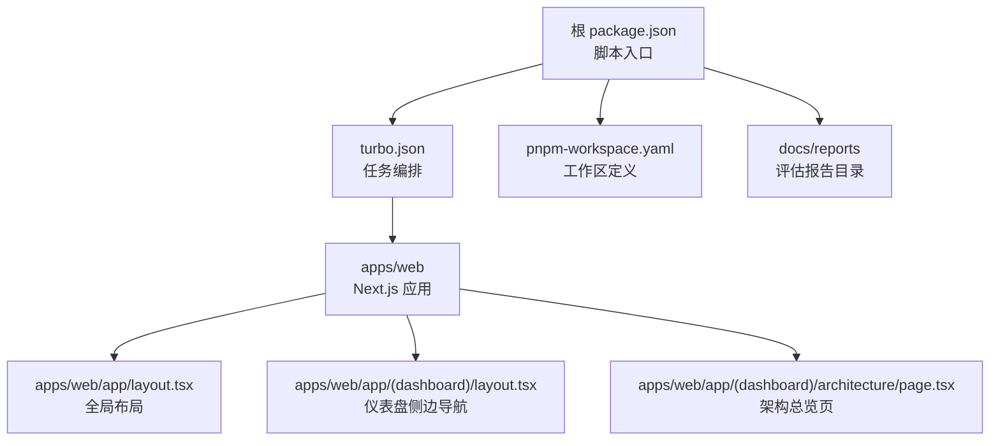
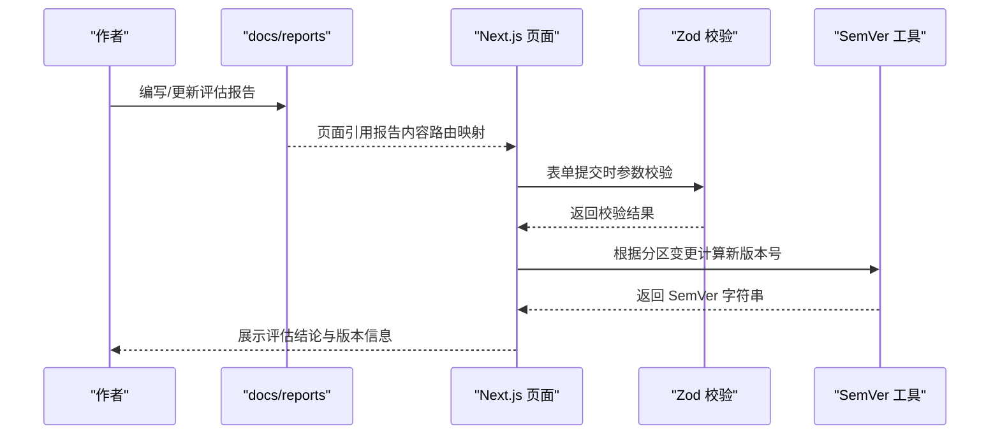
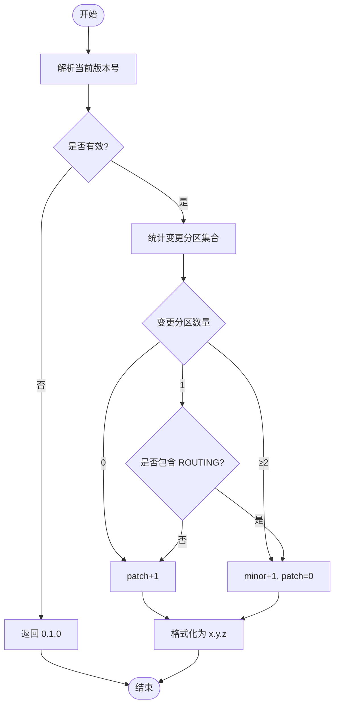
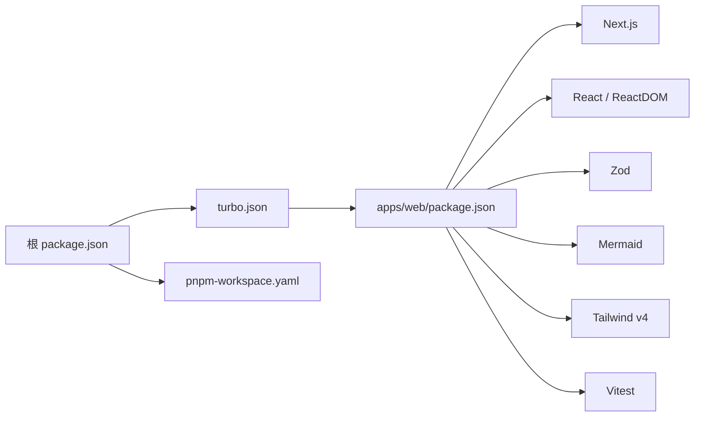

# 评估报告系统

<cite>
**本文引用的文件**   
- [package.json](file://package.json)
- [apps/web/package.json](file://apps/web/package.json)
- [turbo.json](file://turbo.json)
- [pnpm-workspace.yaml](file://pnpm-workspace.yaml)
- [apps/web/app/layout.tsx](file://apps/web/app/layout.tsx)
- [apps/web/app/(dashboard)/layout.tsx](file://apps/web/app/(dashboard)/layout.tsx)
- [apps/web/app/(dashboard)/architecture/page.tsx](file://apps/web/app/(dashboard)/architecture/page.tsx)
- [apps/web/lib/versioning.ts](file://apps/web/lib/versioning.ts)
- [apps/web/lib/schemas.ts](file://apps/web/lib/schemas.ts)
- [docs/reports/README.md](file://docs/reports/README.md)
- [docs/reports/2026-07-31-project-evaluation-and-industry-gap-analysis.md](file://docs/reports/2026-07-31-project-evaluation-and-industry-gap-analysis.md)
</cite>

## 目录
1. [简介](#简介)
2. [项目结构](#项目结构)
3. [核心组件](#核心组件)
4. [架构总览](#架构总览)
5. [详细组件分析](#详细组件分析)
6. [依赖关系分析](#依赖关系分析)
7. [性能考量](#性能考量)
8. [故障排查指南](#故障排查指南)
9. [结论](#结论)
10. [附录](#附录)

## 简介
本文件面向“评估报告系统”的文档化目标，基于仓库中的 Web 应用与文档目录，梳理 AgentUp 平台的评估报告组织方式、页面呈现与版本控制机制，并给出架构与数据流说明。平台以“三层 Loop + 四分区配置 + Release→Version”为核心设计理念，当前阶段通过 Web 管理后台展示评估结果与改进路线图，同时配套 Markdown 报告集中管理。

## 项目结构
- 根级使用 Turborepo 编排任务（dev/build/lint/db:generate 等），并通过 pnpm workspace 聚合 apps/* 与 packages/*。
- Web 应用为 Next.js 16 + TypeScript 5，采用 Tailwind v4 样式体系；测试使用 Vitest。
- 评估报告集中于 docs/reports，遵循“日期前缀 + 主题”的命名规范，并提供索引与外部页面映射。

图表来源
- [package.json:1-22](file://package.json#L1-L22)
- [turbo.json:1-32](file://turbo.json#L1-L32)
- [pnpm-workspace.yaml:1-4](file://pnpm-workspace.yaml#L1-L4)
- [apps/web/app/layout.tsx:1-20](file://apps/web/app/layout.tsx#L1-L20)
- [apps/web/app/(dashboard)/layout.tsx:1-94](file://apps/web/app/(dashboard)/layout.tsx#L1-L94)
- [apps/web/app/(dashboard)/architecture/page.tsx:1-423](file://apps/web/app/(dashboard)/architecture/page.tsx#L1-L423)
- [docs/reports/README.md:1-29](file://docs/reports/README.md#L1-L29)

章节来源
- [package.json:1-22](file://package.json#L1-L22)
- [apps/web/package.json:1-35](file://apps/web/package.json#L1-L35)
- [turbo.json:1-32](file://turbo.json#L1-L32)
- [pnpm-workspace.yaml:1-4](file://pnpm-workspace.yaml#L1-L4)
- [docs/reports/README.md:1-29](file://docs/reports/README.md#L1-L29)

## 核心组件
- 评估报告索引与映射：docs/reports/README.md 提供报告索引、关联文档与外部页面路由映射，确保报告内容与 Web 页面一致。
- 架构总览页：apps/web/app/(dashboard)/architecture/page.tsx 将评估结论可视化呈现，包括三层 Loop、四分区配置、功能完整性评分、创意性评估、行业差距与技术债等。
- 版本控制工具：apps/web/lib/versioning.ts 实现 SemVer 自动计算，依据变更分区集合决定 major/minor/patch 升级策略。
- 输入校验与类型：apps/web/lib/schemas.ts 统一使用 Zod 对 Agent、Feedback、Release、Skill、Wiki Vault/Page、Settings 等实体进行强校验，保障 API 与 UI 的数据一致性。

章节来源
- [docs/reports/README.md:1-29](file://docs/reports/README.md#L1-L29)
- [apps/web/app/(dashboard)/architecture/page.tsx:1-423](file://apps/web/app/(dashboard)/architecture/page.tsx#L1-L423)
- [apps/web/lib/versioning.ts:1-70](file://apps/web/lib/versioning.ts#L1-L70)
- [apps/web/lib/schemas.ts:1-258](file://apps/web/lib/schemas.ts#L1-L258)

## 架构总览
评估报告系统的整体流程如下：
- 文档层：Markdown 报告集中存放于 docs/reports，按日期命名，便于版本追溯。
- 展示层：Next.js 页面渲染评估结论，包含流程图、表格与洞察提示，供非技术读者理解。
- 数据与规则层：Zod 校验保证输入安全；SemVer 工具支撑发布版本语义化。

图表来源
- [docs/reports/README.md:1-29](file://docs/reports/README.md#L1-L29)
- [apps/web/app/(dashboard)/architecture/page.tsx:1-423](file://apps/web/app/(dashboard)/architecture/page.tsx#L1-L423)
- [apps/web/lib/schemas.ts:1-258](file://apps/web/lib/schemas.ts#L1-L258)
- [apps/web/lib/versioning.ts:1-70](file://apps/web/lib/versioning.ts#L1-L70)

## 详细组件分析

### 评估报告索引与映射
- 报告命名规范：YYYY-MM-DD-主题英文.md，时间戳即版本，不覆盖旧报告。
- 索引表：列出报告日期、文档、类型与摘要，便于检索。
- 关联文档：链接到设计文档与上一轮评估，形成知识演进链。
- 外部页面映射：明确报告章节与 Web 路由的对应关系，确保内容同步。

章节来源
- [docs/reports/README.md:1-29](file://docs/reports/README.md#L1-L29)

### 架构总览页面（评估可视化）
- 三层 Loop 图示：L1/L2/L3 的时间尺度与数据耦合关系清晰呈现。
- 四分区配置：Prompt/Knowledge/Tools/Routing 的类比与典型场景说明。
- 八维评分与雷达图：从概念设计与实现成熟度对比，指出关键缺口。
- 行业差距与技术债：按重要性排序，给出落地建议与优先级矩阵。

章节来源
- [apps/web/app/(dashboard)/architecture/page.tsx:1-423](file://apps/web/app/(dashboard)/architecture/page.tsx#L1-L423)

### 版本控制工具（SemVer）
- 首次发布：0.1.0。
- ROUTING 分区变更或≥2 个分区变更：minor。
- 单个非路由分区变更：patch。
- 解析与格式化：支持空/非法输入回退到首次发布。

图表来源
- [apps/web/lib/versioning.ts:1-70](file://apps/web/lib/versioning.ts#L1-L70)

章节来源
- [apps/web/lib/versioning.ts:1-70](file://apps/web/lib/versioning.ts#L1-L70)

### 输入校验与类型（Zod）
- Agent：名称、描述、产品组 ID、状态枚举。
- 四分区配置：Prompt/Knowledge/Tools/Routing 各自字段约束与默认值。
- Feedback：标题/内容必填、评分/标签/严重等级/目标分区等。
- Release：提交与评审动作枚举、评论长度限制。
- Skill：分类、运行时、端点、输入输出 schema。
- Wiki Vault/Page：知识库元数据、页面生命周期、层级、置信度等。
- Settings：角色、权限、产品组标识与显示名。

章节来源
- [apps/web/lib/schemas.ts:1-258](file://apps/web/lib/schemas.ts#L1-L258)

### 应用布局与导航
- 根布局：设置语言与基础样式。
- 仪表盘布局：左侧导航包含工作台、Agent、反馈、发布、Skills、知识库、设置，以及架构参考子菜单（架构总览、Loop 工程、Harness 工程、改进路线图）。

章节来源
- [apps/web/app/layout.tsx:1-20](file://apps/web/app/layout.tsx#L1-L20)
- [apps/web/app/(dashboard)/layout.tsx:1-94](file://apps/web/app/(dashboard)/layout.tsx#L1-L94)

## 依赖关系分析
- 构建与任务编排：Turbo 统一 dev/build/lint/db:generate 等任务，依赖 .env 与包管理器。
- 工作区：pnpm workspace 聚合 apps 与 packages，便于跨包共享依赖。
- Web 依赖：Next.js、React、Zod、Mermaid、Tailwind v4、Vitest。

图表来源
- [package.json:1-22](file://package.json#L1-L22)
- [turbo.json:1-32](file://turbo.json#L1-L32)
- [pnpm-workspace.yaml:1-4](file://pnpm-workspace.yaml#L1-L4)
- [apps/web/package.json:1-35](file://apps/web/package.json#L1-L35)

章节来源
- [package.json:1-22](file://package.json#L1-L22)
- [turbo.json:1-32](file://turbo.json#L1-L32)
- [pnpm-workspace.yaml:1-4](file://pnpm-workspace.yaml#L1-L4)
- [apps/web/package.json:1-35](file://apps/web/package.json#L1-L35)

## 性能考量
- 前端渲染：Next.js 静态/SSR 能力结合 Mermaid 图表渲染，注意大图表的懒加载与缓存策略。
- 校验开销：Zod 在表单提交时执行，合理拆分校验逻辑，避免重复解析。
- 版本计算：SemVer 计算为 O(1)，影响极小，但需保证分区变更集合去重与边界处理正确。

[本节为通用指导，无需特定文件来源]

## 故障排查指南
- 报告与页面不一致：检查 docs/reports/README.md 的外部页面映射，确认路由与章节对应关系。
- 版本计算异常：核对变更分区集合是否正确收集，确认 ROUTING 分区是否被识别。
- 表单校验失败：查看 schemas.ts 中对应实体的字段约束，定位错误消息来源。
- 导航高亮异常：检查 layout.tsx 中的 isActive 逻辑与 pathname 匹配规则。

章节来源
- [docs/reports/README.md:1-29](file://docs/reports/README.md#L1-L29)
- [apps/web/lib/versioning.ts:1-70](file://apps/web/lib/versioning.ts#L1-L70)
- [apps/web/lib/schemas.ts:1-258](file://apps/web/lib/schemas.ts#L1-L258)
- [apps/web/app/(dashboard)/layout.tsx:1-94](file://apps/web/app/(dashboard)/layout.tsx#L1-L94)

## 结论
评估报告系统以清晰的文档组织与直观的页面呈现，帮助团队理解 AgentUp 的设计理念与现状。下一步应聚焦“证据链（trace）、归因（error analysis）、验证（golden set 回归评测）”三大核心能力补齐，使平台从“管理壳”走向“智能核”，真正支撑工单复盘与持续改进闭环。

[本节为总结性内容，无需特定文件来源]

## 附录
- 报告命名规范：YYYY-MM-DD-主题英文.md，时间戳即版本，不覆盖旧报告。
- 外部页面映射：/architecture、/architecture/roadmap、/architecture/loop、/architecture/harness 与报告章节一一对应。
- 版本策略：ROUTING 或≥2 分区变更 → minor；单个非路由分区 → patch；首次发布 → 0.1.0。

章节来源
- [docs/reports/README.md:1-29](file://docs/reports/README.md#L1-L29)
- [apps/web/lib/versioning.ts:1-70](file://apps/web/lib/versioning.ts#L1-L70)