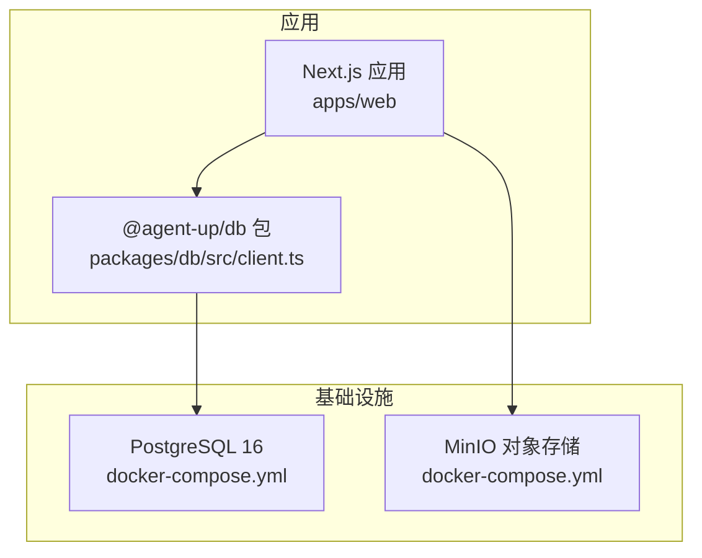
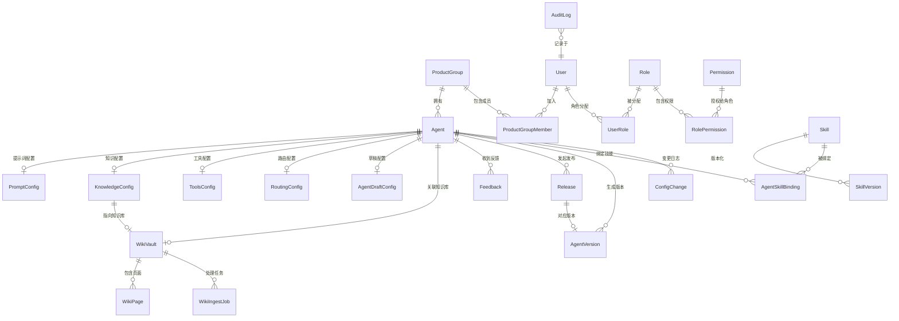
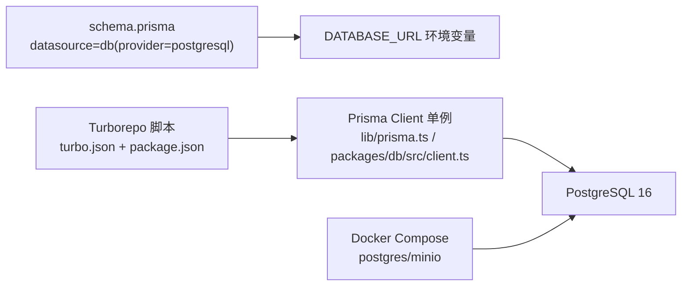

# 数据库设计

<cite>
**本文引用的文件**
- [apps/web/prisma/schema.prisma](file://apps/web/prisma/schema.prisma)
- [apps/web/lib/prisma.ts](file://apps/web/lib/prisma.ts)
- [packages/db/src/client.ts](file://packages/db/src/client.ts)
- [docker-compose.yml](file://docker-compose.yml)
- [turbo.json](file://turbo.json)
- [package.json](file://package.json)
</cite>

## 目录
1. [简介](#简介)
2. [项目结构](#项目结构)
3. [核心组件](#核心组件)
4. [架构总览](#架构总览)
5. [详细组件分析](#详细组件分析)
6. [依赖关系分析](#依赖关系分析)
7. [性能考虑](#性能考虑)
8. [故障排查指南](#故障排查指南)
9. [结论](#结论)
10. [附录](#附录)

## 简介
本数据库设计文档基于 Prisma Schema 定义，系统化梳理了 Agent、Config（四分区配置）、Version、User、Permission 等核心实体及其关系。文档涵盖字段与约束、索引策略、ER 图、数据验证与业务约束、访问模式与缓存建议、生命周期与归档策略、迁移路径与版本管理、安全与隐私要求，以及查询示例与最佳实践，帮助读者从概念到实现全面理解系统的数据层设计与运维要点。

## 项目结构
- 数据库定义位于 apps/web/prisma/schema.prisma，采用 PostgreSQL 作为数据源。
- Prisma Client 在应用侧通过全局单例导出，避免重复连接。
- Docker Compose 提供本地开发所需的 PostgreSQL 与 MinIO（对象存储）服务。
- Turborepo 脚本统一 db:generate、db:push、db:migrate 等命令。

图表来源
- [apps/web/prisma/schema.prisma:1-8](file://apps/web/prisma/schema.prisma#L1-L8)
- [apps/web/lib/prisma.ts:1-17](file://apps/web/lib/prisma.ts#L1-L17)
- [packages/db/src/client.ts:1-18](file://packages/db/src/client.ts#L1-L18)
- [docker-compose.yml:1-39](file://docker-compose.yml#L1-L39)

章节来源
- [apps/web/prisma/schema.prisma:1-8](file://apps/web/prisma/schema.prisma#L1-L8)
- [apps/web/lib/prisma.ts:1-17](file://apps/web/lib/prisma.ts#L1-L17)
- [packages/db/src/client.ts:1-18](file://packages/db/src/client.ts#L1-L18)
- [docker-compose.yml:1-39](file://docker-compose.yml#L1-L39)
- [turbo.json:17-28](file://turbo.json#L17-L28)
- [package.json:4-11](file://package.json#L4-L11)

## 核心组件
- 组织与用户：ProductGroup、ProductGroupMember、User、Role、Permission、UserRole、AuditLog
- Agent 核心：Agent、AgentDraftConfig、AgentStatus
- 四分区配置：PromptConfig、KnowledgeConfig、ToolsConfig、RoutingConfig、ConfigChange、ConfigPartition
- 发布与版本：Release、AgentVersion、ReleaseStatus
- 反馈与质量：Feedback、FeedbackSource/Tag/Rating/Severity/Status
- 技能插件：Skill、SkillVersion、AgentSkillBinding、SkillCategory/Runtime/Status
- 知识库：WikiVault、WikiPage、WikiIngestJob、Provenance/PageLifecycle/PageTier/JobType/JobStatus
- 同步与搜索：SearchStrategy、SyncStatus

章节来源
- [apps/web/prisma/schema.prisma:10-626](file://apps/web/prisma/schema.prisma#L10-L626)

## 架构总览
下图展示了以 Agent 为中心的核心实体关系，包括组织成员、权限、配置分区、版本快照、发布审批、反馈、技能绑定与知识库等。

图表来源
- [apps/web/prisma/schema.prisma:14-626](file://apps/web/prisma/schema.prisma#L14-L626)

## 详细组件分析

### 组织与用户域
- ProductGroup：产品组，唯一名称，展示名与可选描述；时间戳自动维护；与 Agent 和成员多对一。
- ProductGroupMember：成员表，联合唯一约束 (productGroupId, userId)，默认角色 MEMBER。
- GroupRole：LEAD、MEMBER。
- User：邮箱唯一，可选姓名、密码哈希、头像；与角色、成员、审计日志关联。
- Role/Permission/UserRole/RolePermission：RBAC 模型，权限资源+动作唯一组合，角色-权限多对多，用户-角色可带产品组范围。
- AuditLog：审计日志，按资源、用户、操作和时间建立复合索引，便于追踪。

字段与约束要点
- 主键均为 cuid() 字符串。
- 唯一性：ProductGroup.name、User.email、Permission(resource, action)、ProductGroupMember(productGroupId, userId)、UserRole(userId, roleId, productGroupId)。
- 外键：所有 relation 均显式声明 fields/references，保证引用完整性。
- 索引：AuditLog 针对 resource/resourceId、userId/createdAt、action/createdAt、createdAt 建索引，提升审计检索性能。

业务约束
- 成员角色默认 MEMBER，可通过流程升级为 LEAD。
- 权限粒度为“资源-动作”，支持细粒度控制。
- 审计日志记录关键操作，便于合规与排障。

章节来源
- [apps/web/prisma/schema.prisma:14-55](file://apps/web/prisma/schema.prisma#L14-L55)
- [apps/web/prisma/schema.prisma:38-41](file://apps/web/prisma/schema.prisma#L38-L41)
- [apps/web/prisma/schema.prisma:43-55](file://apps/web/prisma/schema.prisma#L43-L55)
- [apps/web/prisma/schema.prisma:563-625](file://apps/web/prisma/schema.prisma#L563-L625)

### Agent 与四分区配置
- Agent：状态 DRAFT/ACTIVE/ARCHIVED，归属 ProductGroup，创建者 createdBy；四分区配置为一对一映射；与反馈、发布、版本、技能绑定、知识库、配置变更关联。
- PromptConfig：系统提示词、角色定义、约束数组、输出格式、版本与修改人/时间。
- KnowledgeConfig：搜索策略、MCP 回退开关、最大结果数、置信度阈值、同步状态与时间、版本与修改信息。
- ToolsConfig：MCP 工具与 Wiki 查询工具 JSON 配置，并发、超时、重试次数、版本与修改信息。
- RoutingConfig：路由规则与升级策略 JSON，人工阈值、最大对话轮次、空闲超时、版本与修改信息。
- AgentDraftConfig：草稿区保存四分区 JSON 快照，脏标记与最后保存人/时间。
- ConfigChange：分区级变更审计，before/after/diff JSON，变更人/时间，可选关联 release。

字段与约束要点
- 四分区配置均以 agentId 唯一，确保一对一。
- Agent 对 productGroupId、status 建索引，加速按组与状态筛选。
- ConfigChange 对 (agentId, partition)、changedAt 建索引，优化按 Agent 与分区的变更历史查询。

业务约束
- 四分区配置独立版本化 version 字段，配合 ConfigChange 形成完整变更轨迹。
- Draft 配置与生产配置分离，降低误发布风险。
- 搜索策略与同步状态驱动知识库集成流程。

章节来源
- [apps/web/prisma/schema.prisma:61-97](file://apps/web/prisma/schema.prisma#L61-L97)
- [apps/web/prisma/schema.prisma:103-173](file://apps/web/prisma/schema.prisma#L103-L173)
- [apps/web/prisma/schema.prisma:175-186](file://apps/web/prisma/schema.prisma#L175-L186)
- [apps/web/prisma/schema.prisma:192-214](file://apps/web/prisma/schema.prisma#L192-L214)

### 发布与版本
- Release：提交变更说明、受影响分区、状态机 PENDING/APPROVED/REJECTED/CHANGES_REQUESTED，提交人与审批人/时间，可选配置快照。
- AgentVersion：语义化版本 major.minor.patch，四分区 JSON 快照，关联 Release，wikiCommitSha、发布时间与作者、变更说明、效果报告。

字段与约束要点
- AgentVersion 对 (agentId, version) 唯一，防止重复版本。
- AgentVersion 对 (agentId, publishedAt) 建索引，便于按 Agent 查看发布历史。
- Release 对 (agentId, status)、submittedAt 建索引，便于审批流与列表查询。

业务约束
- 发布审批通过后生成版本快照，不可变存档。
- 版本与发布强关联，支持回滚与追溯。

章节来源
- [apps/web/prisma/schema.prisma:298-354](file://apps/web/prisma/schema.prisma#L298-L354)

### 反馈与质量
- Feedback：来源、标题、内容、会话数据、评分、标签、严重级别、状态流转 NEW→TRIAGED→ASSIGNED→IN_PROGRESS→RESOLVED→VERIFIED/CLOSED/WONTFIX，指派与解决信息，可选关联 release 或目标分区。
- 枚举：来源、评分、标签、严重级别、状态。

字段与约束要点
- 复合索引 (agentId, status) 与 (severity, status) 支持按 Agent 与严重级别的过滤与排序。
- submittedAt 索引用于时间维度统计。

业务约束
- 支持多来源反馈聚合，标签体系覆盖答案质量、知识缺口、工具失败、路由错误、幻觉、过时信息等。
- 状态机驱动工单式处理流程。

章节来源
- [apps/web/prisma/schema.prisma:220-292](file://apps/web/prisma/schema.prisma#L220-L292)

### 技能插件
- Skill：名称唯一、显示名、描述、分类、触发模式、输入/输出 Schema、运行时类型、端点/代码引用、版本、依赖、权限、状态、作者信息与下载计数。
- SkillVersion：版本化快照与变更说明。
- AgentSkillBinding：Agent 与 Skill 的绑定关系，含配置、启用标志、优先级、允许作用域、绑定时间与人员。

字段与约束要点
- Skill 对 (category, status) 建索引，便于按分类与状态浏览。
- AgentSkillBinding 对 (agentId, skillId) 唯一，防止重复绑定；对 agentId、skillId 分别建索引。

业务约束
- 支持多种运行时（HTTP、FUNCTION、MCP、WORKFLOW），通过 JSON Schema 校验输入输出。
- 绑定可配置作用域与优先级，支撑动态编排。

章节来源
- [apps/web/prisma/schema.prisma:360-440](file://apps/web/prisma/schema.prisma#L360-L440)

### 知识库（Wiki）
- WikiVault：名称、描述、可选关联 Agent、Git 仓库与分支、最新提交、页数、平均置信度、孤立页数量、共享标记与共享人。
- WikiPage：标题、slug、内容、摘要、来源可信度、生命周期、层级、基础置信度、来源引用、wikilinks、分类、标签、文件路径、入/出链计数、审核信息与时间。
- WikiIngestJob：入库/更新/合成/检查/去重任务，状态机 PENDING→RUNNING→COMPLETED/FAILED/CANCELLED，结果与错误信息。

字段与约束要点
- WikiPage 对 (vaultId, slug) 唯一，避免同库内重复 slug。
- WikiPage 对 (vaultId, lifecycle)、(vaultId, tier) 建索引，支持按生命周期与层级检索。
- WikiIngestJob 对 (vaultId, status)、(jobType, status) 建索引，便于任务调度与监控。

业务约束
- 支持 Git 驱动的同步与版本追踪，页面具备多级生命周期与可信度评估。
- 任务队列驱动批量处理，结果持久化便于回溯。

章节来源
- [apps/web/prisma/schema.prisma:446-557](file://apps/web/prisma/schema.prisma#L446-L557)

### 枚举与常量
- AgentStatus、ConfigPartition、SearchStrategy、SyncStatus、FeedbackSource/Tag/Rating/Severity/Status、ReleaseStatus、SkillCategory/Runtime/Status、Provenance/PageLifecycle/PageTier、WikiJobType、JobStatus、GroupRole。

用途
- 将业务状态与分类收敛为枚举，减少硬编码，增强一致性。

章节来源
- [apps/web/prisma/schema.prisma:93-97](file://apps/web/prisma/schema.prisma#L93-L97)
- [apps/web/prisma/schema.prisma:133-145](file://apps/web/prisma/schema.prisma#L133-L145)
- [apps/web/prisma/schema.prisma:251-292](file://apps/web/prisma/schema.prisma#L251-L292)
- [apps/web/prisma/schema.prisma:321-326](file://apps/web/prisma/schema.prisma#L321-L326)
- [apps/web/prisma/schema.prisma:389-409](file://apps/web/prisma/schema.prisma#L389-L409)
- [apps/web/prisma/schema.prisma:500-519](file://apps/web/prisma/schema.prisma#L500-L519)
- [apps/web/prisma/schema.prisma:543-557](file://apps/web/prisma/schema.prisma#L543-L557)
- [apps/web/prisma/schema.prisma:38-41](file://apps/web/prisma/schema.prisma#L38-L41)

## 依赖关系分析
- 数据源与客户端
  - 数据源：PostgreSQL，URL 由环境变量 DATABASE_URL 注入。
  - 客户端：Prisma Client 全局单例导出，开发环境开启 query/error/warn 日志，生产仅 error。
- 运行与部署
  - Docker Compose 启动 PostgreSQL 与 MinIO，端口与卷挂载明确。
  - Turborepo 统一 db:generate、db:push、db:migrate 脚本。

图表来源
- [apps/web/prisma/schema.prisma:1-8](file://apps/web/prisma/schema.prisma#L1-L8)
- [apps/web/lib/prisma.ts:1-17](file://apps/web/lib/prisma.ts#L1-L17)
- [packages/db/src/client.ts:1-18](file://packages/db/src/client.ts#L1-L18)
- [docker-compose.yml:1-39](file://docker-compose.yml#L1-L39)
- [turbo.json:17-28](file://turbo.json#L17-L28)
- [package.json:4-11](file://package.json#L4-L11)

章节来源
- [apps/web/prisma/schema.prisma:1-8](file://apps/web/prisma/schema.prisma#L1-L8)
- [apps/web/lib/prisma.ts:1-17](file://apps/web/lib/prisma.ts#L1-L17)
- [packages/db/src/client.ts:1-18](file://packages/db/src/client.ts#L1-L18)
- [docker-compose.yml:1-39](file://docker-compose.yml#L1-L39)
- [turbo.json:17-28](file://turbo.json#L17-L28)
- [package.json:4-11](file://package.json#L4-L11)

## 性能考虑
- 索引策略
  - Agent：productGroupId、status 索引，利于按组与状态筛选。
  - ConfigChange：(agentId, partition)、changedAt 索引，优化变更历史查询。
  - Feedback：(agentId, status)、(severity, status)、submittedAt 索引，支持多维过滤与排序。
  - Release：(agentId, status)、submittedAt 索引，支持审批流与列表。
  - AgentVersion：(agentId, publishedAt) 索引，支持按 Agent 的时间线查询。
  - WikiPage：(vaultId, lifecycle)、(vaultId, tier) 索引，支持按生命周期与层级检索。
  - WikiIngestJob：(vaultId, status)、(jobType, status) 索引，支持任务调度与监控。
  - AuditLog：resource/resourceId、userId/createdAt、action/createdAt、createdAt 索引，支持审计检索。
- JSON 字段使用
  - 大量使用 Json 类型承载复杂配置与快照，注意在需要频繁过滤的字段上补充冗余列或 GIN 索引（如 tags、categories、sourceRefs 等）。
- 连接池与日志
  - 全局单例 Prisma Client 避免重复连接；开发环境开启详细日志，生产关闭以减少开销。
- 读写分离与缓存
  - 读多写少场景（如 Agent 列表、版本历史、Wiki 页面）可引入 Redis 缓存热点数据，设置合理 TTL 与失效策略。
  - 写路径（发布、版本生成、配置变更）应确保幂等与事务边界，必要时结合消息队列异步化。

[本节为通用性能建议，不直接分析具体文件]

## 故障排查指南
- 常见问题定位
  - 连接失败：检查 DATABASE_URL 是否正确，PostgreSQL 是否健康（docker-compose healthcheck）。
  - 迁移失败：确认 schema 变更与现有数据兼容，优先使用 db:migrate dev 进行增量迁移。
  - 唯一约束冲突：常见于 ProductGroup.name、User.email、Permission(resource, action)、AgentVersion(agentId, version) 等，需先清理或修正数据。
  - 索引缺失导致慢查询：根据实际查询模式补充复合索引或 GIN 索引。
- 日志与审计
  - 利用 AuditLog 与 ConfigChange 快速定位变更主体与时间。
  - 开发环境开启 Prisma 查询日志，生产环境保留 error 日志并接入集中式日志平台。

章节来源
- [apps/web/lib/prisma.ts:1-17](file://apps/web/lib/prisma.ts#L1-L17)
- [apps/web/prisma/schema.prisma:563-625](file://apps/web/prisma/schema.prisma#L563-L625)
- [docker-compose.yml:1-39](file://docker-compose.yml#L1-L39)

## 结论
该数据库设计围绕 Agent 为核心，构建了完善的组织与权限、四分区配置、发布与版本、反馈与质量、技能插件与知识库体系。通过合理的索引与约束，兼顾了扩展性与可观测性。建议在后续迭代中持续完善 JSON 字段的索引策略、引入缓存层与异步任务队列，并强化数据安全与隐私保护机制。

[本节为总结性内容，不直接分析具体文件]

## 附录

### ER 图（代码级映射）

图表来源
- [apps/web/prisma/schema.prisma:14-626](file://apps/web/prisma/schema.prisma#L14-L626)

### 数据验证规则与业务约束清单
- 唯一性约束
  - ProductGroup.name、User.email、Permission(resource, action)
  - 四分区配置与 Agent 的一对一：PromptConfig.agentId、KnowledgeConfig.agentId、ToolsConfig.agentId、RoutingConfig.agentId、AgentDraftConfig.agentId
  - AgentVersion(agentId, version)、WikiPage(vaultId, slug)、AgentSkillBinding(agentId, skillId)
  - ProductGroupMember(productGroupId, userId)、UserRole(userId, roleId, productGroupId)
- 必填与默认值
  - Agent.status 默认 DRAFT；多数时间戳默认 now()；布尔与整型字段均有合理默认值。
- 状态机
  - FeedbackStatus、ReleaseStatus、WikiIngestJob.status、Skill.status、AgentStatus、PageLifecycle 等。
- 外键与引用完整性
  - 所有 relation 显式声明 fields/references，确保删除/更新时的级联行为可控。

章节来源
- [apps/web/prisma/schema.prisma:14-626](file://apps/web/prisma/schema.prisma#L14-L626)

### 数据访问模式与缓存策略
- 访问模式
  - 读多写少：Agent 列表、版本历史、Wiki 页面、反馈统计等适合缓存。
  - 写路径：发布与版本生成、配置变更、反馈处理等建议事务化与幂等。
- 缓存策略
  - 热点数据（Agent 详情、版本列表、Wiki 页面）使用 Redis 缓存，设置短 TTL 与主动失效。
  - 配置快照与版本快照体积较大，建议对象存储（MinIO）+ 数据库元数据双写。
- 查询优化
  - 充分利用已有索引，避免全表扫描。
  - 对 JSON 字段常用过滤条件添加 GIN 索引或冗余列。

[本节为通用建议，不直接分析具体文件]

### 数据生命周期管理与归档
- 生命周期
  - Agent：DRAFT → ACTIVE → ARCHIVED。
  - Feedback：NEW → TRIAGED → ASSIGNED → IN_PROGRESS → RESOLVED → VERIFIED/CLOSED/WONTFIX。
  - WikiPage：DRAFT → REVIEWED → VERIFIED → DISPUTED → ARCHIVED。
  - WikiIngestJob：PENDING → RUNNING → COMPLETED/FAILED/CANCELLED。
- 归档策略
  - 已归档 Agent 与 WikiPage 可转入冷存储或只读视图。
  - 审计日志与配置变更历史可按时间窗口归档至对象存储，数据库保留近期数据。
- 保留策略
  - 建议制定数据保留周期（如 90 天活跃期后归档，1 年后冷备），并结合合规要求执行。

章节来源
- [apps/web/prisma/schema.prisma:93-97](file://apps/web/prisma/schema.prisma#L93-L97)
- [apps/web/prisma/schema.prisma:283-292](file://apps/web/prisma/schema.prisma#L283-L292)
- [apps/web/prisma/schema.prisma:507-519](file://apps/web/prisma/schema.prisma#L507-L519)
- [apps/web/prisma/schema.prisma:551-557](file://apps/web/prisma/schema.prisma#L551-L557)

### 数据迁移路径与版本管理
- 迁移工具
  - 使用 Prisma Migrate，通过 Turborepo 脚本统一执行 db:migrate、db:push、db:generate。
- 版本管理
  - 每次 schema 变更生成迁移文件，评审后合并；生产环境通过 CI/CD 执行迁移。
- 回滚策略
  - 谨慎回滚，优先向前兼容；必要时准备数据修复脚本。

章节来源
- [turbo.json:17-28](file://turbo.json#L17-L28)
- [package.json:4-11](file://package.json#L4-L11)

### 数据安全、隐私与访问控制
- 认证与鉴权
  - RBAC：Role-Permission 模型，支持资源-动作级权限；用户-角色可限定产品组范围。
- 审计与合规
  - AuditLog 记录关键操作，包含用户、IP、UA 等上下文，满足审计需求。
- 敏感数据
  - 密码哈希存储，避免明文；头像 URL 等外部资源链接需谨慎校验。
- 传输与存储
  - 建议使用 HTTPS 与 TLS 加密连接；对象存储（MinIO）启用加密与访问控制。

章节来源
- [apps/web/prisma/schema.prisma:563-625](file://apps/web/prisma/schema.prisma#L563-L625)
- [docker-compose.yml:1-39](file://docker-compose.yml#L1-L39)

### 查询示例与最佳实践
- 典型查询
  - 按产品组与状态获取 Agent 列表：使用 Agent.productGroupId 与 Agent.status 索引。
  - 获取 Agent 的配置变更历史：使用 ConfigChange.agentId 与 partition 索引，并按 changedAt 排序。
  - 按严重级别与状态筛选反馈：使用 Feedback.severity 与 status 复合索引。
  - 获取版本发布历史：使用 AgentVersion.agentId 与 publishedAt 索引。
  - 检索 Wiki 页面：使用 WikiPage.vaultId 与 lifecycle/tier 索引。
- 最佳实践
  - 避免 SELECT *，按需选择字段，减少网络与序列化开销。
  - 对 JSON 字段常用过滤条件添加 GIN 索引或冗余列。
  - 分页查询使用游标或基于索引的偏移，避免深分页性能问题。
  - 写路径使用事务，确保一致性；发布与版本生成需幂等。

章节来源
- [apps/web/prisma/schema.prisma:89-91](file://apps/web/prisma/schema.prisma#L89-L91)
- [apps/web/prisma/schema.prisma:205-207](file://apps/web/prisma/schema.prisma#L205-L207)
- [apps/web/prisma/schema.prisma:246-249](file://apps/web/prisma/schema.prisma#L246-L249)
- [apps/web/prisma/schema.prisma:352-354](file://apps/web/prisma/schema.prisma#L352-L354)
- [apps/web/prisma/schema.prisma:495-498](file://apps/web/prisma/schema.prisma#L495-L498)