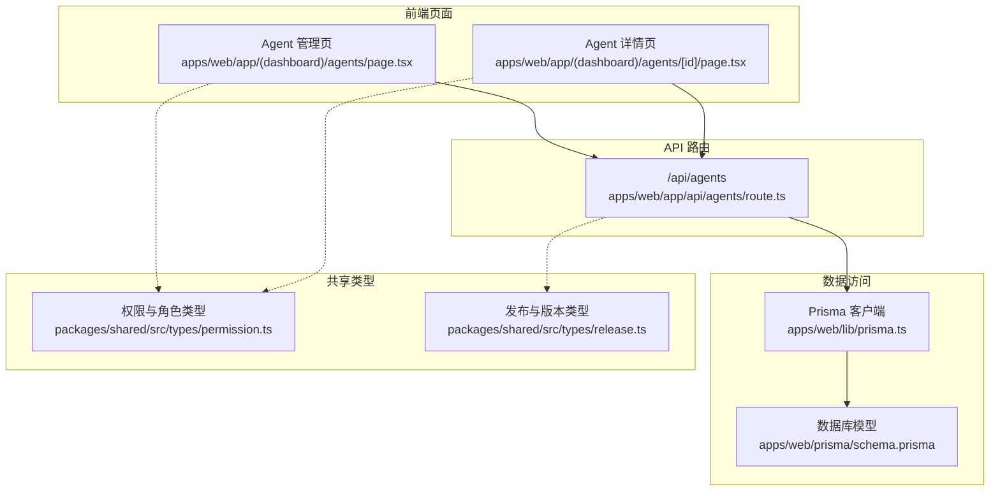
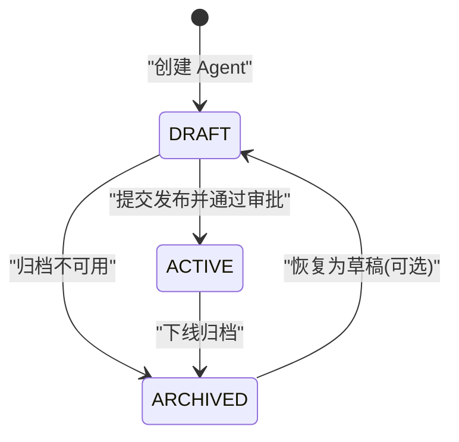
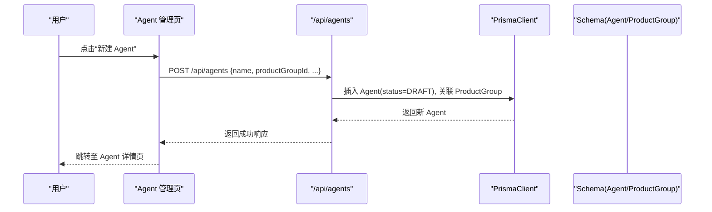
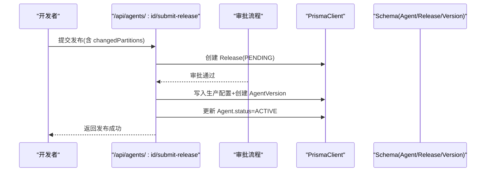
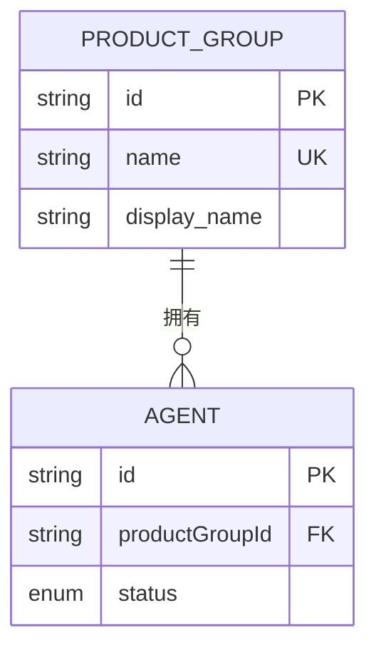
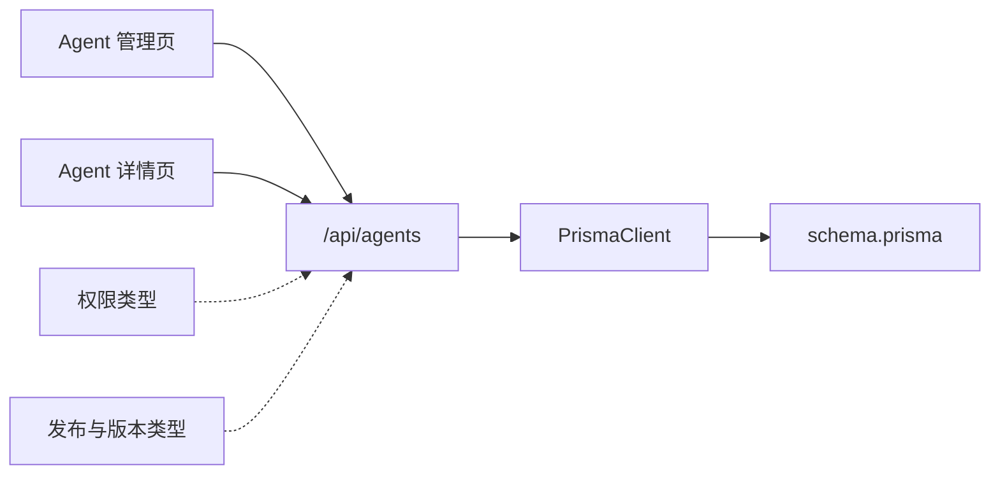

# Agent 生命周期管理

<cite>
**本文引用的文件列表**
- [schema.prisma](file://apps/web/prisma/schema.prisma)
- [agents API 路由](file://apps/web/app/api/agents/route.ts)
- [Agent 管理页面](file://apps/web/app/(dashboard)/agents/page.tsx)
- [Agent 详情页面](file://apps/web/app/(dashboard)/agents/[id]/page.tsx)
- [Prisma 客户端初始化](file://apps/web/lib/prisma.ts)
- [权限与角色类型定义](file://packages/shared/src/types/permission.ts)
- [发布与版本类型定义](file://packages/shared/src/types/release.ts)
</cite>

## 目录
1. [引言](#引言)
2. [项目结构](#项目结构)
3. [核心组件](#核心组件)
4. [架构总览](#架构总览)
5. [详细组件分析](#详细组件分析)
6. [依赖关系分析](#依赖关系分析)
7. [性能考量](#性能考量)
8. [故障排查指南](#故障排查指南)
9. [结论](#结论)
10. [附录](#附录)

## 引言
本文件系统化阐述 Agent Up 中 AI Agent 的完整生命周期管理机制，覆盖状态模型（DRAFT、ACTIVE、ARCHIVED）、创建/编辑/删除/状态变更流程、与产品组的关联及数据隔离机制，并提供面向开发者的实践建议与常见陷阱。文档从概念到实现逐层展开，帮助读者快速理解并落地 Agent 全生命周期管理。

## 项目结构
本项目采用 Next.js App Router + Prisma 的数据建模方式，前端页面位于 apps/web/app 下，API 路由在 apps/web/app/api 下，数据库模型定义在 apps/web/prisma/schema.prisma，共享类型定义位于 packages/shared/src/types。

图表来源
- [Agent 管理页面](file://apps/web/app/(dashboard)/agents/page.tsx#L1-L28)
- [Agent 详情页面](file://apps/web/app/(dashboard)/agents/[id]/page.tsx#L1-L43)
- [agents API 路由:1-19](file://apps/web/app/api/agents/route.ts#L1-L19)
- [Prisma 客户端初始化:1-17](file://apps/web/lib/prisma.ts#L1-L17)
- [schema.prisma:1-626](file://apps/web/prisma/schema.prisma#L1-L626)
- [权限与角色类型定义:1-36](file://packages/shared/src/types/permission.ts#L1-L36)
- [发布与版本类型定义:1-35](file://packages/shared/src/types/release.ts#L1-L35)

章节来源
- [Agent 管理页面](file://apps/web/app/(dashboard)/agents/page.tsx#L1-L28)
- [Agent 详情页面](file://apps/web/app/(dashboard)/agents/[id]/page.tsx#L1-L43)
- [agents API 路由:1-19](file://apps/web/app/api/agents/route.ts#L1-L19)
- [Prisma 客户端初始化:1-17](file://apps/web/lib/prisma.ts#L1-L17)
- [schema.prisma:1-626](file://apps/web/prisma/schema.prisma#L1-L626)
- [权限与角色类型定义:1-36](file://packages/shared/src/types/permission.ts#L1-L36)
- [发布与版本类型定义:1-35](file://packages/shared/src/types/release.ts#L1-L35)

## 核心组件
- Agent 实体：包含基础信息、所属产品组、当前状态、四分区配置（Prompt/Knowledge/Tools/Routing）、Draft 环境、以及反馈、发布、版本、技能绑定、知识库等关联。
- 状态枚举：AgentStatus 定义了 DRAFT、ACTIVE、ARCHIVED 三种状态。
- 产品组与成员：ProductGroup 与 ProductGroupMember 提供多租户式的数据隔离与协作能力。
- 发布与版本：Release 与 AgentVersion 支持配置变更的审批与回滚。
- 权限与审计：Role、Permission、UserRole、AuditLog 支撑 RBAC 与操作审计。

章节来源
- [schema.prisma:61-97](file://apps/web/prisma/schema.prisma#L61-L97)
- [schema.prisma:14-36](file://apps/web/prisma/schema.prisma#L14-L36)
- [schema.prisma:298-354](file://apps/web/prisma/schema.prisma#L298-L354)
- [schema.prisma:563-625](file://apps/web/prisma/schema.prisma#L563-L625)
- [权限与角色类型定义:1-36](file://packages/shared/src/types/permission.ts#L1-L36)
- [发布与版本类型定义:1-35](file://packages/shared/src/types/release.ts#L1-L35)

## 架构总览
Agent 的生命周期围绕“草稿—活跃—归档”三态流转，配合“四分区配置”和“发布审批/版本快照”形成完整的可观测、可回滚、可审计的闭环。

图表来源
- [schema.prisma:93-97](file://apps/web/prisma/schema.prisma#L93-L97)

## 详细组件分析

### 状态模型与业务含义
- DRAFT（草稿）：Agent 处于编辑阶段，支持对 Prompt、Knowledge、Tools、Routing 四个分区的增量修改；同时维护 AgentDraftConfig 以保存未发布的临时配置。
- ACTIVE（活跃）：Agent 已发布上线，对外提供服务；其生产配置由 Release 审批通过后写入对应分区。
- ARCHIVED（归档）：Agent 被下线或停用，不再参与生产流量，但保留历史数据用于审计与回溯。

章节来源
- [schema.prisma:61-97](file://apps/web/prisma/schema.prisma#L61-L97)
- [schema.prisma:175-186](file://apps/web/prisma/schema.prisma#L175-L186)

### 创建流程（新建 Agent）
- 入口：Agent 管理页提供“新建 Agent”按钮，进入创建流程。
- 后端：通过 POST /api/agents 创建 Agent 记录，默认状态为 DRAFT，并自动建立与产品组的关联。
- 前置校验：需具备相应产品组权限（如 PRODUCT_LEAD 或 PRODUCT_MEMBER），并在 AuditLog 中记录创建行为。

图表来源
- [Agent 管理页面](file://apps/web/app/(dashboard)/agents/page.tsx#L1-L28)
- [agents API 路由:1-19](file://apps/web/app/api/agents/route.ts#L1-L19)
- [Prisma 客户端初始化:1-17](file://apps/web/lib/prisma.ts#L1-L17)
- [schema.prisma:61-97](file://apps/web/prisma/schema.prisma#L61-L97)

章节来源
- [Agent 管理页面](file://apps/web/app/(dashboard)/agents/page.tsx#L1-L28)
- [agents API 路由:1-19](file://apps/web/app/api/agents/route.ts#L1-L19)
- [Prisma 客户端初始化:1-17](file://apps/web/lib/prisma.ts#L1-L17)
- [schema.prisma:61-97](file://apps/web/prisma/schema.prisma#L61-L97)

### 编辑流程（四分区配置与 Draft 环境）
- 入口：Agent 详情页提供 Prompt、知识库、工具/MCP、路由四个配置 Tab。
- 编辑策略：
  - 实时保存到 AgentDraftConfig（isDirty 标记），避免影响生产配置。
  - 每次分区变更生成 ConfigChange 记录，记录 before/after/diff 与变更人。
- 提交发布：
  - 调用 POST /api/agents/:id/submit-release，创建 Release 记录（PENDING）。
  - 审批通过后，将各分区配置写入生产表（PromptConfig/KnowledgeConfig/ToolsConfig/RoutingConfig），并生成 AgentVersion 快照。

```mermaid
flowchart TD
Start(["开始编辑"]) --> LoadDraft["加载 AgentDraftConfig"]
LoadDraft --> EditPartition{"选择分区编辑"}
EditPartition --> |Prompt| SaveDraftPrompt["保存 Prompt 草稿"]
EditPartition --> |Knowledge| SaveDraftKnowledge["保存 Knowledge 草稿"]
EditPartition --> |Tools| SaveDraftTools["保存 Tools 草稿"]
EditPartition --> |Routing| SaveDraftRouting["保存 Routing 草稿"]
SaveDraftPrompt --> MarkDirty["标记 isDirty=true"]
SaveDraftKnowledge --> MarkDirty
SaveDraftTools --> MarkDirty
SaveDraftRouting --> MarkDirty
MarkDirty --> SubmitRelease{"是否提交发布?"}
SubmitRelease --> |否| ContinueEdit["继续编辑"]
SubmitRelease --> |是| CreateRelease["创建 Release(PENDING)"]
CreateRelease --> Approve{"审批结果"}
Approve --> |通过| WriteProd["写入生产配置+生成版本快照"]
Approve --> |拒绝| Reject["记录拒绝原因"]
WriteProd --> End(["完成"])
Reject --> End
ContinueEdit --> End
```

图表来源
- [Agent 详情页面](file://apps/web/app/(dashboard)/agents/[id]/page.tsx#L1-L43)
- [agents API 路由:1-19](file://apps/web/app/api/agents/route.ts#L1-L19)
- [schema.prisma:175-186](file://apps/web/prisma/schema.prisma#L175-L186)
- [schema.prisma:192-214](file://apps/web/prisma/schema.prisma#L192-L214)
- [schema.prisma:298-354](file://apps/web/prisma/schema.prisma#L298-L354)

章节来源
- [Agent 详情页面](file://apps/web/app/(dashboard)/agents/[id]/page.tsx#L1-L43)
- [agents API 路由:1-19](file://apps/web/app/api/agents/route.ts#L1-L19)
- [schema.prisma:175-186](file://apps/web/prisma/schema.prisma#L175-L186)
- [schema.prisma:192-214](file://apps/web/prisma/schema.prisma#L192-L214)
- [schema.prisma:298-354](file://apps/web/prisma/schema.prisma#L298-L354)

### 删除流程（软删除与硬删除）
- 软删除：建议将 Agent 状态置为 ARCHIVED，保留历史数据与审计轨迹。
- 硬删除：仅在合规要求允许且无外部引用时执行，需严格权限控制与审计记录。
- 关联清理：若存在强关联（如 WikiVault、SkillBindings），需在事务中处理级联逻辑或显式清理。

章节来源
- [schema.prisma:61-97](file://apps/web/prisma/schema.prisma#L61-L97)
- [schema.prisma:563-625](file://apps/web/prisma/schema.prisma#L563-L625)

### 状态变更流程（DRAFT → ACTIVE → ARCHIVED）
- DRAFT → ACTIVE：通过 Release 审批通过后，更新 Agent.status=ACTIVE。
- ACTIVE → ARCHIVED：管理员或产品负责人执行下线归档。
- ARCHIVED → DRAFT：必要时可恢复为草稿进行二次编辑（谨慎使用）。

图表来源
- [agents API 路由:1-19](file://apps/web/app/api/agents/route.ts#L1-L19)
- [schema.prisma:93-97](file://apps/web/prisma/schema.prisma#L93-L97)
- [schema.prisma:298-354](file://apps/web/prisma/schema.prisma#L298-L354)

章节来源
- [agents API 路由:1-19](file://apps/web/app/api/agents/route.ts#L1-L19)
- [schema.prisma:93-97](file://apps/web/prisma/schema.prisma#L93-L97)
- [schema.prisma:298-354](file://apps/web/prisma/schema.prisma#L298-L354)

### 与产品组的关联与数据隔离
- 关联关系：Agent.productGroupId 指向 ProductGroup，确保每个 Agent 属于特定产品组。
- 成员与角色：ProductGroupMember 与 UserRole 限定用户对产品组内资源的读写与发布权限。
- 数据隔离：所有查询需按 productGroupId 过滤，结合 RBAC 实现跨租户隔离。

图表来源
- [schema.prisma:14-24](file://apps/web/prisma/schema.prisma#L14-L24)
- [schema.prisma:61-97](file://apps/web/prisma/schema.prisma#L61-L97)

章节来源
- [schema.prisma:14-24](file://apps/web/prisma/schema.prisma#L14-L24)
- [schema.prisma:61-97](file://apps/web/prisma/schema.prisma#L61-L97)
- [权限与角色类型定义:1-36](file://packages/shared/src/types/permission.ts#L1-L36)

### 代码示例路径（如何在应用中操作 Agent 实体）
- 获取 Agent 列表与详情：参考 GET /api/agents 与 GET /api/agents/:id 的实现位置。
- 创建 Agent：参考 POST /api/agents 的实现位置。
- 更新 Agent 配置（分区）：参考 PUT /api/agents/:id/config/:partition 的实现位置。
- 提交发布：参考 POST /api/agents/:id/submit-release 的实现位置。
- 回滚版本：参考 POST /api/agents/:id/rollback/:versionId 的实现位置。
- 数据访问：使用 Prisma 客户端进行增删改查，注意按 productGroupId 过滤。

章节来源
- [agents API 路由:1-19](file://apps/web/app/api/agents/route.ts#L1-L19)
- [Prisma 客户端初始化:1-17](file://apps/web/lib/prisma.ts#L1-L17)

## 依赖关系分析
- 前端页面依赖 API 路由进行数据交互。
- API 路由依赖 Prisma 客户端访问数据库。
- 数据库模型由 schema.prisma 统一定义，约束了实体关系与索引。
- 共享类型定义（权限、发布与版本）在前端与后端共同消费，保证类型一致性。

图表来源
- [Agent 管理页面](file://apps/web/app/(dashboard)/agents/page.tsx#L1-L28)
- [Agent 详情页面](file://apps/web/app/(dashboard)/agents/[id]/page.tsx#L1-L43)
- [agents API 路由:1-19](file://apps/web/app/api/agents/route.ts#L1-L19)
- [Prisma 客户端初始化:1-17](file://apps/web/lib/prisma.ts#L1-L17)
- [schema.prisma:1-626](file://apps/web/prisma/schema.prisma#L1-L626)
- [权限与角色类型定义:1-36](file://packages/shared/src/types/permission.ts#L1-L36)
- [发布与版本类型定义:1-35](file://packages/shared/src/types/release.ts#L1-L35)

章节来源
- [Agent 管理页面](file://apps/web/app/(dashboard)/agents/page.tsx#L1-L28)
- [Agent 详情页面](file://apps/web/app/(dashboard)/agents/[id]/page.tsx#L1-L43)
- [agents API 路由:1-19](file://apps/web/app/api/agents/route.ts#L1-L19)
- [Prisma 客户端初始化:1-17](file://apps/web/lib/prisma.ts#L1-L17)
- [schema.prisma:1-626](file://apps/web/prisma/schema.prisma#L1-L626)
- [权限与角色类型定义:1-36](file://packages/shared/src/types/permission.ts#L1-L36)
- [发布与版本类型定义:1-35](file://packages/shared/src/types/release.ts#L1-L35)

## 性能考量
- 索引优化：Agent 表针对 productGroupId 与 status 建立索引，提升按产品组筛选与状态过滤的性能。
- 分页与过滤：建议在 API 层增加分页参数与多条件过滤，减少单次响应体积。
- 配置变更差异：利用 ConfigChange.diff 字段进行增量展示与对比，避免全量拉取大对象。
- 并发控制：提交发布与回滚操作应加锁或幂等键，防止重复提交导致不一致。

章节来源
- [schema.prisma:89-91](file://apps/web/prisma/schema.prisma#L89-L91)
- [schema.prisma:192-214](file://apps/web/prisma/schema.prisma#L192-L214)

## 故障排查指南
- 权限问题：确认用户角色与产品组成员身份，检查 Role/Permission/UserRole 配置是否正确。
- 发布失败：查看 Release 状态与 reviewComment，定位审批拒绝原因；核对 changedPartitions 与实际变更一致。
- 版本回滚异常：验证目标 versionId 是否存在，检查 AgentVersion 快照完整性。
- 审计追踪：通过 AuditLog 检索关键操作的 userId、action、resource、details，辅助定位问题。

章节来源
- [schema.prisma:298-354](file://apps/web/prisma/schema.prisma#L298-L354)
- [schema.prisma:563-625](file://apps/web/prisma/schema.prisma#L563-L625)
- [权限与角色类型定义:1-36](file://packages/shared/src/types/permission.ts#L1-L36)

## 结论
Agent Up 的 Agent 生命周期管理以“三态模型 + 四分区配置 + 发布审批/版本快照 + RBAC 与审计”为核心，既保证了生产环境的稳定性与可追溯性，又提供了灵活的编辑与回滚能力。遵循本文档的流程与最佳实践，可在保障数据安全与隔离的前提下高效推进 Agent 的迭代与上线。

## 附录

### 最佳实践
- 始终在 DRAFT 状态下进行配置编辑，避免直接修改生产配置。
- 提交发布前进行充分测试，确保 changedPartitions 与实际变更一致。
- 使用版本快照进行回滚，避免手工拼接配置导致的遗漏。
- 所有敏感操作必须记录审计日志，便于事后复盘。
- 按 productGroupId 进行数据隔离，禁止跨组访问。

### 常见陷阱
- 忽略 isDirty 标记导致草稿丢失或未生效。
- 发布审批通过后未同步更新 Agent.status，造成状态不一致。
- 回滚时未考虑下游依赖（如 SkillBindings、WikiVault）的兼容性。
- 未对高并发提交发布进行幂等保护，引发重复写入。
- 查询未按 productGroupId 过滤，导致数据泄露或越权访问。