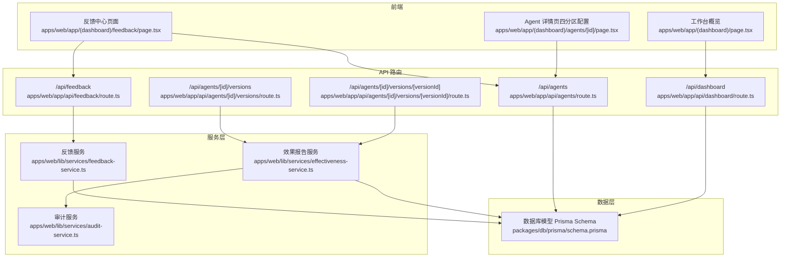
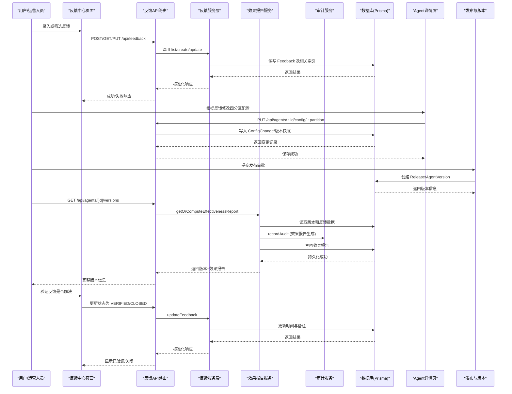
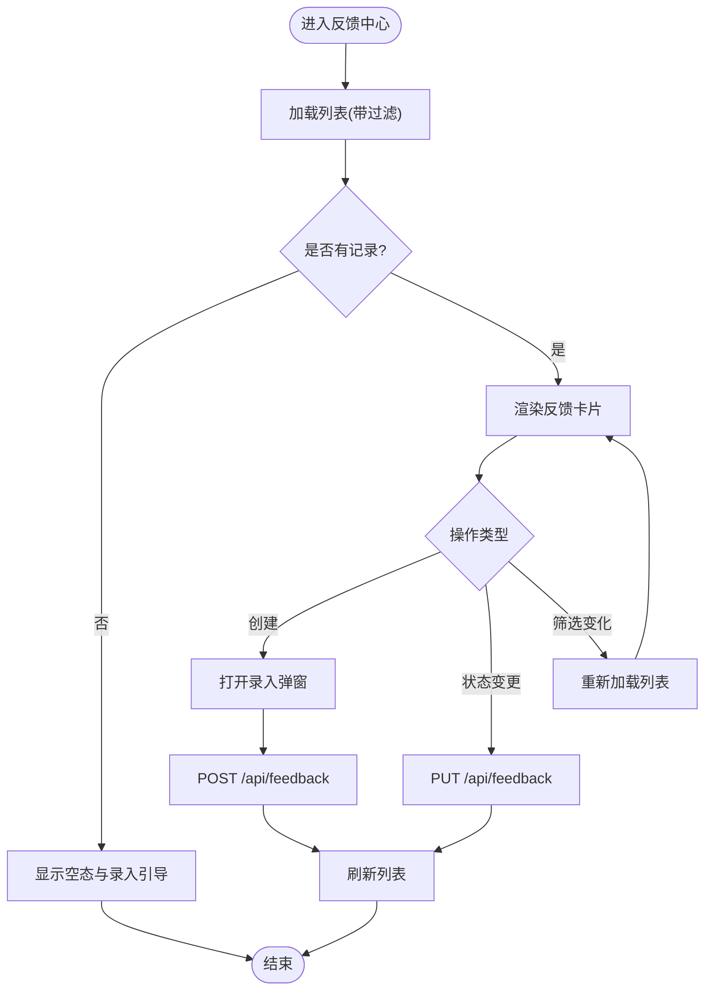
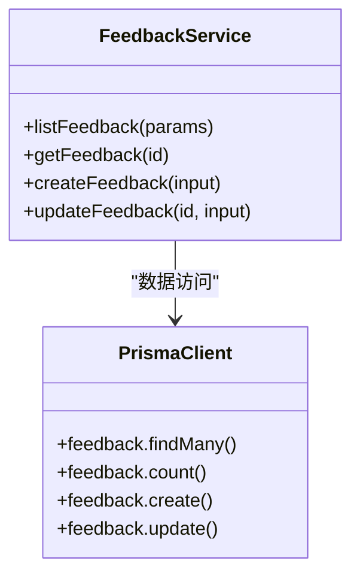
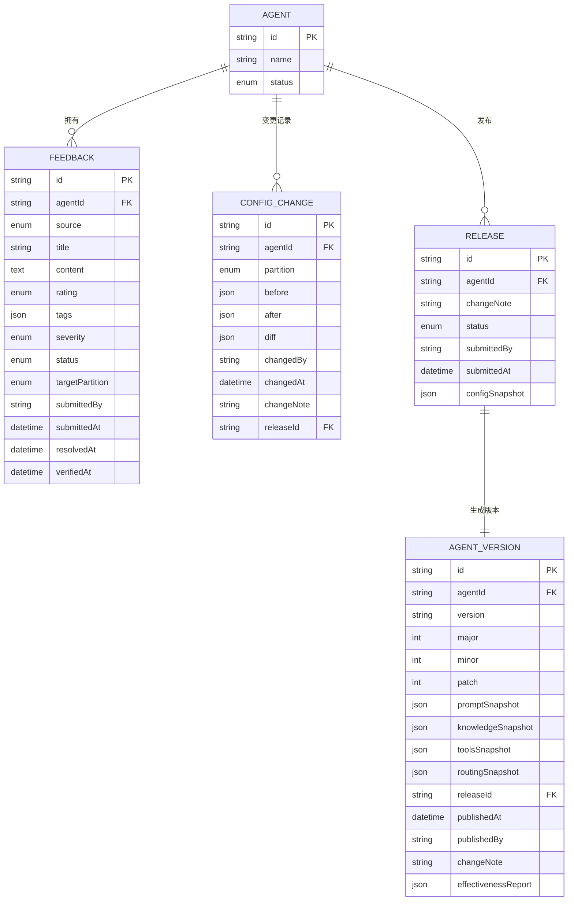
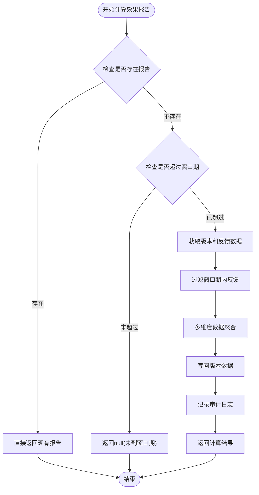
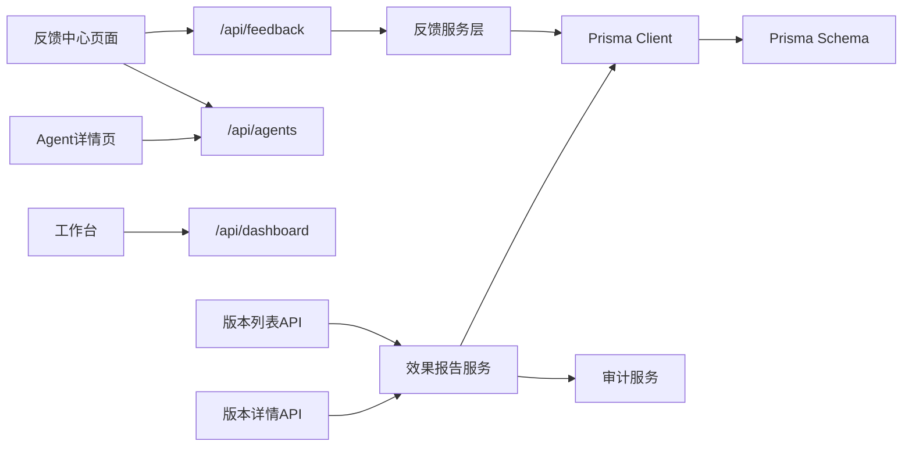

# 反馈驱动改进循环

<cite>
**本文引用的文件**   
- [apps/web/app/(dashboard)/feedback/page.tsx](file://apps/web/app/(dashboard)/feedback/page.tsx)
- [apps/web/app/api/feedback/route.ts](file://apps/web/app/api/feedback/route.ts)
- [apps/web/lib/services/feedback-service.ts](file://apps/web/lib/services/feedback-service.ts)
- [apps/web/lib/services/effectiveness-service.ts](file://apps/web/lib/services/effectiveness-service.ts)
- [apps/web/lib/services/audit-service.ts](file://apps/web/lib/services/audit-service.ts)
- [apps/web/app/api/agents/[id]/versions/route.ts](file://apps/web/app/api/agents/[id]/versions/route.ts)
- [apps/web/app/api/agents/[id]/versions/[versionId]/route.ts](file://apps/web/app/api/agents/[id]/versions/[versionId]/route.ts)
- [apps/web/app/api/__tests__/effectiveness.test.ts](file://apps/web/app/api/__tests__/effectiveness.test.ts)
- [packages/db/prisma/schema.prisma](file://packages/db/prisma/schema.prisma)
- [apps/web/app/(dashboard)/agents/[id]/page.tsx](file://apps/web/app/(dashboard)/agents/[id]/page.tsx)
- [apps/web/app/(dashboard)/page.tsx](file://apps/web/app/(dashboard)/page.tsx)
- [apps/web/app/api/dashboard/route.ts](file://apps/web/app/api/dashboard/route.ts)
</cite>

## 更新摘要
**所做更改**   
- 新增版本效果报告懒计算机制章节
- 更新效果追踪与A/B测试集成部分，包含自动化的反馈指标计算
- 增强反馈质量评估章节，包含新的多维度分析能力
- 添加效果报告数据结构和技术实现细节
- 更新API路由集成说明

## 目录
1. [引言](#引言)
2. [项目结构](#项目结构)
3. [核心组件](#核心组件)
4. [架构总览](#架构总览)
5. [详细组件分析](#详细组件分析)
6. [版本效果报告懒计算机制](#版本效果报告懒计算机制)
7. [依赖关系分析](#依赖关系分析)
8. [性能考量](#性能考量)
9. [故障排查指南](#故障排查指南)
10. [结论](#结论)
11. [附录](#附录)

## 引言
本文件系统化阐述 Agent Up 中"反馈驱动的持续改进循环"机制，覆盖从用户反馈收集、分类与处理，到对 Agent 配置的自动优化与人工干预决策，再到效果追踪与 A/B 测试集成、数据分析与可视化展示，以及工作流配置与自定义方法、质量评估与噪声过滤策略。最新版本新增了**版本效果报告懒计算机制**，在版本发布7天后自动计算反馈指标，形成完整的闭环：从反馈采集到效果验证的全链路流程。

## 项目结构
围绕反馈闭环的关键代码分布在以下位置：
- 前端页面：反馈中心列表与录入、Agent 详情与四分区配置编辑、工作台概览
- API 路由：反馈 CRUD、Agent 列表、版本历史、仪表盘统计
- 服务层：反馈数据访问、效果报告计算、审计日志封装
- 数据模型：Prisma Schema 定义反馈、版本、发布等实体



**图表来源**
- [apps/web/app/(dashboard)/feedback/page.tsx:1-325](file://apps/web/app/(dashboard)/feedback/page.tsx#L1-L325)
- [apps/web/app/(dashboard)/agents/[id]/page.tsx:1-283](file://apps/web/app/(dashboard)/agents/[id]/page.tsx#L1-L283)
- [apps/web/app/(dashboard)/page.tsx:1-159](file://apps/web/app/(dashboard)/page.tsx#L1-L159)
- [apps/web/app/api/feedback/route.ts:1-70](file://apps/web/app/api/feedback/route.ts#L1-L70)
- [apps/web/app/api/agents/route.ts:1-46](file://apps/web/app/api/agents/route.ts#L1-L46)
- [apps/web/app/api/agents/[id]/versions/route.ts:1-44](file://apps/web/app/api/agents/[id]/versions/route.ts#L1-L44)
- [apps/web/app/api/agents/[id]/versions/[versionId]/route.ts:1-36](file://apps/web/app/api/agents/[id]/versions/[versionId]/route.ts#L1-L36)
- [apps/web/app/api/dashboard/route.ts:1-39](file://apps/web/app/api/dashboard/route.ts#L1-L39)
- [apps/web/lib/services/feedback-service.ts:1-105](file://apps/web/lib/services/feedback-service.ts#L1-L105)
- [apps/web/lib/services/effectiveness-service.ts:1-176](file://apps/web/lib/services/effectiveness-service.ts#L1-L176)
- [apps/web/lib/services/audit-service.ts:1-83](file://apps/web/lib/services/audit-service.ts#L1-L83)
- [packages/db/prisma/schema.prisma:1-626](file://packages/db/prisma/schema.prisma#L1-L626)

## 核心组件
- 反馈中心页面：提供反馈的筛选、状态流转、创建入口，支持按状态与严重程度过滤，支持将反馈关联到目标分区（Prompt/Knowledge/Tools/Routing）。
- 反馈 API 路由：统一接收查询、创建与更新请求，进行参数校验后调用服务层。
- 反馈服务层：实现分页查询、条件过滤、创建与更新逻辑，维护时间戳与关联字段。
- **效果报告服务层**：实现版本效果报告的懒计算，自动聚合反馈指标并按多维度分析。
- **审计服务层**：记录系统操作审计日志，包括效果报告生成事件。
- 数据库模型：定义 Feedback、Agent、ConfigChange、Release、AgentVersion 等实体，支撑反馈生命周期与配置变更审计。
- Agent 详情页：提供四分区配置的查看与编辑能力，是反馈驱动优化的关键落地点。
- 工作台与仪表盘：汇总反馈与发布统计，辅助快速定位问题与跟踪改进效果。

**章节来源**
- [apps/web/app/(dashboard)/feedback/page.tsx:1-325](file://apps/web/app/(dashboard)/feedback/page.tsx#L1-L325)
- [apps/web/app/api/feedback/route.ts:1-70](file://apps/web/app/api/feedback/route.ts#L1-L70)
- [apps/web/lib/services/feedback-service.ts:1-105](file://apps/web/lib/services/feedback-service.ts#L1-L105)
- [apps/web/lib/services/effectiveness-service.ts:1-176](file://apps/web/lib/services/effectiveness-service.ts#L1-L176)
- [apps/web/lib/services/audit-service.ts:1-83](file://apps/web/lib/services/audit-service.ts#L1-L83)
- [packages/db/prisma/schema.prisma:220-292](file://packages/db/prisma/schema.prisma#L220-L292)
- [apps/web/app/(dashboard)/agents/[id]/page.tsx:1-283](file://apps/web/app/(dashboard)/agents/[id]/page.tsx#L1-L283)
- [apps/web/app/(dashboard)/page.tsx:1-159](file://apps/web/app/(dashboard)/page.tsx#L1-L159)
- [apps/web/app/api/dashboard/route.ts:1-39](file://apps/web/app/api/dashboard/route.ts#L1-L39)

## 架构总览
反馈驱动的持续改进循环由"采集—处理—优化—验证—再采集"构成，新版本增加了**效果报告懒计算机制**，前后端与服务层协同完成。



**图表来源**
- [apps/web/app/(dashboard)/feedback/page.tsx:61-84](file://apps/web/app/(dashboard)/feedback/page.tsx#L61-L84)
- [apps/web/app/api/feedback/route.ts:10-70](file://apps/web/app/api/feedback/route.ts#L10-L70)
- [apps/web/lib/services/feedback-service.ts:15-105](file://apps/web/lib/services/feedback-service.ts#L15-L105)
- [apps/web/lib/services/effectiveness-service.ts:130-176](file://apps/web/lib/services/effectiveness-service.ts#L130-L176)
- [apps/web/lib/services/audit-service.ts:37-67](file://apps/web/lib/services/audit-service.ts#L37-L67)
- [apps/web/app/(dashboard)/agents/[id]/page.tsx:36-66](file://apps/web/app/(dashboard)/agents/[id]/page.tsx#L36-L66)
- [packages/db/prisma/schema.prisma:192-214](file://packages/db/prisma/schema.prisma#L192-L214)
- [packages/db/prisma/schema.prisma:298-354](file://packages/db/prisma/schema.prisma#L298-L354)

## 详细组件分析

### 反馈中心页面（采集与处理）
- 功能要点
  - 列表加载：支持按状态、严重程度过滤；分页由后端统一处理。
  - 状态流转：内置 NEXT_STATUS 映射，限制合法状态迁移路径。
  - 创建反馈：弹窗表单包含 Agent 选择、标题、内容、评价、严重程度、目标分区等字段。
  - 交互反馈：提交成功后刷新列表，错误时提示。
- 数据流
  - GET /api/feedback：拉取列表与总数
  - POST /api/feedback：创建新反馈
  - PUT /api/feedback：更新状态、严重级别、目标分区、解决说明等
- 可视化
  - 标签与颜色映射便于快速识别高优先级与负面反馈
  - 目标分区字段直接指向 Prompt/Knowledge/Tools/Routing 四类配置



**图表来源**
- [apps/web/app/(dashboard)/feedback/page.tsx:61-84](file://apps/web/app/(dashboard)/feedback/page.tsx#L61-L84)
- [apps/web/app/(dashboard)/feedback/page.tsx:195-229](file://apps/web/app/(dashboard)/feedback/page.tsx#L195-L229)
- [apps/web/app/api/feedback/route.ts:10-70](file://apps/web/app/api/feedback/route.ts#L10-L70)

**章节来源**
- [apps/web/app/(dashboard)/feedback/page.tsx:1-325](file://apps/web/app/(dashboard)/feedback/page.tsx#L1-L325)
- [apps/web/app/api/feedback/route.ts:1-70](file://apps/web/app/api/feedback/route.ts#L1-L70)

### 反馈 API 路由（参数校验与编排）
- 职责
  - 解析查询参数（分页、agentId、status、severity、rating、tag）
  - 校验输入体（创建/更新），失败返回结构化错误
  - 调用服务层执行具体业务
- 关键点
  - 使用统一的 success/error 包装器，保证前后端一致响应格式
  - 通过 parsePagination 统一分页参数处理

**章节来源**
- [apps/web/app/api/feedback/route.ts:1-70](file://apps/web/app/api/feedback/route.ts#L1-L70)

### 反馈服务层（数据访问与业务规则）
- 列表查询
  - 动态 where 条件构建，支持 agentId、status、severity、rating、tag 过滤
  - 并行执行 findMany 与 count，提升性能
- 创建反馈
  - 校验 Agent 存在性
  - 默认 source=MANUAL、status=NEW，设置 submittedBy
  - 可选 sessionData、targetPartition
- 更新反馈
  - 根据 status 自动填充 assignedAt/resolvedAt/verifiedAt 等时间戳
  - 支持更新 severity、resolution、targetPartition



**图表来源**
- [apps/web/lib/services/feedback-service.ts:15-105](file://apps/web/lib/services/feedback-service.ts#L15-L105)

**章节来源**
- [apps/web/lib/services/feedback-service.ts:1-105](file://apps/web/lib/services/feedback-service.ts#L1-L105)

### 数据库模型（反馈与配置变更）
- Feedback 实体
  - 关键字段：agentId、source、title、content、rating、tags、severity、status、targetPartition、submittedBy/submittedAt、resolvedAt/verifiedAt 等
  - 枚举：FeedbackSource、FeedbackRating、FeedbackTag、FeedbackSeverity、FeedbackStatus
- 配置变更与版本
  - ConfigChange：记录分区级 before/after/diff，关联 releaseId
  - Release/AgentVersion：发布审批与版本快照，含 effectivenessReport 预留字段



**图表来源**
- [packages/db/prisma/schema.prisma:220-292](file://packages/db/prisma/schema.prisma#L220-L292)
- [packages/db/prisma/schema.prisma:192-214](file://packages/db/prisma/schema.prisma#L192-L214)
- [packages/db/prisma/schema.prisma:298-354](file://packages/db/prisma/schema.prisma#L298-L354)

**章节来源**
- [packages/db/prisma/schema.prisma:1-626](file://packages/db/prisma/schema.prisma#L1-L626)

### Agent 详情页（反馈驱动的自动/人工优化）
- 四分区配置编辑
  - Prompt：系统提示词、角色定义、约束条件、输出格式
  - Knowledge：搜索策略、回退策略、最大结果数、置信度阈值
  - Tools/Routing：JSON 编辑器，支持实时校验
- 与反馈联动
  - 反馈中的 targetPartition 可直接定位到对应配置页签
  - 保存配置会触发后续版本化与发布流程（见下文）

**章节来源**
- [apps/web/app/(dashboard)/agents/[id]/page.tsx:1-283](file://apps/web/app/(dashboard)/agents/[id]/page.tsx#L1-L283)
- [apps/web/app/api/agents/route.ts:1-46](file://apps/web/app/api/agents/route.ts#L1-L46)

### 工作台与仪表盘（效果追踪与可视化）
- 指标
  - Agent 总数/活跃数
  - 反馈总数/待处理数
  - 待审批发布数
- 最近项
  - 最新反馈（含严重级别、状态、Agent 名称）
  - 最新发布（含状态、变更说明、提交人）

**章节来源**
- [apps/web/app/(dashboard)/page.tsx:1-159](file://apps/web/app/(dashboard)/page.tsx#L1-L159)
- [apps/web/app/api/dashboard/route.ts:1-39](file://apps/web/app/api/dashboard/route.ts#L1-L39)

## 版本效果报告懒计算机制

### 核心概念
版本效果报告懒计算机制是反馈驱动改进循环的重要增强，它实现了**自动化、延迟的效果评估**：

- **懒填充策略**：不引入定时任务，在API层GET版本时若发现publishedAt距今≥7天且effectivenessReport为空，则现场计算并写回
- **零运维设计**：无需cron作业，降低系统复杂度
- **幂等性保证**：多次调用返回相同结果，避免重复计算
- **窗口期控制**：默认7天窗口，覆盖版本上线一周后的效果观察期

### 效果报告数据结构
```typescript
interface EffectivenessReport {
  totalFeedbacks: number;                    // 窗口内反馈总数
  byRating: {                               // 按评价聚合
    POSITIVE: number;                       // 正面评价数量
    NEGATIVE: number;                       // 负面评价数量  
    NEUTRAL: number;                        // 中性评价数量
  };
  bySeverity: {                             // 按严重级别聚合
    CRITICAL: number;                       // 致命问题
    MAJOR: number;                          // 主要问题
    MINOR: number;                          // 次要问题
    SUGGESTION: number;                     // 建议改进
  };
  byPartition: {                            // 按目标分区聚合
    PROMPT: number;                         // 提示词相关
    KNOWLEDGE: number;                      // 知识库相关
    TOOLS: number;                          // 工具相关
    ROUTING: number;                        // 路由相关
  };
  computedAt: string;                       // 计算时间戳
  versionPublishedAt: string;              // 版本发布时间
  windowDays: number;                       // 计算窗口天数
}
```

### 计算逻辑流程


**图表来源**
- [apps/web/lib/services/effectiveness-service.ts:79-122](file://apps/web/lib/services/effectiveness-service.ts#L79-L122)
- [apps/web/lib/services/effectiveness-service.ts:130-176](file://apps/web/lib/services/effectiveness-service.ts#L130-L176)

### API集成实现
效果报告懒计算已集成到两个关键API端点：

1. **版本列表接口** (`GET /api/agents/[id]/versions`)
   - 遍历所有版本，对每个版本执行懒计算
   - 仅对超过7天的版本计算效果报告
   - 将计算结果附加到返回数据中

2. **版本详情接口** (`GET /api/agents/[id]/versions/[versionId]`)
   - 单个版本查询时自动触发效果报告计算
   - 保持与其他版本查询的一致性

**章节来源**
- [apps/web/app/api/agents/[id]/versions/route.ts:1-44](file://apps/web/app/api/agents/[id]/versions/route.ts#L1-L44)
- [apps/web/app/api/agents/[id]/versions/[versionId]/route.ts:1-36](file://apps/web/app/api/agents/[id]/versions/[versionId]/route.ts#L1-L36)

### 审计追踪机制
每次效果报告生成都会记录详细的审计日志：

- **动作类型**：`version.effectiveness.computed`
- **资源标识**：版本号ID
- **详细信息**：包含agentId、totalFeedbacks、windowDays等元数据
- **用户上下文**：自动记录操作者和角色信息

**章节来源**
- [apps/web/lib/services/effectiveness-service.ts:167-172](file://apps/web/lib/services/effectiveness-service.ts#L167-L172)
- [apps/web/lib/services/audit-service.ts:37-67](file://apps/web/lib/services/audit-service.ts#L37-L67)

## 依赖关系分析
- 前端依赖
  - 反馈中心页面依赖 /api/feedback 与 /api/agents
  - Agent 详情页依赖 /api/agents/:id/config/:partition
  - 工作台依赖 /api/dashboard
- 后端依赖
  - 反馈路由依赖反馈服务层
  - **版本路由依赖效果报告服务层**
  - 服务层依赖 Prisma Client 与数据库模型
  - **效果报告服务依赖审计服务**
- 数据依赖
  - Feedback 与 Agent 强关联
  - ConfigChange 与 Release/AgentVersion 形成变更与版本闭环
  - **EffectivenessReport 与 AgentVersion 紧密集成**



**图表来源**
- [apps/web/app/(dashboard)/feedback/page.tsx:61-84](file://apps/web/app/(dashboard)/feedback/page.tsx#L61-L84)
- [apps/web/app/api/feedback/route.ts:10-70](file://apps/web/app/api/feedback/route.ts#L10-L70)
- [apps/web/lib/services/feedback-service.ts:15-105](file://apps/web/lib/services/feedback-service.ts#L15-L105)
- [apps/web/lib/services/effectiveness-service.ts:130-176](file://apps/web/lib/services/effectiveness-service.ts#L130-L176)
- [apps/web/lib/services/audit-service.ts:37-67](file://apps/web/lib/services/audit-service.ts#L37-L67)
- [packages/db/prisma/schema.prisma:220-292](file://packages/db/prisma/schema.prisma#L220-L292)

**章节来源**
- [apps/web/app/(dashboard)/feedback/page.tsx:1-325](file://apps/web/app/(dashboard)/feedback/page.tsx#L1-L325)
- [apps/web/app/api/feedback/route.ts:1-70](file://apps/web/app/api/feedback/route.ts#L1-L70)
- [apps/web/lib/services/feedback-service.ts:1-105](file://apps/web/lib/services/feedback-service.ts#L1-L105)
- [apps/web/lib/services/effectiveness-service.ts:1-176](file://apps/web/lib/services/effectiveness-service.ts#L1-L176)
- [apps/web/lib/services/audit-service.ts:1-83](file://apps/web/lib/services/audit-service.ts#L1-L83)
- [packages/db/prisma/schema.prisma:1-626](file://packages/db/prisma/schema.prisma#L1-L626)

## 性能考量
- 列表查询并行化：服务层使用 Promise.all 同时执行 findMany 与 count，减少往返延迟
- 索引设计：Feedback 在 agentId/status、submittedAt、severity/status 上建立索引，加速常见过滤与排序
- 分页与限幅：统一 parsePagination 控制 skip/take，避免一次性拉取大量数据
- JSON 字段过滤：tags 使用 has 匹配，注意大数据量下的性能影响，必要时引入全文检索或物化视图
- **懒计算优化**：效果报告仅在需要时计算，避免不必要的CPU消耗
- **缓存策略**：计算结果持久化存储，后续查询直接返回，减少重复计算
- **并发安全**：通过store.write的全量覆盖语义保证并发场景下的数据一致性

**章节来源**
- [apps/web/lib/services/feedback-service.ts:24-35](file://apps/web/lib/services/feedback-service.ts#L24-L35)
- [packages/db/prisma/schema.prisma:246-249](file://packages/db/prisma/schema.prisma#L246-L249)
- [apps/web/lib/services/effectiveness-service.ts:134-176](file://apps/web/lib/services/effectiveness-service.ts#L134-L176)

## 故障排查指南
- 常见错误
  - 参数校验失败：检查 createFeedbackSchema/updateFeedbackSchema 的字段与类型
  - Agent 不存在：创建反馈前需确保 agentId 有效
  - 网络错误：确认 API 路由正常响应与 CORS/鉴权配置
  - **效果报告计算失败**：检查版本发布时间、反馈数据完整性、存储空间可用性
- 定位步骤
  - 查看浏览器控制台与 Network 面板的请求/响应
  - 核对 API 路由日志与错误包装返回
  - 检查数据库索引与数据一致性（如 tags 数组是否为空）
  - **查看审计日志**：检查 `version.effectiveness.computed` 相关记录
- 恢复建议
  - 重试失败请求（幂等性保障）
  - 清理无效或重复反馈（结合 WONTFIX/CLOSED 状态）
  - 补充缺失的必填字段（agentId/title/content）
  - **手动触发效果报告计算**：通过API重新查询版本信息

**章节来源**
- [apps/web/app/api/feedback/route.ts:30-70](file://apps/web/app/api/feedback/route.ts#L30-L70)
- [apps/web/lib/services/feedback-service.ts:51-78](file://apps/web/lib/services/feedback-service.ts#L51-L78)
- [apps/web/lib/services/audit-service.ts:37-67](file://apps/web/lib/services/audit-service.ts#L37-L67)

## 结论
Agent Up 的反馈驱动改进循环以"可观测、可操作、可验证"为核心：前端提供直观的采集与处理界面，后端通过严格的参数校验与高效的数据访问保障稳定性，数据库模型为变更审计与版本管理奠定基础。**新增的版本效果报告懒计算机制**进一步增强了系统的智能化水平，通过自动化的反馈指标分析和多维度评估，团队可以快速定位问题、实施优化，并通过发布与版本机制验证效果，最终形成持续改进的闭环。

## 附录

### 反馈工作流的配置与自定义方法
- 状态机扩展
  - 在前端 NEXT_STATUS 映射中增加新的状态与迁移路径
  - 在后端 updateFeedback 中补充相应的时间戳与字段逻辑
- 标签与分类
  - 扩展 FeedbackTag 枚举，并在前端筛选与展示中同步新增
- 目标分区
  - 调整 targetPartition 的取值范围，并在 Agent 详情页中增加对应配置页签
- 自动化策略
  - 基于 severity 与 rating 自动创建 Release 草稿或触发预检任务
  - 将高频问题映射为模板化的 Prompt/Knowledge 优化建议

**章节来源**
- [apps/web/app/(dashboard)/feedback/page.tsx:42-51](file://apps/web/app/(dashboard)/feedback/page.tsx#L42-L51)
- [apps/web/lib/services/feedback-service.ts:76-105](file://apps/web/lib/services/feedback-service.ts#L76-L105)
- [packages/db/prisma/schema.prisma:264-281](file://packages/db/prisma/schema.prisma#L264-L281)

### 反馈质量评估与噪声过滤策略
- 质量维度
  - 严重级别（CRITICAL/MAJOR/MINOR/SUGGESTION）
  - 评价（POSITIVE/NEGATIVE/NEUTRAL）
  - 标签（ANSWER_QUALITY/KNOWLEDGE_GAP/TOOL_FAILURE/ROUTING_ERROR/HALLUCINATION/OUTDATED_INFO/TONE_ISSUE/INCOMPLETE/OFF_TOPIC）
- 噪声过滤
  - 去重：基于 agentId+title 相似度合并
  - 低价值过滤：仅 SUGGESTION 且无标签的反馈降低优先级
  - 时效性：超过一定时间的未处理反馈归档
- 指标计算
  - 解决率：RESOLVED/VERIFIED/CLOSED 占比
  - 平均处理时长：submittedAt 至 resolvedAt/verifiedAt
  - 复发率：同一问题再次出现的频率

**章节来源**
- [packages/db/prisma/schema.prisma:251-292](file://packages/db/prisma/schema.prisma#L251-L292)
- [apps/web/lib/services/feedback-service.ts:15-38](file://apps/web/lib/services/feedback-service.ts#L15-L38)

### 效果追踪与 A/B 测试集成
- 版本快照与效果报告
  - AgentVersion 保留 effectivenessReport 字段，用于存储 A/B 实验结果
  - Release 与 AgentVersion 关联，确保每次发布可追溯
- 实验设计
  - 针对特定分区（如 Prompt/Knowledge）进行灰度发布
  - 对比组与实验组的反馈指标（解决率、满意度、错误率）
- 自动化回归
  - 当反馈数量突增或严重级别上升时，触发回归检测与回滚建议
- **懒计算优势**
  - 无需定时任务，降低系统复杂度
  - 按需计算，避免不必要的资源消耗
  - 幂等性保证，支持并发访问
  - 完整的审计追踪，便于问题诊断

**章节来源**
- [packages/db/prisma/schema.prisma:298-354](file://packages/db/prisma/schema.prisma#L298-L354)
- [apps/web/lib/services/effectiveness-service.ts:1-176](file://apps/web/lib/services/effectiveness-service.ts#L1-L176)
- [apps/web/app/api/__tests__/effectiveness.test.ts:1-225](file://apps/web/app/api/__tests__/effectiveness.test.ts#L1-L225)

### 版本效果报告技术实现详解
- **纯函数设计**：computeEffectivenessReport 函数完全独立于外部状态，便于单元测试
- **窗口期算法**：精确计算 publishedAt 到 publishedAt + windowDays 的时间范围
- **多维度聚合**：同时支持按评价、严重级别、目标分区的统计分析
- **容错处理**：对缺失 targetPartition 的反馈进行优雅降级处理
- **并发安全**：通过 store.read/write 的全量覆盖语义保证数据一致性

**章节来源**
- [apps/web/lib/services/effectiveness-service.ts:79-122](file://apps/web/lib/services/effectiveness-service.ts#L79-L122)
- [apps/web/app/api/__tests__/effectiveness.test.ts:63-107](file://apps/web/app/api/__tests__/effectiveness.test.ts#L63-L107)