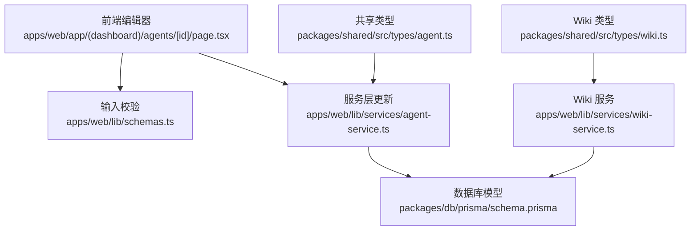
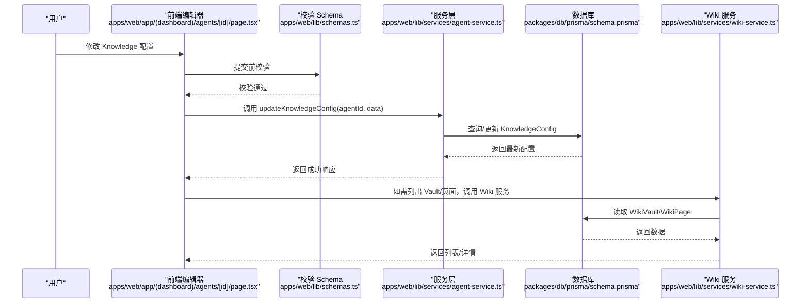
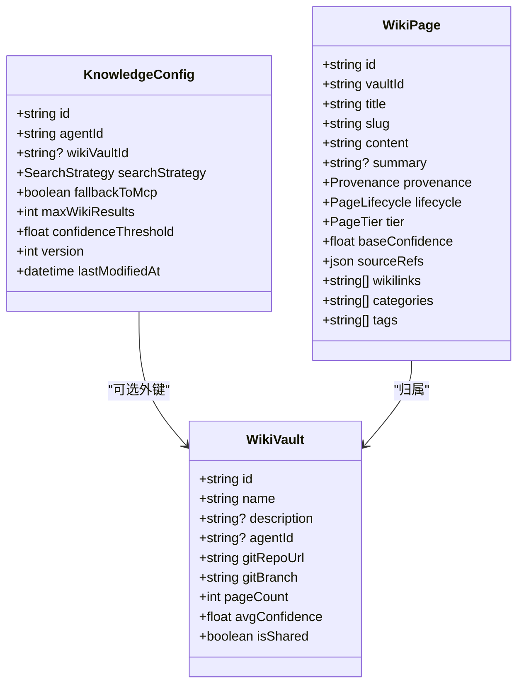

# Knowledge 配置分区

<cite>
**本文引用的文件**
- [apps/web/app/(dashboard)/agents/[id]/page.tsx](file://apps/web/app/(dashboard)/agents/[id]/page.tsx)
- [apps/web/lib/schemas.ts](file://apps/web/lib/schemas.ts)
- [apps/web/lib/services/agent-service.ts](file://apps/web/lib/services/agent-service.ts)
- [apps/web/lib/services/wiki-service.ts](file://apps/web/lib/services/wiki-service.ts)
- [packages/db/prisma/schema.prisma](file://packages/db/prisma/schema.prisma)
- [packages/shared/src/types/agent.ts](file://packages/shared/src/types/agent.ts)
- [packages/shared/src/types/wiki.ts](file://packages/shared/src/types/wiki.ts)
</cite>

## 目录
1. [引言](#引言)
2. [项目结构](#项目结构)
3. [核心组件](#核心组件)
4. [架构总览](#架构总览)
5. [详细组件分析](#详细组件分析)
6. [依赖关系分析](#依赖关系分析)
7. [性能与调优建议](#性能与调优建议)
8. [故障排查指南](#故障排查指南)
9. [结论](#结论)
10. [附录](#附录)

## 引言
本文件聚焦于“Knowledge 配置分区”的设计与实现，围绕以下配置项展开：wikiVaultId、searchStrategy、fallbackToMcp、maxWikiResults、confidenceThreshold。文档将解释各选项的作用与调优方法，对比不同搜索策略（WIKI_FIRST、WIKI_ONLY、MCP_FIRST、HYBRID）的使用场景与性能特点，并提供知识库集成最佳实践、搜索结果优化与置信度阈值设置指南，以及 Wiki 系统与 MCP 服务的集成机制说明，帮助开发者有效配置并利用知识库增强 Agent 能力。

## 项目结构
Knowledge 配置分区涉及前端编辑界面、数据校验 Schema、服务层更新逻辑、数据库模型与类型定义等模块。整体组织方式如下：
- 前端编辑界面：提供可视化配置入口，支持选择搜索策略、回退开关、结果数量与置信度阈值。
- 数据校验：使用 Zod Schema 对输入进行约束，确保字段取值范围与类型正确。
- 服务层：封装更新 Knowledge 配置的持久化逻辑，包含版本控制与时间戳维护。
- 数据库模型：Prisma schema 定义了 KnowledgeConfig 及其关联的 WikiVault、WikiPage 等实体。
- 共享类型：在 packages/shared 中定义统一的 TypeScript 类型，保证前后端一致性。

图表来源
- [apps/web/app/(dashboard)/agents/[id]/page.tsx:202-253](file://apps/web/app/(dashboard)/agents/[id]/page.tsx#L202-L253)
- [apps/web/lib/schemas.ts:30-36](file://apps/web/lib/schemas.ts#L30-L36)
- [apps/web/lib/services/agent-service.ts:188-210](file://apps/web/lib/services/agent-service.ts#L188-L210)
- [packages/db/prisma/schema.prisma:116-138](file://packages/db/prisma/schema.prisma#L116-L138)
- [packages/shared/src/types/agent.ts:33-47](file://packages/shared/src/types/agent.ts#L33-L47)
- [packages/shared/src/types/wiki.ts:1-12](file://packages/shared/src/types/wiki.ts#L1-L12)
- [apps/web/lib/services/wiki-service.ts:11-31](file://apps/web/lib/services/wiki-service.ts#L11-L31)

章节来源
- [apps/web/app/(dashboard)/agents/[id]/page.tsx:202-253](file://apps/web/app/(dashboard)/agents/[id]/page.tsx#L202-L253)
- [apps/web/lib/schemas.ts:30-36](file://apps/web/lib/schemas.ts#L30-L36)
- [apps/web/lib/services/agent-service.ts:188-210](file://apps/web/lib/services/agent-service.ts#L188-L210)
- [packages/db/prisma/schema.prisma:116-138](file://packages/db/prisma/schema.prisma#L116-L138)
- [packages/shared/src/types/agent.ts:33-47](file://packages/shared/src/types/agent.ts#L33-L47)
- [packages/shared/src/types/wiki.ts:1-12](file://packages/shared/src/types/wiki.ts#L1-L12)
- [apps/web/lib/services/wiki-service.ts:11-31](file://apps/web/lib/services/wiki-service.ts#L11-L31)

## 核心组件
- 前端编辑器：提供搜索策略下拉框、回退到 MCP 的复选框、最大 Wiki 结果数输入框、置信度阈值输入框。默认值分别为 WIKI_FIRST、true、5、0.6。
- 校验 Schema：限制 searchStrategy 为枚举值；maxWikiResults 为 1-50 的整数；confidenceThreshold 为 0-1 的浮点数；fallbackToMcp 为布尔值；wikiVaultId 可为空字符串或 null。
- 服务层更新：根据 agentId 查找并更新 KnowledgeConfig，若不存在则创建；每次更新递增 version 并记录 lastModifiedAt。
- 数据库模型：KnowledgeConfig 包含 wikiVaultId、searchStrategy、fallbackToMcp、maxWikiResults、confidenceThreshold 等字段，并与 WikiVault 建立可选外键关系。SearchStrategy 为枚举类型。
- 共享类型：统一了 KnowledgeConfig 与 SearchStrategy 的类型定义，确保前后端一致。

章节来源
- [apps/web/app/(dashboard)/agents/[id]/page.tsx:202-253](file://apps/web/app/(dashboard)/agents/[id]/page.tsx#L202-L253)
- [apps/web/lib/schemas.ts:30-36](file://apps/web/lib/schemas.ts#L30-L36)
- [apps/web/lib/services/agent-service.ts:188-210](file://apps/web/lib/services/agent-service.ts#L188-L210)
- [packages/db/prisma/schema.prisma:116-138](file://packages/db/prisma/schema.prisma#L116-L138)
- [packages/shared/src/types/agent.ts:33-47](file://packages/shared/src/types/agent.ts#L33-L47)

## 架构总览
下图展示了 Knowledge 配置从前端到数据库的完整链路，以及与 Wiki 系统的关联关系。

图表来源
- [apps/web/app/(dashboard)/agents/[id]/page.tsx:202-253](file://apps/web/app/(dashboard)/agents/[id]/page.tsx#L202-L253)
- [apps/web/lib/schemas.ts:30-36](file://apps/web/lib/schemas.ts#L30-L36)
- [apps/web/lib/services/agent-service.ts:188-210](file://apps/web/lib/services/agent-service.ts#L188-L210)
- [packages/db/prisma/schema.prisma:116-138](file://packages/db/prisma/schema.prisma#L116-L138)
- [apps/web/lib/services/wiki-service.ts:11-31](file://apps/web/lib/services/wiki-service.ts#L11-L31)

## 详细组件分析

### 配置项详解与调优方法
- wikiVaultId
  - 作用：指定当前 Agent 绑定的 Wiki 知识库（Vault）。为空表示不启用 Wiki 检索。
  - 调优：优先选择与业务领域匹配的 Vault；对于跨团队共享知识，可使用 isShared=true 的共享 Vault，但需关注变更审批流程。
  - 参考路径：[apps/web/lib/services/agent-service.ts:188-210](file://apps/web/lib/services/agent-service.ts#L188-L210)、[packages/db/prisma/schema.prisma:116-131](file://packages/db/prisma/schema.prisma#L116-L131)

- searchStrategy
  - 作用：决定检索顺序与范围。
    - WIKI_FIRST：优先检索 Wiki，未命中时可按 fallbackToMcp 决定是否回退到 MCP。
    - WIKI_ONLY：仅检索 Wiki，忽略 MCP。
    - MCP_FIRST：优先检索 MCP，未命中时可再检索 Wiki（取决于具体实现）。
    - HYBRID：混合模式，同时或并行检索 Wiki 与 MCP，并按策略合并结果。
  - 调优：
    - 当 Wiki 内容权威且覆盖度高时，使用 WIKI_FIRST 或 WIKI_ONLY。
    - 当外部工具（MCP）提供更实时或更丰富的答案时，使用 MCP_FIRST。
    - 需要兼顾两者优势时，使用 HYBRID，并结合 maxWikiResults 与 confidenceThreshold 控制质量。
  - 参考路径：[apps/web/app/(dashboard)/agents/[id]/page.tsx:202-253](file://apps/web/app/(dashboard)/agents/[id]/page.tsx#L202-L253)、[packages/db/prisma/schema.prisma:133-138](file://packages/db/prisma/schema.prisma#L133-L138)、[packages/shared/src/types/agent.ts:42-47](file://packages/shared/src/types/agent.ts#L42-L47)

- fallbackToMcp
  - 作用：当 Wiki 未命中时是否回退到 MCP。
  - 调优：
    - 开启可提高覆盖率，但可能引入噪声或不一致信息。
    - 关闭可保证答案来自 Wiki，适合严格合规场景。
  - 参考路径：[apps/web/app/(dashboard)/agents/[id]/page.tsx:218-227](file://apps/web/app/(dashboard)/agents/[id]/page.tsx#L218-L227)、[packages/db/prisma/schema.prisma:123](file://packages/db/prisma/schema.prisma#L123)

- maxWikiResults
  - 作用：限制 Wiki 检索返回的最大结果数。
  - 调优：
    - 较小值（如 3-5）提升响应速度，适合低延迟要求。
    - 较大值（如 10-20）提高召回率，但会增加处理开销与上下文长度。
    - 结合 confidenceThreshold 过滤低置信度结果，平衡质量与数量。
  - 参考路径：[apps/web/app/(dashboard)/agents/[id]/page.tsx:228-237](file://apps/web/app/(dashboard)/agents/[id]/page.tsx#L228-L237)、[apps/web/lib/schemas.ts:34](file://apps/web/lib/schemas.ts#L34)、[packages/db/prisma/schema.prisma:124](file://packages/db/prisma/schema.prisma#L124)

- confidenceThreshold
  - 作用：过滤 Wiki 结果的最低置信度阈值（0-1）。
  - 调优：
    - 较低阈值（如 0.4-0.6）提高召回，适合探索性问答。
    - 较高阈值（如 0.7-0.9）提高精确度，适合生产环境关键回答。
    - 建议结合页面 tier（CORE/SUPPORTING/PERIPHERAL）与生命周期（REVIEWED/VERIFIED）综合评估。
  - 参考路径：[apps/web/app/(dashboard)/agents/[id]/page.tsx:238-249](file://apps/web/app/(dashboard)/agents/[id]/page.tsx#L238-L249)、[apps/web/lib/schemas.ts:35](file://apps/web/lib/schemas.ts#L35)、[packages/db/prisma/schema.prisma:125](file://packages/db/prisma/schema.prisma#L125)

章节来源
- [apps/web/app/(dashboard)/agents/[id]/page.tsx:202-253](file://apps/web/app/(dashboard)/agents/[id]/page.tsx#L202-L253)
- [apps/web/lib/schemas.ts:30-36](file://apps/web/lib/schemas.ts#L30-L36)
- [apps/web/lib/services/agent-service.ts:188-210](file://apps/web/lib/services/agent-service.ts#L188-L210)
- [packages/db/prisma/schema.prisma:116-138](file://packages/db/prisma/schema.prisma#L116-L138)
- [packages/shared/src/types/agent.ts:33-47](file://packages/shared/src/types/agent.ts#L33-L47)

### 搜索策略使用场景与性能特点
- WIKI_FIRST
  - 适用：内部知识为主，Wiki 覆盖度高且质量可控。
  - 性能：通常较快，受 Wiki 索引与缓存影响。
- WIKI_ONLY
  - 适用：严格合规、禁止外部工具访问的场景。
  - 性能：最稳定，无外部依赖。
- MCP_FIRST
  - 适用：需要外部系统实时数据或复杂计算能力的场景。
  - 性能：可能较慢，受网络与外部服务稳定性影响。
- HYBRID
  - 适用：需要融合多源信息的复杂问题。
  - 性能：最高开销，需合理设置并发与超时。

章节来源
- [packages/db/prisma/schema.prisma:133-138](file://packages/db/prisma/schema.prisma#L133-L138)
- [packages/shared/src/types/agent.ts:42-47](file://packages/shared/src/types/agent.ts#L42-L47)

### 知识库集成配置最佳实践
- 明确目标：确定是否需要外部工具（MCP）参与回答，选择合适的 searchStrategy。
- 绑定 Vault：为每个 Agent 指定合适的 wikiVaultId，避免跨域污染。
- 控制规模：设置合理的 maxWikiResults，避免上下文过长导致 LLM 成本上升。
- 质量门槛：根据业务风险调整 confidenceThreshold，必要时结合页面 tier 与生命周期。
- 回退策略：谨慎开启 fallbackToMcp，确保 MCP 返回结果具备可信来源与版本控制。
- 监控与审计：利用 version 与 lastModifiedAt 追踪配置变更，配合 AuditLog 进行溯源。

章节来源
- [apps/web/lib/services/agent-service.ts:188-210](file://apps/web/lib/services/agent-service.ts#L188-L210)
- [packages/db/prisma/schema.prisma:116-131](file://packages/db/prisma/schema.prisma#L116-L131)

### 搜索结果优化与置信度阈值设置指南
- 基于页面层级（tier）加权：CORE > SUPPORTING > PERIPHERAL，可在应用层按 tier 调整最终得分。
- 基于生命周期筛选：优先 REVIEWED/VERIFIED，排除 DISPUTED/ARCHIVED。
- 基于标签与分类过滤：结合 tags/categories 缩小候选集，提升相关性。
- 置信度阈值动态调整：根据问题复杂度与业务风险动态切换阈值，例如简单问答 0.5，关键决策 0.8。
- 结果去重与合并：对重复或高度相似的结果进行合并，减少冗余。

章节来源
- [apps/web/lib/services/wiki-service.ts:93-131](file://apps/web/lib/services/wiki-service.ts#L93-L131)
- [packages/db/prisma/schema.prisma:470-498](file://packages/db/prisma/schema.prisma#L470-L498)
- [packages/shared/src/types/wiki.ts:14-29](file://packages/shared/src/types/wiki.ts#L14-L29)

### 与 Wiki 系统和 MCP 服务的集成机制
- Wiki 集成
  - 通过 WikiVault 管理知识库集合，支持 Git 仓库同步与页面版本跟踪。
  - WikiPage 包含标题、内容、摘要、来源引用、wikilinks、标签、分类、基础置信度等元数据。
  - 提供页面列表、详情、创建、更新、删除等 API，便于管理与检索。
- MCP 集成
  - ToolsConfig 中包含 mcpTools 数组，用于声明式配置外部工具（名称、描述、端点、方法、输入输出 Schema、鉴权类型、权限范围、启用状态）。
  - 可通过 maxConcurrentCalls、timeoutMs、retryCount 控制并发、超时与重试行为。
  - 在 HYBRID 或 MCP_FIRST 模式下，Agent 会调用 MCP 工具获取补充信息。

章节来源
- [packages/db/prisma/schema.prisma:445-468](file://packages/db/prisma/schema.prisma#L445-L468)
- [packages/db/prisma/schema.prisma:470-498](file://packages/db/prisma/schema.prisma#L470-L498)
- [apps/web/lib/services/wiki-service.ts:11-31](file://apps/web/lib/services/wiki-service.ts#L11-L31)
- [apps/web/lib/services/agent-service.ts:212-245](file://apps/web/lib/services/agent-service.ts#L212-L245)
- [packages/shared/src/types/agent.ts:49-81](file://packages/shared/src/types/agent.ts#L49-L81)

## 依赖关系分析
- 前端编辑器依赖校验 Schema 与服务层接口。
- 服务层依赖 Prisma 客户端与数据库模型。
- Wiki 服务依赖 WikiVault/WikiPage 模型，提供页面管理能力。
- 共享类型贯穿前后端，确保 KnowledgeConfig、SearchStrategy、WikiVault、WikiPage 等结构一致。

图表来源
- [packages/db/prisma/schema.prisma:116-131](file://packages/db/prisma/schema.prisma#L116-L131)
- [packages/db/prisma/schema.prisma:445-468](file://packages/db/prisma/schema.prisma#L445-L468)
- [packages/db/prisma/schema.prisma:470-498](file://packages/db/prisma/schema.prisma#L470-L498)

章节来源
- [packages/db/prisma/schema.prisma:116-131](file://packages/db/prisma/schema.prisma#L116-L131)
- [packages/db/prisma/schema.prisma:445-468](file://packages/db/prisma/schema.prisma#L445-L468)
- [packages/db/prisma/schema.prisma:470-498](file://packages/db/prisma/schema.prisma#L470-L498)

## 性能与调优建议
- 并发与超时：在 ToolsConfig 中合理设置 maxConcurrentCalls、timeoutMs、retryCount，避免外部服务拖慢整体响应。
- 结果数量控制：maxWikiResults 不宜过大，结合 LLM 上下文窗口与成本预算进行调整。
- 置信度阈值：在高可靠场景提高阈值，降低误报；在探索场景降低阈值，提高召回。
- 索引与缓存：为 WikiPage 的常用查询条件（vaultId、lifecycle、tier）建立索引，提升检索效率。
- 回退策略：仅在必要时开启 fallbackToMcp，并对 MCP 返回结果进行二次校验与来源标注。

章节来源
- [apps/web/lib/services/agent-service.ts:212-245](file://apps/web/lib/services/agent-service.ts#L212-L245)
- [packages/db/prisma/schema.prisma:495-498](file://packages/db/prisma/schema.prisma#L495-L498)

## 故障排查指南
- 配置未生效
  - 检查前端编辑器是否正确提交并触发 updateKnowledgeConfig。
  - 确认校验 Schema 是否允许该值（如 searchStrategy 枚举、maxWikiResults 范围、confidenceThreshold 范围）。
  - 查看数据库 KnowledgeConfig 的 version 与 lastModifiedAt 是否更新。
- Wiki 未命中
  - 确认 wikiVaultId 是否绑定正确的 Vault。
  - 检查 Wiki 页面是否存在、生命周期是否为可用状态（非 ARCHIVED/DISPUTED）。
  - 调整 confidenceThreshold 与 maxWikiResults，扩大或收紧候选集。
- MCP 回退异常
  - 检查 ToolsConfig 中的 mcpTools 配置是否完整（endpoint、method、authType 等）。
  - 观察并发、超时与重试参数是否合理，避免外部服务不可用导致失败。
- 审计与溯源
  - 使用 AuditLog 追踪配置变更与操作者信息，定位问题来源。

章节来源
- [apps/web/lib/schemas.ts:30-36](file://apps/web/lib/schemas.ts#L30-L36)
- [apps/web/lib/services/agent-service.ts:188-210](file://apps/web/lib/services/agent-service.ts#L188-L210)
- [apps/web/lib/services/wiki-service.ts:93-131](file://apps/web/lib/services/wiki-service.ts#L93-L131)
- [packages/db/prisma/schema.prisma:607-626](file://packages/db/prisma/schema.prisma#L607-L626)

## 结论
Knowledge 配置分区通过清晰的前端编辑、严格的输入校验、稳健的服务层更新与完善的数据库模型，实现了灵活的检索策略与高质量的知识增强。合理选择 searchStrategy、调整 maxWikiResults 与 confidenceThreshold、谨慎启用 fallbackToMcp，并结合 Wiki 与 MCP 的集成机制，可以显著提升 Agent 的回答准确性与鲁棒性。建议在上线前进行充分的 A/B 测试与监控，持续优化配置以匹配业务需求。

## 附录
- 相关类型与枚举
  - SearchStrategy：WIKI_FIRST、WIKI_ONLY、MCP_FIRST、HYBRID
  - PageLifecycle：DRAFT、REVIEWED、VERIFIED、DISPUTED、ARCHIVED
  - PageTier：CORE、SUPPORTING、PERIPHERAL
  - Provenance：EXTRACTED、INFERRED、AMBIGUOUS、SYNTHESIZED
- 参考路径
  - [packages/shared/src/types/agent.ts:42-47](file://packages/shared/src/types/agent.ts#L42-L47)
  - [packages/shared/src/types/wiki.ts:37-56](file://packages/shared/src/types/wiki.ts#L37-L56)
  - [packages/db/prisma/schema.prisma:133-138](file://packages/db/prisma/schema.prisma#L133-L138)
  - [packages/db/prisma/schema.prisma:500-519](file://packages/db/prisma/schema.prisma#L500-L519)