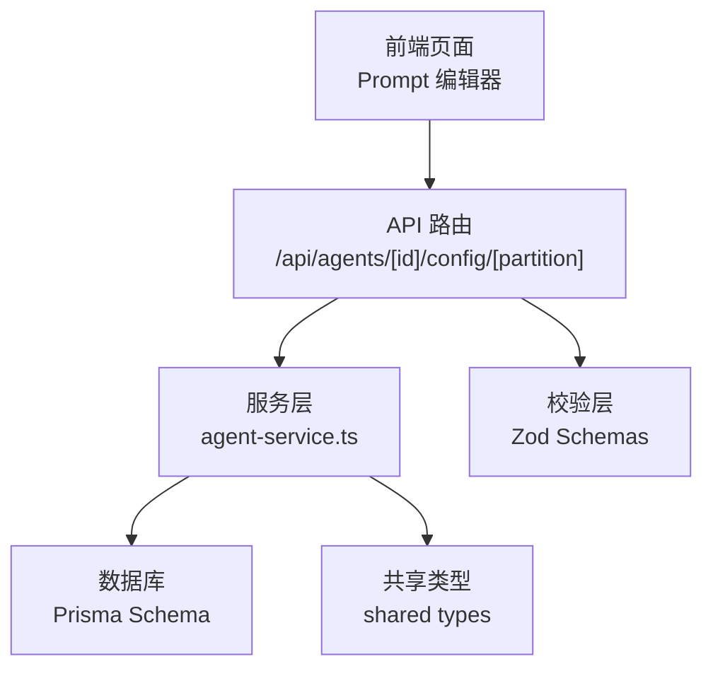
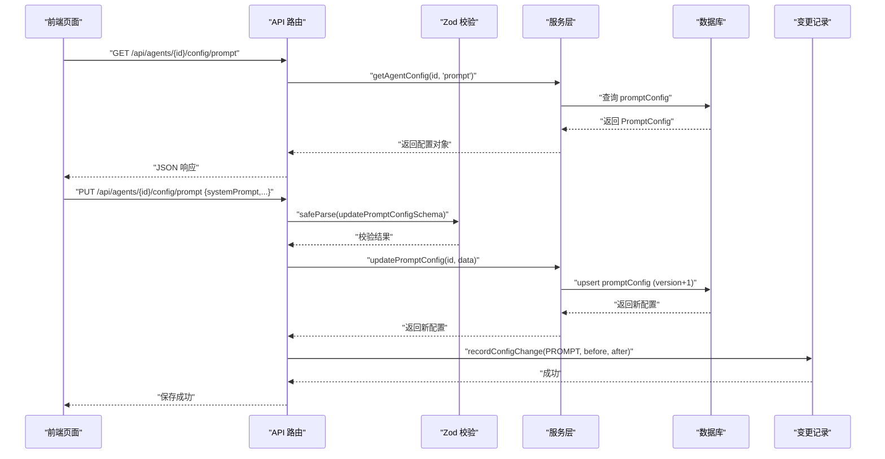
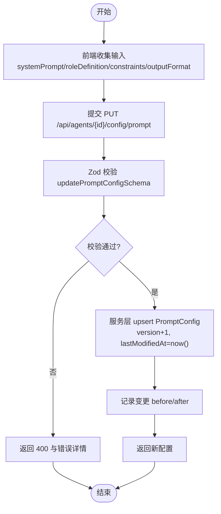
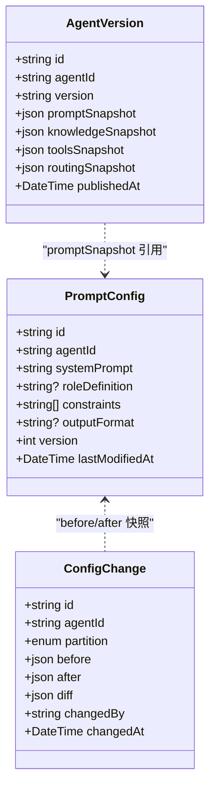
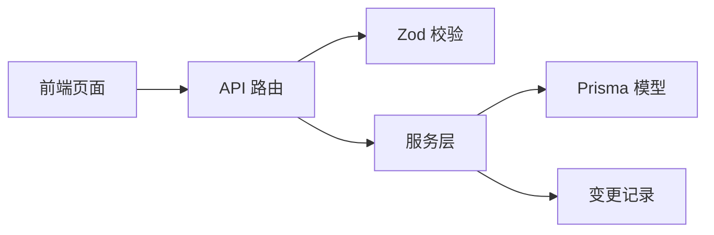

# Prompt 配置分区

<cite>
**本文引用的文件**   
- [apps/web/app/(dashboard)/agents/[id]/page.tsx](file://apps/web/app/(dashboard)/agents/[id]/page.tsx)
- [apps/web/app/api/agents/[id]/config/[partition]/route.ts](file://apps/web/app/api/agents/[id]/config/[partition]/route.ts)
- [apps/web/lib/schemas.ts](file://apps/web/lib/schemas.ts)
- [apps/web/lib/services/agent-service.ts](file://apps/web/lib/services/agent-service.ts)
- [packages/db/prisma/schema.prisma](file://packages/db/prisma/schema.prisma)
- [packages/shared/src/types/agent.ts](file://packages/shared/src/types/agent.ts)
</cite>

## 目录
1. [引言](#引言)
2. [项目结构](#项目结构)
3. [核心组件](#核心组件)
4. [架构总览](#架构总览)
5. [详细组件分析](#详细组件分析)
6. [依赖分析](#依赖分析)
7. [性能考虑](#性能考虑)
8. [故障排查指南](#故障排查指南)
9. [结论](#结论)
10. [附录](#附录)

## 引言
本文件围绕“Prompt 配置分区”的设计与实现进行系统化说明，重点覆盖以下方面：
- 设计原理：为何将 Prompt 配置从 Agent 主配置中拆分出来，以及分区带来的可维护性与演进优势。
- 字段语义与用法：systemPrompt、roleDefinition、constraints、outputFormat 的作用与最佳实践。
- 验证规则与模板语法：前端表单校验、后端 Zod 校验、数据库约束与类型契约。
- 版本管理与测试策略：变更审计、发布快照、回滚与回归测试建议。
- 性能优化与质量提升：如何编写高效、稳定、可复用的 Prompt 配置。

## 项目结构
本项目采用前后端同仓的 Next.js 应用，配合 Prisma 数据模型与共享类型定义。与 Prompt 配置分区直接相关的代码分布在如下位置：
- 前端页面与编辑器：提供 Prompt 配置的可视化编辑与保存交互。
- API 路由：按分区维度统一处理 GET/PUT，完成参数校验、持久化与变更记录。
- 服务层：封装对数据库的读写操作，负责分区映射、增量版本号更新等。
- 数据模型：Prisma Schema 定义了 PromptConfig 表结构与关联关系。
- 共享类型：在 packages/shared 中定义跨模块使用的类型与枚举。

图表来源
- [apps/web/app/(dashboard)/agents/[id]/page.tsx:1-283](file://apps/web/app/(dashboard)/agents/[id]/page.tsx#L1-L283)
- [apps/web/app/api/agents/[id]/config/[partition]/route.ts:1-105](file://apps/web/app/api/agents/[id]/config/[partition]/route.ts#L1-L105)
- [apps/web/lib/services/agent-service.ts:142-301](file://apps/web/lib/services/agent-service.ts#L142-L301)
- [packages/db/prisma/schema.prisma:103-114](file://packages/db/prisma/schema.prisma#L103-L114)
- [packages/shared/src/types/agent.ts:25-31](file://packages/shared/src/types/agent.ts#L25-L31)

章节来源
- [apps/web/app/(dashboard)/agents/[id]/page.tsx:1-283](file://apps/web/app/(dashboard)/agents/[id]/page.tsx#L1-L283)
- [apps/web/app/api/agents/[id]/config/[partition]/route.ts:1-105](file://apps/web/app/api/agents/[id]/config/[partition]/route.ts#L1-L105)
- [apps/web/lib/services/agent-service.ts:142-301](file://apps/web/lib/services/agent-service.ts#L142-L301)
- [packages/db/prisma/schema.prisma:103-114](file://packages/db/prisma/schema.prisma#L103-L114)
- [packages/shared/src/types/agent.ts:25-31](file://packages/shared/src/types/agent.ts#L25-L31)

## 核心组件
- 前端 Prompt 编辑器：提供 systemPrompt、roleDefinition、constraints（每行一条）、outputFormat 的输入与双向绑定，并在保存时提交到对应分区接口。
- API 路由：根据 partition 路由到不同分区处理器，执行参数校验、读取旧配置、更新新配置并记录变更。
- 服务层：通过分区映射选择具体模型，执行 get/update 操作；更新时递增 version 并更新时间戳；记录 before/after 变更。
- 数据模型：PromptConfig 包含 systemPrompt、roleDefinition、constraints、outputFormat、version、lastModifiedAt 等字段。
- 校验层：使用 Zod 定义 updatePromptConfigSchema，确保 systemPrompt 必填、constraints 为字符串数组、其他字段可选或可为空。
- 共享类型：在 shared 中定义 PromptConfig 接口，保证前后端类型一致。

章节来源
- [apps/web/app/(dashboard)/agents/[id]/page.tsx:158-199](file://apps/web/app/(dashboard)/agents/[id]/page.tsx#L158-L199)
- [apps/web/app/api/agents/[id]/config/[partition]/route.ts:19-104](file://apps/web/app/api/agents/[id]/config/[partition]/route.ts#L19-L104)
- [apps/web/lib/services/agent-service.ts:146-186](file://apps/web/lib/services/agent-service.ts#L146-L186)
- [packages/db/prisma/schema.prisma:103-114](file://packages/db/prisma/schema.prisma#L103-L114)
- [apps/web/lib/schemas.ts:23-28](file://apps/web/lib/schemas.ts#L23-L28)
- [packages/shared/src/types/agent.ts:25-31](file://packages/shared/src/types/agent.ts#L25-L31)

## 架构总览
下图展示了从前端编辑到后端持久化的完整调用链，包括分区校验、数据更新与变更记录。

图表来源
- [apps/web/app/(dashboard)/agents/[id]/page.tsx:36-66](file://apps/web/app/(dashboard)/agents/[id]/page.tsx#L36-L66)
- [apps/web/app/api/agents/[id]/config/[partition]/route.ts:36-104](file://apps/web/app/api/agents/[id]/config/[partition]/route.ts#L36-L104)
- [apps/web/lib/services/agent-service.ts:155-186](file://apps/web/lib/services/agent-service.ts#L155-L186)
- [apps/web/lib/services/agent-service.ts:282-301](file://apps/web/lib/services/agent-service.ts#L282-L301)

## 详细组件分析

### 字段语义与使用方法
- systemPrompt（系统提示词）
  - 作用：定义 AI 的基础行为与任务目标，是每次对话的核心上下文。
  - 要求：必填，长度至少为 1。
  - 建议：清晰描述角色、任务边界、输出风格与关键约束；避免冗长重复信息。
- roleDefinition（角色定义）
  - 作用：补充系统提示词之外的角色背景与能力范围，帮助模型理解身份与职责。
  - 要求：可选，可为空。
  - 建议：聚焦于领域知识、专业术语、沟通风格与限制条件。
- constraints（约束条件）
  - 作用：以列表形式表达硬性规则，如“不要回答无关问题”、“涉及价格需提醒查看官网”。
  - 要求：可选，类型为字符串数组。
  - 建议：每条约束尽量简短明确、可执行、可验证；避免相互冲突。
- outputFormat（输出格式）
  - 作用：指定期望的输出格式，如 Markdown、JSON、纯文本等，便于下游解析与展示。
  - 要求：可选，可为空。
  - 建议：与下游消费方约定一致的格式规范，必要时附带示例结构。

章节来源
- [apps/web/lib/schemas.ts:23-28](file://apps/web/lib/schemas.ts#L23-L28)
- [packages/shared/src/types/agent.ts:25-31](file://packages/shared/src/types/agent.ts#L25-L31)
- [apps/web/app/(dashboard)/agents/[id]/page.tsx:158-199](file://apps/web/app/(dashboard)/agents/[id]/page.tsx#L158-L199)

### 验证规则与模板语法支持
- 前端校验
  - 编辑器通过受控组件维护状态，保存前由后端 Zod 校验。
  - constraints 在前端按行分割并过滤空行，形成字符串数组。
- 后端校验
  - 使用 Zod 的 updatePromptConfigSchema 进行 safeParse，失败返回 400 与错误消息。
- 数据库约束
  - PromptConfig.systemPrompt 为必填字符串；constraints 为字符串数组；其他字段允许为空。
- 模板语法
  - 当前未实现专用模板引擎；建议在 systemPrompt 中使用自然语言占位符（如“{{用户意图}}”），由上层组装逻辑替换后再传入模型。

图表来源
- [apps/web/app/api/agents/[id]/config/[partition]/route.ts:55-104](file://apps/web/app/api/agents/[id]/config/[partition]/route.ts#L55-L104)
- [apps/web/lib/schemas.ts:23-28](file://apps/web/lib/schemas.ts#L23-L28)
- [apps/web/lib/services/agent-service.ts:165-186](file://apps/web/lib/services/agent-service.ts#L165-L186)
- [apps/web/lib/services/agent-service.ts:282-301](file://apps/web/lib/services/agent-service.ts#L282-L301)

章节来源
- [apps/web/app/(dashboard)/agents/[id]/page.tsx:158-199](file://apps/web/app/(dashboard)/agents/[id]/page.tsx#L158-L199)
- [apps/web/app/api/agents/[id]/config/[partition]/route.ts:55-104](file://apps/web/app/api/agents/[id]/config/[partition]/route.ts#L55-L104)
- [apps/web/lib/schemas.ts:23-28](file://apps/web/lib/schemas.ts#L23-L28)
- [packages/db/prisma/schema.prisma:103-114](file://packages/db/prisma/schema.prisma#L103-L114)

### 版本管理与变更记录
- 版本管理
  - 每次更新 PromptConfig 会递增 version 字段，便于追踪迭代历史。
- 变更记录
  - 记录 before/after 快照，标记分区为 PROMPT，记录变更时间与操作者（当前为 system）。
- 发布与快照
  - 发布流程会将各分区配置快照写入 AgentVersion，形成可回溯的版本基线。

图表来源
- [packages/db/prisma/schema.prisma:103-114](file://packages/db/prisma/schema.prisma#L103-L114)
- [packages/db/prisma/schema.prisma:192-214](file://packages/db/prisma/schema.prisma#L192-L214)
- [packages/db/prisma/schema.prisma:332-354](file://packages/db/prisma/schema.prisma#L332-L354)
- [apps/web/lib/services/agent-service.ts:165-186](file://apps/web/lib/services/agent-service.ts#L165-L186)
- [apps/web/lib/services/agent-service.ts:282-301](file://apps/web/lib/services/agent-service.ts#L282-L301)

章节来源
- [apps/web/lib/services/agent-service.ts:165-186](file://apps/web/lib/services/agent-service.ts#L165-L186)
- [apps/web/lib/services/agent-service.ts:282-301](file://apps/web/lib/services/agent-service.ts#L282-L301)
- [packages/db/prisma/schema.prisma:103-114](file://packages/db/prisma/schema.prisma#L103-L114)
- [packages/db/prisma/schema.prisma:192-214](file://packages/db/prisma/schema.prisma#L192-L214)
- [packages/db/prisma/schema.prisma:332-354](file://packages/db/prisma/schema.prisma#L332-L354)

### Prompt 编写最佳实践与示例
- 结构化组织
  - 将 systemPrompt 拆分为“角色—任务—约束—输出格式”四段，提高可读性与可维护性。
- 约束优先
  - 将不可妥协的规则放入 constraints，逐条列出，避免模糊表述。
- 输出格式明确
  - 在 outputFormat 中声明期望格式，并在 systemPrompt 中给出简要示例结构。
- 渐进式迭代
  - 利用 version 与变更记录进行 A/B 对比，逐步优化效果。
- 示例参考路径
  - 前端编辑器字段与标签可作为编写结构的参考。

章节来源
- [apps/web/app/(dashboard)/agents/[id]/page.tsx:158-199](file://apps/web/app/(dashboard)/agents/[id]/page.tsx#L158-L199)

### Prompt 测试策略
- 单元测试
  - 针对 Zod 校验规则编写用例，覆盖必填、类型、边界值。
- 集成测试
  - 模拟 GET/PUT 请求，验证分区路由、校验失败、更新成功与变更记录。
- 回归测试
  - 基于 AgentVersion 的 promptSnapshot 构建基准集，变更后自动比对输出差异。
- 人工验收
  - 结合反馈系统与评分机制，对关键场景进行抽样评估。

[本节为通用指导，不直接分析具体文件，故无章节来源]

## 依赖分析
- 组件耦合
  - API 路由依赖校验层与服务层；服务层依赖数据库与变更记录；前端依赖 API 与本地状态。
- 外部依赖
  - Prisma Client 用于数据访问；Zod 用于运行时校验；Next.js 提供路由与请求处理。
- 潜在循环依赖
  - 当前分层清晰，未见循环导入；保持路由→服务→模型的单向依赖。

图表来源
- [apps/web/app/api/agents/[id]/config/[partition]/route.ts:1-105](file://apps/web/app/api/agents/[id]/config/[partition]/route.ts#L1-L105)
- [apps/web/lib/schemas.ts:23-28](file://apps/web/lib/schemas.ts#L23-L28)
- [apps/web/lib/services/agent-service.ts:142-301](file://apps/web/lib/services/agent-service.ts#L142-L301)
- [apps/web/app/(dashboard)/agents/[id]/page.tsx:1-283](file://apps/web/app/(dashboard)/agents/[id]/page.tsx#L1-L283)

章节来源
- [apps/web/app/api/agents/[id]/config/[partition]/route.ts:1-105](file://apps/web/app/api/agents/[id]/config/[partition]/route.ts#L1-L105)
- [apps/web/lib/services/agent-service.ts:142-301](file://apps/web/lib/services/agent-service.ts#L142-L301)
- [apps/web/lib/schemas.ts:23-28](file://apps/web/lib/schemas.ts#L23-L28)
- [apps/web/app/(dashboard)/agents/[id]/page.tsx:1-283](file://apps/web/app/(dashboard)/agents/[id]/page.tsx#L1-L283)

## 性能考虑
- 减少冗余
  - 将高频使用的指令下沉至 systemPrompt，避免在 constraints 中重复描述。
- 控制长度
  - 合理压缩 systemPrompt 与 constraints，降低 Token 消耗与延迟。
- 缓存与复用
  - 对稳定的 Prompt 片段建立模板库，按需组合，减少重复输入。
- 并发与超时
  - 结合 Tools 配置中的 timeoutMs 与 retryCount，平衡稳定性与响应时间。

[本节为通用指导，不直接分析具体文件，故无章节来源]

## 故障排查指南
- 常见错误
  - 400 参数校验失败：检查 systemPrompt 是否为空、constraints 是否为字符串数组、outputFormat 类型是否正确。
  - 404 获取失败：确认 Agent ID 存在且分区名称有效。
  - 500 更新失败：检查数据库连接与权限，关注变更记录是否成功写入。
- 定位方法
  - 查看 API 返回的错误消息与 Zod 错误详情。
  - 核对数据库 PromptConfig 的 version 与 lastModifiedAt 是否递增。
  - 审查变更记录 before/after 快照，定位变更点。

章节来源
- [apps/web/app/api/agents/[id]/config/[partition]/route.ts:36-104](file://apps/web/app/api/agents/[id]/config/[partition]/route.ts#L36-L104)
- [apps/web/lib/services/agent-service.ts:155-186](file://apps/web/lib/services/agent-service.ts#L155-L186)
- [apps/web/lib/services/agent-service.ts:282-301](file://apps/web/lib/services/agent-service.ts#L282-L301)

## 结论
通过将 Prompt 配置独立为分区，系统在可维护性、可观测性与可演进性上获得显著提升。借助严格的校验、清晰的字段语义、完善的版本与变更记录，开发者能够持续优化 Prompt 质量，保障 AI 响应的稳定性与一致性。建议在实践中遵循结构化编写、约束优先、输出格式明确的原则，并结合测试与回归策略，持续提升效果。

[本节为总结性内容，不直接分析具体文件，故无章节来源]

## 附录
- 相关类型与枚举
  - PromptConfig、ConfigPartition、SearchStrategy 等定义位于 shared 类型文件中，供前后端共用。
- 数据库模型
  - PromptConfig、ConfigChange、AgentVersion 等模型定义位于 Prisma Schema 中，支撑版本与审计需求。

章节来源
- [packages/shared/src/types/agent.ts:18-31](file://packages/shared/src/types/agent.ts#L18-L31)
- [packages/db/prisma/schema.prisma:103-114](file://packages/db/prisma/schema.prisma#L103-L114)
- [packages/db/prisma/schema.prisma:192-214](file://packages/db/prisma/schema.prisma#L192-L214)
- [packages/db/prisma/schema.prisma:332-354](file://packages/db/prisma/schema.prisma#L332-L354)