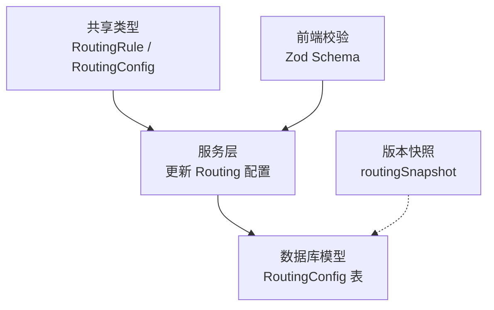
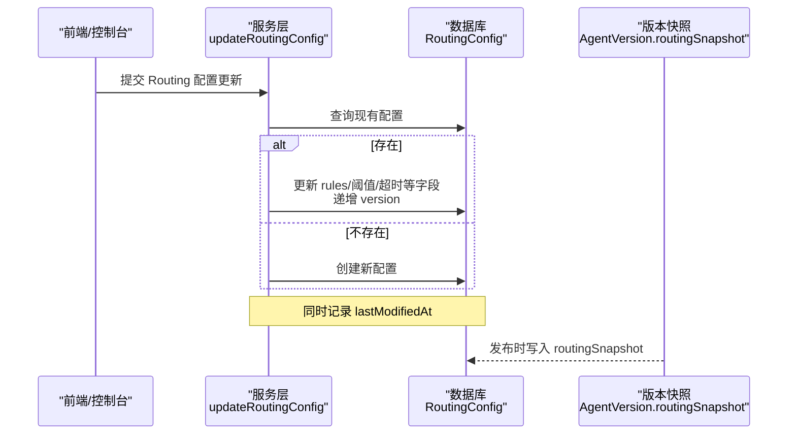
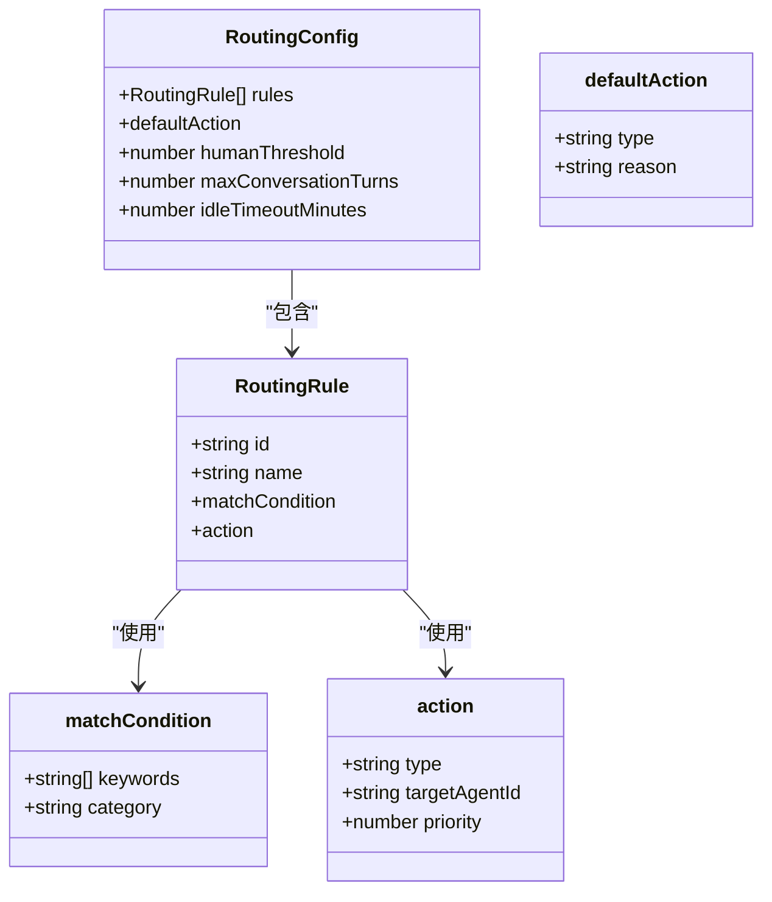
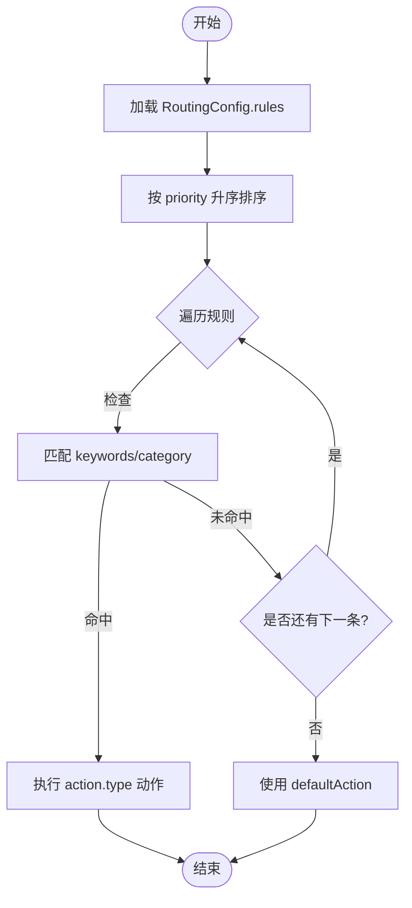
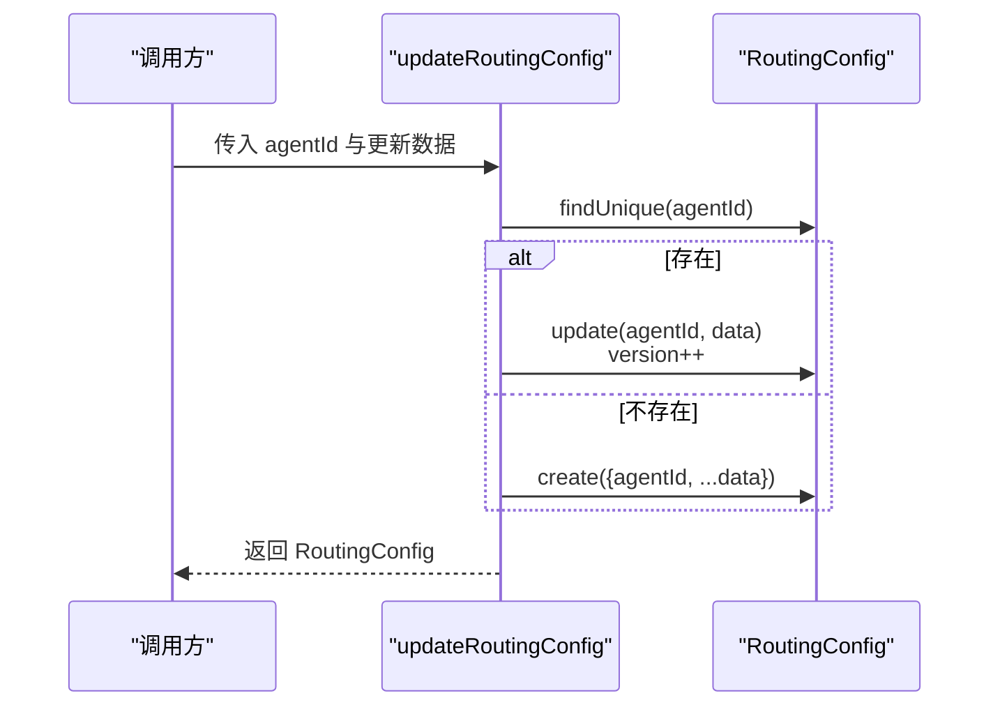
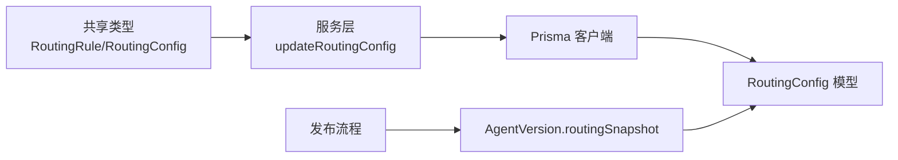

# Routing 配置分区

<cite>
**本文引用的文件**   
- [packages/shared/src/types/agent.ts](file://packages/shared/src/types/agent.ts)
- [apps/web/lib/services/agent-service.ts](file://apps/web/lib/services/agent-service.ts)
- [apps/web/lib/schemas.ts](file://apps/web/lib/schemas.ts)
- [packages/db/prisma/schema.prisma](file://packages/db/prisma/schema.prisma)
</cite>

## 目录
1. [简介](#简介)
2. [项目结构](#项目结构)
3. [核心组件](#核心组件)
4. [架构总览](#架构总览)
5. [详细组件分析](#详细组件分析)
6. [依赖分析](#依赖分析)
7. [性能考虑](#性能考虑)
8. [故障排查指南](#故障排查指南)
9. [结论](#结论)
10. [附录](#附录)

## 简介
本文件围绕“Routing 配置分区”的路由规则设计与实现进行深入解析，重点覆盖：
- RoutingRule 的匹配条件（keywords、category）与动作类型（route_to_agent、route_to_human、route_to_subflow）
- 路由优先级机制与默认动作配置
- 会话管理参数 humanThreshold、maxConversationTurns、idleTimeoutMinutes 的作用
- 复杂路由场景的配置示例与调试方法
- 路由性能优化与监控策略
- 多 Agent 协作的路由设计模式

目标是帮助开发者构建智能、灵活且可观测的 Agent 路由系统。

## 项目结构
本项目采用“四分区配置”的组织方式，其中 Routing 分区负责将用户请求或对话上下文路由到合适的目标（Agent、人类或子流程）。相关代码分布在以下位置：
- 类型定义：shared 层提供 RoutingRule 与 RoutingConfig 的类型契约
- 服务层：Web 应用的服务函数负责读写 Routing 配置
- 数据模型：Prisma Schema 定义了持久化结构与字段约束
- 校验层：Zod schema 对输入进行边界与范围校验

图表来源
- [packages/shared/src/types/agent.ts:83-107](file://packages/shared/src/types/agent.ts#L83-L107)
- [apps/web/lib/services/agent-service.ts:247-280](file://apps/web/lib/services/agent-service.ts#L247-L280)
- [packages/db/prisma/schema.prisma:161-173](file://packages/db/prisma/schema.prisma#L161-L173)
- [apps/web/lib/schemas.ts:46-52](file://apps/web/lib/schemas.ts#L46-L52)

章节来源
- [packages/shared/src/types/agent.ts:83-107](file://packages/shared/src/types/agent.ts#L83-L107)
- [apps/web/lib/services/agent-service.ts:247-280](file://apps/web/lib/services/agent-service.ts#L247-L280)
- [apps/web/lib/schemas.ts:46-52](file://apps/web/lib/schemas.ts#L46-L52)
- [packages/db/prisma/schema.prisma:161-173](file://packages/db/prisma/schema.prisma#L161-L173)

## 核心组件
本节聚焦 Routing 分区的核心数据结构与行为：
- RoutingRule：单条路由规则，包含匹配条件与动作
- RoutingConfig：聚合所有规则、默认动作与会话控制参数
- 服务层 updateRoutingConfig：原子写入并记录版本变更
- Prisma 模型 RoutingConfig：持久化存储与默认值

关键要点
- 匹配条件支持 keywords 与 category，便于基于关键词与分类进行快速分流
- 动作类型支持三种：路由至 Agent、转交人类、进入子流程
- 每条规则具备 priority，用于决定命中顺序
- defaultAction 作为兜底策略，确保未命中任何规则时的确定性行为
- 会话参数 humanThreshold、maxConversationTurns、idleTimeoutMinutes 控制人机协作与生命周期

章节来源
- [packages/shared/src/types/agent.ts:83-107](file://packages/shared/src/types/agent.ts#L83-L107)
- [apps/web/lib/services/agent-service.ts:247-280](file://apps/web/lib/services/agent-service.ts#L247-L280)
- [packages/db/prisma/schema.prisma:161-173](file://packages/db/prisma/schema.prisma#L161-L173)

## 架构总览
下图展示了从配置更新到持久化的完整链路，以及版本快照在发布流程中的关联关系。

图表来源
- [apps/web/lib/services/agent-service.ts:247-280](file://apps/web/lib/services/agent-service.ts#L247-L280)
- [packages/db/prisma/schema.prisma:161-173](file://packages/db/prisma/schema.prisma#L161-L173)
- [packages/db/prisma/schema.prisma:332-354](file://packages/db/prisma/schema.prisma#L332-L354)

## 详细组件分析

### 数据类型与约束
- RoutingRule
  - id/name：规则标识与可读名称
  - matchCondition.keywords/category：匹配条件集合与类别标签
  - action.type/targetAgentId/priority：动作类型、目标 Agent 标识、优先级
- RoutingConfig
  - rules：规则数组
  - defaultAction.type/reason：默认动作与原因说明
  - humanThreshold/maxConversationTurns/idleTimeoutMinutes：会话控制参数
- 服务层与校验
  - updateRoutingConfig：按 agentId 进行 upsert，增量更新 version 与时间戳
  - Zod schema：限制 humanThreshold 为 0~1，maxConversationTurns 为 1~100，idleTimeoutMinutes 为 1~60

图表来源
- [packages/shared/src/types/agent.ts:83-107](file://packages/shared/src/types/agent.ts#L83-L107)

章节来源
- [packages/shared/src/types/agent.ts:83-107](file://packages/shared/src/types/agent.ts#L83-L107)
- [apps/web/lib/schemas.ts:46-52](file://apps/web/lib/schemas.ts#L46-L52)

### 路由匹配与优先级机制
- 匹配条件
  - keywords：字符串列表，用于关键词匹配
  - category：分类标签，用于按领域/主题分流
- 动作类型
  - route_to_agent：转发到指定 Agent（targetAgentId）
  - route_to_human：转交人类处理
  - route_to_subflow：进入子流程（如工作流或编排任务）
- 优先级
  - 每条规则携带 priority，数值越小通常表示优先级越高（具体排序策略由执行器决定）
- 默认动作
  - 当无规则命中时，使用 defaultAction.type 与 reason 作为兜底策略

[此图为概念性流程图，不直接映射具体源码文件]

### 会话管理参数
- humanThreshold：人类介入阈值，用于衡量何时触发人工接管或升级策略
- maxConversationTurns：最大对话轮次，防止无限循环
- idleTimeoutMinutes：空闲超时分钟数，超过后自动释放会话资源或转入待机

这些参数在数据库模型中均有默认值，并在服务层更新时受 Zod 校验约束。

章节来源
- [packages/db/prisma/schema.prisma:161-173](file://packages/db/prisma/schema.prisma#L161-L173)
- [apps/web/lib/schemas.ts:46-52](file://apps/web/lib/schemas.ts#L46-L52)

### 配置更新流程
- 入口：updateRoutingConfig(agentId, data)
- 逻辑：
  - 若已存在对应 agentId 的配置，则更新 fields 并递增 version、更新时间戳
  - 若不存在，则创建新配置，填充默认字段
- 输出：返回最新 RoutingConfig 记录

图表来源
- [apps/web/lib/services/agent-service.ts:247-280](file://apps/web/lib/services/agent-service.ts#L247-L280)
- [packages/db/prisma/schema.prisma:161-173](file://packages/db/prisma/schema.prisma#L161-L173)

章节来源
- [apps/web/lib/services/agent-service.ts:247-280](file://apps/web/lib/services/agent-service.ts#L247-L280)

### 复杂路由场景示例
以下为典型的多分支路由场景建议（以配置项描述为主，非代码片段）：
- 场景一：按关键词优先路由到专家 Agent
  - 规则：keywords 包含特定术语；priority 较低（高优）；action.type=route_to_agent；targetAgentId 指向专家 Agent
- 场景二：按分类路由到人类客服
  - 规则：category=售后；action.type=route_to_human；reason=“需要人工协助”
- 场景三：通用问题进入子流程
  - 规则：无 keywords 且 category=通用；action.type=route_to_subflow；后续由编排器调度
- 场景四：兜底策略
  - defaultAction.type=route_to_human；reason=“未识别意图，转交人工”

章节来源
- [packages/shared/src/types/agent.ts:83-107](file://packages/shared/src/types/agent.ts#L83-L107)

### 调试方法
- 日志与审计
  - 利用 ConfigChange 记录分区变更，结合 changeNote 定位问题
- 反馈与标记
  - Feedback.tags 中包含 ROUTING_ERROR，可用于收集路由异常样本
- 版本回溯
  - 通过 AgentVersion.routingSnapshot 对比不同版本的规则差异
- 参数校验
  - 借助 Zod schema 的边界限制，避免非法阈值导致运行时异常

章节来源
- [packages/db/prisma/schema.prisma:192-214](file://packages/db/prisma/schema.prisma#L192-L214)
- [packages/db/prisma/schema.prisma:332-354](file://packages/db/prisma/schema.prisma#L332-L354)
- [apps/web/lib/schemas.ts:46-52](file://apps/web/lib/schemas.ts#L46-L52)

## 依赖分析
Routing 配置涉及跨层依赖：
- shared 类型定义被服务层与前端共同消费
- 服务层依赖 Prisma 客户端进行数据访问
- 数据库模型定义字段与默认值
- 发布流程将 routingSnapshot 写入版本表

图表来源
- [packages/shared/src/types/agent.ts:83-107](file://packages/shared/src/types/agent.ts#L83-L107)
- [apps/web/lib/services/agent-service.ts:247-280](file://apps/web/lib/services/agent-service.ts#L247-L280)
- [packages/db/prisma/schema.prisma:161-173](file://packages/db/prisma/schema.prisma#L161-L173)
- [packages/db/prisma/schema.prisma:332-354](file://packages/db/prisma/schema.prisma#L332-L354)

章节来源
- [packages/shared/src/types/agent.ts:83-107](file://packages/shared/src/types/agent.ts#L83-L107)
- [apps/web/lib/services/agent-service.ts:247-280](file://apps/web/lib/services/agent-service.ts#L247-L280)
- [packages/db/prisma/schema.prisma:161-173](file://packages/db/prisma/schema.prisma#L161-L173)
- [packages/db/prisma/schema.prisma:332-354](file://packages/db/prisma/schema.prisma#L332-L354)

## 性能考虑
- 规则数量与匹配复杂度
  - 建议将高频匹配的关键词置于高优先级规则，减少遍历成本
  - 合理使用 category 进行粗粒度分流，降低精确匹配开销
- 索引与查询
  - 当前模型未对 rules JSON 建立索引，建议在热点查询路径引入缓存或物化视图
- 并发与超时
  - 结合 ToolsConfig 的 timeoutMs 与 retryCount，避免长尾请求阻塞路由决策
- 版本快照
  - 发布时生成 routingSnapshot，有助于回滚与对比，但需控制快照大小

[本节为通用指导，不直接分析具体文件]

## 故障排查指南
- 常见问题
  - 规则未命中：检查 keywords 与 category 是否与输入一致；确认 defaultAction 是否合理
  - 优先级冲突：调整 priority，确保期望的规则先命中
  - 会话超时：调大 idleTimeoutMinutes 或优化业务逻辑以减少空闲
- 定位手段
  - 查看 ConfigChange 变更记录，确认最近一次修改内容与操作者
  - 使用 Feedback.tags=ROUTING_ERROR 收集错误样本，结合 sessionData 复现
  - 对比 AgentVersion.routingSnapshot 定位回归点

章节来源
- [packages/db/prisma/schema.prisma:192-214](file://packages/db/prisma/schema.prisma#L192-L214)
- [packages/db/prisma/schema.prisma:332-354](file://packages/db/prisma/schema.prisma#L332-L354)

## 结论
Routing 配置分区通过清晰的类型契约、灵活的匹配条件与动作类型、完善的默认策略与会话控制参数，为多 Agent 协作提供了坚实的基础。配合版本快照与变更审计，可实现可观测、可回滚、可演进的路由系统。建议在生产环境中结合缓存、限流与监控指标，进一步提升稳定性与性能。

## 附录

### 多 Agent 协作的路由设计模式
- 专家直连模式：针对高置信度意图，直接路由到专业 Agent
- 分级升级模式：先尝试自动化 Agent，失败或低置信度时升级到人类
- 编排协同模式：通过 route_to_subflow 进入编排器，协调多个 Agent 完成复杂任务
- 兜底保障模式：defaultAction 确保未知场景的安全降级

[本节为概念性内容，不直接分析具体文件]