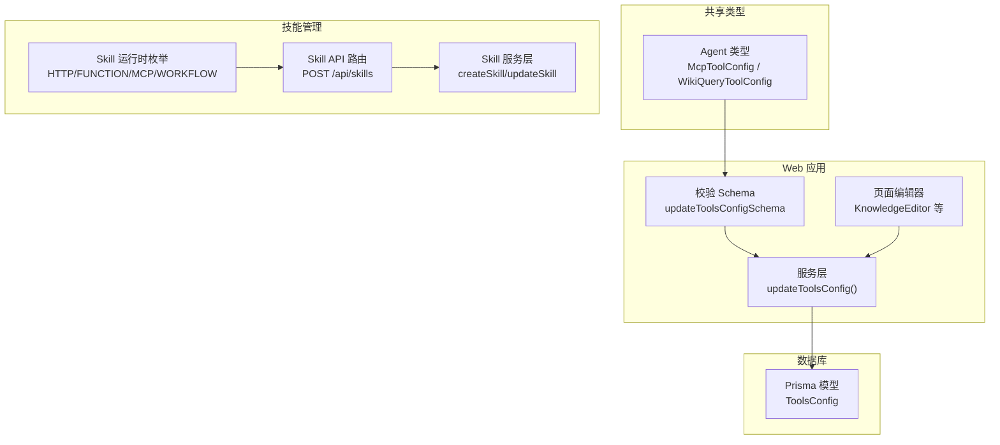
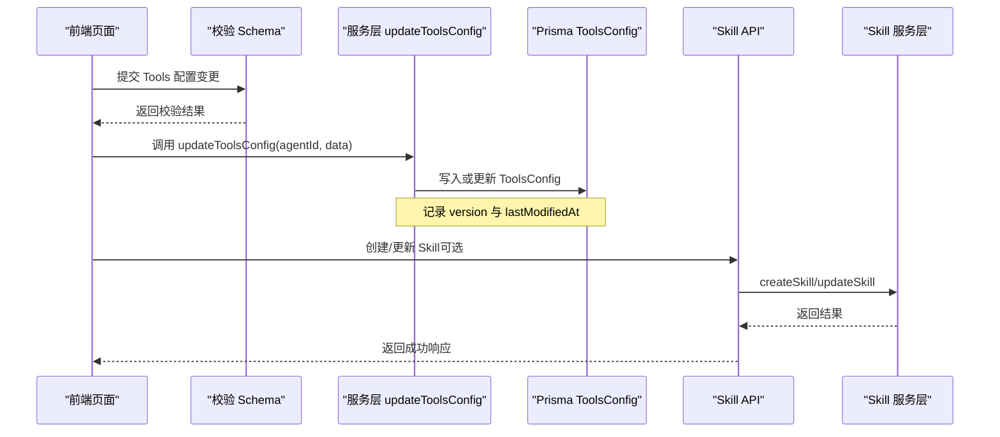
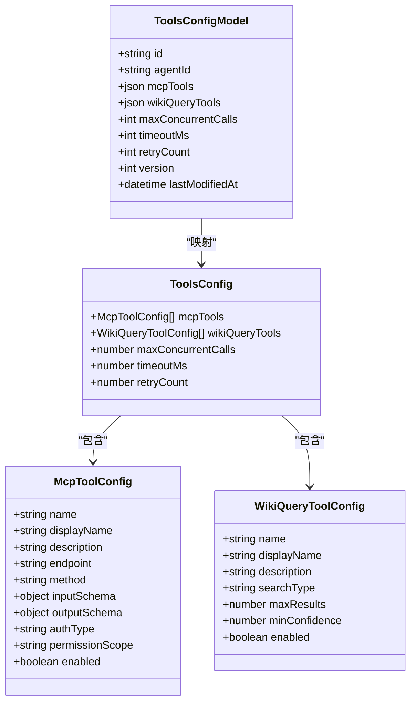

# Tools 配置分区

<cite>
**本文引用的文件**
- [packages/shared/src/types/agent.ts](file://packages/shared/src/types/agent.ts)
- [apps/web/lib/schemas.ts](file://apps/web/lib/schemas.ts)
- [apps/web/lib/services/agent-service.ts](file://apps/web/lib/services/agent-service.ts)
- [packages/db/prisma/schema.prisma](file://packages/db/prisma/schema.prisma)
- [apps/web/app/(dashboard)/agents/[id]/page.tsx](file://apps/web/app/(dashboard)/agents/[id]/page.tsx)
- [apps/web/app/api/skills/route.ts](file://apps/web/app/api/skills/route.ts)
- [apps/web/lib/services/skill-service.ts](file://apps/web/lib/services/skill-service.ts)
- [packages/shared/src/types/skill.ts](file://packages/shared/src/types/skill.ts)
</cite>

## 目录
1. [简介](#简介)
2. [项目结构](#项目结构)
3. [核心组件](#核心组件)
4. [架构总览](#架构总览)
5. [详细组件分析](#详细组件分析)
6. [依赖关系分析](#依赖关系分析)
7. [性能与并发](#性能与并发)
8. [安全与权限控制](#安全与权限控制)
9. [故障排查指南](#故障排查指南)
10. [结论](#结论)
11. [附录：自定义工具开发与集成](#附录自定义工具开发与集成)

## 简介
本文件聚焦于“Tools 配置分区”的设计与实现，围绕以下目标展开：
- 解析 McpToolConfig 与 WikiQueryToolConfig 的配置结构与参数含义
- 说明 MCP Tool 的 HTTP 接口配置、认证方式与权限控制
- 描述 Wiki Query Tool 的搜索类型与结果过滤配置
- 解释工具并发调用、超时处理与重试机制的配置方法
- 提供安全最佳实践与性能优化建议
- 给出自定义工具开发与集成的指导，帮助开发者正确配置与管理各类工具资源

## 项目结构
本项目采用多包（monorepo）组织，与 Tools 配置分区相关的关键位置如下：
- 共享类型定义：packages/shared/src/types/agent.ts
- 前端校验规则：apps/web/lib/schemas.ts
- 服务层更新逻辑：apps/web/lib/services/agent-service.ts
- 数据库模型：packages/db/prisma/schema.prisma
- 前端编辑界面片段：apps/web/app/(dashboard)/agents/[id]/page.tsx
- 技能（Skill）运行时与 API：apps/web/app/api/skills/route.ts、apps/web/lib/services/skill-service.ts、packages/shared/src/types/skill.ts

图表来源
- [packages/shared/src/types/agent.ts:18-81](file://packages/shared/src/types/agent.ts#L18-L81)
- [apps/web/lib/schemas.ts:38-44](file://apps/web/lib/schemas.ts#L38-L44)
- [apps/web/lib/services/agent-service.ts:212-245](file://apps/web/lib/services/agent-service.ts#L212-L245)
- [packages/db/prisma/schema.prisma:147-159](file://packages/db/prisma/schema.prisma#L147-L159)
- [apps/web/app/(dashboard)/agents/[id]/page.tsx:202-253](file://apps/web/app/(dashboard)/agents/[id]/page.tsx#L202-L253)
- [apps/web/app/api/skills/route.ts:1-40](file://apps/web/app/api/skills/route.ts#L1-L40)
- [apps/web/lib/services/skill-service.ts:56-87](file://apps/web/lib/services/skill-service.ts#L56-L87)
- [packages/shared/src/types/skill.ts:1-48](file://packages/shared/src/types/skill.ts#L1-L48)

章节来源
- [packages/shared/src/types/agent.ts:18-81](file://packages/shared/src/types/agent.ts#L18-L81)
- [apps/web/lib/schemas.ts:38-44](file://apps/web/lib/schemas.ts#L38-L44)
- [apps/web/lib/services/agent-service.ts:212-245](file://apps/web/lib/services/agent-service.ts#L212-L245)
- [packages/db/prisma/schema.prisma:147-159](file://packages/db/prisma/schema.prisma#L147-L159)
- [apps/web/app/(dashboard)/agents/[id]/page.tsx:202-253](file://apps/web/app/(dashboard)/agents/[id]/page.tsx#L202-L253)
- [apps/web/app/api/skills/route.ts:1-40](file://apps/web/app/api/skills/route.ts#L1-L40)
- [apps/web/lib/services/skill-service.ts:56-87](file://apps/web/lib/services/skill-service.ts#L56-L87)
- [packages/shared/src/types/skill.ts:1-48](file://packages/shared/src/types/skill.ts#L1-L48)

## 核心组件
本节聚焦 Tools 配置分区的核心数据结构与持久化。

- 配置分区枚举
  - ConfigPartition 包含 PROMPT、KNOWLEDGE、TOOLS、ROUTING，用于标识不同配置域。
- Tools 配置结构
  - ToolsConfig 包含 mcpTools、wikiQueryTools、maxConcurrentCalls、timeoutMs、retryCount 等字段。
- 具体工具配置
  - McpToolConfig：描述一个 MCP 工具的元数据、HTTP 端点、输入输出 Schema、认证类型、权限范围与启用状态。
  - WikiQueryToolConfig：描述 Wiki 查询工具的搜索类型、最大结果数、最小置信度阈值与启用状态。

章节来源
- [packages/shared/src/types/agent.ts:18-81](file://packages/shared/src/types/agent.ts#L18-L81)
- [packages/db/prisma/schema.prisma:147-159](file://packages/db/prisma/schema.prisma#L147-L159)

## 架构总览
下图展示了从前端到数据库的 Tools 配置更新流程，以及 Skill 运行时在工具生态中的角色。

图表来源
- [apps/web/lib/schemas.ts:38-44](file://apps/web/lib/schemas.ts#L38-L44)
- [apps/web/lib/services/agent-service.ts:212-245](file://apps/web/lib/services/agent-service.ts#L212-L245)
- [packages/db/prisma/schema.prisma:147-159](file://packages/db/prisma/schema.prisma#L147-L159)
- [apps/web/app/api/skills/route.ts:1-40](file://apps/web/app/api/skills/route.ts#L1-L40)
- [apps/web/lib/services/skill-service.ts:56-87](file://apps/web/lib/services/skill-service.ts#L56-L87)

## 详细组件分析

### McpToolConfig 配置结构与参数含义
- name：工具唯一名称
- displayName：展示名称
- description：工具描述
- endpoint：HTTP 端点地址
- method：HTTP 方法（GET/POST/PUT/DELETE）
- inputSchema：输入参数 JSON Schema
- outputSchema：输出结果 JSON Schema
- authType：认证类型（none/bearer/api_key）
- permissionScope：权限范围（read_only/read_write）
- enabled：是否启用

该结构用于声明式地描述一个基于 HTTP 的 MCP 工具，包括其接口契约与安全策略。

章节来源
- [packages/shared/src/types/agent.ts:49-61](file://packages/shared/src/types/agent.ts#L49-L61)

### WikiQueryToolConfig 配置结构与参数含义
- name：工具唯一名称
- displayName：展示名称
- description：工具描述
- searchType：搜索类型（keyword/semantic/hybrid）
- maxResults：最大返回结果数
- minConfidence：最小置信度阈值
- enabled：是否启用

该结构用于控制 Wiki 检索行为，包括搜索模式与结果过滤。

章节来源
- [packages/shared/src/types/agent.ts:63-72](file://packages/shared/src/types/agent.ts#L63-L72)

### Tools 全局运行参数
- maxConcurrentCalls：最大并发调用数
- timeoutMs：请求超时时间（毫秒）
- retryCount：失败重试次数

这些参数影响所有工具的统一执行策略。

章节来源
- [packages/shared/src/types/agent.ts:74-81](file://packages/shared/src/types/agent.ts#L74-L81)
- [packages/db/prisma/schema.prisma:147-159](file://packages/db/prisma/schema.prisma#L147-L159)

### 前端校验与约束
- updateToolsConfigSchema 对 Tools 配置进行边界校验：
  - maxConcurrentCalls：整数，范围 1~20
  - timeoutMs：整数，范围 1000~120000
  - retryCount：整数，范围 0~5
  - mcpTools 与 wikiQueryTools：数组（允许任意元素以兼容扩展）

章节来源
- [apps/web/lib/schemas.ts:38-44](file://apps/web/lib/schemas.ts#L38-L44)

### 服务层更新逻辑
- updateToolsConfig(agentId, data)：
  - 若已存在对应 agentId 的记录则更新；否则创建新记录
  - 支持增量更新 mcpTools、wikiQueryTools、maxConcurrentCalls、timeoutMs、retryCount
  - 自动递增 version 并更新时间戳 lastModifiedAt

章节来源
- [apps/web/lib/services/agent-service.ts:212-245](file://apps/web/lib/services/agent-service.ts#L212-L245)

### 数据库模型
- ToolsConfig 表字段：
  - id、agentId（唯一）、mcpTools（JSON）、wikiQueryTools（JSON）
  - maxConcurrentCalls（默认 3）、timeoutMs（默认 30000）、retryCount（默认 2）
  - version（默认 1）、lastModifiedBy、lastModifiedAt

章节来源
- [packages/db/prisma/schema.prisma:147-159](file://packages/db/prisma/schema.prisma#L147-L159)

### 前端知识区编辑器（Wiki 相关）
- KnowledgeEditor 提供搜索策略、回退开关、最大 Wiki 结果数、置信度阈值的可视化编辑能力，便于调整知识库检索行为。

章节来源
- [apps/web/app/(dashboard)/agents/[id]/page.tsx:202-253](file://apps/web/app/(dashboard)/agents/[id]/page.tsx#L202-L253)

### 技能（Skill）运行时与工具生态
- Skill 运行时枚举：HTTP、FUNCTION、MCP、WORKFLOW
- Skill 模型包含 runtime、endpoint、inputSchema、outputSchema、permissions 等字段，体现工具的可插拔与版本化管理
- Skill API 路由支持分页查询与创建，服务层负责持久化

章节来源
- [packages/shared/src/types/skill.ts:1-48](file://packages/shared/src/types/skill.ts#L1-L48)
- [packages/db/prisma/schema.prisma:360-422](file://packages/db/prisma/schema.prisma#L360-L422)
- [apps/web/app/api/skills/route.ts:1-40](file://apps/web/app/api/skills/route.ts#L1-L40)
- [apps/web/lib/services/skill-service.ts:56-87](file://apps/web/lib/services/skill-service.ts#L56-L87)

## 依赖关系分析
- 类型定义（shared）为 Web 应用与数据库模型提供统一契约
- Web 应用通过 Zod Schema 进行入参校验，再调用服务层更新数据库
- Prisma 模型将 Tools 配置以 JSON 形式存储，便于灵活扩展
- Skill 运行时与 Tools 配置共同构成工具生态：前者定义可复用能力，后者定义 Agent 层面的使用策略

图表来源
- [packages/shared/src/types/agent.ts:49-81](file://packages/shared/src/types/agent.ts#L49-L81)
- [packages/db/prisma/schema.prisma:147-159](file://packages/db/prisma/schema.prisma#L147-L159)

## 性能与并发
- 并发控制
  - maxConcurrentCalls 限制同时发起的工具调用数量，避免下游服务过载
  - 建议根据下游 QPS 与资源容量调优，结合监控指标逐步提升
- 超时处理
  - timeoutMs 控制单次工具调用的最长等待时间，防止长尾请求拖慢整体链路
  - 建议按工具类型设置差异化超时（如外部 API 较长、内部服务较短）
- 重试机制
  - retryCount 控制失败后的重试次数，适用于幂等且短暂失败的场景
  - 建议配合指数退避与熔断策略，避免雪崩效应
- 结果过滤与缓存
  - WikiQueryToolConfig 的 maxResults 与 minConfidence 可减少无效结果带来的处理开销
  - 建议在应用层引入缓存层（如 Redis）以降低重复查询成本

[本节为通用性能建议，不直接分析具体文件]

## 安全与权限控制
- 认证方式
  - McpToolConfig.authType 支持 none、bearer、api_key，用于适配不同后端鉴权方案
- 权限范围
  - McpToolConfig.permissionScope 支持 read_only、read_write，用于限制工具操作粒度
- 配置校验
  - 前端通过 Zod Schema 限制数值范围，降低非法配置进入系统的可能性
- 审计与版本
  - ToolsConfig.version 与 lastModifiedAt 提供基础变更追踪
  - 建议结合发布审批与变更记录（ConfigChange）进行更严格的变更管控

章节来源
- [packages/shared/src/types/agent.ts:49-61](file://packages/shared/src/types/agent.ts#L49-L61)
- [apps/web/lib/schemas.ts:38-44](file://apps/web/lib/schemas.ts#L38-L44)
- [packages/db/prisma/schema.prisma:147-159](file://packages/db/prisma/schema.prisma#L147-L159)

## 故障排查指南
- 配置未生效
  - 检查前端校验是否通过（Zod 错误信息）
  - 确认服务层是否正确更新 ToolsConfig（version 与 lastModifiedAt 是否变化）
- 工具调用超时
  - 调整 timeoutMs，观察下游响应时间分布
  - 检查网络与下游服务健康状态
- 并发过高导致不稳定
  - 降低 maxConcurrentCalls，观察错误率与延迟
  - 增加重试次数需谨慎，确保幂等性与限流
- Wiki 搜索结果过多或质量不佳
  - 调整 maxResults 与 minConfidence
  - 切换 searchType（keyword/semantic/hybrid）以匹配业务需求

章节来源
- [apps/web/lib/schemas.ts:38-44](file://apps/web/lib/schemas.ts#L38-L44)
- [apps/web/lib/services/agent-service.ts:212-245](file://apps/web/lib/services/agent-service.ts#L212-L245)
- [packages/db/prisma/schema.prisma:147-159](file://packages/db/prisma/schema.prisma#L147-L159)

## 结论
Tools 配置分区通过清晰的数据结构与统一的运行参数，实现了 MCP 工具与 Wiki 查询工具的声明式管理与可控执行。结合前端校验、服务层更新与数据库持久化，形成完整的配置闭环。通过合理设置并发、超时与重试，并在认证与权限方面遵循最小授权原则，可在保障安全的同时提升系统稳定性与性能。

[本节为总结性内容，不直接分析具体文件]

## 附录：自定义工具开发与集成
- 选择运行时
  - 根据实现方式选择 SkillRuntime：HTTP、FUNCTION、MCP、WORKFLOW
- 定义契约
  - 使用 inputSchema 与 outputSchema 明确输入输出结构，便于前后端联调与校验
- 配置权限
  - 在 Skill 模型中设置 permissions，并结合 McpToolConfig.permissionScope 进行细粒度控制
- 版本管理
  - 使用 SkillVersion 记录快照与变更日志，支持灰度与回滚
- 集成步骤
  - 通过 Skill API 创建或更新 Skill
  - 在 Tools 配置中引用相应工具（MCP 或 Wiki），并设置认证与权限
  - 在前端完成配置校验与保存，验证端到端流程

章节来源
- [packages/shared/src/types/skill.ts:1-48](file://packages/shared/src/types/skill.ts#L1-L48)
- [packages/db/prisma/schema.prisma:360-422](file://packages/db/prisma/schema.prisma#L360-L422)
- [apps/web/app/api/skills/route.ts:1-40](file://apps/web/app/api/skills/route.ts#L1-L40)
- [apps/web/lib/services/skill-service.ts:56-87](file://apps/web/lib/services/skill-service.ts#L56-L87)