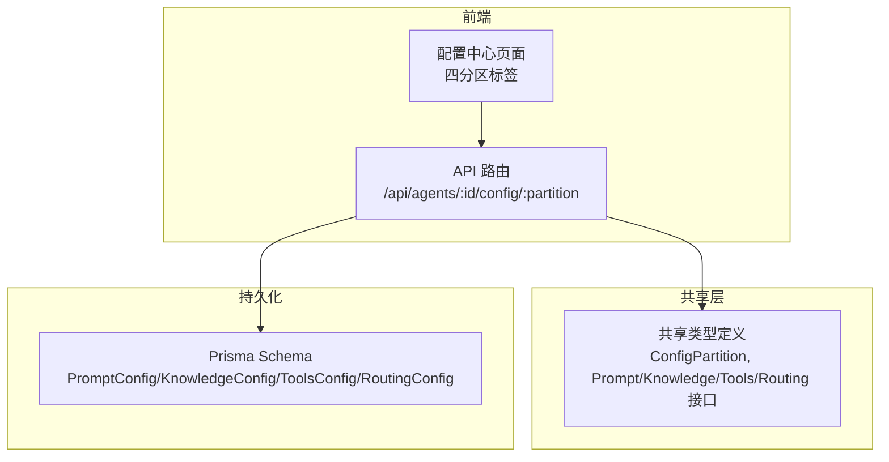
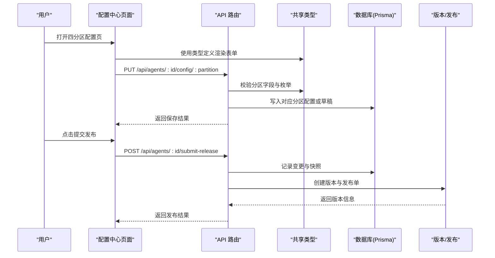
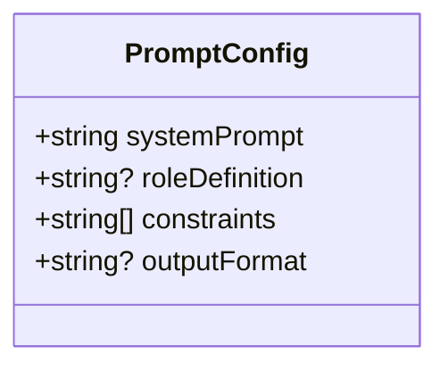
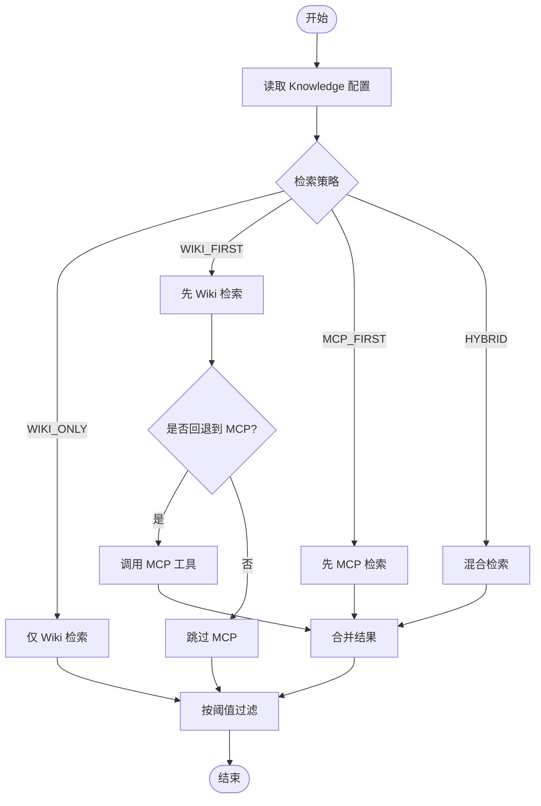
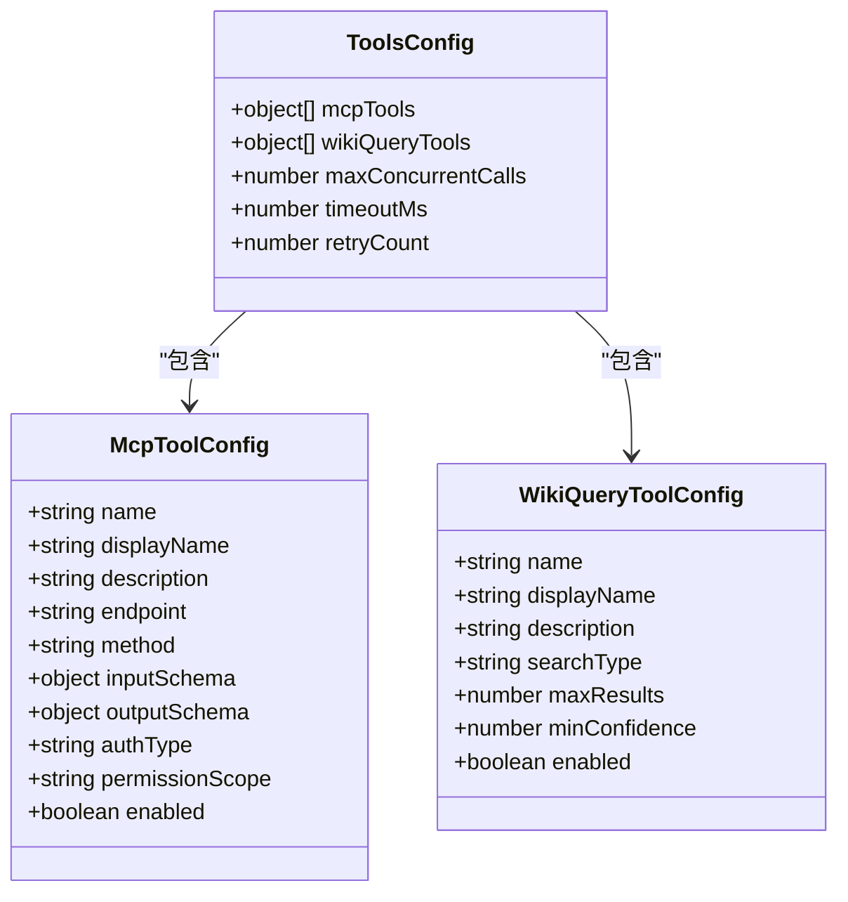
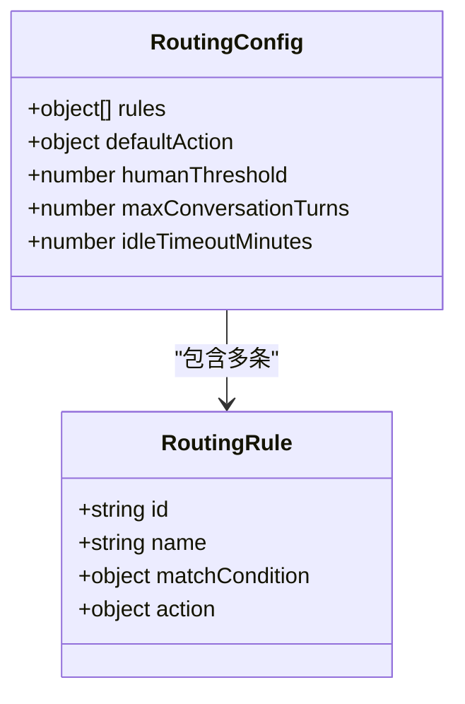
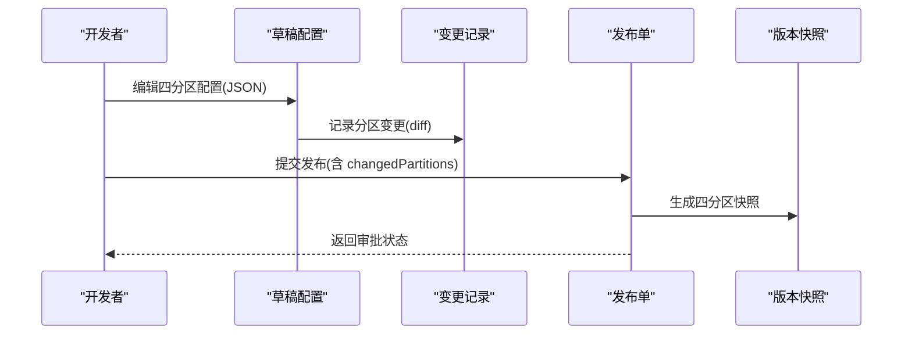
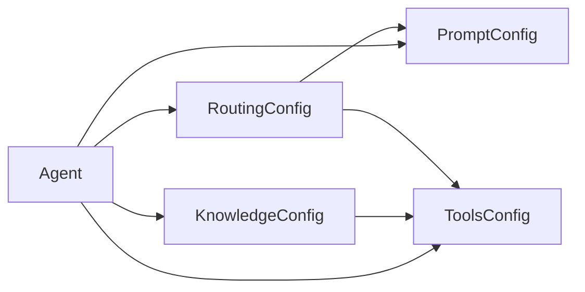

# 四分区配置系统

<cite>
**本文引用的文件**   
- [README.md](file://README.md)
- [schema.prisma](file://apps/web/prisma/schema.prisma)
- [agent.ts](file://packages/shared/src/types/agent.ts)
- [release.ts](file://packages/shared/src/types/release.ts)
- [index.ts](file://packages/shared/src/index.ts)
- [agents/route.ts](file://apps/web/app/api/agents/route.ts)
- [agents/[id]/page.tsx](file://apps/web/app/(dashboard)/agents/[id]/page.tsx)
</cite>

## 目录
1. [引言](#引言)
2. [项目结构](#项目结构)
3. [核心组件](#核心组件)
4. [架构总览](#架构总览)
5. [详细组件分析](#详细组件分析)
6. [依赖关系分析](#依赖关系分析)
7. [性能考量](#性能考量)
8. [故障排查指南](#故障排查指南)
9. [结论](#结论)
10. [附录](#附录)

## 引言
本文件围绕 Agent Up 的“四分区配置系统”进行深度解析，聚焦 Prompt、Knowledge、Tools、Routing 四个配置分区的职责边界、数据结构、配置选项与业务用途；并阐述分区间的依赖关系与数据流转机制，提供配置验证规则与错误处理策略，以及最佳实践与性能优化建议。目标是帮助开发者准确理解并正确使用这一核心架构模式。

## 项目结构
Agent Up 采用前后端同仓（Monorepo）组织方式：
- 前端 Next.js 应用位于 apps/web，包含页面路由与 API 路由。
- 共享类型定义位于 packages/shared，统一对外暴露 Agent 相关类型与常量。
- 数据库模型与迁移由 Prisma 管理，位于 apps/web/prisma/schema.prisma。

图表来源
- [agents/[id]/page.tsx:11-23](file://apps/web/app/(dashboard)/agents/[id]/page.tsx#L11-L23)
- [agents/route.ts:12-13](file://apps/web/app/api/agents/route.ts#L12-L13)
- [schema.prisma:103-173](file://apps/web/prisma/schema.prisma#L103-L173)
- [agent.ts:18-107](file://packages/shared/src/types/agent.ts#L18-L107)

章节来源
- [README.md:1-3](file://README.md#L1-L3)
- [agents/[id]/page.tsx:1-42](file://apps/web/app/(dashboard)/agents/[id]/page.tsx#L1-L42)
- [agents/route.ts:1-18](file://apps/web/app/api/agents/route.ts#L1-L18)
- [schema.prisma:1-200](file://apps/web/prisma/schema.prisma#L1-L200)
- [agent.ts:1-108](file://packages/shared/src/types/agent.ts#L1-L108)

## 核心组件
四分区配置系统以“按领域拆分配置”为核心思想，将 Agent 的行为能力解耦为四个独立但可组合的配置分区：
- Prompt：定义系统提示词、角色、约束与输出格式，决定 LLM 的对话风格与行为边界。
- Knowledge：定义知识检索策略、知识库关联、阈值与回退策略，决定信息获取路径与质量。
- Tools：定义工具集（MCP 工具、Wiki 查询等）及其并发、超时、重试等运行时参数，决定执行能力与稳定性。
- Routing：定义路由规则、默认动作与人机协作阈值，决定请求分发与升级策略。

这四个分区在数据库中各自拥有独立的配置表，并通过统一的枚举 ConfigPartition 进行标识，便于版本化、审计与发布审批。

章节来源
- [schema.prisma:103-173](file://apps/web/prisma/schema.prisma#L103-L173)
- [agent.ts:18-107](file://packages/shared/src/types/agent.ts#L18-L107)

## 架构总览
四分区配置系统在“编辑—校验—提交—发布—运行”全链路中贯穿：
- 编辑：前端通过四分区标签页分别编辑各分区配置。
- 校验：基于共享类型与可选的 JSON Schema 对输入进行强类型与规则校验。
- 提交：记录变更差异与审计日志，支持草稿环境暂存。
- 发布：生成版本快照，记录变更分区集合，进入审批流。
- 运行：运行时加载已发布的四分区配置，驱动 Prompt 编排、知识检索、工具调用与路由决策。

图表来源
- [agents/[id]/page.tsx:11-23](file://apps/web/app/(dashboard)/agents/[id]/page.tsx#L11-L23)
- [agents/route.ts:12-15](file://apps/web/app/api/agents/route.ts#L12-L15)
- [schema.prisma:175-214](file://apps/web/prisma/schema.prisma#L175-L214)
- [schema.prisma:298-354](file://apps/web/prisma/schema.prisma#L298-L354)
- [agent.ts:18-107](file://packages/shared/src/types/agent.ts#L18-L107)

## 详细组件分析

### Prompt 分区
- 职责边界：定义系统提示词、角色定义、约束列表与输出格式，控制 LLM 的对话风格、安全边界与结构化输出。
- 数据结构与字段要点：
  - systemPrompt：必填的系统提示文本。
  - roleDefinition：可选的角色描述。
  - constraints：约束项数组，用于限制行为与内容范围。
  - outputFormat：可选的输出格式说明。
- 业务用途：作为所有对话的顶层指令上下文，影响后续知识检索与工具调用的意图识别与结果呈现。
- 与其他分区的关系：
  - 与 Knowledge：systemPrompt 可指定检索策略偏好，配合 Knowledge.searchStrategy 共同决定信息获取路径。
  - 与 Tools：outputFormat 可与工具输出对齐，确保结构化结果可被下游消费。
  - 与 Routing：roleDefinition 可用于路由分类（如专家角色），辅助匹配条件。

图表来源
- [schema.prisma:103-114](file://apps/web/prisma/schema.prisma#L103-L114)
- [agent.ts:25-31](file://packages/shared/src/types/agent.ts#L25-L31)

章节来源
- [schema.prisma:103-114](file://apps/web/prisma/schema.prisma#L103-L114)
- [agent.ts:25-31](file://packages/shared/src/types/agent.ts#L25-L31)

### Knowledge 分区
- 职责边界：定义知识检索策略、知识库关联、最大结果数与置信度阈值，以及是否回退到 MCP 工具。
- 数据结构与字段要点：
  - wikiVaultId：可选的知识库关联 ID。
  - searchStrategy：检索策略枚举（优先 Wiki、仅 Wiki、优先 MCP、混合）。
  - fallbackToMcp：是否允许回退到 MCP 工具。
  - maxWikiResults：最大返回条目数。
  - confidenceThreshold：置信度阈值，过滤低质量结果。
- 业务用途：在对话过程中按需检索外部知识，提升回答准确性与时效性。
- 与其他分区的关系：
  - 与 Tools：当 fallbackToMcp 为真时，可能触发 Tools 中的 MCP/Wiki 查询工具。
  - 与 Routing：searchStrategy 可作为路由分类依据（例如高不确定性问题走人工）。
  - 与 Prompt：systemPrompt 可注入检索策略提示，引导模型选择合适策略。

图表来源
- [schema.prisma:116-145](file://apps/web/prisma/schema.prisma#L116-L145)
- [agent.ts:33-47](file://packages/shared/src/types/agent.ts#L33-L47)

章节来源
- [schema.prisma:116-145](file://apps/web/prisma/schema.prisma#L116-L145)
- [agent.ts:33-47](file://packages/shared/src/types/agent.ts#L33-L47)

### Tools 分区
- 职责边界：集中管理 MCP 工具与 Wiki 查询工具的元数据、权限、Schema 与运行时参数（并发、超时、重试）。
- 数据结构与字段要点：
  - mcpTools：MCP 工具列表，包含名称、显示名、描述、端点、方法、输入/输出 Schema、认证类型、权限范围与启用状态。
  - wikiQueryTools：Wiki 查询工具列表，包含搜索类型、最大结果、最小置信度与启用状态。
  - maxConcurrentCalls：最大并发调用数。
  - timeoutMs：单次调用超时时间。
  - retryCount：失败重试次数。
- 业务用途：为 Agent 提供可扩展的外部能力，支撑复杂任务执行与数据交互。
- 与其他分区的关系：
  - 与 Knowledge：当 Knowledge.fallbackToMcp 为真且 Wiki 不足时，触发 MCP 工具。
  - 与 Routing：工具调用结果的不确定性可触发人机协作或子流程路由。
  - 与 Prompt：outputFormat 需与工具输出 Schema 保持一致，便于结构化解析。

图表来源
- [schema.prisma:147-159](file://apps/web/prisma/schema.prisma#L147-L159)
- [agent.ts:49-81](file://packages/shared/src/types/agent.ts#L49-L81)

章节来源
- [schema.prisma:147-159](file://apps/web/prisma/schema.prisma#L147-L159)
- [agent.ts:49-81](file://packages/shared/src/types/agent.ts#L49-L81)

### Routing 分区
- 职责边界：定义路由规则、默认动作、人机协作阈值与会话生命周期参数，实现智能分流与升级。
- 数据结构与字段要点：
  - rules：路由规则列表，每条规则包含匹配条件（关键词、类别）、动作类型（转人工、转子代理、转子流程）、目标代理 ID 与优先级。
  - defaultAction：默认动作（转人工或转代理）及原因说明。
  - humanThreshold：触发人工的置信度阈值。
  - maxConversationTurns：最大对话轮次。
  - idleTimeoutMinutes：空闲超时分钟数。
- 业务用途：根据问题复杂度与置信度自动分配处理主体，保障用户体验与服务质量。
- 与其他分区的关系：
  - 与 Knowledge：低置信度或高不确定性场景可触发人工。
  - 与 Tools：工具调用失败或超时时，可触发升级策略。
  - 与 Prompt：roleDefinition 与 matchCondition 协同，实现基于角色的路由。

图表来源
- [schema.prisma:161-173](file://apps/web/prisma/schema.prisma#L161-L173)
- [agent.ts:83-107](file://packages/shared/src/types/agent.ts#L83-L107)

章节来源
- [schema.prisma:161-173](file://apps/web/prisma/schema.prisma#L161-L173)
- [agent.ts:83-107](file://packages/shared/src/types/agent.ts#L83-L107)

### 配置管理与版本发布
- 草稿环境：AgentDraftConfig 支持四分区配置的 JSON 暂存与脏标记，便于在线编辑与撤销。
- 变更记录：ConfigChange 记录每个分区的 before/after/diff，支持审计与回溯。
- 版本快照：AgentVersion 对四分区配置进行快照存储，并与 Release 关联，形成发布基线。
- 发布审批：Release 记录变更分区集合、状态与审批信息，支持多阶段审核。

图表来源
- [schema.prisma:175-214](file://apps/web/prisma/schema.prisma#L175-L214)
- [schema.prisma:298-354](file://apps/web/prisma/schema.prisma#L298-L354)
- [release.ts:1-35](file://packages/shared/src/types/release.ts#L1-L35)

章节来源
- [schema.prisma:175-214](file://apps/web/prisma/schema.prisma#L175-L214)
- [schema.prisma:298-354](file://apps/web/prisma/schema.prisma#L298-L354)
- [release.ts:1-35](file://packages/shared/src/types/release.ts#L1-L35)

## 依赖关系分析
- 类型依赖：前端与后端共享 ConfigPartition 与各分区接口，保证前后端契约一致。
- 数据依赖：
  - Knowledge 与 Tools 存在运行时耦合（回退策略）。
  - Routing 与 Tools/Prompt 存在逻辑耦合（置信度与角色）。
- 持久化依赖：四分区配置均与 Agent 一对一关联，支持版本化与审计。
- API 依赖：/api/agents/:id/config/:partition 提供按分区读写能力，/submit-release 与 /rollback/:versionId 支持发布与回滚。

图表来源
- [schema.prisma:61-91](file://apps/web/prisma/schema.prisma#L61-L91)
- [schema.prisma:103-173](file://apps/web/prisma/schema.prisma#L103-L173)
- [agents/route.ts:12-15](file://apps/web/app/api/agents/route.ts#L12-L15)

章节来源
- [schema.prisma:61-91](file://apps/web/prisma/schema.prisma#L61-L91)
- [schema.prisma:103-173](file://apps/web/prisma/schema.prisma#L103-L173)
- [agents/route.ts:12-15](file://apps/web/app/api/agents/route.ts#L12-L15)

## 性能考量
- 并发与限流：通过 ToolsConfig.maxConcurrentCalls 控制外部工具并发，避免资源争用与雪崩。
- 超时与重试：合理设置 timeoutMs 与 retryCount，平衡可靠性与延迟。
- 检索优化：调整 Knowledge.maxWikiResults 与 confidenceThreshold，减少无效 IO 与噪声。
- 路由效率：精简 Routing.rules 数量与匹配条件，降低匹配开销；必要时引入缓存或索引。
- 版本快照体积：AgentVersion 的四分区快照应控制大小，避免频繁大对象写入。

[本节为通用指导，不直接分析具体文件]

## 故障排查指南
- 配置未生效：检查是否完成发布审批且版本已激活；确认当前运行环境加载的是已发布版本而非草稿。
- 检索结果为空：核查 Knowledge.searchStrategy 与 wikiVaultId 是否正确；适当提高 maxWikiResults 或降低 confidenceThreshold。
- 工具调用失败：检查 ToolsConfig.mcpTools 的 endpoint、method、authType 与权限范围；关注 timeoutMs 与 retryCount 设置。
- 路由异常：确认 Routing.rules 的优先级与匹配条件；检查 humanThreshold 是否过高导致过多转人工。
- 审计与回溯：通过 ConfigChange 查看分区变更 diff；通过 AgentVersion 对比历史快照定位回归。

章节来源
- [schema.prisma:192-214](file://apps/web/prisma/schema.prisma#L192-L214)
- [schema.prisma:332-354](file://apps/web/prisma/schema.prisma#L332-L354)

## 结论
四分区配置系统通过清晰的职责边界与统一的数据契约，实现了 Agent 行为的模块化与可演进。借助草稿、审计、版本与发布审批机制，平台在保证灵活性的同时提升了可控性与可追溯性。遵循本文的最佳实践与性能建议，开发者可以高效构建稳定可靠的 Agent 能力。

[本节为总结性内容，不直接分析具体文件]

## 附录

### 配置示例与使用场景（概念性）
- 客服助手：Prompt 设定礼貌与合规约束；Knowledge 采用 WIKI_FIRST 并开启回退；Tools 接入订单查询 MCP；Routing 对高不确定问题转人工。
- 技术问答：Prompt 强调严谨与引用来源；Knowledge 采用 HYBRID；Tools 接入代码仓库与文档检索；Routing 对复杂问题转专家代理。
- 销售导购：Prompt 强调转化话术；Knowledge 采用 WIKI_ONLY；Tools 接入库存与促销；Routing 对价格敏感问题转人工复核。

[本节为概念性示例，不直接分析具体文件]

### 配置验证规则与错误处理策略（建议）
- 强类型校验：基于 shared 类型进行字段类型与枚举值校验。
- 业务规则校验：如 confidenceThreshold 在 [0,1] 区间、maxConcurrentCalls 为正整数、timeoutMs 大于零等。
- 差异化校验：不同分区具备专属规则（如 Routing.rules 唯一性、优先级无冲突）。
- 错误处理：返回明确错误码与消息；记录 ConfigChange 与错误上下文；对发布失败提供回滚建议。

[本节为通用建议，不直接分析具体文件]

### 最佳实践
- 单一职责：每个分区只维护自身领域配置，避免跨区耦合。
- 渐进式变更：小步快跑，逐分区迭代，配合审计与灰度发布。
- 文档化：为每个分区字段补充注释与示例，降低上手成本。
- 监控与度量：对工具调用成功率、检索命中率、路由转化率建立指标看板。

[本节为通用建议，不直接分析具体文件]