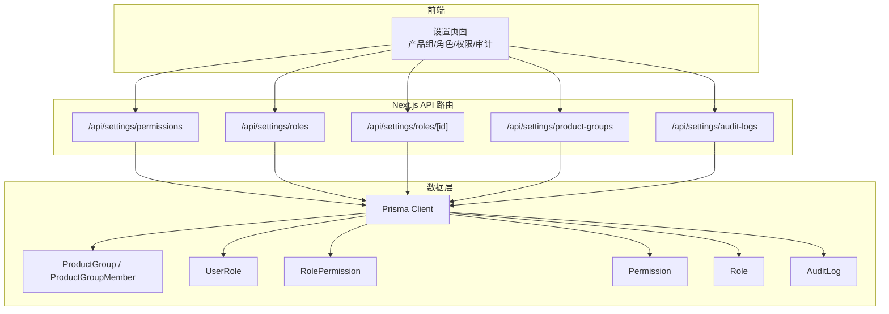
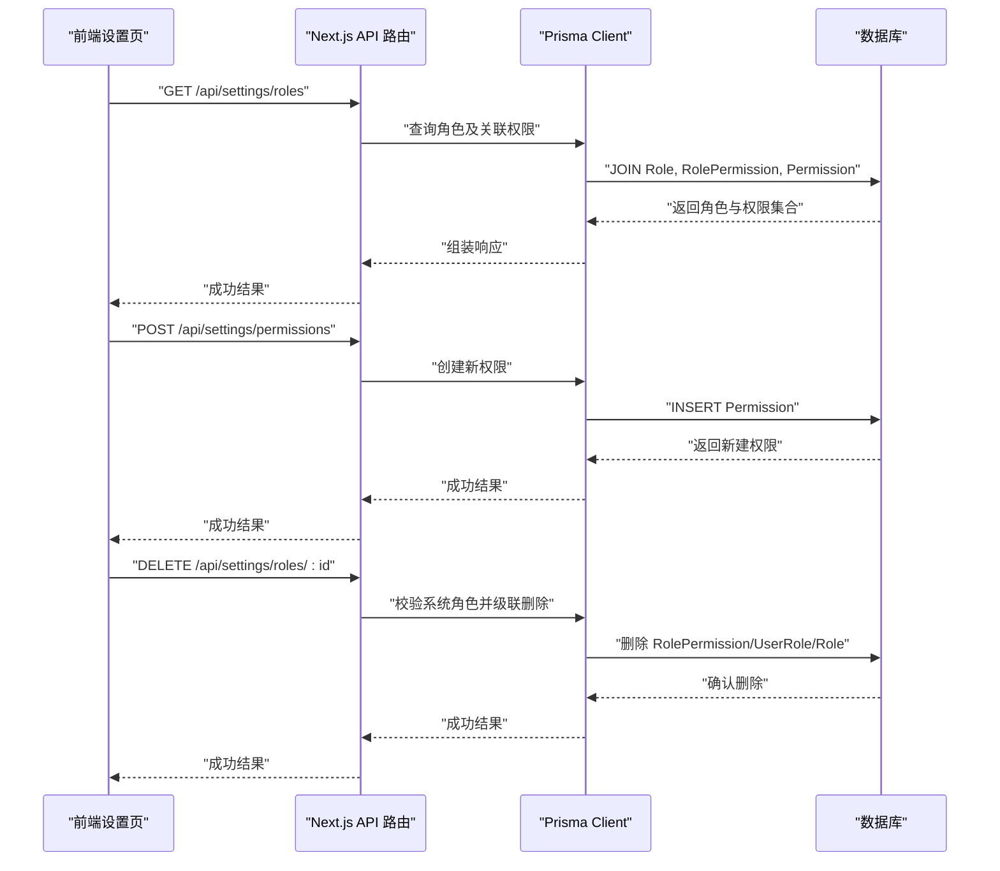
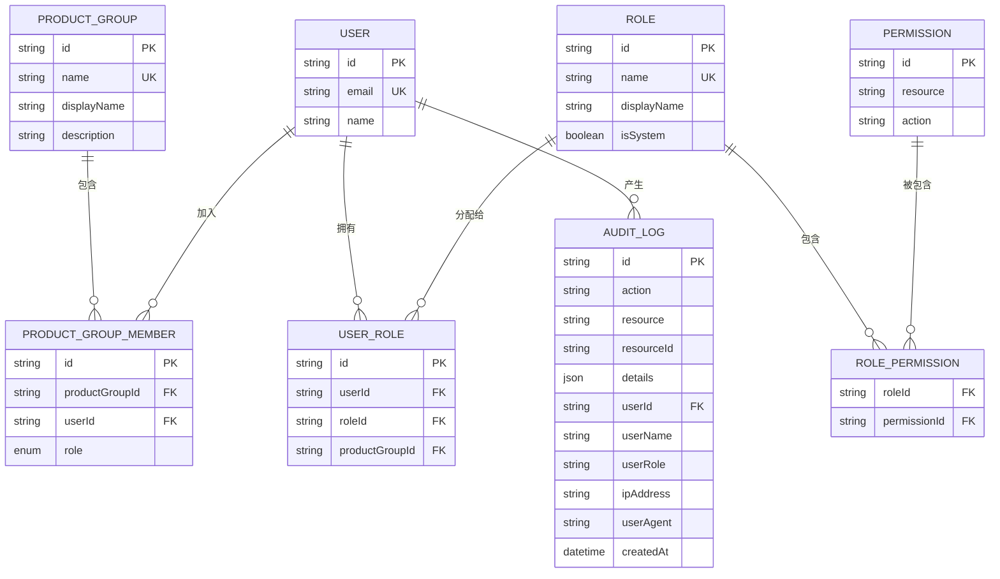
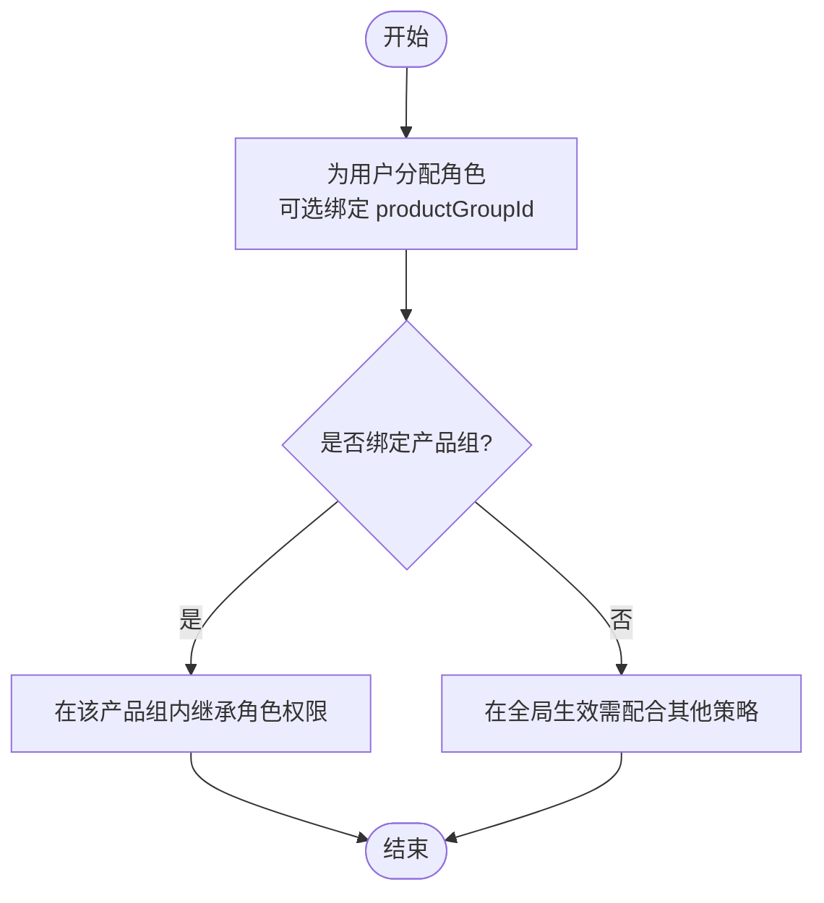
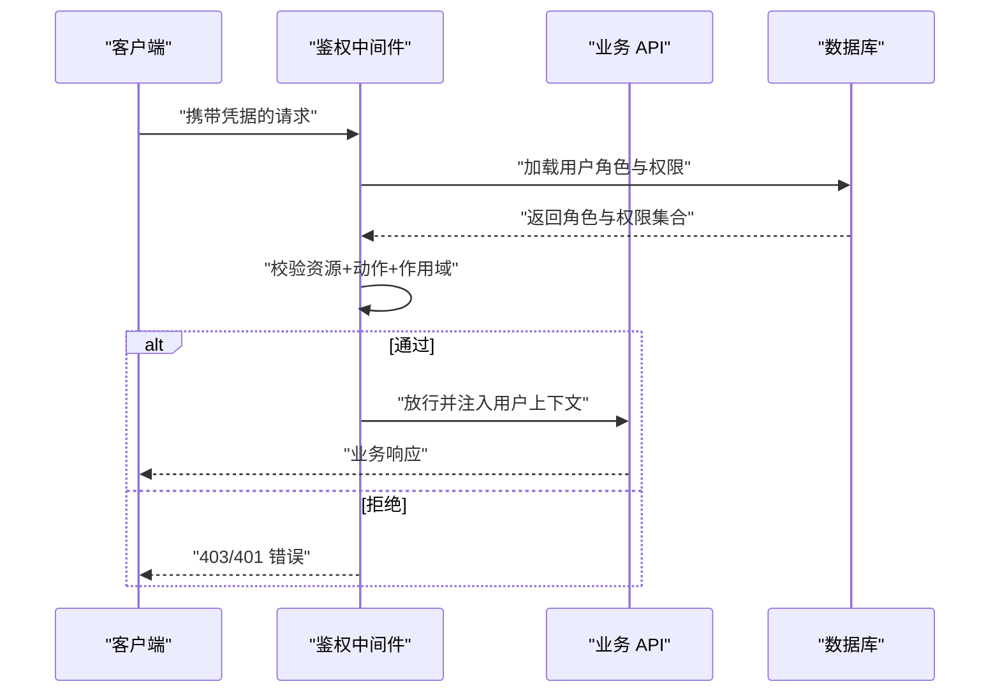
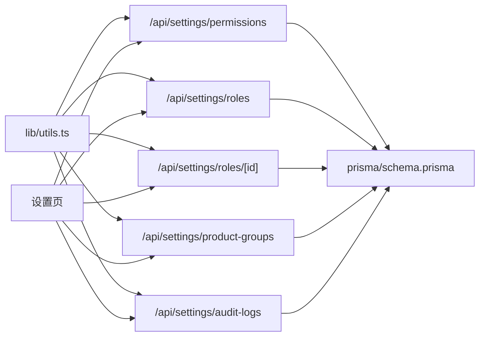

# 权限管理系统

<cite>
**本文引用的文件**
- [apps/web/app/api/settings/permissions/route.ts](file://apps/web/app/api/settings/permissions/route.ts)
- [apps/web/app/api/settings/roles/route.ts](file://apps/web/app/api/settings/roles/route.ts)
- [apps/web/app/api/settings/roles/[id]/route.ts](file://apps/web/app/api/settings/roles/[id]/route.ts)
- [apps/web/app/api/settings/product-groups/route.ts](file://apps/web/app/api/settings/product-groups/route.ts)
- [apps/web/app/api/settings/audit-logs/route.ts](file://apps/web/app/api/settings/audit-logs/route.ts)
- [packages/db/prisma/schema.prisma](file://packages/db/prisma/schema.prisma)
- [packages/shared/src/types/permission.ts](file://packages/shared/src/types/permission.ts)
- [apps/web/lib/utils.ts](file://apps/web/lib/utils.ts)
- [apps/web/app/(dashboard)/settings/page.tsx](file://apps/web/app/(dashboard)/settings/page.tsx)
</cite>

## 目录
1. [简介](#简介)
2. [项目结构](#项目结构)
3. [核心组件](#核心组件)
4. [架构总览](#架构总览)
5. [详细组件分析](#详细组件分析)
6. [依赖关系分析](#依赖关系分析)
7. [性能考虑](#性能考虑)
8. [故障排查指南](#故障排查指南)
9. [结论](#结论)
10. [附录](#附录)

## 简介
本文件系统性解析 Agent Up 的权限管理系统，围绕基于角色的访问控制（RBAC）、产品组与权限继承、细粒度资源/操作级权限、权限验证与中间件机制、最佳实践与安全建议、以及审计日志与合规性要求展开。目标是帮助开发者正确实现与管理应用中的权限控制，确保系统具备可配置、可扩展、可审计的安全能力。

## 项目结构
权限相关的数据模型集中在数据库 Schema 中，API 路由提供角色、权限、产品组与审计日志的管理能力；前端设置页提供可视化配置入口；共享类型定义统一了角色、动作与作用域枚举。

图表来源
- [apps/web/app/api/settings/permissions/route.ts:1-24](file://apps/web/app/api/settings/permissions/route.ts#L1-L24)
- [apps/web/app/api/settings/roles/route.ts:1-32](file://apps/web/app/api/settings/roles/route.ts#L1-L32)
- [apps/web/app/api/settings/roles/[id]/route.ts:1-37](file://apps/web/app/api/settings/roles/[id]/route.ts#L1-L37)
- [apps/web/app/api/settings/product-groups/route.ts:1-26](file://apps/web/app/api/settings/product-groups/route.ts#L1-L26)
- [apps/web/app/api/settings/audit-logs/route.ts:1-28](file://apps/web/app/api/settings/audit-logs/route.ts#L1-L28)
- [packages/db/prisma/schema.prisma:563-625](file://packages/db/prisma/schema.prisma#L563-L625)

章节来源
- [apps/web/app/api/settings/permissions/route.ts:1-24](file://apps/web/app/api/settings/permissions/route.ts#L1-L24)
- [apps/web/app/api/settings/roles/route.ts:1-32](file://apps/web/app/api/settings/roles/route.ts#L1-L32)
- [apps/web/app/api/settings/roles/[id]/route.ts:1-37](file://apps/web/app/api/settings/roles/[id]/route.ts#L1-L37)
- [apps/web/app/api/settings/product-groups/route.ts:1-26](file://apps/web/app/api/settings/product-groups/route.ts#L1-L26)
- [apps/web/app/api/settings/audit-logs/route.ts:1-28](file://apps/web/app/api/settings/audit-logs/route.ts#L1-L28)
- [packages/db/prisma/schema.prisma:563-625](file://packages/db/prisma/schema.prisma#L563-L625)

## 核心组件
- 数据模型与关系
  - 产品组与成员：用于组织隔离与范围限定。
  - 用户-角色-权限：标准 RBAC 三元关系，支持按产品组维度分配。
  - 审计日志：记录关键操作的主体、客体与上下文。
- 类型与枚举
  - 角色类型、操作动作、作用域范围等集中定义，保证前后端一致。
- API 管理接口
  - 权限、角色、产品组、审计日志的增删改查与分页查询。
- 前端配置界面
  - 设置页聚合展示产品组、角色及其关联权限，便于管理员维护。

章节来源
- [packages/db/prisma/schema.prisma:14-36](file://packages/db/prisma/schema.prisma#L14-L36)
- [packages/db/prisma/schema.prisma:563-625](file://packages/db/prisma/schema.prisma#L563-L625)
- [packages/shared/src/types/permission.ts:1-36](file://packages/shared/src/types/permission.ts#L1-L36)
- [apps/web/app/api/settings/permissions/route.ts:1-24](file://apps/web/app/api/settings/permissions/route.ts#L1-L24)
- [apps/web/app/api/settings/roles/route.ts:1-32](file://apps/web/app/api/settings/roles/route.ts#L1-L32)
- [apps/web/app/api/settings/roles/[id]/route.ts:1-37](file://apps/web/app/api/settings/roles/[id]/route.ts#L1-L37)
- [apps/web/app/api/settings/product-groups/route.ts:1-26](file://apps/web/app/api/settings/product-groups/route.ts#L1-L26)
- [apps/web/app/api/settings/audit-logs/route.ts:1-28](file://apps/web/app/api/settings/audit-logs/route.ts#L1-L28)
- [apps/web/app/(dashboard)/settings/page.tsx:39-131](file://apps/web/app/(dashboard)/settings/page.tsx#L39-L131)

## 架构总览
下图展示了从前端到数据库的权限相关调用路径与数据实体关系。

图表来源
- [apps/web/app/api/settings/roles/route.ts:1-32](file://apps/web/app/api/settings/roles/route.ts#L1-L32)
- [apps/web/app/api/settings/permissions/route.ts:1-24](file://apps/web/app/api/settings/permissions/route.ts#L1-L24)
- [apps/web/app/api/settings/roles/[id]/route.ts:1-37](file://apps/web/app/api/settings/roles/[id]/route.ts#L1-L37)
- [packages/db/prisma/schema.prisma:563-625](file://packages/db/prisma/schema.prisma#L563-L625)

## 详细组件分析

### 数据模型与关系（RBAC + 产品组）
- 产品组与成员
  - 产品组作为资源隔离边界，成员通过 GroupRole 区分组长与普通成员。
- 用户-角色-权限
  - 用户通过 UserRole 与 Role 建立多对多关系，并可绑定 productGroupId 实现“按组授权”。
  - Role 与 Permission 通过 RolePermission 建立多对多关系，形成标准 RBAC。
- 审计日志
  - AuditLog 记录 action/resource/resourceId/user 等关键信息，并提供常用索引以支撑高效检索。

图表来源
- [packages/db/prisma/schema.prisma:14-36](file://packages/db/prisma/schema.prisma#L14-L36)
- [packages/db/prisma/schema.prisma:563-625](file://packages/db/prisma/schema.prisma#L563-L625)

章节来源
- [packages/db/prisma/schema.prisma:14-36](file://packages/db/prisma/schema.prisma#L14-L36)
- [packages/db/prisma/schema.prisma:563-625](file://packages/db/prisma/schema.prisma#L563-L625)

### 产品组与权限继承机制
- 概念
  - 产品组是资源与数据的隔离单元，Agent、知识库等资源均归属某个产品组。
- 继承策略
  - 通过 UserRole.productGroupId 将角色限定在特定产品组内，从而实现“组内权限继承”：同一组内的成员共享该角色赋予的权限。
  - 若未指定 productGroupId，则角色为全局有效（需结合业务语义与后续鉴权逻辑共同约束）。
- 成员角色
  - 产品组成员具有 GroupRole（组长/成员），可用于组内协作与数据可见性控制。

章节来源
- [packages/db/prisma/schema.prisma:594-605](file://packages/db/prisma/schema.prisma#L594-L605)
- [packages/db/prisma/schema.prisma:14-36](file://packages/db/prisma/schema.prisma#L14-L36)

### 细粒度权限控制（资源级与操作级）
- 资源与动作
  - 使用 Permission.resource 与 Permission.action 组合表示最小权限单元。
  - 通过 RolePermission 将一组资源-动作授予角色，再分配给用户。
- 作用域
  - 通过 PermissionScope 枚举表达权限的作用范围（仅本组/跨组/全局），可在业务层进行二次校验。
- 典型用法
  - 例如：资源=“发布”，动作=“approve”，作用域=“own_group”，表示仅允许在本产品组内执行审批。

章节来源
- [packages/db/prisma/schema.prisma:574-592](file://packages/db/prisma/schema.prisma#L574-L592)
- [packages/shared/src/types/permission.ts:12-26](file://packages/shared/src/types/permission.ts#L12-L26)

### 权限验证与中间件机制
- 现状
  - 当前代码库尚未发现统一的权限中间件或装饰器实现；鉴权逻辑应在各 API 路由或服务层按需实现。
- 推荐实现方式
  - 在 Next.js API 路由入口处引入鉴权中间件，完成以下流程：
    - 身份认证：校验会话/令牌，提取用户标识与上下文。
    - 角色加载：根据用户 ID 与可选 productGroupId 加载其角色集。
    - 权限计算：合并角色对应的 Permission 集合，必要时叠加作用域限制。
    - 资源/动作校验：对比请求目标资源与期望动作，决定是否放行。
    - 审计记录：对敏感操作写入 AuditLog。
- 参考流程（示意）

[本节为通用设计建议，不直接分析具体源码文件]

### 审计日志与合规性
- 字段与索引
  - AuditLog 包含 action/resource/resourceId/user/userName/userRole/ipAddress/userAgent/createdAt 等字段，并提供多维索引以支撑审计检索。
- 查询能力
  - 审计日志 API 支持按 action/resource/userId 过滤与分页，便于合规审查与问题回溯。
- 合规建议
  - 对高敏感操作强制落盘审计；保留足够上下文；定期归档与脱敏；确保不可篡改存储与访问控制。

章节来源
- [packages/db/prisma/schema.prisma:607-625](file://packages/db/prisma/schema.prisma#L607-L625)
- [apps/web/app/api/settings/audit-logs/route.ts:1-28](file://apps/web/app/api/settings/audit-logs/route.ts#L1-L28)

### 前端配置界面
- 设置页提供产品组、角色与权限的可视化维护能力，包括列表展示、创建与基础校验。
- 角色详情会附带其已绑定的权限清单，便于管理员直观理解权限分布。

章节来源
- [apps/web/app/(dashboard)/settings/page.tsx:39-131](file://apps/web/app/(dashboard)/settings/page.tsx#L39-L131)

## 依赖关系分析
- 模块耦合
  - API 路由依赖 Prisma Client 与统一工具函数（success/error/parseBody/pagination）。
  - 前端设置页依赖多个 API 路由进行数据获取与提交。
- 外部依赖
  - 数据库驱动与 Prisma 客户端封装位于 packages/db。
- 潜在风险
  - 当前未见统一的鉴权中间件，存在重复实现与遗漏校验的风险；建议在公共层收敛。

图表来源
- [apps/web/lib/utils.ts:1-43](file://apps/web/lib/utils.ts#L1-L43)
- [apps/web/app/api/settings/permissions/route.ts:1-24](file://apps/web/app/api/settings/permissions/route.ts#L1-L24)
- [apps/web/app/api/settings/roles/route.ts:1-32](file://apps/web/app/api/settings/roles/route.ts#L1-L32)
- [apps/web/app/api/settings/roles/[id]/route.ts:1-37](file://apps/web/app/api/settings/roles/[id]/route.ts#L1-L37)
- [apps/web/app/api/settings/product-groups/route.ts:1-26](file://apps/web/app/api/settings/product-groups/route.ts#L1-L26)
- [apps/web/app/api/settings/audit-logs/route.ts:1-28](file://apps/web/app/api/settings/audit-logs/route.ts#L1-L28)
- [packages/db/prisma/schema.prisma:563-625](file://packages/db/prisma/schema.prisma#L563-L625)
- [apps/web/app/(dashboard)/settings/page.tsx:39-131](file://apps/web/app/(dashboard)/settings/page.tsx#L39-L131)

章节来源
- [apps/web/lib/utils.ts:1-43](file://apps/web/lib/utils.ts#L1-L43)
- [apps/web/app/api/settings/permissions/route.ts:1-24](file://apps/web/app/api/settings/permissions/route.ts#L1-L24)
- [apps/web/app/api/settings/roles/route.ts:1-32](file://apps/web/app/api/settings/roles/route.ts#L1-L32)
- [apps/web/app/api/settings/roles/[id]/route.ts:1-37](file://apps/web/app/api/settings/roles/[id]/route.ts#L1-L37)
- [apps/web/app/api/settings/product-groups/route.ts:1-26](file://apps/web/app/api/settings/product-groups/route.ts#L1-L26)
- [apps/web/app/api/settings/audit-logs/route.ts:1-28](file://apps/web/app/api/settings/audit-logs/route.ts#L1-L28)
- [packages/db/prisma/schema.prisma:563-625](file://packages/db/prisma/schema.prisma#L563-L625)
- [apps/web/app/(dashboard)/settings/page.tsx:39-131](file://apps/web/app/(dashboard)/settings/page.tsx#L39-L131)

## 性能考虑
- 查询优化
  - 使用 Prisma include/_count 减少 N+1 查询；对高频过滤字段建立索引（如 AuditLog 的多维索引已覆盖常见场景）。
- 分页与限流
  - 审计日志等大数据量接口采用分页参数解析与上限控制，避免大结果集拖慢响应。
- 缓存策略
  - 角色与权限变更频率较低，可在网关或应用层对只读接口做短期缓存，降低数据库压力。
- 事务与一致性
  - 删除角色时级联清理关联表，确保数据一致性；复杂批量操作建议使用事务包裹。

[本节为通用指导，不直接分析具体源码文件]

## 故障排查指南
- 常见问题定位
  - 角色不存在：删除前需校验角色是否存在，避免 404。
  - 系统角色保护：isSystem 为 true 的角色禁止删除，防止破坏系统基线。
  - 必填字段校验：创建角色/权限/产品组时需校验必要字段，避免脏数据入库。
- 错误处理
  - 统一使用 success/error 包装响应体，便于前端识别与提示。
- 调试建议
  - 开启 Prisma 查询日志（开发环境默认启用），结合审计日志快速定位问题。

章节来源
- [apps/web/app/api/settings/roles/[id]/route.ts:23-36](file://apps/web/app/api/settings/roles/[id]/route.ts#L23-L36)
- [apps/web/app/api/settings/roles/route.ts:16-32](file://apps/web/app/api/settings/roles/route.ts#L16-L32)
- [apps/web/app/api/settings/permissions/route.ts:13-24](file://apps/web/app/api/settings/permissions/route.ts#L13-L24)
- [apps/web/app/api/settings/product-groups/route.ts:15-26](file://apps/web/app/api/settings/product-groups/route.ts#L15-L26)
- [apps/web/lib/utils.ts:1-43](file://apps/web/lib/utils.ts#L1-L43)

## 结论
本项目已具备完善的 RBAC 数据模型与产品组隔离能力，并通过 API 提供了角色、权限、产品组与审计日志的基础管理能力。为实现企业级安全与合规，建议尽快落地统一的鉴权中间件、完善作用域校验与审计落盘策略，并结合缓存与索引优化提升性能。

[本节为总结性内容，不直接分析具体源码文件]

## 附录

### 权限配置最佳实践
- 最小权限原则：仅授予完成任务所需的最小资源-动作组合。
- 角色分层：平台管理员、产品负责人、普通成员、审计员等角色职责清晰分离。
- 作用域明确：优先使用“仅本组”作用域，跨组与全局权限严格管控。
- 变更留痕：所有角色与权限变更必须写入审计日志，并保留操作者、时间戳与上下文。
- 定期复核：周期性审查角色与权限分配，及时回收不再需要的权限。

[本节为通用指导，不直接分析具体源码文件]

### 安全建议
- 输入校验与白名单：对所有入参进行严格校验，资源与动作使用白名单枚举。
- 防越权：服务端必须校验资源归属与用户所属产品组，禁止仅依赖前端控制。
- 密钥与会话：妥善保管会话令牌与数据库凭证，生产环境关闭详细日志输出。
- 审计不可篡改：审计日志应写入独立存储并限制写权限，满足合规审计需求。

[本节为通用指导，不直接分析具体源码文件]