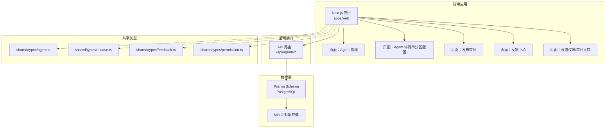
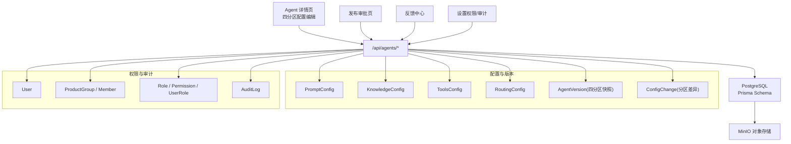
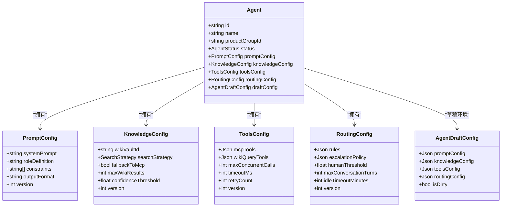
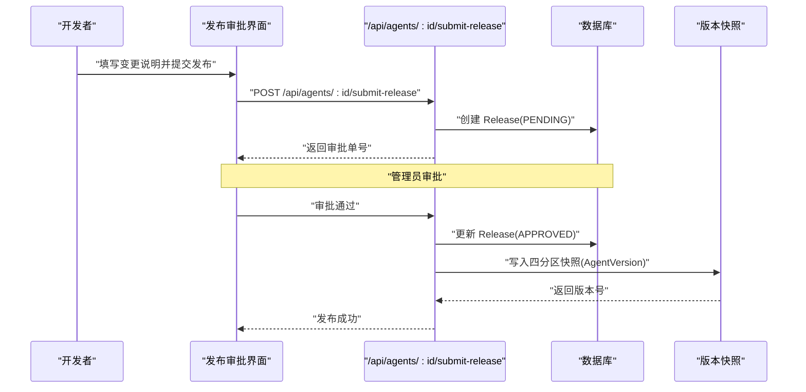
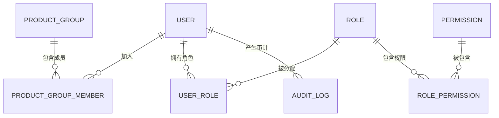
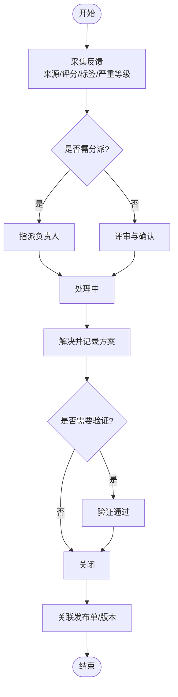
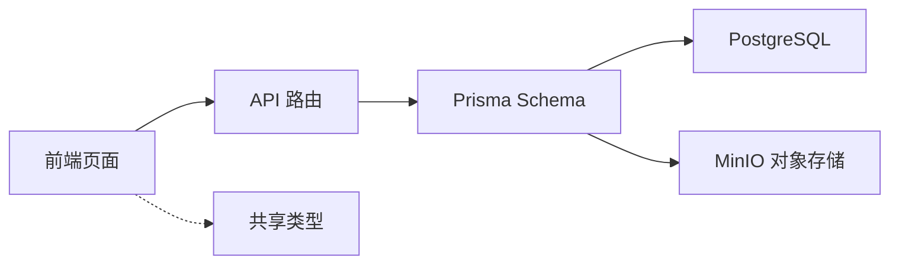

# 核心概念

<cite>
**本文引用的文件**   
- [README.md](file://README.md)
- [schema.prisma](file://apps/web/prisma/schema.prisma)
- [agents API 路由](file://apps/web/app/api/agents/route.ts)
- [Agent 管理页面](file://apps/web/app/(dashboard)/agents/page.tsx)
- [Agent 详情与四分区配置页](file://apps/web/app/(dashboard)/agents/[id]/page.tsx)
- [发布审批页面](file://apps/web/app/(dashboard)/releases/page.tsx)
- [反馈中心页面](file://apps/web/app/(dashboard)/feedback/page.tsx)
- [设置（权限与审计入口）](file://apps/web/app/(dashboard)/settings/page.tsx)
- [共享类型：Agent 与四分区配置](file://packages/shared/src/types/agent.ts)
- [共享类型：发布与版本](file://packages/shared/src/types/release.ts)
- [共享类型：反馈](file://packages/shared/src/types/feedback.ts)
- [共享类型：权限与角色](file://packages/shared/src/types/permission.ts)
- [Turbo 工作区配置](file://turbo.json)
- [Docker Compose 环境](file://docker-compose.yml)
</cite>

## 目录
1. [引言](#引言)
2. [项目结构](#项目结构)
3. [核心组件](#核心组件)
4. [架构总览](#架构总览)
5. [详细组件分析](#详细组件分析)
6. [依赖分析](#依赖分析)
7. [性能考虑](#性能考虑)
8. [故障排查指南](#故障排查指南)
9. [结论](#结论)
10. [附录](#附录)

## 引言
本文件聚焦 Agent Up 的核心概念与设计模式，围绕以下主题展开：
- AI Agent 四分区配置系统（Prompt、Knowledge、Tools、Routing）的设计理念与实现原理
- 版本控制机制：发布审批流程、版本快照管理与回滚策略
- 权限管理系统：用户角色、产品组与访问控制
- 反馈驱动的持续改进循环
- 结合代码示例路径展示上述概念在工程中的落地方式
- 提供关系图与最佳实践建议，兼顾初学者理解与高级用户的技术深度

## 项目结构
仓库采用 Turborepo 多包结构，前端 Next.js 应用位于 apps/web，数据库模型定义于 Prisma schema，共享类型集中于 packages/shared。关键目录与职责如下：
- apps/web：Next.js 应用，包含页面、API 路由与 UI 骨架
- packages/shared：跨包共享的类型定义（Agent、Release、Feedback、权限等）
- docker-compose.yml：本地开发所需的 Postgres 与 MinIO 服务
- turbo.json：构建与任务编排配置

图表来源
- [schema.prisma:1-626](file://apps/web/prisma/schema.prisma#L1-L626)
- [agents API 路由:1-19](file://apps/web/app/api/agents/route.ts#L1-L19)
- [Agent 管理页面](file://apps/web/app/(dashboard)/agents/page.tsx#L1-L28)
- [Agent 详情与四分区配置页](file://apps/web/app/(dashboard)/agents/[id]/page.tsx#L1-L42)
- [发布审批页面](file://apps/web/app/(dashboard)/releases/page.tsx#L1-L25)
- [反馈中心页面](file://apps/web/app/(dashboard)/feedback/page.tsx#L1-L30)
- [设置（权限与审计入口）](file://apps/web/app/(dashboard)/settings/page.tsx#L1-L25)
- [共享类型：Agent 与四分区配置:1-108](file://packages/shared/src/types/agent.ts#L1-L108)
- [共享类型：发布与版本:1-36](file://packages/shared/src/types/release.ts#L1-L36)
- [共享类型：反馈:1-62](file://packages/shared/src/types/feedback.ts#L1-L62)
- [共享类型：权限与角色:1-37](file://packages/shared/src/types/permission.ts#L1-L37)
- [Docker Compose 环境:1-38](file://docker-compose.yml#L1-L38)

章节来源
- [README.md:1-3](file://README.md#L1-L3)
- [turbo.json:1-31](file://turbo.json#L1-L31)
- [docker-compose.yml:1-38](file://docker-compose.yml#L1-L38)

## 核心组件
- 四分区配置系统
  - Prompt：系统提示词、角色定义、约束与输出格式
  - Knowledge：知识库检索策略、MCP 回退、置信度阈值等
  - Tools：MCP 工具与 Wiki 查询工具的配置、并发与超时重试
  - Routing：路由规则、升级策略、人机阈值与会话控制
- 版本控制与发布审批
  - Release：变更说明、受影响分区、审批状态与评论
  - AgentVersion：版本语义化编号、四分区快照、发布元信息
  - ConfigChange：分区级变更差异记录
- 权限与审计
  - 用户、产品组、成员角色（LEAD/MEMBER）
  - 平台级角色与权限（Role/Permission/UserRole/AuditLog）
- 反馈驱动改进
  - Feedback：来源、评分、标签、严重等级、处理状态与目标分区映射

章节来源
- [schema.prisma:61-186](file://apps/web/prisma/schema.prisma#L61-L186)
- [schema.prisma:192-214](file://apps/web/prisma/schema.prisma#L192-L214)
- [schema.prisma:220-292](file://apps/web/prisma/schema.prisma#L220-L292)
- [schema.prisma:298-354](file://apps/web/prisma/schema.prisma#L298-L354)
- [schema.prisma:563-625](file://apps/web/prisma/schema.prisma#L563-L625)
- [共享类型：Agent 与四分区配置:1-108](file://packages/shared/src/types/agent.ts#L1-L108)
- [共享类型：发布与版本:1-36](file://packages/shared/src/types/release.ts#L1-L36)
- [共享类型：反馈:1-62](file://packages/shared/src/types/feedback.ts#L1-L62)
- [共享类型：权限与角色:1-37](file://packages/shared/src/types/permission.ts#L1-L37)

## 架构总览
下图展示了从前端到后端再到数据层的整体交互，以及四分区配置、版本快照与权限审计的关联关系。

图表来源
- [schema.prisma:61-186](file://apps/web/prisma/schema.prisma#L61-L186)
- [schema.prisma:192-214](file://apps/web/prisma/schema.prisma#L192-L214)
- [schema.prisma:298-354](file://apps/web/prisma/schema.prisma#L298-L354)
- [schema.prisma:563-625](file://apps/web/prisma/schema.prisma#L563-L625)
- [agents API 路由:1-19](file://apps/web/app/api/agents/route.ts#L1-L19)
- [Docker Compose 环境:1-38](file://docker-compose.yml#L1-L38)

## 详细组件分析

### 四分区配置系统（Prompt、Knowledge、Tools、Routing）
设计理念
- 将 Agent 行为解耦为四个正交分区，便于独立演进、测试与回滚
- 通过 JSON 字段承载复杂配置，同时以枚举与索引保障可查询性与一致性
- 使用 Draft 环境隔离未发布的修改，避免影响线上运行态

实现要点
- PromptConfig：系统提示词、角色定义、约束列表、输出格式与版本追踪
- KnowledgeConfig：Wiki 优先或混合检索策略、MCP 回退开关、结果上限与置信度阈值
- ToolsConfig：MCP 工具清单与 Wiki 查询工具清单、并发/超时/重试参数
- RoutingConfig：路由规则、升级策略、人机阈值、最大对话轮次与空闲超时
- AgentDraftConfig：暂存各分区 JSON 配置，标记脏状态与最后保存人/时间

图表来源
- [schema.prisma:61-186](file://apps/web/prisma/schema.prisma#L61-L186)
- [共享类型：Agent 与四分区配置:1-108](file://packages/shared/src/types/agent.ts#L1-L108)

章节来源
- [schema.prisma:103-186](file://apps/web/prisma/schema.prisma#L103-L186)
- [共享类型：Agent 与四分区配置:1-108](file://packages/shared/src/types/agent.ts#L1-L108)
- [Agent 详情与四分区配置页](file://apps/web/app/(dashboard)/agents/[id]/page.tsx#L1-L42)

### 版本控制机制（发布审批、版本快照、回滚）
设计要点
- 发布审批：提交变更说明与受影响分区，进入待审批；审批通过后生成版本快照
- 版本快照：对四分区配置进行全量快照，附带语义化版本号与发布元信息
- 回滚策略：基于历史版本快照快速恢复，确保线上稳定性

图表来源
- [schema.prisma:298-354](file://apps/web/prisma/schema.prisma#L298-L354)
- [agents API 路由:1-19](file://apps/web/app/api/agents/route.ts#L1-L19)
- [发布审批页面](file://apps/web/app/(dashboard)/releases/page.tsx#L1-L25)

章节来源
- [schema.prisma:298-354](file://apps/web/prisma/schema.prisma#L298-L354)
- [共享类型：发布与版本:1-36](file://packages/shared/src/types/release.ts#L1-L36)
- [agents API 路由:1-19](file://apps/web/app/api/agents/route.ts#L1-L19)

### 权限管理系统（用户角色、产品组、访问控制）
设计要点
- 产品组维度：用户加入产品组并分配组内角色（LEAD/MEMBER），用于资源边界控制
- 平台级 RBAC：Role/Permission 组合，UserRole 绑定用户与角色，支持按产品组范围授权
- 审计日志：记录关键操作主体、资源与上下文，便于追溯与合规

图表来源
- [schema.prisma:14-55](file://apps/web/prisma/schema.prisma#L14-L55)
- [schema.prisma:563-625](file://apps/web/prisma/schema.prisma#L563-L625)
- [共享类型：权限与角色:1-37](file://packages/shared/src/types/permission.ts#L1-L37)

章节来源
- [schema.prisma:14-55](file://apps/web/prisma/schema.prisma#L14-L55)
- [schema.prisma:563-625](file://apps/web/prisma/schema.prisma#L563-L625)
- [共享类型：权限与角色:1-37](file://packages/shared/src/types/permission.ts#L1-L37)
- [设置（权限与审计入口）](file://apps/web/app/(dashboard)/settings/page.tsx#L1-L25)

### 反馈驱动的持续改进循环
设计要点
- 反馈采集：支持手动录入、API 接入、会话导入与系统自动收集
- 分类与定级：标签（如知识缺口、工具失败、幻觉）、严重等级与评分
- 闭环处理：新→分派→处理中→已解决→验证→关闭；可关联目标分区与发布单
- 指标沉淀：用于效果报告与版本对比，驱动 Prompt/Knowledge/Tools/Routing 迭代

图表来源
- [schema.prisma:220-292](file://apps/web/prisma/schema.prisma#L220-L292)
- [共享类型：反馈:1-62](file://packages/shared/src/types/feedback.ts#L1-L62)
- [反馈中心页面](file://apps/web/app/(dashboard)/feedback/page.tsx#L1-L30)

章节来源
- [schema.prisma:220-292](file://apps/web/prisma/schema.prisma#L220-L292)
- [共享类型：反馈:1-62](file://packages/shared/src/types/feedback.ts#L1-L62)
- [反馈中心页面](file://apps/web/app/(dashboard)/feedback/page.tsx#L1-L30)

### 代码示例路径（无代码内容）
- 四分区配置读取与更新
  - 获取某分区配置：GET /api/agents/:id/config/:partition
  - 更新某分区配置：PUT /api/agents/:id/config/:partition
  - 参考：[agents API 路由:1-19](file://apps/web/app/api/agents/route.ts#L1-L19)
- 提交发布与回滚
  - 提交发布：POST /api/agents/:id/submit-release
  - 回滚到指定版本：POST /api/agents/:id/rollback/:versionId
  - 参考：[agents API 路由:1-19](file://apps/web/app/api/agents/route.ts#L1-L19)
- 前端入口与导航
  - Agent 列表与新建：[Agent 管理页面](file://apps/web/app/(dashboard)/agents/page.tsx#L1-L28)
  - 四分区配置编辑页签：[Agent 详情与四分区配置页](file://apps/web/app/(dashboard)/agents/[id]/page.tsx#L1-L42)
  - 发布审批筛选与列表：[发布审批页面](file://apps/web/app/(dashboard)/releases/page.tsx#L1-L25)
  - 反馈录入与筛选：[反馈中心页面](file://apps/web/app/(dashboard)/feedback/page.tsx#L1-L30)
  - 权限与审计入口：[设置（权限与审计入口）](file://apps/web/app/(dashboard)/settings/page.tsx#L1-L25)

章节来源
- [agents API 路由:1-19](file://apps/web/app/api/agents/route.ts#L1-L19)
- [Agent 管理页面](file://apps/web/app/(dashboard)/agents/page.tsx#L1-L28)
- [Agent 详情与四分区配置页](file://apps/web/app/(dashboard)/agents/[id]/page.tsx#L1-L42)
- [发布审批页面](file://apps/web/app/(dashboard)/releases/page.tsx#L1-L25)
- [反馈中心页面](file://apps/web/app/(dashboard)/feedback/page.tsx#L1-L30)
- [设置（权限与审计入口）](file://apps/web/app/(dashboard)/settings/page.tsx#L1-L25)

## 依赖分析
- 前端与 API 耦合点集中在 Next.js 路由与页面组件，API 路由声明了核心端点
- 数据层由 Prisma 统一建模，所有实体与关系均来源于 schema.prisma
- 共享类型在各包间复用，保证前后端契约一致
- 本地依赖通过 docker-compose 提供 Postgres 与 MinIO

图表来源
- [agents API 路由:1-19](file://apps/web/app/api/agents/route.ts#L1-L19)
- [schema.prisma:1-626](file://apps/web/prisma/schema.prisma#L1-L626)
- [Docker Compose 环境:1-38](file://docker-compose.yml#L1-L38)

章节来源
- [turbo.json:1-31](file://turbo.json#L1-L31)
- [docker-compose.yml:1-38](file://docker-compose.yml#L1-L38)

## 性能考虑
- 配置读写
  - 合理设置 ToolsConfig 的并发调用、超时与重试，避免外部依赖抖动放大
  - KnowledgeConfig 的检索策略与置信度阈值应结合业务场景调优，减少无效召回
- 版本与快照
  - 版本快照仅保留必要字段，避免过大 JSON 导致存储与传输开销
  - 对高频查询建立合适索引（如 agentId、status、publishedAt）
- 权限校验
  - 在 API 层集中做权限判断，减少重复逻辑与分支复杂度
- 缓存与幂等
  - 对只读配置可引入缓存层；发布与回滚接口需具备幂等性保护

## 故障排查指南
- 常见问题定位
  - 发布审批卡住：检查 Release 状态流转与审批人权限
  - 回滚失败：核对目标版本是否存在且未被删除
  - 配置不生效：确认当前运行态使用的是哪个分区配置与版本
- 审计与日志
  - 通过 AuditLog 回溯操作主体、资源与时间线
  - 结合 ConfigChange 查看分区级差异，快速定位回归原因
- 相关页面与接口
  - 发布审批界面：[发布审批页面](file://apps/web/app/(dashboard)/releases/page.tsx#L1-L25)
  - 权限与审计入口：[设置（权限与审计入口）](file://apps/web/app/(dashboard)/settings/page.tsx#L1-L25)
  - 核心 API：[agents API 路由:1-19](file://apps/web/app/api/agents/route.ts#L1-L19)

章节来源
- [schema.prisma:298-354](file://apps/web/prisma/schema.prisma#L298-L354)
- [schema.prisma:563-625](file://apps/web/prisma/schema.prisma#L563-L625)
- [发布审批页面](file://apps/web/app/(dashboard)/releases/page.tsx#L1-L25)
- [设置（权限与审计入口）](file://apps/web/app/(dashboard)/settings/page.tsx#L1-L25)
- [agents API 路由:1-19](file://apps/web/app/api/agents/route.ts#L1-L19)

## 结论
Agent Up 通过四分区配置、严格的版本控制与权限体系，构建了可治理、可回滚、可审计的 AI Agent 管理平台。反馈驱动的持续改进闭环将一线问题转化为可追踪的优化项，配合快照与差异记录，形成“发现问题—定位根因—发布修复—验证回归”的完整链路。建议在团队实践中遵循最小权限原则、严格审批与充分测试，持续提升 Agent 质量与稳定性。

## 附录
- 术语对照
  - 四分区：Prompt、Knowledge、Tools、Routing
  - 发布审批：Release 生命周期（待审批/已通过/已驳回/要求修改）
  - 版本快照：AgentVersion 的四分区快照与语义化版本
  - 权限模型：RBAC（Role/Permission/UserRole）+ 产品组边界
- 最佳实践
  - 变更前先写变更说明与影响面评估
  - 小步快跑，频繁提交小版本，降低回滚成本
  - 对高风险分区（Routing、Tools）启用更严格的审批与灰度策略
  - 定期复盘反馈指标，驱动配置优化与知识库维护