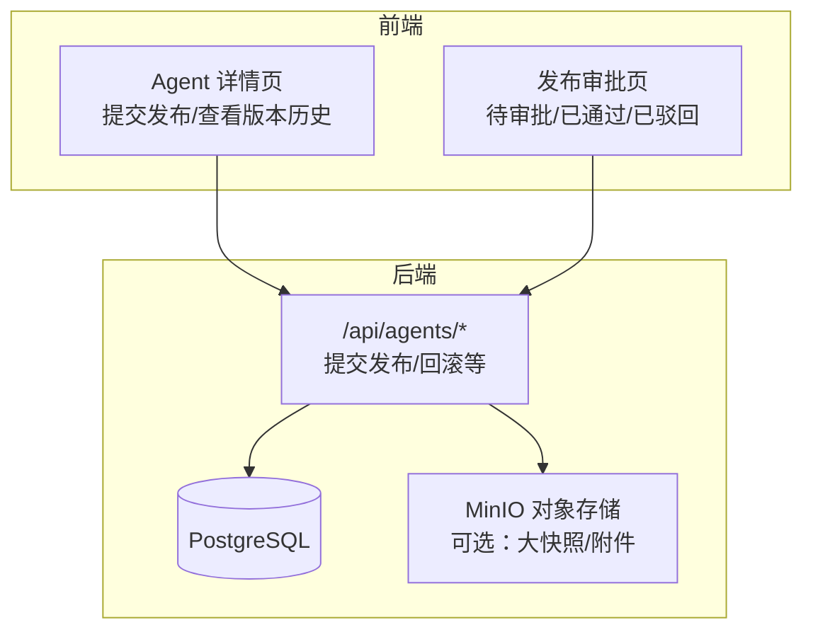
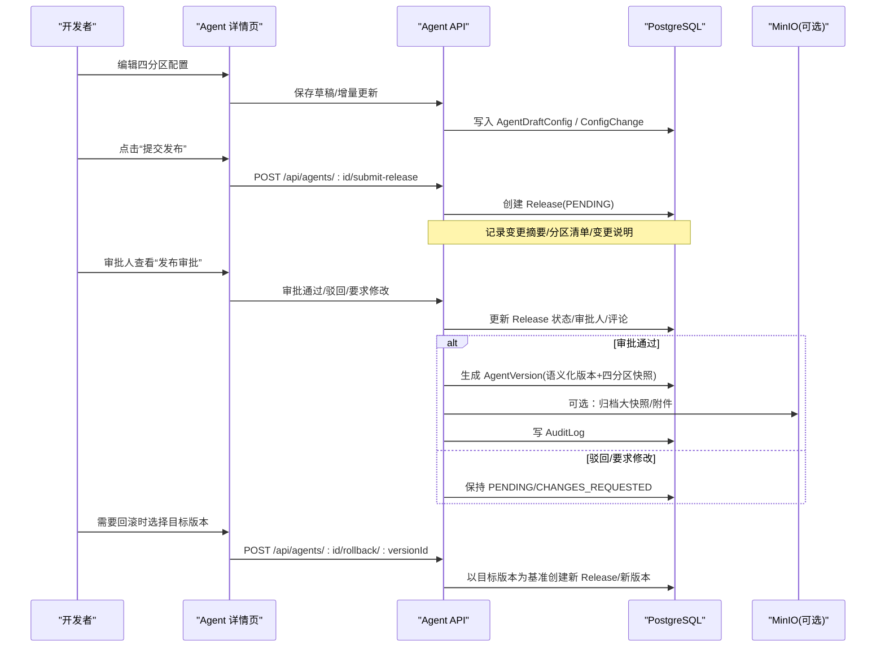
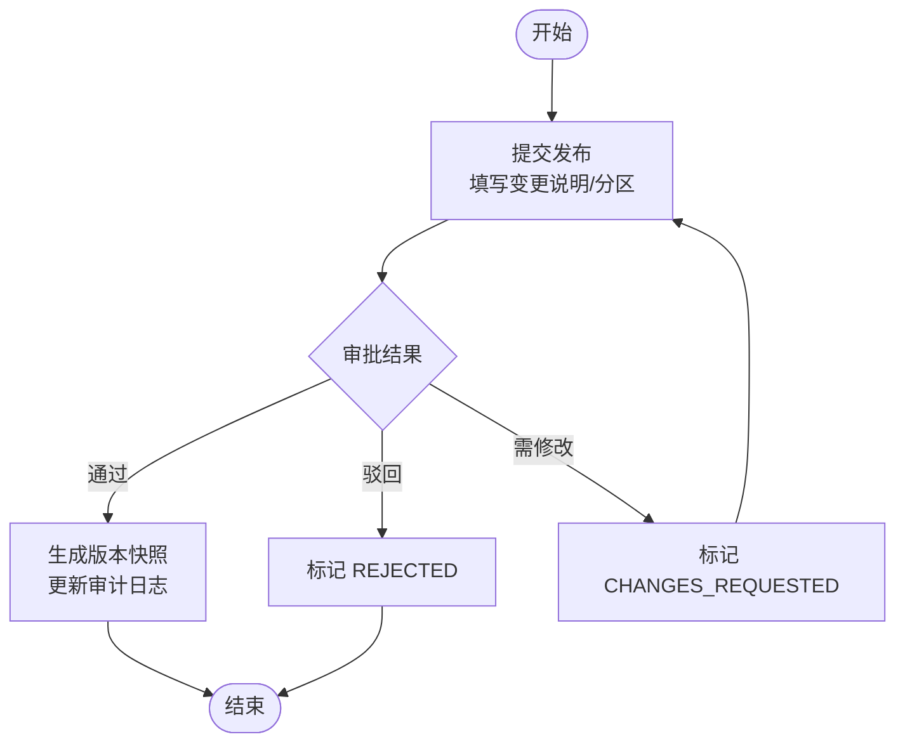
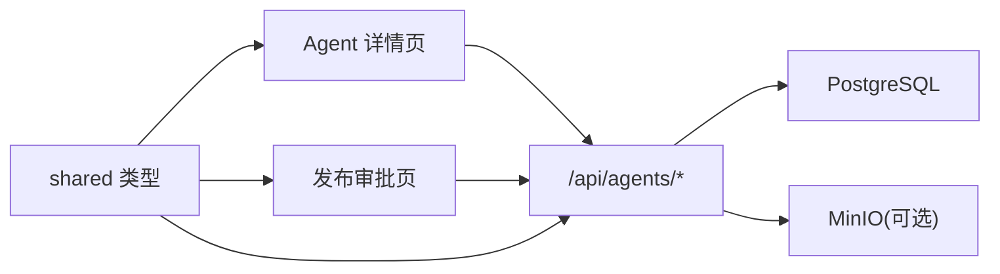

# 版本控制机制

<cite>
**本文引用的文件**
- [apps/web/prisma/schema.prisma](file://apps/web/prisma/schema.prisma)
- [packages/shared/src/types/agent.ts](file://packages/shared/src/types/agent.ts)
- [packages/shared/src/types/release.ts](file://packages/shared/src/types/release.ts)
- [packages/shared/src/types/permission.ts](file://packages/shared/src/types/permission.ts)
- [apps/web/app/api/agents/route.ts](file://apps/web/app/api/agents/route.ts)
- [apps/web/app/(dashboard)/releases/page.tsx](file://apps/web/app/(dashboard)/releases/page.tsx)
- [apps/web/app/(dashboard)/agents/[id]/page.tsx](file://apps/web/app/(dashboard)/agents/[id]/page.tsx)
- [docker-compose.yml](file://docker-compose.yml)
</cite>

## 目录
1. [简介](#简介)
2. [项目结构](#项目结构)
3. [核心组件](#核心组件)
4. [架构总览](#架构总览)
5. [详细组件分析](#详细组件分析)
6. [依赖关系分析](#依赖关系分析)
7. [性能与并发](#性能与并发)
8. [故障恢复与一致性](#故障恢复与一致性)
9. [API 接口与使用示例](#api-接口与使用示例)
10. [结论](#结论)

## 简介
本文件系统性阐述 Agent Up 的版本控制系统设计与实现，覆盖版本快照的创建时机与存储策略、发布审批流程与角色权限、版本回滚与数据一致性、语义化版本与标签管理、API 接口与使用示例、冲突解决与并发控制，以及完整生命周期与故障恢复方案。内容基于仓库中的数据库模型、类型定义、页面与 API 路由进行归纳与可视化说明。

## 项目结构
Agent Up 采用 Next.js 前端 + Prisma 数据建模 + 共享类型库的组织方式。版本控制相关的关键位置包括：
- 数据库模型：Prisma Schema 定义了 Agent、配置分区、变更审计、Release（发布）、AgentVersion（版本快照）等核心实体。
- 共享类型：shared 包提供 Release、AgentVersion、权限与角色等类型定义，用于前后端契约。
- 前端页面：发布审批列表页、Agent 详情页（含“提交发布”“查看版本历史”入口）。
- API 路由：列出 Agent 相关操作端点，包含提交发布与回滚接口。
- 基础设施：PostgreSQL 与 MinIO 对象存储，支撑结构化数据与快照/附件持久化。



图表来源
- [apps/web/app/(dashboard)/agents/[id]/page.tsx:1-43](file://apps/web/app/(dashboard)/agents/[id]/page.tsx#L1-L43)
- [apps/web/app/(dashboard)/releases/page.tsx:1-25](file://apps/web/app/(dashboard)/releases/page.tsx#L1-L25)
- [apps/web/app/api/agents/route.ts:1-19](file://apps/web/app/api/agents/route.ts#L1-L19)
- [docker-compose.yml:1-38](file://docker-compose.yml#L1-L38)

章节来源
- [apps/web/prisma/schema.prisma:1-626](file://apps/web/prisma/schema.prisma#L1-L626)
- [apps/web/app/api/agents/route.ts:1-19](file://apps/web/app/api/agents/route.ts#L1-L19)
- [apps/web/app/(dashboard)/releases/page.tsx:1-25](file://apps/web/app/(dashboard)/releases/page.tsx#L1-L25)
- [apps/web/app/(dashboard)/agents/[id]/page.tsx:1-43](file://apps/web/app/(dashboard)/agents/[id]/page.tsx#L1-L43)
- [docker-compose.yml:1-38](file://docker-compose.yml#L1-L38)

## 核心组件
- Agent 与四分区配置：Prompt、Knowledge、Tools、Routing 四个分区构成 Agent 的配置集合，每个分区具备独立版本字段与修改记录。
- 草稿区：AgentDraftConfig 保存未发布的编辑态配置，支持脏标记与最后保存人/时间。
- 变更审计：ConfigChange 记录分区级 before/after/diff，关联 releaseId 以便追溯。
- 发布审批：Release 描述一次发布申请的状态机（待审批/已通过/已驳回/需修改），并携带变更摘要与可选配置快照。
- 版本快照：AgentVersion 在发布通过后生成，包含四分区快照、语义化版本号（major/minor/patch）、发布人与时间、可选 wiki 提交哈希与效果报告。
- 权限与审计：Role/Permission/UserRole/AuditLog 提供细粒度权限与操作审计能力。

章节来源
- [apps/web/prisma/schema.prisma:61-214](file://apps/web/prisma/schema.prisma#L61-L214)
- [apps/web/prisma/schema.prisma:298-354](file://apps/web/prisma/schema.prisma#L298-L354)
- [apps/web/prisma/schema.prisma:563-625](file://apps/web/prisma/schema.prisma#L563-L625)
- [packages/shared/src/types/agent.ts:1-108](file://packages/shared/src/types/agent.ts#L1-L108)
- [packages/shared/src/types/release.ts:1-35](file://packages/shared/src/types/release.ts#L1-L35)
- [packages/shared/src/types/permission.ts:1-37](file://packages/shared/src/types/permission.ts#L1-L37)

## 架构总览
版本控制围绕“编辑—提交—审批—发布—回滚”的生命周期展开，数据落盘于 PostgreSQL，必要时将大型快照或附件落至 MinIO。



图表来源
- [apps/web/app/api/agents/route.ts:1-19](file://apps/web/app/api/agents/route.ts#L1-L19)
- [apps/web/app/(dashboard)/agents/[id]/page.tsx:1-43](file://apps/web/app/(dashboard)/agents/[id]/page.tsx#L1-L43)
- [apps/web/app/(dashboard)/releases/page.tsx:1-25](file://apps/web/app/(dashboard)/releases/page.tsx#L1-L25)
- [apps/web/prisma/schema.prisma:298-354](file://apps/web/prisma/schema.prisma#L298-L354)
- [docker-compose.yml:1-38](file://docker-compose.yml#L1-L38)

## 详细组件分析

### 数据模型与关系
- Agent 与配置分区：每个分区拥有 version 与 lastModifiedBy/At，便于追踪分区级演进。
- AgentDraftConfig：隔离开发态与生产态，避免直接污染线上配置。
- ConfigChange：分区级 diff 审计，支持按 agentId/partition/changedAt 查询。
- Release：发布工作流的核心，状态机驱动后续动作。
- AgentVersion：不可变版本快照，唯一约束 (agentId, version) 保证版本不重复。

```mermaid
erDiagram
AGENT {
string id PK
string name
enum status
}
AGENT_DRAFT_CONFIG {
string id PK
string agentId FK
json promptConfig
json knowledgeConfig
json toolsConfig
json routingConfig
boolean isDirty
}
CONFIG_CHANGE {
string id PK
string agentId FK
enum partition
json before
json after
json diff
string changedBy
datetime changedAt
string changeNote
string releaseId FK
}
RELEASE {
string id PK
string agentId FK
string changeNote
enum status
string submittedBy
datetime submittedAt
string approvedBy
datetime approvedAt
string reviewComment
json configSnapshot
}
AGENT_VERSION {
string id PK
string agentId FK
string version UK
int major
int minor
int patch
json promptSnapshot
json knowledgeSnapshot
json toolsSnapshot
json routingSnapshot
string releaseId UK FK
string wikiCommitSha
datetime publishedAt
string publishedBy
string changeNote
json effectivenessReport
}
AGENT ||--o{ AGENT_DRAFT_CONFIG : "一对一"
AGENT ||--o{ CONFIG_CHANGE : "一对多"
AGENT ||--o{ RELEASE : "一对多"
RELEASE ||--|| AGENT_VERSION : "一对一"
```

图表来源
- [apps/web/prisma/schema.prisma:61-214](file://apps/web/prisma/schema.prisma#L61-L214)
- [apps/web/prisma/schema.prisma:298-354](file://apps/web/prisma/schema.prisma#L298-L354)

章节来源
- [apps/web/prisma/schema.prisma:61-214](file://apps/web/prisma/schema.prisma#L61-L214)
- [apps/web/prisma/schema.prisma:298-354](file://apps/web/prisma/schema.prisma#L298-L354)

### 版本快照的创建时机与存储策略
- 创建时机：当 Release 状态变更为 APPROVED 后，系统生成 AgentVersion，并将四分区当前有效配置序列化为快照；同时记录 wikiCommitSha（若关联知识库）与发布元信息。
- 存储策略：
  - 结构化快照：AgentVersion 的 JSON 字段存储各分区快照，适合中小体量配置。
  - 外部对象存储：结合 MinIO，可将大型快照或附件落盘，数据库仅保留引用键（例如对象 key），以降低数据库压力。
- 索引与查询：AgentVersion 对 (agentId, publishedAt) 建立索引，便于按 Agent 和时间线检索版本历史。

章节来源
- [apps/web/prisma/schema.prisma:332-354](file://apps/web/prisma/schema.prisma#L332-L354)
- [docker-compose.yml:18-34](file://docker-compose.yml#L18-L34)

### 发布审批流程与角色权限
- 工作流状态：PENDING → APPROVED/REJECTED/CHANGES_REQUESTED。
- 关键参与方：
  - 提交者：发起发布，填写变更说明与受影响分区。
  - 审批者：审核变更影响，给出通过/驳回/要求修改意见。
  - 发布者：审批通过后执行版本固化与发布。
- 权限控制：
  - 角色类型：平台管理员、产品负责人、产品成员、技能开发者、知识编辑、审计员、只读用户等。
  - 权限动作：read/write/publish/approve/rollback/delete/admin。
  - 作用域：own_group/cross_group/global。
  - 建议策略：只有具备 approve 且作用域覆盖该 Agent 所属组的用户可审批；publish/rollback 由更高权限角色执行。



图表来源
- [apps/web/prisma/schema.prisma:298-326](file://apps/web/prisma/schema.prisma#L298-L326)
- [packages/shared/src/types/permission.ts:1-37](file://packages/shared/src/types/permission.ts#L1-L37)

章节来源
- [apps/web/prisma/schema.prisma:298-326](file://apps/web/prisma/schema.prisma#L298-L326)
- [packages/shared/src/types/permission.ts:1-37](file://packages/shared/src/types/permission.ts#L1-L37)

### 版本回滚机制与数据一致性
- 回滚触发：当线上版本出现异常或效果不佳时，选择历史 AgentVersion 作为回滚目标。
- 回滚策略：
  - 以目标版本的快照为基线，创建新的 Release 与新的 AgentVersion，确保历史版本不可变。
  - 同步更新 Agent 的活跃配置（如应用层读取最新生效版本），并在审计日志中记录回滚原因与操作人。
- 一致性保障：
  - 数据库事务：Release 状态变更、AgentVersion 创建、AuditLog 写入应在同一事务内完成。
  - 幂等性：回滚接口应支持幂等调用，避免重复创建版本。
  - 校验：回滚前校验目标版本存在且未被删除；检查是否存在更晚的发布导致冲突。

章节来源
- [apps/web/prisma/schema.prisma:332-354](file://apps/web/prisma/schema.prisma#L332-L354)
- [apps/web/prisma/schema.prisma:563-625](file://apps/web/prisma/schema.prisma#L563-L625)

### 版本标签与语义化版本管理
- 语义化版本：AgentVersion 包含 major/minor/patch 三元组，配合字符串 version 字段，满足语义化规范。
- 标签策略：
  - 主版本（major）：破坏性变更或重大架构调整。
  - 次版本（minor）：新增功能但向后兼容。
  - 修订版（patch）：缺陷修复与小改进。
- 标签与索引：
  - 唯一约束 (agentId, version) 防止重复版本。
  - 可按 agentId 与发布时间排序展示版本历史。
- 建议实践：
  - 在变更说明中明确版本级别与影响范围。
  - 对重要里程碑打 tag（可在业务层扩展标签表或在 release/changeNote 中标注）。

章节来源
- [apps/web/prisma/schema.prisma:332-354](file://apps/web/prisma/schema.prisma#L332-L354)
- [packages/shared/src/types/release.ts:22-32](file://packages/shared/src/types/release.ts#L22-L32)

### 版本冲突解决与并发控制
- 冲突场景：多人同时编辑同一 Agent 的不同分区，或并行提交发布。
- 解决策略：
  - 分区级锁：对同一分区的并发写加锁，保证顺序一致。
  - 乐观锁：利用分区 version 字段与 lastModifiedAt 检测冲突，提示合并或重试。
  - 提交前差异校验：对比当前在线版本与草稿差异，避免覆盖他人变更。
- 并发安全：
  - 数据库唯一约束与索引减少竞争条件。
  - 发布流程原子化：Release 状态变更与版本创建在同一事务中。

章节来源
- [apps/web/prisma/schema.prisma:103-173](file://apps/web/prisma/schema.prisma#L103-L173)
- [apps/web/prisma/schema.prisma:332-354](file://apps/web/prisma/schema.prisma#L332-L354)

## 依赖关系分析
- 前端到后端：页面通过 API 路由触发提交发布与回滚等操作。
- 后端到数据层：Prisma 访问 PostgreSQL，必要时读写 MinIO。
- 类型契约：shared 包类型定义贯穿前后端，确保数据结构一致。



图表来源
- [apps/web/app/api/agents/route.ts:1-19](file://apps/web/app/api/agents/route.ts#L1-L19)
- [packages/shared/src/types/agent.ts:1-108](file://packages/shared/src/types/agent.ts#L1-L108)
- [packages/shared/src/types/release.ts:1-35](file://packages/shared/src/types/release.ts#L1-L35)
- [docker-compose.yml:1-38](file://docker-compose.yml#L1-L38)

章节来源
- [apps/web/app/api/agents/route.ts:1-19](file://apps/web/app/api/agents/route.ts#L1-L19)
- [packages/shared/src/types/agent.ts:1-108](file://packages/shared/src/types/agent.ts#L1-L108)
- [packages/shared/src/types/release.ts:1-35](file://packages/shared/src/types/release.ts#L1-L35)
- [docker-compose.yml:1-38](file://docker-compose.yml#L1-L38)

## 性能与并发
- 快照大小控制：优先将大型快照落至 MinIO，数据库仅存引用，降低 I/O 压力。
- 索引优化：针对高频查询路径建立索引（如 agentId+status、agentId+publishedAt）。
- 批处理与异步：发布后的效果评估报告、wiki 同步等可异步执行，避免阻塞主流程。
- 缓存策略：对热点 Agent 的最新版本与配置进行短期缓存，缩短读取延迟。

[本节为通用指导，无需特定文件来源]

## 故障恢复与一致性
- 事务回滚：发布失败时，确保 Release 状态与 AgentVersion 的一致性，必要时补偿。
- 审计追踪：所有关键操作写入 AuditLog，便于问题定位与合规审计。
- 对象存储容灾：MinIO 启用多副本与跨区域复制，保障快照与附件可用性。
- 健康检查：PostgreSQL 与 MinIO 的健康检查确保服务可用。

章节来源
- [apps/web/prisma/schema.prisma:563-625](file://apps/web/prisma/schema.prisma#L563-L625)
- [docker-compose.yml:12-16](file://docker-compose.yml#L12-L16)
- [docker-compose.yml:30-34](file://docker-compose.yml#L30-L34)

## API 接口与使用示例
以下接口由 Agent API 路由声明，实际实现位于服务端逻辑中：

- GET /api/agents
  - 用途：获取 Agent 列表或元信息。
  - 返回：Agent 基本信息与版本概览。
- POST /api/agents
  - 用途：创建新 Agent。
  - 请求体：名称、描述、分组等。
- GET /api/agents/:id
  - 用途：获取指定 Agent 详情。
- PUT /api/agents/:id
  - 用途：更新 Agent 基础信息。
- GET /api/agents/:id/config/:partition
  - 用途：读取某分区当前配置。
- PUT /api/agents/:id/config/:partition
  - 用途：更新某分区配置（写入草稿/变更记录）。
- POST /api/agents/:id/submit-release
  - 用途：提交发布申请。
  - 请求体：变更说明、受影响分区列表、可选配置快照。
  - 行为：创建 Release(PENDING)，记录审计日志。
- POST /api/agents/:id/rollback/:versionId
  - 用途：回滚到指定版本。
  - 行为：以目标版本为基线创建新 Release 与 AgentVersion，更新审计日志。

使用示例（概念性步骤）：
- 提交发布：
  - 调用 PUT 更新分区配置，随后调用 POST submit-release 提交发布。
  - 审批人在“发布审批”页面查看并批准。
  - 系统生成 AgentVersion，版本可见于版本历史。
- 回滚：
  - 在版本历史中选择目标版本，调用 rollback 接口。
  - 系统创建新版本并生效，审计日志记录回滚原因。

章节来源
- [apps/web/app/api/agents/route.ts:1-19](file://apps/web/app/api/agents/route.ts#L1-L19)
- [apps/web/app/(dashboard)/agents/[id]/page.tsx:29-39](file://apps/web/app/(dashboard)/agents/[id]/page.tsx#L29-L39)
- [apps/web/app/(dashboard)/releases/page.tsx:1-25](file://apps/web/app/(dashboard)/releases/page.tsx#L1-L25)

## 结论
Agent Up 的版本控制体系以“分区配置 + 草稿隔离 + 变更审计 + 发布审批 + 不可变版本快照”为核心，结合语义化版本与完善的权限审计，形成从编辑到发布再到回滚的闭环。通过数据库事务、唯一约束与索引优化，保障了并发安全与数据一致性；借助 MinIO 可扩展地存储大型快照与附件。建议在后续迭代中完善并发锁与乐观锁策略、细化权限矩阵与审批规则，并引入自动化测试与灰度发布以提升稳定性与可观测性。