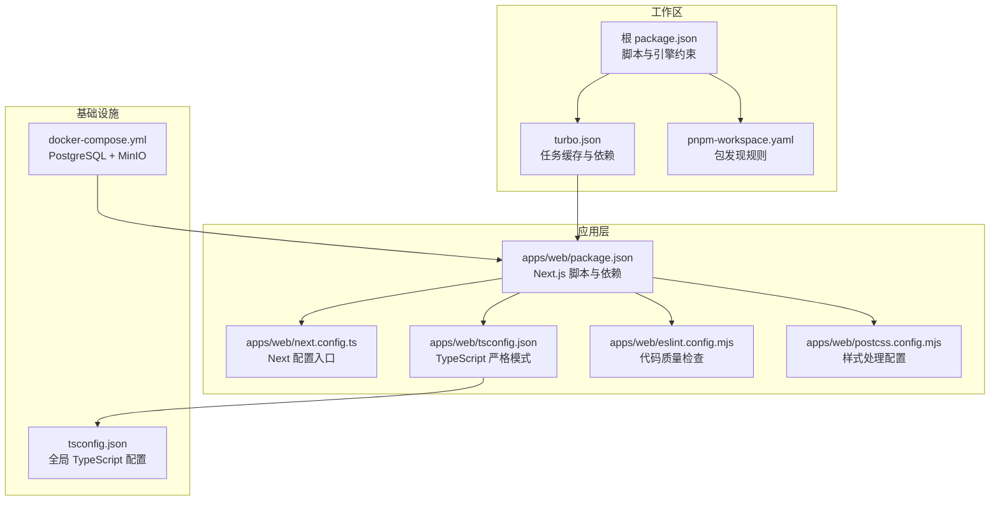
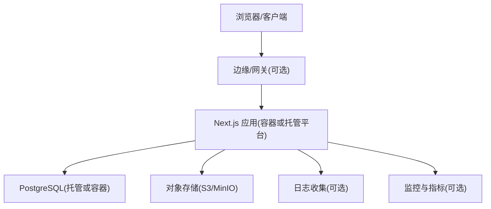
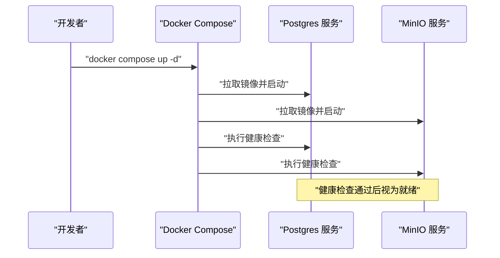
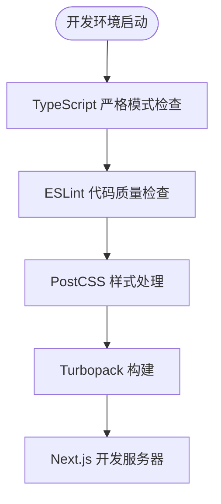
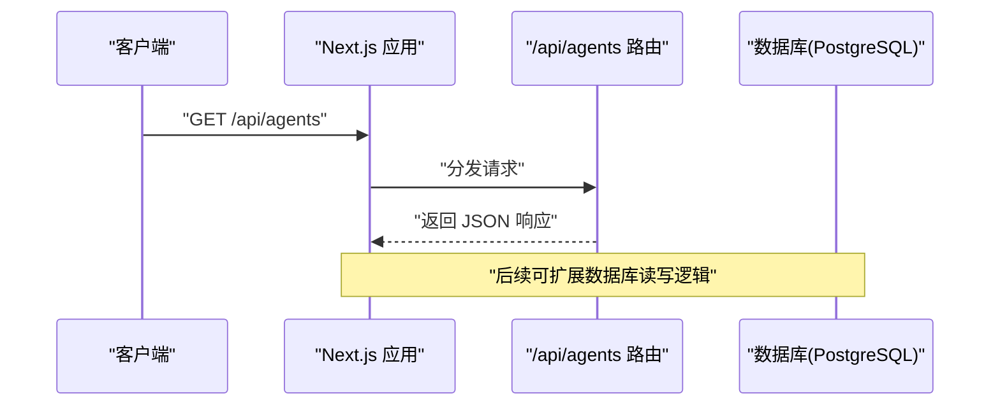
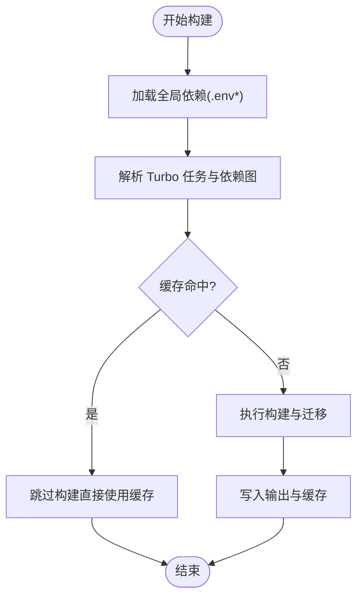
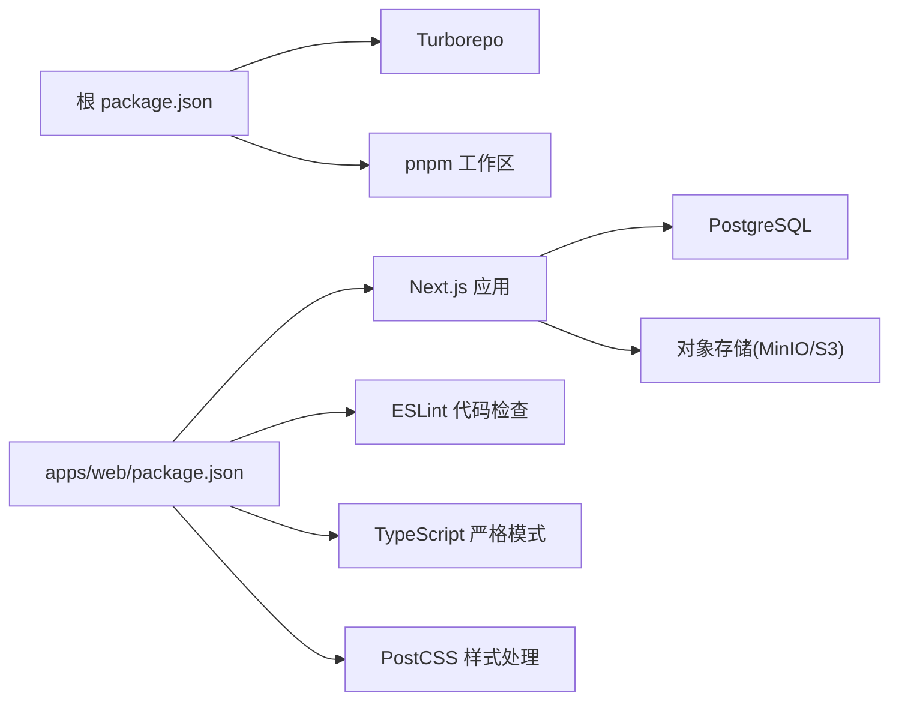

# 部署指南

<cite>
**本文引用的文件**   
- [README.md](file://README.md)
- [docker-compose.yml](file://docker-compose.yml)
- [package.json](file://package.json)
- [turbo.json](file://turbo.json)
- [pnpm-workspace.yaml](file://pnpm-workspace.yaml)
- [apps/web/package.json](file://apps/web/package.json)
- [apps/web/next.config.ts](file://apps/web/next.config.ts)
- [apps/web/tsconfig.json](file://apps/web/tsconfig.json)
- [tsconfig.json](file://tsconfig.json)
- [apps/web/eslint.config.mjs](file://apps/web/eslint.config.mjs)
- [apps/web/postcss.config.mjs](file://apps/web/postcss.config.mjs)
</cite>

## 更新摘要
**变更内容**   
- 更新了 Docker Compose 配置，包含 PostgreSQL 和 MinIO 服务
- 添加了现代开发工具链配置（ESLint、TypeScript 严格模式、PostCSS）
- 完善了 Turborepo 任务配置和缓存策略
- 增强了容器化开发环境的说明

## 目录
1. [简介](#简介)
2. [项目结构](#项目结构)
3. [核心组件](#核心组件)
4. [架构总览](#架构总览)
5. [详细组件分析](#详细组件分析)
6. [依赖关系分析](#依赖关系分析)
7. [性能考虑](#性能考虑)
8. [故障排查指南](#故障排查指南)
9. [结论](#结论)
10. [附录](#附录)

## 简介
本指南面向 Agent Up 项目的开发与运维团队，提供从本地开发到生产环境的完整部署策略。内容涵盖：
- Docker Compose 编排与服务依赖、网络与数据持久化
- 环境变量配置、密钥管理与安全最佳实践
- 主流云平台（Vercel、AWS、Azure）的部署步骤与配置要点
- CI/CD 流水线、自动化测试与部署脚本建议
- 监控、日志收集与性能调优
- 备份恢复、灾难恢复与高可用配置
- 运维监控告警与故障排查

## 项目结构
本项目采用 Turborepo + pnpm workspace 的多包架构，前端应用位于 apps/web，使用现代开发工具链包括 ESLint、TypeScript 严格模式和 PostCSS，并通过 docker-compose 提供 PostgreSQL 与 MinIO 服务。

**图表来源**
- [package.json:1-22](file://package.json#L1-L22)
- [turbo.json:1-32](file://turbo.json#L1-L32)
- [pnpm-workspace.yaml:1-4](file://pnpm-workspace.yaml#L1-L4)
- [apps/web/package.json:1-31](file://apps/web/package.json#L1-L31)
- [apps/web/next.config.ts:1-8](file://apps/web/next.config.ts#L1-L8)
- [apps/web/tsconfig.json:1-35](file://apps/web/tsconfig.json#L1-L35)
- [apps/web/eslint.config.mjs:1-19](file://apps/web/eslint.config.mjs#L1-L19)
- [apps/web/postcss.config.mjs:1-8](file://apps/web/postcss.config.mjs#L1-L8)
- [tsconfig.json:1-22](file://tsconfig.json#L1-L22)
- [docker-compose.yml:1-39](file://docker-compose.yml#L1-L39)

**章节来源**
- [README.md:1-3](file://README.md#L1-L3)
- [package.json:1-22](file://package.json#L1-L22)
- [turbo.json:1-32](file://turbo.json#L1-L32)
- [pnpm-workspace.yaml:1-4](file://pnpm-workspace.yaml#L1-L4)
- [apps/web/package.json:1-31](file://apps/web/package.json#L1-L31)
- [apps/web/next.config.ts:1-8](file://apps/web/next.config.ts#L1-L8)
- [apps/web/tsconfig.json:1-35](file://apps/web/tsconfig.json#L1-L35)
- [apps/web/eslint.config.mjs:1-19](file://apps/web/eslint.config.mjs#L1-L19)
- [apps/web/postcss.config.mjs:1-8](file://apps/web/postcss.config.mjs#L1-L8)
- [tsconfig.json:1-22](file://tsconfig.json#L1-L22)
- [docker-compose.yml:1-39](file://docker-compose.yml#L1-L39)

## 核心组件
- **运行时与构建**
  - Node 版本要求与包管理器由根 package.json 指定，使用 pnpm 与 Turborepo 进行多包构建与缓存。
  - Next.js 应用通过 apps/web/package.json 中的脚本启动开发、构建与生产运行，支持 Turbopack 加速开发。
- **数据库与对象存储**
  - PostgreSQL 作为主数据库，MinIO 作为 S3 兼容对象存储（用于知识库快照与附件）。
  - 通过 Docker Compose 提供完整的开发环境基础设施。
- **现代开发工具链**
  - ESLint 代码质量检查，集成 Next.js 最佳实践规则。
  - TypeScript 严格模式确保类型安全。
  - PostCSS 配合 Tailwind CSS v4 进行样式处理。
- **应用接口**
  - 示例 API 路由展示了 /api/agents 的基础能力清单，便于后续扩展业务接口。

**章节来源**
- [package.json:1-22](file://package.json#L1-L22)
- [apps/web/package.json:1-31](file://apps/web/package.json#L1-L31)
- [docker-compose.yml:1-39](file://docker-compose.yml#L1-L39)
- [apps/web/eslint.config.mjs:1-19](file://apps/web/eslint.config.mjs#L1-L19)
- [apps/web/tsconfig.json:1-35](file://apps/web/tsconfig.json#L1-L35)
- [apps/web/postcss.config.mjs:1-8](file://apps/web/postcss.config.mjs#L1-L8)

## 架构总览
下图展示本地与云环境下的典型部署拓扑：Next.js 应用访问 PostgreSQL 与对象存储；在生产环境中可引入反向代理、负载均衡与外部托管数据库/对象存储。

[此图为概念性架构图，不直接映射具体源码文件]

## 详细组件分析

### Docker Compose 编排与服务依赖
- **服务清单**
  - postgres：PostgreSQL 16 Alpine 镜像，暴露 5432 端口，挂载数据卷，包含健康检查。
  - minio：S3 兼容对象存储，控制台 9001，数据卷持久化，包含健康检查。
- **数据持久化**
  - postgres_data 与 minio_data 命名卷确保重启后数据不丢失。
- **网络与端口**
  - 默认桥接网络下，服务间可通过服务名通信；对外暴露端口仅用于本地调试。
- **健康检查**
  - 数据库与对象存储服务均定义了健康检查，便于编排器判断就绪状态。

**图表来源**
- [docker-compose.yml:1-39](file://docker-compose.yml#L1-L39)

**章节来源**
- [docker-compose.yml:1-39](file://docker-compose.yml#L1-L39)

### 现代开发工具链配置
- **TypeScript 严格模式**
  - 启用严格类型检查，确保代码质量和类型安全。
  - 支持增量编译和声明文件生成。
- **ESLint 代码质量**
  - 集成 Next.js 官方规则集，包括核心 Web Vitals 和 TypeScript 支持。
  - 自定义忽略规则，优化构建产物处理。
- **PostCSS 样式处理**
  - 使用 @tailwindcss/postcss 插件支持 Tailwind CSS v4。
  - 现代化的 CSS 处理管道。

**图表来源**
- [apps/web/tsconfig.json:1-35](file://apps/web/tsconfig.json#L1-L35)
- [apps/web/eslint.config.mjs:1-19](file://apps/web/eslint.config.mjs#L1-L19)
- [apps/web/postcss.config.mjs:1-8](file://apps/web/postcss.config.mjs#L1-L8)

**章节来源**
- [apps/web/tsconfig.json:1-35](file://apps/web/tsconfig.json#L1-L35)
- [tsconfig.json:1-22](file://tsconfig.json#L1-L22)
- [apps/web/eslint.config.mjs:1-19](file://apps/web/eslint.config.mjs#L1-L19)
- [apps/web/postcss.config.mjs:1-8](file://apps/web/postcss.config.mjs#L1-L8)

### 环境变量与密钥管理
- **数据库连接**
  - PostgreSQL 通过环境变量配置，默认用户 agentup，密码 agentup，数据库 agentup。
- **对象存储**
  - MinIO 默认凭据：minioadmin/minioadmin，控制台地址 http://localhost:9001。
- **应用运行环境**
  - NODE_ENV 控制日志级别与行为；Next.js 构建与运行需要正确设置。
- **密钥管理建议**
  - 使用平台密钥管理服务（如 AWS Secrets Manager、Azure Key Vault、GCP Secret Manager）注入敏感信息。
  - 避免将 .env 提交至代码仓库；CI/CD 中使用受保护的变量或密钥注入。

**章节来源**
- [docker-compose.yml:1-39](file://docker-compose.yml#L1-L39)

### Next.js 应用与 API 路由
- **应用脚本**
  - 开发、构建、启动与清理脚本均在 apps/web/package.json 中定义。
  - 开发模式使用 Turbopack 加速热重载。
- **配置入口**
  - next.config.ts 为 Next 配置入口，可按需添加环境变量、中间件与安全头。
- **API 路由**
  - 示例 GET /api/agents 返回基础信息与可用端点列表，可作为后续业务接口扩展的起点。

**图表来源**
- [apps/web/package.json:1-31](file://apps/web/package.json#L1-L31)
- [apps/web/next.config.ts:1-8](file://apps/web/next.config.ts#L1-L8)

**章节来源**
- [apps/web/package.json:1-31](file://apps/web/package.json#L1-L31)
- [apps/web/next.config.ts:1-8](file://apps/web/next.config.ts#L1-L8)

### 多包与构建缓存
- **工作区与包发现**
  - pnpm-workspace.yaml 声明 apps/* 与 packages/* 为工作区包。
- **任务与缓存**
  - turbo.json 定义 build、dev、lint、db:* 等任务，启用增量构建与输出缓存。
  - 全局依赖包含 .env 文件，确保环境变量变更触发重新构建。
- **构建优化**
  - 支持并行构建和任务缓存，显著提升开发体验。

**图表来源**
- [turbo.json:1-32](file://turbo.json#L1-L32)
- [pnpm-workspace.yaml:1-4](file://pnpm-workspace.yaml#L1-L4)

**章节来源**
- [turbo.json:1-32](file://turbo.json#L1-L32)
- [pnpm-workspace.yaml:1-4](file://pnpm-workspace.yaml#L1-L4)
- [package.json:1-22](file://package.json#L1-L22)

## 依赖关系分析
- **运行时依赖**
  - Node >= 20，pnpm 9.15.0，Next.js 16.x，React 19.x。
- **构建与工具链**
  - Turborepo 负责任务编排与缓存；ESLint 与 Tailwind CSS v4 用于代码质量与样式。
  - TypeScript 严格模式确保类型安全。
- **外部服务依赖**
  - PostgreSQL 与对象存储（MinIO 或云 S3）。

**图表来源**
- [package.json:1-22](file://package.json#L1-L22)
- [apps/web/package.json:1-31](file://apps/web/package.json#L1-L31)
- [docker-compose.yml:1-39](file://docker-compose.yml#L1-L39)

**章节来源**
- [package.json:1-22](file://package.json#L1-L22)
- [apps/web/package.json:1-31](file://apps/web/package.json#L1-L31)
- [docker-compose.yml:1-39](file://docker-compose.yml#L1-L39)

## 性能考虑
- **数据库**
  - 合理设计索引与查询；对高频查询字段建立索引；避免 N+1 查询。
  - 使用连接池与只读副本（生产环境）提升吞吐。
- **对象存储**
  - 使用 CDN 加速静态资源与知识库快照下载；开启分片上传与压缩。
- **应用层**
  - 启用 Next.js 增量静态再生成（ISR）与缓存策略；减少不必要的服务端渲染。
  - 限制并发调用与超时重试，避免雪崩效应。
- **构建与部署**
  - 利用 Turborepo 缓存与并行构建；按需构建产物，减小镜像体积。
  - 使用 Turbopack 加速开发体验。

[本节为通用指导，不直接分析具体文件]

## 故障排查指南
- **数据库连接失败**
  - 检查 DATABASE_URL 是否正确；确认防火墙与网络可达；验证健康检查是否通过。
  - 验证 PostgreSQL 服务是否正常运行：`docker compose ps postgres`
- **对象存储不可用**
  - 校验 MinIO/S3 凭据与端点；检查桶是否存在与权限；查看健康检查与日志。
  - 访问 MinIO 控制台：http://localhost:9001
- **构建失败**
  - 确认 Node 与 pnpm 版本；检查环境变量是否注入；查看 Turborepo 缓存与任务日志。
  - 清理缓存：`turbo clean`
- **应用启动异常**
  - 检查 Next.js 环境变量与端口占用；查看开发服务器日志。
  - 验证 TypeScript 类型检查：`turbo lint`

**章节来源**
- [docker-compose.yml:1-39](file://docker-compose.yml#L1-L39)
- [turbo.json:1-32](file://turbo.json#L1-L32)
- [apps/web/package.json:1-31](file://apps/web/package.json#L1-L31)

## 结论
Agent Up 基于现代全栈技术栈与容器化编排，具备良好的可移植性与扩展性。通过合理的依赖管理、环境变量与密钥注入、以及完善的监控与备份策略，可在本地、云端与混合环境中稳定运行。新增的现代开发工具链进一步提升了开发体验和代码质量。

[本节为总结性内容，不直接分析具体文件]

## 附录

### 本地开发与环境准备
- **安装与版本**
  - 安装 Node >= 20 与 pnpm 9.15.0。
- **启动基础设施**
  - 使用 docker-compose 启动 Postgres 与 MinIO：`docker compose up -d`
- **初始化数据库**
  - 设置 DATABASE_URL 后执行 Prisma 生成与迁移。
- **启动应用**
  - 使用 Turborepo 或 Next.js 脚本启动开发服务器：`turbo dev`

**章节来源**
- [package.json:1-22](file://package.json#L1-L22)
- [apps/web/package.json:1-31](file://apps/web/package.json#L1-L31)
- [docker-compose.yml:1-39](file://docker-compose.yml#L1-L39)

### 环境变量与密钥清单（建议）
- **必需**
  - DATABASE_URL：PostgreSQL 连接串
  - NODE_ENV：运行环境
- **可选**
  - MINIO_ROOT_USER/MINIO_ROOT_PASSWORD：MinIO 凭据（本地）
  - S3_*：云对象存储凭据（生产）
- **安全建议**
  - 使用平台密钥管理服务注入；禁止将 .env 提交到仓库；定期轮换密钥。

**章节来源**
- [docker-compose.yml:1-39](file://docker-compose.yml#L1-L39)

### 云平台部署要点

- **Vercel**
  - 选择 Next.js 框架，设置环境变量（DATABASE_URL、NODE_ENV 等）。
  - 数据库与对象存储建议使用托管服务（如 Supabase/AWS RDS、AWS S3）。
  - 构建命令与输出目录遵循 Next.js 默认；必要时在 next.config.ts 中添加自定义配置。

- **AWS**
  - 计算：ECS/Fargate 或 App Runner 运行 Next.js 容器或无服务器函数。
  - 数据库：RDS PostgreSQL；对象存储：S3。
  - 密钥：Secrets Manager 注入；IAM 最小权限原则。
  - 监控：CloudWatch 日志与指标；X-Ray 链路追踪（可选）。

- **Azure**
  - 计算：App Service 或 Container Apps 运行 Next.js。
  - 数据库：Azure Database for PostgreSQL；对象存储：Blob Storage。
  - 密钥：Key Vault 注入；网络隔离与防火墙策略。
  - 监控：Application Insights 与 Log Analytics。

[本节为通用指导，不直接分析具体文件]

### CI/CD 流水线建议
- **触发条件**
  - 推送分支或合并 PR 时触发构建与测试。
- **步骤**
  - 安装依赖（pnpm install）
  - 类型检查与 Lint（eslint/turbo lint）
  - 构建（turbo build）
  - 单元测试与集成测试（按项目约定）
  - 构建镜像或产物（Next.js 输出）
  - 部署到目标环境（Vercel/AWS/Azure）
- **缓存**
  - 缓存 node_modules 与 Turborepo 缓存目录以加速构建。
- **安全**
  - 使用受保护变量注入密钥；扫描依赖漏洞。

[本节为通用指导，不直接分析具体文件]

### 监控、日志与告警
- **日志**
  - 应用日志集中采集（stdout/stderr），结合结构化日志格式。
- **指标**
  - 暴露关键指标（QPS、延迟、错误率、数据库连接数、对象存储吞吐）。
- **告警**
  - 设定阈值告警（错误率、延迟、资源使用率）；通知渠道（邮件、IM、电话）。
- **分布式追踪**
  - 在关键路径埋点，便于定位瓶颈与问题。

[本节为通用指导，不直接分析具体文件]

### 备份、恢复与高可用
- **数据库**
  - 定时全量与增量备份；跨地域复制；演练恢复流程。
- **对象存储**
  - 版本化与跨区域复制；生命周期策略归档冷数据。
- **高可用**
  - 多副本部署与负载均衡；自动扩缩容与健康检查；灰度发布与回滚策略。

[本节为通用指导，不直接分析具体文件]