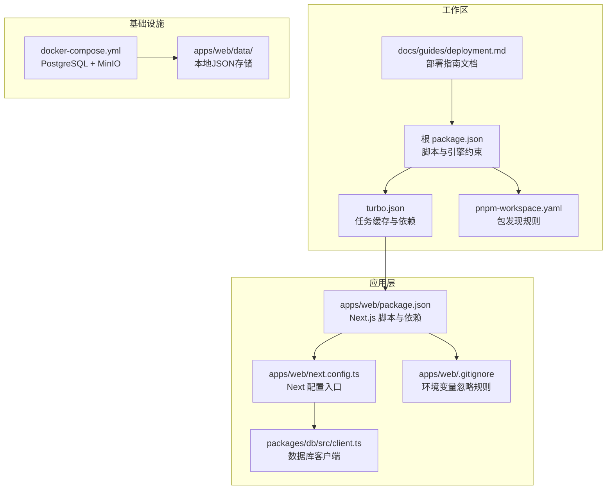
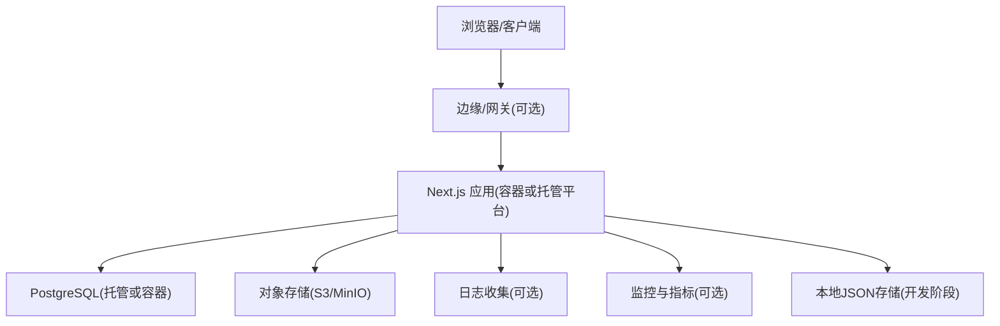
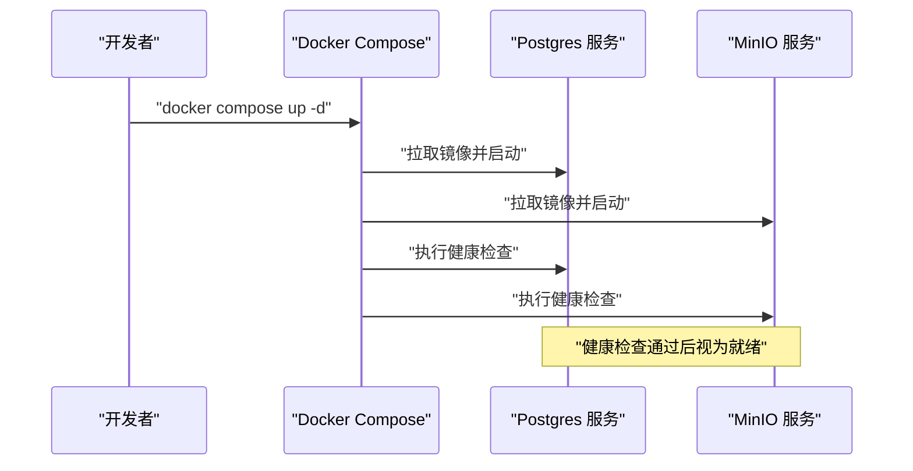
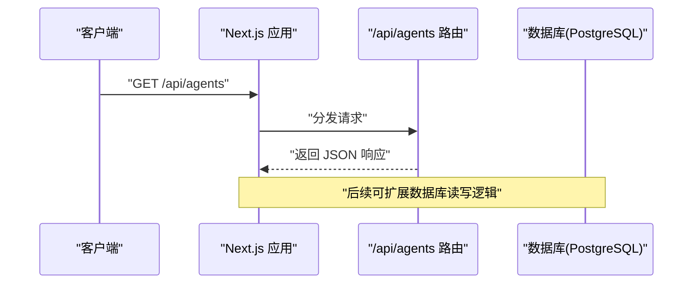
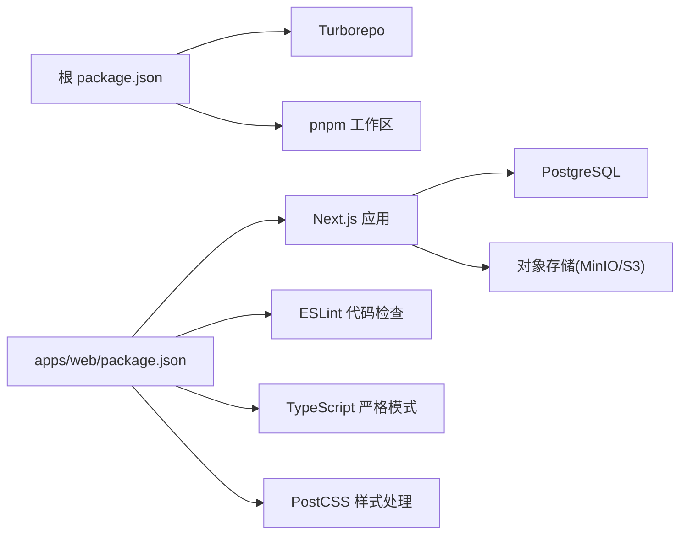

# 部署指南

<cite>
**本文引用的文件**   
- [docs/guides/deployment.md](file://docs/guides/deployment.md)
- [docker-compose.yml](file://docker-compose.yml)
- [package.json](file://package.json)
- [turbo.json](file://turbo.json)
- [pnpm-workspace.yaml](file://pnpm-workspace.yaml)
- [apps/web/package.json](file://apps/web/package.json)
- [apps/web/next.config.ts](file://apps/web/next.config.ts)
- [apps/web/.gitignore](file://apps/web/.gitignore)
- [packages/db/src/client.ts](file://packages/db/src/client.ts)
</cite>

## 更新摘要
**变更内容**   
- 新增详细的本地开发和生产环境部署分步说明
- 更新了环境变量配置和环境加载机制说明
- 完善了数据持久化策略（当前使用本地JSON，未来支持PostgreSQL）
- 增强了测试覆盖率和质量检查流程
- 添加了客户现场演示检查清单

## 目录
1. [简介](#简介)
2. [项目结构](#项目结构)
3. [核心组件](#核心组件)
4. [架构总览](#架构总览)
5. [详细组件分析](#详细组件分析)
6. [依赖关系分析](#依赖关系分析)
7. [性能考虑](#性能考虑)
8. [故障排查指南](#故障排查指南)
9. [结论](#结论)
10. [附录](#附录)

## 简介
本指南面向 Agent Up 项目的开发与运维团队，提供从本地开发到生产环境的完整部署策略。内容涵盖：
- Docker Compose 编排与服务依赖、网络与数据持久化
- 环境变量配置、密钥管理与安全最佳实践
- 主流云平台（Vercel、AWS、Azure）的部署步骤与配置要点
- CI/CD 流水线、自动化测试与部署脚本建议
- 监控、日志收集与性能调优
- 备份恢复、灾难恢复与高可用配置
- 运维监控告警与故障排查

**更新** 新增了详细的本地开发和生产环境部署分步说明，包括完整的环境变量配置和测试覆盖率要求。

## 项目结构
本项目采用 Turborepo + pnpm workspace 的多包架构，前端应用位于 apps/web，使用现代开发工具链包括 ESLint、TypeScript 严格模式和 PostCSS，并通过 docker-compose 提供 PostgreSQL 与 MinIO 服务。



**图表来源**
- [package.json:1-22](file://package.json#L1-L22)
- [turbo.json:1-32](file://turbo.json#L1-L32)
- [pnpm-workspace.yaml:1-4](file://pnpm-workspace.yaml#L1-L4)
- [docs/guides/deployment.md:1-84](file://docs/guides/deployment.md#L1-L84)
- [apps/web/package.json:1-35](file://apps/web/package.json#L1-L35)
- [apps/web/next.config.ts:1-6](file://apps/web/next.config.ts#L1-L6)
- [apps/web/.gitignore:1-42](file://apps/web/.gitignore#L1-L42)
- [packages/db/src/client.ts:1-18](file://packages/db/src/client.ts#L1-L18)
- [docker-compose.yml:1-39](file://docker-compose.yml#L1-L39)

**章节来源**
- [docs/guides/deployment.md:1-84](file://docs/guides/deployment.md#L1-L84)
- [package.json:1-22](file://package.json#L1-L22)
- [turbo.json:1-32](file://turbo.json#L1-L32)
- [pnpm-workspace.yaml:1-4](file://pnpm-workspace.yaml#L1-L4)
- [apps/web/package.json:1-35](file://apps/web/package.json#L1-L35)
- [apps/web/next.config.ts:1-6](file://apps/web/next.config.ts#L1-L6)
- [apps/web/.gitignore:1-42](file://apps/web/.gitignore#L1-L42)
- [packages/db/src/client.ts:1-18](file://packages/db/src/client.ts#L1-L18)
- [docker-compose.yml:1-39](file://docker-compose.yml#L1-L39)

## 核心组件
- **运行时与构建**
  - Node 版本要求与包管理器由根 package.json 指定，使用 pnpm 与 Turborepo 进行多包构建与缓存。
  - Next.js 应用通过 apps/web/package.json 中的脚本启动开发、构建与生产运行，支持 Turbopack 加速开发。
- **数据库与对象存储**
  - PostgreSQL 作为主数据库，MinIO 作为 S3 兼容对象存储（用于知识库快照与附件）。
  - 通过 Docker Compose 提供完整的开发环境基础设施。
  - **更新** 当前阶段使用本地 JSON 文件存储，PostgreSQL 为未来持久化阶段准备。
- **现代开发工具链**
  - ESLint 代码质量检查，集成 Next.js 最佳实践规则。
  - TypeScript 严格模式确保类型安全。
  - PostCSS 配合 Tailwind CSS v4 进行样式处理。
- **应用接口**
  - 示例 API 路由展示了 /api/agents 的基础能力清单，便于后续扩展业务接口。

**更新** 明确了当前数据持久化策略和未来规划，强调了环境变量在 apps/web 目录下的特殊要求。

**章节来源**
- [docs/guides/deployment.md:6-36](file://docs/guides/deployment.md#L6-L36)
- [package.json:1-22](file://package.json#L1-L22)
- [apps/web/package.json:1-35](file://apps/web/package.json#L1-L35)
- [docker-compose.yml:1-39](file://docker-compose.yml#L1-L39)
- [apps/web/.gitignore:33-35](file://apps/web/.gitignore#L33-L35)

## 架构总览
下图展示本地与云环境下的典型部署拓扑：Next.js 应用访问 PostgreSQL 与对象存储；在生产环境中可引入反向代理、负载均衡与外部托管数据库/对象存储。



[此图为概念性架构图，不直接映射具体源码文件]

## 详细组件分析

### 本地开发环境部署

**更新** 新增了详细的本地开发环境部署说明

#### 前置条件
- Node.js >= 20（`package.json#engines`）
- pnpm >= 9（`packageManager: pnpm@9.15.0`）

#### 启动流程
```bash
pnpm install          # 根目录，安装全部 workspace 依赖
pnpm dev              # turbo 编排启动 apps/web（http://localhost:3000）
```

登录（MOCK）：`allengaller` / `123`，登录后即管理员角色。

#### 常用命令
| 命令 | 作用 |
|------|------|
| `pnpm dev` | 开发服务器（Turbopack） |
| `pnpm build` | 全量生产构建 |
| `pnpm lint` | ESLint（全绿，0 problems） |
| `cd apps/web && pnpm test` | 251 个测试（单元 + API 集成） |
| `cd apps/web && pnpm test -- --coverage` | 带覆盖率（阈值 lines/functions/statements ≥80，branches ≥70） |

#### 数据与基础设施
- **当前运行时存储**：`apps/web/data/` 本地 JSON 文件（mock 种子数据），由 `lib/data/store.ts` 读写
- **不需要** `docker compose up`：`docker-compose.yml`（PostgreSQL + MinIO）与 `packages/db` 的 Prisma schema 是持久化落地阶段的储备，业务代码尚未接入 Prisma Client

**章节来源**
- [docs/guides/deployment.md:6-36](file://docs/guides/deployment.md#L6-L36)

### Docker Compose 编排与服务依赖
- **服务清单**
  - postgres：PostgreSQL 16 Alpine 镜像，暴露 5432 端口，挂载数据卷，包含健康检查。
  - minio：S3 兼容对象存储，控制台 9001，数据卷持久化，包含健康检查。
- **数据持久化**
  - postgres_data 与 minio_data 命名卷确保重启后数据不丢失。
- **网络与端口**
  - 默认桥接网络下，服务间可通过服务名通信；对外暴露端口仅用于本地调试。
- **健康检查**
  - 数据库与对象存储服务均定义了健康检查，便于编排器判断就绪状态。



**图表来源**
- [docker-compose.yml:1-39](file://docker-compose.yml#L1-L39)

**章节来源**
- [docker-compose.yml:1-39](file://docker-compose.yml#L1-L39)

### 环境变量与密钥管理

**更新** 新增了详细的环境变量配置说明

#### 环境变量配置
> ⚠️ **Next.js 只加载 `apps/web/` 目录下的 `.env`**，根目录 `.env` 对应用运行时不生效。
> LLM 凭据必须配在 `apps/web/.env`（已被 web 级 `.gitignore` 的 `.env*` 覆盖，不会进 git）。

| 变量 | 必填 | 默认 | 说明 |
|------|------|------|------|
| `MIMO_API_KEY` | LLM 功能必填 | — | 小米 MiMo Token Plan 凭据（`tp-` 前缀）；缺失时 4 个 LLM 集成点返回 503 |
| `MIMO_BASE_URL` | 否 | `https://token-plan-cn.xiaomimimo.com/v1` | Token Plan 套餐专属 Base URL（以控制台展示为准） |
| `MIMO_MODEL` | 否 | `mimo-v2.5-pro` | 模型 ID |
| `DATABASE_URL` | 否 | — | PostgreSQL（暂未使用） |
| `NEXTAUTH_URL` / `NEXTAUTH_SECRET` | 否 | — | NextAuth 接入位（暂未使用） |
| `S3_*` | 否 | — | MinIO/S3（暂未使用） |
| `WIKI_GIT_BASE_PATH` | 否 | — | Wiki Vault 仓库路径（暂未使用） |

配置后**重启 dev server**；Next.js 启动日志出现 `Environments: .env` 即加载成功。

#### 密钥管理建议
- 使用平台密钥管理服务（如 AWS Secrets Manager、Azure Key Vault、GCP Secret Manager）注入敏感信息。
- 避免将 .env 提交至代码仓库；CI/CD 中使用受保护的变量或密钥注入。

**章节来源**
- [docs/guides/deployment.md:37-52](file://docs/guides/deployment.md#L37-L52)
- [apps/web/.gitignore:33-35](file://apps/web/.gitignore#L33-L35)

### 生产环境部署

**更新** 新增了生产环境构建和部署说明

#### 生产构建流程
```bash
pnpm build                     # 产物在 apps/web/.next
cd apps/web && npx next start  # 生产模式启动
```

#### 生产环境注意事项
- 生产环境同样需要 `apps/web/.env`（或注入等效环境变量）才能启用 LLM 功能
- 静态页面（architecture / maas / login 等）预渲染；API 与动态页按需渲染
- 当前无 CI：提交前请本地执行 `pnpm lint && cd apps/web && pnpm test && pnpm build`（路线图 P3 项）

**章节来源**
- [docs/guides/deployment.md:54-65](file://docs/guides/deployment.md#L54-L65)

### Next.js 应用与 API 路由
- **应用脚本**
  - 开发、构建、启动与清理脚本均在 apps/web/package.json 中定义。
  - 开发模式使用 Turbopack 加速热重载。
- **配置入口**
  - next.config.ts 为 Next 配置入口，可按需添加环境变量、中间件与安全头。
- **API 路由**
  - 示例 GET /api/agents 返回基础信息与可用端点列表，可作为后续业务接口扩展的起点。



**图表来源**
- [apps/web/package.json:1-35](file://apps/web/package.json#L1-L35)
- [apps/web/next.config.ts:1-6](file://apps/web/next.config.ts#L1-L6)

**章节来源**
- [apps/web/package.json:1-35](file://apps/web/package.json#L1-L35)
- [apps/web/next.config.ts:1-6](file://apps/web/next.config.ts#L1-L6)

### 多包与构建缓存
- **工作区与包发现**
  - pnpm-workspace.yaml 声明 apps/* 与 packages/* 为工作区包。
- **任务与缓存**
  - turbo.json 定义 build、dev、lint、db:* 等任务，启用增量构建与输出缓存。
  - 全局依赖包含 .env 文件，确保环境变量变更触发重新构建。
- **构建优化**
  - 支持并行构建和任务缓存，显著提升开发体验。


**图表来源**
- [turbo.json:1-32](file://turbo.json#L1-L32)
- [pnpm-workspace.yaml:1-4](file://pnpm-workspace.yaml#L1-L4)

**章节来源**
- [turbo.json:1-32](file://turbo.json#L1-L32)
- [pnpm-workspace.yaml:1-4](file://pnpm-workspace.yaml#L1-L4)
- [package.json:1-22](file://package.json#L1-L22)

### 客户现场演示检查清单

**更新** 新增了客户现场演示前的完整检查清单

| 检查项 | 命令 / 动作 |
|--------|------------|
| 依赖与构建 | `pnpm install && pnpm build` 通过 |
| 测试全绿 | `cd apps/web && pnpm test` → 251/251 |
| 服务启动 | `pnpm dev` 后 `curl http://localhost:3000` 返回 200 |
| LLM 凭据 | `/maas` 页 LIVE 区块显示模型与 Base URL；点「发起真实调用」有回复 |
| 演示动线 | ① `/maas` 连通性 → ② 反馈页「AI 归因」→ ③ `/agents/ecs-assistant` 试聊 → ④ `/releases` 查看变更 + AI 摘要 + AI 评测 |
| 网络 | 现场网络可访问 `token-plan-cn.xiaomimimo.com`（Token Plan 有效期内） |
| 诚实边界 | 侧边栏 MOCK 徽标、登录页 MOCK 提示在位（演示时主动说明 mock 范围） |

**章节来源**
- [docs/guides/deployment.md:67-78](file://docs/guides/deployment.md#L67-L78)

## 依赖关系分析
- **运行时依赖**
  - Node >= 20，pnpm 9.15.0，Next.js 16.x，React 19.x。
- **构建与工具链**
  - Turborepo 负责任务编排与缓存；ESLint 与 Tailwind CSS v4 用于代码质量与样式。
  - TypeScript 严格模式确保类型安全。
- **外部服务依赖**
  - PostgreSQL 与对象存储（MinIO 或云 S3）。



**图表来源**
- [package.json:1-22](file://package.json#L1-L22)
- [apps/web/package.json:1-35](file://apps/web/package.json#L1-L35)
- [docker-compose.yml:1-39](file://docker-compose.yml#L1-L39)

**章节来源**
- [package.json:1-22](file://package.json#L1-L22)
- [apps/web/package.json:1-35](file://apps/web/package.json#L1-L35)
- [docker-compose.yml:1-39](file://docker-compose.yml#L1-L39)

## 性能考虑
- **数据库**
  - 合理设计索引与查询；对高频查询字段建立索引；避免 N+1 查询。
  - 使用连接池与只读副本（生产环境）提升吞吐。
- **对象存储**
  - 使用 CDN 加速静态资源与知识库快照下载；开启分片上传与压缩。
- **应用层**
  - 启用 Next.js 增量静态再生成（ISR）与缓存策略；减少不必要的服务端渲染。
  - 限制并发调用与超时重试，避免雪崩效应。
- **构建与部署**
  - 利用 Turborepo 缓存与并行构建；按需构建产物，减小镜像体积。
  - 使用 Turbopack 加速开发体验。

[本节为通用指导，不直接分析具体文件]

## 故障排查指南

**更新** 新增了针对新部署流程的故障排查指导

### 常见问题排查

#### 环境变量问题
- **症状**：LLM 功能不可用，返回 503 错误
- **排查步骤**：
  1. 确认 `apps/web/.env` 文件存在且包含正确的 `MIMO_API_KEY`
  2. 检查 Next.js 启动日志是否显示 `Environments: .env`
  3. 验证环境变量格式和权限设置

#### 构建失败
- **症状**：`pnpm build` 命令执行失败
- **排查步骤**：
  1. 确认 Node.js 版本 >= 20
  2. 检查 pnpm 版本是否为 9.15.0
  3. 清理缓存：`pnpm clean` 后重新安装依赖

#### 测试失败
- **症状**：测试套件无法通过
- **排查步骤**：
  1. 运行 `cd apps/web && pnpm test` 查看详细错误
  2. 检查测试覆盖率阈值（lines/functions/statements ≥80，branches ≥70）
  3. 逐个模块定位失败的测试用例

#### 服务启动异常
- **症状**：开发服务器无法正常启动
- **排查步骤**：
  1. 检查端口 3000 是否被占用
  2. 验证依赖是否正确安装：`pnpm install`
  3. 查看 Turborepo 任务日志

**章节来源**
- [docs/guides/deployment.md:22-31](file://docs/guides/deployment.md#L22-L31)
- [docs/guides/deployment.md:37-52](file://docs/guides/deployment.md#L37-L52)
- [package.json:1-22](file://package.json#L1-L22)
- [apps/web/package.json:1-35](file://apps/web/package.json#L1-L35)

## 结论
Agent Up 基于现代全栈技术栈与容器化编排，具备良好的可移植性与扩展性。通过合理的依赖管理、环境变量与密钥注入、以及完善的监控与备份策略，可在本地、云端与混合环境中稳定运行。新增的详细部署指南进一步提升了项目的可维护性和团队协作效率。

**更新** 项目现已具备完整的本地开发和生产环境部署能力，包括详细的检查清单和质量保证流程。

[本节为总结性内容，不直接分析具体文件]

## 附录

### 相关文档链接

**更新** 新增了相关文档的快速链接

- 完整端点说明：[API 接口说明](docs/api/api-reference.md)
- 出问题先查：[故障排查手册](docs/guides/troubleshooting.md)
- LLM 接入背景：[MiMo 交付报告](docs/reports/2026-08-25-mimo-llm-integration-delivery.md)

**章节来源**
- [docs/guides/deployment.md:79-84](file://docs/guides/deployment.md#L79-L84)

### 环境变量与密钥清单（建议）
- **必需**
  - DATABASE_URL：PostgreSQL 连接串
  - NODE_ENV：运行环境
- **可选**
  - MINIO_ROOT_USER/MINIO_ROOT_PASSWORD：MinIO 凭据（本地）
  - S3_*：云对象存储凭据（生产）
- **安全建议**
  - 使用平台密钥管理服务注入；禁止将 .env 提交到仓库；定期轮换密钥。

**章节来源**
- [docker-compose.yml:1-39](file://docker-compose.yml#L1-L39)

### 云平台部署要点

**更新** 基于新的部署流程优化了云平台部署建议

- **Vercel**
  - 选择 Next.js 框架，设置环境变量（DATABASE_URL、NODE_ENV 等）。
  - 数据库与对象存储建议使用托管服务（如 Supabase/AWS RDS、AWS S3）。
  - 构建命令与输出目录遵循 Next.js 默认；必要时在 next.config.ts 中添加自定义配置。
  - **注意**：环境变量必须在 Vercel 项目设置中配置，而非 .env 文件。

- **AWS**
  - 计算：ECS/Fargate 或 App Runner 运行 Next.js 容器或无服务器函数。
  - 数据库：RDS PostgreSQL；对象存储：S3。
  - 密钥：Secrets Manager 注入；IAM 最小权限原则。
  - 监控：CloudWatch 日志与指标；X-Ray 链路追踪（可选）。

- **Azure**
  - 计算：App Service 或 Container Apps 运行 Next.js。
  - 数据库：Azure Database for PostgreSQL；对象存储：Blob Storage。
  - 密钥：Key Vault 注入；网络隔离与防火墙策略。
  - 监控：Application Insights 与 Log Analytics。

[本节为通用指导，不直接分析具体文件]

### CI/CD 流水线建议

**更新** 基于项目当前的测试和构建流程优化了 CI/CD 建议

- **触发条件**
  - 推送分支或合并 PR 时触发构建与测试。
- **步骤**
  - 安装依赖（pnpm install）
  - 类型检查与 Lint（pnpm lint）
  - 单元测试与集成测试（cd apps/web && pnpm test）
  - 构建（pnpm build）
  - 部署到目标环境（Vercel/AWS/Azure）
- **缓存**
  - 缓存 node_modules 与 Turborepo 缓存目录以加速构建。
- **安全**
  - 使用受保护变量注入密钥；扫描依赖漏洞。

[本节为通用指导，不直接分析具体文件]

### 监控、日志与告警
- **日志**
  - 应用日志集中采集（stdout/stderr），结合结构化日志格式。
- **指标**
  - 暴露关键指标（QPS、延迟、错误率、数据库连接数、对象存储吞吐）。
- **告警**
  - 设定阈值告警（错误率、延迟、资源使用率）；通知渠道（邮件、IM、电话）。
- **分布式追踪**
  - 在关键路径埋点，便于定位瓶颈与问题。

[本节为通用指导，不直接分析具体文件]

### 备份、恢复与高可用
- **数据库**
  - 定时全量与增量备份；跨地域复制；演练恢复流程。
- **对象存储**
  - 版本化与跨区域复制；生命周期策略归档冷数据。
- **高可用**
  - 多副本部署与负载均衡；自动扩缩容与健康检查；灰度发布与回滚策略。

[本节为通用指导，不直接分析具体文件]