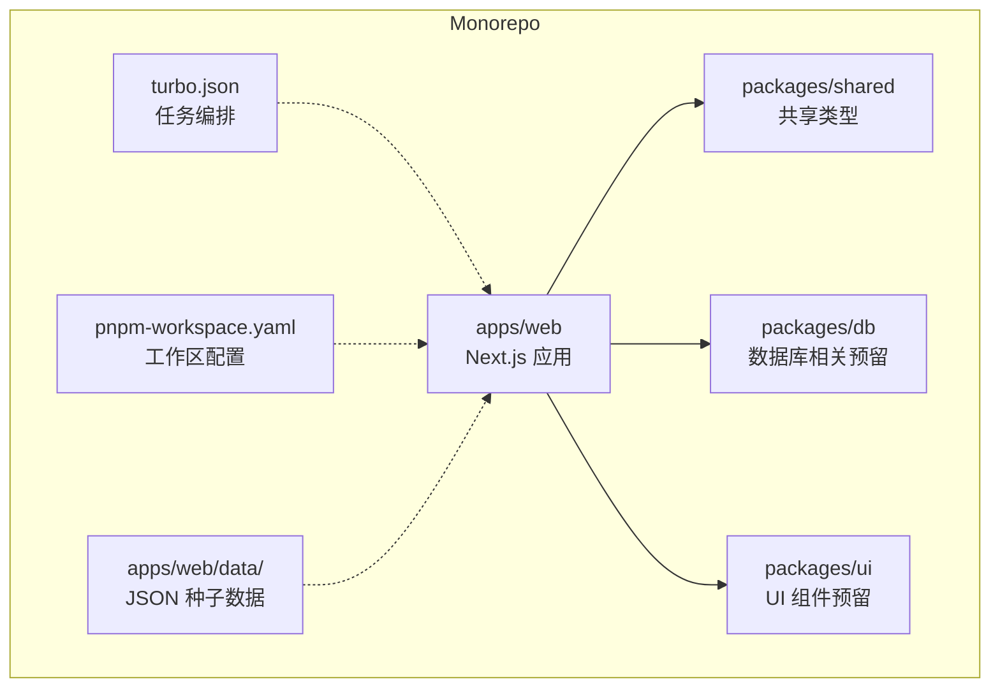
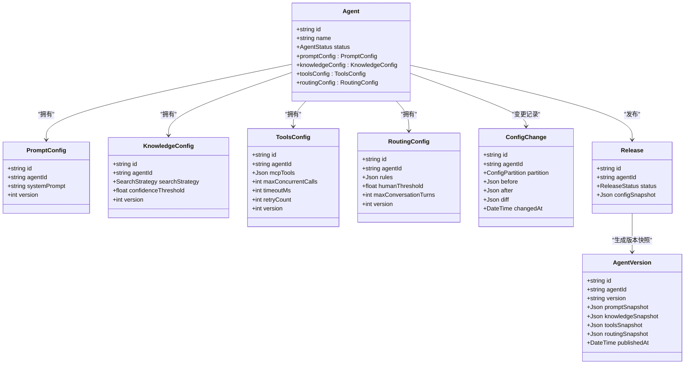
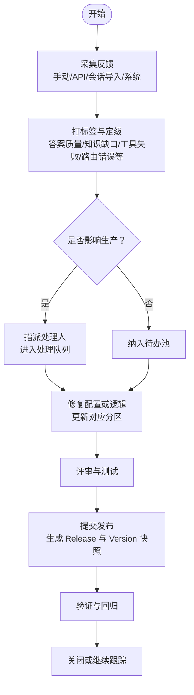
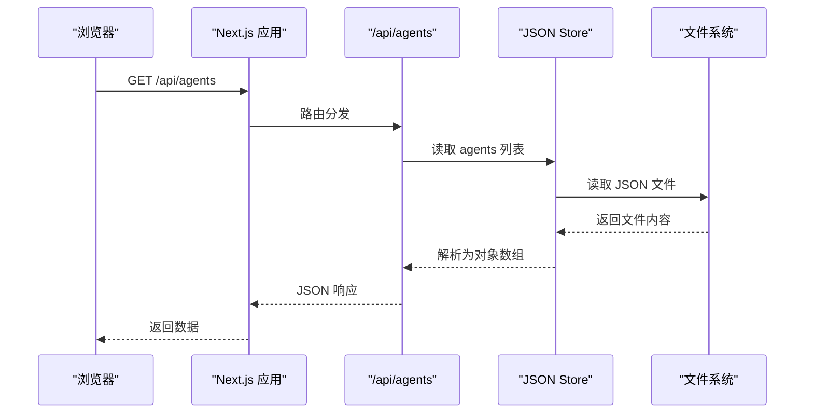
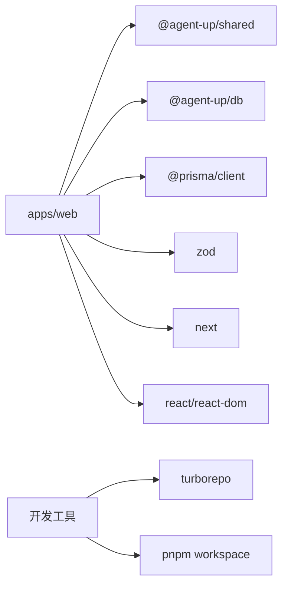

# 项目概述

<cite>
**本文引用的文件**   
- [README.md](file://README.md)
- [package.json](file://package.json)
- [turbo.json](file://turbo.json)
- [pnpm-workspace.yaml](file://pnpm-workspace.yaml)
- [apps/web/README.md](file://apps/web/README.md)
- [apps/web/package.json](file://apps/web/package.json)
- [apps/web/app/layout.tsx](file://apps/web/app/layout.tsx)
- [apps/web/app/page.tsx](file://apps/web/app/page.tsx)
- [apps/web/app/(dashboard)/layout.tsx](file://apps/web/app/(dashboard)/layout.tsx)
- [apps/web/app/(dashboard)/agents/page.tsx](file://apps/web/app/(dashboard)/agents/page.tsx)
- [apps/web/app/(dashboard)/agents/[id]/page.tsx](file://apps/web/app/(dashboard)/agents/[id]/page.tsx)
- [apps/web/app/api/agents/route.ts](file://apps/web/app/api/agents/route.ts)
- [apps/web/lib/prisma.ts](file://apps/web/lib/prisma.ts)
- [apps/web/prisma/schema.prisma](file://apps/web/prisma/schema.prisma)
- [docker-compose.yml](file://docker-compose.yml)
- [packages/shared/src/types/skill.ts](file://packages/shared/src/types/skill.ts)
- [packages/shared/src/types/feedback.ts](file://packages/shared/src/types/feedback.ts)
- [apps/web/app/api/auth/login/route.ts](file://apps/web/app/api/auth/login/route.ts)
- [apps/web/app/(auth)/login/page.tsx](file://apps/web/app/(auth)/login/page.tsx)
- [apps/web/app/(dashboard)/maas/page.tsx](file://apps/web/app/(dashboard)/maas/page.tsx)
- [apps/web/lib/data/store.ts](file://apps/web/lib/data/store.ts)
- [apps/web/data/agents/ecs-assistant.json](file://apps/web/data/agents/ecs-assistant.json)
</cite>

## 更新摘要
**变更内容**   
- 项目定位从生产系统调整为演示/面试工具
- 新增 MOCK 声明与演示用途章节
- 更新快速开始指南以反映当前 JSON 文件存储模式
- 增强 MaaS 集成边界定义
- 补充模拟登录凭据和种子数据说明

## 目录
1. [简介](#简介)
2. [项目结构](#项目结构)
3. [核心组件](#核心组件)
4. [架构总览](#架构总览)
5. [详细组件分析](#详细组件分析)
6. [依赖分析](#依赖分析)
7. [性能考虑](#性能考虑)
8. [故障排查指南](#故障排查指南)
9. [结论](#结论)
10. [附录：快速开始](#附录快速开始)

## 简介
Agent Up 是一个面向 AI Agent 的持续改进管理平台，基于三层 Loop 设计理念构建，提供从配置、发布到反馈闭环的全生命周期管理能力。**当前平台定位为演示/面试展示工具**，用于向客户现场或面试场景展示「与客户一起持续迭代 Agent」的完整闭环。

平台通过四分区配置系统（提示词、知识库、工具/MCP、路由）将复杂配置解耦，结合版本控制与审批流程，确保变更可追溯、可回滚；同时以反馈驱动改进，形成"采集—分析—修复—验证"的持续优化循环。

### 核心价值主张
- **演示友好**：完整的 Agent 改进闭环展示，无需真实数据库即可运行
- **全生命周期管理**：从草稿、发布、版本快照到回滚，覆盖 Agent 完整演进路径
- **四分区配置**：将提示词、知识检索、工具调用与路由策略分而治之，降低耦合、提升可维护性
- **版本与审批**：基于 Release 与 AgentVersion 的快照机制，支持审计与回滚
- **反馈驱动**：结构化反馈模型与标签体系，支撑问题定位与效果度量
- **Monorepo 工程化**：Next.js + TypeScript + Prisma，配合 Turborepo 与 pnpm workspace，统一脚本与缓存加速

### MOCK 声明与演示用途
**重要**：本平台当前处于**演示 / 面试形态**，所有业务数据均为 mock，且全站遵循统一的 MOCK 标注规范：

| 位置 | 标注方式 |
|------|---------|
| 侧边栏 / 登录页 / `/maas` 页 | 琥珀色 **MOCK 徽标** + 中文说明 |
| 代码内 | `// MOCK` / 文件头注释声明 mock 边界与下一里程碑 |

#### 模拟登录凭据
- **演示账号**：`allengaller` / `123`（登录后即为管理员角色）
- **认证状态**：MOCK 登录，未接入真实认证系统（NextAuth 预留位）
- **安全说明**：硬编码凭据仅用于本地演示，不应用于生产环境

#### 本地 JSON 数据源
- **数据存储**：`apps/web/data/` 目录下的本地 JSON 种子数据
- **数据范围**：包含 Agent 配置、反馈记录、发布信息、技能绑定、Wiki 页面等
- **技术实现**：通过 `lib/data/store.ts` 提供安全的 JSON 文件读写操作
- **测试隔离**：每个测试使用临时数据目录，绝不污染仓库种子数据

#### MaaS 集成边界
- **集成范围**：`/maas` 页面与种子数据中的百炼 / DashScope / Apsara Stack 相关内容均为演示口径
- **API 状态**：未接入真实模型 API，所有模型调用均为 mock 响应
- **设计文档**：详见 `docs/superpowers/specs/2026-08-21-maas-integration-mock-design.md`
- **下一里程碑**：接入真实 DashScope / 百炼 API，替换 mock 口径

**章节来源**   
- [README.md:112-123](file://README.md#L112-L123)
- [apps/web/app/api/auth/login/route.ts:4-23](file://apps/web/app/api/auth/login/route.ts#L4-L23)
- [apps/web/app/(auth)/login/page.tsx:49-57](file://apps/web/app/(auth)/login/page.tsx#L49-L57)
- [apps/web/app/(dashboard)/maas/page.tsx:1-105](file://apps/web/app/(dashboard)/maas/page.tsx#L1-L105)
- [apps/web/lib/data/store.ts:1-158](file://apps/web/lib/data/store.ts#L1-L158)

## 项目结构
仓库采用 Monorepo 组织方式，应用与共享包分离，便于复用类型与 UI 组件。

- **顶层工作区**
  - `apps/web`：Next.js 前端与 API 路由，包含页面、布局、API 入口与数据库客户端封装
  - `packages/shared`：跨包共享的类型定义（如 Skill、Feedback）
  - `packages/db`、`packages/ui`：预留的数据库与 UI 包（当前未展开）
- **关键配置文件**
  - `turbo.json`：Turborepo 任务编排与缓存策略
  - `pnpm-workspace.yaml`：工作区包发现规则
  - `docker-compose.yml`：本地开发依赖（PostgreSQL、MinIO）



**图表来源**   
- [turbo.json:1-31](file://turbo.json#L1-L31)
- [pnpm-workspace.yaml:1-4](file://pnpm-workspace.yaml#L1-L4)
- [apps/web/package.json:1-38](file://apps/web/package.json#L1-L38)

**章节来源**   
- [pnpm-workspace.yaml:1-4](file://pnpm-workspace.yaml#L1-L4)
- [turbo.json:1-31](file://turbo.json#L1-L31)
- [apps/web/package.json:1-38](file://apps/web/package.json#L1-L38)

## 核心组件
- **应用层（Next.js App Router）**
  - 根布局与元信息：设置站点标题与描述
  - 仪表盘布局：侧边导航（我的 Agent、反馈中心、发布审批、Skills 市场、设置）
  - 页面：首页、Agent 列表、Agent 详情（四分区配置 Tab）、登录页占位
- **API 层（Route Handlers）**
  - `/api/agents`：列出可用端点，涵盖 CRUD、分区配置读写、提交发布与回滚
- **数据层（JSON 文件存储）**
  - 当前使用 `apps/web/data/` 目录下的 JSON 文件作为数据源
  - 通过 `lib/data/store.ts` 提供安全的文件读写操作
  - 支持查询、过滤、排序和分页功能
- **基础设施**
  - Docker Compose：PostgreSQL 与 MinIO 服务，健康检查与卷持久化
  - Prisma Client 单例封装：按环境调整日志级别

**章节来源**   
- [apps/web/app/layout.tsx:1-20](file://apps/web/app/layout.tsx#L1-L20)
- [apps/web/app/(dashboard)/layout.tsx:1-48](file://apps/web/app/(dashboard)/layout.tsx#L1-L48)
- [apps/web/app/(dashboard)/agents/page.tsx:1-28](file://apps/web/app/(dashboard)/agents/page.tsx#L1-L28)
- [apps/web/app/(dashboard)/agents/[id]/page.tsx:1-42](file://apps/web/app/(dashboard)/agents/[id]/page.tsx#L1-L42)
- [apps/web/app/api/agents/route.ts:1-19](file://apps/web/app/api/agents/route.ts#L1-L19)
- [apps/web/lib/data/store.ts:1-158](file://apps/web/lib/data/store.ts#L1-L158)
- [docker-compose.yml:1-39](file://docker-compose.yml#L1-L39)

## 架构总览
整体采用前后端同仓的 Next.js 应用，前端使用 App Router 与 Tailwind 样式，后端通过 Route Handler 暴露 REST 风格接口，**当前数据访问通过 JSON 文件存储**，数据库为 PostgreSQL（schema 已就绪但未使用），对象存储使用 S3 兼容的 MinIO（用于 Wiki 快照与附件）。

```mermaid
graph TB
U["浏览器"] --> N["Next.js 应用<br/>App Router + Route Handlers"]
N --> S["JSON Store<br/>文件系统存储"]
S --> F["JSON 文件<br/>apps/web/data/"]
N --> P["Prisma Client<br/>数据库客户端预留"]
P --> DB["PostgreSQL<br/>暂未使用"]
N --> OBJ["对象存储<br/>MinIO (S3 兼容)<br/>暂未使用"]
subgraph "Monorepo"
N
SH["packages/shared<br/>类型定义"]
end
SH -.-> N
```



**图表来源**   
- [apps/web/app/api/agents/route.ts:1-19](file://apps/web/app/api/agents/route.ts#L1-L19)
- [apps/web/lib/data/store.ts:1-158](file://apps/web/lib/data/store.ts#L1-L158)
- [docker-compose.yml:1-39](file://docker-compose.yml#L1-L39)
- [packages/shared/src/types/skill.ts:1-48](file://packages/shared/src/types/skill.ts#L1-L48)

## 详细组件分析

### 四分区配置与版本控制
四分区配置将 Agent 能力拆分为四个独立领域，分别持久化为实体，并通过 ConfigChange 记录差异，Release 与 AgentVersion 实现发布与快照。



**图表来源**   
- [apps/web/prisma/schema.prisma:61-173](file://apps/web/prisma/schema.prisma#L61-L173)
- [apps/web/prisma/schema.prisma:192-214](file://apps/web/prisma/schema.prisma#L192-L214)
- [apps/web/prisma/schema.prisma:298-354](file://apps/web/prisma/schema.prisma#L298-L354)

**章节来源**   
- [apps/web/prisma/schema.prisma:61-173](file://apps/web/prisma/schema.prisma#L61-L173)
- [apps/web/prisma/schema.prisma:192-214](file://apps/web/prisma/schema.prisma#L192-L214)
- [apps/web/prisma/schema.prisma:298-354](file://apps/web/prisma/schema.prisma#L298-L354)

### 反馈驱动改进闭环
反馈模型支持多来源、多维标签与严重等级，并与目标分区关联，便于定位问题域并驱动配置迭代。



**图表来源**   
- [apps/web/prisma/schema.prisma:220-292](file://apps/web/prisma/schema.prisma#L220-L292)
- [packages/shared/src/types/feedback.ts:1-61](file://packages/shared/src/types/feedback.ts#L1-L61)

**章节来源**   
- [apps/web/prisma/schema.prisma:220-292](file://apps/web/prisma/schema.prisma#L220-L292)
- [packages/shared/src/types/feedback.ts:1-61](file://packages/shared/src/types/feedback.ts#L1-L61)

### API 工作流（示例：获取 Agent 列表）
以下序列图展示一个典型的前端到后端的请求链路，体现 Next.js Route Handler 与 JSON 文件存储的协作。



**图表来源**   
- [apps/web/app/api/agents/route.ts:1-19](file://apps/web/app/api/agents/route.ts#L1-L19)
- [apps/web/lib/data/store.ts:1-158](file://apps/web/lib/data/store.ts#L1-L158)

**章节来源**   
- [apps/web/app/api/agents/route.ts:1-19](file://apps/web/app/api/agents/route.ts#L1-L19)
- [apps/web/lib/data/store.ts:1-158](file://apps/web/lib/data/store.ts#L1-L158)

### 页面与导航
- 根布局设置站点标题与描述
- 仪表盘布局提供侧边导航，包括"我的 Agent、反馈中心、发布审批、Skills 市场、设置"
- 首页引导进入工作台或登录
- Agent 列表页提供搜索框与新建入口
- Agent 详情页提供四分区配置 Tab 与操作按钮（提交发布、查看版本历史、查看反馈）

**章节来源**   
- [apps/web/app/layout.tsx:1-20](file://apps/web/app/layout.tsx#L1-L20)
- [apps/web/app/(dashboard)/layout.tsx:1-48](file://apps/web/app/(dashboard)/layout.tsx#L1-L48)
- [apps/web/app/page.tsx:1-31](file://apps/web/app/page.tsx#L1-L31)
- [apps/web/app/(dashboard)/agents/page.tsx:1-28](file://apps/web/app/(dashboard)/agents/page.tsx#L1-L28)
- [apps/web/app/(dashboard)/agents/[id]/page.tsx:1-42](file://apps/web/app/(dashboard)/agents/[id]/page.tsx#L1-L42)

## 依赖分析
- **运行时依赖**
  - Next.js、React、React DOM：前端框架与渲染
  - @prisma/client：数据库客户端（预留）
  - zod：运行时校验（在 web 包中声明）
  - @agent-up/shared、@agent-up/db：工作区内共享包引用
- **开发依赖**
  - Tailwind CSS v4、ESLint、TypeScript、Prisma CLI
- **工程化**
  - Turborepo：任务编排与缓存
  - pnpm workspace：包发现与链接



**图表来源**   
- [apps/web/package.json:1-38](file://apps/web/package.json#L1-L38)
- [turbo.json:1-31](file://turbo.json#L1-L31)
- [pnpm-workspace.yaml:1-4](file://pnpm-workspace.yaml#L1-L4)

**章节来源**   
- [apps/web/package.json:1-38](file://apps/web/package.json#L1-L38)
- [turbo.json:1-31](file://turbo.json#L1-L31)
- [pnpm-workspace.yaml:1-4](file://pnpm-workspace.yaml#L1-L4)

## 性能考虑
- **构建与开发缓存**：通过 Turborepo 的任务缓存减少重复构建与 lint 时间
- **文件 I/O 优化**：JSON 文件存储适合小规模演示数据，避免数据库连接开销
- **查询优化**：Schema 中对常用字段建立索引（如 Agent.status、Feedback.severity/status、ConfigChange.agentId/partition），有助于列表与筛选性能
- **并发与超时**：ToolsConfig 中的最大并发、超时与重试参数可用于控制外部工具调用的资源占用与稳定性
- **静态资源与字体**：Next.js 内置字体优化可减少首屏阻塞

## 故障排查指南
- **数据文件损坏**
  - 检查 `apps/web/data/` 目录下 JSON 文件格式是否正确
  - 确认文件权限允许读写操作
- **端口冲突**
  - 默认端口 3000，避免与本机服务冲突
- **构建缓存异常**
  - 清理 `.turbo` 与 `.next` 目录后重新构建
- **演示数据问题**
  - 确认种子数据文件存在且格式正确
  - 检查模拟登录凭据是否为 `allengaller` / `123`

**章节来源**   
- [apps/web/lib/data/store.ts:37-50](file://apps/web/lib/data/store.ts#L37-L50)
- [docker-compose.yml:1-39](file://docker-compose.yml#L1-L39)
- [turbo.json:1-31](file://turbo.json#L1-L31)

## 结论
Agent Up 以清晰的 Monorepo 结构与分层设计，将 AI Agent 的配置、发布与反馈纳入统一的治理体系。**当前作为演示/面试工具**，通过 JSON 文件存储和 MOCK 数据实现了完整的 Agent 改进闭环展示。四分区配置与版本快照保障变更可控，反馈闭环驱动持续改进，Turbo 与 pnpm 提升工程效率。建议在后续迭代中逐步接入真实数据库、认证系统和模型 API，向生产环境演进。

## 附录：快速开始
- **环境要求**
  - Node.js >= 20
  - pnpm 9.x
  - Docker（可选，用于未来数据库与对象存储）
- **安装步骤**
  - 克隆仓库并安装依赖
    ```bash
    pnpm install
    ```
  - 启动开发服务器
    ```bash
    pnpm dev
    ```
  - 打开浏览器访问 http://localhost:3000
- **基本使用示例**
  - **模拟登录**：使用 `allengaller` / `123` 登录
  - 进入"我的 Agent"，查看预置的 ECS/RDS 助手
  - 在"配置中心"编辑四分区配置（提示词、知识库、工具/MCP、路由）
  - 提交发布，查看版本历史与回滚
  - 在"反馈中心"录入反馈，关联目标分区，推动改进
  - 访问"/maas"页面了解 MaaS 集成演示

**章节来源**   
- [README.md:68-102](file://README.md#L68-L102)
- [apps/web/app/api/auth/login/route.ts:4-23](file://apps/web/app/api/auth/login/route.ts#L4-L23)
- [apps/web/app/(auth)/login/page.tsx:49-57](file://apps/web/app/(auth)/login/page.tsx#L49-L57)
- [apps/web/data/agents/ecs-assistant.json:1-108](file://apps/web/data/agents/ecs-assistant.json#L1-L108)