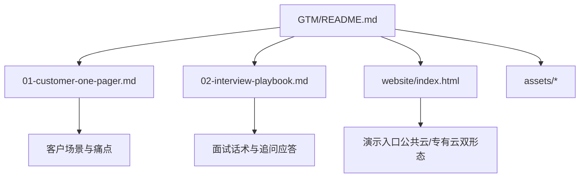
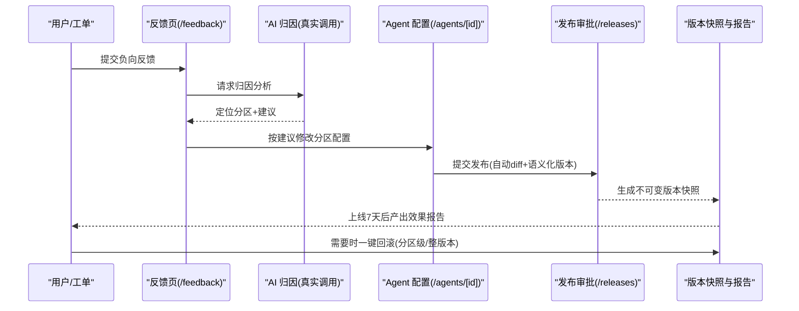
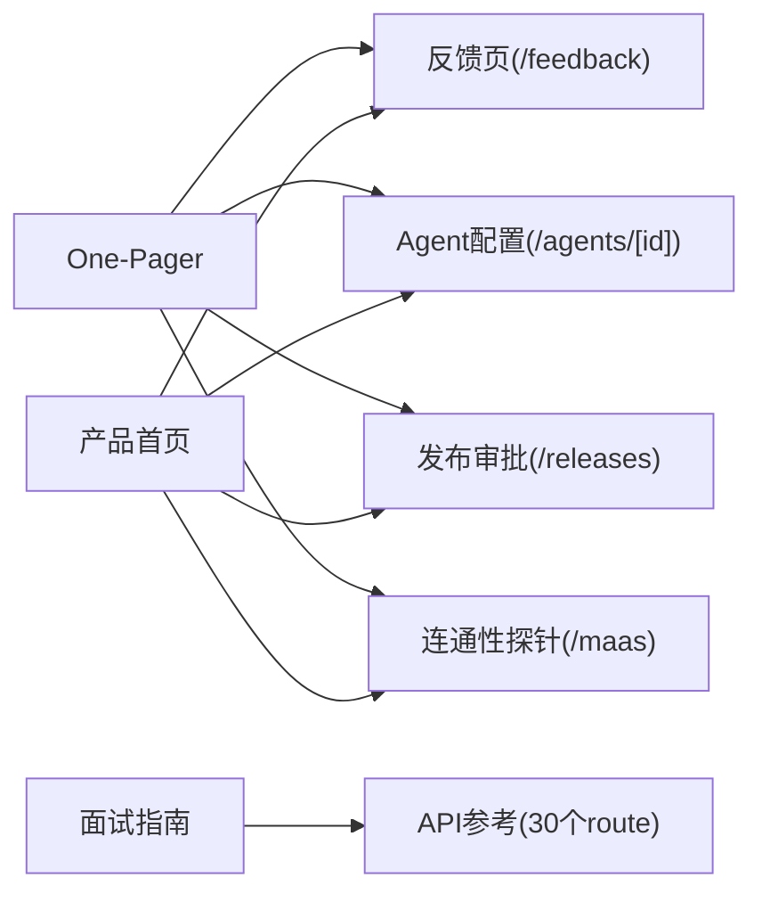

# GTM 营销材料

<cite>
**本文引用的文件**
- [GTM/README.md](file://GTM/README.md)
- [GTM/01-customer-one-pager.md](file://GTM/01-customer-one-pager.md)
- [GTM/02-interview-playbook.md](file://GTM/02-interview-playbook.md)
- [GTM/website/index.html](file://GTM/website/index.html)
- [docs/api/api-reference.md](file://docs/api/api-reference.md)
- [apps/web/app/(dashboard)/maas/page.tsx](file://apps/web/app/(dashboard)/maas/page.tsx)
- [apps/web/app/(dashboard)/feedback/page.tsx](file://apps/web/app/(dashboard)/feedback/page.tsx)
- [apps/web/app/(dashboard)/releases/page.tsx](file://apps/web/app/(dashboard)/releases/page.tsx)
- [apps/web/app/(dashboard)/agents/[id]/page.tsx](file://apps/web/app/(dashboard)/agents/%5Bid%5D/page.tsx)
</cite>

## 目录
1. [简介](#简介)
2. [项目结构](#项目结构)
3. [核心组件](#核心组件)
4. [架构总览](#架构总览)
5. [详细组件分析](#详细组件分析)
6. [依赖关系分析](#依赖关系分析)
7. [性能与可演示性](#性能与可演示性)
8. [故障排查指南](#故障排查指南)
9. [结论](#结论)
10. [附录：演示脚本与口径](#附录演示脚本与口径)

## 简介
本文件面向市场、售前与客户成功团队，系统化梳理 agent-up 的 Go-To-Market（GTM）物料体系与对外叙事。内容聚焦“为什么值得要”而非“怎么做”，并配套可落地的演示动线、事实口径与边界声明，确保在客户现场或面试场景中统一表达、真实可信。

## 项目结构
GTM 目录是独立于工程文档（docs/）的对外材料库，包含：
- 文本物料：企业客户 One-Pager、面试话术转换指南
- 静态首页：单文件 HTML 产品首页，零构建即可运行
- 资产目录：海报等视觉素材（当前为空，后续扩展）

图表来源
- [GTM/README.md:1-44](file://GTM/README.md#L1-L44)

章节来源
- [GTM/README.md:1-44](file://GTM/README.md#L1-L44)

## 核心组件
- 企业客户 One-Pager：面向企业客户的价值主张、痛点、闭环能力、部署形态与现场演示动线，强调“模型是引擎，agent-up 把引擎变成持续改进的生产系统”。
- 面试话术转换指南：将同一套项目素材按全栈 SA / MaaS SA 岗位切换侧重，提供电梯陈述、预期追问与应答要点、演示前自检清单。
- 产品首页（单文件 HTML）：面向通用受众的统一入口，展示闭环图、能力矩阵、对比表、演示动线与诚实边界，支持本地快速预览与静态托管。

章节来源
- [GTM/01-customer-one-pager.md:1-82](file://GTM/01-customer-one-pager.md#L1-L82)
- [GTM/02-interview-playbook.md:1-74](file://GTM/02-interview-playbook.md#L1-L74)
- [GTM/website/index.html:1-537](file://GTM/website/index.html#L1-L537)

## 架构总览
从 GTM 视角，agent-up 的核心是“反馈 → AI 归因 → 改配置 → 审批发布 → 效果报告 → 一键回滚”的闭环，并在公共云与专有云两种部署形态下保持一致的治理与度量能力。

图表来源
- [GTM/01-customer-one-pager.md:21-29](file://GTM/01-customer-one-pager.md#L21-L29)
- [docs/api/api-reference.md:39-89](file://docs/api/api-reference.md#L39-L89)

章节来源
- [GTM/01-customer-one-pager.md:21-29](file://GTM/01-customer-one-pager.md#L21-L29)
- [docs/api/api-reference.md:39-89](file://docs/api/api-reference.md#L39-L89)

## 详细组件分析

### 企业客户 One-Pager
- 目标受众：企业客户（工单/客服/运维 Agent 负责团队）
- 关键信息：三痛点（改不动/不敢改/说不清）、四分区配置、Release 审批与不可变版本、7 天效果报告、AI 增强（真实 LLM）、全量审计、双形态部署
- 演示动线：/maas → /feedback → /agents → /releases → 版本历史（含回滚）

章节来源
- [GTM/01-customer-one-pager.md:1-82](file://GTM/01-customer-one-pager.md#L1-L82)

### 面试话术转换指南
- 目标受众：面试官（全栈 SA / MaaS SA）
- 内容要点：三种长度电梯陈述、岗位侧重切换、预期追问与应答、One-Pager 到面试话术映射、演示前 1 分钟自检
- 演示重点：连通性证明、AI 归因、试聊验证、审批发布与回滚

章节来源
- [GTM/02-interview-playbook.md:1-74](file://GTM/02-interview-playbook.md#L1-L74)

### 产品首页（单文件 HTML）
- 功能：统一对外入口，展示闭环图、能力矩阵、对比表、演示动线、诚实边界与下一步行动
- 技术特征：零构建单文件，支持本地预览与任意静态托管；响应式布局与滚动动画
- 演示提示：MOCK 数据与 LIVE 调用均有徽标标注，便于现场说明边界

章节来源
- [GTM/website/index.html:1-537](file://GTM/website/index.html#L1-L537)

## 依赖关系分析
GTM 物料与产品实现之间的对应关系如下：

图表来源
- [GTM/01-customer-one-pager.md:60-67](file://GTM/01-customer-one-pager.md#L60-L67)
- [docs/api/api-reference.md:39-89](file://docs/api/api-reference.md#L39-L89)
- [GTM/website/index.html:446-472](file://GTM/website/index.html#L446-L472)

章节来源
- [GTM/01-customer-one-pager.md:60-67](file://GTM/01-customer-one-pager.md#L60-L67)
- [docs/api/api-reference.md:39-89](file://docs/api/api-reference.md#L39-L89)
- [GTM/website/index.html:446-472](file://GTM/website/index.html#L446-L472)

## 性能与可演示性
- 可演示性：所有 GTM 页面均指向真实路由（/maas、/feedback、/agents、/releases），避免“PPT 演示”；LIVE 调用具备时延与 tokens 指标，便于量化呈现。
- 性能关注点：效果报告采用懒计算，不占用运行时；LLM 调用有超时与错误码约定，便于稳定演示。
- 演示准备：遵循面试指南中的“演示前 1 分钟自检”，确保网络、种子数据与 LIVE 调用可用。

章节来源
- [GTM/02-interview-playbook.md:68-74](file://GTM/02-interview-playbook.md#L68-L74)
- [docs/api/api-reference.md:74-89](file://docs/api/api-reference.md#L74-L89)

## 故障排查指南
- 认证问题：登录为 MOCK，使用演示账号 allengaller / 123；若需生产化，推进真实认证里程碑。
- LLM 调用失败：检查环境变量与凭据；未配置返回 503，上游错误 502，超时 504；测试中通过 mock fetch 避免消耗 tokens。
- 数据一致性：所有写操作有 append-only 审计日志；状态机拒绝非法转移（如 NEW→RESOLVED）。
- 演示环境：业务数据为种子数据，页面带 MOCK 徽标；AI 能力为真实调用，带 LIVE 徽标。

章节来源
- [docs/api/api-reference.md:17-35](file://docs/api/api-reference.md#L17-L35)
- [docs/api/api-reference.md:74-94](file://docs/api/api-reference.md#L74-L94)
- [GTM/website/index.html:474-496](file://GTM/website/index.html#L474-L496)

## 结论
agent-up 的 GTM 物料以“闭环治理 + 真实可演示”为核心，围绕企业客户与面试场景提供一致、可验证的对外表达。通过 One-Pager、面试指南与单页产品首页的组合，既能快速建立价值认知，也能在现场用真实路由与 LLM 调用完成端到端演示，降低信任成本、提升转化效率。

## 附录：演示脚本与口径
- 标准演示动线（约 8 分钟）：/maas 连通性 → /feedback 归因 → /agents 改配置并试聊 → /releases 审批发布 → 版本历史查看效果报告与回滚
- 事实口径：测试数、Schema 数量、API route 数量、真实 LLM 集成点、演示账号等，详见 README 事实口径表
- 边界声明：业务数据 MOCK，AI 能力 LIVE；生产化路线明确（持久化、认证、CI）

章节来源
- [GTM/01-customer-one-pager.md:60-72](file://GTM/01-customer-one-pager.md#L60-L72)
- [GTM/README.md:27-37](file://GTM/README.md#L27-L37)
- [GTM/website/index.html:446-496](file://GTM/website/index.html#L446-L496)