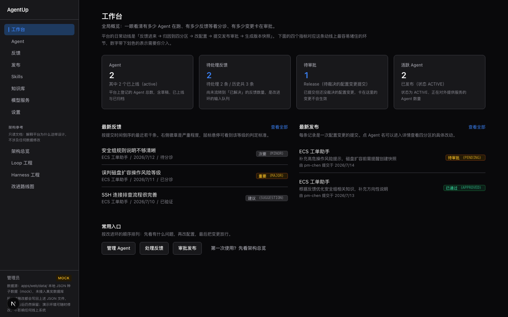
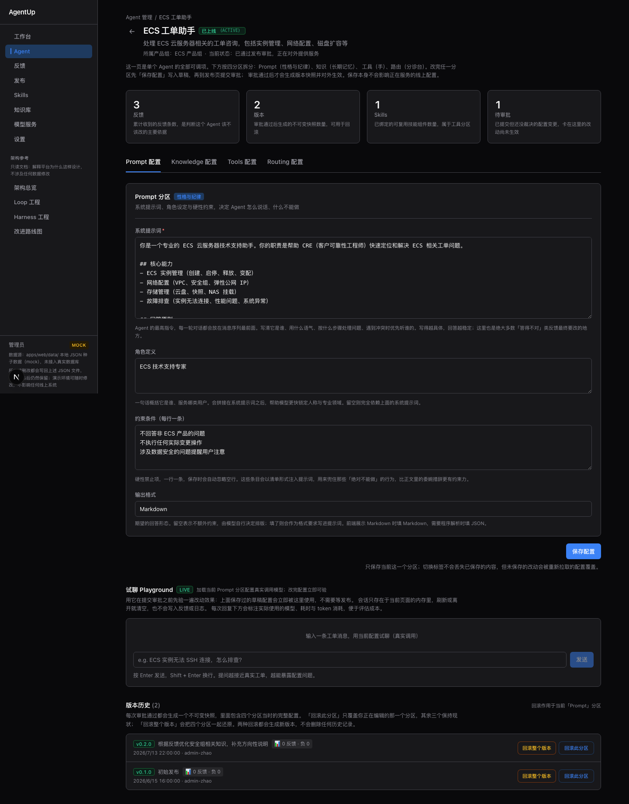
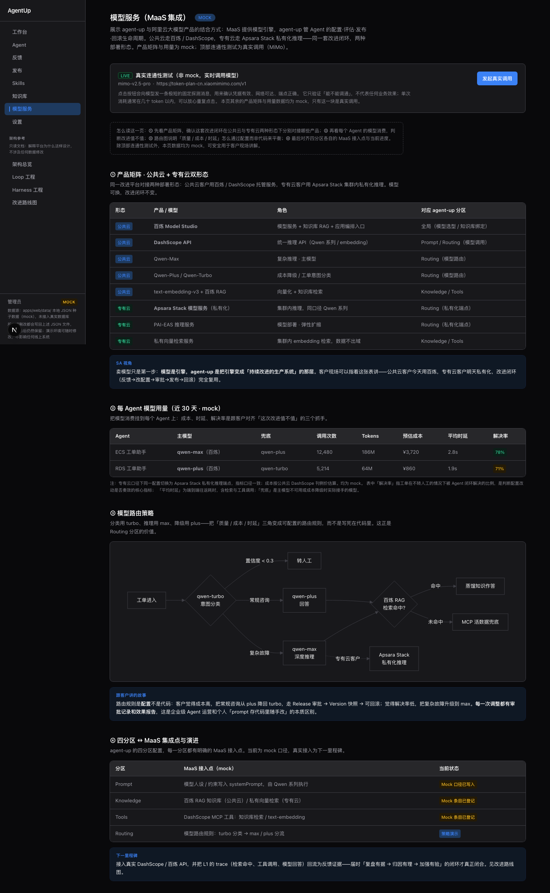
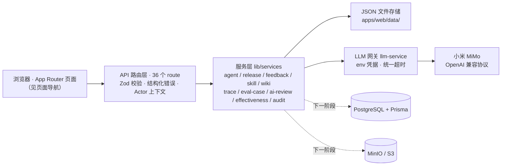
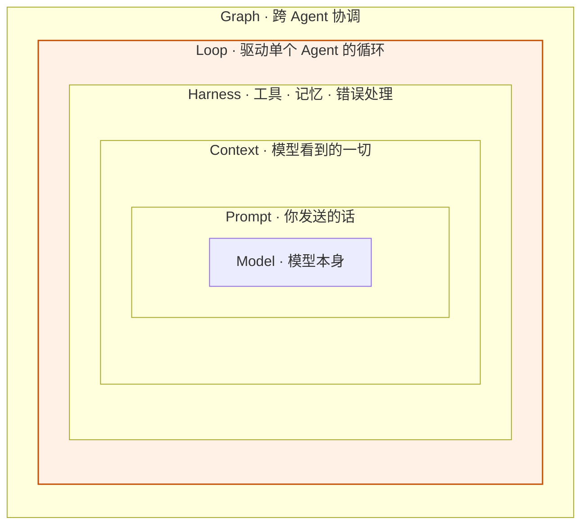

# Agent 改进平台 (agent-up)

> better agent, better life

     

基于三层 Loop 设计理念的 Agent 持续改进管理平台。面向专有云工单场景，支持各产品组维护改进各自的 Agent 配置（Prompt / 知识库 / 工具 / 路由），通过审批流程发布新版本。

同时可作为**客户现场演示 / 面试展示工具**：展示「与客户一起持续迭代 Agent」的完整闭环，并通过 `/maas` 页面演示与阿里云大模型产品（MaaS）的结合方式（mock 口径，见下文 [MOCK 声明](#mock-声明与演示用途)）。

## 产品预览

**工作台** —— 全局概况与「反馈 → 归因 → 配置 → 发布」动线入口：



**Agent 详情** —— 四分区编辑器（Prompt / Knowledge / Tools / Routing）、试聊 Playground（真实 LLM）与版本历史 / 一键回滚：



**模型服务（MaaS 集成）** —— 公共云 + 专有云双形态产品矩阵与模型路由策略（顶部 LIVE 区块为真实调用）：



> 更多物料（客户 One-Pager、面试话术、产品首页、海报）见 [GTM/README.md](GTM/README.md)。

## 目录

- [产品预览](#产品预览)
- [核心特性](#核心特性)
- [技术栈](#技术栈)
- [项目结构](#项目结构)
- [系统架构](#系统架构)
- [快速开始](#快速开始)（[前置条件](#前置条件) / [安装](#安装) / [开发](#开发) / [常用命令](#常用命令) / [测试](#测试)）
- [MOCK 声明与演示用途](#mock-声明与演示用途)
- [核心概念](#核心概念)
- [页面导航](#页面导航)
- [MaaS 集成展示](#maas-集成展示maas-页)
- [LLM 真实接入（小米 MiMo）](#llm-真实接入小米-mimo)
- [API 端点](#api-端点)
- [工程纪律（已落地）](#工程纪律已落地)
- [架构参考（Web 页面）](#架构参考web-页面)
- [文档索引](#文档索引)
- [环境变量](#环境变量)
- [常见问题（FAQ）](#常见问题faq)
- [下一步（真实化里程碑）](#下一步真实化里程碑)
- [参与贡献](#参与贡献)
- [许可证](#许可证)

## 核心特性

- **Agent 四分区编辑器** —— Prompt / Knowledge / Tools / Routing 分区编辑、分区保存入草稿；改完任一分区不影响正在服务的线上配置，审批通过后才生成版本快照对外生效
- **发布审批流** —— 提交发布时自动计算与上一版本的真 diff 与语义化版本号（SemVer），工单团队审批通过后生成不可变版本快照
- **双粒度回滚** —— 分区级一键回滚（只还原正在编辑的那一个分区，其余三个保持现状）+ 整版本回滚（四个分区一起还原）；两种回滚都会生成新版本，不删除任何历史记录
- **反馈闭环** —— 反馈按严重程度分诊 → AI 归因（真实 LLM）→ 定位到分区改进 → 发布验证；状态机拒绝非法流转（如 NEW→RESOLVED）
- **效果报告** —— 发布 7 天后自动生成效果报告（懒计算），衡量「这次改进值不值」
- **Skills / Wiki 管理** —— 可复用技能组件与 Agent 绑定；Wiki Vault + Page 两级知识层管理
- **RBAC + 审计** —— 三角色模型与权限配置，所有写操作 append-only 审计日志
- **MaaS 集成展示** —— 公共云 + 专有云双形态产品矩阵、模型路由策略，一页讲清与阿里云大模型产品的结合方式
- **真实 LLM 接入** —— 连通性测试 / 反馈 AI 归因 / 发布 AI 变更摘要 / Agent 试聊 Playground 四个集成点真实调用小米 MiMo，页面以 LIVE 徽标与 MOCK 区分
- **Chrome 插件 PoC（反馈收集器）** —— 在 Agent 试聊场景一键沉淀反馈，自动携带会话上下文（来源 / URL / 时间 / 对话原文）直落反馈池；纯静态 MV3、零权限、不改主仓库（详见 [chrome-extension/README.md](chrome-extension/README.md)）
- **架构参考** —— Loop 工程 / Harness 工程 / 改进路线图参考页面，附行业实践对照与失败模式诊断

## 技术栈

- **框架**: Next.js 16 (App Router, Turbopack)
- **语言**: TypeScript (strict mode)
- **样式**: Tailwind CSS 4
- **校验**: Zod（26 个 schema 覆盖所有 API 入参）
- **测试**: Vitest 3 + v8 coverage（268 个测试）
- **LLM**: 小米 MiMo（mimo-v2.5-pro，OpenAI 兼容协议 Token Plan）——已真实接入 5 个集成点
- **数据库**: PostgreSQL 16 + Prisma ORM（schema 已就绪，运行时暂用 JSON 文件）
- **对象存储**: MinIO (S3 兼容)
- **构建**: Turborepo monorepo + pnpm workspaces

## 项目结构

```
agent-up/
├── apps/
│   └── web/                        # Next.js 全栈应用
│       ├── app/                    # App Router
│       │   ├── (auth)/             # 登录页（MOCK 登录）
│       │   ├── (dashboard)/        # 工作台页面
│       │   │   ├── agents/         # Agent 管理 + 四分区编辑器
│       │   │   ├── releases/       # 发布审批 + diff 查看器
│       │   │   ├── maas/           # 模型服务（MaaS 集成展示，MOCK）
│       │   │   ├── architecture/   # 架构参考（Loop / Harness / Roadmap）
│       │   │   ├── feedback/       # 反馈管理
│       │   │   ├── skills/         # Skills 管理
│       │   │   ├── wiki/           # 知识库管理
│       │   │   └── settings/       # 设置（角色/权限/审计日志）
│       │   ├── api/                # API 路由（36 个 route 文件，含 5 个真实 LLM 端点）
│       │   └── components/         # 共享组件（含 mermaid 渲染器）
│       ├── demo/                   # 演示模式：内存 mock API + fetch 拦截（静态 Demo 用）
│       ├── demo-deploy/dist/       # 静态导出产物（pnpm build:demo，gitignored）
│       ├── lib/
│       │   ├── errors.ts           # 结构化错误体系（AppError 层级）
│       │   ├── context.ts          # Actor 请求上下文（为 NextAuth 留接口）
│       │   ├── versioning.ts       # 语义化版本（SemVer）计算
│       │   ├── schemas.ts          # Zod 校验 schema（26 个）
│       │   ├── diff.ts             # JSON diff 工具
│       │   ├── utils.ts            # API 响应 / 分页 / validateBody
│       │   ├── data/store.ts       # JSON 文件存储（可注入临时目录）
│       │   └── services/           # 业务逻辑层
│       │       ├── agent-service          # Agent CRUD + 配置版本管理
│       │       ├── release-service        # 发布流（真实 diff + SemVer + 审计）
│       │       ├── feedback-service       # 反馈（含状态机校验）
│       │       ├── skill-service          # Skills + 绑定
│       │       ├── wiki-service           # Wiki Vault + Page
│       │       ├── retrieval-service      # BM25-lite 本地检索（wiki 关键词检索）
│       │       ├── effectiveness-service  # 版本效果报告（懒计算）
│       │       ├── trace-service          # 试聊 trace 落盘 + 打分
│       │       ├── eval-case-service      # 评测用例库（试聊沉淀）
│       │       ├── ai-review-service      # 发布前 AI 评测（快照 replay + 确定性断言 + 判官）
│       │       ├── maas-usage-service      # MaaS 每 Agent 真实用量聚合（traces 汇总）
│       │       ├── evidence-chain-service  # 任务证据链（只读时间线聚合）
│       │       ├── llm-service            # LLM 网关（MiMo，env 凭据，零硬编码）
│       │       └── audit-service          # 审计日志（append-only）
│       └── data/                   # 种子数据（JSON 文件，mock）
├── packages/
│   ├── db/                         # Prisma 数据库层（schema 就绪）
│   ├── shared/                     # 共享类型定义
│   └── ui/                         # UI 组件库（预留）
├── docs/                           # 文档体系（总索引见 docs/README.md）
│   ├── superpowers/specs/          # 设计规格书（带状态/版本标记）
│   ├── evaluation/                 # 项目评估 + Harness/Loop 参考
│   ├── reports/                    # 阶段性交付报告（命名规范见目录 README）
│   ├── api/                        # API 接口完整说明（36 route）
│   └── guides/                     # 部署指南 + 故障排查手册
├── GTM/                            # Go-To-Market 物料库（索引与口径见 GTM/README.md）
├── chrome-extension/               # Chrome 插件 PoC（反馈收集器，零主仓库改动）
├── docker-compose.yml              # PostgreSQL + MinIO
└── turbo.json                      # Turborepo 配置
```

## 系统架构

当前运行形态是「文件即数据库」：页面 → API 路由 → 服务层 → JSON 文件；LLM 调用统一走网关出站。
Prisma（schema 就绪）与 MinIO 为下一阶段持久化预留，业务代码尚未接入。



分层规则：route 只做协议适配（校验、错误映射、响应包装），业务逻辑全部在服务层，存储读写统一走
`lib/data/store.ts`（支持注入临时目录，是测试隔离的基础）。

## 快速开始

### 前置条件

- Node.js >= 20
- pnpm >= 9

### 安装

```bash
pnpm install
```

### 开发

```bash
pnpm dev
```

访问 http://localhost:3000

> **关于基础设施**：本仓库**当前**使用文件 JSON 存储（`apps/web/data/` 目录）跑通开发体验，
> 数据流是 `lib/data/store.ts` → 文件系统。`docker-compose.yml`（PostgreSQL + MinIO）
> 与 `packages/db/prisma/schema.prisma` 是为下一阶段（持久化落地）准备的，
> 业务代码尚未接入 Prisma Client，因此**不需要** `docker compose up` 或 `pnpm db:push`。

### 常用命令

```bash
pnpm dev                 # 启动开发服务器（turbo）
pnpm build               # 全量构建
pnpm lint                # ESLint 检查（全绿，0 problems）
cd apps/web && pnpm test                # 运行全部测试（单元 + API 集成）
cd apps/web && pnpm test -- --coverage  # 带覆盖率报告
```

### 测试

**268 个测试，24 个测试文件：**

- **单元测试**（`lib/__tests__/`，14 个文件）：versioning、errors、schemas、diff、store、audit-service、release-service、feedback-service（状态机）、agent-service、skill-service、wiki-service、retrieval-service、utils、llm-service（mock fetch）
- **API 集成测试**（`app/api/__tests__/`，10 个文件）：agents、releases（含审批流 + diff）、feedback、skills、wiki、versions/rollback、effectiveness 全链路、trace/eval 闭环（trace-eval-ai-review）、MaaS 用量聚合（maas-usage）、证据链（evidence-chain）+ LLM 集成点（llm-integrations，mock fetch 绝不发真实请求），验证 status / body / 审计副作用
- **隔离**：每个测试用临时数据目录（`_setDataDir`），绝不污染仓库种子数据

## 演示双轨（本地全栈 / 静态导出 Demo）

同一代码库支持两种运行形态，均由 `demo/` 目录支撑：

- **本地全栈（默认）**：`pnpm dev`，真实 Next.js route handler + JSON 文件存储，可选接真实 LLM。
- **纯静态 Demo**：`cd apps/web && pnpm build:demo`（`DEMO_EXPORT=1 next build`）→ 产物在 `demo-deploy/dist/`（gitignored），可托管到任意静态 CDN，无需 Node 服务端。

`demo/` 目录是 Demo 模式核心：`mock-server.ts` 用内存态镜像全部 API 的响应形状（成功/错误封装、分页、join 字段），`install-fetch.ts` 在浏览器端幂等拦截同源 `/api/*` 请求，`seed.ts` 直接 import `data/` 种子 JSON 作为初始状态；root layout 仅在 `NEXT_PUBLIC_DEMO_MODE=1` 时挂载 `DemoProvider`（含演示角标）。刷新页面即重置内存数据。

> 线上可点击 Demo：https://qtb3subkcwy5.meoo.fun（事实口径见 [GTM/README.md](GTM/README.md)）

## Chrome 插件（反馈收集器 PoC）

试聊场景的一键反馈入口：在 Agent 详情页的 Playground 处理完一条工单后，点扩展图标即可
评级并提交——反馈自动携带最近 6 轮对话作为证据直落反馈池，随后可走 AI 归因 → 改配置 → 审批发布的完整闭环。

- 纯静态 Manifest V3，零构建、零权限（仅注入 localhost:3000），**不改主仓库任何代码**：
  提交由 content script 以页面同源身份执行，无 CORS；agentId 以当前页面 URL 为准，防 SPA 串台
- 提交身份走 agent-up 的 MOCK 认证占位协议（`x-actor-*` 请求头，演示口径为 CRE），接入真实认证后无需改动
- 安装步骤、演示动线（<2 分钟）与自测清单见 [chrome-extension/README.md](chrome-extension/README.md)

## MOCK 声明与演示用途

本平台当前处于**演示 / 面试形态**，所有业务数据均为 mock，且全站遵循统一的 MOCK 标注规范：

| 位置 | 标注方式 |
|------|---------|
| 侧边栏 / 登录页 / `/maas` 页 | 琥珀色 **MOCK 徽标** + 中文说明 |
| 代码内 | `// MOCK` / 文件头注释声明 mock 边界与下一里程碑 |

- **登录**：MOCK 登录，未接入真实认证；演示账号 `allengaller` / `123`（登录后即为管理员角色）。
- **数据源**：`apps/web/data/` 本地 JSON 种子数据，未接入真实数据库。
- **MaaS 集成**：`/maas` 页面产品矩阵与用量为演示口径；但**连通性测试 / AI 归因 / AI 变更摘要 / 试聊 Playground 均为真实 LLM 调用（小米 MiMo）**，页面带 LIVE 徽标区分（见 [LLM 真实接入](#llm-真实接入小米-mimo)）。

## 核心概念

### 行业分层参考模型：Model 之外，都是改进空间

业界把 Agent 技术栈画成六层嵌套（常见心智模型，本图重绘）——每一层包住下面一层：模型在最内层，外面依次包着 Prompt、Context、Harness、Loop、Graph。**agent-up 不造模型，治理的是 Model 外面的各层**：



| 技术栈层 | agent-up 对应能力 |
|---------|------------------|
| Model | MaaS 模型服务（小米 MiMo 已真实接入；百炼 / 专有云是下一份网关配置） |
| Prompt | Prompt 分区（角色 · 约束 · 输出格式） |
| Context | Knowledge 分区（两层知识架构：蒸馏态优先，MCP 活数据兜底） |
| Harness | Tools 分区 + 全站结构化错误体系 |
| Loop | 反馈 → AI 归因 → 审批发布 → 效果报告 → 一键回滚（L2 产品改进环，本平台核心） |
| Graph | 跨 Agent 洞察（L3 智能进化环，预留） |

> 「模型可换，闭环不变」的结构性原因就在这张图里：换的是最内层，外层的治理资产（分区配置 / 版本快照 / 审批流 / 效果报告）原样保留。

### 三层 Loop

| Loop | 时间尺度 | 说明 |
|------|---------|------|
| L1 即时交互环 | 分钟级 | Agent 运行时与用户互动（不在本平台实现） |
| L2 产品改进环 | 小时~天级 | 产品组基于反馈改进 Agent（**本平台核心**） |
| L3 智能进化环 | 天~周级 | 跨 Agent 洞察（预留扩展） |

### Agent 四分区配置

每个 Agent 包含四个可编辑分区：

1. **Prompt** — 系统提示词、角色定义、约束
2. **Knowledge** — Wiki 知识层（llm-wiki 蒸馏态）
3. **Tools** — MCP 工具 + Wiki 查询工具
4. **Routing** — 路由规则、升级策略

### 发布流程

编辑配置 → 提交发布（Release，自动 diff 上一版本 + 真 SemVer）→ 工单团队审批 → 生成不可变版本快照（Version）→ 可分区级一键回滚 → 发布 7 天后自动生成效果报告

### 三角色模型

- **工单团队**（管理员）：审批发布、全局管理
- **产品组**：编辑本产品组的 Agent 配置
- **CRE**：查看反馈、录入改进建议

## 页面导航

全站 15 条页面路由（架构参考三张子页计入）：

| 路由 | 说明 |
|------|------|
| `/` | 产品落地页 |
| `/login` | 登录页（MOCK 登录，演示账号见 [MOCK 声明与演示用途](#mock-声明与演示用途)） |
| `/dashboard` | 工作台：Agent / 待处理反馈 / 待审批 / 活跃 Agent 四项概况 + 最新反馈与最新发布 |
| `/agents` | Agent 列表：按名称 / 描述模糊搜索，按生命周期状态筛选 |
| `/agents/[id]` | Agent 详情：四分区编辑器 + 试聊 Playground（真实 LLM）+ 版本历史与双粒度回滚 |
| `/feedback` | 反馈管理：严重程度徽章、状态流转、AI 归因 |
| `/releases` | 发布审批：diff 查看器、AI 变更摘要、通过 / 拒绝 / 需修改 |
| `/skills` | Skills 管理：可复用技能组件与 Agent 绑定 |
| `/wiki` | 知识库：Vault / Page 两级管理 |
| `/settings` | 设置：产品组、角色与权限、审计日志 |
| `/maas` | 模型服务（MaaS 集成展示，MOCK + LIVE 区块，详见 [MaaS 集成展示](#maas-集成展示maas-页)） |
| `/architecture` | 架构参考总览（功能完整性八维评分 + 关键缺口） |
| `/architecture/loop` | Loop 工程：行业框架对照 + 三层 Loop 对齐 + 失败模式诊断 |
| `/architecture/harness` | Harness 工程：五子系统 + 主流框架决策对照 + 反模式 |
| `/architecture/roadmap` | 改进路线图：优先级矩阵 + P0~P3 + 进度标记 |

## MaaS 集成展示（`/maas` 页）

定位语：**MaaS 提供模型引擎，agent-up 管 Agent 的配置·评估·发布·回滚生命周期。**

页面四个内容块（全部 mock，公共云 + 专有云双形态）：

1. **产品矩阵**：公共云（百炼 Model Studio / DashScope API / Qwen-Max·Plus·Turbo / text-embedding-v3 + 百炼 RAG）与专有云（Apsara Stack 模型服务私有化 / PAI-EAS / 私有向量检索）对照，每项映射到 agent-up 四分区。
2. **每 Agent 模型用量**：主模型 / 兜底 / 调用次数 / tokens / 预估成本 / 时延 / 解决率。
3. **模型路由策略**：mermaid 图——turbo 分类 → max / plus 分流 → 百炼 RAG 命中判断 → MCP 活数据兜底；强调「路由是配置不是代码，每次调整走审批 + 快照 + 可回滚」。
4. **四分区 ↔ MaaS 集成点**：每个分区的接入点与当前 mock 状态；真实 DashScope / 百炼接入为下一里程碑。

种子数据同步增强（schema-safe，只触碰 Zod `z.any()` 安全区与自由文本）：ecs / rds 助手的 systemPrompt 追加「运行环境（MOCK）」段，工具清单登记 `bailian_kb_retrieval`、`dashscope_text_embedding`、`bailian_rag_fallback`。

设计文档：`docs/superpowers/specs/2026-08-21-maas-integration-mock-design.md`

## LLM 真实接入（小米 MiMo）

项目已接入真实 LLM（非 mock）：小米 MiMo Token Plan（OpenAI 兼容协议，`mimo-v2.5-pro`），
凭据走 env（`apps/web/.env`），代码零硬编码；原生 fetch 直连不引 SDK，统一超时与结构化错误。

| 集成点 | 端点 | 前端入口 |
|--------|------|---------|
| LLM 网关 | `lib/services/llm-service.ts` | —（503 未配置 / 502 上游 / 504 超时） |
| 连通性测试 | `GET/POST /api/maas/probe` | `/maas` 页顶部 LIVE 区块 |
| 反馈 AI 归因 | `POST /api/feedback/[id]/insight` | 反馈页 NEGATIVE 条目「AI 归因」按钮 |
| 发布 AI 摘要 | `POST /api/releases/[id]/summary` | 发布审批「查看变更」内「AI 变更摘要」 |
| Agent 试聊 | `POST /api/agents/[id]/chat` | Agent 详情页「试聊 Playground」（加载当前 Prompt 配置；回复落盘 trace，可 👍/👎 打分并沉淀为评测用例） |
| 发布 AI 评测 | `POST /api/releases/[id]/ai-review` | 发布审批「AI 评测」（用 Release 快照 prompt 回放评测用例：先跑确定性断言，全过再由判官逐条 PASS/FAIL；评测 FAILED 时批准必须填写审批意见留痕） |

设计文档：`docs/superpowers/specs/2026-08-25-mimo-llm-integration-design.md`

## API 端点

| 分类 | 端点 | 功能 |
|------|------|------|
| Auth | `POST /api/auth/login` | MOCK 登录（演示账号 `allengaller`/`123`，见 [MOCK 声明](#mock-声明与演示用途)） |
| Agent | `GET/POST /api/agents` | 列表 / 创建 |
| | `GET/PUT/DELETE /api/agents/[id]` | 详情 / 更新 / 归档 |
| | `GET/PUT /api/agents/[id]/config/[partition]` | 四分区配置读写 |
| | `POST /api/agents/[id]/config/[partition]/rollback` | **分区级一键回滚** |
| | `GET /api/agents/[id]/versions` | 版本历史（含效果报告） |
| | `GET /api/agents/[id]/versions/[versionId]` | 单个版本详情 |
| | `POST /api/agents/[id]/rollback/[versionId]` | 整版本回滚 |
| | `POST/DELETE /api/agents/[id]/skills` | Skill 绑定 / 解绑 |
| | `POST /api/agents/[id]/release` | 提交发布 |
| | `GET/POST /api/agents/[id]/eval-cases` | 评测用例库（从试聊 trace 沉淀，供发布前 AI 评测回放） |
| Release | `GET /api/releases` | 发布列表 |
| | `GET /api/releases/[id]` | **单个 Release（含 configSnapshot + baseline）** |
| | `PUT /api/releases/[id]/review` | 审批（通过/拒绝/需修改） |
| Feedback | `GET/POST/PUT /api/feedback` | 反馈 CRUD（含状态机） |
| Skills | `GET/POST /api/skills` · `GET/PUT/DELETE /api/skills/[id]` | Skills CRUD |
| Wiki | `GET/POST /api/wiki/vaults` · vault/page CRUD | 知识库管理 |
| Settings | `GET/POST /api/settings/{roles,permissions,product-groups,audit-logs}` | RBAC + 审计 |
| Dashboard | `GET /api/dashboard` | 聚合统计 |
| Trace/Eval | `POST /api/traces/[id]/rate` · `DELETE /api/eval-cases/[id]` | 试聊回复打分（👍/👎）· 移除评测用例 |
| LLM | `GET/POST /api/maas/probe` | 连通性测试（POST 真实调用） |
| | `POST /api/feedback/[id]/insight` | 反馈 AI 归因（真实调用） |
| | `POST /api/releases/[id]/summary` | 发布变更 AI 摘要（真实调用） |
| | `POST /api/agents/[id]/chat` | Agent 试聊（真实调用，回复落盘 trace） |
| | `POST /api/releases/[id]/ai-review` | 发布前 AI 评测（真实调用，回放评测用例） |

## 工程纪律（已落地）

| 纪律 | 实现 | 文件 |
|------|------|------|
| **结构化错误** | AppError 层级 → 精确 HTTP status；消除字符串匹配 | `lib/errors.ts` |
| **Zod 全量校验** | 26 个 schema 覆盖所有 API 入参 | `lib/schemas.ts` |
| **Actor 上下文** | 请求头解析 actor（为 NextAuth 留接口）；消除硬编码 | `lib/context.ts` |
| **审计日志** | 所有写操作 append-only 审计 | `lib/services/audit-service.ts` |
| **真 SemVer** | 按分区变更范围计算版本号（patch/minor） | `lib/versioning.ts` |
| **反馈状态机** | 非法状态转移被拒（如 NEW→RESOLVED） | `feedback-service.ts` |
| **Store 加固** | crypto.randomUUID；损坏文件抛结构化错误 | `lib/data/store.ts` |
| **MOCK 标注规范** | 所有 mock 数据/页面显式标注（徽标 + 代码注释），真实调用标 LIVE，诚实边界清晰 | 侧边栏 / 登录页 / `/maas` |
| **LLM 网关** | env 凭据零硬编码；超时/上游错误结构化；测试全 mock fetch 不发真实请求 | `lib/services/llm-service.ts` |

## 架构参考（Web 页面）

侧边栏「架构参考」分组下有 4 个页面，用 mermaid 图 + 表格全面展示：

| 页面 | 内容 |
|------|------|
| `/architecture` | 项目定位 + 功能完整性八维评分 + 创意性评估 + 关键缺口 |
| `/architecture/loop` | Loop 工程（ReAct / Anthropic / Manus / OpenAI Swarm + 三层 Loop 对齐 + 失败模式诊断 + 参考来源） |
| `/architecture/harness` | Harness 工程（术语 + 五子系统 + OpenAI 七决策 + Anthropic 三体 + smolagents + 反模式 + 参考来源） |
| `/architecture/roadmap` | 改进路线图（优先级矩阵 + P0/P1/P2/P3 + 进度标记） |

## 文档索引

> 完整文档体系入口：`docs/README.md`（设计 → 评估 → 交付 → 使用四层组织）

| 文档 | 内容 |
|------|------|
| `docs/README.md` | 文档体系总索引 |
| `GTM/README.md` | Go-To-Market 物料库（One-Pager / 面试话术 / 产品首页 / 海报 + 事实口径表） |
| `docs/api/api-reference.md` | API 接口完整说明（36 route + 错误码 + LLM 端点细节） |
| `docs/guides/deployment.md` | 部署指南（含演示前检查清单） |
| `docs/guides/troubleshooting.md` | 故障排查手册（15 个已知问题） |
| `docs/superpowers/specs/2026-07-06-agent-improvement-platform-mvp-design.md` | MVP 设计（三层 Loop 理念源头，已落地） |
| `docs/superpowers/specs/2026-07-06-agent-improvement-platform-extended-design.md` | 扩展设计（部分落地） |
| `docs/superpowers/specs/2026-08-21-maas-integration-mock-design.md` | MaaS 集成 mock 层设计（双形态） |
| `docs/superpowers/specs/2026-08-25-mimo-llm-integration-design.md` | MiMo 真实 LLM 接入设计（5 项） |
| `docs/evaluation/2026-07-21-project-evaluation-and-harness-loop-reference.md` | 项目评估 + Harness/Loop 参考 |
| `docs/reports/2026-07-31-project-evaluation-and-industry-gap-analysis.md` | 行业差距分析报告 |
| `docs/reports/2026-08-25-mimo-llm-integration-delivery.md` | MiMo 真实 LLM 接入交付报告（实测证据 + 踩坑记录） |
| `docs/reports/2026-09-05-eval-closed-loop-delivery.md` | 评测闭环交付报告（trace 落盘 → 打分 → 沉淀用例 → 发布前 AI 评测） |

## 环境变量

参考 `.env.example`。**当前 dev 不强依赖任何外部服务**（数据走文件 JSON），
但真实 LLM 功能需在 `apps/web/.env`（Next.js 只读应用目录下的 .env）配置：

- `MIMO_API_KEY` — 小米 MiMo Token Plan 凭据（`tp-` 前缀）；缺失时 4 个 LLM 集成点返回 503
- `MIMO_BASE_URL` — Token Plan 套餐专属 Base URL（默认中国集群 `https://token-plan-cn.xiaomimimo.com/v1`）
- `MIMO_MODEL` — 模型 ID（默认 `mimo-v2.5-pro`）

其他（暂未使用）：

- `DATABASE_URL` — PostgreSQL 连接串（暂未使用）
- `NEXTAUTH_URL` / `NEXTAUTH_SECRET` — NextAuth 接入位（暂未使用）
- `S3_ENDPOINT` / `S3_ACCESS_KEY` / `S3_SECRET_KEY` / `S3_BUCKET` — MinIO/S3 配置（暂未使用）
- `WIKI_GIT_BASE_PATH` — Wiki Vault 仓库本地路径（暂未使用）

## 常见问题（FAQ）

**Q：没改任何代码，`git status` 里 `apps/web/data/` 却变脏了？**

A：正常现象。运行时数据就是种子数据——浏览 Agent 详情等页面会触发效果报告的懒计算写回。
用 `git restore apps/web/data` 还原即可，不影响任何功能。

**Q：需要先 `docker compose up` 启动 PostgreSQL / MinIO 吗？**

A：不需要。当前持久化走 JSON 文件；`docker-compose.yml` 与 Prisma schema 为下一阶段准备（原因见 [快速开始](#快速开始) 的「关于基础设施」说明）。

**Q：没配 `MIMO_API_KEY` 会怎样？**

A：4 个真实 LLM 集成点返回 503 并在页面给出明确提示，其余功能完全不受影响；配置方式见 [环境变量](#环境变量)。

**Q：测试会污染仓库里的种子数据吗？**

A：不会。每个测试通过 `_setDataDir` 注入临时数据目录，与 `apps/web/data/` 完全隔离。

**Q：如何把演示数据重置回初始状态？**

A：`git restore apps/web/data`（种子数据由 git 管理，还原即重置）。

**Q：演示账号是什么？**

A：`allengaller` / `123`（MOCK 登录，登录后即管理员角色，详见 [MOCK 声明与演示用途](#mock-声明与演示用途)）。

## 下一步（真实化里程碑）

1. ~~接入真实 LLM~~ ✅ 已接入小米 MiMo（4 个集成点）；接入真实 DashScope / 百炼 API（多 Provider 可切换）为下一里程碑
2. L1 trace（检索命中、工具调用、模型回答）回流为反馈证据，闭合「复盘有据 → 归因有理 → 加强有验」
3. Prisma 持久化落地（schema 已就绪）+ NextAuth 真实认证
4. CI 流水线（lint + test + build）

## 参与贡献

本仓库当前为演示 / 面试形态项目；欢迎讨论与复用。提交或评审改动时遵循以下约定：

1. `pnpm lint` 与 `cd apps/web && pnpm test` 全绿（268 个测试）
2. 新增 mock 能力时遵循全站统一的 MOCK 标注规范（徽标 + 代码注释，见 [MOCK 声明](#mock-声明与演示用途)）
3. 新增文档按 `YYYY-MM-DD-主题.md` 命名放入 `docs/` 对应目录（规范见 [文档索引](#文档索引)）
4. commit message 用 Conventional Commits 风格：`feat|fix|docs|chore(scope): 中文摘要`，如 `fix(web): 修复 lint 扫描构建产物`

## 许可证

仓库当前未附带开源许可证（默认保留所有权利）。如需以开源许可证（如 MIT / Apache-2.0）发布或复用其中内容，请先与作者确认。
