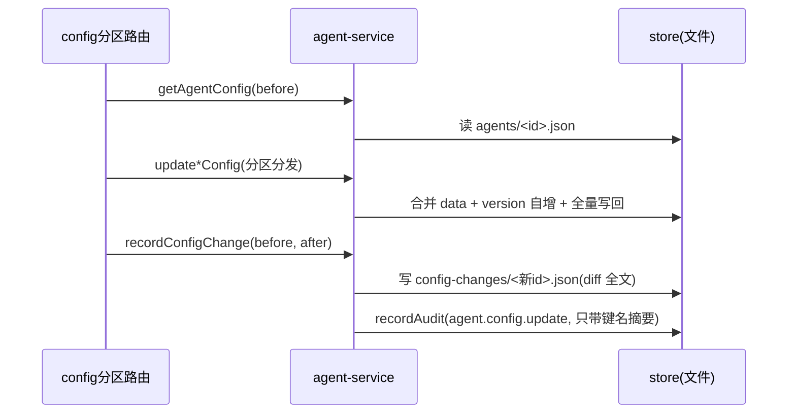

# agent-service

> 深度：standard（分量分 0.548）

## 职责

`apps/web/lib/services/agent-service.ts` 是 Agent 主资源（CRUD）与 4 分区配置的读写层，共 11 个导出函数，分四组：

1. **主资源 CRUD**：listAgents（[agent-service.ts:37](apps/web/lib/services/agent-service.ts#L37)）、getAgent（[agent-service.ts:62](apps/web/lib/services/agent-service.ts#L62)）、createAgent（[agent-service.ts:78](apps/web/lib/services/agent-service.ts#L78)）、updateAgent（[agent-service.ts:115](apps/web/lib/services/agent-service.ts#L115)）、deleteAgent（[agent-service.ts:140](apps/web/lib/services/agent-service.ts#L140)——软删除，置 ARCHIVED）
2. **分区配置读写**：getAgentConfig（[agent-service.ts:150](apps/web/lib/services/agent-service.ts#L150)）+ 四个 update*Config 薄封装（[agent-service.ts:176-190](apps/web/lib/services/agent-service.ts#L176-L190)），实际逻辑集中在私有函数 updateConfigPartition（[agent-service.ts:158](apps/web/lib/services/agent-service.ts#L158)）
3. **配置变更留痕**：recordConfigChange（[agent-service.ts:197](apps/web/lib/services/agent-service.ts#L197)）写 config-changes 明细并同步记审计
4. **出口形状统一**：withProductGroup（[agent-service.ts:23](apps/web/lib/services/agent-service.ts#L23)）把 productGroupId 补齐成完整产品组对象

## 设计原理

**配置分区是 Agent 文件内的内嵌字段，不是独立资源。** 4 个分区（prompt/knowledge/tools/routing，类型定义见 [agent-service.ts:7](apps/web/lib/services/agent-service.ts#L7)）作为 `xxxConfig` 字段存在 agent JSON 里；updateConfigPartition 读整个 agent、合并 data、`version` 自增、打 lastModifiedAt，再全量写回（[agent-service.ts:158-174](apps/web/lib/services/agent-service.ts#L158-L174)）。这是 [store.ts:52-55](apps/web/lib/data/store.ts#L52-L55) 全量覆盖写模型下的自然形态。

**改配置与留痕是两个动作，由路由层编排。** service 只提供原子能力；config 分区路由在 withActor 作用域内先取 before、再调 update*Config、最后 recordConfigChange 记录 before/after diff（[route.ts:60-81](apps/web/app/api/agents/[id]/config/[partition]/route.ts#L60-L81)）。分区回滚路由复用同款编排——其注释自述"本质 = 用历史快照 PUT 一次配置"（[route.ts:38](apps/web/app/api/agents/[id]/config/[partition]/rollback/route.ts#L38)）。

**双写留痕各有分工。** recordConfigChange 写 `data/config-changes/<id>.json`（diff 明细），同时经 recordAudit 记全局行为流，audit 侧注释明确两者互补：审计流回答"谁在何时做了什么"，配置 diff 回答"具体改了什么"（[audit-service.ts:10-13](apps/web/lib/services/audit-service.ts#L10-L13)）。

**列表出口统一补齐产品组。** createAgent/updateAgent 会写入内嵌 productGroup，但种子数据与部分读路径只有 productGroupId，列表页"所属产品组"会渲染成占位符——withProductGroup 的 docstring 记录了这个动因，并声明"保证四个出口的数据形状一致"（[agent-service.ts:17-22](apps/web/lib/services/agent-service.ts#L17-L22)）。

## 关键决策

| # | 决策 | 动因与证据 |
|---|------|-----------|
| 1 | deleteAgent 不真删，置 ARCHIVED | 实现见 [agent-service.ts:140-148](apps/web/lib/services/agent-service.ts#L140-L148)，审计动作名用 `agent.archive`（[agent-service.ts:146](apps/web/lib/services/agent-service.ts#L146)），路由响应语也是"Agent 已归档"（[route.ts:44-45](apps/web/app/api/agents/[id]/route.ts#L44-L45)） |
| 2 | createAgent 校验产品组存在，初始配置全空 | 产品组不存在抛 NotFoundError（[agent-service.ts:83-87](apps/web/lib/services/agent-service.ts#L83-L87)）；初始 4 分区为 null、skillBindings 空数组、_count 归零（[agent-service.ts:101-107](apps/web/lib/services/agent-service.ts#L101-L107)） |
| 3 | changedBy 从 actor context 取，不再硬编码 | recordConfigChange docstring 明确记录（[agent-service.ts:192-196](apps/web/lib/services/agent-service.ts#L192-L196)），配合 [context.ts:1-9](apps/web/lib/context.ts#L1-L9) 的占位式 actor 机制 |
| 4 | 审计明细里只带 diff 摘要（键名清单），不嵌全文 | details 里放 added/removed/changed 的键名列表（[agent-service.ts:222-226](apps/web/lib/services/agent-service.ts#L222-L226)），完整 before/after 存 config-changes 文件 |
| 5 | getAgent 聚合视图带 PENDING releases 与最近 5 个版本 | [agent-service.ts:66-75](apps/web/lib/services/agent-service.ts#L66-L75) |

## 依赖

import 全集见 [agent-service.ts:1-5](apps/web/lib/services/agent-service.ts#L1-L5)：store（持久层）、getActor（操作者）、NotFoundError/ValidationError（错误体系，其中 ValidationError 导入后未使用，见已知坑第 3 条）、recordAudit（横向服务依赖，详见 [audit-service.md](audit-service.md)）、computeJsonDiff（recordConfigChange 的 diff 计算，[agent-service.ts:205](apps/web/lib/services/agent-service.ts#L205)）。

反向依赖（路由层调用方）：

| 路由 | 调用的函数 | 锚点 |
|------|-----------|------|
| GET /api/agents | listAgents | [route.ts:15-21](apps/web/app/api/agents/route.ts#L15-L21) |
| POST /api/agents | createAgent | [route.ts:35-37](apps/web/app/api/agents/route.ts#L35-L37) |
| GET /api/agents/[id] | getAgent | [route.ts:13-14](apps/web/app/api/agents/[id]/route.ts#L13-L14) |
| PUT /api/agents/[id] | updateAgent | [route.ts:28-30](apps/web/app/api/agents/[id]/route.ts#L28-L30) |
| DELETE /api/agents/[id] | deleteAgent | [route.ts:44](apps/web/app/api/agents/[id]/route.ts#L44) |
| GET/PUT /api/agents/[id]/config/[partition] | getAgentConfig + update*Config + recordConfigChange | [route.ts:39](apps/web/app/api/agents/[id]/config/[partition]/route.ts#L39)、[route.ts:61-79](apps/web/app/api/agents/[id]/config/[partition]/route.ts#L61-L79) |
| POST /api/agents/[id]/config/[partition]/rollback | 同上（回滚编排） | [route.ts:77-100](apps/web/app/api/agents/[id]/config/[partition]/rollback/route.ts#L77-L100) |

## 暴露接口

| 函数 | 签名要点 | 行为摘要 |
|------|---------|---------|
| `listAgents(params)` | skip/take/status/productGroupId/search | store.queryList 过滤 + updatedAt 倒序 + 分页（[agent-service.ts:37-60](apps/web/lib/services/agent-service.ts#L37-L60)） |
| `getAgent(id)` | 不存在返回 null（非抛错） | 聚合 PENDING releases + 最近 5 个 versions |
| `createAgent(input)` | name/productGroupId 必填 | 校验产品组 → 建 DRAFT agent → 记审计 |
| `updateAgent(id, input)` | name/description/status 部分更新 | 展开合并 + 刷 updatedAt + 补 productGroup |
| `deleteAgent(id)` | 软删除 | 置 ARCHIVED + 记 `agent.archive` |
| `getAgentConfig(agentId, partition)` | 四分区通读 | 不存在分区字段返回 null（[agent-service.ts:155](apps/web/lib/services/agent-service.ts#L155)） |
| `updatePromptConfig` / `updateKnowledgeConfig` / `updateToolsConfig` / `updateRoutingConfig` | 薄封装 | 全部委托 updateConfigPartition |
| `recordConfigChange(agentId, partition, before, after, changeNote?)` | diff 全文落盘 | 写 config-changes + 记审计，返回 change 对象（[agent-service.ts:207-228](apps/web/lib/services/agent-service.ts#L207-L228)） |

## 数据流

分区配置更新的完整链路（含双写留痕）：

## 排查指南

| 症状 | 先看哪里 |
|------|---------|
| 列表页"所属产品组"显示为空 | withProductGroup 未命中：productGroupId 在 settings/product-groups.json 里无对应项时返回 null（[agent-service.ts:28-34](apps/web/lib/services/agent-service.ts#L28-L34)） |
| 创建 Agent 报 404"产品组不存在" | createAgent 的前置校验（[agent-service.ts:83-87](apps/web/lib/services/agent-service.ts#L83-L87)），先确认 settings/product-groups.json 种子 |
| 配置 version 数字不连续或回退 | updateConfigPartition 用 `Number(existing.version) || 0` 再自增（[agent-service.ts:167](apps/web/lib/services/agent-service.ts#L167)）——version 非数字（如字符串脏数据）时会从 0 重新起算 |
| PUT 配置成功但 config-changes 无记录 | 留痕由路由层编排（[route.ts:79](apps/web/app/api/agents/[id]/config/[partition]/route.ts#L79)）；绕过该路由直接调 service 的路径不会有 config-change |
| 想找回"已删除"的 Agent | deleteAgent 是软删除，文件还在 data/agents/ 下，status 已置 ARCHIVED（[agent-service.ts:144](apps/web/lib/services/agent-service.ts#L144)） |
| 列表分页/搜索不符合预期 | 过滤与排序全在 store.queryList（[store.ts:107-122](apps/web/lib/data/store.ts#L107-L122)），search 只匹配 name 与 description（[agent-service.ts:47-53](apps/web/lib/services/agent-service.ts#L47-L53)） |

## 已知坑

1. **读-改-写无并发保护。** updateConfigPartition 与 updateAgent 都是"读整个 agent → 内存合并 → 全量覆盖写回"（[agent-service.ts:158-174](apps/web/lib/services/agent-service.ts#L158-L174)），并发写同一 agent 时后写者覆盖前写者，且各自 recordConfigChange 的 before/after 与实际落地序列不保证一致。单机演示场景可接受，多操作者同时编辑同一 Agent 的分区时需人工协调。
2. **withProductGroup 在列表路径是逐行读文件。** 它每次调用都完整读一遍 settings/product-groups.json（[agent-service.ts:24-27](apps/web/lib/services/agent-service.ts#L24-L27)），listAgents 对每页每条 agent 各调一次（[agent-service.ts:59](apps/web/lib/services/agent-service.ts#L59)）——一页 20 条就是 20 次同文件读取。数据量大时列表接口会明显变慢。
3. **ValidationError 导入未使用。** import 处引入（[agent-service.ts:3](apps/web/lib/services/agent-service.ts#L3)）但全文无调用点，属遗留导入，阅读时不要据此推断本服务有入参校验逻辑（校验在路由层 schemas 完成）。
4. **getAgent 的 versions 只取最近 5 条。** 详情页聚合做了 `.slice(0, 5)` 截断（[agent-service.ts:70-73](apps/web/lib/services/agent-service.ts#L70-L73)），完整版本历史要走 versions 路由（全量返回，见 [release-service.md](release-service.md) 已知坑第 5 条）。两处行为不同，前端按需选对入口。
