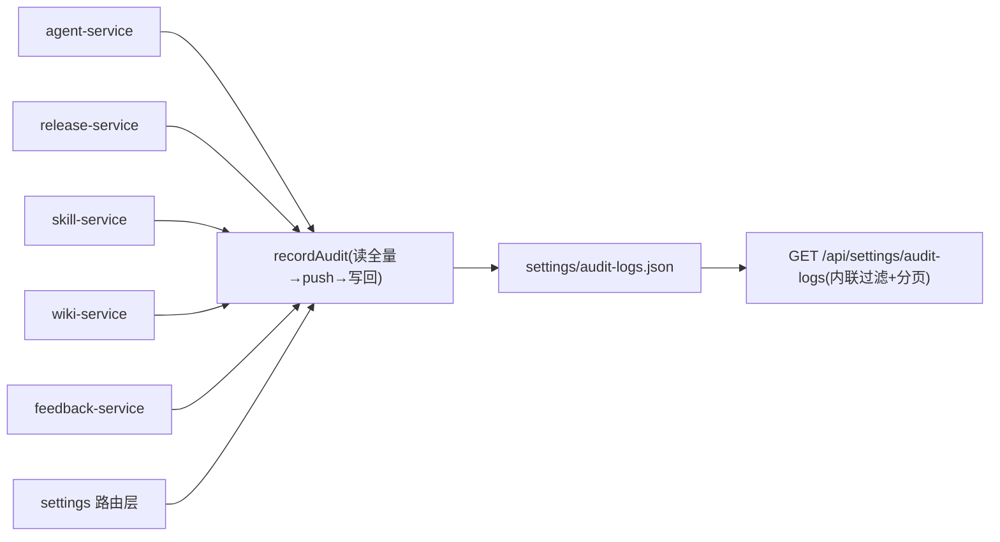

# audit-service

> 深度：standard（分量分 0.439）

## 职责

`apps/web/lib/services/audit-service.ts` 是全局行为审计流，只有两个导出函数：

1. `recordAudit(action, resource, resourceId, details?)`：追加一条审计记录，fire-and-forget 语义（[audit-service.ts:37](apps/web/lib/services/audit-service.ts#L37)）
2. `listAudit(filters?)`：按 action / resource / resourceId 过滤、按时间倒序返回（[audit-service.ts:70](apps/web/lib/services/audit-service.ts#L70)）

它是全平台被依赖面最广的服务之一：agent / release / skill / wiki / feedback / effectiveness 六个 service 与 settings 下三个路由都在写操作后调用它，所有记录落在单一文件 `data/settings/audit-logs.json`（[audit-service.ts:27](apps/web/lib/services/audit-service.ts#L27)）。

## 设计原理

**单文件 append-only 数组。** 记录体结构见 AuditLogEntry（[audit-service.ts:16-25](apps/web/lib/services/audit-service.ts#L16-L25)）；头注释声明采用数组结构是"与现有种子兼容"的取舍（[audit-service.ts:7](apps/web/lib/services/audit-service.ts#L7)）。追加的实现是"读全量数组 → push → 整体写回"（[audit-service.ts:56-58](apps/web/lib/services/audit-service.ts#L56-L58)），底层走 [store.ts:141-144](apps/web/lib/data/store.ts#L141-L144) 的全量覆盖写。

**fire-and-forget：审计失败不回滚业务。** docstring 写明动因"审计失败不应让业务写操作回滚"（[audit-service.ts:33-36](apps/web/lib/services/audit-service.ts#L33-L36)）；写失败时 catch 住只打日志（[audit-service.ts:55-65](apps/web/lib/services/audit-service.ts#L55-L65)，测试环境下连日志都不打）。因此 recordAudit 永不抛错，调用方无需 try/catch。

**actor 在写入时点做快照。** 记录里固化的是 `userName` 与 `userRole` 字符串（[audit-service.ts:49-50](apps/web/lib/services/audit-service.ts#L49-L50)），来自 getActor()（[audit-service.ts:43](apps/web/lib/services/audit-service.ts#L43)）——即请求头解析出的临时身份（[context.ts:29-39](apps/web/lib/context.ts#L29-L39)），缺省 system。头注释点明这一步"彻底替代此前散落硬编码的 system"（[audit-service.ts:8](apps/web/lib/services/audit-service.ts#L8)）。

**与配置 diff 明细分工。** 头注释用两行讲清边界：本服务回答"谁在何时做了什么"；agent-service 的 recordConfigChange 写 config-changes 目录、回答"具体改了什么"（[audit-service.ts:10-13](apps/web/lib/services/audit-service.ts#L10-L13)，详见 [agent-service.md](agent-service.md)）。

## 关键决策

| # | 决策 | 动因与证据 |
|---|------|-----------|
| 1 | 审计失败静默吞掉 | docstring 动因（[audit-service.ts:33-36](apps/web/lib/services/audit-service.ts#L33-L36)）+ catch 块注释（[audit-service.ts:59-60](apps/web/lib/services/audit-service.ts#L59-L60)） |
| 2 | 记录里固化 name/role 快照而非引用 | 审计是历史事实，不随主数据改名而变（[audit-service.ts:49-50](apps/web/lib/services/audit-service.ts#L49-L50)） |
| 3 | 单文件数组而非一事件一文件 | 兼容现有种子数据（[audit-service.ts:7](apps/web/lib/services/audit-service.ts#L7)）；代价见已知坑第 3 条 |
| 4 | details 可选展开写入 | 无 details 时不产生空字段（[audit-service.ts:52](apps/web/lib/services/audit-service.ts#L52)） |

## 依赖

import 全集仅两项（[audit-service.ts:1-2](apps/web/lib/services/audit-service.ts#L1-L2)）：store（readArray/writeArray/generateId/now）与 getActor。没有 import errors——它不抛错，也不校验入参。

反向依赖（recordAudit 的全部调用点，按模块归组）：

| 调用方 | 代表动作 | 锚点 |
|--------|---------|------|
| agent-service | agent.create / agent.update / agent.archive / agent.config.update | [agent-service.ts:111](apps/web/lib/services/agent-service.ts#L111)、[agent-service.ts:219](apps/web/lib/services/agent-service.ts#L219) |
| release-service | release.submit / release.approve 等 / agent.rollback | [release-service.ts:125](apps/web/lib/services/release-service.ts#L125)、[release-service.ts:328](apps/web/lib/services/release-service.ts#L328)，详见 [release-service.md](release-service.md) |
| skill-service | skill.create / skill.bind / skill.unbind 等 | [skill-service.ts:100](apps/web/lib/services/skill-service.ts#L100)、[skill-service.ts:165](apps/web/lib/services/skill-service.ts#L165) |
| wiki-service | wiki.vault.* / wiki.page.* | [wiki-service.ts:58](apps/web/lib/services/wiki-service.ts#L58)、[wiki-service.ts:187](apps/web/lib/services/wiki-service.ts#L187) |
| feedback-service | feedback.create / feedback.update | [feedback-service.ts:115](apps/web/lib/services/feedback-service.ts#L115)、[feedback-service.ts:160](apps/web/lib/services/feedback-service.ts#L160) |
| effectiveness-service | version.effectiveness.computed | [effectiveness-service.ts:167](apps/web/lib/services/effectiveness-service.ts#L167) |
| settings 路由层（不经 service） | product_group.create / permission.create / role.* | [route.ts:32](apps/web/app/api/settings/product-groups/route.ts#L32)、[route.ts:29](apps/web/app/api/settings/permissions/route.ts#L29)、[route.ts:31](apps/web/app/api/settings/roles/route.ts#L31) |

## 暴露接口

| 函数 | 签名要点 | 行为摘要 |
|------|---------|---------|
| `recordAudit(action, resource, resourceId, details?)` | 同步、永不抛错 | 组装条目 → try 写入 → 失败仅打日志；返回组装好的条目（无论落盘与否，[audit-service.ts:66](apps/web/lib/services/audit-service.ts#L66)） |
| `listAudit(filters?)` | 三个可选过滤键 | createdAt 倒序（[audit-service.ts:81](apps/web/lib/services/audit-service.ts#L81)）；无分页 |

## 数据流

读侧只有一条路：审计日志页走 GET /api/settings/audit-logs，该路由直接读文件并内联实现过滤、排序、分页（[route.ts:14-22](apps/web/app/api/settings/audit-logs/route.ts#L14-L22)），没有经过 listAudit（见已知坑第 1 条）。

## 排查指南

| 症状 | 先看哪里 |
|------|---------|
| 明明做了操作，审计流里没有记录 | recordAudit 吞错设计（[audit-service.ts:55-65](apps/web/lib/services/audit-service.ts#L55-L65)），查服务端日志关键字 `[audit] recordAudit failed`；确认 data/settings/ 目录可写 |
| 记录的 userName 与实际操作者对不上 | actor 来自请求头 x-actor-*，未传时缺省"系统/system 角色"（[context.ts:29-39](apps/web/lib/context.ts#L29-L39)）；路由层若漏了 withActor 包裹，全程记为 system |
| 按 action 过滤搜不到 | action 命名有两套约定：service 层点分小写（agent.create），settings 路由层下划线（product_group.create，[route.ts:32](apps/web/app/api/settings/product-groups/route.ts#L32)） |
| 按用户 ID 查不到记录 | 路由的 userId 别名过滤（[route.ts:18](apps/web/app/api/settings/audit-logs/route.ts#L18)）只能命中数据里本就有 userId 字段的旧记录；运行时写入的条目只有 userName/userRole（[audit-service.ts:49-50](apps/web/lib/services/audit-service.ts#L49-L50)） |
| 接口报"数据文件损坏" | 数组文件被手工改坏时 readArray 抛结构化 AppError（[store.ts:131-138](apps/web/lib/data/store.ts#L131-L138)），修复 JSON 后恢复 |

## 已知坑

1. **`listAudit` 无生产调用方，docstring 与实际不符。** 函数注释声称"供 GET /api/settings/audit-logs 与测试使用"（[audit-service.ts:69](apps/web/lib/services/audit-service.ts#L69)），但该路由直接读文件并内联实现同款过滤排序，还多出 listAudit 不支持的 userName/userId 过滤（[route.ts:14-18](apps/web/app/api/settings/audit-logs/route.ts#L14-L18)）。改审计查询逻辑时要以路由层为准，两处需人工同步。
2. **审计记录不含操作者 ID。** 条目只固化 userName 与 userRole（[audit-service.ts:49-50](apps/web/lib/services/audit-service.ts#L49-L50)），actor.id 在组装时被丢弃——同名不同人的操作在审计流里无法区分，追责场景只到"名字"粒度。
3. **每次追加都是全量重写。** 读全量数组 → push → writeArray 整体覆盖（[audit-service.ts:56-58](apps/web/lib/services/audit-service.ts#L56-L58)），审计流越长写放大越明显，且与其他写操作一样无并发保护——两个请求同时写审计时后写者会覆盖前写者的条目（读-改-写竞态）。
4. **静默失败无告警通路。** 写失败只走 console.error 且测试环境连日志都省略（[audit-service.ts:61-64](apps/web/lib/services/audit-service.ts#L61-L64)），系统层面没有审计丢失的度量；对"审计完整性有硬要求"的场景需另行补监控。
