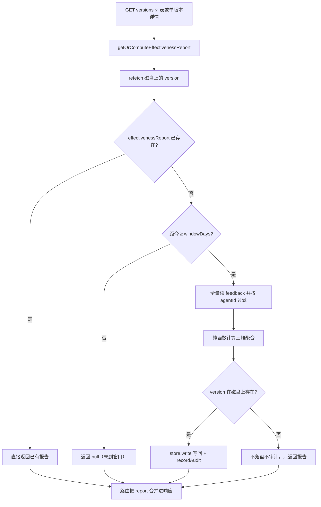

# effectiveness-service

> 深度：standard（分量分 0.312）

## 职责

`apps/web/lib/services/effectiveness-service.ts`（单文件 175 行）只做一件事：为已发布的 Version 生成一份「发布后 N 天窗口内效果如何」的结构化报告 EffectivenessReport，并通过 lazy fill 写回 `version.effectivenessReport`。头注释完整声明了策略（[effectiveness-service.ts:4-27](apps/web/lib/services/effectiveness-service.ts#L4-L27)）：lazy fill 的触发条件与取舍（[effectiveness-service.ts:10-13](apps/web/lib/services/effectiveness-service.ts#L10-L13)）、幂等语义（[effectiveness-service.ts:14-15](apps/web/lib/services/effectiveness-service.ts#L14-L15)）、默认 7 天窗口（[effectiveness-service.ts:16-17](apps/web/lib/services/effectiveness-service.ts#L16-L17)）、报告字段清单（[effectiveness-service.ts:19-26](apps/web/lib/services/effectiveness-service.ts#L19-L26)）。

生产入口只有两个，且都是 GET 路由：版本历史列表对每个 version 逐个调用（[route.ts:33-37](apps/web/app/api/agents/[id]/versions/route.ts#L33-L37)），单版本详情调用一次（[route.ts:28](apps/web/app/api/agents/[id]/versions/[versionId]/route.ts#L28)）。两个路由的 docstring 都明示了 GET 带写副作用这一事实（[route.ts:12-14](apps/web/app/api/agents/[id]/versions/route.ts#L12-L14)、[route.ts:11](apps/web/app/api/agents/[id]/versions/[versionId]/route.ts#L11)）。

## 设计原理

**Lazy fill 而非定时任务。** 头注释明示"不引入 cron / 定时任务"，把"发布满 7 天"这个时间条件转嫁到读路径：GET version 时若 `publishedAt` 距今 ≥ `windowDays` 且 `effectivenessReport` 为空，现场计算并写回，优点零运维、缺点首读触发计算（[effectiveness-service.ts:10-13](apps/web/lib/services/effectiveness-service.ts#L10-L13)）。代价不只是首读延迟——读接口同时获得了写副作用（坑 1）。

**纯函数与 IO 分离。** 聚合逻辑收在 `computeEffectivenessReport`（[effectiveness-service.ts:79-122](apps/web/lib/services/effectiveness-service.ts#L79-L122)），docstring 明示"不读 store，不写副作用，纯计算。便于单测"（[effectiveness-service.ts:70-73](apps/web/lib/services/effectiveness-service.ts#L70-L73)），时间基准 `now` 可注入（[effectiveness-service.ts:77](apps/web/lib/services/effectiveness-service.ts#L77)）。测试直接打纯函数并注入固定时间（[effectiveness.test.ts:70](apps/web/app/api/__tests__/effectiveness.test.ts#L70)、[effectiveness.test.ts:74](apps/web/app/api/__tests__/effectiveness.test.ts#L74)）。

**窗口语义。** `windowEnd = publishedAt + windowDays`，用 `setDate` 在本地时区上加天数（[effectiveness-service.ts:86-88](apps/web/lib/services/effectiveness-service.ts#L86-L88)）；只统计 `publishedAt <= submittedAt <= windowEnd` 的 feedback（[effectiveness-service.ts:90-95](apps/web/lib/services/effectiveness-service.ts#L90-L95)），且 `agentId` 必须匹配（[effectiveness-service.ts:92](apps/web/lib/services/effectiveness-service.ts#L92)）。

**三维聚合，未知枚举值静默丢弃。** 按 rating（POSITIVE/NEGATIVE/NEUTRAL，零值常量 [effectiveness-service.ts:56](apps/web/lib/services/effectiveness-service.ts#L56)）、severity（[effectiveness-service.ts:57-62](apps/web/lib/services/effectiveness-service.ts#L57-L62)）、targetPartition（PROMPT/KNOWLEDGE/TOOLS/ROUTING，[effectiveness-service.ts:63-68](apps/web/lib/services/effectiveness-service.ts#L63-L68)）各聚合一桶；循环体用 `in` 成员检查后递增（[effectiveness-service.ts:101-111](apps/web/lib/services/effectiveness-service.ts#L101-L111)），不在枚举内的值不进任何桶也不报错。

**幂等短路。** 报告已存在则直接返回、不再计算（[effectiveness-service.ts:142](apps/web/lib/services/effectiveness-service.ts#L142)）。写回之后这份报告被永久冻结，见坑 3。

## 关键决策

| # | 决策 | 动因与证据 |
|---|------|-----------|
| 1 | lazy fill 零运维，不引 cron | 头注释自述取舍（[effectiveness-service.ts:10-13](apps/web/lib/services/effectiveness-service.ts#L10-L13)）；版本历史页访问频率低所以可接受 |
| 2 | 纯函数 / IO 分离 | `computeEffectivenessReport` 不碰 store、`now` 可注入（[effectiveness-service.ts:70-78](apps/web/lib/services/effectiveness-service.ts#L70-L78)），单测无需 mock |
| 3 | 默认窗口 7 天 | `DEFAULT_WINDOW_DAYS`（[effectiveness-service.ts:29](apps/web/lib/services/effectiveness-service.ts#L29)），覆盖"版本上线一周后的效果窗口"（[effectiveness-service.ts:16-17](apps/web/lib/services/effectiveness-service.ts#L16-L17)） |
| 4 | 判断前先 refetch disk | 注释明示解决「同 test 内连续两次调用导致重复算」与并发竞态（[effectiveness-service.ts:134-139](apps/web/lib/services/effectiveness-service.ts#L134-L139)）；测试验证连续两次调用只算一次（[effectiveness.test.ts:146-147](apps/web/app/api/__tests__/effectiveness.test.ts#L146-L147)） |
| 5 | 只在磁盘上存在该 version 时写回 | `if (onDisk)` 包住 store.write 与 recordAudit（[effectiveness-service.ts:161-172](apps/web/lib/services/effectiveness-service.ts#L161-L172)），纯内存传入的 version 算完不落盘 |

## 依赖

import 全集两项（[effectiveness-service.ts:1-2](apps/web/lib/services/effectiveness-service.ts#L1-L2)）：

- **store**（数据层）：读 `versions/<id>.json`（[effectiveness-service.ts:135-138](apps/web/lib/services/effectiveness-service.ts#L135-L138)）与全量 `feedback` 列表（[effectiveness-service.ts:154-156](apps/web/lib/services/effectiveness-service.ts#L154-L156)）；写回 version 文件（[effectiveness-service.ts:162-166](apps/web/lib/services/effectiveness-service.ts#L162-L166)）。
- **recordAudit**（审计流）：写回成功后记 `version.effectiveness.computed`，details 含 agentId / totalFeedbacks / windowDays（[effectiveness-service.ts:167-171](apps/web/lib/services/effectiveness-service.ts#L167-L171)）。审计署名取 `getActor()`（[audit-service.ts:43](apps/web/lib/services/audit-service.ts#L43)）——两个调用路由都未用 withActor 包裹，所以这类记录的操作者恒为 SYSTEM_ACTOR「系统」（[context.ts:18-22](apps/web/lib/context.ts#L18-L22)）。

反向依赖（全部调用点）：

| 调用方 | 用法 | 锚点 |
|--------|------|------|
| app/api/agents/[id]/versions/route.ts | 版本历史逐 version 循环调用 | [route.ts:4](apps/web/app/api/agents/[id]/versions/route.ts#L4)、[route.ts:33-37](apps/web/app/api/agents/[id]/versions/route.ts#L33-L37) |
| app/api/agents/[id]/versions/[versionId]/route.ts | 单版本详情调用一次 | [route.ts:4](apps/web/app/api/agents/[id]/versions/[versionId]/route.ts#L4)、[route.ts:28](apps/web/app/api/agents/[id]/versions/[versionId]/route.ts#L28) |
| app/api/__tests__/effectiveness.test.ts | 纯函数 + lazy fill + API 集成三层测试 | [effectiveness.test.ts:4-5](apps/web/app/api/__tests__/effectiveness.test.ts#L4-L5)、[effectiveness.test.ts:116](apps/web/app/api/__tests__/effectiveness.test.ts#L116)、[effectiveness.test.ts:179](apps/web/app/api/__tests__/effectiveness.test.ts#L179) |
| `app/(dashboard)/agents/[id]/page.tsx`（L462） | 前端注释：效果标签只在满 7 天后由 API 端 lazy fill | 路径含 Next.js 路由组括号 `app/(dashboard)`，圆括号会截断链接目标解析，标准 file:line 链接引用无法表达该路径，故用内联标注 |

## 暴露接口

| 函数/类型 | 签名要点 | 行为摘要 |
|------|---------|---------|
| `computeEffectivenessReport(version, allFeedbacks, options?)` | 纯函数，调用方负责把 feedback 过滤到该 agent（窗口过滤内部还会再按 agentId 过滤一次，[effectiveness-service.ts:92](apps/web/lib/services/effectiveness-service.ts#L92)） | 返回 EffectivenessReport；不读 store、不写、不抛错（[effectiveness-service.ts:79-122](apps/web/lib/services/effectiveness-service.ts#L79-L122)） |
| `getOrComputeEffectivenessReport(versionIn, options?)` | 带 IO 的入口 | 返回 EffectivenessReport 或 null（null 仅一种含义：未到窗口，[effectiveness-service.ts:151](apps/web/lib/services/effectiveness-service.ts#L151)）；满足条件时写回 version 并记审计（[effectiveness-service.ts:130-175](apps/web/lib/services/effectiveness-service.ts#L130-L175)） |
| `DEFAULT_WINDOW_DAYS` | 常量 7 | [effectiveness-service.ts:29](apps/web/lib/services/effectiveness-service.ts#L29) |
| `EffectivenessReport` | 9 字段类型 | totalFeedbacks / byRating / bySeverity / byPartition / computedAt / versionPublishedAt / windowDays（[effectiveness-service.ts:31-39](apps/web/lib/services/effectiveness-service.ts#L31-L39)） |

## 数据流

版本历史路由在 `versions.map` 循环内对每个 version 各走一遍这条链（[route.ts:34-37](apps/web/app/api/agents/[id]/versions/route.ts#L34-L37)），所以一次 GET versions 最坏会触发多轮独立的全量 feedback 扫描（坑 2）。

## 排查指南

| 现象 | 排查路径 |
|------|---------|
| 版本详情页不显示效果标签 | 前端只在 `publishedAt` 距今 ≥ 7 天后展示（`app/(dashboard)/agents/[id]/page.tsx`（L462），路径含路由组括号无法写成标准引用）；先确认已过窗口（未到窗口返回 null，[effectiveness-service.ts:144-151](apps/web/lib/services/effectiveness-service.ts#L144-L151)）；再确认版本历史接口被调用过一次（lazy fill 只在读时触发，没有后台任务兜底） |
| 报告数字与预期不符 | 报告只统计窗口内且 agentId 匹配的 feedback（[effectiveness-service.ts:90-95](apps/web/lib/services/effectiveness-service.ts#L90-L95)）；报告是计算时点的快照且永不重算（坑 3），窗口关闭后新增的 feedback 不会进入；枚举值不在 POSITIVE/NEGATIVE/NEUTRAL、CRITICAL/MAJOR/MINOR/SUGGESTION、PROMPT/KNOWLEDGE/TOOLS/ROUTING 之内的会被静默丢弃（[effectiveness-service.ts:101-111](apps/web/lib/services/effectiveness-service.ts#L101-L111)） |
| 审计流里出现操作者为「系统」的效果报告记录 | 属预期行为：lazy fill 写回会记 `version.effectiveness.computed`（[effectiveness-service.ts:167-171](apps/web/lib/services/effectiveness-service.ts#L167-L171)），由 GET 触发且路由未装配 actor；排查审计时不要把它当成人工操作 |
| 需要强制重算 | 没有重算入口：报告已写回则 `getOrCompute` 直接短路（[effectiveness-service.ts:142](apps/web/lib/services/effectiveness-service.ts#L142)）；只能手工编辑 `data/versions/<id>.json` 删掉 `effectivenessReport` 字段后再 GET |

## 已知坑

1. **GET 产生写副作用，首次读会同时改数据与审计流。** 两个调用方都是 GET 路由（[route.ts:33-37](apps/web/app/api/agents/[id]/versions/route.ts#L33-L37)、[route.ts:28](apps/web/app/api/agents/[id]/versions/[versionId]/route.ts#L28)），首读会触发 store.write + recordAudit。写回本身幂等，但审计流里的 `version.effectiveness.computed` 由浏览行为产生、署名恒为「系统」（[context.ts:18-22](apps/web/lib/context.ts#L18-L22)），与真实操作者无关。
2. **每次计算全量扫 feedback，版本历史页最坏 O(版本数 × feedback 数)。** `getOrCompute` 每次计算都 `store.list("feedback")` 全量读再过滤（[effectiveness-service.ts:154-156](apps/web/lib/services/effectiveness-service.ts#L154-L156)）；版本历史路由对每个缺报告且过窗口的 version 各触发一轮（[route.ts:34-37](apps/web/app/api/agents/[id]/versions/route.ts#L34-L37)）。feedback 随使用持续累积，新 agent 多版本集中过窗口时首读成本线性上涨。
3. **报告写回后永不重算，没有任何失效机制。** `effectivenessReport` 非空即短路（[effectiveness-service.ts:142](apps/web/lib/services/effectiveness-service.ts#L142)）；报告在窗口关闭后计算一次即冻结，此后窗口内新提交的 feedback 永不进入报告——即使重新计算，窗口过滤（[effectiveness-service.ts:90-95](apps/web/lib/services/effectiveness-service.ts#L90-L95)）也只会框定同一区间，而代码根本没有重新计算的路径。头注释只写了幂等（[effectiveness-service.ts:14-15](apps/web/lib/services/effectiveness-service.ts#L14-L15)），「永不重算」这一语义未在注释中声明。
4. **refetch 只防重复算，不防并发双写。** 判断（[effectiveness-service.ts:142](apps/web/lib/services/effectiveness-service.ts#L142)）与写回（[effectiveness-service.ts:162](apps/web/lib/services/effectiveness-service.ts#L162)）之间无锁，并发 GET 可各自通过「缺失」检查并各自写回。纯函数输出相同、store.write 全量覆盖，数据无害（头注释自述「最后写入的胜出」，[effectiveness-service.ts:14-15](apps/web/lib/services/effectiveness-service.ts#L14-L15)）；可见的影响是审计流出现两条 `version.effectiveness.computed`。
5. **磁盘上无该 version 时，计算结果悬空。** store.write 与 recordAudit 都包在 `if (onDisk)` 内（[effectiveness-service.ts:161-172](apps/web/lib/services/effectiveness-service.ts#L161-L172)）：若传入的 versionIn 是内存对象而磁盘上无对应文件，报告照算照返回，但不落盘、不审计，每次调用都重算。生产路由都从 store.read 取 version（[route.ts:19-22](apps/web/app/api/agents/[id]/versions/[versionId]/route.ts#L19-L22)），正常路径 onDisk 恒存在；风险面在未来新增的调用方。
