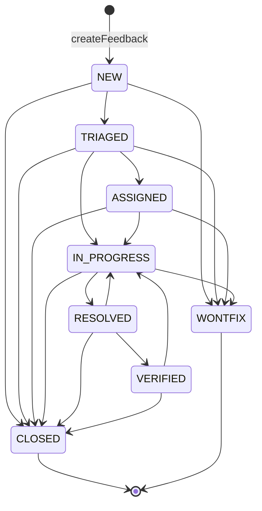

# feedback-service

> 深度：standard（分量分 0.483）

## 职责

`apps/web/lib/services/feedback-service.ts` 管理用户对 Agent 的反馈单生命周期，共 3 个导出函数：

1. `listFeedback`：多条件过滤列表（agentId / status / severity / rating / tag），按 submittedAt 倒序分页（[feedback-service.ts:42-75](apps/web/lib/services/feedback-service.ts#L42-L75)）
2. `getFeedback`：单条详情，不存在返回 null（[feedback-service.ts:77-81](apps/web/lib/services/feedback-service.ts#L77-L81)）
3. `createFeedback` / `updateFeedback`：创建与更新；更新侧内嵌一个 8 状态的显式状态机（[feedback-service.ts:123-165](apps/web/lib/services/feedback-service.ts#L123-L165)）

## 设计原理

**反馈单走显式状态机，转移表是唯一事实源。** 8 个状态定义见 [feedback-service.ts:6-8](apps/web/lib/services/feedback-service.ts#L6-L8)；合法转移全部集中在常量表 ALLOWED_TRANSITIONS（[feedback-service.ts:15-24](apps/web/lib/services/feedback-service.ts#L15-L24)）。头注释交代动因："此前 updateFeedback 不校验转移，可从 NEW 直接跳 VERIFIED"，并声明 CLOSED / WONTFIX 为不可再转的终态（[feedback-service.ts:10-14](apps/web/lib/services/feedback-service.ts#L10-L14)）。校验失败抛 ValidationError，details 里带上 from / to / allowed 三项方便调用方自诊（[feedback-service.ts:29-34](apps/web/lib/services/feedback-service.ts#L29-L34)）。

完整状态机：

（每条边与转移表逐条对应，[feedback-service.ts:16-21](apps/web/lib/services/feedback-service.ts#L16-L21)；RESOLVED 可回退 IN_PROGRESS、VERIFIED 也可回退 IN_PROGRESS，是表里仅有的两条"回退"边。）

**状态驱动的字段副作用集中在一处。** RESOLVED 打 resolvedAt、ASSIGNED 且带 assignedTo 时打 assignedTo/assignedAt、VERIFIED 打 verifiedAt（可选 verificationNote），全部集中在 updateFeedback 的一个分支块（[feedback-service.ts:143-154](apps/web/lib/services/feedback-service.ts#L143-L154)）。

**四个出口的数据形状一致。** withAgentName 给每条反馈补 agent 摘要；listFeedback 处的注释记录了动因——"列表接口漏了 agent 字段，导致反馈中心页读 fb.agent.name 时直接崩溃"，补齐以保证四个出口契约一致（[feedback-service.ts:72-74](apps/web/lib/services/feedback-service.ts#L72-L74)；四个落点分别在 [feedback-service.ts:74](apps/web/lib/services/feedback-service.ts#L74)、[feedback-service.ts:80](apps/web/lib/services/feedback-service.ts#L80)、[feedback-service.ts:120](apps/web/lib/services/feedback-service.ts#L120)、[feedback-service.ts:164](apps/web/lib/services/feedback-service.ts#L164)）。

## 关键决策

| # | 决策 | 动因与证据 |
|---|------|-----------|
| 1 | 状态转移显式校验，拒绝跳跃 | 动因注释（[feedback-service.ts:10-14](apps/web/lib/services/feedback-service.ts#L10-L14)）+ 校验实现（[feedback-service.ts:26-35](apps/web/lib/services/feedback-service.ts#L26-L35)） |
| 2 | 同状态更新放行 | 只改 severity 等字段时不做状态校验（[feedback-service.ts:27](apps/web/lib/services/feedback-service.ts#L27)） |
| 3 | 终态不可再转 | CLOSED / WONTFIX 的转移表为空数组（[feedback-service.ts:22-23](apps/web/lib/services/feedback-service.ts#L22-L23)） |
| 4 | source 固定为 MANUAL | 创建入口当前只有手工提交一条路（[feedback-service.ts:101](apps/web/lib/services/feedback-service.ts#L101)）；sessionData 字段已预留（[feedback-service.ts:90](apps/web/lib/services/feedback-service.ts#L90)、[feedback-service.ts:109](apps/web/lib/services/feedback-service.ts#L109)） |
| 5 | 审计只记状态 from → to | [feedback-service.ts:160-163](apps/web/lib/services/feedback-service.ts#L160-L163)，详见 [audit-service.md](audit-service.md) |

## 依赖

import 全集见 [feedback-service.ts:1-4](apps/web/lib/services/feedback-service.ts#L1-L4)：store（持久层）、getActor（submittedBy 与审计身份）、NotFoundError/ValidationError、recordAudit（横向服务依赖，见 [audit-service.md](audit-service.md)）。

反向依赖：唯一路由入口 GET/POST/PUT /api/feedback（[route.ts:12-29](apps/web/app/api/feedback/route.ts#L12-L29)、[route.ts:43-44](apps/web/app/api/feedback/route.ts#L43-L44)、[route.ts:66-68](apps/web/app/api/feedback/route.ts#L66-L68)）。注意该路由的 PUT 是"body 带 id"的扁平风格，而 releases 审批走的是 path 传 id 的 /api/releases/[id]/review——两套风格并存。

## 暴露接口

| 函数 | 签名要点 | 行为摘要 |
|------|---------|---------|
| `listFeedback(params)` | 5 个可选过滤键 + 分页 | tag 过滤要求 tags 是数组再 includes（[feedback-service.ts:64-66](apps/web/lib/services/feedback-service.ts#L64-L66)） |
| `getFeedback(id)` | 不存在返回 null | 补 agent 摘要后返回 |
| `createFeedback(input)` | agentId/title/content/rating 必填 | 校验 agent 存在（[feedback-service.ts:93-94](apps/web/lib/services/feedback-service.ts#L93-L94)）→ 默认 severity MINOR、status NEW（[feedback-service.ts:106-107](apps/web/lib/services/feedback-service.ts#L106-L107)）→ 记审计 |
| `updateFeedback(id, input)` | 全字段可选 | 状态转移校验 → 状态副作用 → 其余字段展开合并 → 记审计 |

## 数据流

以一次"分配 → 解决 → 验证"的处理流为例：PUT /api/feedback（body 带 id 与 status: ASSIGNED + assignedTo）→ updateFeedback 读当前反馈 → assertTransition 校验 NEW → ASSIGNED 是否合法 → 写 status/assignedTo/assignedAt → 全量写回 → recordAudit 记 from/to。RESOLVED 与 VERIFIED 同理，各自在 [feedback-service.ts:143-154](apps/web/lib/services/feedback-service.ts#L143-L154) 的分支块追加时间戳字段。

## 排查指南

| 症状 | 先看哪里 |
|------|---------|
| 更新报 422"非法状态转移：X → Y" | assertTransition 抛出（[feedback-service.ts:29-34](apps/web/lib/services/feedback-service.ts#L29-L34)），details.allowed 给出当前状态的合法去向；对照状态机图确认路径 |
| PUT 传了 assignedTo 但字段没变化 | assignedTo 只在 status 同步置为 ASSIGNED 时写入（[feedback-service.ts:146-149](apps/web/lib/services/feedback-service.ts#L146-L149)）；单独传会被静默丢弃（见已知坑第 1 条） |
| 反馈已 CLOSED，想重新打开 | 转移表为空，无重开路径（[feedback-service.ts:22-23](apps/web/lib/services/feedback-service.ts#L22-L23)）；severity 等非状态字段在终态后仍可改（同状态放行，[feedback-service.ts:27](apps/web/lib/services/feedback-service.ts#L27)） |
| 列表里 agent 列为空 | withAgentName 未命中：agentId 指向的 agent 已不存在（[feedback-service.ts:37-40](apps/web/lib/services/feedback-service.ts#L37-L40)） |
| tag 过滤传 ALL 查不到数据 | status/severity/rating 三个参数有 "ALL" 豁免（[feedback-service.ts:55-63](apps/web/lib/services/feedback-service.ts#L55-L63)），tag 没有（[feedback-service.ts:64-66](apps/web/lib/services/feedback-service.ts#L64-L66)）——前端需对 tag 单独处理 |
| 创建报 404"Agent 不存在" | createFeedback 的 agent 存在性校验（[feedback-service.ts:93-94](apps/web/lib/services/feedback-service.ts#L93-L94)） |

## 已知坑

1. **assignedTo 与 verificationNote 会被静默丢弃。** 入参类型里声明了这两个字段（[feedback-service.ts:126](apps/web/lib/services/feedback-service.ts#L126)、[feedback-service.ts:129](apps/web/lib/services/feedback-service.ts#L129)），但它们不在通用字段合并列表里（[feedback-service.ts:155-157](apps/web/lib/services/feedback-service.ts#L155-L157) 只处理 severity/resolution/targetPartition）——只有当 status 同步转移到 ASSIGNED / VERIFIED 时才会落盘（[feedback-service.ts:146-149](apps/web/lib/services/feedback-service.ts#L146-L149)、[feedback-service.ts:150-153](apps/web/lib/services/feedback-service.ts#L150-L153)）。单独 PUT `{ assignedTo: "someone" }` 返回 200 但什么都没改。
2. **终态只是状态锁，不是只读锁。** CLOSED / WONTFIX 之后 status 不可再变，但 resolution、severity、targetPartition 等字段仍走通用合并（[feedback-service.ts:155-157](apps/web/lib/services/feedback-service.ts#L155-L157)）可继续修改——依赖"终态即冻结"的调用方会踩空。
3. **tag 过滤参数无 "ALL" 豁免。** 其余三个过滤键都显式跳过 "ALL"（[feedback-service.ts:55-63](apps/web/lib/services/feedback-service.ts#L55-L63)），tag 直接按字面值匹配数组（[feedback-service.ts:64-66](apps/web/lib/services/feedback-service.ts#L64-L66)）；前端若统一传 "ALL" 表示全部，tag 维度将返回空列表。
4. **软关联无外键约束。** targetPartition 只存分区枚举（[feedback-service.ts:91](apps/web/lib/services/feedback-service.ts#L91)），与发布流水线的 Partition 大写枚举同名但无引用校验；反馈指向的分区配置后续被改或回滚，反馈单不会感知（关联解读在 [release-service.md](release-service.md)）。
