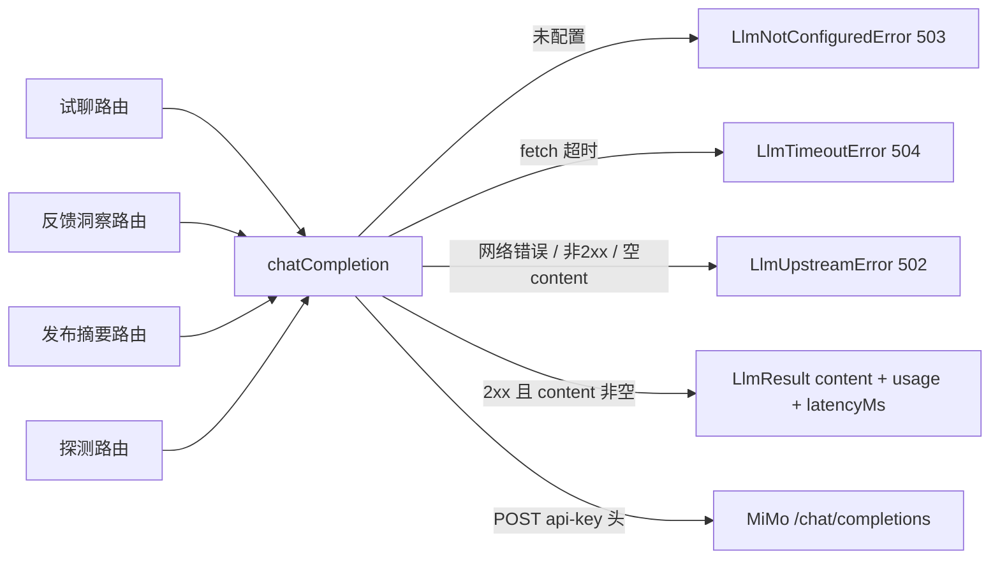

# llm-service

> 深度：standard（分量分 0.379）

## 职责

`apps/web/lib/services/llm-service.ts` 是全平台唯一的 LLM 网关，接入小米 MiMo（OpenAI 兼容协议）。核心是一个函数 `chatCompletion`（[llm-service.ts:67](apps/web/lib/services/llm-service.ts#L67)），外加配置读取（getLlmConfig / isLlmConfigured，[llm-service.ts:55-65](apps/web/lib/services/llm-service.ts#L55-L65)）与三档错误类。它是无状态模块：不读 store、不记审计，纯"请求进、结果出"。

生产调用方共四个路由：Agent 试聊（[route.ts:43](apps/web/app/api/agents/[id]/chat/route.ts#L43)）、反馈洞察（[insight/route.ts:25](apps/web/app/api/feedback/[id]/insight/route.ts#L25)）、发布摘要（[summary/route.ts:62](apps/web/app/api/releases/[id]/summary/route.ts#L62)）、连通性探测（[probe/route.ts:16](apps/web/app/api/maas/probe/route.ts#L16)、[probe/route.ts:24](apps/web/app/api/maas/probe/route.ts#L24)）。

## 设计原理

**凭据走 env，代码零硬编码。** 头注释开宗明义（[llm-service.ts:4](apps/web/lib/services/llm-service.ts#L4)）：MIMO_API_KEY / MIMO_BASE_URL / MIMO_MODEL 三个环境变量（[llm-service.ts:57-59](apps/web/lib/services/llm-service.ts#L57-L59)），未配置时 getLlmConfig 返回空 apiKey、isLlmConfigured 返回 false（[llm-service.ts:63-65](apps/web/lib/services/llm-service.ts#L63-L65)）。baseUrl 会去掉尾部斜杠（[llm-service.ts:58](apps/web/lib/services/llm-service.ts#L58)），防止拼接出双斜杠 URL。

**原生 fetch 直连，不引 SDK。** 头注释的取舍声明（[llm-service.ts:5](apps/web/lib/services/llm-service.ts#L5)）落地为单个 fetch 调用（[llm-service.ts:79-89](apps/web/lib/services/llm-service.ts#L79-L89)），超时用 AbortSignal.timeout 而非手工 timer（[llm-service.ts:88](apps/web/lib/services/llm-service.ts#L88)），默认 120 秒——注释写明"推理模型响应偏慢，给足时间"（[llm-service.ts:52](apps/web/lib/services/llm-service.ts#L52)）。

**三档结构化错误，全部继承 AppError。** 503 = 本侧未配置（LlmNotConfiguredError，[llm-service.ts:30-34](apps/web/lib/services/llm-service.ts#L30-L34)）；502 = 上游故障，涵盖鉴权失败/限流/服务异常/空响应/网络不可达（LlmUpstreamError，[llm-service.ts:37-41](apps/web/lib/services/llm-service.ts#L37-L41)）；504 = 超时（LlmTimeoutError，[llm-service.ts:44-48](apps/web/lib/services/llm-service.ts#L44-L48)）。fetch 层的 TimeoutError 单独识别转 504（[llm-service.ts:91-92](apps/web/lib/services/llm-service.ts#L91-L92)），其余网络错误归 502 并把原始错误消息放进 details.cause（[llm-service.ts:94-96](apps/web/lib/services/llm-service.ts#L94-L96)）。

**对推理模型的 token 余量有显式意识。** 头注释警告：MiMo 的 reasoning_content 会消耗 completion tokens，max_completion_tokens 需给足余量，否则 content 为空（[llm-service.ts:6-7](apps/web/lib/services/llm-service.ts#L6-L7)）。这直接体现在两处：默认预算 2048（[llm-service.ts:53](apps/web/lib/services/llm-service.ts#L53)、[llm-service.ts:85-86](apps/web/lib/services/llm-service.ts#L85-L86)）；空 content 时抛出的错误消息直接点名该成因（[llm-service.ts:119-121](apps/web/lib/services/llm-service.ts#L119-L121)）。

## 关键决策

| # | 决策 | 动因与证据 |
|---|------|-----------|
| 1 | 错误按运维语义分三档 503/502/504 | 客户端可区分"改配置"、"等服务恢复"、"调超时"三种应对（[llm-service.ts:29-48](apps/web/lib/services/llm-service.ts#L29-L48)） |
| 2 | 上游错误响应体截断 300 字符进 details | 防止巨型 HTML 错误页撑爆响应与日志（[llm-service.ts:100-104](apps/web/lib/services/llm-service.ts#L100-L104)） |
| 3 | res.json 解析失败降级为 null，统一走"空内容"分支 | 不单独区分"响应非 JSON"与"choices 为空"（[llm-service.ts:107-118](apps/web/lib/services/llm-service.ts#L107-L118)）；代价见坑 1 |
| 4 | usage 缺字段兜底 0、model 三级 fallback | 上游不回 usage 时返回值仍完整（[llm-service.ts:126-130](apps/web/lib/services/llm-service.ts#L126-L130)） |
| 5 | 鉴权用 `api-key` 头 | MiMo 的约定（[llm-service.ts:81](apps/web/lib/services/llm-service.ts#L81)），与 OpenAI 官方的 Authorization: Bearer 不同，属 Azure 风格 |

## 依赖

import 全集仅一项：AppError（[llm-service.ts:9](apps/web/lib/services/llm-service.ts#L9)）。零 store、零 audit、零 context——全仓库 service 中依赖最少的一个。

反向依赖（全部调用点）：

| 调用方 | 函数 | 锚点 |
|--------|------|------|
| app/api/agents/[id]/chat/route.ts | chatCompletion（试聊） | [route.ts:43](apps/web/app/api/agents/[id]/chat/route.ts#L43) |
| app/api/feedback/[id]/insight/route.ts | chatCompletion（反馈洞察） | [route.ts:25](apps/web/app/api/feedback/[id]/insight/route.ts#L25) |
| app/api/releases/[id]/summary/route.ts | chatCompletion（发布摘要） | [route.ts:62](apps/web/app/api/releases/[id]/summary/route.ts#L62) |
| app/api/maas/probe/route.ts | isLlmConfigured + chatCompletion（探测） | [route.ts:16](apps/web/app/api/maas/probe/route.ts#L16)、[route.ts:24](apps/web/app/api/maas/probe/route.ts#L24) |
| lib/__tests__/llm-service.test.ts | 全部导出 | [llm-service.test.ts:3-9](apps/web/lib/__tests__/llm-service.test.ts#L3-L9) |

外部依赖：MiMo 的 `/chat/completions` 端点（默认 `https://token-plan-cn.xiaomimimo.com/v1`，[llm-service.ts:50](apps/web/lib/services/llm-service.ts#L50)，默认模型 `mimo-v2.5-pro`，[llm-service.ts:51](apps/web/lib/services/llm-service.ts#L51)）。

## 暴露接口

| 函数/类型 | 签名要点 | 行为摘要 |
|------|---------|---------|
| `getLlmConfig()` | 无参 | 读三个 env，返回 {apiKey, baseUrl, model}；baseUrl 去尾斜杠（[llm-service.ts:55-61](apps/web/lib/services/llm-service.ts#L55-L61)） |
| `isLlmConfigured()` | 无参 | 仅检查 MIMO_API_KEY 是否非空（[llm-service.ts:63-65](apps/web/lib/services/llm-service.ts#L63-L65)） |
| `chatCompletion(opts)` | messages 必填；model/maxCompletionTokens/timeoutMs 可选 | 未配置抛 503（[llm-service.ts:74](apps/web/lib/services/llm-service.ts#L74)）；返回 {content, model, usage, latencyMs}（[llm-service.ts:124-133](apps/web/lib/services/llm-service.ts#L124-L133)）；错误三档见设计原理 |
| `LlmNotConfiguredError` | 503 / code INTERNAL | 未设置 MIMO_API_KEY（[llm-service.ts:30-34](apps/web/lib/services/llm-service.ts#L30-L34)） |
| `LlmUpstreamError` | 502 / code INTERNAL，可带 details | 连接失败、非 2xx（附上游 status 与截断 body，[llm-service.ts:101-104](apps/web/lib/services/llm-service.ts#L101-L104)）、空内容 |
| `LlmTimeoutError` | 504 / code INTERNAL | AbortSignal 超时（[llm-service.ts:91-92](apps/web/lib/services/llm-service.ts#L91-L92)） |

## 数据流

全链路无落盘：请求体直接来自调用方组装的 messages，响应体消费完即弃，token 用量与延迟随返回值交给调用方自行处理。

## 排查指南

| 症状 | 先看哪里 |
|------|---------|
| 接口报 503 "LLM 未配置" | MIMO_API_KEY 未设置（[llm-service.ts:57](apps/web/lib/services/llm-service.ts#L57)、[llm-service.ts:74](apps/web/lib/services/llm-service.ts#L74)）；monorepo 子应用的 env 加载范围见部署文档 |
| 报 502 "无法连接 LLM 服务" | 网络/DNS/baseUrl 配错；details.cause 里有原始错误消息（[llm-service.ts:94-96](apps/web/lib/services/llm-service.ts#L94-L96)） |
| 报 502 "LLM 上游错误（HTTP xxx）" | 看 details.status 与 details.body（截断 300 字符，[llm-service.ts:100-104](apps/web/lib/services/llm-service.ts#L100-L104)）；401/429 分别对应鉴权失败与限流 |
| 返回"模型返回空内容" | reasoning tokens 吃满 max_completion_tokens（头注释预警 [llm-service.ts:6-7](apps/web/lib/services/llm-service.ts#L6-L7)，错误点 [llm-service.ts:118-122](apps/web/lib/services/llm-service.ts#L118-L122)）；调大调用方的 maxCompletionTokens |
| 报 504 超时 | 默认 120 秒（[llm-service.ts:52](apps/web/lib/services/llm-service.ts#L52)）；长输出场景传更大的 timeoutMs |
| 想确认 LLM 是否可用 | GET 探测路由看 configured 字段（[probe/route.ts:16](apps/web/app/api/maas/probe/route.ts#L16)） |

## 已知坑

1. **空 content 与响应解析失败被压成同一个 502，且不带 details。** `!json || !content` 一个条件覆盖两种成因（[llm-service.ts:118](apps/web/lib/services/llm-service.ts#L118)）：json 为 null（上游返回非 JSON，[llm-service.ts:107-115](apps/web/lib/services/llm-service.ts#L107-L115)）与 choices 空是两种完全不同的故障，但抛出的 LlmUpstreamError 不传 details（[llm-service.ts:119-121](apps/web/lib/services/llm-service.ts#L119-L121)），客户端无法从错误体区分，排障必须看服务端日志。
2. **默认 max_completion_tokens=2048 对推理模型偏紧。** 该预算是 content 与 reasoning 共享的（头注释 [llm-service.ts:6-7](apps/web/lib/services/llm-service.ts#L6-L7)），调用方不传 maxCompletionTokens 时（[llm-service.ts:85-86](apps/web/lib/services/llm-service.ts#L85-L86)）长输出请求会先被推理耗尽预算、content 为空——错误消息虽点名了成因，但默认值本身没有为推理模型预留余量。
3. **三档错误类的 code 都是 "INTERNAL"。** 三个构造函数传给 AppError 的 code 全是 "INTERNAL"（[llm-service.ts:32](apps/web/lib/services/llm-service.ts#L32)、[llm-service.ts:39](apps/web/lib/services/llm-service.ts#L39)、[llm-service.ts:46](apps/web/lib/services/llm-service.ts#L46)），区分全靠 HTTP status——按 code 做监控聚合或前端分支处理时 502/503/504 会混在一起。
4. **无重试、无熔断，上游抖动直接透传。** fetch 单次直连（[llm-service.ts:79-97](apps/web/lib/services/llm-service.ts#L79-L97)），502/504 原样抛给四个业务路由；限流（429）这类短暂故障也没有退避重试——每个调用方各自决定要不要、如何兜底。
5. **latencyMs 从 fetch 发起前计时，含请求体序列化。** startedAt 在 fetch 之前（[llm-service.ts:76](apps/web/lib/services/llm-service.ts#L76)），返回的 latencyMs（[llm-service.ts:132](apps/web/lib/services/llm-service.ts#L132)）是端到端墙钟时间而非纯上游耗时——用它做上游性能监控会把网络与本侧开销一并计入。
